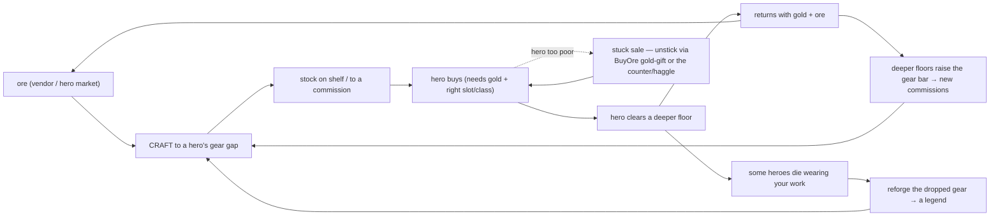

# How You Play Maker's Mark

*The current gameplay loop, documented from three intelligent playthroughs (seed 2026, ~15–18 days each) driven turn-by-turn through the `decisions play` harness — a merchant run, a legend-chaser run, and a hero-patron run. Readable for a human skimming and for a Claude reasoning over it. This is the shared baseline to branch / add-on / improve from. Evidence logs: `runs/decisions/playthrough-*` (returned by the play workers); harness: `sim/GameSim.Cli/DecisionPlay.cs`.*

> **One caveat up front (it shapes several "status" calls below):** these runs were played through the deterministic **text** decision-surface, which enumerates legal actions from `ActionLegality.LegalActions`. That enumerator does **not** offer every implemented verb (the Phase-D sinks, real repricing, the craft-quality minigame). So "never appeared" below means *unreachable through this surface*, which is sometimes a real game truth and sometimes a harness/candidate-generation gap — each row says which. The 3D client is the surface that ships; where it differs, the verb table's last column says so.

---

## The loop in one paragraph

You are the blacksmith. Every day you **turn ore into gear that heroes buy and carry into the Mine** — and the whole game is the feedback spiral that creates: you craft to a hero's need → they buy it → they clear a deeper floor → they bring back loot (gold + ore) → that funds your next craft and deepens demand → some die wearing your work → their gear becomes an heirloom you reforge, and their names + *your maker's mark* end up in the chronicle. The core tension is that you have only **five "production" actions per day** (craft, buy-material, buy-ore, post-bounty share one pool) while the demands on them are unbounded — so playing well is triage: *which* hero's *which* gear gap do you close today, and how do you keep that hero solvent enough to actually buy it. Everything the game is "about" — a merchant getting rich, a smith writing legends, a patron pushing one hero deep — is a different way of spending those same five daily slots.

## The day — five phases

| Phase | What the WORLD does | Your levers | What good play looks like |
|---|---|---|---|
| **Morning** | commissions post; the shop's shopping pass runs; vendor open | Craft, BuyMaterial, AcceptCommission (free), UnlockTalent (free), OpenCounter, PostBounty | Accept every commission (free, tells you what to craft); spend slots on the material/craft that closes a named gear gap |
| **Expedition** | heroes march & fight the upper floors | Craft, Stock (free) | Shelve finished gear so the shopping pass can sell it; craft ammo |
| **Camp** | parties halt at a checkpoint | SendSupply (free), RecallParty (free), Craft | Save a dying party (send a held salve) or bank progress (recall) — rarely needed if no danger signal |
| **ExpeditionDeep** | parties push the deep floors | Craft, Stock (free) | mostly watch; craft toward tomorrow |
| **Evening** | sales resolve; returning heroes offer ore; ledger | BuyOre, Stock (free), HonorMemorial (free), PostBounty | Buy ore (cheap for common; **a gold-gift channel to a specific hero** for exotics); honor the fallen |

## The loop, as a diagram

## The one constraint that governs everything: the 5-slot day

Confirmed independently by all three runs (`sim/GameSim/Contracts/ActionBudget.cs`, `SlotsPerDay = 5`): **Craft, BuyMaterial, BuyOre, and PostBounty draw from a single pool of 5 actions per calendar day**, shared across all five phases, resetting only next Morning. **Free** (unlimited): AcceptCommission, DeclineCommission, Stock, SetPrice, Unstock, UnlockTalent, HonorMemorial, RecallParty, SendSupply, the counter session. This split *is* the strategy layer: the free actions are always taken on sight; the game is really about how you ration those five production slots. A single Tier-3 item needs ~5 material buys → it eats an entire day, forcing a two-day "buy today, craft tomorrow" rhythm that every run hit repeatedly.

## The 25 verbs — role, when it matters, observed status

Status legend: **CORE** (used every run) · **SITUATIONAL** (used when a condition holds) · **FREE-ALWAYS** (unlimited, grab on sight) · **INERT-HERE** (offered but the surface makes it a no-op) · **UNREACHABLE-HERE** (never enumerated by this surface — see caveat).

| Verb | Role | When it matters | Status across the 3 runs |
|---|---|---|---|
| Craft | turn material → gear | every day | **CORE** — the spine |
| BuyMaterial | buy vendor material (Morning) | to feed crafts | **CORE** (slot-gated, 1/slot) |
| Stock | shelve a finished item | after every craft | **CORE** (free) |
| BuyOre | buy ore from a returning hero (Evening) | resupply **+ inject gold into that hero** | **CORE** — the hero-patron's key discovery; cheap for common ore, a luxury markup for exotics |
| AcceptCommission | take a hero's named request | whenever one is open | **CORE / FREE** — guaranteed premium + tells you what to craft |
| UnlockTalent | quality/tier talents | early | **CORE / FREE** — quality talents + tier-2/3 smithing |
| HonorMemorial | rite for a fallen hero | after a death | **SITUATIONAL / FREE** — hollow alone, but *unlocks the legend legibility* (see legend arc) |
| ReforgeHeirloom | reforge a dead hero's gear into a new item | after a death holding your gear | **SITUATIONAL but the signature legend verb** — dumb policy never used it; the legend-chaser used it 6+× as the heart of the run |
| DeclineCommission | refuse a request | when the requester has died | **SITUATIONAL / FREE** — the honest move on a corpse's standing order |
| SetPrice | reprice a shelf item | when a sale is stuck | **INERT-HERE** — the enumerator only ever offers the *current* price, so it can't actually reprice (candidate-gen gap) |
| PostBounty | commission a floor clear | to steer heroes | **INERT-HERE** — only the trivial 1g-escrow candidate is offered |
| Unstock | pull an item back | rare | SITUATIONAL — never needed |
| RecallParty | bank a party before death | a party in danger | SITUATIONAL / FREE — no danger signal ever fired |
| SendSupply | deliver a held salve to a camped hero | a dying party | SITUATIONAL / FREE — support, not a sale (costs ~9g); needs a held field-salve to appear |
| OpenCounter → Present/Suggest/Haggle/Close | stepped haggle service | a sale stuck on price | **SITUATIONAL** — the *only* lever that unsticks a too-poor buyer; appeared for the merchant, not the others |
| SetProfessions | pick profession | day 1 | one-time |
| UpgradeForge | Phase-D gold sink | 400g+ | **UNREACHABLE-HERE** — implemented (`ForgeTierHandlers`), never enumerated even at 513g. **Real candidate-gen gap.** |
| BuyForgeSupply | coal/flux sink | Tier II+ | **UNREACHABLE-HERE** — same |
| MasterworkAttempt | guaranteed Superior+ craft | to beat quality RNG | **UNREACHABLE-HERE** — same; this is the verb that *would* fix the Superior+ wall below |
| CommissionLegendaryWork | guaranteed Masterwork | capstone | **UNREACHABLE-HERE** — same |

## Where the three runs diverged (the real branch points)

| Decision point | Merchant did | Legend-chaser did | Hero-patron did | Why it mattered |
|---|---|---|---|---|
| What to craft | whatever sells + hits a commission | items likely to become heirlooms | the exact gear the advisor says a hero is stalled missing | steers the whole downstream — gold vs. legend vs. depth |
| Stuck sale (buyer too poor) | **OpenCounter → haggle → close** | let commissions self-resolve | **BuyOre gold-gift to that hero** | two totally different unlocks for the same logjam — neither is obvious |
| A hero dies wearing your gear | move on to next sale | **ReforgeHeirloom the dropped gear** → the legend loop | note it, keep pushing survivors | this is the fork between "shopkeeper sim" and "craft writes legends" |
| Surplus gold | pile up (513g, nowhere to spend it) | fund more commissions | inject into heroes' wallets to unstick buys | the merchant proved the faucet works; the patron proved gold is better *spent into heroes* |

**Convergent spine (all three did this):** accept every commission on sight; take every free quality/tier talent; craft to a named gear gap; stock everything; ration the 5 daily slots. That's the irreducible loop.

## What the game pulls you toward vs. what it hides

- **Pulls you toward:** the advisor is a good teacher for the *core* loop — it names the exact stalled hero, gear slot, and quality tier to craft, and following it works (all three runs leaned on it). It also nags relentlessly about memorials.
- **Hides:** the two moves that actually break the game open are **not** advised and easy to miss — using **BuyOre as a gold-gift** to unstick a broke hero (the patron's whole breakthrough) and **OpenCounter/haggle** to unstick a fixed-price sale (the merchant's). Both are the answer to the single most common frustration ("I made the gear, the hero won't/can't buy it"), and the game points at neither.

## The economy + arc, corrected by intelligent play

Two earlier conclusions from *dumb-baseline* data were **wrong** and are corrected here:
- **"The economy is anemic / player always broke."** False under intelligent play — the merchant ran **100g → 513g (5.13×) in 15 days.** The faucet works; the dumb policy just never sold well.
- **"The arc is structurally stuck at floor 4."** Half false — **floor 4 is beatable by skill**: the patron got **5 heroes to floor 4 on the same seed** by closing the gear-gap loop and gold-gifting via BuyOre. What genuinely blocks **Act III / floor 5** is that its gear bar is **Superior+**, and auto-craft only reaches Superior by RNG; the levers that guarantee higher quality (the ActiveCraft **minigame's `PerformanceGrade`**, higher-grade material substitution, or the `Masterwork` verb) are **not exposed by this text surface** — so Act III is **untested, not proven-unreachable.** Its intended path is the 3D forge minigame, which the CLI can't drive.

## The ~6 recurring dilemmas the game is actually made of

1. **Slot triage** — 5 production actions/day vs. unbounded needs; a tier-3 gear-up costs a whole day.
2. **Which hero, which gap** — the advisor names one; you can only close so many.
3. **Craft-for-commission vs. craft-for-shelf** — a commission guarantees a premium but you can't force the named hero to *afford* it.
4. **Gold to yourself vs. gold to a hero** — spending BuyOre to make a hero solvent vs. keeping it for your own materials.
5. **A death: move on vs. reforge** — the fork between a stat-line and a legend.
6. **Reforge vs. restock under scarcity** — the same copper + the same slot serve both "honor the dead's gear" and "keep the shop stocked."

## Branch points — where future work attaches

Each future feature can now be judged in one sentence: *which decision point does it enter, and what new tension does it add?*

1. **Surface the hidden unlocks** (BuyOre-as-gold-gift, the counter) — the game's two best moves are invisible; the advisor should teach them. *(Enters dilemma #3/#4.)*
2. **Fix the candidate-generation gaps** so the surface/advisor can reach the Phase-D sinks, real repricing, and a quality-aimed craft — today a rich merchant's surplus has *nowhere sanctioned to go*, and Act III can't be attempted through anything but the minigame. *(Enters dilemma #1 and the arc.)*
3. **Make quality a lever, not a die roll** — right now hitting Superior+ is RNG on auto-craft; the minigame is the only aim, and it's the sole path to Act III. This is the biggest single blocker on the north star's payoff.
4. **The reforge-heirloom legend loop is the thesis working** — it's currently a happy accident a legend-chaser discovers; make it a first-class, guided arc.
5. **Death-risk visibility at Camp** — SendSupply/RecallParty exist but the blob/HUD gives no hero-HP signal, so the "save your dying hero" beat is unplayable in practice.

---

*Method: `decisions play` harness (deterministic replay of index-choices → JSON decision blob) drove three worker-Claude playthroughs, each with a different intent, all seed 2026 so divergence is strategy not luck. Full designed method: the 2026-07-27 Fable design pass. Harness/candidate-generation caveats above are themselves findings — closing them is branch point #2.*
