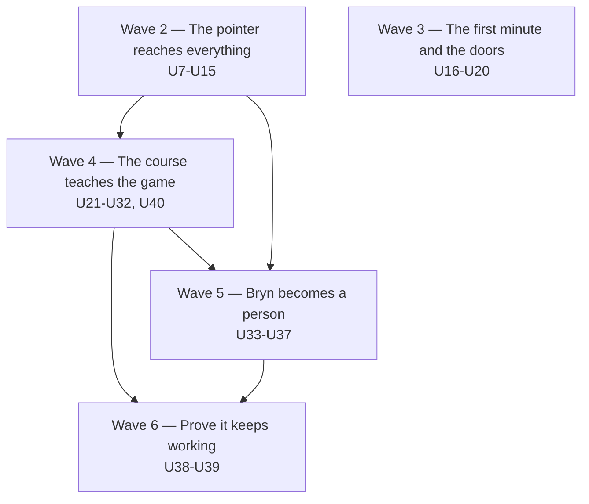
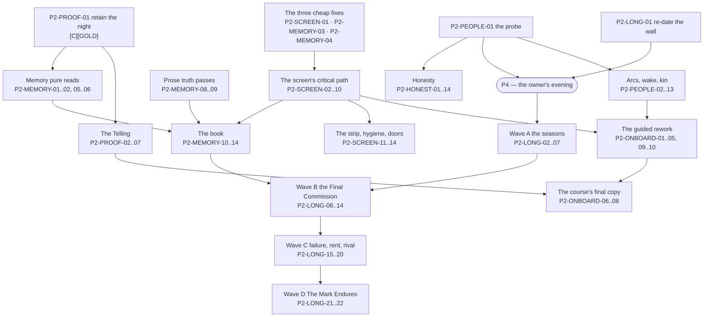

# Maker's Mark

## 1-7 — moved

**What the game is, what it borrows, and how a person plays it now lives in
[`THE-GAME.md`](THE-GAME.md).** It was moved rather than copied: this file is the working
document — the ledger, the open questions, the filter, the plan of record and the review
accounting — and a second copy of the description would be a second thing to keep true.

Sections below keep their original numbers so every existing citation still resolves.

---

## 8. What is built, what is designed, what is wished for

(`docs/registry/SYSTEMS.md` and `CONTENT.md` were cited here as the row-level ledgers. **That
directory does not exist** — removed 2026-08-12. The asset ledger is `docs/design/ASSETS.md`;
everything else is verified against code, not against a registry.) This is the load-bearing
summary, verified against code
on this commit and collided with the source-only control pass (now Appendix A). **A reader should trust these
buckets over any older document, including the registries where named.** The distinction
that keeps biting is BUILT vs **BUILT, CLI-ONLY**: repeatedly, "implemented and tested"
has been reported as "shipped" when no screen could reach it. Under the project's own rule —
DEPLOYED means the Godot client, not the CLI — CLI-only is *not shipped*, and this table
never blurs the two.

### The ledger, at a glance

| Piece | Status | Verify at |
|---|---|---|
| Five-phase deterministic kernel; golden replay + 100-day balance gates; save/load + autosave | **BUILT** | `GameKernel.cs:188-198`; `godot/scripts/CampaignSave.cs` |
| 25 player actions, typed rejections everywhere | **BUILT** — every one has a recorded Godot surface (a *decision* census, not a clickability proof) | `Contracts/Actions.cs` (25 `JsonDerivedType` rows); `godot/tests/ActionReachabilityCensusTests.cs:59`; Appendix A §1 has the per-action table |
| The two-bell day: conducted middle, untimed vigil stop, camp verbs, craft-and-send round trip | **BUILT** (#388, #392) | `godot/scripts/RaidConductor.cs`, `panels/CampPanel.cs` |
| Camp-phase *systems* — anything the vigil actually simulates | **NOT BUILT** — zero registered systems run in Camp | `GameComposition.cs:57-77` |
| Four professions, four interactive crafts, all `ActiveCraft: true` | **BUILT** | `CraftingHandlers.cs:92-120` |
| Forge two acts, session skill, tier-narrowed quench, "forge another like it" | **BUILT** | `ForgeMinigame.cs`, `QuenchMinigame.cs:61-63` |
| Counter: speaking customer, willingness/haggle, goodwill memory | **BUILT** | `CustomerVoice.cs:38`, `HaggleResolver.cs` |
| Commissions across Weapon/Shield/Armor/Consumable/Trinket | **BUILT** | `CommissionSystem.cs:251-288` |
| Heroes: six classes, traits, needs boycotts, bands, XP/level flip, permadeath, memorials, heirlooms, signed works | **BUILT** | `ClassRegistry.cs:84-89`, `TraitDefinition.cs` |
| Hero *behavior* that reads relationships/rivalry (Phase B behavior level; Erenshor M5) | **DESIGNED** | §5.2 — today the edges narrate, never act |
| Attribution beats end to end, plus every reader: ticker, ledger, gossip, provenance, legends wall, chronicle | **BUILT** | `AttributionEngine.cs:19-145` |
| Three venues, banded draw-free routing, per-venue ore ladders (14 of 21 materials priced) | **BUILT** | `VenueRegistry.cs:62-66` |
| Emberfall Foundry | **BUILT AND LIVE** — in `LiveRotation` with committed art and a priced ore ladder (firebrick..heartcoal) | `VenueRegistry.cs:50-64`, `MaterialRegistry.cs:94-105`; shipped by #453 (rung live) + #462 (Foundry art) |
| Economy heartbeats: rent, Guild assessment + Confidence, rival share, destitution floor, bounty D_q + board minimums | **BUILT** | `RentSystem.cs`, `GuildAssessmentSystem.cs`, `BountyRules.cs` |
| The four endgame gold sinks: UpgradeForge, BuyForgeSupply, MasterworkAttempt, CommissionLegendaryWork | **BUILT** (wave U3/U4, 2026-08-07, R2 ruled build). All four now have buttons; all 25 actions have a surface. *Corrected: this row previously said "3 of 4 have bell-tray strings waiting" — it was **2 of 4**. The third `PendingVerbVocab` entry is `SetProfessions`, not a sink, and the other two sinks resolve immediately so they never needed a tray entry — which is precisely why nothing flagged them.* | `godot/scripts/panels/ForgePanel.cs` (Foundry section); `godot/tests/ActionReachabilityCensusTests.cs` |
| Three-act arc: act flips, ending screen (world stays open) | **BUILT** — the ending renders *when it fires*; reachability is unasserted (defect below) and unconfirmed on a real screen | `ArcDirectorSystem.cs`; `panels/ChronicleScroll.cs` |
| The climax's *content* (Final Commission / Warden of the Heart) | **DESIGNED** — `ClimaxReached` fires as a bare seam, by its own admission | `Contracts/Events.cs:293-297`; §9.7 |
| Title/system menus, tutorial, audio pass one, machine playtest harness | **BUILT** | |
| Night leads with the mark (reveal ordering — beats first, sale-and-deed grouped) | **DESIGNED** (loop-plan U5/H3) — cheapest unshipped piece of the answer half | |
| Send-off slate (H4) | **BUILT** (wave U2, 2026-08-07). *Correction: this row was stale — `MineWatch.RumoredLines` and `JourneyStream.DepartureLine` already rendered "X carries your Y" at departure, so the headline passed at HEAD with zero code. What was actually owed, and is now done: the manifest was capped at 2 lines (a party of three each carrying your work silently dropped one), it was buried in a scrolling strip rather than staged as a moment, and it had no honest empty state.* | `godot/scripts/panels/MineWatch.cs` |
| Deep-stakes slate (H5), vigil hero-chips (V-3) | **DESIGNED** (hero-facing-day) — H5 still behind P5/R1, V-3 still behind R1 | |
| Tavern's two acts (commission handshake AM / ore handshake PM) | **DESIGNED — in flight** as PR #393 at this writing | |
| Building-minigames wave (alchemy Draw, tanning Dip, engineering act split) | **DESIGNED** — sequenced after the loop work by its own doc | |
| Demand-hazard engine, demand-gated profession unlocks, Master Voss, Ledger-of-Legends screen | **DESIGNED** (five-pillars Waves 2/4/5) — not started | §9.4 |
| Erenshor M4 (death-cause typing), M5 (rivalry) | **DESIGNED — parked** | |
| Registry manifest enforcement (the ledgers' teeth) | **DESIGNED** — and the ledgers have drifted twice for its absence | |
| Prestige era / soft-fail reset (U-D5) | **WISHED-FOR** — soft-fail latches one event; nothing follows | `GuildAssessmentSystem.cs:25-27` |
| Casters/companions/healer; enchanter/food/husbandry; venue fatigue; monster variants; disasters; vanity economy; fan letters; scrolls; music generation | **WISHED-FOR** — no code, no plan of record; do not assume | |
| The full Legend Engine module (sifter/composer/selector) | **WISHED-FOR / UNRULED** — recommendation on record is retire-the-module, keep-the-promise | §9.2 |

### Corrections to our own documents — do not re-import these errors

Stale claims still sitting in older docs, each one now false in code:

- ~~`docs/registry/SYSTEMS.md` says 2 of 4 professions are wired with `ActiveCraft: false`~~ —
  moot: that registry no longer exists. All four professions are wired and flagged true
  (`CraftingHandlers.cs:92-120`).
- The 07-27 audits' "consumables and trinkets can never be commissioned" root-cause finding —
  **obsolete**: `CommissionSystem.cs:251-288` commissions both (trinkets for Regulars and up).
- The 07-29 state-of-the-game headline table — **stale on three rows**: classes ("3 of 6" →
  six recruitable), venues ("2 of 4" → three live), and save/load ("nothing survives a
  restart" → full save/autosave shipped).
- Any doc describing the Phase-D economy as shipped — **wrong for the client**: sim-complete,
  CLI-only (§9.10).
- ~~Any doc calling Emberfall "art complete" — **wrong**: no committed art at all.~~ **Retracted
  2026-08-12: this correction is itself now wrong.** Emberfall is live with committed art. PR #346
  was CLOSED unmerged on 2026-08-07; the flip shipped via #453 (rung live) and #462 (Foundry art
  through the real SDXL chain). Verified against `VenueRegistry.cs:50-64` and
  `MaterialRegistry.cs:94-105`, not against this document.

### Fixed 2026-08-07 — the defect this document missed entirely

- **The Evening ledger quoted one price and the kernel charged another.** `LedgerModal.cs:211`
  printed the hero's base ask while `OreMarketHandlers` charged the standing-tariffed cost; the
  tariffed number existed client-side only inside the disabled-button affordability gate and never
  reached a label. Whenever faction standing was non-zero, the number on screen and the number
  charged differed. Benign only because standing is positive-only (KTD8) so the surprise was always
  a discount — but a reveal that lies is §10.5's interrupt class, and it sat on the flagship Night
  surface. It also meant **the game's only faction lever had been live and unplayable**: buying a
  faction's ore is the sole thing that raises standing, standing is the sole thing that moves the
  price, and the player could see neither. Fixed in wave U1 (line total, faction named) with U5
  surfacing the cause and the state. The aggregate-vs-per-unit rounding trap is pinned by test.

### Known defects and drift on this commit — recorded, deliberately not fixed in this PR

- **`ActionBudget.ConsumesSlot` is fiction.** The predicate names four slot-consuming action
  types and its test pins "exactly the four" (`Contracts/ActionBudget.cs:26-27`,
  `ActionBudgetTests.cs:18-31`) — but **nine** handlers actually decrement the counter
  (grep `ActionSlotsRemaining - 1`), and no runtime code calls the predicate at all
  (`MarketShareSystem` reads the counter directly). Any surface built on it will
  under-report what spends a slot. One cleanup PR; the test must be rewritten, not appeased.
- **A worn trinket can be sold twice.** The stock check rejects shelving gear a hero wears —
  but only checks Weapon/Shield/Armor and omits Trinket (`Economy/ShopHandlers.cs:59-66`),
  while trinket recipes exist and `GearSet` has the slot. A player-crafted trinket a hero is
  wearing can be re-shelved and sold to a second hero while the first still wears it.
  Compare `HeirloomHandlers.WoreItem`, which includes Trinket. Likely real defect.
- **The balance gate cannot see a missing finale.** Every floor-5/Act-III/Ending assertion
  is a one-sided trivialization ceiling: `FirstFloor5Day` initializes to `int.MaxValue` and
  is only asserted `>= 8` (`BalanceSimTests.cs:45,86-87`), and `ArcBalanceTests.cs:43-52`
  wraps its Act-III and Ending checks in `if (> 0)` — a campaign that never climaxes and
  never ends passes CI green. The one full-length client recording (90 days, 2026-07-27)
  never left Act II; nothing since has re-confirmed Act III on an actual screen. The
  campaign's finale — the arc's whole payoff — is protected by no test. (§11 P3.)
- **Stale comments that lie to readers**: `ProfessionHandlers.cs:16-18` claims the handler
  "is NOT yet wired" (it is — `GameComposition.cs:84`); `CraftingHandlers.cs:8-9` and
  `ShopHandlers.cs:10-11` say "ALL THREE phases" (the day has five); `Actions.cs:149` calls
  HonorMemorial "Evening/Night-legal" (no Night phase exists — it is Evening-only).
- **Vestigial**: `Bounty.Paid` is never set true (payout removes the bounty instead);
  `BeatType.ToolAssist` has no emitter (deliberate contract-ahead-of-content); talent
  points cost nothing ("talent-point economy deferred" — `CraftingHandlers.cs:332`).

Appendix A §7 carries the full dead-and-vestigial list with line cites.

---

## 9. The known tensions and open questions — for the owner to rule on

Each phrased so a one-line answer unblocks work. The first three are the ones sitting
longest without a ruling. The plan of record (§11) sequences the work these rulings gate,
states a default for each, and gathers the ones that touch its critical path into its
Phase 0 (R1–R6) — ruling there rules here. Four of these questions were also ruled on by
the external reviews; where a review's argument was adopted, the question below carries an
"amended" block naming it, and §12 carries the full verdict table.

### 9.1 The Emberfall flip — RESOLVED, shipped 2026-08-11 (PR #346 closed unmerged; #453 + #462 did it)

Emberfall Foundry's *mechanics* are finished — built, banded, comparator-tested. Two things
block a one-line merge, and earlier discussion only ever named the first:

1. **The routing point.** Flipping it live at its original EntryPower 72 tie with Gloomwood
   **collapses Gloomwood from ~64% of all routed parties to ~19%**, handing Emberfall ~41%
   (20-seed × 100-day sweep; the PR body carries the full table — the "61%→18%" figures
   quoted in earlier discussion are the same measurement from a pre-rebase snapshot). Agents
   implemented option B on the branch — EntryPower 79 — which lands Gloomwood at 50.5% and
   Emberfall at 14.6%, and pulls deaths/trade volume back near pre-flip. The material ladder
   (Gloomwood mints grade 8–11 ore, Emberfall 12–16) says strictly-later was the design
   intent.
2. **The art does not exist.** Contrary to what earlier planning notes implied, Emberfall
   has **no committed art at all** — no backdrop, no monster portraits
   (`VenueRegistry.cs:51-60`), and PR #346 touches only sim, tests, and docs. The flip is
   deliberately gated by `VenueBackdropArt_Present_RendersRealArt_NotFallback`, which fails
   on any live venue that renders placeholder — the registry comment exists precisely
   because "finished-looking content that renders as placeholder" has burned this project
   before.

**Question: rule the EntryPower (79 is the implemented recommendation; the curve is measured
at 72/76/78/79/80) *and* either commission the art wave that unblocks the gate, or park #346
explicitly with a note — anything but letting a draft imply the venue is one click away.**

### 9.2 Is the Legend Engine still owed?

The specced `sim/GameSim/Legends/` module (sifter, 8 story shapes, composer, selector) was
never built; its payload shipped piecemeal (attribution + LegendQuery + memorials + signing
+ heirlooms). The recommendation on record since 2026-07-28: **retire the module, keep the
promise**, and let the human feel-test decide — if legends read as logs rather than stories,
the fix is a composer/selector pass over existing data, not the sifter. This is a ruling on
the thing the roadmap called the moat, so it wants an explicit yes/no rather than the
current silence. **Question: retire the specced module (recommended), or keep it on the
books?**

### 9.3 The forge difficulty question (the quench window and the beginner)

The two-act forge measured skilled ~9.7s — under target — but **beginner ~19.5s, virtually
unchanged from the meter it replaced, and the beginner is exactly who complains**. The
obvious knob (global tempo period) was tried and measurably made skilled play *worse* (an
aliasing interaction, documented in PR #381), so the remaining lever is a design choice, not
a constant: most likely a low-accuracy assist on shape-per-strike (bigger progress per
strike when demonstrated accuracy is low — the inverse of the current session-skill rule),
or accepting the beginner duration as the cost of a real skill gap. Related second knob:
whether the tier-narrowed quench band (140/100/70‰) is the right difficulty axis or should
narrow further at the top end. **Question: should a beginner's craft get faster (assist), or
is ~20 seconds an acceptable apprenticeship?**

**Amended 2026-08-06 (external-review lap, §12).** This question now carries a recorded
default: **the assist** — inverse session-skill (bigger shape-per-strike while demonstrated
accuracy is low), which preserves the covenant exactly as the current session-skill rule
does: labor shrinks, the accuracy target never widens. Review C's argument tipped a
long-open question into a default: ~19.5s with the beginner being exactly who complains is
a first-session killer, and first sessions decide whether anyone but the owner ever plays
this. P4 confirms the default rather than reopening the question; the build itself stays in
the cut list's tuning bucket until then.

### 9.4 The demand map — how much of the five-pillars program still stands?

The code has already absorbed the sharpest finding (consumable/trinket commissions exist;
veterans demand quality). What remains unbuilt is the program's keystone: **typed demand
beyond gear slots** — hazards that make heroes need what Tanners and Engineers make, and
professions that unlock when the world starts asking. Until then, measured demand still
skews heavily toward what the Blacksmith sells, and two professions have the newest craft
surfaces in the game with the least reason to use them. **Question: does the demand-hazard
engine (five-pillars Wave 2) stay the next big sim program after the loop wave, or is it
superseded by something in this document's margins?**

**Ruled 2026-08-07 (§11.7.7).** It stays, and it is promoted: the demand-hazard engine becomes a
prerequisite of fluid professions rather than a parallel program. Profession unlocks are
demand-gated story beats, so the engine is now the unlock trigger *and* the demand fix for the
non-blacksmith professions in one piece of work. Sequence it first, or alongside.

### 9.5 The counter vs the atomic pass

The counter is the game's best face-to-face moment and, measured, a worse income channel
than never opening it (the invisible atomic pass out-earned it ~10× in instrumented runs).
The customer speaking first fixed its legibility; its *economics* were deliberately left as
a post-measurement question. One input the ruling should know: within a round, a
counter-offer can never lose the sale (§3.1, `HaggleResolver.cs:124-159`) — the counter's
skill expression today is entirely about mood and goodwill margins, not closing risk, so
"make personal service the premium channel" and "make haggling actually risky" are separate
knobs. **Question: should serving the counter out-earn passive
shelving (making personal service the premium channel), or stay a flavor-equal alternative?
This decides whether we tune willingness/premiums or leave them.**

**Amended 2026-08-06 (external-review lap, §12).** The direction is now ruled by the newly
adopted filter law (§10, test 8 — hand-work must beat passive systems, or the passive system
must not exist): **personal service becomes the premium channel** — better pins, higher
willingness, goodwill compounding into commission premiums. Two consequences, kept separate:
(1) the *tuning wave* is sim-side (willingness/premium math, likely re-baseline) and is
sequenced by R5's queue — it does not displace P1–P6; (2) the *honesty gap* is booked as a
rider now (§11.4): the UI implies "push too hard and lose them" and the resolver says a
counter-offer cannot lose — either the copy tells the truth, or the tuning wave adds a real
walk risk. Staged tension the sim doesn't cash is this project's own named failure class.

### 9.6 The middle of the day — confirm the build order

The hero-facing-day document (§4) is the loop authority, its rule is agreed, and its first
waves are landing (#388, #392, #393). Its ordering asks for: vigil polish (V-3) → night
leads with the mark (U5/H3) → send-off slate (H4) → stakes slate (H5) → morning aim surfaces
(H6) → survivor's handshake (H7) — before any further minigame or content work. **Question:
bless this order (or reorder it), so the next sessions stop re-litigating it.** The plan
(§11) adopts this order with one argued amendment: V-3 moves *behind* the §9.9 ruling,
because #392 already built vigil presentation on the exact signal §9.9 questions, and
polishing that surface further before the ruling deepens the potential rework.

**Ruled 2026-08-07 (§11.7.3–11.7.5).** The order stands, and the standard it is built to changed:
every phase owes a verb that changes an outcome or a surface that reveals the player's stake, and
information arrives through a face rather than a board wherever it can. The middle of the day
gains no intervention verb — live mid-delve delivery is refused for the three reasons in §11.7.5 —
but it gains a second window: the camp speaks first, and deep-bound runs earn a second checkpoint.

### 9.7 The ending, and what "done" looks like

A three-act arc with a climax and an ending exists and fires. Nobody has yet answered
whether it *lands* — that is a feel question. The old plans' richer climax (a Final
Commission forged for a chosen hero, watched at the Heart) exists only as prose. **Question:
after the feel-test, is the shipped ending the v1 ending, or is the Final Commission beat
owed before we call the campaign complete?**

**Amended 2026-08-06 (external-review lap, §12).** Default flipped: **the Final Commission
is owed** (new ruling R6, §11.3). Review C's argument, adopted: the game's thesis is "your
craft writes the legends," and the current climax is a threshold event with a tally
(`ArcDirectorSystem.cs:57-110`; `ClimaxReached` is a bare seam by its own admission,
`Contracts/Events.cs:293-297`) — the ending that pays off the premise is forging one named
piece for one named hero to carry to the Heart. Not before the loop wave; but the campaign
is not "complete" without it, and ruling it now stops later re-litigation. P4 can waive it
only with an unexpectedly strong verdict on the shipped tally-ending.

### 9.8 The human feel-test itself

Still the standing gate in front of several rulings above (9.2, 9.7 explicitly), still not
done: `play.ps1`, a real evening, answering five written questions — do four crafts feel
like four skills; can you name three heroes by personality; does a legend read as a story;
does the ending land; on which day does it get boring. Machine playtests have taken this as
far as they can. **This is not a question so much as the one item only the owner can clear.**

### 9.9 The provisioning irony — is the trap the point?

Both of these are true, both are measured, and both are pinned in the balance suite:

- **Individually, provisioning saves lives, provably.** The attribution engine proves
  `Provisioned` and `PotionLifesave` beats from recorded dice — a delivered salve's
  end-to-end save is demonstrated in a marquee test with zero attribution edits. When the
  ledger says your potion saved Torvald, that is a theorem.
- **In aggregate, provisioning kills.** Blanket salve-stocking raises total party mortality
  **~+35% unstaged / ~+59% staged** across an 11-seed sweep
  (`SalveProvisioningBalanceTests.cs:126-157`), and the camp send verb itself measured
  **+29 deaths and −12 target-reached** over 20 seeds × 100 days
  (`CampProvisioningBalanceTests.cs:23-37`). The mechanism is emergent risk compensation —
  a topped-up hero pushes one floor deeper than they would have dared, and deeper floors
  kill (87% of deaths are below the camp window). Both test files document this in-source
  as "emergent, not a bug."

Meanwhile PR #392 shipped the vigil as *forge the answer, save the hero* — the game's UI
now actively teaches the behavior the balance suite says costs lives at scale. The camp
test's own comment saw this coming: *"retune BEFORE U5 builds presentation on a signal that
currently costs lives at scale."* The presentation is now built; the retune never happened.

Three honest resolutions, each one line:
(a) **Intentional tragedy — keep it, and eventually tell the player.** A game about
influence without control could not ask for a truer theme: your kindness emboldens them,
and boldness is what kills. Gossip and the chronicle could surface it honestly ("the
well-supplied dare too much"). (b) **Balance defect — retune** the knob set (checkpoint
depth / send threshold / fee / the too-hurt quaff rule) until the verb points the way the
fiction says it does. (c) **Split the difference** — keep individual saves as-is, damp only
the risk-compensation push (e.g. the post-floor quaff no longer resets the too-hurt check).

**Question: is the irony intentional (and worth surfacing to the player), or a defect to
retune? One line decides whether the vigil's flagship verb is a tragedy or a bug.**

**Amended 2026-08-06 (external-review lap, §12).** The fork stays the owner's, but it now
carries a recorded default: **(c)**. The argument that tipped a refused-default into a
recommendation, from review C and adopted here: *a tragedy requires a tradeoff.* If
provisioning bought depth at the cost of blood, "your kindness emboldens them" would be a
beautiful theme — but the measurement says supply loses on **both** axes (+29 deaths *and*
−12 target-reached). That is not tragic irony; it is a dominated verb, and the project's own
theater law makes a verb that changes outcomes for the worse strictly worse than theater
(§10, test 8). Option (a) remains available, but it now has to argue against both the camp
test's own in-source comment and an independent reviewer who read the same numbers. Under
(c), individual saves stay provable, only the risk-compensation push is damped, and the
sweep re-runs until supply trades depth against survival — a real dilemma with two goods;
*then* "the well-supplied dare too much" can go into gossip honestly.

### 9.10 The unreachable endgame — do the four sinks get screens, or get cut from v1?

`UpgradeForgeAction`, `BuyForgeSupplyAction`, `MasterworkAttemptAction`, and
`CommissionLegendaryWorkAction` are implemented, tested, balance-integrated, and reachable
only from the console runner — no screen in the shipped client can construct any of them,
though three already have bell-tray strings registered and waiting
(`PendingVerbVocab.cs:31-43`). The plumbing shipped ahead of the buttons, and the buttons
never landed. Consequence: the entire late-game economy loop — the answer to "money with no
meaning" — does not exist where anyone plays, and §9.6's blessed build order does not
mention it. **Question: slot "Phase-D surfaces" into the §9.6 order (and where), or
explicitly defer the endgame economy past v1? Either is a fine answer; today it is silently
neither.**

---

## 10. What "focus" means from here — the filter

The owner's complaint, verbatim: *"very consistently we're doing bug fixes that are only
relevant to particular pieces and ends up almost straying further from the gold of the
game."* The gold is §2 — the chain from your hands to their story. So here is the test, in
the order to apply it, for any proposed unit of work — feature, fix, or content:

**1. The chain test.** Point to the link in §2 this work strengthens. Strengthening means
one of exactly three things:
   - it lets the player *cause* more (a new honest lever on a hero's outcome),
   - it makes an existing cause **visible where the player is standing** (legibility,
     staging, ordering — the current wave), or
   - it protects the substrate the proof depends on (determinism, purity, tests).
   If you cannot name the link, the work is sideways. Park it.

**2. The ledger-line test** (from the hero-facing-day doc, and the sharpest single tool we
have): *point to the line in the Night ledger that is different because the player did this.*
Verbs that occupy hands without touching an outcome are theater — the failure class that has
been caught and cut four separate times (bounty theater, watch-to-buff, gate blessings,
outcome wagers). New surfaces must answer it; new verbs must answer it before they are built.

**3. The premise test.** Does it order a hero, time a decision, or pay out in mood alone?
Then it is not a feature of this game, however fun it sounds. (PKD7; the no-timer law; the
mood-is-influence-only law.)

**4. The honesty test.** Does it show something the sim hasn't decided, or hide something it
has? The middle of the day is undrawn until its tick — surfaces there must stage *stakes*,
never fake *events*. Empty states tick through honestly; costs of skipping are named in
copy, not engineered as punishment.

**5. For bug fixes specifically — the triage rule.** A bug is core-lane work if it breaks a
§2 link (an attribution beat wrong, a craft mis-scored, a reveal that lies, a determinism
break — fix now, before features). Everything else queues behind the current wave and ships
*with* related work in its area, not as interrupt-driven singletons. Three playtest rounds
of scattered fixes did not move the owner's core complaint; the structural waves (#358,
#388) did. That is the empirical case for this rule.

**6. The measurement norm.** Tuning claims come with a sweep, not an adjective (the
EntryPower table, the strike-floor search, the 87.1% camp statistic are the house style).
And playtest findings get checked against the driver before they are believed — six of six
recent "game bugs" were harness bugs.

**7. The deployment clause.** Nothing counts as *done* until the ledger line is producible
in the Godot client by a player at a keyboard. Sim-complete, test-green, CLI-proven is
*ready*, not done — the four Phase-D sinks (§9.10) are the standing monument to what
happens when this clause is skipped: an entire endgame economy reported as built that no
player has ever touched.

**8. The dominance test** *(adopted 2026-08-06 from external review C — §12)*. For any
human verb that has a passive alternative: **hand-work must beat the passive system, or the
passive system must not exist.** This extends test 2 downward: a verb that occupies the
hands without changing an outcome is theater (banned); a verb that changes outcomes *for the
worse* is strictly worse than theater. The review's contribution was to name what our own
documents circled as two separate tuning questions — the counter out-earned ~10× by the
invisible atomic pass (§9.5) and the camp supply run measuring +29 deaths / −12
target-reached (§9.9) — as **one systemic defect: the game teaching players to skip its own
humanity.** Any new human verb answers this test at design time, against the passive
baseline, with a measurement.

### The filter, applied — three real pieces from the last two weeks

This is the calibration that keeps the filter from being a platitude. Applied to three
merged PRs, most recent work first:

- **PR #392 — the vigil states the stakes; craft-and-send made discoverable. PASSES.**
  Chain test: link 2 (the camp runner) made visible where the player stands; ledger line:
  the delivery and its provable `Provisioned`/`PotionLifesave` beat, with "of which yours:
  N" on the slate. It passes — *and* it is the case that shows the filter is not a rubber
  stamp: the balance suite had already measured the celebrated signal pointing the wrong
  way at campaign scale, and the camp test's comment explicitly asked for a retune before
  presentation was built on it (§9.9). The honesty test therefore attaches a condition:
  #392 is finished work that *raises* §9.9's priority rather than settling it. A filter-run
  before building it would have forced the §9.9 ruling first — which is exactly the kind of
  sequencing this document exists to buy.
- **PR #385 — the forge result ceremony ate clicks it never drew over. PASSES,
  interrupt-class.** A §2 link-1 break at the player's own hands: the craft cause existed
  and a surface defect hid the response. Rule 5 says a broken spine link is core-lane,
  fix-now work, and it was correctly treated as such.
- **PR #390 — retire Git LFS. REJECTED.** No hero whose outcome changes, no ledger line, no
  game invariant protected — repo plumbing. It was still worth doing (it removed a real
  operational papercut), and the filter does not forbid it; the filter *books* it. It
  counts as overhead, it may never displace a §2 unit from a work session, and a week whose
  merged list is mostly this class is a week the game did not move — whatever the commit
  count says. This is precisely the "bug fixes only relevant to particular pieces" drift
  the owner named, and the filter's job is to make that visible at the moment of choosing
  the work, not in retrospect.

A one-line summary suitable for pinning above the board:

> **If you can't name the hero whose outcome changes, the ledger line that proves it, or the
> invariant that protects it — it's not the game, it's around the game.**

---

## 11. The plan of record — from the gold outward

Everything above diagnoses; this section decides. It is the answer to the owner's actual
request — *"work this in the core goal so that when we are developing there's a lot more
focus on things"* — and it is written to be argued with: every item carries its reason, its
size, what blocks it, and its §10 filter line; every ordering tie is named with its
tiebreak; and the cut list is as much the point as the path. A session that wants to do
something not on this path must either amend this section (a visible diff) or book the work
as overhead. There is no third option.

**Sizing units**, the ones this project actually works in:
- **a ruling** — one line from the owner; costs nothing, unblocks the most.
- **a session** — one agent session, one branch, one small PR.
- **a wave** — several coordinated sessions/PRs under one design doc.
- **an evening** — the owner at the keyboard; cannot be delegated.
- **a re-baseline** — the golden re-record ceremony; expensive, serialized, never implicit.
  Anything touching `sim/GameSim/Contracts/` additionally requires an orchestrator-authored
  micro-PR (deny-list rule). Both flags are marked below wherever they apply.

### 11.1 The gold, named

**A specific person's fate provably turned on work your hands did — and you were watching
when it happened.** Craft → carry → proof → witness. That is the one thing this game is for;
it is the only thing on this game's shelf that no other game offers (§5.6: any competitor
can build a shop sim; the counterfactual proof chain is unique to this architecture).

Two candidates were considered and rejected as the gold, for the record. *The economy* is
the feeder, not the gold — the audits' "money with no meaning" era proved gold accumulates
happily while the game fails. *Hero autonomy* is the amplifier, not the gold — §5.2 is
honest that the autonomy is five arithmetic rules, and the game moves us anyway, because the
proof layer is what makes those five rules feel like a person. The spine (§2) stands as
written, with one sharpening: the five links are not equally weak. All five are built and
true as *mechanisms* (§2's trace). The game's entire current deficit sits in two places:
the **witnessing** — the staging of links 3–5, where the march is anonymous and the proof
arrives as a Night flood (§2's own caveat) — and the **campaign's far end** — a
question-shortage measured two ways: the menu's own novelty plateaus at median day 25.0
(`P2-LONG-01`, was assumed day 11), but the day's felt routine stops changing far sooner, median
day 12.0 (`P2-LONG-26`) — an unprotected finale, an unreachable endgame economy. The
plan orders by exactly that: first make the existing proof *land*, then verify it lands on
a *human*, then fix the far end.

### 11.2 Where the gold stands, in four sentences

The cause side (Morning) works, by machine measurement. The proof side (the attribution
engine) works, by test. The witnessing is half-staged — the send-off doesn't name your work,
and the Night reveal buries its own headline — and **no human being has ever reported
feeling any of it** (§3.2). Past median day 25.0 the game runs out of genuinely new options
(`P2-LONG-01` re-dates this from the assumed, unmeasured day 11) — but the felt routine stops
changing far sooner, median day 12.0 (`P2-LONG-26`). Past day 30 gold
runs out of meaning on screen, and nothing in CI proves a campaign can end.

### 11.3 Phase 0 — the rulings (owner, one sitting, no code)

Six one-liners. Each names its default so silence has a meaning. R1 was originally a
genuine fork this plan refused to assume — it gates the vigil, the game's most-invested
surface, and each branch sends different work; the external-review lap (§12) argued it into
a recorded default of (c). The fork is preserved in full below for the record, but R1 no
longer needs a line written — see the retirement immediately after it.

**R1 — the provisioning irony (§9.9). RETIRED AS MOOT, 2026-09-03.** The fork, as it stood:
- **(a) It is a tragedy — keep it and surface it.** Consequence: the vigil's flagship verb
  stays measured-harmful at scale *on purpose*; a session adds the honest telling (gossip
  and chronicle lines — "the well-supplied dare too much"); V-3's hero-chips ride along.
  No re-baseline. The game gains its truest theme: your kindness emboldens them, and
  boldness kills.
- **(b) It is a defect — retune.** Consequence: a wave over the knob set (checkpoint depth,
  send threshold, fee, the too-hurt quaff rule) until the verb points where the fiction
  says; **balance re-baseline**; the camp test's own comment asked for this *before* #392
  built presentation on the signal, so this branch is paying an already-incurred debt.
- **(c) Split — keep individual saves, damp only the risk-compensation push** (e.g. the
  post-floor quaff no longer resets the too-hurt check). Consequence: session-to-wave;
  **balance re-baseline**; the theme survives in muted form and the verb stops being a trap.

**Recorded default (2026-08-06, §12): (c)** — a tragedy requires a tradeoff, and a verb that
loses on both measured axes is a dominated verb, not a theme (§9.9's amendment carries the
full argument). That default never got ruled or vetoed; it stayed pending for six weeks. It
does not need to be now, because the evidence it would have been ruled on no longer exists.

**Why it is moot.** R1's whole evidence base was `CampProvisioningBalanceTests`' 2026-07-18
measurement of the camp send verb. `P2-LONG-23` (#678) re-ran the identical A/B on the
current build (`origin/main@e7cca3d5b91deda59ee494e8eae426595c67c1b9`):

| | 2026-07-18 | 2026-09-02 |
|---|---|---|
| NEVER-SEND | deaths 768, exp 3518, targetReached 1234, deliveries 0 | deaths **266**, exp 4328, targetReached 1222, deliveries 0 |
| SEND-BELOW-40% | deaths 797, exp 3523, targetReached 1222, deliveries 62 | deaths **266**, exp 4328, targetReached 1222, deliveries **0** |
| Δ | deaths +29, targetReached −12 | **0, 0 — byte-identical** |

The risk-compensation effect the fork was arguing over is gone, not shrunk and not reversed:
minimum camped-hero HP across 100 days (seed 2026) is now **60%**, so nothing ever reaches
the sub-40% band the send verb targets, and both arms submit the identical action stream.
Sweep-wide deaths fell ~65% over the same six weeks. There is no provisioning irony left to
surface, retune, or split — R1's fork describes a mechanism the current build can no longer
produce. What replaced it is a different, live defect — the send verb's arm never fires at
all — measured as its own unit, `P2-LONG-24` (#703).

**What `P2-LONG-24` (#703) found (2026-09-03), amending the paragraph above.** The full census over the
same 20-seed sweep — 10818 camped-hero observations, not seed 2026's 200 — puts the minimum at
**50%**, not 60%; the 60% figure was a small-sample artifact. And 50% is not where the distribution
happens to stop: it is a **structural floor**. `ResolveStage1` parks only on a raw `TargetReached`,
and the post-floor too-hurt check finalises any party still holding a hero under the drink line
(`CombatMath.ShouldDrink`, 50%), so a camped hero is at or above 50% *by construction*, and nothing
mutates parked HP between the park and the Camp window. The send verb's `<40%` band is an empty
set, not a rare one, and no action stream — scripted or human — can reach it, because the player
has no verb between the fight and the park. The dated cause is **#328** (2026-08-01, the flee-first
ordering fix), which moved that bar from `ShouldFlee` (25%) to `ShouldDrink` (50%) for reasons
unrelated to this verb, lifting the park floor straight through the `[25%,40%)` band the 07-18
sweep harvested its 62 deliveries out of. This makes R1's retirement **stronger**, not weaker: the
tragedy is not merely unmeasurable now, its precondition is unconstructible. Re-aiming the verb so
link 2's sixth decision has two live arms again is `P2-LONG-25`.

**The freeze is lifted, explicitly.** "Until R1 lands, no further vigil work ships" (the
plan's one amendment to §9.6's blessed order, recorded 2026-08-06) is **void as of
2026-09-03**. There is no R1 left to land, and the freeze had already been stepped over
repeatedly in the six weeks it sat unruled — a dead freeze nobody is honouring is worse than
no freeze. Vigil work ships under the plan's normal gates from here, same as every other
surface.

**R2 — the unreachable endgame (§9.10). RULED 2026-08-07: BUILD.** The owner's
instruction — *"get all current recommendations from the docs and items that CLI, but somehow not
in the actually game into the playable game"* — is this ruling, spoken. P6 shipped the same day as
the reachability wave (P6a the Foundry, P6b Masterwork + Legendary), godot-only, no re-baseline.
**All 25 player actions now have a recorded Godot surface**, enforced from here on by a
reflection census (`godot/tests/ActionReachabilityCensusTests.cs`) that fails by name on any
action without a surface or a reasoned exclusion. The alternative — defer past v1 — is no longer
live.

**R3 — Emberfall (§9.1).** Default: **park draft #346 explicitly, past v1.** Record
EntryPower 79 as the ruled routing point on the branch; note that the flip is art-blocked,
that no committed art exists, and that no art pipeline currently exists to produce it. A
parked venue is honest; a four-day-old draft implying one-click readiness is not.

**R4 — the Legend Engine (§9.2).** Default: **retire the module, keep the promise.** The
feel-test (P4) carries the promise as its question three: if legends read as logs, the fix
is a composer pass over existing data, never the specced sifter.

**R5 — bless this plan's order** (subsumes §9.6's question). One line makes this section
the sequencing authority and ends per-session re-litigation.

**R6 — the Final Commission (§9.7; added 2026-08-06 from §12).** Default: **it is owed.**
The campaign is not "complete" while its climax is a threshold event with a tally; the
ending that pays off "your craft writes the legends" is one named piece, forged for one
named hero, carried to the Heart. P9 stays sequenced after P4 — this ruling changes P9's
*status* (owed, not conditional), not its place in line. Ruled now so nobody re-litigates
it later; P4 can waive it only with an unexpectedly strong verdict on the shipped
tally-ending.

### 11.4 The critical path

| # | Item | Size | Blocked by | §10 filter line | Status |
|---|------|------|-----------|-----------------|--------|
| P1 | **Night leads with the mark** (loop U5 / H3): the reveal opens with the attribution beat; sale-and-deed grouped by item | session, godot-only | nothing | Hero: tonight's bearer of your marked item. Ledger line: *is* the item — the beat becomes the opening card | Landed 2026-08-07 (wave U1) |
| P2 | **The send-off names your work** (H4 / Q-1): the departure slate captions which marchers carry your items | session, godot-only | nothing (reads better after P1) | Hero: the named marchers. Ledger line: the antecedent Night points back to | Landed 2026-08-07 (wave U2) — and see the §8 correction: the naive version was already shipped; what was owed was the 2-line cap, the staging, and an honest empty state |
| P3 | **Protect the finale**: two-sided balance assertions (floor 5 *reached* by day ≤N on the main seed; ending *fires* within 100 days) + one scripted full-length client run confirming Act III on the real HUD | session, tests-only | nothing | Invariant: the campaign has an end. (Chain-test clause 3 — protect the substrate) | Landed 2026-08-10 (forward-ladder L0-L7, closes draft #413). Venues are a forward ladder now; routing keys on `Hero.LadderRank`, not the power latch that stranded parties. Two-sided and green on the main seed (rung-0 clear day 18, Act III day 18, Climax day 26, Ending day 31) and on the 10-seed sweep (Ending ≤ day 36). See §11.8. The scripted full-length client-HUD run remains open |
| P4 | **The human feel-test** (§9.8): `play.ps1`, one real evening, the five written questions — with the fifth (the boredom day) checked against the wall, now two measured numbers: `P2-LONG-01`'s menu-novelty wall (median day 25.0, 20-seed sweep, was assumed day-11, unmeasured) and `P2-LONG-26`'s felt-routine wall (median day 12.0, same sweep machinery — the sharper predictor of boredom specifically) | an evening (owner) | P1+P2 merged — *with a deadline, not a dependency* (see ties) | Not a build item — the gate that rules 9.3, 9.5, 9.7, confirms R4/R6, and confirms both re-dated walls from the human side | OPEN — **put it on the calendar now** (§12, review C: the bottleneck is the owner, not the agents) |
| P5 | **The vigil branch**: (a) surface the irony, or (b) retune wave, or (c) damp compensation — V-3's hero-chips ride whichever branch wins | (a) session / (b) wave + **re-baseline** / (c) session-wave + **re-baseline** | **R1** | Hero: the camped party. Ledger line: the delivery's `Provisioned`/`PotionLifesave` beat — or the death delta, depending on the branch | BLOCKED (R1) |
| P6 | **Endgame surfaces**: buttons + bell-tray wiring for UpgradeForge, BuyForgeSupply, MasterworkAttempt, CommissionLegendaryWork | ~2 sessions, godot-only | R2 — **RULED: build** | Hero: whoever carries the guaranteed Masterwork. Ledger line: the attempt's cost and the resulting item's beats | Landed 2026-08-07 (wave U3/U4). Dominance measured before shipping the buttons: 17.0% of crafted value flows through purchased attempts at Tier II with a 5000g reserve — hand-work keeps the field. `BaselinePlayer` untouched, no re-baseline |
| P7 | **The day-11 program**: demand-hazard engine + demand-gated profession debuts (five-pillars Wave 2) | **wave + Contracts micro-PRs + re-baseline** — the expensive one; needs its own plan doc written against this section | P4 (re-confirm the question shortage before the biggest spend) | Hero: the one who needs what only a Tanner or Engineer makes this week. Ledger line: the typed demand fulfilled; `BeatType.ToolAssist` finally gets its emitter | BLOCKED (P4) |
| P8 | **Finish the hero-facing day**: H5 stakes slate → H6 morning aims → H7 survivor's handshake | 3 sessions, godot-side | P1/P2 (slate patterns) | Each carries the hero-facing-day doc's own per-item ledger lines | OPEN after P1/P2 |
| P9 | **The Final Commission climax** (§9.7) | wave; likely **Contracts + re-baseline** | P4 (sequencing only — **R6 rules it owed**; P4 can waive it only with an unexpectedly strong verdict on the tally-ending) | Hero: the chosen bearer at the Heart. Ledger line: the commission fulfilled at the climax | OWED (R6), after P4 |

**Ordering ties, named with tiebreaks:**
- **P1 vs P2** — either order works. Tiebreak: P1 first, because it pays off every marked
  item already in the field on the day it ships with zero setup, while P2's payoff is only
  *felt* once Night notices what the send-off staged.
- **P3 vs P1/P2** — parallel (different files, different skills); P3 must land before P7's
  re-baseline so the new assertions guard the retune. If P3's assertions *fail* — the finale
  is genuinely unreachable under baseline play — that is a broken §2 link-5, interrupt-class
  under §10.5, and the plan re-orders around fixing it before anything else ships.
- **P4 now vs P4 after P1/P2** — testing now measures staging debt already diagnosed;
  testing after P1/P2 measures what we do not know. One evening either way; spend it on the
  unknown. **Amendment (§12, review C):** this tiebreak is a deadline, not a dependency —
  P4 goes on the calendar *now*, and if P1/P2 have not merged by the scheduled evening, P4
  proceeds without them. The review's sharpest observation stands on our own record: five
  days and 2,100+ lines of design writing landed while 9.8 sat undone. Every remaining big
  ruling (legends, ending, boredom day) is gated on that one evening; it is worth more than
  the next three PRs, and no further document-writing lap may displace it.
- **P6 vs P7** — if R2 says build, P6 goes first: one-tenth the cost, no re-baseline, and
  P7 needs its own plan ceremony regardless.
- **P5 vs P8's H5** — P5 (the vigil branch) lands before the H5 stakes slate: H5 stages the
  camp signal that R1's branch may retune, and #392 already demonstrated what building
  presentation on an unruled signal costs (§9.9). (Adopted from §12, review C — its one
  insertion into the blessed order.)

**Riders** (small correctness work that never displaces a path item — it rides with the
first session touching its area): the worn-trinket double-sell fix (§8 defects — a §2
link-2 honesty break, sim-side, draw-free so no re-baseline expected); the
`ConsumesSlot` predicate rewrite with its test corrected rather than appeased; the stale
comment sweep (`ProfessionHandlers`, `CraftingHandlers`, `ShopHandlers`, `Actions.cs:149`);
the counter honesty-gap copy fix (§9.5's amendment — the surface stops implying a walk risk
the resolver does not roll, until/unless the 9.5 tuning wave adds a real one).

**Design notes adopted from §12** (bind the items they name, cost nothing today):
- **H5 / D-1 stakes slates state stakes qualitatively — never survival percentages.**
  "This looks dangerous," not "38% wipe risk." Two reasons: interpretation is the player's
  half of the watching (review B's genuinely new nuance), and resolve-at-departure means
  the sim already *knows* the outcome mid-day — a printed number could only lie or leak
  (§10 test 4 applied to arithmetic).
- **The building-minigames wave, when P4 unblocks it, must preserve the thinking-vs-reflex
  contrast across professions** (kinetic forge/engineering vs clockless alchemy/tanning) —
  if every craft becomes fast-twitch, the register warps into a chore simulator (review A's
  one adaptable contribution; the current four crafts already honor it).

### 11.5 The cut list

Focus is made of noes. Each entry names what it is and why it loses.

**Cut outright:**
- **The Legend Engine module** (sifter/composer/selector as specced) — R4 default. The
  payload shipped piecemeal by cheaper routes; the module is machinery in search of a
  problem the feel-test hasn't confirmed exists.
- **The already-refused class, restated so no fresh session re-pitches it:** outcome wagers,
  watch-to-buff, gate blessings, mid-delve intervention verbs, decision timers ("living
  clock"), runtime LLMs in the sim, the full five-need utility engine. All previously ruled;
  all stay dead.

**Deferred past v1, by name:**
- **Emberfall flip + its art wave** (R3 default) — mechanics stay built-inert; EntryPower 79
  recorded; art-blocked with no pipeline to unblock it. Parking is honest; the draft PR gets
  a note saying so.
- **Prestige era / soft-fail consequence (U-D5)** — the soft-fail latch stays a latch.
- **Erenshor M5 rivalry + Phase B behavior level** — hero behavior that *reads* the
  relationship edges it currently only narrates. This is the cut that hurts: it is the one
  item that would make §5.2's autonomy claim materially truer, and this document would
  personally like it built. It still loses, twice over: the filter ranks making the
  *existing* proof felt (P1–P4) above making autonomy deeper, and P7 beats it for the one
  big-sim slot on measured need (the wall is measured — `P2-LONG-01` re-dates it to median
  day 25.0 — shallow autonomy is not).
  **Convergence note (§12.4):** all three external reviews independently push deeper
  individual-hero attachment as the game's long-term engine — the strongest cross-review
  agreement on anything. That triple vote is recorded here as evidence, and it makes this
  cut the named **post-v1 queue leader** — but it still does not displace P7, for the same
  measured reason.
- **Erenshor M4 death-cause typing** — unless P4 flags death reports as illegible.
- **The building-minigames wave** (alchemy Draw, tanning Dip, engineering act split) —
  gated on P4's "do four crafts feel like four skills." One exception may promote: the brew
  puzzle renders its own answer key (§5.1), and if P4 confirms it reads as a form, fixing
  *that one* is a session, not a wave.
- **Counter economics (§9.5) and forge beginner assist (§9.3)** — tuning knobs, not builds;
  both wait for P4's human data. **Amended (§12):** both now carry recorded directions —
  premium-channel for the counter, inverse-assist for the beginner — so P4 confirms a
  default instead of opening a debate; the builds themselves stay deferred and never
  displace a path item.
- **Every §8 wished-for row** — casters/companions/healer, enchanter/food/husbandry, venue
  fatigue, monster variants, disasters, vanity economy, fan letters, scrolls, music
  generation. No code, no plan of record, and now formally: not v1.

**Capped, not cut:** the overhead class — registry manifest enforcement, CI speedups, repo
plumbing (#390's class). Bookable anytime, counted honestly, and never allowed to displace
a path item from a session. A week whose merged list is mostly this class is a week the
game did not move.

### 11.6 The drift defense

The failure mode this plan exists to end: a session picks up whatever is broken in front of
it, fixes it well, and the game moves sideways. Fifteen playtest findings and three rounds
of scattered fixes did not move the owner's complaint; the structural waves did (§10.5).
So, binding rules for every session that touches this repo:

1. **The queue rule.** A session takes the topmost OPEN item on the critical path it is
   capable of. If blocked, take the next unblocked — never an invented sideways item.
2. **The bug rule** (§10.5, made mandatory). A bug found en route: if it breaks a §2 link
   (attribution wrong, craft mis-scored, reveal lies, determinism break, finale
   unreachable), it is interrupt-class — fix now, name the link in the PR. Anything else
   goes to `.claude/tasks/BOARD.md` as a booked line with a one-sentence filter verdict,
   and ships later *with* the next wave in its area. Booking takes thirty seconds;
   drifting takes the week.
3. **The receipt rule.** Every PR description carries one line beginning `Serves:` — the plan
   item it serves (`Serves: P1`, `Serves: P5(a)`), the spine link it defends
   (`Serves: link4`), `Serves: substrate`, or `Serves: overhead — booked`. The literal prefix
   is the point: the merged list of any week is auditable in one grep, which is how the
   hundred-reasonable-PRs erosion in CLAUDE.md rule 12 becomes visible at all. The receipt
   asserts presence, never truth — a false one is a rule-8 lie living in git.
4. **The single-source rule.** This section is the only v1 plan. Status changes land in the
   same PR as the work; re-ordering happens as a visible diff *here*, argued in review —
   never as a fresh planning doc. (P7 gets a subordinate plan doc for its own wave, written
   against this section, when its turn comes.)
   **Both slots are empty and nothing is queued.** A grant is written into this rule by name in the
   same PR that creates the doc, and deleted in the PR that deletes it. The chain of historical
   grants that used to sit here — ten amendments naming eight wave docs, every one of them long
   merged and every one of the eight files absent from `main` — was a record of finished work, and
   rule 8 says that lives in `git log`. The two docs it ended on (a balance baseline plan and an
   honesty-riders plan) were deleted as abandoned: their shipped units landed in #495 and #499, and
   their unshipped ones are booked in §11.14.14 as U48 and U49.
5. **The measurement rule.** When new data contradicts this plan — P4 moves the boredom
   day, P3's assertions fail, a sweep overturns a tuning claim — the plan amends in the
   same PR that lands the finding. A plan that cannot lose an argument with a measurement
   is a wish.

### 11.7 Owner direction — 2026-08-07: experience, phases, narrator, progression

The owner's rulings from the 2026-08-07 review of `THE-GAME.md`. These are decisions, not
suggestions: work proposed from here must trace to a ruling below or to the standing laws in
§11.7.8. Anything tracing to neither gets parked and raised. **Documentation only at the time
of this ruling — no sim changes, no re-baselines, no implementation sequencing yet.**

**11.7.1 The bounty explanation is rewritten, and the phrase is retired.** "A posted bounty is
an order you can buy" is dead. It contradicted influence-never-orders in six words, and that
collision *was* the confusion. Replacement framing: the bounty is the one lever aimed at
**where** they go, and they still choose to take it. The description now walks the four moves —
escrow, their judgment, one hero committing the party, then payout or death or refund
(`THE-GAME.md` §4.5). No mechanical change; copy and documentation only.

**11.7.2 "Small on purpose" is replaced by "narrow now, built to grow."** The game is not small
forever; it is narrow *now* as a focus decision. Every system ships finished rather than
sketched, and the architecture — built-inert content, determinism-gated flips, re-baseline
ceremonies — exists precisely so it can widen later. **Guard, mandatory:** "built to grow" is a
statement about post-v1 sequencing and never a licence for breadth work now. The Completeness
Bar and the §10 filter stand unchanged. A session reading this as permission to start new
content has read it wrong.

**11.7.3 No important information without a face.** Reading boards is boring. Sim information
must be *experienced* — dialogue, scenes, characters — not posted. Boards stay as reference
surfaces; dialogue becomes the delivery. The pattern is already proven twice in-project: the
customer speaks first (CustomerVoice, a read-only derivation from the hero's own state) and the
tavern handshake. Extend that pattern; do not invent a second mechanism.

**The constraint that survives this ruling:** the simulation is *not* reduced or scripted to
achieve it. The sim already computes everything the boards say, and the attribution proof, the
moat and the golden replay all depend on it staying pure. Presentation may stage, select, voice
and pace sim facts. It may never script outcomes or invent facts the sim did not produce.
Scripted moments are made by staging real data, never by faking it.

**11.7.4 Every phase owes the player something to do and a reason to watch.** "Something to do"
means a verb that changes an outcome, *or* a surface that reveals the player's own stake — verb
count for its own sake is the busy-day trap, already named and still banned. The per-phase gaps
adopted as the program: Dawn gets a spoken headline and a one-click path from a gap line to the
forge pre-loaded with the answering recipe; Quest gets item chips on the marchers carrying your
work and one line of conductor copy when a vigil is coming, so crafting during the march stops
being tribal knowledge; Vigil gets trait and relationship chips plus the per-hero survival math
the sim already computes; Deep Vigil gets the stakes slate and item flares on moments that will
become beats (honest, because stage 2 is already resolved when the show plays); Night deals the
reveal as cards with rhythm and previews an heirloom's lineage before committing. Across all of
them, one story threads the day — the same hero and item recurring from the morning headline to
the night card. Continuity of reference is the cheapest large experience win available.

**11.7.5 Reaching into the dark: more windows, not live delivery.** The instinct is right —
reaching into the dark is the game's best feeling. The mechanism of sending items live mid-delve
is refused, because it breaks three load-bearing things at once: raids must stay pure functions
or the attribution proof dies, decisions must stay untimed, and heroes must not become units you
tend. What is adopted instead: **the camp speaks first** — the vigil slate opens with the party's
own ask, derived read-only from their state the same way CustomerVoice is, turning a dashboard
the player evaluates into a request the player answers (zero sim change; this is staging). And
**checkpoints scale with depth** — deep-bound runs earn a second camp, so the best moment fires
twice on exactly the runs where the stakes are highest. Precedent is Darkest Dungeon, which
scales camps with dungeon length while never permitting intervention in a fight. The second
checkpoint is a priced sim unit with a re-baseline, sequenced later. Gate provisioning stays
deferred, built only if telemetry shows heroes systematically under-buying heals.

**11.7.6 The game gains a narrator.** Darkest-Dungeon-style, AI-generated voice, and plausibly
the highest feel-per-cost item on the table because the writing already exists: four frozen
voices, ~1,470 authored lines, a pacing director and a tone law. Rules it ships under:

- **Sparse and triggered, never continuous.** Darkest Dungeon's narrator works because he fires
  on kills, deaths and thresholds. Continuous narration worked once, in a short novelty, and
  would wear immediately here. Trigger set: attribution beats, deaths, depth records, act turns,
  and the vigil stop opening — daily-capped exactly as gossip already is.
- **Voice, not new writing.** The narrator speaks the existing frozen lines and curated additions
  in the same register. The tone law applies unchanged: warm, dry, never grim, never cute; deaths
  with dignity.
- **One primary voice for v1.** All four text voices stay; one gets the microphone first.
- **Pipeline, mandatory shape: generate → human-curate → freeze.** Lines are generated at content
  time, reviewed, and committed as static audio. Runtime *selection* stays deterministic from real
  events. This preserves the frozen-voices discipline, the golden replay, and testability.

**Shipping note (verified 2026-08).** Steam's AI disclosure policy separates pre-generated content
that ships with the game from content generated at runtime. Baked voice lines are pre-generated —
a disclosure checkbox and a brief description. Runtime generation requires documented guardrails
and carries platform risk. One more independent reason the standing refusal of runtime LLMs in the
sim is correct, and it is reaffirmed here.

**11.7.7 Progression becomes fluid, and unlocks are demand-gated.** Long-run "pick a profession"
does not hold. The player accumulates disciplines across a campaign — blacksmith, then alchemy
early, then later disciplines — giving the mid-game more to open. Refinements that ship with it:

- **Unlocks are story beats, not menu picks.** A profession opens when the world starts needing
  it: *three heroes came back poisoned from Gloomwood; the town needs an alchemist.* This promotes
  the five-pillars demand-gated design already on the books, and makes every unlock an event in
  the town's story, which is this game's grammar. The typical order can still follow the owner's
  ladder, since demand tracks venue progression anyway.
- **The demand-hazard engine is a prerequisite, not a nice-to-have.** Measured demand already
  skews blacksmith under pick-2; adding professions to a world that only asks for swords
  multiplies the "newest surfaces, least reason to use them" problem. Sequence demand first, or
  together — this rules §9.4.
- **Enchanting is probably a graduation, not a fifth pipeline.** The modifier layer — quench oils,
  runes, fittings, behaviour-shifting and slot-exclusive — is already proto-enchanting. Grow that
  layer into the discipline rather than building a new pipeline. Spellcrafting is genuinely
  net-new content; it parks post-v1 behind the same demand engine.
- **Identity guard.** Pick-2 created build identity. Accumulation must preserve who-you-are
  through mastery depth — talents, tiers, the mark's reputation — so "I do everything" does not
  flatten into "I am nothing in particular."
- **The governor already exists.** The five-slot day rations output, so more professions deepen
  the daily triage decision instead of multiplying busywork. Keep the budget; it is what makes
  breadth playable.
- **Determinism note.** Each unlock is a content flip — a determinism event with a re-baseline
  ceremony, same as a venue go-live. Plan them as such.

**11.7.8 The laws none of the above weakens.** Influence never orders; no timers on decisions;
every verb changes an outcome or reveals the player's stake; show only what the sim decided;
sim purity and determinism; no runtime LLMs in the sim; skipping stays legal and its cost is
named in copy, never engineered.

**11.7.9 What this changes about sequencing.** The demand-hazard engine rises — it is now both
the unlock trigger for 11.7.7 and the demand fix for the non-blacksmith professions, in one
program. The narrator is the standing highest feel-per-cost candidate. The second checkpoint is
a priced sim unit for a later wave. The 11.7.3 and 11.7.4 staging items are zero-sim and
art-light, and can interleave with anything.

**11.7.10 Open, for the owner.** Which of the four voices gets the microphone first, and does the
pacing director or the event type decide when text falls back to voice? Is the second checkpoint
at a fixed floor or derived from the target? Is enchanting-as-graduated-modifiers accepted, or is
a distinct pipeline owed for feel? Does spellcrafting make v1.x at all? And how many disciplines
should one campaign realistically open — all of them, or most-but-not-all, so campaigns differ?

**11.7.11 Accuracy must keep mattering: the forge's forgiveness scales, it never erases — ruled
2026-09-03, superseding the mastery pin of the same date.** *(Later than this section's 2026-08-07
batch, and unlike that batch this one does authorize a sim change and a re-baseline; it lives here
because §11.7 is the standing owner direction CLAUDE.md points every session at.)* **What was
measured:** across 20 seeds x 100 days under two OPPOSITE talent-pacing policies — `handforge`
(greedy, the mastery chain bought as early as prerequisites allow) and `latemastery` (deferred,
both mastery nodes held behind every other node the tree offers) — the Anvil-Map minigame's
accuracy stopped changing the grade by about day 6 under BOTH, i.e. for 94% or more of every
campaign in every seed, zero exceptions. **The collapse is structural, not a policy artifact:** two
opposite unlock orders converging on the same day-6 collapse rules out the schedule as the cause,
and the real cause is arithmetic. `ForgeScorer` applied every forgiveness axis SUBTRACTIVELY with a
zero floor — `max(0, dev - forgiveness)` — so every deviation at or under the accumulated
forgiveness scored *identically* to a flawless one. That is a dead zone, and it is the whole
mechanism: talents were never compressing the skill range, they were deleting the bottom of it, and
once Master's Touch and Legendary Craft both landed the dead zone covered the entire error band a
real hand operates in. **The ruling: a bad swing must still cost you at day 50. Talents must not
erase the skill range** — they raise your FLOOR, while accuracy still determines your CEILING. So
forgiveness scales the penalty instead of erasing it, which preserves strict ordering at every
talent level (a better swing always scores better, forever, and no talent stack can ever flatten
the slope) while paying mastery in the shape a safety net should have: the same mistake costs a
master less than a novice, and the gap widens the worse the swing gets. Two constraints bind any
future re-tune of this curve. Talents must stay clearly worth unlocking — a master must visibly
out-earn a novice on the identical swing — and late crafting must not become punishing: the goal is
that skill keeps mattering, not that the game gets harder. This supersedes the "talents are
mastery, and mastery means certainty" ruling `ForgeMasteryPinTests` recorded earlier the same day;
that pin is rewritten to the new property, never softened. It does not settle the premium-rarity
question in `P2-OQ9` — the top-grade pay bonus is retuned as its own unit, calibrated against the
distribution this change produces, never against the one this change invalidates.

### 11.8 The finale is unreachable — measured 2026-08-08, root cause found

P3's assertions were written and went red on their first run. This is not a test that needs
tuning. It is the finding P3 existed to produce, and under §11.6 rule 2 it is interrupt-class:
a §2 link-5 break, since a campaign with no end has no memory to end with.

**The measurement.** 100-day `BaselinePlayer` runs, 11 seeds, then 44 runs across four scripted
policies of increasing competence. Every single run: floor 3 by day 3-4, **floor 4 by day 3-5,
and floor 5 never**. Act II by day 4, **Act III never, Climax never, Ending never**. Not
borderline — unanimous, and identical across a baseline smith and a smith crafting Masterworks
every day, which is what rules out "the harness under-plays it."

**Root cause: the Gloomwood routing trap.** Gloomwood's `EntryPower` is 72
(`sim/GameSim/Venues/Gloomwood/GloomwoodVenue.cs:92`), which sits *between* the Mine's floor-4
gate (60) and its floor-5 gate of 100 (`sim/GameSim/Venues/VenueRegistry.cs:107`).
`VenueRouter.IsBetter` (`sim/GameSim/Venues/VenueRouter.cs:101-125`) permanently prefers the
highest band a party has reached — so the moment a party's power crosses 72, every future trip
routes to Gloomwood, a venue with **only four floors**. The party is now strong enough to be
taken out of the five-floor venues and can never be routed back, because the only return path
is `PostBountyAction` and no shipped scripted policy ever posts one.

A second mechanism compounds it: `ApplyCompetenceRetreat`
(`sim/GameSim/Expedition/ExpeditionResolver.cs:405-426`) caps each hero at +1 floor per trip, so
by the time a hero earns floor-5 eligibility her power has usually already tripped the reroute.

**Ruled out.** `ArcDirectorSystem` is not miscalibrated — it reads a legitimate venue-agnostic
signal at the intended threshold and faithfully reports a depth the expedition layer never
produces. And the old "BaselinePlayer refuses 90% of legal crafts" finding is **stale**: it was
fixed in #328 and measured at zero craft rejections across all 44 runs. Any doc or task still
asserting it should be corrected, not repeated.

**The fix is an owner decision, because every option is a balance lever and each implies a
re-baseline.** Three, with the tradeoff named:
1. **Raise Gloomwood's `EntryPower`** above the practical floor-5 power band — stops the four-floor
   venue stealing parties that should be finishing a five-floor one. Cleanest fix for the trap
   itself; changes which venue mid-power parties see, and §11.5's parked Emberfall decision
   already shows how sensitive venue share is to this number.
2. **Lower the floor-5 gate** on the Mine and the Sunken Crypt. Smallest diff, but it treats the
   symptom: the trap still exists, it just becomes survivable.
3. **Give the router a real return path** for veteran parties. Most faithful to the design, most
   work, and it needs a rule for when a party chooses to go back.

Two harness gaps should be fixed alongside whichever lever wins, because they are why the read
was murky: `BaselinePlayer` submits one craft a day against a five-slot budget, and never sets
`CraftAction.PerformanceGrade`, which caps every scripted craft below the Fine-plus breakpoint
(`sim/GameSim/Crafting/QualityRoller.cs:147-173`). Neither is the cause — fixing both still never
reached floor 5 — but both distort every balance number the repo currently records.

**A note on the instrument.** `tools/Analytics` reported 15 anomalies over the same runs, all LOW
or MEDIUM, and **none of them was "the campaign never ends."** An anomaly detector that cannot
see a missing ending is a detector reporting on the weather inside a burning building. Whatever
lever wins, the analytics pass owes an arc-completion check.

**Ruled 2026-08-10 — none of the three levers; the signal itself was wrong.** The owner:
*"Powerful party's should NOT go back? They should continue to the next dungeon which adds more
features/unlocks for the player."* And on the red gate's siblings: *"you are overcomplicating
the balance tests, just do what's more fun for the player."* Venues are a **forward ladder** —
graduation by beating a venue's bottom floor increments a monotonic `Hero.LadderRank`, routing
keys on rank instead of the power high-water latch, and oscillation becomes impossible by
construction rather than by tuning. Each rung unlocks blacksmith-facing features (ore tiers,
recipes, factions, news); the arc re-anchors so Act III is the last dungeon opening and the
Climax is its deepest floor; the Mine stays alive through the recruit trickle, the Forge's own
ore hunger, and the bounty's refusable back-steer — nothing new built there. The salve and
money-supply tests are re-framed to assert what a player feels. Lever 1 was already measured
dead before this ruling (Gloomwood `EntryPower` 90: reachability 0 of 4385 party-ticks, 7 tests
broken, not merged); the ruling supersedes the remaining two. The wave of record:
`docs/plans/2026-08-10-003-feat-the-forward-ladder-plan.md`, which also carries §11.5's parked
Emberfall decision (the flip is rung 2's go-live; the #92 share-collapse measurement becomes
obsolete when venue share is stage-keyed instead of threshold-keyed).

**Resolved 2026-08-10 (L0-L7).** The ladder shipped: rank-keyed graduation and routing (L0-L2),
all three rungs' gates characterized and set from measurement rather than guessed (L3-L4), the
arc re-anchored onto `Hero.LadderRank` (L5), and the finale gate itself re-pinned two-sided and
green (L6, closing draft #413). On the main seed a full `BaselinePlayer` campaign now clears rung
0 (floor 5) by day 18, opens Act III the same day, reaches its Climax by day 26, and Ends by day
31; across the main seed plus the 10-seed sweep, every campaign reaches its Ending by day 36 at
the latest — every seed lands inside the plan's own windows on the first measurement. The finale
P3 exists to protect is reachable. §11.4's P3 row is updated in this same PR; the plan doc itself
is deleted per rule 7 — git history is the archive.

### 11.9 The bet

If everything above is done and only one thing worked, it must be this: **a human being at
a keyboard, on an ordinary evening, watches the Night ledger open with a beat that names an
item they hammered out that morning and the person it saved — and feels it.** P1 and P2
stage that moment; P3 guarantees the campaign it lives in can finish; P4 is the first time
anyone checks the feeling exists. Every system in this document is either upstream of that
moment or decoration around it. The telemetry already believes; the game succeeds or fails
on whether a person does.

---

### 11.10 Finish the variation the owner asked for — 2026-08-14

**Capped overhead, substrate — not a §2 link item, and no unit here may displace a §11.4 path
item.** It lives inline in this section rather than as a file in `docs/plans/` because the owner
chose an inline amendment. Written tight for that reason: this is the plan, not a wave doc's
worth of it.

**What was asked, 2026-08-14:** *"Heroes, NPCs, enemies, items we craft etc should all be a
little unique — obviously we cannot generate on the fly so we need a large collection of
assets that get randomly picked."* Two of four shipped in #503 — heroes and villagers, 128
town bodies behind `GodotClient.ArtVariants` (base id is variant 1; siblings are a contiguous
`-v2`, `-v3`, … run; the pick is FNV-1a over a stable sim id, never `GetHashCode`, which .NET
randomizes per process). **Items and enemies did not.** This finishes them.

**The one measurement that shapes everything below.** An unattended SDXL batch was run and
looked at: 42 candidates over 8 starter recipes, 13 passed every structural screen, and about
**two were the right object** — a cake stand and a lidded urn came back as bucklers, a full
armoured figure as a hauberk. And no automatic screen can rescue it: run any plausible
structural gate over the 48 *shipped* icons and it rejects 16, because `item-kite-shield`
legitimately splits 56/44 into two connected components and `item-engineering-clockwork-glaive`
splits 50/50 — a two-part item is numerically indistinguishable from a two-item concept sheet.
The bottleneck is art direction, not throughput, so U2 below is a **gate, not a step**.

#### Key technical decisions

**KTD-A. The Active master prompt was authored for buildings, and 48 item icons inherit it.**
It reads `"…single subject, one structure centered, 3/4 isometric view…"` and negates
`"multiple buildings"`. *Structure* and *buildings* are architecture words, which is why a
buckler becomes furniture. **The fix is not to edit the shared master prompt** — that would
silently change the meaning of every building, backdrop and venue asset already committed.
Instead `ComposePrompt` splices a **kind-aware clause**, exactly the way it already splices the
palette-family clause (`ArtTrackProfiles.cs:96-102`). `AssetKind.Item` gets an item clause and
item-specific negatives; every other kind composes byte-identically to today, and U1 pins that.

**KTD-B. Monsters get a real generator (owner ruling, 2026-08-14).** The five pixel mine minis
have no build script at all — `art/build/town2d-monster-*.build.json` records
`Status: "unreproducible-legacy"`, no seed, no model, and the repo does not record whether the
original pass was AI or hand-pixel. So there is nothing to vary *from*. Authoring a generator in
`gen_town_sprites.py`'s idiom (ASCII grid + palette ramp + `--check` drift guard) is the same
method that produced 128 exact, zero-curation town bodies. **Accepted cost: it re-authors five
sprites already on screen**, so those monsters change appearance. Pleasant side effect —
`ASSETS.md` §1 currently credits these minis to "Hand-pixel Python", which their own provenance
record contradicts (a rule-8 lie); U4 makes the claim *true* rather than merely correcting it.

**KTD-C. The encounter key is composed adapter-side, so `Contracts` is never touched.**
`DelveStage.ShowMonster` receives only a kind string, and `CombatEvent` carries
`MonsterKind` (a `string`) with no per-encounter id — so "vary each monster" has no key today.
Adding one to `Contracts` would mean a deny-listed micro-PR *and* a save-format risk. Not
needed: the beat already carries `Floor` (`DelveStage.cs:413`), so the key is
`$"{venueId}:{floor}:{kind}"` — deterministic, replay-safe, golden-safe, and it makes the cave
rat on floor 1 a different body from the one on floor 3 while keeping a given floor's monster
stable within a run.

**KTD-D. The Bestiary does not vary.** It is a reference catalogue — one canonical picture per
kind is the correct behaviour there. Variation applies to `DelveStage` and `MineWatch`, the
live-encounter surfaces. Stated because the opposite is an easy and wrong default.

#### Implementation units

**U1 — Make the prompt kind-aware, and prove nothing else moved.** `ComposePrompt` splices an
`AssetKind`-derived clause; `ComposeNegative` gains item-kind negatives (furniture, table,
vase, bowl, candlestick, plinth). Files: `art/GameArt/ArtTrackProfiles.cs`,
`art/GameArt.Tests/ArtTrackProfileTests.cs` (new). Test scenarios: an `Item` spec's prompt
contains the item clause and not `"one structure centered"`; a `Building`/scene spec's composed
prompt is **byte-identical to the string committed today** (pin the literal — this is the guard
against silently re-rolling ~300 existing assets); a kind with no clause of its own falls back
to today's master prompt unchanged. Proof: `dotnet test art/GameArt.Tests` green; no pixels change.

**U2 — The gate: four recipes, rendered, in front of the owner.** Re-render `item-buckler`,
`item-hauberk`, `item-longsword`, `item-round-shield` (the four that failed worst) at two
variants each through `dump-item-specs` → `gen-item-variants.py`. **Commits no pixels.** Proof:
the images themselves, shown to the owner beside the shipped base icon. **If the owner says no,
the wave stops here and U3 is not attempted** — that is the unit's whole purpose. GPU rules
apply (≥14GB free to start, abort >83 °C, one job, owner-granted window).

**U3 — Batch and commit the item pools** *(conditional on U2's yes)*. Two siblings per recipe
across the starter set first, then the rest; regenerate `art-manifest.json`; resample to draw
size offline (never a runtime `Scale` knob). Files: `godot/assets/art/item-*-v*.png`,
`godot/assets/art/art-manifest.json`. **Proof in the running game, not the diff:** a shot-harness
capture of the shop showing two items off the *same recipe* with *different* icons, plus a
`FullPlaytest` run reporting zero art-miss warnings (the logging landed in #497).

**U4 — Author the monster generator.** New monster section in `tools/art/gen_town_sprites.py`
(its own canvas — the existing rig is a fixed 40×64 humanoid and must not be bent), covering
all five mine kinds, with `--check` drift-guarding every committed PNG. Files:
`tools/art/gen_town_sprites.py`, `godot/assets/art/town2d-monster-*.png`,
`art/build/town2d-monster-*.build.json` (status flips off `unreproducible-legacy`),
`godot/tests/TownSpriteArtTests.cs`. Test scenarios: each mini is the pinned size; each has ≥N
distinct opaque colours (no flat placeholder); any two kinds have distinct silhouettes;
`--check` reports zero drift. Proof: a `DelveStage` render showing the new minis in combat.

**U5 — Monster variant pools + the per-encounter pick.** Add variants per kind, then key the
pick on KTD-C's `venue:floor:kind`. Files: `godot/scripts/AssetCatalog.cs`,
`godot/scripts/panels/DelveStage.cs`, `godot/scripts/panels/MineWatch.cs`,
`godot/tests/ArtVariantsTests.cs`. Test scenarios: the same kind on two different floors
resolves to two different body ids; the same kind on the same floor is stable across repeated
resolves *and* across a pool-cache drop (the save/load continuity case); `BestiaryPanel` still
resolves the base id (KTD-D); every committed monster variant has its whole frame set. Proof: a
two-floor `DelveStage` capture showing the same monster kind drawn two ways.

**U6 — Make the docs true.** `ASSETS.md` §1 monster row (now honestly "Hand-pixel Python"),
§1 image count, §4 pipeline-B asset count, and the §1 variation-pools paragraph extended to
items and monsters. Rule 8: this lands *in* the PR that makes it true, never after.

#### Sequencing, risks, and what is deliberately not here

U1 → U2 → U3 is a chain with a human gate in the middle. **U4 → U5 is independent of it** and
can run first or in parallel — nothing in the monster half depends on the item prompt. U6 lands
with whichever PR makes its claims true.

- **Risk: U4 changes art already on screen.** Accepted by the owner in advance. Mitigation:
  the `DelveStage` render in U4 is the check, and it happens before U5 adds any variants.
- **Risk: the U2 gate is skipped under time pressure.** That is the exact failure this plan
  exists to prevent; U3 has no other entry.
- **Risk: engine tests serialize globally.** U4/U5 both touch them — one run at a time, and
  always the full suite (a filtered run cannot see other suites vanish).
- **Not here:** any change to `ArtVariants` itself (it shipped and is proven), the town bodies
  (done), monster *behaviour* (this is presentation only), and `Contracts` (KTD-C avoids it).

#### The rest of the assets — amended 2026-08-14, after U1/U4/U5 landed

An audit of the whole manifest, once the town bodies and monsters had pools:

| family | base ids | pooled |
|---|---|---|
| item icons | 48 | no — U2/U3 above |
| town props / stations / signs / shells / tiles | 48 | no |
| venue art (backdrops, entrances, venue monsters) | 22 | no |
| UI chrome + glyphs | 19 | no |
| hero roster portraits | 6 | no |
| mine monster portraits (painterly) | 5 | no |
| player smith | 1 | no |
| town hero + civilian bodies, mine monster minis | 13 | **yes** |

Three findings from that audit shape the units below more than the counts do.

**1. Three shipped icons are visibly wrong right now.** `item-longsword` renders inside a
decorative card frame; `item-kite-shield` and `item-bulwark` are each *two shields side by side*.
The owner reported all three; they are still live. Same root cause as the cake-stand buckler —
KTD-A's building prefix — so U1's fix is also their fix.

**2. The variation work created an inconsistency.** A hero now has five bodies walking around town
and **one** portrait on their roster card. The person you watched leave for the mine is not the
person on the card.

**3. Everything left that is SDXL is downstream of one gate.** The broken icons, the item pools and
any portrait variants all render through the prompt U1 changed. **None of it runs before U2's
four-recipe sample is on the owner's screen** — that gate is not per-unit, it is per-programme.

**KTD-E. A hero's portrait must pick the SAME index as their body.** `ArtVariants.Pick` returns an
id from a pool, and two pools of different depth resolve one key to different indices — so a hero
could draw body 3 and portrait 1 and read as two different people across surfaces. Two ways out:
keep every per-hero pool at the same depth (5, matching the bodies), or expose the chosen index so
both surfaces share it. **Prefer exposing the index** (`ArtVariants.PickIndex`): pool depth is an
art-supply detail that will drift the first time a family gets a sixth variant, and a rule that
breaks silently on a future art drop is not a rule. Unit U8 owns this.

**KTD-F. Props vary by PLACEMENT, not by kind.** The town lays down 12 trees, 8 lanterns and 2
crates from three sprite ids (`TownLayout2D`), so keying on the id would change nothing — every
tree would still be the same tree. The key is the placement's index in the layout table, which is
fixed data, so a given corner of the map keeps its own tree across sessions.

**U7 — the three broken icons.** Re-render `item-longsword`, `item-kite-shield`, `item-bulwark` on
U1's fixed prompt; curate to one good result each. Depends on U2. Files:
`godot/assets/art/item-{longsword,kite-shield,bulwark}.png`, `art/build/*.build.json`,
`godot/assets/art/art-manifest.json`. Test scenarios: each id still resolves through
`AssetResolutionCensusTests`; the committed PNG is a single connected subject (the two-shield defect
is machine-detectable — a second blob at 44% of the opaque area is what `item-kite-shield` has
today); icon file size stays at draw size. Proof: a shop capture showing all three, beside the
current ones.

**U8 — hero roster portraits vary with the body.** Four extra portraits per class (24 renders),
picked by the same `HeroId` and the same index as the town body per KTD-E. Depends on U2 **and** an
explicit owner look — hero faces are the most curation-sensitive art in the game, and a bad one is
worse than a repeated one. Files: `godot/scripts/ArtVariants.cs` (add `PickIndex`),
`godot/scripts/AssetCatalog.cs`, `godot/tests/ArtVariantsTests.cs`, `art/specs/heroes/HeroSpecs.cs`,
`godot/assets/art/hero-*-v*.png`. Test scenarios: a hero's portrait index equals their body index
for every hero id 1-12 across all six classes; a class whose portrait pool is shallower than its
body pool still resolves (no index overrun); `HeroesPanel`, `TavernPanel` and `LedgerModal` all
resolve committed art. Proof: a roster capture beside a town capture of the same hero.

**U9 — prop and clutter pools.** Procedural, no GPU: author `prop-tree`, `prop-lantern`,
`prop-crate` variants in the `gen_town_sprites.py` idiom the monsters now use, then pick by
placement index (KTD-F). These three ids have **no generator today** — only `props-town-well` has a
build record — so this unit authors them the same way U4 authored the monsters, and inherits U4's
lesson: write full-width rows, never `mirror()` on a padded half. Files:
`tools/art/gen_town_sprites.py`, `godot/scripts/town2d/Town2D.cs`,
`godot/scripts/town2d/TownAssets2D.cs`, `godot/tests/TownSpriteArtTests.cs`,
`art/build/town2d-prop-*.build.json`. Test scenarios: 12 tree placements draw ≥3 distinct sprites;
the same placement index is stable across a pool-cache drop; every committed prop variant is a
single connected subject at the pinned size; `--check` reports zero drift. Proof: a town capture
where the tree line is no longer twelve copies.

**U10 — make the docs true.** `ASSETS.md` §1 counts and the variation-pools paragraph; the
`Mine monster portraits (painterly)` row is now a *fallback* path only (`DelveStage` reaches it
solely when pixel art is missing, which no longer happens) — say so rather than implying it is a
live surface. Lands in whichever PR makes its claims true.

**Sequencing.** U9 is independent — no GPU, no gate, can run first. U7 → U8 both wait on U2. U10
rides along. **Deliberately not here:** signs, building shells, ground tiles, backdrops and UI
chrome. Those are identity and chrome rather than cast; varying a signboard is noise that costs
legibility, and the owner's ask named heroes, NPCs, enemies and crafted items.

---

## 12. The external reviews — what came from outside, and what we did with it

On 2026-08-06 the owner collected design reviews from three other AI models and asked for
them to be considered and rolled in. This section is the full accounting: every substantive
recommendation, a verdict — **ADOPT** (better than what we had; changed this document),
**ADAPT** (a real point, folded in with corrections), **CONFIRMS** (independently arrives at
something already built or already planned — genuinely useful signal, recorded as such), or
**REJECT** (does not survive contact with the code or with a measurement, which is cited) —
and the reason, grounded. Nothing was absorbed on authority; nothing was rejected on pride.

**Provenance.** The three raw texts are preserved verbatim in git history — the
consolidation's staging commit adds them under `docs/design/` and the consolidation commit
removes them, so `git log --follow docs/design/MAKERS-MARK.md` finds the commit and
`git show <staging-commit>:docs/design/<file>` retrieves any of them exactly as received:

| Review | File (in history) | What it had read |
|---|---|---|
| **A** | `gemini-code-1786070286251.txt` (Gemini) | Some of our design logs or summaries — it knows the quench band, the vigil, the boards — but not the code and not the measurements |
| **B** | `Makers_Mark_Recommendations.txt` (unattributed) | Neither the code nor the docs — it reasons from the premise alone |
| **C** | `makers-mark-recommendations-2026-08-06.txt` | Our actual documents, by its own header: the central doc, the ground truth, hero-facing-day, all-building-minigames, the audio forensics — and it argues with our measurements. Weighted accordingly |

**The two discounts applied throughout, per the evaluation brief.** First, *flattery*: all
three open with praise ("a brilliant, high-attraction premise"; "much closer to a genuinely
new game than it first appears"; "the concept is strong"). The praise was read and
discarded, and nothing the prior laps established was softened by it — the four hard facts
stand exactly as written: **no human has ever played this game to completion (§3.2, §9.8);
the boredom wall is measured at day 11–13, not day 30 (§3.3); nothing in CI proves a
campaign can end (§3.3, §8 defects); and the bounty is the one order money can buy (§2
link 3).** Second, *assumed features*: every recommendation was checked against Appendix A
before a verdict — reviews A and B each recommend against or on top of things that do not
exist as they imagine (noted in their tables), which is exactly why the ground-truth
appendix, not any review, stays the arbiter.

**The scoreboard:**

| Review | Substantive recs | Adopted | Adapted | Confirmations | Rejected |
|---|---|---|---|---|---|
| A (Gemini) | 9 | 0 | 1 | 6 | 2 |
| B (unattributed) | 15 | 1 | 2 | 8 | 4 |
| C (2026-08-06) | 13 | 7 | 0 | 6 | 0 |

### 12.1 Review A — Gemini

Fluent, warm, and almost entirely a mirror: it read enough of our material to hand our own
design laws back to us in its own words. That has real value — six independent confirmations
of choices we made for stated reasons — but it contributes no new mechanism, and its one
active *ordering* recommendation points backwards, because it never saw the balance suite.

| # | Recommendation | Verdict | Grounding |
|---|---|---|---|
| A1 | Don't fill the mid-day with superficial reflex minigames; treat Quest/Vigil as observation-and-preparation windows | **CONFIRMS** | Already law twice over: the theater ban (§10 test 2) and the hero-facing-day rule (§4). The middle's content is the smith's own hands, staging, and the one camp question. |
| A2 | Elevate the Vigil as the emotional centerpiece; halt the world; let the player forge from inside the stop ("the world waiting while I hammer out this potion") | **CONFIRMS** | Built, exactly as described: the untimed vigil stop (#388) and the craft-and-send round trip (#392, `CampPanel.cs`). But note the blind spot: the review celebrates a verb the balance suite measures as harmful at scale (§9.9) — it recommends the presentation without knowing the signal underneath points the wrong way. |
| A3 | Higher tiers should change hero *behavior* and survival thresholds, not grant flat stat bumps (a Masterwork shield should change defensive posture / retreat threshold) | **CONFIRMS** | Built, by explicit rule: no craft modifier is a stat bump — they move hero-AI decision thresholds (flee line ±8%/tier, Leech, Lodestone — `CraftModifiers.cs`; Appendix A §8 surprise 3). Quality's stat multipliers stay deliberately separate and legible. |
| A4 | Preserve the thinking-vs-reflex contrast across professions (kinetic forge/engineering vs clockless alchemy/tanning) so the game never warps into a chore simulator | **ADAPT** | The current four crafts already honor it; the review's contribution is making it *binding* — recorded as an acceptance criterion on the deferred building-minigames wave (§11.4 design notes). |
| A5 | Make hero personalities readable at a glance — visible traits, history, gear-gap indicators on the boards | **CONFIRMS** | Built: derivation-only traits, the muster board's empty-slot forecast, Phase B's card-level legibility (§5.2). The behavior-level half remains deliberately cut (§11.5). |
| A6 | Let the attribution engine shine — the Night ledger prominently celebrates your items' specific deeds | **CONFIRMS** | This is P1 ("night leads with the mark"), the plan's topmost item, arrived at independently. One of three independent votes for it (§12.4). |
| A7 | **"Prioritize the Vigil loop first"** (its #1 next-step priority) | **REJECT** | The firmest rejection in this section. The vigil's flagship verb measures **+29 deaths and −12 target-reached** over 20 seeds × 100 days (`CampProvisioningBalanceTests.cs:23-37`), and #392 already built presentation on that wrong-way signal — the camp test's own comment asked for the retune *first*. More vigil investment before R1 rules deepens the rework. The plan holds all further vigil work behind R1 (§11.3), and review C — the one that read the measurements — agrees with us against review A. |
| A8 | Keep the economy honest: no "theater verbs" that consume time without influencing outcomes | **CONFIRMS** | Our own named law, returned verbatim (§6, §10 test 2 — "bounty theater"). |
| A9 | Protect the "cozy-yet-stakes-driven" tone | **REJECT** (superseded) | "Cozy" is the wrong word for a game whose Prepared heroes die ~63–66%. Review C's identity ruling — Spiritfarer-cozy, warmth about loss — is sharper and was adopted instead (§5.7). |

### 12.2 Review B — the premise-only review

The most interesting review *as evidence*. It saw neither code nor docs, reasoned purely
from the premise — and independently reinvented five systems that are already built (traits,
sentimental attachment, gossip, item histories, the march-past) and one item already on the
plan (P2). When a model that has never seen the game derives its feature set from the
premise alone, that is real evidence the premise implies the design. Its one genuinely new
contribution was adopted. Its biggest ask is the cut that hurts, and stays cut.

| # | Recommendation | Verdict | Grounding |
|---|---|---|---|
| B1 | The real loop is Observe → Understand → Craft → Watch → Feel; the goal is not more mid-day tasks but "make the player unable to look away" | **ADAPT** | A good phrasing of the witnessing deficit §11.1 names, and it supports the H4/H5 staging program. Rejected as a *substitute* for verbs: the day-11 wall is a measured **question shortage** (§3.3), and watching, however gripping, adds no questions. The loop authority stands: hands *and* stakes, not stakes instead of hands. |
| B2 | Make relationships the primary long-term progression — "Oh thank God Sarah survived" | **REJECT for v1** | This is Phase-B-behavior / Erenshor-M5, already on the cut list as "the cut that hurts" (§11.5): P1–P4 (make the existing proof felt) and P7 (the measured day-11 wall) outrank unmeasured autonomy depth for the one big-sim slot. The triple-review convergence on this theme is recorded (§12.4) and makes it the named post-v1 queue leader — but a third vote is not a measurement. |
| B3 | Give heroes memorable quirks: refuses potions, always bargains, never bargains, loyal to your shop, only buys quality | **CONFIRMS** | Reinvented our trait table without seeing it: Reckless carries a heal-restock target of 0 (`TraitEffects.cs:121-129`), Thrifty/Spendthrift moves haggle and bounty greed, Discerning shifts the quality gate, and sentimental attachment keeps storied gear over small upgrades (`ShoppingAi.cs:164-175`). More axes stay post-v1. |
| B4 | Never erase mistakes — let failure create memorials, heirlooms, legends | **CONFIRMS** | Built end to end: permadeath → memorial naming the worn gear → heirloom reforging with lineage → legends and the famous dead (§2 link 5, §5.6). |
| B5 | …and scars, retirements, apprentices (a hero loses an arm and returns) | **REJECT** | Contradicts the code twice: no injury persists — working HP initializes to MaxHp at resolve (`ExpeditionResolver.cs:33`), and heroes never leave the roster — `HeroConsideringLeaving` is "a legible warning, never an automatic departure" (`Contracts/Events.cs:276-280`), both deliberate (§5.3). Injury persistence would be a determinism-and-balance program nothing on the path justifies. Item-side inheritance (the heirloom line) already carries the "apprentice inherits" beat. |
| B6 | Heroes should surprise players — sometimes choosing gear because it's lucky, family, or liked | **ADAPT** | The sentiment rule already does this *legibly* (storied gear resists displacement, with a typed reason). Anything further must stay legible: an autonomous world the player can't read is indistinguishable from randomness (§5.8), so illegible whimsy is rejected on the same ground the legibility law was built on. |
| B7 | Avoid reducing the game to Craft → Money → Upgrade | **CONFIRMS** | §11.1's own ruling: the economy is the feeder, not the gold. |
| B8 | **Preserve uncertainty — never expose survival percentages; present "this looks dangerous" and let the player interpret** | **ADOPT** | The one genuinely new nuance in this review, now binding on the H5/D-1 stakes slates (§11.4 design notes). It also closes an honesty trap the review couldn't have known: resolve-at-departure means the sim already knows the outcome mid-day, so a printed probability could only lie or leak. |
| B9 | The player enables success rather than controlling it; heroes deserve credit | **CONFIRMS** | PKD7, structurally enforced (§6). |
| B10 | Tiny personal letters from heroes ("Your shield held. Thought you'd like to know.") | **CONFIRMS** (wished-for) | Independently names an existing wished-for row (§8: "fan letters"). Stays wished-for — but the convergence is noted, and the cheapest honest version on the books is a gossip-voice variant reading real attribution beats in second person. No code, no plan, not v1. |
| B11 | Let the town react naturally — baker comments, children admire, tavern patrons discuss | **CONFIRMS** | Built: gossip retells only real stamped events, ≤3 lines/day, four frozen voices (§5.7). |
| B12 | Expand living item histories; histories become collectibles | **CONFIRMS** | Built: append-only `History`, provenance cards, signed works, heirloom lineage (§2 link 1, §5.6). |
| B13 | **The Window** — each morning heroes physically walk past your shop wearing what you made | **CONFIRMS** | The march-past exists (the conducted send-off, §3.1); the missing half — *naming* which marchers carry your work — is precisely P2/H4, already the plan's second item. The second independent external vote for P2 (§12.4). |
| B14 | Filter rule: "does this make me care more about a specific hero?" | **REJECT** as a replacement | Softer than the house filter and admits the exact failure the filter exists to catch: caring without an outcome is theater. Ours requires the hero *whose outcome changes* and the ledger line that proves it (§10). Kept as a friendly phrasing, not a test. |
| B15 | Vision statement: "a cozy simulation where you never become the hero…" | **REJECT** ("cozy") | Same measurement as A9 — 63–66% mortality among the *careful* heroes is not cozy. The north star stays "your craft writes the legends"; the identity ruling adopted is C12's. |

### 12.3 Review C — the one that read the documents

The clear money's-worth winner. It read the central document, the ground truth, and the
measurements; most of its rulings confirm the plan's own defaults (recorded below — six
independent confirmations from the only reviewer in a position to check them); and it moved
this document in seven places, including the single best idea any of the three produced.

| # | Recommendation | Verdict | Grounding |
|---|---|---|---|
| C1 | **The pattern the docs circle but never name: the game's two most human verbs (counter, camp supply) are both strictly dominated by doing nothing — one systemic defect, not two tuning questions. Principle: "hand-work must beat passive systems, or the passive system must not exist."** | **ADOPT** | The best single idea from the external lap. Our own documents carried both measurements (§9.5's ~10×, §9.9's +29/−12) as separate open questions; the review unified them and named the law. Now §10 test 8, extending the theater ban downward: a verb that changes outcomes for the worse is strictly worse than theater. |
| C2 | §9.9 is a **defect, not a tragedy** — "a tragedy requires a tradeoff," and supply loses on *both* axes; take option (c), and do it before more vigil presentation lands | **ADOPT** | The argument is correct against our own numbers (+29 deaths *and* −12 target-reached — no tradeoff, a dominated verb). R1 now carries recorded default (c); the fork is preserved and the line stays the owner's (§11.3). The "before more vigil presentation" sequencing was already the plan's one amendment to §9.6 — convergence noted. |
| C3 | §9.5: make the counter the **premium channel**, and fix the honesty gap (the UI implies a walk risk that a counter-offer never carries — add real risk or make the surface tell the truth) | **ADOPT** | The direction now follows from adopted test 8 (§9.5 amendment); the honesty gap is booked as a rider (§11.4) — "staged tension the sim doesn't cash" is our own named failure class, caught here by an outside reader. Tuning wave sequenced by R5's queue; it does not displace P1–P6. |
| C4 | §9.10: wire the Phase-D sinks in v1, after H3 — "a 5–6× gold pile with nowhere to go undermines every economic decision" | **CONFIRMS** | R2's default (build, P6) and its placement (after P1) as already written. |
| C5 | §9.3: assist the beginner via **inverse session-skill** — bigger shape-per-strike at low demonstrated accuracy; labor shrinks, the accuracy target never widens | **ADOPT** | The mechanism was already §9.3's "most likely" candidate; the review's first-session argument tipped it into a recorded default (§9.3 amendment). P4 confirms rather than reopens. |
| C6 | §9.1: rule EntryPower **79**; park #346 explicitly with a written note — "a draft that implies one-click-away when the venue has zero art is exactly the drift this project keeps getting burned by" | **CONFIRMS** | R3's default, verbatim, including the reasoning. |
| C7 | §9.2: retire the Legend Engine module, keep the promise; if legends read as logs, the fix is a composer pass over existing data | **CONFIRMS** | R4's default, verbatim. |
| C8 | §9.7: **the Final Commission is owed** — the thesis is "your craft writes the legends" and the current climax is a threshold event with a tally; rule it now so nobody re-litigates | **ADOPT** | New ruling R6; P9 flips from CONDITIONAL to OWED, sequencing unchanged (§9.7 amendment, §11.3). The one adopted item that *commits* future spend — flagged as such so the owner's Phase-0 sitting can veto it consciously. |
| C9 | §9.6: bless the build order as written, with one insertion — the 9.9 retune before H5, Phase-D surfaces after H3 | **CONFIRMS + ADOPT** | The order was already blessed-pending-R5; the P5-before-H5 pin is adopted into the ordering ties (§11.4) — H5 stages the exact signal R1's branch may retune. |
| C10 | §9.8: **schedule the feel-test — the bottleneck is now the owner, not the agents.** "2,100+ lines of design writing in five days while 9.8 sits undone is its own signal"; the evening is worth more than the next three PRs | **ADOPT** | Adopted as a deadline-not-dependency amendment on P4 (§11.4): calendar now; if P1/P2 haven't merged by the scheduled evening, P4 proceeds without them. The jab lands on this very lap — this consolidation is itself more design writing — which is precisely why the amendment bans further document laps from displacing the evening. |
| C11 | §9.4: the demand-hazard engine stays the next big sim program after the loop wave and the 9.9 retune — "two professions have the newest craft surfaces with the least reason to use them" | **CONFIRMS** | P7 as written, including its position behind P4. |
| C12 | **"Cozy" needs an honest modifier: this is Spiritfarer-cozy — warmth about loss — not Stardew-cozy; own it in tone and marketing** | **ADOPT** | Now in §1 and §5.7. The identity was latent in our tone law ("warmth yes, punchlines no") and the mortality numbers; the review named it, and the name changes how the game should eventually be sold. |
| C13 | Audio: hold the U9 acceptance bar from the composed-track forensics (raw LUFS ≈ −21.7, no positive TrimDb, ≥180s, no windowed RMS dropout near the noise floor) | **CONFIRMS** | The bar is the forensics doc's own (`docs/design/2026-08-02-composed-track-forensics.md`); recorded here so the "silent hole" failure class stays dead. |

### 12.4 Where the reviews converge — and what that is worth

Independent agreement is evidence; here is all of it, judged:

1. **The Night reveal is the payoff and must lead (A6, B1/B10's intimacy asks, C4's
   H3-anchored ordering — plus our own P1).** Three reviews and four prior laps point at the
   same top item. P1's position is now the most-corroborated sequencing fact in the project.
2. **The morning march-past wearing your work (A2's send-off framing, B13's Window — plus
   our P2).** Two external votes for the plan's second item, one from a review that had
   never seen the plan. P2 stands, order unchanged.
3. **Individual-hero attachment is the long-term engine (A5, B2/B3/B4, C's feel-test
   question "can you name three heroes by personality").** The strongest *cross-review*
   agreement — and the one place all three lean on something v1 defers. Verdict: recorded
   as evidence on the cut list (§11.5); the Phase-B-behavior/M5 program is the named
   post-v1 queue leader; it still does not displace P7, because day-11 is measured and the
   attachment wall is not. If P4's evening contradicts that — if the felt problem is "I
   don't care about anyone" rather than "there's nothing to decide" — the measurement rule
   (§11.6.5) reopens this in the same PR that lands the finding.
4. **No theater; the middle is preparation and witness, not busywork (A1, B1, C's whole
   frame).** Confirms the law already on record. Nobody outside proposed a mid-delve verb —
   the one anti-premise idea this project has had to kill repeatedly — which is mildly
   reassuring about the premise's legibility.
5. **What none of them found:** a factual error in the central document (C corrected
   nothing, it added rulings; A and B were not equipped to check), or a missed *system*.
   The two reviews that never read the balance suite both steered, with full confidence,
   toward the exact verb the suite measures as lethal at scale (A7, and B's camp-adjacent
   warmth) — the cleanest demonstration this project has of why generic design advice
   defers to Appendix A, and why the ground truth had to survive this consolidation intact.

### 12.5 The diffs — everything in this document that changed because of the reviews

For the reader who wants the outside contribution as a diff list: **§10 test 8** (the
dominance law — C1); **§9.9 + R1** recorded default (c) with the tragedy-requires-a-tradeoff
argument (C2); **§9.5** ruled direction (premium channel) plus the honesty-gap rider in
§11.4 (C3); **§9.3** recorded default (inverse assist — C5); **§9.7 + R6 + P9** the Final
Commission ruled owed (C8); **§11.4** P4 deadline-not-dependency and calendar-now (C10),
the P5-before-H5 ordering pin (C9), and the two design notes (no survival percentages —
B8; thinking-vs-reflex contrast binding on the minigame wave — A4); **§1 + §5.7** the
Spiritfarer-cozy identity (C12); **§11.5** the triple-convergence note making
attachment-depth the post-v1 queue leader (A5/B2/C). Everything else in this document
stands as the four prior laps wrote it.

### 12.6 The money's worth, plainly

**A** returned our own laws with a warmer voice and one backwards priority — its value is
six confirmations, at the cost of needing the balance suite to catch its headline advice.
**B** is the premise run through a model with no access, and the result reads like an
archaeology of our own decisions — five built systems and P2 reinvented from first
principles, one adopted nuance (B8), and its rejections were cheap to write because the
code answers them by line number. **C** did what a reviewer is for: read the record, argued
with the measurements, unified two open questions under one law, and forced four defaults
that had been sitting unruled. If only one of the three had been commissioned, C is the one
that was worth the asking.

---

## 13. Glossary

| Term | Meaning |
|---|---|
| **Bell** | The player's explicit act of advancing the day. Two remain: "Send them off" (ends Dawn), "Snuff the lanterns" (ends Night). The middle conducts itself. |
| **Slot** | One of five daily "real work" actions (craft, buys, bounty, reforge, and the late-game sinks). Conversations and shelf-work are free. |
| **Mark / maker's mark** | The crafter stamp on every player-made item; the predicate the whole attribution layer keys on. |
| **Delve / raid** | A party's trip into a venue; resolved as a pure function at departure (stage 1) and after the camp decision (stage 2). |
| **Vigil** | The player-facing name of the Camp phase; "the vigil stop" is the untimed modal when a party parks. |
| **Park / camp** | A deeper-bound party halting at the floor-1 checkpoint after a clean stage 1, awaiting the supplies/home/deeper decision. |
| **Beat** | A provable attribution fact (killing blow, lethal save, breakpoint clear, provisioned, potion lifesave) computed by counterfactual replay. |
| **Atomic pass** | The automatic Morning shopping sweep of every hero over the shelf — the counter's invisible competitor. |
| **Commission** | A named hero's public ask: slot, minimum quality, 5-day deadline, premium. Board holds three open asks. |
| **Bounty** | Escrowed gold posted against a floor; heroes weigh it by greed/reputation/distance and choose. |
| **Heirloom** | An item reforged from a fallen hero's worn gear, carrying their lineage line forward. |
| **Signed work** | A rare craft that earned a legend name; its history reads as a growing inscription. |
| **Built-inert** | Complete, registered, tested content deliberately not switched live (a determinism-gated flip away). Emberfall was the standing example until #453 flipped it live and #462 gave it art — cite a current example or none. |
| **Golden replay** | The build-failing test asserting same seed + same actions = byte-identical world. |
| **Re-baseline** | The deliberate ceremony of re-recording goldens when a change legitimately moves the RNG stream (content flips, new draw sites). |
| **PKD7 / "influence, never orders"** | The design law: no player verb commands a hero or touches resolution through mood. |
| **Bounty theater** | The named failure class: a verb or surface that occupies the player without changing any outcome. Banned. |
| **BUILT / BUILT, CLI-ONLY / BUILT-INERT / DESIGNED / WISHED-FOR** | The five status labels (defined in the preamble, ledger in §8). CLI-only is *not shipped* — DEPLOYED means the Godot client. |
| **P1…P9 / the path** | Items of §11.4's critical path; R1…R6 are its Phase-0 rulings. §11.4 is the fallback queue a session takes from when nothing else is takeable, not the sequencing authority — §11.14.14 declares itself the plan of record for the work in flight. |
| **The ground truth / Appendix A** | The source-only control pass at the end of this document — the same game described from code alone, every claim line-cited; the arbiter for any mechanical dispute — but its line numbers are stale, see the warning at its head. Absorbed on 2026-08-06 from a source-only pass whose own file is now only in git history. |
| **The dominance test** | §10 test 8, adopted from the external-review lap: hand-work must beat passive systems, or the passive system must not exist. |
| **Review A / B / C** | The three external model reviews evaluated in §12; raw texts preserved in git history at the consolidation's staging commit. |

---

## 14. The documents behind this one

This document stands alone, but it compresses a real paper trail. Where you want the full
argument:

- **Mechanics arbiter:** **Appendix A** of this document (absorbed intact on 2026-08-06 from a
  source-only pass whose own file is now only in git history) — the same game
  described from source only, `docs/` deliberately unread, every claim line-cited. Written
  as an independent control pass against this document and collided with it; the
  source-only pass won every factual dispute the collision found (this version carries
  the corrections). When a mechanical argument starts, settle it there first — it is the
  place a "the code does X" claim goes to live or die.
- **External reviews:** the three raw review texts (§12) are preserved verbatim in git
  history — the consolidation's staging commit adds them under `docs/design/`, the
  consolidation commit removes them; §12 carries every recommendation with its verdict.
- **The voice:** `docs/design/tone-register.md`.
- **Asset ledger:** `docs/design/ASSETS.md` — every image, animation, sound and voice line, what
  draws or plays it, and what is orphaned or missing. (The former `docs/registry/SYSTEMS.md` /
  `CONTENT.md` ledgers cited here never existed in this tree; reference removed 2026-08-12.)

*Everything in this document was verified against the repository on the day it was written —
verified again by collision with an independent source-only pass, which caught real errors
the first pass carried (an endgame reported as reachable, a venue reported as art-complete,
a haggle risk that does not exist), then attacked by a hostile-review lap, which caught
the errors the collision carried (player reports cited where no player exists, a boredom
wall dated day 30 when the measurement says day 11, a recall statistic quoted at half its
price, a bought order softened into a suggestion, a finale no test protects) and added the
plan of record (§11), and finally collided with three external model reviews (§12), which
were themselves checked against the code before anything was absorbed. When the code moves,
update this document or mark the section stale — an out-of-date central document is worse
than none, and this project has measured that twice. Appendix A is the cheap re-check: it
cites lines, not intentions.*

---

## Appendix A — Mechanics Ground Truth (derived from source, 2026-08-06; §1 reachability refreshed 2026-08-07)

> **Absorbed unchanged** from `docs/design/2026-08-06-mechanics-ground-truth.md` on
> 2026-08-06: headings demoted one level to fit this document, not a word otherwise touched.
> This appendix is the mechanical arbiter — it was written from source only, with `docs/`
> deliberately unread, and it wins any factual dispute with the body of this document.
> Section references inside it (§1–§8) refer to the appendix's own sections.
>
> **Its line numbers are stale and must be re-verified before any of them is cited.** They were
> pinned at commit `0dfe3a8`; `main` is 250 commits past that as of this PR and the pin has never
> been refreshed. Re-verifying the whole appendix against source is its own job, not a correction
> anyone should make in passing. Until it is done, treat every `file.cs:line` below as a pointer to
> the right *file* and the right *claim*, and grep for the symbol rather than trusting the number.

**Method.** This document was written by reading the CODE ONLY — `sim/GameSim/`, `sim/GameSim.Tests/`, `sim/GameSim.Cli/`, and `godot/scripts/` — with `docs/` deliberately unread. It is the control arm against the documentation-derived design account: where the two disagree, the disagreement is the finding. Every claim carries a `path/file.cs:line` citation so it can be checked — as of commit `0dfe3a8`, and see the stale-pin warning above before citing one.

**One-paragraph summary of what the game actually is, per the code.** A deterministic, integer-only, five-phase-per-day simulation (`sim/GameSim/Kernel/GameKernel.cs:188-198`) in which the player runs a craft shop (25 action types, `sim/GameSim/Contracts/Actions.cs`), six-or-fewer autonomous heroes shop each Morning by a pure gear-score-per-gold rule (`sim/GameSim/Heroes/HeroShoppingSystem.cs`), form parties and raid one of three live venues each day (`sim/GameSim/Expedition/ExpeditionSystem.cs`), and the entire raid is resolved as a pure function at departure and merely *revealed* at Evening (`sim/GameSim/Drama/ExpeditionRevealSystem.cs`). The player's craft reaches the heroes only through prices and shelves — "influence, never orders" is enforced structurally, not aspirationally. A counterfactual attribution engine proves, from recorded dice, whether a specific player item saved a specific hero's life (`sim/GameSim/Expedition/AttributionEngine.cs`).

---

### 1. The complete action inventory

There are exactly 25 `PlayerAction` types (`sim/GameSim/Contracts/Actions.cs`, one `JsonDerivedType` row each). **The table below lists 24**: it predates `ConcludeApprenticeshipAction`, the 25th — walking out of the apprenticeship, legal in every phase, resolving immediately (`Kernel/ActionTiming.cs`), costing no slot, and surfaced by the graduation confirm's "End it" button (`ObjectiveTracker.TutorialDismissConfirmYes`). Phase legality is decided **only** by each handler's `CanHandle` (`sim/GameSim/Kernel/GameKernel.cs:30-31`); timing (instant vs. bell) is decided **only** by `ActionTiming.ResolvesImmediately` (`sim/GameSim/Kernel/ActionTiming.cs:75-129`); whether it costs one of the day's 5 action slots is decided by an `ActionSlotsRemaining` gate inside each handler (see §6). The Godot client submits everything through `SimAdapter.Queue`, which routes instant actions to `GameKernel.ApplyNow` and queues bell-riders for the next `Tick` (`godot/scripts/SimAdapter.cs:119-148`).

| # | Action | Effect | Legal phases (handler) | Timing | Slot? | Godot surface |
|---|--------|--------|------------------------|--------|-------|---------------|
| 1 | `CraftAction` | Consume materials, roll ONE `Roll100`, mint item (`Crafting/CraftingHandlers.cs:40-238`) | ALL phases — no phase filter (`Crafting/CraftingHandlers.cs:29-30`) | Now | Yes (`:130,228`) | ForgePanel button + 4 minigames (`godot/scripts/panels/ForgePanel.cs:535,596`; `minigames/QuenchMinigame.cs:279`, `AlchemyBrewPuzzle.cs:213`, `EngineeringBench.cs:371`, `TanningFrame.cs:256`) |
| 2 | `StockAction` | Shelve a player-crafted item at a price (`Economy/ShopHandlers.cs:42-98`) | ALL (`ShopHandlers.cs:25-26`) | Now | No | ShopPanel (`godot/scripts/panels/ShopPanel.cs:516`) |
| 3 | `SetPriceAction` | Reprice a shelf entry (`ShopHandlers.cs:100-121`) | ALL | Now | No | ShopPanel (`ShopPanel.cs:566`) |
| 4 | `UnstockAction` | Remove a shelf entry (`ShopHandlers.cs:123-141`) | ALL | Now | No | ShopPanel (`ShopPanel.cs:539`) |
| 5 | `BuyOreAction` | Buy from a returning hero's ore offer; hero gets base ask, player pays tariffed cost (`Economy/OreMarketHandlers.cs:38-165`) | Evening ONLY (`OreMarketHandlers.cs:35-36`) | Now | Yes (`:104,148`) | LedgerModal (`godot/scripts/panels/LedgerModal.cs:215`) |
| 6 | `BuyMaterialAction` | Buy any priced-pool material at +25% markup (`Economy/MaterialVendorHandlers.cs`) | Morning ONLY (`MaterialVendorHandlers.cs:45-46`) | Now | Yes (`:96`) | ForgePanel vendor row (`ForgePanel.cs:1029`) |
| 7 | `PostBountyAction` | Escrow gold on a target floor; heroes judge it next Expedition tick (`Bounties/BountyHandlers.cs:18-60`) | Morning or Evening (`BountyHandlers.cs:15-16`) | Now | Yes (`:42,58`) | BountyPanel (`godot/scripts/panels/BountyPanel.cs:212`) |
| 8 | `UnlockTalentAction` | Unlock a talent node — **zero cost**, prerequisites only (`CraftingHandlers.cs:304-338`, "talent-point economy deferred" `:332`) | ALL | Now | No | ForgePanel talent tree (`ForgePanel.cs:1018`) |
| 9 | `SetProfessionsAction` | Select 1–2 professions; gates craftable recipes (`Professions/ProfessionHandlers.cs:34-57`) | ALL (`ProfessionHandlers.cs:25`) | **Bell** (`ActionTiming.cs:126`) | No | MainUi tutorial second-profession picker only (`godot/scripts/MainUi.cs:2826`) |
| 10 | `SendSupplyAction` | Pay runner fee (6+3×floor g), front-insert one held consumable into a camped hero's pack (`Expedition/CampHandlers.cs:52-143`) | Camp ONLY (`CampHandlers.cs:34-35`) | Now | No | CampPanel (`godot/scripts/panels/CampPanel.cs:287`) |
| 11 | `RecallPartyAction` | Ring the bell: party banks stage-1 gains, surfaces without rolling stage 2 (`CampHandlers.cs:150-171`) | Camp ONLY | Now | No | CampPanel (`CampPanel.cs:263`) |
| 12 | `OpenCounterAction` | Flip Morning into stepped counter service (`Counter/CounterHandlers.cs`) | Morning ONLY (`CounterHandlers.cs:28-30`) | Now | No | CounterPanel (`godot/scripts/panels/CounterPanel.cs:78`) |
| 13 | `PresentItemAction` | Show a shelf item to the active customer; verdict resolves in the handler itself (`Counter/CounterQueueSystem.cs:52-93`) | Morning ONLY | Now | No | CounterPanel (`CounterPanel.cs:272`) |
| 14 | `SuggestItemAction` | Upsell; +80‰ Interest if it lands on a complementary empty slot (`Counter/HaggleResolver.cs:73-76`) | Morning ONLY | Now | No | CounterPanel (`CounterPanel.cs:390`) |
| 15 | `HaggleResponseAction` | Accept / HoldFirm / Counter against the standing offer (`HaggleResolver.cs:82-159`) | Morning ONLY | Now | No | CounterPanel (`CounterPanel.cs:307,429,478`) |
| 16 | `CloseCounterAction` | End the session; unserved heroes fall back to atomic shopping (`CounterHandlers.cs`) | Morning ONLY | Now | No | CounterPanel (`CounterPanel.cs:105`); MainUi force-close (`MainUi.cs:1874`) |
| 17 | `AcceptCommissionAction` | Lock a hero's gear request; fulfillment pays list + premium (`Heroes/CommissionHandlers.cs:30-41`) | Morning ONLY (`CommissionHandlers.cs:18-19`) | Now | No | CommissionBoard (`godot/scripts/panels/CommissionBoard.cs:96`) |
| 18 | `DeclineCommissionAction` | Remove an open commission, no penalty (`CommissionHandlers.cs:43-52`) | Morning ONLY | Now | No | CommissionBoard (`CommissionBoard.cs:101`) |
| 19 | `HonorMemorialAction` | Flip a memorial's `Honored` once; idempotent (`Drama/FarewellHandlers.cs`) | Evening ONLY (`FarewellHandlers.cs:20-21`) | Now | No | LegendsWall (`godot/scripts/panels/LegendsWall.cs:115`) |
| 20 | `ReforgeHeirloomAction` | Reforge a fallen hero's recorded worn gear into a lineage-carrying item; ordinary auto-craft roll (`Crafting/HeirloomHandlers.cs:41-154`) | ALL (`HeirloomHandlers.cs:39`) | Now | Yes (`:121,147`) | LegendsWall (`LegendsWall.cs:154`) |
| 21 | `UpgradeForgeAction` | Buy the next forge tier: 400/1600/6400/25600 g + 25 floor-ore (`Economy/ForgeTierHandlers.cs:46-54`) | Morning ONLY (`ForgeTierHandlers.cs:61-62`) | **Bell** (`ActionTiming.cs:125`) | Yes (`:99,113`) | ForgePanel Foundry section (`ForgePanel.cs:1253`); bell-rider, tray vocab `PendingVerbVocab.cs:31,41` |
| 22 | `BuyForgeSupplyAction` | Buy coal (4 g) / flux (40 g) (`Economy/ForgeSupplyHandlers.cs:37-42`) | Morning ONLY (`ForgeSupplyHandlers.cs:44-45`) | Now | Yes (`:91`) | ForgePanel Foundry rows (`ForgePanel.cs:1263`) |
| 23 | `MasterworkAttemptAction` | 3 coal + 1 flux + 100 g×tier + materials → guaranteed Superior (Masterwork if material outgrades recipe); requires Forge Tier II; ZERO RNG (`Economy/MasterworkAttemptHandlers.cs:30-158`) | ALL (`MasterworkAttemptHandlers.cs:47`) | Now | Yes (`:126,152`) | ForgePanel recipe card (`ForgePanel.cs:1277`); instant, so no tray entry needed |
| 24 | `CommissionLegendaryWorkAction` | 3000 g×tier + 2× materials → guaranteed Masterwork; capped 4/campaign (`Economy/LegendaryCommissionHandlers.cs:23-38`) | ALL (`LegendaryCommissionHandlers.cs:40`) | **Bell** (`ActionTiming.cs:127`) | Yes (`:127`) | ForgePanel recipe card (`ForgePanel.cs:1293`); bell-rider, tray vocab `PendingVerbVocab.cs:33,43` |

**Reachability verdict.** **All 25 actions have a recorded Godot surface.** The four Phase-D gold sinks (#21-24) were surfaced in the reachability wave; the table above records where each now lives. This is no longer checked by reading — `godot/tests/ActionReachabilityCensusTests.cs` reflection-enumerates every concrete `PlayerAction` and fails BY NAME on any that has neither a named surface nor a pinned exclusion with a reason. Its exclusions map is currently empty. Note the census is a *decision* census: it proves a surfacing decision was recorded for every action, not that any given button is clickable — that proof lives in the `PressEnabled` tests in `ForgeCraftTests`, `LegendsWallTests` and `LedgerModalTests`.

No Godot panel is orphaned. Roughly half of the panels are pure read-only displays by design (HeroesPanel, TavernPanel, DepthsPanel, DemandPanel, HeroCards, ProgressionPanel, MineWatch, RaidForecastBoard, BestiaryPanel, ChronicleScroll, ScryingMirror, DelveStage, ProvenanceCard) — they submit nothing and exist to make the sim legible. The CLI (`sim/GameSim.Cli/Program.cs`) is a strict superset of the Godot client's action reach.

**Timing model.** 22 of 25 actions resolve instantly via `ApplyNow` (`GameKernel.cs:59-103`), which applies the one action, persists RNG + action log, and does NOT advance the phase or reset budgets. Exactly three ride the bell as deliberate ceremony: `UpgradeForgeAction`, `SetProfessionsAction`, `CommissionLegendaryWorkAction` (`ActionTiming.cs:121-128`). The list is deny-by-default: any future action type queues until someone opts it in (`ActionTiming.cs:60-62`).

---

### 2. The phase machine, exactly

One `Tick` = apply queued actions → run this phase's systems in registration order → stamp events → advance phase (`GameKernel.cs:105-173`). Day order is defined **only** by `Advance` (`GameKernel.cs:188-198`), never by enum value:

```
Morning → Expedition → Camp → ExpeditionDeep → Evening → (Day+1) Morning
```

Two state-aware exceptions (`GameKernel.cs:190-191`):
- An open, unfinished counter session **holds** the day at Morning indefinitely (`GameKernel.cs:190`; pinned by `sim/GameSim.Tests/Kernel/CounterPhaseHoldTests.cs:31-101`).
- With **zero living heroes**, Morning folds straight to Evening — Expedition/Camp/ExpeditionDeep are skipped entirely (`GameKernel.cs:191,216-217`; `NoRaidToHost` is true only when `PartyFormation.FormParties` returns empty, which requires no one alive). Pinned by `sim/GameSim.Tests/Kernel/PhaseCollapseTests.cs:44-95`.

Per-phase system order is the determinism contract (`sim/GameSim/GameComposition.cs:57-77`):

**Morning** (12 systems, in order): `DirectorSystem` (drama pacing — the day's ONE unconditional RNG draw) → `FactionDriftSystem` (standing decays toward 0) → `CounterQueueSystem` (stepped-counter resolution) → `RentSystem` → `GuildAssessmentSystem` → `DestitutionRecoverySystem` (no-softlock floor) → `RivalRestockSystem` (mints missing rival stock) → `RecruitSystem` (roster refill) → `GossipSystem` (voices *yesterday's* stamped events, max 3 lines — `Drama/GossipGenerator.cs:50`) → `HeroShoppingSystem` (every alive hero buys at most one gear item + one consumable) → `CommissionSystem` (expiry + posting) → `MusterSystem` (**must be last**: emits `PartiesFormed`, the roster/floor/venue prediction that must byte-match the Expedition tick — `Heroes/MusterSystem.cs:78-108`).

**Expedition** (2): `BountyJudgingSystem` (first-accept loop, visible `BountyJudged` events — `Bounties/BountySystems.cs:12-29`) → `ExpeditionSystem` (forms parties, routes venues, resolves stage 1 at departure — `Expedition/ExpeditionSystem.cs:37-112`).

**Camp** (0): **no registered system has `Phase == Camp`** (`GameComposition.cs:58-77`; the only kernel reference to Camp is the transition at `GameKernel.cs:194`). Camp exists purely as the action window for `SendSupply`/`RecallParty`. On a day when no party parked, the Camp tick — and the Deep tick after it — changes nothing the player can observe; the player rings the bell through two empty phases.

**ExpeditionDeep** (1): `ExpeditionDeepSystem` finalizes every parked `InFlight` party on the live RNG stream (`Expedition/ExpeditionDeepSystem.cs:27-47`).

**Evening** (4): `ExpeditionRevealSystem` (applies deaths/gold/records/beats/XP/ore — §4) → `BountyPayoutSystem` (pay, refund-on-death, refund-on-expiry — `BountySystems.cs:43-84`) → `ArcDirectorSystem` (act thresholds — `Arc/ArcDirectorSystem.cs:57-88`) → `MarketShareSystem` (**must be last**: reads whether any action slot was spent today before the kernel resets the budget — `Economy/MarketShareSystem.cs:33-48`).

Kernel bookkeeping at the phase boundary: the counter session is torn down the instant the day leaves Morning (`GameKernel.cs:163`), and `ActionSlotsRemaining` resets to 5 only when the Day number actually increments (`GameKernel.cs:169`).

**Held-Morning guard.** Because a counter session re-runs every Morning system per tick, every once-per-day Morning system (Director, Rent, Assessment, RivalRestock, Recruit, Gossip, Commission) skips while `Counter is { Closed: false }` (e.g. `Economy/RentSystem.cs:53-56`); `CounterQueueSystem` registers ahead of them so the closing tick fires them exactly once.

---

### 3. The expedition truth

**Party formation** (`Heroes/PartyFormation.cs:18-63`): alive heroes only, HeroId order. Parties of 3, each seeded with an anchor-class hero (Vanguard/Sentinel via `ClassDefinition.IsAnchor`) when available; leftovers form one smaller party, even solo. No player input touches this — ever.

**Target floor** (`Expedition/ExpeditionSystem.cs:136-152`): `clamp(max(party's DeepestFloorReached) + 1, 1, venue.FloorCount)` — heroes push exactly one floor past their best — **unless** a party member accepted a bounty, in which case the bounty's floor overrides (R18's one "order" the player can buy).

**Venue routing** (`Venues/VenueRouter.cs:58-125`): bounty parties always go to the Mine (bounties are structurally Mine-scoped — `ExpeditionSystem.cs:57-66`); bounty-free parties are routed draw-free by band (highest reached `EntryPower` wins), then queue length, then venue id. Live rotation = Mine, Gloomwood, Sunken Crypt (`Venues/VenueRegistry.cs:62-66`). Emberfall is built, tuned (EntryPower 72), and deliberately dormant — no art (`VenueRegistry.cs:51-60`).

**Staged resolution.** The checkpoint is `min(1, target−1)` (`ExpeditionSystem.cs:26-31`) — i.e. camp always sits below floor 1, and a floor-1 target is unstaged (whole run resolves at the Expedition tick).

A party **parks** (becomes `InFlightExpedition`, emits `PartyCampReport`) if and only if stage 1 (floors 1..checkpoint) ended with raw halt `TargetReached`: every stage-1 floor cleared, nobody dead, nobody too hurt (`Expedition/ExpeditionResolver.cs:99-128`). Any other stage-1 ending — gate held, floor lost, wipe, too-hurt — **finalizes immediately at the Expedition tick with no camp report**; the town still learns nothing until Evening (KTD5, `ExpeditionResolver.cs:104-106`). The parked record carries HP/packs/gold/floors/loot but deliberately **no RNG state** — stage-2 dice are provably undrawn while the party camps (`Contracts/Expedition.cs:78-82`).

**What the player can do below ground** (Camp phase, both draw-free):
- `SendSupplyAction`: one delivery per party per day, consumables only, must be the player's own unshelved craft, fee = 6 + 3×checkpoint = 9 g at the v1 checkpoint (`Expedition/CampHandlers.cs:28-32`) — priced deliberately above the pinned 8 g salve sale price so sending always costs more than selling (`CampHandlers.cs:24-27`). Front-inserted, so it is drunk first (`CampHandlers.cs:123-131`).
- `RecallPartyAction`: stage 2 never rolls; halt = `Recalled`; stage-1 clears/ore/gold bank (`ExpeditionResolver.cs:159-165`).

That is the complete list. The player cannot re-gear, heal, redirect, or reinforce a party underground.

**The floor loop** (`ExpeditionResolver.cs:247-397`), per floor:
1. Standing fighters (not dead, not retreated); none left → `PartyWiped`.
2. **Structural gate**: `PartyAveragePower < venue.Gate(floor)` → `GateHeld`, no roll (`ExpeditionResolver.cs:288-292`). Mine gates: 0/15/35/60/70 (`Venues/VenueRegistry.cs:20` — floor 5 re-gated from 100 on 2026-08-10). The rival catalog's best loadout sums to 54, so rival-only gear can never clear floor 5 (`Economy/RivalCatalog.cs:25-29`).
3. Each fighter fights the floor's monster 1-v-1 in HeroId order (`ExpeditionResolver.cs:297-313`). Per round (`FightMonster`, `:459-577`): flee check FIRST (below 25% MaxHp, no salve cancels it — the 2026-08-01 owner ruling, `:479-501`); then quaff if wounded (below 50% or one worst-case blow from death, `CombatMath.cs:37-38`, at most one heal per round, only if actually below MaxHp `:512-516`); then hero d6 attack, monster d6 counter if alive. Damage = `max(1, atk + roll − def)` (`Expedition/CombatMath.cs:70-75`). A hero death or flee leaves the floor uncleared (`:303-311`).
4. Cleared floor: post-floor "too hurt to continue" check at the 50% drink line — drink first, re-check; still under → banks the clear and the run ends `TooHurt` (`:341-354,379-384`).
5. Ore loot: every standing survivor draws 1–3 units of the floor's ore (+Lodestone bonus) (`:371-377`).
6. **Competence retreat** (TUNING-C): any hero for whom the NEXT floor exceeds `DeepestFloorReached + 1` peels off — banked, still a Survivor, fights no deeper (`:393,405-426`). A bounty acceptor is exempt through the bounty floor (`ExpeditionSystem.cs:122-125`).

**Halt precedence** (D4): `DeepestCleared == TargetFloor` is ALWAYS `TargetReached`, whatever ended the loop (`ExpeditionResolver.cs:194-195`; pinned `sim/GameSim.Tests/Expedition/StagedResolutionTests.cs:92-161`).

**Death is decided at departure.** All rolls happen at the Expedition/Deep ticks; Evening only reveals. There is no rescue window for a death that has already been computed — `PendingExpeditions` already contains the corpse while the player is still living the same day.

**Full HP every morning.** Working HP is initialized to `MaxHp` at resolve time (`ExpeditionResolver.cs:33,86`); no injury persists between days. The only persistent hero state: gold, gear, pack, memories, XP/Level, mood, depth record, Alive.

---

### 4. The causal chain, verified end to end

One concrete path from hammer to legend, every function named:

1. **Craft** — player clicks Forge (or finishes the two-act minigame): `ForgePanel` builds `CraftAction` (`godot/scripts/panels/ForgePanel.cs:535`; minigame path `QuenchMinigame.cs:279` → `ForgePanel.cs:727`) → `SimAdapter.Queue` → `GameKernel.ApplyNow` (`SimAdapter.cs:128`) → `CraftingHandlers.ApplyCraft` (`Crafting/CraftingHandlers.cs:40`) → grade resolution (`ForgeScorer.Score` for a hand trace `:145-147`; batch echo `:154-159`; puzzle scorers `:165-171`) → `QualityRoller.RollActive` (`Crafting/QualityRoller.cs:147-173`) → `ItemForge.Forge` (`Crafting/ItemForge.cs:34-57`, MakersMark "You") → optional modifier stamping (`CraftingHandlers.cs:263-302`) → optional signing (`Crafting/ArtifactSigning.cs:53-57`) → `ItemCrafted` event.
2. **Shelve** — `StockAction` (`Economy/ShopHandlers.cs:42-98`; player-crafted only `:54`).
3. **Sale** — next Morning `HeroShoppingSystem.Process` (`Heroes/HeroShoppingSystem.cs:39-75`): accepted-commission fulfillment first (`CommissionHandlers.TryFulfillFromShelf`, `Heroes/CommissionHandlers.cs:73-140`, guaranteed sale bypassing all verdict gates), else `EvaluateGearCandidates` → `ShoppingAi.EvaluateItem` (`Heroes/ShoppingAi.cs:110-187`) → `ApplyPurchase` equips the item, moves gold hero→player, emits `ItemSold` (`HeroShoppingSystem.cs:323-361`). Alternatively the player sells it by hand at the counter: `PresentItemAction` → `CounterQueueSystem.ResolvePresentedItem` (`Counter/CounterQueueSystem.cs:52-93`) → `HaggleResolver.OpenRound/ResolveHaggleResponse/CloseSale` (`Counter/HaggleResolver.cs:49-190`).
4. **March** — same Morning, `MusterSystem` predicts (`Heroes/MusterSystem.cs:93-108`); Expedition tick: `BountyJudgingSystem.Process` → `ExpeditionSystem.Process` → `PartyFormation.FormParties` → `VenueRouter.ChooseVenue` → `ExpeditionResolver.ResolveStage1`, where `CombatMath.HeroAttack` reads the equipped weapon's Attack (`Expedition/CombatMath.cs:51-52`) and every roll is recorded into `CombatEvent.RecordedRolls` (`ExpeditionResolver.cs:521-534`).
5. **Attribute** — at result-build time, `AttributionEngine.ComputeBeats` replays the recorded rolls counterfactually (`ExpeditionResolver.cs:218` → `Expedition/AttributionEngine.cs:19-145`): killing blow by a marked weapon (`:60-67`); lethal save = recompute the recorded hit without each marked defensive item, beat iff the hero lived and would have died (`:69-96`); breakpoint clear = party average would have missed the gate without the item (`:117-139`); Provisioned/PotionLifesave from recorded `ConsumableUse` data (`:156-229`). Beats exist ONLY for player-crafted items (`:231-232`) — rival gear can never earn a legend.
6. **Reveal** — Evening, `ExpeditionRevealSystem.Reveal` (`Drama/ExpeditionRevealSystem.cs:51-236`): `PartyReturned` → deaths flip `Alive`, raise a `Memorial` naming the worn gear (`:59-78`) → loot gold to survivors only (`:80-92`) → depth records (`:94-112`) → each beat becomes an `AttributionBeatEvent` AND a permanent `ItemHistoryEntry` ("kill"/"save") on the item AND an `ItemMemory` on the bearer (`:114-150`) → XP/rank/level (`:184-217`) → ore offers minted (`:219-233`).
7. **Echo** — next Morning `GossipSystem` voices yesterday's stamped events, ≤3 lines, each citing a real `EventId` (`Drama/GossipSystem.cs:33-60`, `GossipGenerator.cs:50`). `RelationshipBands`, `NeedsSystem`, `LegendQuery`, `RelationshipSystem` are all pure re-derivations over the same event log.

**The chain is complete in code**, end to end, with no stubs. The partially-wired part is the *surface*: attribution lands on ProvenanceCard/LegendsWall/ledger prose, but the Phase-D sinks that would spend the resulting wealth are CLI-only (§1), and the arc's Climax event is explicitly a bare seam — `ClimaxReached` fires with no content behind it ("the Final Commission / Warden-of-the-Heart content the plan describes is a later, orchestrator-wired hook — this event is the seam it lands on", `Contracts/Events.cs:293-297`).

---

### 5. What the heroes actually decide, and on what inputs

Hero autonomy is real but narrow: it is five deterministic, RNG-free decision rules over integers. No hero has goals, memory of intent, or plans — "personality" is derived arithmetic.

1. **What to buy** (`Heroes/ShoppingAi.cs:110-187`), fixed check order: role fit (shield-allowed, weight cap) → veteran quality gate (floor ≥3 refuses below Common, trait-shifted ±1 grade — `ShoppingAi.cs:68-81,137-142`) → affordability → sentimental attachment (worn gear with ≥3 recorded deeds isn't displaced by a gain <5 — `:164-175`) → strict gear-score improvement. Winner = best gain-per-gold by integer cross-multiplication (`:251-267`). Inputs: class definition, gold, worn gear, item stats/quality, own memories. A boycotting hero (6+ days without buying from the player — `Heroes/NeedsSystem.cs:53`) reads player prices +40% for ranking only (`HeroShoppingSystem.cs:169-182`) — bias, never a block.
2. **What price to tolerate** (`Counter/WillingnessModel.cs:135-147`): `list × (classFactor + Interest + mood + qualityBonus + traitBonus) / 1000`, capped at gold on hand. Class factors: Vanguard 1150 / Sentinel 1120 / Striker 1000 / Occultist 980 / Mystic 950 / Skirmisher 820 (`:36-45`). Quality: Poor −120‰ … Masterwork +220‰ (`:103-111`).
3. **Whether to take a bounty** (`Bounties/BountyRules.cs:73-109`): refuse anything past `DeepestFloorReached + 1`; else accept iff `greed × reward − 20×level / floor ≥ 100 × floor`. Greed = 10 (14 Spendthrift, 6 Thrifty). First accepting hero in HeroId order claims it (`:121-142`). Every judgment emits a reason that names the arithmetic verbatim.
4. **How deep to go / when to stop** (§3): target = own record + 1; flee below 25% HP; drink below 50% or when one worst-case hit from death; retreat at personal competence ceiling; "too hurt" ends the day. Craft modifiers shift the flee line ±8%/tier (`Crafting/CraftModifiers.cs:76-77`) — the one place the player's craft changes hero *behavior*, not just stats.
5. **Whether to restock heals** (`HeroShoppingSystem.cs:252-300`): buy the single cheapest Heal when pack is below the trait target — Prepared 2, neutral 1, Reckless 0 (`Heroes/TraitEffects.cs:121-129`).

**Traits are a hash, not a roll.** Each hero's 2 traits are recomputed on every read from `hash(HeroId, Name)` across 5 opposing axes — never stored, never drawn, campaign-invariant, so the starting six have the same traits in every campaign (`Heroes/TraitDefinition.cs:57-141`). Trait teeth are shop-side only plus bounty greed; nothing else in the raid reads them.

**Identity of the cast**: fixed starting six (Torvald/Brunhilde Vanguard, Kael/Sable Striker, Elowen/Moss Mystic — `Heroes/HeroRoster.cs:37-51`); recruits are 3 RNG draws (name from a 24-name append-only pool, class from a 6-class pool, gold 30–60 — `HeroRoster.cs:67-85`), at most one per 2 Mornings while roster <6 (`Drama/RecruitSystem.cs:22-27`).

**Mood is influence-only, structurally** (PKD7): `Hero.MoodPermille` is written by counter pins/fleeces (±60/−80 — `WillingnessModel.cs:82-88`), commission fulfillment/expiry (+100/−100), kin-of-the-dead seed (+60); it is read only by willingness math and gossip/bands. Party formation, floor choice, and expedition resolution never read it (`Contracts/Heroes.cs:61-67`).

**Relationships and needs are read models, not state**: hero↔hero edges (ComradeBond +20, Grief +35, Grudge −30, 40-day linear decay, 2 outbids → RivalrySeed) are re-derived from the event log on every read (`Heroes/RelationshipSystem.cs:65-81`); nothing in the sim acts on them — they are narration inputs only.

---

### 6. The numbers that matter

**Player start**: 100 g, 6 copper, blacksmith (or chosen profession) (`Kernel/GameFactory.cs:10-13`).

**Action budget**: 5 slots/day (`Contracts/ActionBudget.cs:18`), reset only on day increment (`GameKernel.cs:169`). Slot-spending handlers (9): Craft, BuyOre, BuyMaterial, PostBounty, ReforgeHeirloom, UpgradeForge, BuyForgeSupply, MasterworkAttempt, CommissionLegendaryWork (each handler's `ActionSlotsRemaining - 1` site; see §7 for the drifted `ConsumesSlot` predicate).

**Quality (passive roll)** (`Crafting/QualityRoller.cs:20-36,75-96`): `Roll100 + 8×(materialGrade + mastery − tier) + talent shifts`; ≤14 Poor / 15–64 Common / 65–89 Fine / 90–98 Superior / ≥99 Masterwork. Base odds at even material: 15/50/25/9/1%.

**Quality (active/blacksmith-alchemist-tanner-engineer)** (`QualityRoller.cs:147-190`): `clamp(grade,0,1000) + jitter(±25)`; <200 Poor / <550 Common / <780 Fine / <930 Superior / ≥930 Masterwork. Material ceiling: under-tier caps Fine, even caps Superior, over-tier uncapped. Auto-craft grade = 550, hard-capped Superior — **the minigame is the only road to a rolled Masterwork** (`:167-170`). Batch echo: one hand-forge seeds up to 4 same-day auto-crafts at grade decaying −80‰/copy, floored at 550 (`CraftingHandlers.cs:21-27`).

**Item stats**: quality multiplier 80/100/115/135/160% on Attack/Defense/heal magnitude; weight never scales (`Crafting/ItemForge.cs:20-28`).

**Recipes**: 39 total — blacksmith 16 incl. Field Salve Heal-6 (`Crafting/RecipeTable.cs:54-82`), tanning 7, alchemy 8, engineering 8 (all using the same mine ores as inputs — `Professions/*/`). Trinket-slot recipes exist only in engineering/alchemy.

**Materials** (`Materials/MaterialRegistry.cs:49-102`): priced pool of 14 (mine: copper 3 g/g1 … adamant 18 g/g5; gloomwood g8–11 at 36–54 g; sunken-crypt g1–5 at 3–18 g). Vendor markup +25% ceil (`Economy/MaterialVendorHandlers.cs:31,39-43`); hero ore offers sell at base — always cheaper than the vendor.

**Combat** (`Expedition/CombatMath.cs`, `Venues/VenueRegistry.cs:94-137`): d6 rolls (0–5); hero atk = classBase + 2×level + weapon; def = level + shield + armor. Class bases: Vanguard 29 HP/4 atk, Striker 24/6, Mystic 20/3 (weight cap 4) (`Classes/ClassRegistry.cs:26-56`). Mine floor f: HP 12+10f, atk 5+6f, def 2+2f, gold 5+3f, gates 0/15/35/60/70 (floor 5 re-gated from 100 on 2026-08-10). Flee <25%, drink <50%.

**XP/Level** (`Heroes/HeroXp.cs:18-30,42-50,75-89`): 10 survive + 5/floor + 15/credited beat; ladder 0/50/150/300/500/800 = Novice→Legend = Level 1→6; Level feeds combat directly (U-C6 flip).

**Counter** (`Counter/WillingnessModel.cs`): patience 3 rounds (±1 by trait); band round 1 = 82–98% of willingness, +9%/round; pin window ±6% (mood +60); fleece = counter above ceiling (mood −80); Interest cap 300‰ (present +150 role-fit, suggest +80).

**Commissions** (`Heroes/CommissionSystem.cs:43-55,188-220`): ≤3 open, 5-day deadline, premium = 15 + 10×targetFloor + band bonus (Regular 10/Patron 25/Sworn 50); min quality = max(floor bar: <3 Common, 3–4 Fine, ≥5 Superior; band bar: Patron Fine, Sworn Superior). Fulfillment: +100 mood; accepted-then-expired: −100 mood; ignored posts expire silently.

**Bounties** (`Bounties/BountyRules.cs:13-19,80`): escrowed at post; expiry 3 days (refund); UI floor hint 10 g/floor; acceptance bar D_q ≥ 100×floor.

**Economy clocks**: Rent 30 g base / 10 days / +15% paid, +35% missed / cap 500 / confidence −150 missed, +40 paid (`Economy/RentSystem.cs:24-37`, `Contracts/World.cs:112-115`). Guild assessment 20 g base / 7 days / +50% paid, +75% missed / cap 800 (`Economy/GuildAssessmentSystem.cs:53-61`); confidence −10/day passive, +80 depth record, +50 beat, −100 death, +100 pass, −50 miss (`:42-51`); thresholds: <400 rival expands (+60‰ share/day), <200 hero considers leaving, 0 = one-shot soft-fail latch — **no era reset exists** (U-D5 unimplemented, `:25-27`). Destitution floor 10 g, fires only at a proven dead-end (`Economy/DestitutionRecoverySystem.cs:37-38`).

**Rival** (`Economy/RivalCatalog.cs:42-69`, `RivalRestockSystem.cs:27-30,85-90`, `MarketShareSystem.cs:23-27`): 6 fixed Common lines, price = 2×statSum, stat caps 20/16/18 (loadout 54 < gate 100); share +150‰ on a fully idle day, −100‰ on any working day; discount ≤40% at full share.

**Factions** (`Factions/FactionRegistry.cs:27-34`): only Deepvein is live (all 5 mine ores). Standing +5/buy, cap 100, −2/morning drift, max effect = 10% ore discount. Crownsguard/Ashguild/Wardens/Tidewrit are built but drive nothing (Deepvein is the only registered ore supplier the tariff path can find for live ores).

**Drama director** (`Drama/DirectorSystem.cs:118-137`): tension +220/death +45/record +25/return, −40/day, −450 on fire; fires at Peak with ≥3-day refire gap or 12-day drought pity; incident category gated by deepest floor, magnitude by survived count, **never by gold** (`:59-66`).

**Arc** (`Arc/ArcDirectorSystem.cs:36-46`): Act II at floor 3, Act III + Climax at floor 5, Ending 5 days later; world stays open after (`Contracts/Events.cs:299-303`).

**Signing** (`Crafting/ArtifactSigning.cs:36,43-45`): Masterwork + all three sub-scores ≥950; name from a frozen 12-name pool hashed on campaign identity.

**Craft modifiers** (`Crafting/CraftModifiers.cs:23-26,71-128`): Coward's/Braveheart oil ±8%/tier flee line; Leech rune 3 HP/tier on kill; Lodestone +1 ore/tier. Slots by grade 0/1/2/3/3; tier cap: mithril+ = 2, else 1; Masterwork grants +1 tier on the first modifier.

**Balance gate = executable design intent** (Category=Balance, all driven by `Harness/BaselinePlayer`): floor 3 by day ≤40 and floor 5 not before day 8; player gold never negative; 3–6 alive at day 100; ≥60 attribution beats in the last 60 days (`sim/GameSim.Tests/Balance/BalanceSimTests.cs:16-29,77-98`). Gold conservation: town total moves by exactly −rivalSales −Σtariff −vendorCost +stipend, asserted per tick (`sim/GameSim.Tests/Economy/GoldConservationTests.cs:171-174`).

---

### 7. Dead and vestigial code — where drift has already happened

1. **The four Phase-D gold sinks have no UI** (§1). Sim + CLI + tests complete; `PendingVerbVocab` strings pre-registered for three; zero Godot buttons. The economy's entire late-game spend loop is unreachable in the shipped client.
2. **`ActionBudget.ConsumesSlot` has drifted from reality.** The Contracts predicate names 4 action types (`Contracts/ActionBudget.cs:26-27`) and a test pins "exactly the four" (`sim/GameSim.Tests/Kernel/ActionBudgetTests.cs:18-31`) — but **nine** handlers actually decrement the slot counter (grep `ActionSlotsRemaining - 1`: BountyHandlers:58, ForgeTierHandlers:113, LegendaryCommissionHandlers:127, ForgeSupplyHandlers:91, MasterworkAttemptHandlers:152, OreMarketHandlers:148, CraftingHandlers:228, MaterialVendorHandlers:96, HeirloomHandlers:147). No runtime code calls `ConsumesSlot` at all — `MarketShareSystem` reads the counter directly (`MarketShareSystem.cs:35`). The predicate is documentation-only and its pinning test now pins a false claim.
3. **`ProfessionHandlers`'s class doc says it is not registered — it is.** "`this handler is NOT yet wired into GameComposition.BuildKernel`" (`Professions/ProfessionHandlers.cs:16-18`) vs. the actual registration (`GameComposition.cs:84`). Stale comment; the action is live.
4. **`ShopHandlers` bearer check misses the Trinket slot.** Stocking rejects an item equipped as Weapon/Shield/Armor (`Economy/ShopHandlers.cs:59-66`) but not a worn Trinket — and trinket recipes exist (engineering `EngineeringProfession.cs:83-84`, alchemy `AlchemyProfession.cs:89-90`). A player-crafted trinket a hero is wearing can be re-shelved and sold to a second hero while the first still wears it. Compare `HeirloomHandlers.WoreItem` (`Crafting/HeirloomHandlers.cs:156-157`) and `DestitutionRecoverySystem` (`:85`), which both include Trinket. Suspected duplication defect (not fixed here per task constraints).
5. **`BeatType.ToolAssist` has no emitter** — reserved for the Engineering add-on, declared and serialized but never produced (`Contracts/Enums.cs:63`). Deliberate contract-ahead-of-content.
6. **Dormant content behind registries** (deliberate, pinned by tests): Emberfall venue (built, banded, no art — `VenueRegistry.cs:51-60`); electrum/orichalcum + Emberfall ore ladder outside the priced pool (`MaterialRegistry.cs:91-102`); Crownsguard et al. factions registered but supplying no live ore; the `CraftPuzzleInput` seam's four scorers are live but `SimulateActiveForge`'s heat-band policy path (`QualityRoller.cs:218-244`) is reachable only from minigame plumbing, never auto-craft.
7. **Stale phase-count comments**: `CraftingHandlers.cs:8-9` and `ShopHandlers.cs:10-11` say "ALL THREE phases" — the day has had five phases since staged resolution landed; the handlers are in fact legal in all five (no phase filter). `Actions.cs:149` calls `HonorMemorialAction` "Evening/Night-legal"; no Night phase exists — the handler is Evening-only (`Drama/FarewellHandlers.cs:20-21`).
8. **`RentState.ConfidencePermille`'s doc says "deliberately NOT wired yet"** (`Contracts/World.cs:106-108`) — it has since been wired by `GuildAssessmentSystem` (which the same file's later record documents). Only the first comment is stale; harmless but misleading to a reader who stops early.
9. **`Bounty.Paid` field is never set true** — payout *removes* the bounty instead (`Contracts/Expedition.cs:106`; `BountySystems.cs:59`). Vestigial field, serialized forever.
10. **Talent points cost nothing** — "the talent-point economy is deliberately deferred" (`CraftingHandlers.cs:13-16,332`), so `UnlockTalentAction` is a free, monotone unlock; BaselinePlayer unlocks one per morning for free (`Harness/BaselinePlayer.cs:26-36`).

---

### 8. Surprises — both directions

**Richer than advertised:**

1. **Attribution is real counterfactual math, not flavor.** "Your shield saved his life" is only claimed when replaying the recorded monster roll *without the shield's Defense* would have dropped the hero to ≤0 while he actually lived (`AttributionEngine.cs:69-96`). Same rigor for gate breakpoints and potion lifesaves. Very few games compute this honestly; this one does, and pins it in tests.
2. **The determinism discipline is total.** One PCG32 stream, exactly four legitimate consumer sites (resolver, quality roller, recruit factory, drama director — `DirectorSystem.cs:9-10`); every other system is provably draw-free; traits/signing/gossip identity are hashes, not draws; 100-day byte-identical replay is a test (`BalanceSimTests.cs:100-105`). "Same seed + same actions = same world" is genuinely true.
3. **Craft modifiers change behavior, not numbers.** No modifier is a stat bump — by explicit rule they move hero-AI decision thresholds (flee line, heal-on-kill, ore greed) (`Contracts/Items.cs:16-22`, `CraftModifiers.cs:6-12`). The player literally forges personality adjustments.
4. **The balance suite encodes an emergent finding most designs never measure: provisioning kills.** Blanket salve-stocking *raises* party mortality ~+35–59% across seeds (risk compensation — topped-up heroes push one floor deeper and die there), and the camp send-supply verb measurably raises aggregate deaths too; both are pinned as documented behavior, not bugs (`sim/GameSim.Tests/Balance/SalveProvisioningBalanceTests.cs:126-157`, `Balance/CampProvisioningBalanceTests.cs:23-37`). Even after the flee-first fix, Prepared heroes die ~63–66% (only ≥5pp better than Reckless — `Balance/ConsumableTraitMortalityBalanceTests.cs:159-206`). **The game's healing economy is, by its own measurements, a trap the fiction sells as safety.**
5. **The advisor is a full parallel rules mirror.** `ActionLegality` deliberately re-implements every handler's guard chain and keeps itself honest with a 100-day kernel-parity property test plus a throw-on-unmirrored-action rule (`Advisor/ActionLegality.cs:13-38`) — added after the four Phase-D verbs sat "illegal, forever, silently" in the mirror.
6. **Four playable professions with four distinct minigames** (heat-trace forge, reagent brew, hide scrape, assembly bench), all scored in-sim as pure integer functions (`CraftingHandlers.cs:91-171`), all dual-wieldable (pick 2 — `ProfessionHandlers.cs:23`).

**Thinner than advertised:**

7. **"Autonomous heroes" are five arithmetic rules** (§5). There is no goal system, no needs simulation beyond a purchase-streak counter, no inter-hero behavior — relationships are narration-only derivations. The autonomy premise is honest at the *decision* level but there is no *life* behind it.
8. **The Camp phase — the vigil the game's fiction leans on — runs zero systems and exists on most days as two empty bell-rings** (§2). Its two verbs are also, per the balance suite, net-harmful to use (surprise #4). The dramatic centerpiece phase is mechanically the thinnest phase in the game.
9. **The campaign ending is a threshold and a tally.** Act II = someone reached floor 3; Act III + "Climax" = someone reached floor 5; Ending = 5 days later, fire one event with six counters on it (`ArcDirectorSystem.cs:57-110`). The climactic Final Commission the event doc gestures at does not exist (`Contracts/Events.cs:293-297`).
10. **Heroes never leave, and the town can't die.** `HeroConsideringLeaving` is explicitly "a legible warning, never an automatic departure" (`Contracts/Events.cs:276-280`); confidence collapse latches one event and changes nothing else; destitution is rescued every Morning; rent/dues cap out. The only irreversible things in the entire simulation are hero deaths and the arc's forward day-stamps.
11. **Counter haggling cannot lose a sale by countering.** Every `Counter(price)` closes the sale — above the ceiling is a *fleece* (sale + mood penalty), not a refusal (`HaggleResolver.cs:124-159`). Only patience exhaustion or an unwanted item walks. The risk the UI implies ("push too hard and lose them") does not exist within a round.
12. **Rival competition is a price knob.** The rival never reacts to the player's stock, never improves, never runs out; it re-mints 6 fixed Common items every morning and discounts them only by the idleness meter (`RivalRestockSystem.cs:36-76`).
13. **Quality's ceiling logic makes ore, not skill, the gate to the top band** — an even-tier material caps at Superior no matter how perfect the trace; over-tier ore uncaps it (`QualityRoller.cs:160-170,185-190`) — while auto-craft is capped at Superior no matter the material. Masterwork therefore requires BOTH the minigame AND over-graded ore (or the CLI-only masterwork/legendary sinks).

---

### Appendix: file → subsystem index

| Subsystem | Files |
|---|---|
| Kernel | `sim/GameSim/Kernel/{GameKernel,ActionTiming,GameFactory,Pcg32,IntegerCurves,SaveCodec}.cs`, composition root `sim/GameSim/GameComposition.cs` |
| Contracts (deny-listed) | `sim/GameSim/Contracts/*.cs` |
| Crafting | `sim/GameSim/Crafting/{CraftingHandlers,QualityRoller,ItemForge,RecipeTable,TalentTree,CraftModifiers,ForgeScorer,ForgePath,ForgeTraceInput,HeatBandForge,ArtifactSigning,HeirloomHandlers}.cs` |
| Heroes | `sim/GameSim/Heroes/{HeroRoster,HeroShoppingSystem,ShoppingAi,PartyFormation,MusterSystem,CommissionSystem,CommissionHandlers,TraitDefinition,TraitEffects,NeedsSystem,RelationshipBands,RelationshipSystem,HeroXp,HeroIdentity,HeroOps,RaidForecast}.cs` |
| Expedition | `sim/GameSim/Expedition/{ExpeditionSystem,ExpeditionDeepSystem,ExpeditionResolver,CombatMath,AttributionEngine,CampHandlers,MonsterTable}.cs`, `sim/GameSim/Venues/*` |
| Economy | `sim/GameSim/Economy/*.cs`, `sim/GameSim/Materials/*` |
| Drama | `sim/GameSim/Drama/*.cs`, `sim/GameSim/Arc/ArcDirectorSystem.cs`, `sim/GameSim/Factions/*` |
| Counter | `sim/GameSim/Counter/{CounterHandlers,CounterQueueSystem,HaggleResolver,WillingnessModel}.cs` |
| Advisor (read models) | `sim/GameSim/Advisor/*.cs`, `sim/GameSim/Drama/{DemandBoard,GoldLedger,LedgerQuery,LegendQuery,DayLog}.cs`, `sim/GameSim/Progression/*` |
| Surfaces | `godot/scripts/panels/*`, `godot/scripts/minigames/*`, `godot/scripts/town2d/*`, `godot/scripts/{MainUi,SimAdapter}.cs`; CLI `sim/GameSim.Cli/Program.cs` |

---

# §11.13 — Reference: authoring a death without scripting it

The tutorial waves that stood here — §11.11 (P4 came back), §11.12 (one building got a contract),
§11.13 (the tutorial revamp) and §11.13's first-death amendment — shipped in #518 and #525 and their
plans are deleted. `git log` is the archive (rule 7). Three blocks are kept, because they are design
reasoning and a law argument rather than status, they are still binding on any future work that
touches mortality or the apprenticeship, and nothing else in the repo carries them. Citations that
pointed into the deleted text now point at git history or at the PR that landed the thing.

## The hard question, answered — how do you author a death without scripting it?

Ranked, with the losers named:

1. **CHOSEN — prepare, stage the end, then frame whichever death the sim produces first.** The
   dated warrant answers *"heroes should probably not die this early."* The dawn beat answers
   *"a guided tutorial with content unlocked as we go"* — the last unlock is mortality itself.
   The dormant loss act answers *"the first death is part of the tutorial"* without the sim ever
   choosing a victim. Each owner sentence maps to one mechanism; none requires the dice to lie.
2. **Narrate whichever death comes first, no grace at all.** Honest, zero sim change — but a
   day-1 death can land before the player has made anything, which is a memory with nobody's name
   in it (the argument the superseded U4 made against itself) and is the owner's other note
   verbatim. Rejected as incomplete, and folded in as option 1's third act.
3. **The warrant ends when the tutorial chain completes (not on a date).** Teachable ("it ends
   when you finish") — but it couples mortality to tutorial *progress*: slow-walking the
   Commission step becomes an immortality lever, which is the R9(c) failure class (player
   behavior moving the shield) with a new trigger. Capped by a dawn-4 backstop it degenerates
   into option 1 anyway. Rejected; option 1's only behavioral lever is one explicit, confirmed
   opt-out that names its cost.
4. **Dated grace that silently expires.** The version the owner overruled: the death is real and
   warned-about, but it happens *outside* the tutorial. Kept only as the fallback had R12 been
   declined, never for the staging.
5. **Script a death (force one on day 4).** Breaks link 3, law 4 ("show only what the sim
   decided"), and the game's thesis in one move. Not an option at any price.

## Where this brushes the laws — said plainly

- **Link 3 / law 4 ("show only what the sim decided").** The warrant converts a decided outcome
  (death) into a different decided outcome (near-death) inside a told window. This is exactly the
  shape **R9** already ruled legal as a taught mechanic (§11.11's R9 ruling, landed in #512), and the
  resolver-side construction (opaque flag, no trait, no RNG) is the one that build already
  established needs **no pinned law exception**. The loss act adds zero sim influence — it is
  pure framing of an event stream. No new ruling needed here.
- **Law 7 ("skipping stays legal and its cost is named in copy, never engineered").** Dismissal
  ending the warrant is the one genuine brush in this design. The defense: ordinary mortality is
  the game's baseline, not a penalty bolted onto skipping — the warrant is part of the taught
  version, and declining the teaching declines its bubble; the cost is named at press time, in
  the confirm, before the choice is made. But it is honestly arguable the other way (a mortality
  change riding a tutorial ✕) and it required a deny-listed `Contracts/` amendment, so it was
  routed as a ruling rather than assumed. **R12 was ruled yes** and it shipped as
  `ConcludeApprenticeshipAction` (U4a) — see `sim/GameSim/Kernel/ConcludeApprenticeshipHandlers.cs`,
  which cites the ruling in its own doc comment.
- **"No timers on decisions."** The warrant's dated end is a rule about the world, announced as
  a beat — not a clock on any decision. The retire sweep acts on a *pointer*; the rite itself
  stays legal forever (idempotent by the handler). No tutorial step acquires a countdown.
- **"Influence never orders."** The loss step points and explains; `HonorMemorialAction` remains
  optional, and declining it costs exactly what the copy says (nothing — the wall keeps).

## THE-GAME.md §3.3 — the text that landed

The two paragraphs below are live in `docs/design/THE-GAME.md` §3.3 and are the canonical statement
of the design above. They are quoted here so the law argument and the copy it defends sit together;
`THE-GAME.md` is the copy of record and wins any disagreement.

> The tutorial runs three days as an apprenticeship rather than a tooltip tour: make one thing,
> sell one thing, watch one raid resolve. By the end of it you have picked a second profession.
> The apprenticeship carries a warrant, and you are told so at the first send-off: through day
> three the Mine keeps no one. A killing blow leaves a hero at death's door and they limp home,
> and that night's ledger shows you the roll that should have killed them. You are told when the
> warrant ends — twice — and the dawn of day four ends it as a beat, not a footnote: from today
> the Mine keeps what it takes. Walk out of the apprenticeship early and you walk out of its
> warrant too; the game names that price at the moment you choose it.
>
> The first real lesson lands after that dawn, and it lands as a death — whose, where, and when
> is the dice's answer, never a script's, and usually it comes within the first week. That night
> is the tutorial's last act: the ledger names the blow, the wall takes the fallen's name, and
> the rite is yours to perform or to leave. If they wore your make, the sentence has your work in
> it; if they did not, the game says so honestly. Nothing in the game punishes you for any of it.
> The town keeps going, the roster refills, and you have learned what the numbers on a shelf
> actually weigh.

(The "around day four" promise is not an intention: the earliest possible death IS day 4 by
mechanism, and the tutorial is standing there when it lands, whichever day the dice pick.)

---

# §11.14 — The owner's 2026-08-16 playtest, planned end to end

**Status: §11.4 path work. This section is the plan of record for all 27 items of the owner's
2026-08-16 playtest.** The register itself lives at
`docs/playtests/2026-08-16-owner-playtest-register.md` (landed in PR #527) and is not duplicated
here; this section is what gets built, in what order, and why.

## Why this section exists in this shape

The owner's complaint is not that any one thing is broken. It is that feedback goes missing:

> everyplay test i am giving heavy feedback but you jump on ONE thing then skip the rest… its
> annoying how little you need doing. the tutorial revamp is CLEARLY nowhere NEAR the scope i
> keep fucking telling you to do (full guided tutorial) and other feedback is getting randomly
> forgotten.

The forgetting had a mechanical cause, now fixed: the previous session held all 27 items in an
in-session todo list, hit its subagent cap, and died with the list. The handoff that survived
asserted the items were "already captured as tasks #141–#162" and nothing by that name existed
anywhere on disk.

So this program has two products. One is the fixes. The other is that **a fix can no longer be
claimed without a unit, and a unit can no longer be claimed without a test** — every unit below
carries its own test scenarios and its own verification line, and the verification contract at the
end of §11.14.14 is what those roll up to.

Seven parallel research passes read the code before any unit was written. **Four of the five
previously-attempted fixes on this list had been aimed at the wrong cause** — the audio clipping
that does not exist, the bellows volume that was never the mechanism, the loop seam that was not
the artefact, the tutorial "revamp" that taught button presses. That is why this section leads
with root causes and not with tasks.

## §11.14.1 Owner rulings, 2026-08-16

Made this session, in response to costed options. Do not re-litigate.

| # | Ruling |
|---|---|
| R14.1 | **Strike implies release.** A hammer strike arriving mid-pump stops the pump and lands. Rejected: auto-release at max heat (leaves the trap live at heat 999) and a copy-only prompt (that is the shape of the fix that already failed). |
| R14.2 | **The furnace opens the Foundry** — coal, flux, forge-tier upgrade. The Material Shelf stays the ore vendor, which the tutorial, `WorkshopVocab` and this document already agreed it was. |
| R14.3 | **Recipes gate on Forge Tier plus an action slot.** Rejected: a talent-point economy (a new system, deliberately deferred) and a calendar gate (gates on the clock rather than on anything the player's hands did). |
| R14.4 | **The tutorial chain numbers within acts**, not as one global countdown. |
| R14.5 | **A named journeyman delivers the lessons no hero can honestly speak.** Ships as a station-table row plus a pure `MentorVoice`, on an existing townsfolk body. She never orders, and no step's completion depends on speaking to her. |
| R14.6 | **The pointed chain runs through day 7**, not day 3–4. This is a deliberate widening: Acts I–III get room rather than being compressed. |
| R14.7 | **The tutorial names the six dilemmas out loud** — one sentence each, both sides, no recommendation, pinned by corpus tests. |
| R14.8 | **Buildings grow role-ranked, 3.5×–5.5× the character body.** Not a uniform multiplier: a uniform 2× would leave the market and the Bounties hall still undersized, i.e. both complaints still open. |
| R14.9 | **The world grows to 64×44 tiles** (1024×704 px, 3.87 screens of area, from 1.55). Larger was rejected on content grounds — the cap is what can credibly fill it, not what the grid allows. |
| R14.10 | **`market.png` is not re-rendered.** The owner named it as art he likes and there is no fallback copy on disk. Accepted consequence: at 1.94× it becomes the smallest building in a town whose tavern is 5.5×. A candidate render may be produced for side-by-side review only; it merges on his word or not at all. |
| R14.11 | **All three causes of the legs-in-grass defect are fixed, including the 244-PNG silhouette pass** over the AI cast approved on 2026-08-15. |

Standing rulings from §11.7 and earlier that constrain this program: venues are a forward ladder;
heirloom reforge grows and never rewards a death; the first death belongs inside the tutorial;
buildings get bigger rather than characters smaller; no important information without a face, and
dialogue is the delivery (R3); the narrator is sparse and triggered, one voice for v1 (R6).

## §11.14.2 The six themes and the ship order

```
T6  reasons              ──┐
                           ├──► T1  the forge works ──► T2  the full guided tutorial
                         ──┘
T4  one mix pass         ──── independent
T3  the town reads right ──── independent (T3 is internally ordered: guard → grid → art)
T5  the night lands      ──── independent
```

**T6 first** because reason-logs are how the *next* playtest gets diagnosed instead of guessed at.
Four of the five failed fixes on this register failed for want of a recorded reason.

**T1 before T2** because the tutorial teaches the forge, and teaching a minigame that cannot be
completed is worse than not teaching it.

**T3 is internally strict**: the placement guard must exist before the grid moves, and the grid
must move before the buildings grow. This is arithmetic, not preference — a minimum town at
R14.8's ratios needs 640 px of vertical space and the world has 448. The 16 measured sprite
overlaps are the same fact from the other side: the layout already fails at today's sizes.

## §11.14.14 T10 — The guided course (owner ruling, 2026-08-24)

**Absorbs T9 (the 2026-08-21 plan), whose unit table and ordering it supersedes; T9's measurements
and its dormant-act pattern stand and are relocated below, under "The measurements this program stands
on".** T9's own plan section is deleted — git log is the archive. T9 was
sized as a chain extension and the owner rejected that sizing three times: *"this tutorial re work
shouldn't be small"*, *"full guided with highlights etc"*, *"full guided with text, highlights,
everything"*. Asked who the course is for, he answered: **anyone new — players, testers.** So nothing
is cut on the assumption the player already knows the town.

T9's eight owed units (U-T9-1/2/3/4/7/8/9/10) are absorbed here with their content intact. Six
measurement sweeps over the current tree found roughly fifty distinct capabilities this course needs;
T9 covered about a fifth of them. This is a program, not a wave.

### What the sweeps found, and it changed the scope

Four findings reset the size. Each was verified against `61893df0` by reading, not inferred.

**The course teaches a falsehood about its own economy.** `pricing-as-a-decision` says a fair price
"earns goodwill that compounds". It fires on a **shelf** reprice, and the shelf has no fairness
memory: `ShoppingAi.EvaluateItem` has no price-fairness gate and `HeroShoppingSystem` never touches
mood. The compounding machinery is the **counter's** — a pin is +60 persistent mood, a fleece is −80
mood and −120 session goodwill feeding future offer bands and gossip. Two mechanisms with different
stakes, taught as one sentence. That is law 4 — show only what the sim decided — breached in shipped
copy, and two independent sweeps convicted it separately.

**Every first-touch lesson fires after the player already found the verb.** `TeachingCoverageCensusTests`
records a decision for all 25 player actions, but a first-touch claim proves an id string sits near a
call site, not that anyone was ever led there. The talent lesson says "banking the slot is a real
choice" from inside `OnUnlockPressed` — one press after the slot is spent. Reactive teaching cannot
cause discovery, so ten "covered" verbs are undiscovered.

**There is no commission fulfil verb.** An accepted commission is fulfilled by crafting the named slot
at quality and **stocking it on the shelf** — `CommissionHandlers.TryFulfillFromShelf` runs ahead of
ordinary shopping. Nothing in the game says the shelf is the delivery channel. Breaking an accepted
promise is −100 mood; declining costs nothing. The harshest outcome in the channel is the one a
confused player walks into, and the chain ends at Accept — the day before the mechanism it promised.

**Nothing owns the first sixty seconds, and law 1 is taught nowhere.** *Influence never orders* is the
law most likely to collide with what a new player expects from a fantasy game, and no surface states
it. The inversion — you are the smith, you never go down, you cannot give orders — rests on one primer
line that implies half of it. That same primer names a control called "Advance" that exists on no
screen and promises a day that flows on its own while `PhaseClock` defaults auto-advance **off**. The
course fixed that exact defect twice internally, with tests pinning the fix; the followability suite's
jurisdiction ends one scene before the game begins.

### What every measurement here describes, and does not

Every day-N figure in this section comes from `BaselinePlayer`, which uses exactly **one** of the game's
four hand-off channels. It stocks a shelf and accepts commissions; it never opens the counter, never posts
a bounty, and never sends a vigil runner. The proof beat still lands day 4 on 12 of 12 seeds, so that
number holds — but it holds for a shelf-only smith, and no measurement here says anything about a player
who haggles or provisions. `CounterPlayer` and `SkilledSmithPlayer` exist for those; nothing in this
program has measured against them. Treat any day-N claim as a floor for the channels it exercised, not a
statement about the game as played.

### The clock, corrected

T9 and every prior plan reasoned about a player belling through phases. Verified in
`GameKernel.Advance`: day order is **Dawn → Quest → Vigil → Deep Vigil → Night**, not enum order, and
**only Dawn and Night carry a bell** ("Send them off", "Snuff the lanterns"). The raid span is a
conducted show that plays itself regardless of the auto-advance toggle, and its timers stop dead while
the player owes an answer. An open counter session holds the day at Dawn; zero living heroes collapses
Dawn straight to Night. A real day is two presses.

Slots are five per day, reset only when `Day` increments, and persist across all five phases. Exactly
ten action types spend one. Everything at the shelf, the **entire** counter session, accepting or
declining a commission, sending or recalling at camp, and honoring the memorial are **free** — and a
new player has no way to learn that the counter, the richest surface in the game, costs nothing to
open.

One new measurement: the first vigil camp stop lands **day 2 on 12 of 12 seeds** — but that depends on
`BaselinePlayer` posting a bounty. Moving the bounty lesson to day 3 raises the risk that days 2–3
have no vigil to teach. That cost was not named when the move was booked; U28 names it.

### The three lanes, unchanged, plus the rule that keeps day 4–7 honest

Lanes stay as T9 ruled: the **numbered course** the player causes, **dormant acts** armed on a sim fact
with a bounded window and an honest `Skipped`, and once-ever **first-touch** lessons. The dormant loss
act remains the only proven template, and the 1287× memorial-nag finding is why the honest retire is a
hard rule — both are spelled out under "The measurements this program stands on" below.

**Days 4–7 still contain zero numbered steps.** Commission delivery is player-causable and was proposed
as a day-4 numbered step; it is booked as a dormant act instead (U24), because whether a commission was
ever accepted is a sim fact and a numbered row would strand the player who declined. The rule holds
without exception.

### The measurements this program stands on, and the pattern every beat uses

Absorbed from T9's plan (2026-08-21) when that plan was deleted. **The measurements below are what
this program is sized against, and the pattern is not negotiable** — the units below cite both.

**The finding that set the scope, and it is a measurement.** `R14.6` ruled that the pointed chain
runs through day 7. `TutorialFlow.cs` cited that ruling four times to justify its constants and
`ChainBackstopDay` moved to 8, but no registry row ever followed: nine steps sat at `MinDay: 1`, two
at `MinDay: 3`, and nothing above 3. The constant moved; the content did not.

What that costs is not a matter of taste. Measured 2026-08-21, `batch --seeds 12 --days 10` under
`BaselinePlayer`, first occurrence per seed:

| Fact | First day | Seeds |
|---|---|---|
| `attributionBeat` — the counterfactual proof, link 4 | **day 4** | 12 of 12 |
| `commissionFulfilled` | **day 4** | 12 of 12 |
| `actAdvanced` — Act II | **day 4** | 12 of 12 |
| `heroDied` — permadeath arrives | day 4–9, median **6** | 12 of 12 |
| `floorRecord`, `commissionPosted`, `itemSold` | day 1 | 12 of 12 |
| `heroRankUp` | day 3 | 12 of 12 |

**The tutorial stopped the day before the game starts proving itself.** Every fact links 4 and 5 are
made of begins on day 4, unanimously across every seed measured; the chain's last step was gated at
day 3. A player who completed all ten steps had provably seen links 1–3 and had never once watched
the sentence happen. This is also why the day 4–7 window needs no invented content: the beats are
already there and already unanimous.

**Day 4 is a pile-up, and that is a design constraint rather than a bug.** The same measurement that
justifies the course convicts a naive build of it. First-occurrence course voices per seed per day
over the same twelve chronicles, plus the warrant-end beat at day 4's dawn:

| Worst day's voice count | Seeds |
|---|---|
| 4 voices (act II + proof + commission-fulfilled + warrant dawn) | 8 of 12 |
| 5 voices (the above **plus the first hero death**) | 4 of 12 |

Every seed's worst day is day 4. `MentorBanner`'s queue caps at **four**, and its own doc says a run
that reaches the cap means "some caller is firing in a batch — which is its own bug." So on a third
of seeds the pile-up fills or overflows the queue, and the proof line — the most important sentence
in the game — arrives third or fourth on the night a hero also died. This repo's history says stacked
voices is the house failure mode: the 1287× memorial nag, and T8's finding that twelve
`ShowFirstTouch` sites silently lost their moment to a standing banner. That is why the voice budget
ships before any beat (U29): it shapes every beat and is expensive to retrofit.

**The pattern every new beat uses, and why it is not negotiable.** The **dormant act**
(`TutorialFlow.ConsumeFirstLossBlock`) is the proven template and the only honest one: **armed and
silent** until the sim produces the fact, **visible for a bounded window** (one night, one day),
**`Done` when the player acts, `Skipped` when they do not**, then an **honest retire** into the
Lessons book. It never fabricates and it never nags — **the 1287× memorial-nag finding is why the
retire is a hard rule rather than a preference.** The measurements above say these beats will fire
for effectively every player; the shape says nothing breaks for the one they do not fire for. Both
halves are required: a beat that assumes its fact is a beat that lies on the unlucky seed.

---

### Requirements

**Honesty of shipped copy**

R1. No lesson describes a mechanism the sim does not implement at the surface where the lesson fires.
R2. No player-facing line says "the sim", "button", "click", or "HUD".
R3. The primer describes the clock the game actually runs and names only controls that exist.
R4. A pinned ruling that measurement contradicts is corrected in the same PR that finds it.
R5. Every teaching surface renders the markup its own copy carries.

**The pointer**

R6. A step or beat can point at any control on any surface the game has, including modals.
R7. A pointer whose target the sim has not yet produced points at the way in, never at nothing.
R8. A target off camera, scrolled out of view, or inside a closed panel still shows the player where to go.
R9. The tutorial's pointer is distinguishable from ordinary affordance glow without a hue judgment.
R10. A beat's line and its pointer arrive and leave together.
R11. Legality shown to the player derives from the sim's own verdict, not a mirror of it.
R12. A pointer, and any beat not yet displayed, survives a quit and reload.
R13. The interact verb has an on-screen affordance.

**What the course teaches**

R14. The course spans seven days and reaches the counterfactual proof and the town's memory.
R15. All six decisions are presented as forks with both arms' costs named before the choice.
R16. A player learns that the shelf is public: what sits on it anyone may buy, and it cannot be sent or held.
R17. A player learns how an accepted commission is delivered, and what breaking one costs.
R18. A player learns that a counter always closes the sale, and that a fleece is remembered.
R19. A player learns where the game publishes what the town wants.
R20. A player learns which actions spend the day's budget and which are free.
R21. No night delivers more than two act-voices; a beat whose fact lands on a full night arms for the next morning at full window.
R22. Deferral is by arming date only — never a countdown, never a timer on a decision.

**The adviser**

R23. Pressing E at her station opens her own untimed surface and she answers.
R24. She speaks on each of the five moments that carry the sentence, ranked above ordinary lessons.
R25. She describes events the sim logged about this player, and never an invented observation.
R26. She leaves at graduation and returns exactly once.
R27. She is visually distinct from every wandering townsperson.
R28. Her whole corpus lives in one table and every line in it is checked for command register.

**The first minute and the doors**

R29. The game states the inversion and law 1 before the first instruction.
R30. A player who has kept a shop before can skip the course without forfeiting the warrant.
R31. A tester can reach day 4 without hand-playing three days.
R32. A player who is stuck, idle, or repeatedly refused is offered help once, without a nag.
R33. A player is taught to leave a room, and can ask where to go at any time.

**Booked here from the plan generations this section absorbed**

R37. No player-crafted item worn by any hero, in any gear slot, can be shelved a second time.
R38. A price the player types by real input is the price the sim records.
R39. The town's people stand in groups a person would recognise, not on a dozen private orbits.
R40. Dusk is pools of warm light in a cool wash, not one flat tint over the whole viewport.
R41. A hero visibly swings, and visibly takes a hit, on the frame the sim says it happened.

**Proof it keeps working**

R34. An automated run takes the course: reads each instruction, obeys it, and asserts a pointer drew on screen.
R35. Copy naming a control goes red when that control is renamed, including the primer and the adviser's corpus.
R36. A tester's session records which step they were on.

---

### Key technical decisions

KTD1. **The anchor vocabulary goes total before any beat is written.** Conditional anchors, container
anchors, one surface roster, and beats-carry-pointers together make every later beat one registry row
instead of a mechanism. Building beats first means retrofitting each one.

KTD2. **Days 4–7 carry no numbered steps.** Everything left to teach there is a fact the player cannot
schedule. Commission delivery is a dormant act armed on an accepted commission, not a numbered row.

KTD3. **Deferral is by arming date, never a countdown.** A beat that cannot speak tonight arms for the
next morning with its full window. Nothing appears or disappears except on a press or a phase boundary.

KTD4. **The observation engine reads only the event log.** `Observe(GameState)` is a pure total function
over logged facts with an authored template table and a deterministic pick. A test pins that every
template's facts come from the log, so she can never invent what she saw.

KTD5. **`ThreadHero` chooses which name copy prints and never appears in an `IsDone` predicate.** Carried
verbatim from T9; completion stays player-caused or honestly `Skipped`.

KTD6. **Wall-clock stays in `godot/`.** The stuck-player detector reads elapsed time, which KTD2 forbids
in the sim and permits in the adapter. A timer on *offering help* decides nothing for the player, so
law 2 is untouched — but it must use the once-ever anti-nag shape the first-touch engine already has.

KTD7. **The off-camera pointer points and never orders.** A screen-edge marker plus a camera peek is one
step from a quest compass. The peek is player-triggered or a single beat, never a held hijack, and the
marker says "here", never "do".

KTD8. **Decision #5 is the faction's favour, and the doc was amended to say so** (owner ruling,
2026-08-24). The design doc described overpaying a hero, which the sim cannot represent: the action has
no price parameter, the hero always receives the base ask, and the tariff moves only what the player
pays. The fork that ships is **whose** ore you buy — every purchase raises that faction's standing and
cheapens every future load. `THE-GAME.md` §3.5 #5 and register #170 are corrected in this PR; U40 teaches
it. Building the gift instead would have needed a sim change and a golden re-baseline, and was declined
as tutorial-driven scope.

KTD9. **A first-touch lesson may not be the only teacher of a verb the course requires.** Reactive
lessons fire after discovery, so any verb the course depends on gets a pointed moment as well.

---

### Sequencing



Wave 3 needs nothing from Wave 2 and can run beside it. Wave 5's arc lines need Wave 4's beats to attach to.

Wave 1 removed the shipped falsehoods and is in `git log` — with three findings that change the units below.
It also disproved one of its own premises: the claim that a completed checklist row rendered a glyph without
its label was **wrong**. `ObjectiveTracker` adds the label unconditionally for every row and only the colour
changes when it is done. A regression pin now holds that.

---

### Unit index

| U | Title | Key files | Depends on |
|---|---|---|---|
| U7 | Anchors know whether their target exists yet | `godot/scripts/ui/TutorialFlow.cs`, `godot/scripts/ui/TutorialOverlay.cs` | — |
| U8 | Anchors point at containers, not per-entity buttons | `godot/scripts/ui/TutorialFlow.cs`, `godot/scripts/ui/UiKit.cs`, panels | U7 |
| U9 | One surface roster, one way in | `godot/scripts/MainUi.cs`, `godot/scripts/ui/TutorialFlow.cs` | — |
| U10 | A beat carries its pointer, and one arbiter chooses | `godot/scripts/ui/MentorBanner.cs`, `godot/scripts/MainUi.cs` | U9 |
| U11 | The outline is clipped, and the target is scrolled into view | `godot/scripts/ui/TutorialOverlay.cs`, `godot/scripts/ui/ObjectiveTracker.cs` | — |
| U12 | The interact prompt is drawn | `godot/scripts/town2d/WorldInput2D.cs`, `godot/scripts/MainUi.cs` | — |
| U13 | Legality comes from one source | `godot/scripts/ui/TutorialFlow.cs`, `godot/scripts/ui/SurfaceUnlocks.cs` | — |
| U14 | A pointer, and an unshown beat, survive a quit | `godot/scripts/ui/TutorialFlow.cs`, `godot/scripts/ui/MentorBanner.cs` | U10 |
| U15 | Off-camera targets have a pointer, and it is unmistakable | `godot/scripts/ui/TutorialOverlay.cs`, `godot/scripts/town2d/Town2D.cs`, `godot/scripts/town2d/Building2D.cs` | U7 |
| U16 | The game says what it is | `godot/scripts/NewGameSelect.cs`, `godot/scripts/ui/TutorialFlow.cs` | U2 |
| U17 | The returning smith's door | `godot/scripts/NewGameSelect.cs`, `godot/scripts/ui/TutorialFlow.cs` | — |
| U18 | A tester can stand on day 4 | `godot/scripts/tools/`, `godot/scripts/CampaignSave.cs` | — |
| U19 | The game notices a stuck player | `godot/scripts/MainUi.cs`, `godot/scripts/ui/MentorBanner.cs` | U10 |
| U20 | Leaving a room is taught, and "where do I go" is a key | `godot/scripts/ui/TutorialFlow.cs`, `godot/scripts/ui/ShortcutMap.cs` | U15 |
| U21 | Five acts | `godot/scripts/ui/TutorialFlow.cs` | — |
| U22 | `ThreadHero` | `godot/scripts/ui/TutorialFlow.cs` | — |
| U23 | The shelf is a public place | `godot/scripts/ui/TutorialFlow.cs`, `godot/scripts/panels/ShopPanel.cs` | U8 |
| U24 | Deliver what you promised | `godot/scripts/ui/TutorialFlow.cs`, `godot/scripts/panels/CommissionBoard.cs` | U7, U8 |
| U25 | The counter's economics | `godot/scripts/ui/TutorialFlow.cs`, `godot/scripts/panels/CounterPanel.cs` | U8 |
| U26 | Read what the town wants | `godot/scripts/ui/TutorialFlow.cs`, `godot/scripts/panels/DemandPanel.cs` | U9 |
| U27 | Five decisions become forks | `godot/scripts/ui/TutorialFlow.cs`, `godot/scripts/panels/` | U8, U23 |
| U28 | The day's slots, and what they don't cost | `godot/scripts/ui/TutorialFlow.cs`, `godot/scripts/MainUi.cs` | — |
| U29 | The voice budget arms instead of queueing | `godot/scripts/ui/MentorBanner.cs`, `godot/scripts/ui/TutorialFlow.cs` | U10 |
| U30 | The proof gets a row | `godot/scripts/ui/TutorialFlow.cs`, `godot/scripts/panels/LedgerModal.cs` | U21, U29 |
| U31 | The loss gets a voice | `godot/scripts/ui/TutorialFlow.cs` | U29 |
| U32 | The memory gets a row, and graduation is event-shaped | `godot/scripts/ui/TutorialFlow.cs`, `godot/scripts/panels/LegendsWall.cs` | U21, U30 |
| U33 | Her five arc lines | `godot/scripts/ui/MentorVoice.cs`, `godot/scripts/ui/TutorialFlow.cs` | U29, U30, U31, U32 |
| U34 | She says what she's seen | `godot/scripts/ui/MentorVoice.cs` | U4, U33 |
| U35 | She leaves | `godot/scripts/town2d/InteriorLayout2D.cs`, `godot/scripts/ui/MentorVoice.cs` | U32, U33 |
| U36 | She has a body and a face | `art/specs/`, `godot/scripts/ui/MentorBanner.cs` | U33 |
| U37 | She is somewhere, and she remembers | `godot/scripts/town2d/`, `godot/scripts/ui/TutorialFlow.cs` | U34, U35 |
| U38 | A harness takes the course | `godot/scripts/tools/FullPlaytest.cs` | U15, U29 |
| U39 | Copy cannot outlive its control | `godot/tests/`, `godot/scripts/tools/PlaytestLog.cs` | U33 |
| U40 | The sixth decision becomes teachable | `godot/scripts/ui/TutorialFlow.cs`, `godot/tests/DilemmaLessonsTests.cs` | U27 |
| U41 | The clock's own doc stops contradicting the clock | `godot/scripts/PhaseClock.cs` | — |
| U42 | The off-camera marker stops landing on the objective card | `godot/scripts/ui/TutorialOverlay.cs`, `godot/scripts/ui/ObjectiveTracker.cs` | U15 |
| U43 | The course can be photographed mid-step | `godot/tools/shot_harness.gd`, `godot/scripts/MainUi.cs` | — |
| U44 | The craft lesson can never be skipped past | `godot/scripts/ui/TutorialFlow.cs` | — |
| U45 | The teaching strip stops cutting a sentence in half | `godot/scripts/ui/ObjectiveTracker.cs`, `godot/scripts/ui/TutorialFlow.cs` | U11 |
| U46 | An ordinary lesson stops stealing the chain's pointer | `godot/scripts/ui/TutorialAnchorArbiter.cs`, `godot/tests/` | U10 |
| U47 | The banked slot is named where it bites | `godot/scripts/ui/TutorialFlow.cs` | U28 |
| U48 | A worn trinket can be sold twice | `sim/GameSim/Economy/ShopHandlers.cs`, `sim/GameSim/Harness/BaselinePlayer.cs` | — |
| U49 | A player can set a price, and a test proves it | `godot/tests/HumanPlayer.cs`, `godot/tests/ShopPanelTests.cs` | — |
| U50 | The cast stops scattering | `godot/scripts/town2d/Town2D.cs`, `godot/scripts/town2d/HeroActor2D.cs`, `godot/scripts/town2d/TownsfolkNpc2D.cs` | — |
| U51 | Lantern lights | `godot/scripts/town2d/Town2D.cs`, `godot/scripts/town2d/TownLayout2D.cs` | — |
| U52 | Per-class attack and impact frames | `tools/art/gen_town_sprites.py`, `godot/scripts/panels/DelveStage.cs` | U50 (art rig only) |

---

### Wave 2 — The pointer reaches everything

#### U7. Anchors know whether their target exists yet

- Goal: an anchor may name a target the sim has not produced, and point at the way in until it has.
- Requirements: R7
- Files: `godot/scripts/ui/TutorialFlow.cs`, `godot/scripts/ui/TutorialOverlay.cs`
- Approach: generalize the two-phase shape `AimAnchor` already proved — anchor plus an `Exists(GameState)`
  predicate plus a declared fallback anchor, resolved at refresh time the way live station ids already
  are. The throw-on-unresolvable contract stays: the fallback is declared, never inferred.
- Test scenarios: an anchor whose entity is absent resolves to its fallback; the same anchor resolves to
  the target once the entity exists; an anchor with no declared fallback still throws.
- Verification: a registry row can name a commission card on a day with no commissions and draw the way in.

#### U8. Anchors point at containers, not per-entity buttons

- Goal: reach the buttons whose names carry an entity id.
- Requirements: R6
- Files: `godot/scripts/ui/TutorialFlow.cs`, `godot/scripts/ui/UiKit.cs`, `godot/scripts/panels/`
- Approach: a section-scoped anchor kind plus a stable-name contract on the section builder, so a step
  anchors the container rather than `Stock_{item}`, `CommissionAccept_{hero}` or `Honor_{hero}`. A
  conformance test pins the naming convention the way the registry's static anchors are already pinned.
- Test scenarios: a section anchor resolves with zero, one and many rows; a renamed section goes red;
  per-entity buttons remain reachable through their container.
- Verification: the unshelved-crafts, commission, rite and counter containers all resolve by name.

#### U9. One surface roster, one way in

- Goal: one table of every surface the pointer can address, replacing two hardcoded lists and a naming assumption.
- Requirements: R6
- Files: `godot/scripts/MainUi.cs`, `godot/scripts/ui/TutorialFlow.cs`
- Approach: id, content root, and way-in anchor per surface. The drawer's ten and the five modals collapse
  into it, and the Mirror, Bestiary, Chronicle, dock and Docket join — they are mounted on the root and
  sit in no roster today, so a pointer at the Mirror throws. The `Open{id}` tray convention is a default,
  not a law: the Mirror's way in is its watch button.
- Test scenarios: every surface in the roster resolves its content root; every surface names a reachable
  way in; a surface absent from the roster throws with its own name in the message.
- Verification: the roster is the only place a surface id is declared.

#### U10. A beat carries its pointer, and one arbiter chooses

- Goal: a beat's line and its pointer arrive and leave together.
- Requirements: R10
- Files: `godot/scripts/ui/MentorBanner.cs`, `godot/scripts/MainUi.cs`
- Approach: the queue entry becomes line, rank and anchor. One arbiter owns the choice between the forge
  spotlight, the current beat, the chain step and the loss row — today that is a hardcoded ternary in the
  root that grows a branch per feature.
- Test scenarios: a queued beat's anchor becomes live when its line does and clears when dismissed; a
  higher-ranked beat preempts both line and pointer; the arbiter's precedence is asserted directly.
- Verification: no beat can speak without pointing, and none can point without speaking.

#### U11. The outline is clipped, and the target is scrolled into view

- Goal: two silent failures on the pointer's own drawing.
- Requirements: R8
- Files: `godot/scripts/ui/TutorialOverlay.cs`, `godot/scripts/ui/ObjectiveTracker.cs`
- Approach: intersect the target rect with its scroll ancestor before drawing — today an unclipped global
  rect lets a highlight render outside its panel over unrelated interface. Scroll a pointed control into
  view, and auto-scroll the checklist to the current row: the strip is a 75px window that never scrolls,
  so from step three on the current instruction and its trap warning sit below the fold.
- Test scenarios: a target scrolled out of its container draws no outline outside the container; changing
  step scrolls the checklist to the new row; the trap warning is visible when it applies.
- Verification: a rendered frame shows the current row and its note inside the strip.

#### U12. The interact prompt is drawn

- Goal: the core verb of the game gets an on-screen affordance.
- Requirements: R13
- Files: `godot/scripts/town2d/WorldInput2D.cs`, `godot/scripts/MainUi.cs`
- Approach: bind a prompt chip to the computed prompt text, whose only reader today is a playtest tool.
  This also shortens card copy that currently spells out the keypress in prose against a three-line budget.
- Test scenarios: approaching a station shows the chip with that station's name; leaving clears it; a
  station with no action shows nothing.
- Verification: a rendered frame near the forge shows the prompt.

#### U13. Legality comes from one source

- Goal: stop mirroring the sim's legality table by hand.
- Requirements: R11
- Files: `godot/scripts/ui/TutorialFlow.cs`, `godot/scripts/ui/SurfaceUnlocks.cs`
- Approach: each registry row carries a canonical action instance judged by the sim's own legality call,
  and wait copy derives from that verdict. The mirror has already drifted once in production. Generalize
  the gate protection that today special-cases exactly two control names so no future beat can point at a
  surface the player cannot open.
- Test scenarios: a step's availability matches the sim's verdict across every phase and a spent budget;
  adding a slot-consuming action needs no tutorial edit; a gated surface a beat points at is forced open.
- Verification: no availability predicate restates a phase or slot rule the sim owns.

#### U14. A pointer, and an unshown beat, survive a quit

- Goal: stop losing beats permanently on reload.
- Requirements: R12
- Files: `godot/scripts/ui/TutorialFlow.cs`, `godot/scripts/ui/MentorBanner.cs`
- Approach: a lesson is persisted as *fired* before it is ever displayed and the queue is runtime-only, so
  quitting with a backlog loses those lines and their pointers forever. Split the shown bit from the fired
  bit and rebuild the queue from fired-but-unshown at boot. Persist the arrived ratchet too.
- Test scenarios: quitting with three queued beats restores all three; a shown beat never re-fires; the
  arrived ratchet survives reload; a new game clears all of it.
- Verification: no beat can be lost by quitting, and none can repeat.

#### U15. Off-camera targets have a pointer, and it is unmistakable

- Goal: the player can see where to go when the target is not on screen, and can tell the course's pointer
  from ordinary glow.
- Requirements: R8, R9
- Files: `godot/scripts/ui/TutorialOverlay.cs`, `godot/scripts/town2d/Town2D.cs`, `godot/scripts/town2d/Building2D.cs`
- Approach: project the target's world position through the camera and container stretch, draw the pulse
  when it is on screen and a screen-edge marker when it is not. At spawn the camera shows only the forge
  and the other three day-one targets are a screen or more away, drawn as a sprite tint that renders
  nothing off camera. Give the course one reserved pointer signature and damp sibling station tells while
  a world anchor is live — three warm-gold languages currently coexist and the pulse's only differentiator
  from a hover tint is hue. Per KTD7 the marker points and the camera peek is player-triggered.
- Test scenarios: a target off camera shows an edge marker on the correct side; walking toward it converts
  the marker to the pulse; the marker never persists after arrival; sibling tells dim while a world anchor
  is live and restore after; no camera movement occurs without a player press.
- Verification: rendered frames at spawn show a marker toward the market, the notice board and the gate.

---

### Wave 3 — The first minute and the doors

#### U16. The game says what it is

- Goal: state the inversion and law 1 before the first instruction.
- Requirements: R29
- Files: `godot/scripts/NewGameSelect.cs`, `godot/scripts/ui/TutorialFlow.cs`, `godot/scripts/ui/MentorVoice.cs`
- Approach: a first-morning beat states the premise and its negative half — you are the smith, you never
  go down, and you cannot give a hero an order. Law 1 is the rule most likely to collide with genre
  expectation and no surface states it today; a player who tries to command a hero learns it by absence. The
  primer's existing premise line was checked during wave 1 and **holds up** against the five links — all four
  channels are hero-paid, so "heroes will buy this gear" is a fair compression, and "written on your name"
  fairly carries links 4 and 5. So this unit owes the negative half and law 1, not a rewrite of what is there.
- Test scenarios: the beat fires once, before the first numbered step, on a new game only; its copy names
  the inversion and the no-orders rule; it survives a reload before being dismissed.
- Verification: a new game's first voice is the premise, not "buy material".

#### U17. The returning smith's door

- Goal: a second campaign stops replaying every once-ever lesson.
- Requirements: R30
- Files: `godot/scripts/NewGameSelect.cs`, `godot/scripts/ui/TutorialFlow.cs`
- Approach: the new-game reset deletes the file that also holds every fired first-touch id, so campaign two
  re-fires all of them and re-runs all ten steps. The only current opt-out is written for an apprentice
  forfeiting the warrant. Offer a returning-smith choice — course on, or lessons book only — and let the
  fired set optionally persist across campaigns. Law 7 already holds; this makes the skip fit the person skipping.
- Test scenarios: a returning smith keeps the warrant and gets no numbered chain; first-touch ids persist or
  clear as chosen; a first-time player is unaffected; the choice survives a reload.
- Verification: campaign two on the returning path fires no once-ever lesson already seen.

#### U18. A tester can stand on day 4

- Goal: reach the payoff without hand-playing three days.
- Requirements: R31
- Files: `godot/scripts/tools/`, `godot/scripts/CampaignSave.cs`
- Approach: determinism makes this nearly free — a seed plus scripted baseline actions manufactures a
  day-N state written where Continue picks it up. Dev-gated by environment variable, following the existing
  playtest-log precedent. This is a tool, not a second save slot; the anti-reroll rationale for one player
  slot stands.
- Test scenarios: the same seed and day produce an identical state twice; the tutorial chain is mid-flight
  in the written save; the gate is off by default and the tool is unreachable without it.
- Verification: a documented command lands a human on day 4 with the chain live.

#### U19. The game notices a stuck player

- Goal: help keyed to the player's behavior, not only to game state.
- Requirements: R32
- Files: `godot/scripts/MainUi.cs`, `godot/scripts/ui/MentorBanner.cs`
- Approach: every aid today keys off state and nothing observes the player. No-progress detection in the
  adapter offers the current step's teaching once; a third identical refusal promotes its gating note to a
  banner. Those refusals are already logged for the developer and escalate nothing on screen. Per KTD6 this
  is wall-clock in the adapter and uses the once-ever anti-nag shape.
- Test scenarios: idling past the threshold offers help exactly once; acting resets the detector; a third
  identical refusal promotes the note and a fourth does not repeat it; nothing fires when the course is complete.
- Verification: a player standing still receives one offer, and never a second for the same step.

#### U20. Leaving a room is taught, and "where do I go" is a key

- Goal: two absences the second numbered step already depends on.
- Requirements: R33
- Files: `godot/scripts/ui/TutorialFlow.cs`, `godot/scripts/ui/ShortcutMap.cs`
- Approach: the second step requires leaving a room and nothing teaches it. Add one idempotent input and a
  matching control that re-asserts the current pointer: peek the camera at the anchor, flash the signature,
  restate the line. A course that can be re-asked is one the player can safely wander away from.
- Test scenarios: the re-ask input restates the current step and moves nothing else; it is inert once the
  course completes; the room-exit lesson fires before the step that needs it; the key appears in the legend.
- Verification: the shortcut legend lists it and pressing it re-points at the live anchor.

---

### Wave 4 — The course teaches the game

#### U21. Five acts

- Goal: split the folded act so five links have five chapters.
- Requirements: R14
- Files: `godot/scripts/ui/TutorialFlow.cs`
- Approach: the act enum folds links 3 and 4 into one and its own doc concedes the memory act is missing
  the fifth link's beats. Split into Mark, Hand-Off, Dark, Proof and Memory. Act-scoped numbering absorbs
  the change without touching a global count.
- Test scenarios: every registry row maps to exactly one act; act-scoped numbering is contiguous per act;
  the display order matches play order.
- Verification: the finale reads as the last row of the act it belongs to.

#### U22. `ThreadHero`

- Goal: one derived name the copy may use, and a test that keeps it out of completion.
- Requirements: R14
- Files: `godot/scripts/ui/TutorialFlow.cs`
- Approach: a pure derivation with no new state — the first hero, in event order, to receive the player's
  work: a shop sale, else the first accepted commission's hero, else the first delivered supply. Day one's
  send-off beat already names buyer, item and price, so the adoption moment ships with one added line.
- Test scenarios: the derivation is stable across a reload for the same log; it returns nothing before any
  hand-off; a test asserts no completion predicate reads it; the beat copy names the mechanism, not the hero.
- Verification: the pinned test goes red if any `IsDone` references it.

#### U23. The shelf is a public place

- Goal: teach one fact that makes three others derivable.
- Requirements: R16
- Files: `godot/scripts/ui/TutorialFlow.cs`, `godot/scripts/panels/ShopPanel.cs`
- Approach: what sits on the shelf anyone may buy, it cannot be sent to a camp, and taking it off is how
  you keep it for someone. Taught once at the hold-or-sell moment, with the unstock button named. Vigil
  eligibility and holding for a commission then follow from it rather than needing lessons of their own.
- Test scenarios: the lesson fires before the first hold-or-sell choice; it names the unstock control; the
  vigil card's copy references it rather than repeating it; a player with all stock shelved is told why no supply is sendable.
- Verification: the unstock verb is named in copy and pointed at once.

#### U24. Deliver what you promised

- Goal: the missing back half of the commission channel.
- Requirements: R17
- Files: `godot/scripts/ui/TutorialFlow.cs`, `godot/scripts/panels/CommissionBoard.cs`
- Approach: a dormant act armed on an accepted commission — per KTD2, not a numbered step. It teaches that
  the shelf is the delivery channel, that the price the player set is what the hero must afford, and that a
  broken promise costs mood while a decline costs nothing. It also names the untaught risk: fulfilment reads
  the shared shelf, so an earlier shopper can buy the piece being held.
- Test scenarios: armed on accept and never on decline; `Done` on the qualifying item being stocked; `Skipped`
  at window end with the deadline passed; the copy names the price dependency and the shared-shelf risk; a
  player who never accepts sees nothing.
- Verification: an accepting player is walked from promise to delivery.

#### U25. The counter's economics

- Goal: teach the machine behind the five buttons.
- Requirements: R18
- Files: `godot/scripts/ui/TutorialFlow.cs`, `godot/scripts/panels/CounterPanel.cs`
- Approach: one sentence in the counter teaching copy — a counter always closes the sale, so the only
  question is what it costs later — plus a dormant act armed on the first fleece saying the price will be
  remembered. Patience is three rounds and holding firm is a real gamble, which the copy names qualitatively
  rather than quoting the sim's constants.
- Test scenarios: the fleece act arms on the first fleece only and retires honestly; the counter sentence
  appears before the first haggle; no client-side number contradicts the sim; a player who never fleeces
  never sees the act.
- Verification: a fleecing player is told once, after the fact, without a scold.

#### U26. Read what the town wants

- Goal: point at the surface that answers "what should I make next".
- Requirements: R19
- Files: `godot/scripts/ui/TutorialFlow.cs`, `godot/scripts/panels/DemandPanel.cs`
- Approach: the board carries pass reasons, depth stalls naming the exact slot or grade that blocks a hero,
  and the published bounty floor that turns a bounty from a guess into a decision. The bounty teaching copy
  already warns that too thin a reward is refused without saying the floor is published here. It needs
  pointing, not building.
- Test scenarios: the beat arms on the first refusal existing; the anchor resolves with zero and with many
  stall rows; the bounty copy references the floor; nothing fires before a refusal exists.
- Verification: the board is pointed at once, on the morning after a refusal.

#### U27. Five decisions become forks

- Goal: each of five decisions is presented as a choice with both arms' costs named, before the choice.
- Requirements: R15
- Files: `godot/scripts/ui/TutorialFlow.cs`, `godot/scripts/panels/`
- Approach: the vigil step is the standard the rest must meet. Decision 1 moves its lesson to the moment an
  open commission renders with a live accept and decline pair, on both doors — the tavern handshake has no
  lesson wiring at all today, so declining teaches nothing. Decision 2 lands per U1. Decision 3 becomes a
  dormant act armed on the first forecast that renders a gear gap; the board already opens itself nightly and
  is simply never pointed at. Decision 6 gains the half it is missing: a topped-up party presses deeper, and
  the deep floors are where heroes die.
- Test scenarios: the decision-1 lesson fires on render, before either press, from both surfaces; a declining
  player receives it; decision 3's act arms only when a gap renders; decision 6's copy names the risk to the
  party as well as the fee; the census counts five as covered and one as ruled.
- Verification: no decision lesson fires only on one arm.

#### U28. The day's slots, and what they don't cost

- Goal: teach the budget before it is spent, and land T9's two cuts with their real costs named.
- Requirements: R20
- Files: `godot/scripts/ui/TutorialFlow.cs`, `godot/scripts/MainUi.cs`
- Approach: name the budget in the first step's teaching copy and give the slot pips a stable name so the
  pointer can flash them on the first spend. Name the free set explicitly — the whole counter session,
  every shelf verb, commission answers, camp verbs, the rite. Add a deferred line for the first vigil that
  opens with no slots left, which is where the banked arm finally bites; nothing reports unspent slots today
  and dawn erases them silently. Move the bounty step from day 1 to day 3. **The knock-on first recorded here was wrong** and is
  corrected: `BaselinePlayer` submits only six action types — accept-commission, buy-ore, craft, stock,
  unlock-talent, upgrade-forge — and **never posts a bounty at all**, yet the first camp stop still lands
  day 2 on 12 of 12 seeds. So the vigil does not depend on the bounty and moving the step costs nothing
  there. The vigil row must still read `Skipped` honestly on a run with no camp, which it already does. Collapse the doubled warrant reminder to one.
- Test scenarios: the budget copy precedes the first spend; the pip row resolves as an anchor; the free set
  is named and matches the sim's consuming list; the vigil row reads `Skipped` on a run with no camp; the
  warrant reminder appears exactly once.
- Verification: the free-versus-costly split appears in copy and matches the sim.

#### U29. The voice budget arms instead of queueing

- Goal: the night a hero dies and the proof lands does not bury the proof.
- Requirements: R21, R22
- Files: `godot/scripts/ui/MentorBanner.cs`, `godot/scripts/ui/TutorialFlow.cs`
- Approach: two act-voices per night. **Measured before building** (12 seeds, 10 days, baseline player, a
  pure-sim census in the fast lane): day 4 carries **four** act-facts on 12 of 12 seeds — the attribution
  beat, a fulfilled commission, the Act II advance and the warrant's end — and **five** on 4 of 12 when the
  first death lands the same night. The banner holds four waiting plus one on screen, so a third of seeds sit
  exactly at the deliverable ceiling and every seed is at double the target. This unit therefore has to defer
  **three** voices on the worst night, not one. A dormant act whose fact lands on a full night arms for the
  next morning at full window rather than queueing, which the window mechanism already supports. Fixed precedence:
  death, then the proof, then graduation, then the warrant's end, then the act change, then a fulfilled
  commission, then a rank-up. So on the four seeds in twelve where both land together, the death speaks and
  the proof waits a day. Per KTD3 deferral is by arming date, never a countdown.
- Test scenarios: the measured worst night delivers the death first, the proof absent and armed rather than
  queued, and an ordinary lesson as the only drop; a beat that arms late gets its full window; no beat is
  lost; precedence is asserted pair by pair.
- Verification: the chronicle census from U6 passes with the arming rule live.

#### U30. The proof gets a row

- Goal: the sentence the game exists to produce gets a pointed beat instead of a toast wherever the player stands.
- Requirements: R14, R10
- Files: `godot/scripts/ui/TutorialFlow.cs`, `godot/scripts/panels/LedgerModal.cs`
- Approach: the Proof act's dormant row, armed on the first attribution beat, anchored into the ledger's beat
  card, ranked as an act voice. It replaces the current first-touch, which fires wherever the player happens
  to be standing and says "the sim". Copy asserts the mechanism; the card asserts the hero, per KTD5.
- Test scenarios: armed on the first beat only; `Done` on the beat card being opened; `Skipped` at window end;
  the anchor points at the way in while the ledger is closed; the copy names no hero.
- Verification: a player is walked to the beat card on the night it lands.

#### U31. The loss gets a voice

- Goal: the dormant loss act is anchored, bounded and honest, and voiced by nobody.
- Requirements: R14
- Files: `godot/scripts/ui/TutorialFlow.cs`
- Approach: give the act its row and keep the mechanism copy unattributed in the ledger — permadeath, and the
  rite is the player's if they want it. That copy also needs rewriting: "this is permadeath: the roster
  refills" sits on the most solemn beat in the game. If the fallen carried the player's work, the copy names
  the name the player was told to remember, per KTD5.
- Test scenarios: the act arms on the first death; the row is visible one night and one day then retires;
  `Done` on the rite and `Skipped` otherwise; it still fires after graduation; the copy names no survival math.
- Verification: the first death produces a row, and the roster-refills line is gone.

#### U32. The memory gets a row, and graduation is event-shaped

- Goal: the fifth link gets one row, and the course ends when it is finished rather than on a date.
- Requirements: R14
- Files: `godot/scripts/ui/TutorialFlow.cs`, `godot/scripts/panels/LegendsWall.cs`
- Approach: one row, armed on the first beat existing in the town's record, anchored into the wall — the
  shipped first-touches carry the detail. Completion fires when the Memory act's last row resolves, with the
  day-eight backstop unchanged. A player who never sells gives the sim nothing to prove, so the backstop must
  close with those rows honestly absent rather than falsely done.
- Test scenarios: the row arms on the record carrying the player's mark; `Done` on reading it; graduation
  fires on the act resolving; the backstop still closes a run where the proof never landed, with the rows
  absent and not `Done`.
- Verification: a median run graduates before day eight and an empty run graduates honestly.

#### U40. The sixth decision becomes teachable

- Goal: teach decision #5 as the mechanism that ships, and drop the count-locked gap to zero.
- Requirements: R15, R1
- Files: `godot/scripts/ui/TutorialFlow.cs`, `godot/tests/DilemmaLessonsTests.cs`
- Approach: a dormant act armed on the first tariff applied — the moment the player's own standing first
  moves what they pay. Copy states the fork the sim supports: every purchase pays the hero their ask and
  raises that faction's standing, so the choice is whose ore to buy. `DilemmaLessonsTests` is count-locked
  at exactly one missing dilemma with register #170 cited; that lock goes to zero, which is a red-then-
  reviewed diff in a compiled file by design.
- Test scenarios: the act arms on the first tariff only; the copy names no price the player can offer,
  because none exists; the count lock reads zero and goes red if a dilemma regresses to untaught; a player
  who never buys ore sees nothing and the row retires honestly.
- Verification: the census reports six of six taught, and no lesson mentions overpaying.

---

### Wave 5 — Bryn becomes a person

#### U33. Her five arc lines

- Goal: she has things happen to her across seven days instead of a curriculum she recites.
- Requirements: R24
- Files: `godot/scripts/ui/MentorVoice.cs`, `godot/scripts/ui/TutorialFlow.cs`
- Approach: introduction, the proof, the first death, a promise kept, and graduation — each armed on a logged
  fact and each ranked as an act voice, finally producing the rank that has no producers today. Her register
  is set by her best existing lines: a journeyman whose own work carried no mark anyone checked, who teaches
  because she wants to watch one smith's name come to mean something. On the death night the mechanism copy
  stays the town's and hers is the only line allowed to be about stake. Her current de facto goodbye is a
  quick-travel tooltip, which this displaces.
- Test scenarios: each line fires once, on its own fact, at act rank; none fires on a night already at budget;
  the death line has both variants depending on whether the fallen carried the player's work; a declining
  player gets no promise-kept line; the quick-travel line is no longer her last word.
- Verification: five lines exist, each keyed to a logged fact, none at lesson rank.

#### U34. She says what she's seen

- Goal: make her hover line true — she watches the work here and says what she has seen.
- Requirements: R25
- Files: `godot/scripts/ui/MentorVoice.cs`
- Approach: a pure total function over the event log with an authored template table and a deterministic pick,
  offered at her station once the current lesson is exhausted: the sale she watched, the price the player took,
  a hero underground carrying their work, a hero who died wearing it. The worn gear and the killing item are
  both recorded and almost unread. Her single best line already proves the register works — it is the only one
  that names a fact about this player. Per KTD4 a test pins that every template's facts come from the log.
- Test scenarios: the same log yields the same observation twice; an empty log yields nothing; no template can
  render a fact absent from the log; observations are past tense and contain no instruction; a told observation
  is not repeated.
- Verification: the pinned test goes red on a template referencing anything the log does not carry.

#### U35. She leaves

- Goal: presence change is the strongest signal that she is a person and not furniture.
- Requirements: R26
- Files: `godot/scripts/town2d/InteriorLayout2D.cs`, `godot/scripts/ui/MentorVoice.cs`
- Approach: her station is appended to the workshop unconditionally and forever, and she repeats one resting
  line for the rest of the campaign. Condition the append on graduation, adapter-side. She returns exactly
  once — the first time the player's mark lands in a wall legend — then is gone. Her goodbye must name where
  the lessons live, which her resting line already says well.
- Test scenarios: her station is present before graduation and absent after; the one return fires once and
  persists as seen; her goodbye names the Lessons book; the presence tests that pin her existence learn the condition.
- Verification: after graduation her tile is empty, and the return happens once.

#### U36. She has a body and a face

- Goal: stop sharing a sprite with two named plaza townspeople.
- Requirements: R27
- Files: `art/specs/`, `godot/scripts/ui/MentorBanner.cs`, asset registry
- Approach: a dedicated sprite set through the existing townsfolk pipeline at the size the game draws it, and
  a small portrait on her banner so her lines arrive with a face, following the hero-portrait precedent.
  Overrides R14.5's "on an existing townsfolk body" ruling, granted 2026-08-24 (OQ2). Generation respects
  the GPU limits: one job at a time, at least 14GB free to start, abort above 14GB used or 83°C.
- Test scenarios: her sprite id differs from every townsfolk id; the portrait renders at draw size with no
  runtime scale; a missing asset says so rather than falling back silently.
- Verification: a rendered frame shows her distinct from the plaza NPCs, and her banner carries a face.

#### U37. She is somewhere, and she remembers

- Goal: she breathes, she is sometimes elsewhere, and she does not forget overnight.
- Requirements: R27, R25
- Files: `godot/scripts/town2d/`, `godot/scripts/ui/TutorialFlow.cs`
- Approach: replace the frozen station sprite with an actor using the existing idle-breath driver, undim her
  nameplate — it is dimmed like the quench bucket by a flag keyed on having no action — and place her by phase:
  the bench in the morning, the gate at the send-off, near the wall on a loss evening. Location keys off sim
  phase, never independent knowledge. Persist what she has told, whether she was ever spoken to, and whether
  her farewell was seen; if she was never spoken to by graduation, her goodbye says so once, without guilt.
- Test scenarios: her position is deterministic per phase; her nameplate is undimmed; told observations do not
  repeat after a reload; the ignored goodbye variant fires only when she was never addressed and carries no
  reproach; the E-press target follows her.
- Verification: she is in a different place at dawn and at the send-off, and remembers across a reload.

---

### Wave 6 — Prove it keeps working

#### U38. A harness takes the course

- Goal: an automated run reads the instructions and obeys them.
- Requirements: R34
- Files: `godot/scripts/tools/FullPlaytest.cs`
- Approach: neither real-launch harness mentions the tutorial at all today — both rendered defects that
  shipped passed all fifteen suites and were caught by a human eye. A lane that reads the card, does what it
  says, screenshots each beat, and asserts the overlay's live target is non-null and on screen at every step.
  The registry and its copy accessor make the instructions machine-readable. Uses U18's scenario saves so it
  can start at day 4.
- Test scenarios: the lane completes the chain from a new game; a step whose anchor draws nothing fails the
  run; a beat that stops firing fails; the run reaches graduation on a median seed and honestly reports an
  absent proof on a starved one.
- Verification: the run fails when a pointer points at nothing.

#### U39. Copy cannot outlive its control

- Goal: widen the tripwires to the corpus they are supposed to guard, and make a tester's session measurable.
- Requirements: R35, R36, R28
- Files: `godot/tests/`, `godot/scripts/tools/PlaytestLog.cs`
- Approach: her never-orders check today reads two lines and two patterns while her corpus is scattered across
  seven files; consolidate the corpus into one table and iterate all of it. Extend followability to the primer
  and to her lines. Correct the card's fit gate, which enforces three lines against an allowance twice the
  real budget, so six of ten cards overflow. Add the tutorial step and act as playtest-log columns so
  "which step do testers stall on" is answerable without asking them.
- Test scenarios: every line in her table is checked for command register and banned tokens; a renamed control
  goes red in primer and adviser copy alike; the fit gate rejects a card that overflows the real budget; the log
  carries step and act on every row.
- Verification: the never-orders check iterates the whole corpus, and the fit gate matches the rendered width.

#### U42. The off-camera marker stops landing on the objective card

- Goal: a marker pointing east reads as "walk that way", not as one of the card's own arrows.
- Requirements: R8, R9
- Files: `godot/scripts/ui/TutorialOverlay.cs`, `godot/scripts/ui/ObjectiveTracker.cs`
- Approach: **found by photograph, not by test.** U15's marker is correct — measured at screen
  `(1127, 366)` on day 1 step 2, hard against the right edge at the vertical centre, camera untouched.
  The objective card owns that entire edge, and from the forge spawn the market, the tavern and the
  mine gate are **all** east, so on day one every off-camera marker a new player sees lands on the
  card, 14px wide at 57% alpha, beside the card's own chevrons. Inset the marker from the window edge
  to the world viewport's own edge, or reserve a lane the card cannot occupy — decide by looking, not
  by reasoning about rects. The marker's colour and weight also need to separate it from card chrome.
- Test scenarios: a marker for an eastern target does not intersect the objective card's rect; the
  marker keeps its direction after the inset; a collapsed card does not change the marker's position.
- Verification: a `TutorialOffCamera` capture where a human can tell the marker from the card at a glance.

#### U43. The course can be photographed mid-step

- Goal: any pointer unit can be checked by eye, not only by assertion.
- Requirements: R34
- Files: `godot/tools/shot_harness.gd`, `godot/scripts/MainUi.cs`
- Approach: the shot harness could photograph panels and one tutorial step, but nothing mid-chain with
  a target off screen — which is the only state an off-camera pointer can be judged in. A narrower
  day-1 bridge (buy and craft, no bell) leaves the walk-to-the-market step current with the player at
  spawn. Both rendered defects that have reached `main` in this project passed every suite and were
  caught by a human eye; this is the hook that makes catching them cheap.
- Test scenarios: the harness still refuses an unknown state name; the new state leaves the chain on
  the shelve step with the player at spawn and the camera unmoved.
- Verification: the capture shows the live step and its off-camera target's marker.

#### U46. An ordinary lesson stops stealing the chain's pointer

- Goal: adding an anchored lesson on a common verb cannot silently break the course's own pointer.
- Requirements: R10
- Files: `godot/scripts/ui/TutorialAnchorArbiter.cs`, `godot/tests/`
- Approach: U10's precedence ranks the mentor banner's anchor **above** the chain's current step. That
  is right for a **beat** — when Bryn speaks about the proof, the pointer should follow her voice. It is
  wrong for an **incidental lesson**: U26 and U28's first implementations each fired on an ordinary
  action of a fresh campaign and hijacked the pulse mid-step, breaking a registry conformance test twice
  and four stuck-player tests. Both were worked around (one became a dormant act speaking the next
  morning; the other dropped its pointer), and the edge is still there for the next author. The arbiter
  needs to distinguish a voice that **owns** a pointer from one that merely speaks — most likely by rank,
  since act-rank voices are exactly the beats that should steer and lesson-rank ones are not.
- Test scenarios: an act-rank voice with an anchor takes the pointer; a lesson-rank voice with an anchor
  does not displace the chain's current step; the existing conformance test that caught this stays green
  without either workaround in place.
- Verification: re-point U28's slot-pip lesson, which was dropped only because of this edge, and the
  conformance test stays green.

#### U47. The banked slot is named where it bites

- Goal: the "bank it" arm of the slot decision stops being invisible.
- Requirements: R20, R15
- Files: `godot/scripts/ui/TutorialFlow.cs`
- Approach: U28 taught the budget and the free set in copy, and deliberately did **not** build the
  deferred line for the first vigil that opens with no slots left — said so plainly rather than dropping
  it quietly. That moment is the only place the banked arm is legible: crafting is legal in every phase,
  so a slot declined at dawn is the slot that forges the salve inside the vigil stop, and a slot spent at
  dawn is a camped party you cannot answer. Nothing else in the game reports an unspent slot; dawn erases
  them silently.
- Test scenarios: the line fires the first time a vigil opens with zero slots remaining; it fires once
  ever; it never fires on a night with slots left.
- Verification: a player who spends all five slots before the vigil is told what it cost them.

#### U45. The teaching strip stops cutting a sentence in half

- Goal: a new player never reads a teach note that begins mid-sentence.
- Requirements: R5
- Files: `godot/scripts/ui/ObjectiveTracker.cs`, `godot/scripts/ui/TutorialFlow.cs`
- Approach: **found by photograph.** U11 bottom-anchored the 75px checklist window so the gating note
  — the warning that matters at that moment — is always visible. Correct trade, and the cost is now
  visible: on day 1 step 2 the card renders *"shelf. A finished craft sits in your bag, invisible to
  them, until you stock it"*, the note's opening words hidden above the fold. A sentence that starts
  mid-word is worse than one that ends early. Two honest doors and they are not exclusive: give the
  strip more than 75px now that it carries a note plus a gating line plus a trap warning, or shorten
  the copy so a full note fits. The copy pass is the better half — that step's note explains the shop,
  the shelf, the Stock button, the drag alternative and what "unsold" means in one card, and the
  interact prompt now on screen has already made its first sentence redundant.
- Test scenarios: the visible text of the current row's note begins at the note's own first character;
  the gating note stays visible when it exists; a note short enough to fit is not scrolled at all.
- Verification: a `TutorialOffCamera` capture where the card's first visible word is the note's first word.

#### U44. The craft lesson can never be skipped past

- Goal: the teaching for the verb that makes the marked thing always reaches the screen.
- Requirements: R14, R16
- Files: `godot/scripts/ui/TutorialFlow.cs`
- Approach: found while U20 chose which row to hang room-exit copy on. `Craft`'s row advances on
  **either** a buy or a craft — deliberate anti-stranding, so a player who crafts straight off the
  starter kit without buying cannot stall. Its own doc block says so. What no doc says is the
  consequence: on that path `Step` never becomes `Craft`, so **Craft's `TeachNote` never displays**.
  A new player handed starting materials may well craft before buying anything, so this is not an edge
  path, and the lesson lost is the one for the single verb the whole product rests on. Either let the
  row become current for one refresh before advancing, or move the load-bearing sentence into the row
  that is guaranteed to show. Do not remove the anti-stranding advance — it prevents a worse failure.
- Test scenarios: a player who crafts off the starter kit without buying still sees Craft's teaching;
  the anti-stranding advance still fires so the chain cannot stall; the normal buy-then-craft path is
  unchanged; a test asserts every registry row's `TeachNote` is reachable on at least one real path.
- Verification: the craft lesson appears on both the buy-first and craft-first paths.

#### U41. The clock's own doc stops contradicting the clock

- Goal: delete a stale sentence living inside the code, found while fixing the primer that repeated it.
- Requirements: R3, R4
- Files: `godot/scripts/PhaseClock.cs` — the clock is an adapter, not a sim type; there is no
  `sim/GameSim/Kernel/PhaseClock.cs` and git has no record of one at any commit, on any branch.
- Approach: the class-level doc comment says auto-advance is on by default for a new campaign. The field's own
  default forty lines below is `false`, and its inline doc says so. The primer's defect was the same claim, one
  layer out — which is how a stale comment becomes shipped copy. Delete the wrong sentence rather than
  softening it, and check whether any other comment in the file repeats it.
- Test scenarios: a test asserts the documented default matches the field's actual default, so the two cannot
  drift again.
- Verification: no comment in the file states a default the code contradicts.

### Wave 7 — Booked from the plan generations this PR deleted

Five units that were genuinely unbuilt when their home documents were deleted. They are not
tutorial work; they are here because §11.14.14 is the plan of record and a booked item that lives
nowhere is a dropped item. U48 is the only one of the five that breaks a §2 link, so it goes first.

#### U48. A worn trinket can be sold twice

- Goal: no player-crafted item on any hero's body can be shelved a second time, whichever of the
  four gear slots it sits in.
- Requirements: R37
- Files: `sim/GameSim/Economy/ShopHandlers.cs`, `sim/GameSim/Harness/BaselinePlayer.cs`,
  `sim/GameSim.Tests/Economy/ShopHandlersTests.cs`
- Approach: `ApplyStock`'s worn-gear guard (numbered step 3) tests `hero.Gear.Weapon`,
  `.Shield` and `.Armor` and stops there. `GearSet` has a fourth slot — `Trinket`, the P2 slot
  (`Contracts/Heroes.cs`) — so a player-crafted trinket a hero is wearing shelves cleanly and sells
  again. That is a **link-2 honesty break, not a balance nit**: the same physical object leaves the
  player's hands twice, and the channel the whole link rests on is the one that lies. Ask the
  question `HeirloomHandlers.WoreItem` already asks — it covers all four slots — rather than adding
  a fourth `||`, so the next slot added cannot reopen this. Preserve the rejection message shape
  verbatim (`"{Name} ({id}) is equipped by {hero} — it cannot be shelved."`); surfaces map reason
  strings to copy. Keep the sweep over every hero alive or dead: the dead keep their worn gear.
  The same three-slot equipped-set exists a **third** time in `BaselinePlayer` — fix it there too,
  or the harness will keep shelving what the kernel now rejects and the two will disagree silently.
- Test scenarios: a trinket nobody wears shelves; a player-crafted trinket on a living hero is
  rejected, naming that hero; the same trinket on a dead hero is also rejected; Weapon, Shield and
  Armor still reject with a byte-identical reason (extend `Stock_ItemEquippedByAHero_Rejected`,
  do not duplicate it); a rejection mutates no item and moves no gold; `BaselinePlayer`'s
  equipped-set includes Trinket, asserted on a hand-built state because the harness cannot reach a
  trinket-wearing hero in a real campaign.
- Verification: the fast lane green, and the trinket case fails when the fix alone is reverted.

#### U49. A player can set a price, and a test proves it

- Goal: one honest-input test drives the stock price the way a player does, and proves the typed
  number is what the sim received.
- Requirements: R38
- Files: `godot/tests/HumanPlayer.cs`, `godot/tests/ShopPanelTests.cs`
- Approach: `HumanPlayer` acts only through real input — `Click`, `ClickControl`, `MoveTo`, `Drag`,
  `Hold`/`Release`/`Tap` — and has no way to enter a number, so the shelf price has never been
  driven by a synthetic player. Add one capability in the same register: find the `SpinBox` by name
  (`StockPrice_{id}`), click into its editable child to focus it, tap the digits, commit with Enter.
  Then assert on the **shelved item's price in sim state**, never the widget's displayed value.
  Verify the input path by hand before building the assertion around it: if clicking and typing does
  not move the SpinBox, that is itself the finding, and the unit reports rather than reaching for
  `.Value`.
- Test scenarios: type a price for an unshelved craft, press Enter, click Stock, and the shelved
  item's price in sim state is the typed number; the typed number differs from `SuggestedPrice.For`'s
  pre-filled default, or the test passes without the typing having done anything; the price control
  is visible and enabled at the moment the test types into it; a value below the SpinBox floor of 1
  does not reach sim state as a below-floor price.
- Verification: the engine suite green on its pass count, and the new test fails when the typing step
  alone is removed — that is what proves the typed number reached the sim rather than the default.

#### U50. The cast stops scattering

- Goal: heroes and townsfolk read as a town's worth of people who know each other, not a dozen
  independent oscillators.
- Requirements: R39
- Files: `godot/scripts/town2d/Town2D.cs` (`HomeFor`, `TownsfolkHomeTiles`),
  `godot/scripts/town2d/HeroActor2D.cs`, `godot/scripts/town2d/TownsfolkNpc2D.cs`,
  `godot/tests/HeroActor2DTests.cs`, `godot/tests/TownsfolkNpc2DTests.cs`,
  `godot/tests/TownLifeTests.cs`
- Approach: the scatter is arithmetic. `Town2D.HomeFor` reads a six-entry
  `TownLayout2D.HeroHomeTiles` table and, for any id outside 1–6, still falls through to the
  original `TileToWorld(6 + heroValue*3 % 28, 10 + heroValue*2 % 6)` — and either way each actor
  then wanders a private lissajous around its own fixed anchor. Townsfolk sit at hardcoded corners
  with their own small wander. There is no cohesion, flocking, leader-follow or
  distance-to-companion term anywhere in the ambient-life files. Replace the per-id anchor with a
  small table of **named gathering spots** — the well, the tavern door, the market front, the forge
  yard, the gate road — and give each actor a spot rather than a coordinate, two or three sharing a
  spot with a deterministic per-actor offset inside it so they stand in conversational clusters.
  Which spot an actor holds is a pure function of its sim id and the day phase (heroes drift toward
  the gate before an expedition, toward the tavern in the evening), so it stays deterministic,
  save-safe, and needs no new sim data. Keep the lissajous as the *within-spot* idle so the walk
  animation and pose maths are untouched. `HeroActor2D.RallyTo`/`MarchOutTo` and
  `Town2D.RallySpacingPx` are the one place the codebase already moves heroes as a group — match
  that spacing, and no `Tween` (there are zero `CreateTween` calls in `godot/scripts` and that is
  deliberate).
- Test scenarios: at any phase no spot holds more than *k* actors and no actor is further than *r* px
  from its spot; the mean pairwise distance between living heroes at Morning is under a pinned
  ceiling derived from today's measured spread; spot assignment is a pure function of
  `(heroId, phase)` — two `Town2D` instances built from the same state assign identically;
  assignments survive a save/load round trip; actors sharing a spot never occupy the same pixel;
  `RallyTo`/`MarchOutTo` still win over the spot anchor while they run and the anchor resumes after;
  the errand-walk and tavern-seating suites are unchanged and green — they still override the anchor.
- Verification: rendered captures at Morning, Expedition and Evening showing clustered groups, plus
  the engine suite run whole and compared on its pass count.

#### U51. Lantern lights

- Goal: dusk becomes pools of warm light in a cool wash instead of a purple filter over everything.
- Requirements: R40
- Files: `godot/scripts/town2d/Town2D.cs` (`DuskModulate`, `BuildProps`, a lamp layer),
  `godot/scripts/town2d/TownLayout2D.cs` (`Props`), `godot/tests/PhaseLightTests.cs`,
  `godot/tests/Town2DSceneTests.cs`
- Approach: the town's only light model is one `CanvasModulate` (`Town2D.DuskModulate`) tinting the
  whole viewport flat, which is exactly the "day/night is a lie" complaint its own doc comment
  records. `MineWatch` is the only file in `godot/scripts/` that builds a `PointLight2D` at all —
  `_torch` and `_campfireLight`, over `BuildLightGradient` — and that recipe is the one to reuse.
  Give each `town2d-prop-lantern` placement (`TownLayout2D.Props` has four) and each lit venue
  window a `PointLight2D` on that recipe, energy driven by `DayPhaseTint` so it rises into Evening.
  Godot allows at most one `CanvasModulate` per canvas, so the existing modulate stays and softens
  rather than being replaced. This is the (b) half of a three-part unit whose (a) and (c) halves —
  spreading the venues across the grid and a parallax silhouette band — are **not booked**: they are
  layout and art direction the owner has not asked for, and (b) is the part that stands alone.
- Test scenarios: every lantern placement has exactly one `PointLight2D`; energy at Morning is below
  energy at Evening; energy is a pure function of `DayPhase`; `CanvasShrink` is unchanged and
  `CameraZoom` is still 1 — the regression pin against fixing look with magnification; the interior
  warm-tint override still wins while an interior is active.
- Verification: rendered Morning and Evening captures of the plaza — the Evening one is the proof —
  plus the engine suite run whole and compared on its pass count.

#### U52. Per-class attack and impact frames

- Goal: a hero visibly swings and visibly takes a hit, drawn, on the frame the sim says it happened.
- Requirements: R41
- Files: `tools/art/gen_town_sprites.py`, `godot/assets/art/town2d-hero-*_{attack,impact}.png`,
  `godot/assets/art/art-manifest.json`, `godot/scripts/panels/DelveStage.cs`,
  `godot/tests/TownSpriteArtTests.cs`, `godot/tests/DelveStageTests.cs`
- Approach: `art-manifest.json` has **zero** `attack` or `impact` entries — every hero id ships
  base, `_step`, `_walk2` and `_walk4` and nothing else — and `DelveStage.BeginCombatPose` is
  documented as "MOTION only": the swing is position and rotation maths additive over the walk gait,
  with no frame behind it. Author two frames per class in `gen_town_sprites.py`'s existing rig, an
  attack extension and an impact recoil, and let `BeginCombatPose` swap the frame at the curve's
  peak while keeping the additive nudge. Procedural, no GPU, `--check` drift-guarded, and it ships at
  draw size — never a runtime `Scale` knob. Write full-width rows rather than mirroring a padded
  half; that lesson has been paid for twice. This is the (b) half of a three-part unit: (a) carrying
  `KillingItem` into the beat and (c) staging the kill are **not booked here** — check whether they
  landed before touching them, and if they did not, they are a link-4 item and outrank this one.
- Test scenarios: every hero class has committed `_attack` and `_impact` frames at the class body's
  pinned size, enumerated **from the manifest** and never from a literal class-id array (a guard that
  iterates a hand-listed array stops covering the family the moment the family grows);
  `gen_town_sprites.py --check` reports zero drift; an exchange beat with damage dealt swaps to the
  attack frame during the pose and returns to the gait after, asserted on the sprite's actual region
  and not on a flag; the same seed and beats produce the same frame sequence; `MineWatch` still
  builds exactly **one** `SubViewport` — the headless two-viewport hang must not return; the golden
  replay is untouched, because every frame of this is adapter-side.
- Verification: a captured `DelveStage` sequence across a full fight, plus the **full** engine suite
  run whole with its raw `Failed: N, Passed: N` quoted — never a filtered run, which cannot see other
  suites vanish.

---

### Verification contract

| Gate | Command | Applies to |
|---|---|---|
| Fast lane | `dotnet test sim/GameSim.Tests/GameSim.Tests.csproj --filter Category!=Balance` | every unit |
| Balance | `dotnet test sim/GameSim.Tests/GameSim.Tests.csproj --filter Category=Balance` | U6, and any unit touching sim content |
| Engine suite | `dotnet test godot/tests --settings .runsettings` | every `godot/` unit |
| Chronicle census | `dotnet run --project sim/GameSim.Cli -- batch --seeds 20 --days 100` then the fast lane | U6, U29 |
| Deploy | `play.bat verify` | every wave's last unit |

The engine gate is the **pass count**, never the runner's verdict: compare against the current floor and
treat a large drop as a failure even when the reported failures are zero. Two concurrent runs each report
success while losing hundreds of tests, so engine tests are never run from two worktrees at once. A fresh
worktree imports once before its first run or the rebuild faults and reports a false green.

Rendered verification is required, not optional, for U5, U11, U12, U15, U36 and U37: both tutorial defects
that reached `main` passed every suite and were found by looking at pixels.

---

### Definition of done

- The fast lane passes locally, CI is green, the engine pass count is compared against the floor, and the PR
  is squash-merged to `main` with auto-merge armed in the same breath as its creation.
- Every PR body carries one `Serves:` line.
- Rendered proof is attached for the units named above.
- Abandoned approaches are removed from the diff, not left in it.
- The wave's last PR deletes any scratch doc it created and quotes `origin/main`'s SHA with what will launch.

---

### Open questions

OQ1. **Decision #5 — ruled 2026-08-24: amend the doc.** §3.5 #5 now reads "buy the ore, or buy the
faction's favour", the mechanism that ships. Register #170, three playtest persona prompts and the two
stale §11 references are corrected in this PR; U40 teaches it. Building the gift was declined — it needs a
sim change and a golden re-baseline, and deserves its own wave rather than riding in on a tutorial program.

OQ2. **Bryn's own body — ruled 2026-08-24: override R14.5.** She gets her own sprite set and a banner
portrait. U36 is unblocked and carries the GPU limits: one job, at least 14GB free to start, abort above
14GB used or 83°C.

OQ3. **The timing-skill gate — ruled 2026-08-24: out of scope, and stated rather than left silent.** The
forge minigame is how this game expresses mastery, and gating quality on it is deliberate. `THE-GAME.md`
§7 now says so, alongside the English-only gap, so neither reads as an oversight. The colour-vision half
is still fixed inside this program: U15 gives the pointer a signature that is not a hue judgment.

OQ4. **One line only you can change.** `CLAUDE.md`'s six-decision list still reads "buy the ore or buy
the goodwill". It is on the multi-agent deny list, so no session may edit it — including this one. Until
you change it by hand, the repo's most-read file contradicts §3.5, and rule 8 says a doc git contradicts is
an instruction the next session obeys.

OQ6. **The Bestiary is unreachable, and a comment in shipped code says otherwise.** Found while
building U9's surface roster. `BestiaryPanel` is constructed and mounted, `MainUi`'s hotspot router
handles `"Bestiary"` live, and `MainUi`'s own doc comment says the panel is "opened from the Tavern's
'Bestiary' hotspot" — but `InteriorLayout2D` declares no station carrying that action, and has not
since the 2.5D pivot. A player cannot open it by any means. Two honest doors: give the Tavern the
station its comment already claims, or delete the panel. Until then the roster declares its way in as
an honest `null`, pinned to an exact four-item list so a fifth unreachable surface fails the build.
*Deferred — a design call, not a tutorial defect, but the lying comment should die either way.*

OQ5. **The plan slots are empty, so this question is closed.** This program landed inline because rule 6
caps `docs/plans/` at two and both slots were held. Both docs are now deleted as abandoned under rule 7,
neither having been referenced by a commit or an open PR since 2026-08-14. The balance baseline plan's
U1/U2 landed in #495; its U3–U5 were dead, because `SkilledSmithPlayer` is referenced only by its own
test and is wired into neither `GameSim.Cli` nor the Balance suite, and its U6 `AutoCraftGrade` change was
overtaken by a different ruling on 2026-08-09. The honesty-riders plan's U2 landed 2026-08-14 in
`7547c733` (#499) — this question used to assert **all four** of its units were unshipped, which was
false — U3 landed a quarter, and its U1 and U4 are booked above as U48 and U49. The deletion pass
(#653) emptied both slots and removed the `docs/plans/` directory itself. Nothing is queued in the
slots today; Phase 2 (§11.15) books its waves at index level and each takes a slot by a rule-4 name
grant when it starts.

### What must survive, named so this rework cannot quietly discard it

The honesty machinery is the best tutorial engineering in the repo and none of it is up for revision: the
`Skipped` third state; gating notes that tell the truth about today instead of naming a day; phase-honest wait
copy; the throw-on-unresolvable-anchor contract; the day holding open for an unanswered look; the empty-shelf
trap named before it bites; the new-game reset; the once-ever persisted first-touch engine; the queue drained
only by the player's own press; the destitution floor that narrates itself; and the vocabulary joins that go
red when a control is renamed. Also sound and verified: the tray-button override, dismiss and reload
persistence, and the vigil step's three-state honesty.

### One thing this program does not touch, and why

**Localization and non-prose teaching.** There is not one translated string in the client and every lesson
is a paragraph — a deliberate hobby-scope cut that `THE-GAME.md` §7 had never declared. This PR names it
there, beside the timing gate. Naming it was the whole fix; building it is not in scope.

---

## §11.14.12 T8 — Link 5's own verb was the untaught one (2026-08-19)

`LegendsWall` is the screen link 5 pays out on: the fallen, the deepest floors anyone reached, and
the pieces that got them there with the player's mark still on them. Two teaching gaps sat on it,
both carried as NAMED exemptions rather than papered over, and both are now closed:

- **`HonorMemorialAction` had no first-touch lesson at all.** The farewell rite — the one action the
  whole panel exists to offer — resolved with a sound cue and a row that re-read "— honored" on the
  next refresh. Nothing ever said what the rite was for, that it is once per hero forever, or that
  it costs nothing. It predated the T2 waves and `TeachingCoverageCensusTests.ActionUntaught` said so
  in as many words.
- **The wall itself had no first-open orientation note** the way `RaidForecastBoard` has
  `forecast-board-taught`, so a visit that neither honored nor reforged anything taught nothing.
  Deliberately fired AFTER the empty-state early return: `ConsumeFirstTouch` is once-ever, and
  spending the firing on an empty wall would mean the real wall is never introduced.

Both exemption rows are deleted, both ids are registered in the census maps, and three tests pin the
behaviour including the empty-wall case.

**A sharp edge in the shared teaching contract, found here and worth its own unit.**
`TutorialFlow.ConsumeFirstTouch` marks an id fired and returns its copy; `MentorBanner.ShowFirstTouch`
then checked `!preempt && Visible` and **discarded** that copy if a banner was already up — while
the method's own doc claimed the opposite, that the lesson "simply waits for a later call once the
banner is free again". There is no later call: the id never fires again.

**Corrected, because the first write-up of this overstated it.** The lesson was not lost from the
game. `LessonsPanel` renders every id `FirstTouch.Fired` holds, forever, so the words survived in the
Lessons book. What was lost was the **teachable moment** — the one where the player has just done the
thing the lesson explains. That is still a real defect, and it is the whole reason the first-touch
tier exists separately from the book, but "never shown again for the whole campaign" was wrong.

Measured: of **twelve** `ShowFirstTouch` call sites in `godot/scripts`, **zero** passed `preempt`, so
every one of them silently lost its moment to any banner that happened to be standing; and
`ForgeMentorLessonsTests` already worked around it in a test comment ("free the banner slot for the
mark-read lesson"). Adding the wall's orientation note made it reachable immediately, and
`FirstReforgePress_TeachesTheReforgeLesson` caught it — the reforge lesson was being eaten by the note.

**Fixed for the class, not the instance.** `MentorBanner` now QUEUES a lesson that arrives while it is
busy, and "Got it" drains one per press: the player advances through the backlog, and only an empty
queue closes the banner. Still no timer anywhere (law) — nothing appears or disappears except on a
press. `preempt` is now a question of ORDER rather than survival: an urgent lesson takes the screen
and the displaced note goes to the front of the queue, so it is the next thing shown. The backlog is
capped at four, deliberately low: a player facing a fifth stacked lesson is being lectured rather than
taught, every one is still in the Lessons book, and a run that reaches the cap means some caller is
firing in a batch — which is its own bug rather than a queue to lengthen.

**Still outstanding, named rather than assumed done:** `ForgePanel` keeps its own Wave-B-era private
copy of this banner (its own class doc says so and calls de-duplicating it a follow-up), so the queue
does not reach that one path. It has its own ad-hoc handling — `if (!ShowMaterialCeilingLesson())
ShowMarkReadLesson();` — which is why it never lost a lesson the way the shared banner did.

## §11.14.11 T7 — The forge stops being one long menu (owner ruling, 2026-08-18)

Closes the structural half of **#149**, and takes up the owner's own addition to it.

**The ruling.** Shown the rendered panel and asked what a Forge opened from a BUTTON should show,
he answered: *"Do the separate menus + maybe add a 'todo list' where we can record what needs
bought, what needs crafted etc"*.

**What ships today.** `ForgePanel` already has the machinery — `FocusSection` narrows to exactly one
of `craft` / `materials` / `foundry`, and a station press uses it. What no path used was a bare open:
`ResetFocus` made all three visible at once, and that state is the panel in his `jank_menu.jpg` — a
material dropdown and three modifier selects for a recipe nobody has chosen, then the recipe list,
then the Morning Vendor's buy rows and quantity spinners in the same scroll. Three live buttons open
it that way: Camp's *"Forge something for them"*, the Forecast board's *"Forge one"*, and the
Docket's. `StationSplitTests.BareOpenPanelForge_AfterAStationNarrowedIt_ShowsTheFullPanelAgain` pins
the merged view as required, so it changes as part of the fix, not after it.

**The constraints are measured, not guessed.** A first attempt — bare open lands on `craft`, plus a
three-button tab row so the other sections stay reachable without walking to a station — went green
on `StationSplitTests` and broke **six** other tests. Every one was the same real consequence: day
1's first tutorial instruction is *"Buy 2 copper"*, the vendor had moved behind a tab, and the
tutorial was telling the player to do something the screen it opened no longer offered. Making the
bare open follow the tutorial's own step instead traded those for **nine**, because
`HudBoundsTests.ForgeOpensFresh_PrimaryCraftVerb_IsOnScreenWithoutScrolling` (and its
per-profession sibling) require the craft verb on a fresh open. Both pins are correct. They are the
design:

1. A bare open lands on **one** section, and it is `craft` — that is what all three buttons mean.
2. The craft section alone must be enough to follow day 1: the player must be able to buy what the
   recipe in front of them needs, without leaving it.
3. `materials` and `foundry` stay reachable without walking to a station, or the ruling costs two
   verbs on every button path.
4. `BuyMat_<key>` is load-bearing in **ten** test files and the pilot policy. Two nodes with that
   name in the tree at once reintroduces the "no visible control named" shadowing failure, so the
   vendor rows must exist in exactly one place at a time.

**The unit that satisfies all four.** The craft section carries a *needs* row — "copper — Buckler
needs 2 · 0/2 · Buy 1" — under the same `BuyMat_<key>` name the vendor list uses. Constraint 4 is
then a matter of which loop runs, not of any rebuild machinery: `Refresh` already clears and rebuilds
both row containers on every call, so it emits the vendor list **or** the needs row, chosen by the
focused section, and no name is ever carried by two nodes. (An earlier attempt read constraint 4 as
requiring `FocusSection` to rebuild the active section; it does not, and the cheaper reading is also
the one that cannot leak.) The Materials tab keeps the full 19-material list. That makes constraint 2
and constraint 4 the same mechanism, and it is also the first half of the todo-list ask: *what needs
bought* is exactly what a recipe's unmet requirement is.

| Unit | What shipped |
|---|---|
| U-T7-1 | A bare open lands on `craft` — `ResetFocus` now means "land on the default section", not "show all three". A three-button `ForgeTabs` row above both scrolls (`ForgeTab_craft`/`_materials`/`_foundry`) reaches every section without walking to a station, and a station press across the room moves the tab row with it, so no tab ever labels a page other than the one under it. No `ButtonGroup`: there are zero uses of it in `godot/scripts`, and `ScryingMirror.Render`'s party tabs are the house idiom (`ToggleMode` plus the panel's own state), so the tab row follows the convention that already exists rather than adding a second one. |
| U-T7-2 | The craft section's own needs row, named `BuyMat_<key>` and priced through the SAME `MaterialGate` the vendor row uses — hoisted out of the vendor loop rather than copied, since a second copy of a pricing rule is a defect this repo keeps paying for. Exactly ONE row, and it renders FIRST in the craft section, above the modifier selects. Constraint 4 is satisfied structurally rather than by a rebuild: `Refresh` emits the vendor list or the needs row, never both, chosen by the focused section. |
| U-T7-1a | **~~The leak budget~~ — retracted, and worth reading as a lesson rather than a constraint.** A third attempt reported `PanelRebuildDoesNotLeakNodesTests` at **477 orphan nodes against a budget of 200**, and this row said that made the unit a lifecycle question. It did not. A fourth attempt found the cause: the compact needs row skipped the quantity stepper with a `continue` placed AFTER `new SpinBox`, so one `SpinBox` per needs row per refresh was constructed and never parented. **A Godot `Node` that is newed and never added to a tree is leaked outright, and `Clear` cannot bury what it was never handed.** Construct it on the only path that parents it and the leak test passes. The lesson is the general one: in this codebase an early `continue` between a `new Node` and its `AddChild` is a leak, and the guard that catches it is a node count nobody reads until it fails. |
| U-T7-3 | Four tests changed with the design; one of them gained coverage. `StationSplitTests`' bare-open pin now asserts the property it always existed for — a bare open never inherits a station's narrowing, landing on the same section every time — which is strictly stronger than the "shows everything" it used to assert, since "everything" was reachable from a stale state by accident. `LayoutTests.ForgeBody_Labels_RenderAtReadableWidth` focuses each section and measures it while it is the visible one (a hidden `ScrollContainer` is never laid out, so it read exactly the collapsed 1px a real R7 bug produces, for a control no player could see) — and it now covers the Foundry's labels, which it never measured at all. `InteriorEntryExitTests`' anvil/shelf pin counts the `BuyMat_*` rows the player can actually see instead of matching the string "Buy 1", which stopped being vendor-only. `PlayableLoopTests`, `MainUiTests` (×2) and `ForgeCraftTests` (×2) press the Materials tab where their subject is the vendor row itself. |
| U-T7-4 | `TodoSectionBuilder`, sibling to `CounterSectionBuilder` in the same file and rendered by the same host pair (the Companion Dock and the forecast modal, so the two can never disagree about what needs doing). What needs crafting is `DemandBoard`'s depth stalls unioned with `CounterForecast.Queue`, deduplicated by hero, stalls first because a hero stuck on a floor is the sharper need than one who merely wants to shop; what needs buying is those crafts' materials aggregated across the list and measured against stock, with the material-efficiency talent applied exactly as `CraftingHandlers.ApplyCraft` applies it. Nothing is hand-entered and nothing persists: the owner asked to "record" it, and a recorded list in a game where heroes die permanently is stale within a phase tick. |

**Two more the rendered frames bought, which no test would have asked for.** The list was appended
AFTER the counter section in the Companion Dock, and a capture showed the consequence at once: six
queued heroes filled the dock's short card and pushed the list's own header off it, so a brand new
surface was reachable only by scrolling a card most players never scroll. It renders first now — in
both hosts, because `CompanionDockTests.Docket_AndModalBoard_RenderIdenticalRows_FromOneBuilder`
walks the dock's rows against the modal's leading rows one for one, and calling the same builders in
a different ORDER is exactly how two screens start disagreeing. The list also renders **what needs
bought before what needs crafted**, which is the owner's own phrasing and the right order on merit:
the buy block is one short total covering every craft below it, and it expires when the Morning
vendor closes.

**And the capture tool itself was lying.** `receipt.ps1 -State Docket` photographed the plain town,
wrote the file, and reported success, because an unrecognised `SHOT_STATE` had always fallen through
to the default — so a finished surface would have read as looked-at while nobody had seen it. That is
the same failure shape as a null-tolerant asset lookup. `shot_harness.gd` now carries a
`KNOWN_STATES` census asserted against `SHOT_STATE` at startup and refuses an unknown one, and it
gained the `Docket` state this unit needed.

**Three measurements the four attempts bought.** First: **the needs row must render ABOVE the modifier
selects**, and this is the fact the first three attempts did not have. Built below them, a single
purchase — which makes the feedback line visible and so adds a row above everything — pushed the needs
row past `CraftScroll`'s fold, and `TutorialKeepsUpTests` reported the consequence exactly:
`On screen: [Craft | Materials | Foundry]`, the tab row as the only enabled control left in the panel.
It also belongs first on merit, since the buy day 1 demands outranks three optional selects for a
recipe nobody has chosen — which is what the owner's `jank_menu.jpg` was complaining about.
Second: **one needs row, not a block.** An unfiltered block listed five materials on day 1 (the Morning
Vendor again under a new heading) and its steppers pushed the first recipe card's craft verb toward the
fold `HudBoundsTests` measures. One row, naming the material the first rendered recipe card consumes
and following the material dropdown, costs nothing and answers the tutorial.
Third: **a fresh worktree's `.godot` must be imported** (`--headless --import`) before its first engine
run, or the rebuild step faults with `-1073741819` and the suite reports a green **163** — the same lie
`.runsettings` documents at length, arriving through a fourth door it does not yet name.

**The fourth attempt, and the eleven failures that remain.** With the leak fixed the panel builds,
renders correctly, and the engine suite lands at **Failed: 11, Passed: 1437** — every one understood,
and they divide into two kinds.

*Mechanical (3).* `LayoutTests.ForgeBody_Labels_RenderAtReadableWidth` measures labels inside a
now-hidden view and reads 1px, so it must focus each section and measure per section.
`HudBoundsTests.ForgeOpensFresh_PrimaryCraftVerb_IsOnScreenWithoutScrolling` and its per-profession
sibling report the craft verb still off screen with three needs rows above the recipes — cap the block
at ONE row (the top unlocked recipe's own material, which is also the truest reading of "what this
needs") and re-measure.

*Judgement (8), and the reason this is not a sitting.* Reusing `BuyMat_<key>` for the needs row is what
keeps the ten existing consumers working, and it is also what makes the craft section indistinguishable
from the vendor to any test asserting the two are separate.
`InteriorEntryExitTests.AnvilThenShelfPress_ActuallyScrollToDifferentVisibleContent` fails with *"Anvil
press landed on craft — the vendor's Buy 1 buttons must have scrolled out of view"*: it is right that a
vendor buy button is on the craft section, and wrong that this is the bug it was written to catch.
`ForgeCraftTests.BuyMatQtyStepper_*`, `BuyingTenCopperInOneClick_*` and
`BuyUpdatesTheCountImmediatelyTests` bare-open and drive the stepper the needs row deliberately omits.
`AgentPlaytestBridgeTests.PressOnDisabledButton_*` burns the action budget down by pressing
`BuyMat_copper` five times — and the needs row is need-based, so it *correctly* disappears once the
requirement is met, at press #4. `MainUiTests.ForgePanel_CraftRoundTrip_*` wants copper from a fixture
that already has some, so the block is empty. `DeepPilotPlayTests` needs the pilot policy to learn the
Materials tab.

Each of those eight is a pin being redefined, not a pin being satisfied — "the full vendor list is not
dumped on the craft tab" instead of "no vendor button is on the craft tab", and "the stepper lives on
the Materials tab" instead of "the stepper is on whatever opens". Every one is defensible and every one
needs its own judgement about what the test was protecting. **Rewriting six pins in one sitting is
exactly how a green test comes to sit over a real defect** — this program found two of those in a single
night — so they are listed here to be done deliberately rather than at the end of the session that
discovered them. The branch was reverted and deleted rather than parked (rule 9).

## §11.14.10 Process notes

- **The engine suite is the gate and only the orchestrator runs it.** The floor is
  `ENGINE_MIN_PASSED` in `.github/workflows/ci.yml`; the healthy pass count is whatever the last
  green run on `main` printed. Read both — do not quote a remembered number, because this bullet
  has carried two that contradicted each other. Compare the count against the floor, never the
  runner's verdict: two concurrent gdUnit runs each report "Failed: 0" while silently losing
  hundreds of tests.

---

# §11.15 — Phase 2: the guided rework and the five programs beside it (2026-08-31)

**This is a program spanning seven unit prefixes, not a wave.** One substrate domain (the screen),
the full rework of the guided course, and five programs beside it: the proof staged, the memory
bound, the heroes made people, the long game given a middle and an end, and the honesty sweep.
Its waves take `docs/plans/` slots by rule-4 name grants when they start (§11.6); until a wave is
granted, its units exist only as index rows here — **on purpose**. §11.14.14 (T10) keeps executing
in its own U-number namespace and nothing here renames or displaces its remaining units.

## Why this section exists

Phase 2 exists because the game now earns its sentence and delivers it badly. The counterfactual
proof — the moat — prints as one ledger line under a marquee that scrolls it off the screen
mid-word. The campaign's closing ceremony is the one modal in the game with no ownership at all
(`ChronicleScroll` is absent from `MainUi.OverlaySurfaces()`, so the clock runs and the interact
prompt draws over the ending). The course teaches links 1–3 and stops the day before the game
starts proving itself. And the wall — `P2-LONG-01` re-dates the menu's own novelty to median day
25.0 (range 13–43 across a 20-seed sweep), not the day-11 figure this section was written
against, while `P2-LONG-26` re-dates the day's FELT routine tighter still, median day 12.0 —
ends playthroughs before any of it matters.

The evidence base, and what kind of evidence each piece is:

- **Measured, in-repo:** three censuses on `main` — `docs/reference/rules-census.md` (1,370
  lines: every decision the sim makes), `docs/reference/surfaces-census.md` (458 lines: every
  screen, input, and wire), `docs/reference/text-census.md` (2,561 lines, ~2,100 distinct
  strings — every word the game says). The text census convicted 5 lies, 12 jargon leaks,
  8 voice breaks, 4 silences.
- **Measured, rendered:** a six-frame pass via `tools/shoot.ps1` that found what no code-reading
  pass could — a sentence physically severed by a button row, a modal with the world's interact
  prompt drawn on top of it, a ticker clipped mid-word at both edges. Visual defects need rendered
  pixels; that lesson is already paid for in this repo.
- **Researched, external:** an onboarding research pass (Factorio's skippability standard,
  Recettear's wrong-on-purpose mentor, the XCOM 2 hidden-assist backlash, the scrapped-prologue
  case). Two of its sources rest on search summaries and are flagged as such where they bind.
- **Designed, this round:** seven dossiers (onboarding, the screen, the telling, the memory, the
  people, the long game, honesty) and an integration round that resolved twelve cross-dossier
  collisions. Every dossier verified its own claims against `main` by reading and, where possible,
  by measurement; claims a dossier flagged as inference are carried below **as inference**, never
  laundered into fact. The dossiers are session artifacts; everything from them that binds is in
  this section, and the PR landing it is the record.

One collision from that round is this section's founding rule. The onboarding dossier proposed
units U48–U59, continuing T10's numbering "from U47". The doc-truth pass (#653) had **already**
booked U48–U52 the same way, hours earlier. Both continued from U47; they collided — the fourth
generation of the exact numbering disease #653 spent 3,038 deleted lines curing, reproducing
itself within hours of the cure. Hence P2-KTD1: Phase 2 has its own namespace and T10's U-numbers
are never continued by anyone again.

What Phase 2 is *for* is the product sentence's three undersupplied parts, named in the ideation
round and standing up under every dossier's independent findings: ***Torvald*** (a person to care
about — the six starters are mechanically individual and legible as none), ***provably*** (a proof
witnessed, not read — the replay exists, the staging does not), and the implied ***and then*** (a
campaign the sentence accumulates into — the middle asks one question for ten days and the ending
is received, not made).

## The shape — one substrate, the rework, five programs

| Prefix | What it is | Link served | Strengthens or decorates | Cost class | Proof it worked |
|---|---|---|---|---|---|
| `P2-SCREEN` | The layout arbiter and the surfaces it disciplines | substrate | Neither — it is the floor the links stand on. Without it, links 4–5 are *delivered broken* | 17 godot-only units, zero sim | Rendered frames: no surface draws over an owner; every disabled control reads disabled |
| `P2-ONBOARD` | The full guided rework: the teaching lease, The Warrant, Bryn's arc | links 1–5, taught | Strengthens — the course currently stops at day 3, the day before link 4 first fires (measured: day 4, 12 of 12 seeds) | 10 units, one sim-side harness policy | A pinned 8-day replay of the curated seed; the tab-through lane green |
| `P2-PROOF` | The Telling — the counterfactual staged, twice through | link 4 | Strengthens — the proof is the moat and it is currently one line | 7 units, one Contracts micro-PR + golden | The staged verdict provably never contradicts `ComputeBeats` |
| `P2-MEMORY` | One book, the channel named, the ticker's job reassigned | link 5 | Strengthens — link 5's only vessel for a dozen event types is a 28px marquee that forgets after 3 days | 17 units, two Contracts micro-PRs | Full retention, queryable by actor and day; the beat says how the item reached the hand |
| `P2-PEOPLE` | The Regulars, Kin of the Fallen, the Wake | the *Torvald* in the sentence | Strengthens links 2 and 5 through the person they are about | 14 units, mostly authored content; two Contracts micro-PRs, one owner-gated re-baseline | The owner can name three heroes by personality after one evening (review C's test) |
| `P2-LONG` | The middle (hazard seasons), the Final Commission, failure, The Mark Endures | links 3–5's *availability* | Strengthens by existing at all — the wall (re-dated: median day 25.0, 19/20 seeds past day 14; the FELT wall re-dates tighter still, median day 12.0, `P2-LONG-26`) ends playthroughs and a player who leaves never meets any link twice | 23 units, the expensive domain: 5 golden re-records, 5 balance re-baselines across four waves | The menu stops offering anything new by median day 25.0, not day 11 (`P2-LONG-01`, 20-seed sweep); the day's felt routine stops changing by median day 12.0 (`P2-LONG-26`, same sweep machinery); the climax boss (Emberfall floor 5) cleared 20/20 seeds — the ending is reachable and is made of the game's own decisions |
| `P2-HONEST` | Twenty-three untruths fixed and the four families that produce them tripwired | all five | Strengthens — a proof chain the copy lies about is a chain the player cannot trust | 14 units, almost all fast-lane, plus one owner fork that carries a balance ceremony on either arm | The censuses run in the fast lane and deny by default |

### P2-SCREEN — who owns the pixels

All 14 `.tscn` files are a single node with a script attached; the whole UI tree is built at
runtime by an append-only 5,000-line method, so stacking order is an *emergent property*, not a
decision anyone made. Measured top-down: `TabFade` (layer 100) · `CompanionDock` (layer 40) ·
`BuildStamp` (layer 5) · `_interactPrompt` (`MainUi.cs`, the highest layer-0 node in the game) ·
… · the `Layout` VBox with the toast strip as child #2, below every panel. Five of the eight
rendered-frame defects fall straight out of that table. None are bugs in the ordinary sense; each
is the correct consequence of the order that was written. **The defect is that there is no place
where the order is a decision.**

The fix is an arbiter: surfaces declare claims, one owner per region per tick, modal ownership as
a property of the region rather than a hand-listed roster. The hand-written eight-row
`OverlaySurfaces()` array is missing exactly one row — `Chronicle`, so the ending ceremony runs
unowned — and the derivation source already shipped: `TutorialSurfaceRegistry` (U9, #626) carries
a live content-root resolver per surface, `Chronicle` included. `OverlaySurfaces()` becomes a
projection over it and the class of defect dies rather than the instance.

Two corrections from the honesty pass are carried here so this section does not repeat refuted
claims: the three dead theme keys (`GameTheme.cs:414-416`, Godot-3 spellings; plus per-node
repeats at `MainUi.cs:4035-4036` — five sites) are **cosmetic, not catastrophic**: Godot falls
through to the default theme, so disabled labels dim to the default grey rather than the chosen
50%-alpha Bone. Three intended colours do nothing, silently, in a hand-typed string API with zero
coverage — that is the defect. And the "8 vs 18 vs 20 rosters" framing was a red herring: the
three lists answer three different questions and are correctly different sizes; the real defect is
the one missing row above.

Applied defaults from the screen dossier's question list (each reversible cheaply): the advisor
becomes a peer surface and the Today card belongs to the course alone; rent and dues demote to one
worded line each with no new verb (a pay button would be a deadline dressed as a verb — see
`P2-LONG-17` for the half that gets a face); the strip carries no death tally (a tally next to
your gold trains a death to read as a decrement); the Heroes roster gets a door on the Depths
panel, because it is currently unreachable exactly while its subjects are underground; modal
dimming is per-surface, declared in the claim; the arbiter is UI-scale aware, **but the scale
slider is not promised working until someone has looked at a rendered frame at 1.25 and 1.5**.

### P2-ONBOARD — the guided rework and The Warrant

T10 built the substrate — anchor vocabulary, voice budget, honesty machinery — and this rework
keeps all of it. What T10 lacks is an owned screen (P2-SCREEN's job), a curated first campaign,
and a mentor with an arc that includes being wrong.

**The catch that reshaped beat 0:** the research draft opened on "someone else's mark — a finished
chain that is not yours." `Contracts/Items.cs:106` — `Item.PlayerCrafted => Mark is not null` — so
a live item authored with a predecessor's mark would *earn attribution beats*, corrupting link 4's
"no participation credit" at the exact moment the game is teaching it. **Beat 0 is told, not
simulated**: Bryn tells the Stonewake story through a face, which is ruling 11.7.3 applied.

**The Warrant** (days 1–7) is the curated first campaign, and nearly all of it is already the
shipped default: `HeroRoster.StartingSix()` is pure data with no RNG (Torvald, Brunhilde, Kael,
Sable, Elowen, Moss), 100 gold, 6 copper. What is added: a pinned seed found by search —
`BatchRunner` already has the `--policy` axis built forward-fit for exactly this — against seven
criteria (day-1 muster with Torvald marching; day-2 camp; day-3 answerable commission; day-4 first
beat with no death sharing its night; one death days 4–6, not Torvald's, not a wipe; a deep-bound
camp day 5–6; never destitute). Deliberately **not** authored: the first commission's content and
the ore price — both are sim outputs; the seed search selects for their *shape*. Left to the sim,
untouched: every price, every hero decision, every death, every beat.

**MEASURED 2026-09-01, and the answer is the pessimistic one.** This paragraph carried a flagged
inference — that the day-1–7 stream's invariance to player-action divergence was reasoned from
`GameComposition.cs`'s stream-position stabilisation rather than measured. `P2-ONBOARD-03` (#670)
measured it: 20 seeds × 8 days under `apprentice` against the same seeds under `baseline`.

**All 20 of 20 seeds diverge from day 1.** `CraftAction` draws exactly one RNG value per successful
craft; `ApprenticePlayer` crafts on day 1 where `BaselinePlayer` has no base material to craft with,
and that single extra draw lands in the same tick as the expedition's own resolution, shifting the
shared stream from day 1 onward. Day 1's mechanical outcome can still coincidentally match, but by
day 8 **20/20 seeds give at least one of the starting six a different fate, and 19/20 seed a
completely different recruit** — a different identity, not merely different timing.

So nothing in the day-1–7 stream holds invariant beyond the fixed pre-action state: the cast's names
and classes, the purse, the starting materials.

**Three consequences, all binding on `P2-ONBOARD-04` and `-05`:**

1. **The pin asserts seed *plus script*, never seed alone.** `OpeningCampaignPinTests` proves "this
   seed under `ApprenticePlayer` produces these beats on these days" and its own doc must say so, or
   the next reader will believe the seed guarantees the week.
2. **The fiction promises only what survives divergence** — the six heroes, the purse, the warrant,
   the calendar. It may not promise "a commission arrives on day 3", because for a player who plays
   differently it will not.
3. **The perturbed-script trimming is now the load-bearing half of `P2-ONBOARD-04`**, not a
   safety check appended to it. The seed search selects for beats that are *likely across* perturbed
   scripts; it cannot select for beats that are *guaranteed by* one.

Read plainly: a player who follows the guided course gets the guided week; a player who ignores it
gets an honest, different one. That is the correct outcome for this game — the alternative would be
arranging outcomes rather than conditions, which is the line law 4 draws.

**Bryn's beats are deliverables.** Beat 0, at the bench:

> Bryn. Journeyman — the last smith's, and now yours, if you'll have me.
> Sixty years back a smith at this bench quenched a blade called Stonewake. Floor two of the Mine,
> it turned the blow that should have ended a digger named Petra Coalhand. She lived to be old and
> loud about it. The wall still keeps the line, and the smith's name is in it — because the mark on
> the steel proved whose work it was.
> The smith I served after never stamped a thing anyone checked. Good hands. Nobody remembers them.
> Six of them go down into the Mine now. You don't — the ladder isn't yours, and no one in this town
> takes an order from you. Not them. Not me. What's yours is what they carry, and carrying it is
> always their choice.
> So. One piece today, with your mark on it. I'd like to watch.

Beat 3, her rule, wrong on purpose (Recettear's lesson: a mentor who gives an *opinion* can never
be caught lying about what the sim decided):

> My rule, since you're asking the shelf to do your haggling: cost, then half again on top. Coin is
> the only thing this bench eats, and a hero who wants it will find the gold. That's my rule, anyway.
> You're the one with the stamp.

The elegant half is that both arms are real and neither is rigged: if the player follows her rule,
the item likely passes unbought, the pass reason is logged, and the Demand board's own unlock
condition ("a hero's passed on your goods", `SurfaceUnlocks.cs`) fires — **her bad advice causes
the discovery surface to open**. If the player ignores her, the sale lands at the bell and the
proof pays immediately.

Beat 6, the null-proof line — the standard stated before it is met:

> Nothing tonight carries your mark. The ledger writes only what the retelling proves — no line is
> ever owed, and none is ever borrowed. When one comes, it will have earned its ink.

Beat 7, she names tomorrow and leaves the bench:

> That's a day, and you kept the whole shape of it. Tomorrow someone comes to the counter and talks
> to you with their own mouth — the shelf is where they find you; the counter is where they know you.
> Morning, then. I'll be at the bench.

Her arc runs six lines — cold open, the greedy number, the proof night (existing line kept), the
death night (existing pair kept verbatim), **eating her rule** on the first pinned counter close
whose goodwill rose:

> That premium — that's your fair price from the other day, coming back with interest. My rule never
> once earned me one of those. Keep yours; I'll be over here revising mine.

— and the goodbye at graduation:

> That's the week, and the bench was only ever borrowed — it's yours. The Lessons book keeps
> everything I taught you, including the one thing I taught you wrong; you caught it faster than I
> did. Price them fair. Watch the wall.

She returns exactly once, when the player's mark first lands in a wall legend:

> I came back to read the wall. Your line's on it. That's the whole reason I stayed a journeyman this
> long — so I'd know the real thing when I saw it. Don't let me keep you.

Skippability holds Factorio's standard mechanically: no completion predicate reads comprehension,
the day-8 backstop stands (`TutorialFlow.ChainBackstopDay`), unread dormant beats retire `Skipped`
— never falsely `Done` — and the skip door names its cost in one sentence: *"The first week was
set out for you — skipping it trades the guided shape for the open one. The warrant holds either
way."* That sentence and ruling R12 do not collide: the **skip door at New Game** keeps the
warrant (T10's R30, the returning smith's door), while **dismissing the course mid-week** forfeits
it (R12, ruled) — two different doors, both costs named.

The rework carries nine deletions, because a rework that only adds is not a rework: the
`first-morning` cold open (beat 0 replaces it); all WHERE copy in cards (the pointer owns WHERE);
the card's second text block; the four open-timed banner lessons *as banners* (fire-on-open dies
as a trigger category — trigger plus centered position jointly guarantee the covered-panel
collision); the duplicate "The Mark · 1 of 1" card; the unreachable Bryn string in
`MentorVoice.cs`; the build stamp from the play frame; the primer's five-line phase legend; and
the generic wait fallback, which becomes a test assertion — under refusal-on-the-control, a
surviving generic refusal means a legality case the route missed.

### P2-PROOF — The Telling

The flagship staging: after a beat-carrying night, one button on the beat's own ledger row —
**"Ask how it happened."** The survivor tells the recorded fight as an abstract reconstruction
driven entirely by recorded rolls; the frame holds, desaturates, and plays again from the
divergence round with the item removed — same recorded dice against the counterfactual numbers.
This time Torvald falls, and stays down: *"The rest of that night never happens."* Then the mark
stamps the frame, colour floods back — the saturated world is the real one, because the item is
real — and the verdict prints:

> **Emberbite turned the killing blow on floor 3. Torvald lives.**
> *The blow read 15. Emberbite drank 6 of it. He stood at 3.*

Five findings from the dossier's own verification pass reshaped the design, and the first one
re-prices it:

1. **The recorded fight does not survive the night.** `ExpeditionRevealSystem.cs:60` clears
   `GameState.PendingExpeditions` at the reveal; the only survivor is
   `SimAdapter.LastRevealedExpeditions` — client-side, replaced at the next Evening, lost on
   relaunch. The ideation's "zero new sim data" claim was wrong: the record *exists*; it does not
   *persist*. So the Telling needs a Contracts micro-PR and a golden re-baseline (`P2-PROOF-01`),
   and it is the program's cheapest one — trailing init members, no draws.
2. **The counterfactual's inputs do not survive either.** Beats were computed against the heroes
   *as they marched*; the reveal then applies XP and levels. A telling recomputing against live
   heroes could contradict the beat it explains — a hero who levelled overnight no longer dies to
   the recorded blow. Raid-time facts are snapshotted at result-build time (`PartyAtDeparture`);
   item stats are safe to read live (verified: nothing in `sim/GameSim` writes `Stats` after
   minting).
3. **KillingBlow is a recorded fact, not a counterfactual** — the flagship "turned the killing
   blow" sentence is actually a `LethalSave`. Different beat types get different stagings;
   pretending all five support the same second pass would be a lie.
4. **There is no initiative to strip.** Heroes fight the floor's monster alone, sequentially, in
   HeroId order (`ExpeditionResolver`). The honest form is a round strip of one duel, the rest of
   the party present as dimmed context — an initiative strip would fabricate a fight structure the
   sim does not have.
5. **The PotionLifesave edge is a dishonesty trap:** the engine's sum ignores later heals, so a
   strict replay might not cross zero. The query detects this and downgrades to a margin card.
   Never soften, never contradict.

Each beat type's staging is written to its epistemics. KillingBlow gets no dishonest second pass —
the stamp lands on the kill frame, then one honest epilogue: *"Without it, the beast still stands
at 7 — and there the record ends. No one rolled what comes next."* That refusal to invent an
outcome **is the game showing its work**. Provisioned is the no-drama beat honoured as such:
*"It would have run the same without it — this time."* — the "did not matter" case said out loud,
because there is no participation credit and the telling is where that principle gets its voice.
The composite (beat earned, bearer died deeper): *"{item} turned the blow on floor {floor2}. Floor
{floor4} took {hero} even so. Two floors are not nothing. They are two floors."* A wiped party's
teller becomes the book: *"Nobody came up to tell it. The winch-keeper reads the ledger the way
the ledger wrote it."*

If never used: nothing. No toast, no counter, no nag — the existing ledger line stays complete,
and the telling competes on desire, never necessity. The 1,287×-nag failure mode is structurally
unreachable because the initiating party is never the game: one button, inside a modal the player
opened, creation-site count == 1, pinned by test.

**The rival's mirror is ruled out and should not be re-sought.** Removing an object that existed
and participated is a fact about the player's work; *inserting* one that never existed ("a Fine
shield would have held") elevates one member of an unbounded hypothetical family to chronicle
truth — law 4 losing its teeth at the surface where they matter most — and it converts Spiritfarer
grief into Darkest Dungeon guilt, a soft order aimed at the player. The honest substitute ships
instead: the memorial states the *recorded* facts of the fatal blow — *"The blow read 15. Her
shield drank 2."* — and the player's own head does the counterfactual.

### P2-MEMORY — one memory, five readers, one book

The memory is already unified: every remembered fact is a stamped `GameEvent` in
`GameState.EventLog` plus three projections and the item's own `History` — sound, deterministic,
append-only. **The sprawl lives entirely at the reader layer**: five separately-built panels with
private widget helpers, plus a marquee rendering another reader's output verbatim. The "five
memory systems" framing dissolves on inspection: the ledger is news at the threshold of memory;
gossip is a voice that quotes the record (R14 already enforces the citation); the player-facing
chronicle is six tally rows wearing a chronicle's name; and the memorial was never a surface at
all — it is a record rendered inside LegendsWall. Conflating news with memory is how the memorial
came to nag 1,287 times: a permanent fact re-presented nightly as if it were news.

What remains: **one book** — browsable by actor, existing from day one, growing all campaign,
hosting Honor and Reforge on the pages of the fallen, absorbing the ticker's tail as day pages,
and bound at campaign end. The ending is not a different surface from the campaign's memory; it is
the same book, finished. `LegendsWall.cs` is refit rather than rebuilt (it already owns the verbs,
the way-ins and the tutorial lessons); `ProvenanceCard` becomes the book's item-page renderer;
`ChronicleScroll.cs` is deleted when the book takes the ending. Nothing in the sim moves for the
merge — pure composition over existing data, which is R4's licence ("retire the module, keep the
promise") taken literally.

**The highest-value single change in the whole phase is one composed sentence.**
`CounterSaleClosed` (`Contracts/Events.cs:193`) is read by `GoldLedger`, `RelationshipSystem`,
`MarketLife2D` and `TutorialFlow` — and by no ticker case, no gossip subject, no night mention.
The game's most personal channel is its only silent one. The fix is a pure read over the existing
log: when an item earns a beat, say how it reached the hand that held it —

> *Emberbite turned the killing blow on floor 3. Torvald lives.*
> *He haggled it off your counter two days ago.*

Clauses per channel, all recoverable from the log today: counter — *"He haggled it off your
counter {N} days ago."* · pinned — *"You named the fair price at the counter, and she paid it —
{N} days ago."* · shelf — *"She took it off your shelf, day {N} — you never met over it."* ·
commission — *"The piece she asked you for, delivered day {N}."* · runner — *"You put it in the
runner's hands yourself, at the vigil."* · heirloom — *"Forged from what {FallenHero} carried."*
This turns the product sentence from a link-4 receipt into the whole chain said at once, and it
closes the counter-sale silence at the strongest possible place.

The death card gains two pure reads: the pack line, filtered to consequence (*"The {item} you sent
was still in her pack, unopened."*; non-player consumables render silence, because the town's
memory is about your hand; an empty pack with the `Reckless` stocking trait — *"She carried no
salve. She never did."* — the one place that trait becomes grief instead of shopping colour), and
the last-blow line from `CombatEvent.KillingItem` (*"Her last blow felled the {monster}. The blade
was not yours; the arm was hers."* — honest attribution, no credit taken). The night card can only
compose these while `LastRevealedExpeditions` lives; `P2-PROOF-01`'s retention makes them
composable from persistent state — **one Contracts change paying for two features**, which is why
the proof's first unit sequences ahead of the wake page.

The book's closing spread evaluates fifteen characterisation predicates — all integer-computable
from the log — and prints the three most specific. Among them: *"You priced for people, not for
coin."* · *"You took the coin that was offered. Every time."* · *"You let the shelf do your
talking."* · *"You never once reached into the dark."* · *"You held {Item} {N} days for {Hero}.
It mattered when it left."* · *"Every name on the wall heard you say goodbye."* · *"The wall keeps
{N} names. You never said one of them aloud."* · *"The wall stayed bare. That is the rarest line
in this book."* · *"Your gold pointed at floor {N}. {Hero} followed it down and stayed."* · *"No
work of yours turned a fight this season. The Mine neither knows nor cares. The town does."* The
fixed closer is never scored:

> **You never went down. Everything in this book happened anyway, because of you.**

The shipped "Your craft wrote their legends" line survives as the cover's verso. A bad ending is
handled by composition, not special cases — zero beats earns its epithet plus one line, not a
lecture: *"This chapter is short. The next campaign's doesn't have to be."*

**The ticker dies as a form, and its jobs are reassigned, every one.** The argument to keep on
record: *a scrolling strip is reading on a timer — it decides when you may start a sentence and
when you must stop, in a game whose laws forbid timers on anything that matters.* Its retention is
3 days — a memory surface that forgets — and for a dozen event types it is the only sentence the
game ever says. The event tail moves into the book's day pages, with the ticker's own `FormatLine`
switch (`AdventureTicker.cs:133`) surviving as their composer — full retention, queryable by day,
in the surface that is already link 5's home. The genuinely urgent 0–2 lines a day are already
covered by the ledger, the narrator and `WorldNotice`. If the feel-test misses the bottom-edge
ambience, the cheap re-add is a single latest-line label that fades after read — not a marquee.
Deletion of a shipped surface is an owner fork (P2-OQ3); the day pages ship regardless.

Honesty riders that live in this domain because the packs do: the six joking death lines are
rewritten **in place, same variant count** — the count is the hash divisor, and a count change
re-rolls every unrelated line (*"Turns out floor {floor} bites. Who's next?"* becomes *"Floor
{floor} is quieter tonight. So is this room."*; *"{hero} had one job on floor {floor}: not that."*
becomes *"{hero} owed nobody here a thing. Settle your own tabs tonight."*). `{cause}` gets a
grammar **contract**, not per-line whack-a-mole: it is minted as a lowercase predicate completing
"was …", templates may place it only where that is grammatical, and a pack test asserts no death
variant starts a sentence with it. And all 72 `cooled` FactionPack variants advertise a surcharge
the sim cannot charge — standing is discount-only (`FactionDriftSystem.StepTowardZero` floors at
zero) — so the pool is rewritten to discount-fades framing, same counts. The ticker and the tavern
currently contradict each other on the same event, on the same night; after this they agree.

### P2-PEOPLE — the person the sentence is about

**Governance first:** §11.5 records deeper hero attachment as the named post-v1 queue leader that
explicitly does not displace P7, reopening on P4's evening. This domain honours that: its opening
unit is pure-Godot 11.7.3/11.7.4 staging (extend the shipped tavern thread; scenes read the sim
and never steer it) and **doubles as the probe that produces the evidence the ruling needs**.
Everything sim-touching — Kin's mood inflection, the Wake's no-march day — waits behind its ruling
or its named owner fork.

What measurement says about the six (computed via a StableHash replica validated against the five
golden pins in `FlavorEngineTests`, not executed in-repo): **Brunhilde and Moss derive the same
shop-personality pair** (Discerning, Prepared), and because traits are a pinned pure function of
`(Id, Name)` with no stored field, this cannot be patched — the arcs must differentiate in prose
(her wariness turned outward into a written list of everyone the Mine has taken; his turned inward
into disbelief that the mark matters). From the twelve ten-day chronicles in `runs/`: ~1.8 deaths
per 10 days, all post-warrant, none a Vanguard or Striker; **Moss died in 10 of 12 seeds inside
ten days, Elowen in 7 of 12, Torvald never** — so Torvald anchors the long arc, and the Mystics'
arcs must land their durable facts by scene 2. *(Old `BaselinePlayer` harness, known to
under-craft; re-measure before pinning the Wake's windows on it.)* And the triple-cursed Moss is
three honest rules composing into a cruelty nobody wrote: shopping is a strictly sequential
ascending-HeroId pass, so Torvald gets first pick every morning of every campaign and Moss gets
the leavings; he is the poorest starter and carries a +1 quality bar he can rarely afford. The sim
emits his refusals every morning; no surface has ever composed them into a sentence.

The six get want / fear / belief / durable fact, each legible in shipped mechanics — Torvald's
brother Halvar died on floor 3 before the game began (the game's floor-3 rows gain the caption
"Halvar's floor" after his scene fires: **the same sentence on the same board becomes a different
sentence**. *Corrected on landing:* the "Torvald — floor 3" row this paragraph and `P2-PEOPLE-01`
both named does not exist on the muster board, which renders `Party {n}: {names}` and
`Target: floor {n}` as two separate lines; the row that actually reads "floor 3 — Torvald" and
never goes away is the depth-record standing, `DramaState.DepthsBoard` rendered by
`DepthsPanel`/`LegendsWall`. `ArcScenes.FloorCaption` is therefore read by all three); Kael sends
coin home to a sister every week, and Wren is already
in the shipped recruit name pool (`HeroRoster.cs`) — the Kin pre-plant; Sable counts her exits and
*is* the shipped competence-retreat rule with a philosophy; Elowen is saving to leave, and her
death reads as the town costing her the exit; Moss believes the mark doesn't matter, and his death
completes the argument he was making — the wall takes his name for free, the first thing in this
town that didn't cost him anything.

Scale, honestly: eight scenes per starter (not twelve — a 12-scene arc is a mausoleum for a hero
who dies in week one), 15 trigger types, all true recorded events, order ~150 authored pieces
total across starters, recruits, kin and wake. The register gate is mechanical: trigger ids
validated against the taxonomy, no engine words (the text census's jargon list is the banned-word
seed), no punchlines in any scene whose trigger involves a death, and a human reads every batch
before it freezes (11.7.6's generate → curate → freeze, unchanged). One constraint shapes the
fiction permanently: **arc facts never appear in sim-generated prose** — gossip lines serialize
into saves and the sim cannot know what the adapter has shown; Halvar can be named on the muster
caption, the vigil slate, the wake and the memorial, never by `GossipGenerator`.

**Kin of the Fallen** honours the roster freeze exactly. `HeroRoster.CreateRecruit`'s contract —
"Draw order is fixed and contractual: name, class, gold — three draws from the kernel stream,
always" — stands untouched, because the connection is *derived* via `StableHash`, never drawn, and
a test proves the draw count per recruit is still exactly 3. Four kinds — Sibling, Apprentice,
Debtor, Rival — each implying a different first scene and a different sign of feeling. The
inflection rides `MoodPermille`, which is already contractually influence-only, so **Kin inherits
law-compliance from the field it rides**; traits stay pure. Warm +80 (your work earned a beat on
the relative, or you honoured their memorial), neutral kin +40 (replacing the blanket
`RecruitSystem.KinOfDeadMoodBonus = 60`, which dies), cold −40 (the relative died wearing your
Poor/Common make, or a recorded fleece against them) — *"fleece Kael and his sister knows"* is
literally the cold row. Wren's counter line, warm variant, every slot resolving from the
chronicle and no generic fallback:

> She carried this before me. Make the next one lighter on the purse.

The heir's commission answered with the heirloom reforged from the fallen's own piece gives the
reforge verb its natural customer — the memory dossier's payoff framing, carried in the copy
rather than as a second mechanism.

**The Wake.** A muted dawn requires a sim change and the grep that found nothing found nothing
because there is nothing: `PartyFormation.FormParties` parties every living hero, always. But the
phase machine already contains the plumbing — the Morning→Evening collapse fires whenever
`FormParties` returns empty, so the entire sim change is one rule in one function: return empty
when any hero's `DiedOnDay == day − 1`. The price, honestly: golden re-record plus balance
re-baseline, ~5–7 raid days per campaign, and P3's pinned windows move and must be re-pinned
two-sided. Second-order costs named so nobody finds them later: no commissions posted on a wake
morning; bounty judging skips the day, effectively shortening the 3-day expiry (name it in copy —
*"the town buries its own before it hunts"* — rather than extending it); needs streaks lengthen by
a day. That is owner fork P2-OQ1 — and the Wake ships in two stages deliberately, so ~80% of it
(the fallen's page, all three verbs, the death-night staging) exists with no behavioural
re-baseline even if the fork is refused.

The three wake verbs: **forge the grave-marker** — a real craft, slot, materials, quality roll,
your mark, rendered on the wall permanently (link 1 literally embossed into link 5) · **choose the
remembrance** — validated against events that truly name the fallen, the unchosen default scored
by `PresentationScheduler`'s existing stakes grammar so no new judgment is invented · **the
heirloom question** — the existing reforge verb staged at its fictional moment. Skipping stays
legal, cost named: *"The wall keeps what you'd have chosen. The morning doesn't."* Copy renders
only real facts — a missing fact renders nothing, never a generic line: *"Her ask is still pinned
to your board — a {quality} {slot} by day {N}. Nobody is coming to collect it."* (**the sim side
of this landed in #667:** the commission is now voided the moment its hero is found dead — checked
before the deadline test, no event, no mood dock on a corpse — and that PR's own body says the
sentence still needs a home in `godot/`, which is what `P2-HONEST-03` is now scoped to. A worker
opening that row must not re-implement the voiding.) Why it cannot become the 1,287× nag,
structurally: the render predicate is derived and
self-extinguishing; wakes cannot chain (deaths come only from expeditions, and expeditions don't
run on wake days); bounded by deaths; the verbs are swept on the pointer, never the verb; and the
old advisor nag is deleted, not accompanied.

**The commendation** — attribution said out loud, once per hero per campaign, when a living hero's
lifetime beat count crosses `LegendQuery.FamousBeatThreshold` (3), the exact moment the arc
director already counts them a living legend. Thanks with one reason is a transaction; thanks with
three is a history, and the three reasons are the hero's own three beats, whose `Detail` strings
the log holds verbatim:

> **Torvald, at the bar, loud enough for the room:**
> *"Three things kept me standing down there, and the smith made every one.*
> *Emberbite landed the killing blow on the Cave Rat — floor 3.*
> *The buckler turned what should have ended me — floor 4.*
> *And the salve the runner brought was the reason there was a floor 4 at all.*
> *First round's mine. The smith drinks free."*

It is presentation staging of recorded facts — no new event, no golden movement — and it registers
as a client of the scene engine (P2-KTD7), not as its own tavern mechanism.

### P2-LONG — the middle, the end, what crosses over

**The orienting discovery: the final boss is already named.** `EmberfallFoundryVenue.cs:106` —
floor 5's monster is **"The Undying Forge-Heart"**, the fight whose fall fires the Climax. "A
piece worthy of the Heart" is not a metaphor waiting for a mechanism; it exists, has a name, and
is a furnace-core that will not go out, waiting for a blacksmith. The Final Commission does not
need new fiction; it needs the game to notice its own.

The campaign's measured skeleton (rung 0 clears ~day 18, Act III ~18, Climax ~26, Ending 31–36
on every seed) contains **two** flat stretches, and only one had a name. Days 8–18 are the wall,
properly defined: not "nothing happens" but *the player's question stops changing* — every morning
asks the identical question at a slowly rising number. And days 26–31 are the coda nobody had
named: `ArcDirectorSystem.EndingDelayDays = 5` is five days in which the director is literally
waiting for an integer. The ending is received, not made. A structural note the acts hide: Act II
fires day 3–4 and Act III ~18, so the act machinery calls ~80% of the campaign "Act II" — the acts
are thresholds, not felt turns, so the middle must supply its own internal turns, because the arc
director never will.

**The middle: hazard seasons, and the engine is already half-built and running unread.**
`DirectorSystem`'s den escalation already steps a per-venue `InfectionPerMille` every Morning,
tiers it into `ThreatTier`, surges it on incidents and decays it on clears — and the rules census
records that nothing reads any of it back. The game has been rolling weather for weeks and
throwing it away. A season is the span while a venue's existing `ThreatTier` ≥ 2, typed by the
venue — no new state machine. The hard pin is a **redistribution rule**: while a season runs, the
venue's monsters hit for −Y in-fight and each standing hero takes a typed after-bite of ~+Y at
floor's end unless a ward is in pack. Total expected harm holds flat; the harm's *shape* moves
from "mitigated by armor" to "mitigated only by the ward". The question changes; the punishment
does not spike — and a new Balance assertion pins that sweep mortality stays within tolerance
across the flip. Attribution follows automatically: the ward's counterfactual is the same replay
grammar, so `BeatType.ToolAssist` — declared in `Contracts/Enums.cs`, pinned untold since the tone
doc — **finally gets its emitter**, and the beat vocabulary the Chronicle Night reads back gets
its missing word. Surfaced only through consequence, never a forecast: typed cause lines, gossip
(*"{hero} came back from {venue} the colour of the moss there. Says it's fashion. Buys antidotes
now, though."*), a typed demand-board row (11.7.7's story-beat sentence verbatim), commissions
gaining a ward-in-pack gap test so named heroes start *asking*, and a legible sixth rule: a hero
personally bitten last delve raises their ward stock target by 1 — heroes learn the way heroes
learn everything here, from their own true memories.

**Measured, and the gate on the whole wave:** `P2-LONG-01`'s 20-seed, 100-day sweep re-dates the
wall. Legal-verb and demand-slot menu WIDTH plateaus early (avg distinct legal verbs: day 1 = 6.0,
day 9 = 14.75, day 14 = 15.75, then flat ~13.65–15.75 through day 100) — but the honest "does the
player's question ever change again" signal is the LAST first-occurrence of anything genuinely new
(a verb or a demand slot the seed has never seen), and that lands far later: min day 13, median day
25.0, max day 43; 19 of 20 seeds land past day 14. **The wall moved past day 14 — loudly: more than
double the assumed day-11 figure at the median.** Per this unit's own gate, scope for `P2-LONG-02`
onward is owed a re-argument before it spends a golden re-baseline on a wall dated day 11; this
document does not re-argue it (a scope call is the owner's, not a measurement unit's).
`P2-LONG-26` (owner ruling 2026-09-04) refines this further, on the owner's own instruction to
measure the FELT wall rather than the novelty wall: day 25.0 is the day the menu ever offers
something genuinely new again; the day the day's routine stops changing at the pace it did at
first — the sharper signal the genre precedent (customer repetition at hour 3–4, four other
shop/craft games) actually predicts — measures at median day 12.0, close to the pre-`P2-LONG-01`
assumption but arrived at by measuring a different thing, not by reviving the assumption. Both
numbers are real; this document does not re-argue scope from either. Separately,
the same sweep clears the wave's other landmine: Emberfall floor 5 (the climax boss, still at the
pre-retune HP 62 / Attack 35 while the Mine and Sunken Crypt were dialed to HP 50 / Attack 26) was
reached and cleared in 20 of 20 seeds (climax day range 20–25) — the campaign's ending is reachable
on the current build, so that risk is retired, not live.

**The Final Commission (R6, ruled owed, never designed).** Design stance: not a scripted quest —
the game's six existing decisions asked one final time, at maximum stakes, about one object.
Nothing orders a hero, times a decision, or scripts an outcome; the climax delve stays a
completely ordinary delve, and only the object in it is extraordinary. The delegation assembles
from real state, CustomerVoice-style, and asks:

> *"You know what stands at the bottom of Emberfall. The ones who are going will go whether or not
> we're ready — that has always been their way, and we would not change it. What we can change is
> what they carry. The town is asking you for one piece, smith. Not a good one. The one the Heart
> will remember."*

The terms card, plainly, because the game never hides a number it produced:

> *The Final Commission. One piece, any slot. Materials worthy of every rung of the ladder. The
> town pays on delivery. No deadline — but the delvers won't wait on your say-so. They never have.*

That last sentence is the law-7 line: no timer — the window is ~8 days *by construction*, because
heroes push one floor past their best per trip on their own judgment. The materials replay
decision 5 three times (one ore from each rung; `BuyOreAction`, the tariff math and the factions
all exist; the recipe is data); the **town** pays the premium, preserving the pin that buying ore
is the game's only sanctioned gift. The forging is the ordinary Anvil Map with the ordinary rules
— if your hands produce Fine:

> *It is Fine work. The town watched you make it, and the town saw what it saw. Nobody asked the
> Heart to be fair; nobody gets to ask that of a smith's morning either. It carries your mark. That
> is what was asked for.*

The bearer is offered, never assigned — acceptance runs `ShoppingAi.EvaluateItem`'s existing
verdict chain with affordability skipped, and the storied-gear refusal is the best one, because it
is the game's own thesis pointed back at the player:

> *{hero} turned it in the light for a long moment and handed it back. "It's the best thing you've
> ever made. But {worn_item} has pulled me out of {deeds} bad mornings, and I'm not walking down
> there without it. Give yours to someone it hasn't met yet."*

The four outcomes, all honest, all reachable by construction because the delve is unscripted:

> 1. **It turned it** — *"The Forge-Heart is out. {item} turned the killing blow on the fifth floor
>    of Emberfall — the town's piece, your hands, {hero}'s arm. {hero} lives. Somewhere below, a
>    furnace that would not go out has finally been told otherwise, and it was told in your
>    handwriting."*
> 2. **Carried and did not matter** — *"…{hero} carried {item} the whole way down and never needed
>    it — the replay says the blow would have landed with any iron in that hand. The town will hang
>    {item} above the tavern door anyway. Not everything a smith makes has to save a life to be
>    worth making; but tonight, the truth is that it didn't, and you were owed the truth."*
> 3. **The bearer refused and went anyway** — *"{hero} went down with {worn_item} — the old one, the
>    one with the dents. You offered better and were told no, and the no held to the bottom floor.
>    …The town has decided this is a story about {hero}; the town is probably right."*
> 4. **Someone else's ordinary work turned it** — *"…{item}, the {quality} {slot} {hero} bought off
>    your shelf on day {day} for {price} gold, turned the killing blow. You made it on an ordinary
>    morning between a rent payment and a haggle. The Heart could not tell the difference between
>    your masterpiece and your Tuesday. That is either humbling or the finest thing anyone has ever
>    said about your Tuesdays."*

Outcome 2 is the one most designs flinch from and it is load-bearing: no participation credit is
the law, and this is where it costs the most and therefore proves the most. Never soften outcome 4
either. A refusal is not a fail state — free, repeatable, gossip the next morning; if everyone
refuses, the piece can go to the shelf, and a Heartpiece bought at the counter for coin is still
your mark in the dark. The heirloom mint is Superior-capped, so a lost Heartpiece cannot be
resurrected at full grade — loss stays loss.

**Failure: the Quiet Morning, and a ruling against the Quiet Season — the arithmetic decides it
before the aesthetics do.** In a no-march town the only confidence income left is rent and
assessments against −10/day decay: net ≈ +58 a week, so the climb from the latch at 0 back to 400
is **seven weeks — twice the length of the whole campaign**. Not devastating-in-the-right-register;
a lock the player cannot pick inside the game they are playing. What ships instead: on the Morning
after `TownConfidenceCollapsed`, no party forms, once, deterministically. The square empties.
*"Nobody is marching today."* In a game about watching, one morning with nothing to watch is the
punch the Quiet Season pitch wanted, at a price the campaign can pay. Recovery becomes content —
the Rekindling gives confidence playable income (+25‰ per commission fulfilled, +10‰ per pinned
counter sale, +30‰ per memorial honoured), so the town's confidence answers the relationship half
of the game, not just the mine's dice. The guild master names it:

> *"No one is going down today. I won't pretend that's your fault alone, and I won't pretend your
> counter had nothing to do with it either. Here is what this town believes in, smith, in order:
> dues paid, depths named, dead honored, and proof. You supply three of the four from where you're
> standing. Start anywhere."*

The latch stays latched as the campaign's scar: *"There was a morning nobody marched. The town
remembers that you were still at the forge when they looked."* Above the latch, the gradient
renders to the thresholds that exist (below 400: the rival's stall gains a queue and gossip shifts
register; below 200: the tavern thins and the considering-leaving hero gets a face — *"I keep
thinking about the roads out of here, smith. That's all. Thinking."*).

**Rent and dues:** measured ~105g and ~264g across a campaign, felt days 7–14, trivial by 25 — two
permanent HUD chips for numbers that stop mattering halfway through. Rent demotes to a Morning
line (a manual pay button would manufacture only a trap — a deadline dressed as a verb). Dues keep
the automatic heartbeat, the assessment gets a face, and one verb is added — the pledge: a crafted
piece whose appraised value covers the dues, taken and hung where the town can see it, with the
game's sharpest cost named at the moment of pledging:

> *"The guild will take the piece instead of the coin, and hang it where the town can see what a
> smith is worth. Understand what you're trading: nothing on our wall ever turns a blow. Your name,
> displayed — or your name, proven. The coin buys neither."*

Is the pledge a seventh decision? No — it is decision 1 with a third destination, priced by
decision 5's currency. It re-asks two of the six at a new address; it does not ask a new question.

**The rival is not the antagonist and never should be.** The dark is the antagonist; the rival is
the counterfactual made visible — the shop the town would have if your hands didn't matter. Its
gear can never earn a beat, and that is not a limitation, it is its entire dramatic function. It
gets a face and a name (*"Sells a fair sword at a fair price. Nobody has ever crossed the square
to thank him for one."*), it speaks the absence of proof where it hurts, once per death in
unmarked gear, with dignity (*"{hero} fell wearing store-bought iron. It did what iron does.
Nobody's name was on it."*), and it breathes within a hard cap that must never let it finish the
campaign for the town. The only victory the game offers over it: not destruction, irrelevance.
The improving mirror-smith is rejected — a rival you can lose to on a leaderboard fights the
thesis; a rival that merely thrives in your absence *is* the thesis.

**The ending, and after.** The five coda days stop being a timer and become the composition — the
Chronicle Night, a composer pass over the event log (R4's ruled fix applied to the campaign
itself), six movements all from recorded data, tallies landing last, as arithmetic after the story
instead of instead of it. Then the seventh decision: **The Mark Endures** — one choice at the
Chronicle Night's end, *what one thing deserves to outlive everything?* What crosses is a
provenance object — name, mark, recipe id, material family, history prose — **no stat block,
ever**. The carried piece seeds a commission-chain echo (*"one like the one above your door"*,
recipe and material family pinned, minimum Fine), so the memory creates demand your campaign-two
hands must answer: the past is a question, never an answer. What breaks if the no-stats line
slips, named so nobody relitigates it politely: campaign two's balance forks against gates
characterized on fresh-start gear; the golden input surface bloats into a save-migration hazard;
and worst, the thesis cracks — a beat earned by last campaign's item is credit for last campaign's
hands, and the product sentence's present tense stops being true. The pin gets a tripwire:
campaign-two combat reading any carried stat is a red build. Is the seventh decision a problem for
a six-decision identity? No — the six are the daily grammar; the seventh is asked once, about
everything at once. The moment someone proposes a *daily* legacy verb, the identity really would
be seven.

**The storyteller — ruled, and deferred.** The named, chosen, constant storyteller is the only
honest form this game could ever host, because the counterfactual proof is only worth anything
while the dice are indifferent: an adaptive director easing the mine would make every beat it
touched unfalsifiable. Three honesty tests — consented, constant, owned in the record — which the
apprenticeship warrant already passes. Deferred because it multiplies the balance corpus by the
regime count; regime choice earns its cost when players start second campaigns, which is exactly
when The Mark Endures ships. Sequence it there, not before.

### P2-HONEST — the four families, and the tripwires that outlive the fixes

Twenty-three places the game says something untrue, and the root is one sentence: **a fact was
written down by hand in a second place instead of being read from the place that owns it.** Copy
is a hand-written second copy of a mechanism; a roster, of a tree; a comment, of the code beneath
it; a test that names one node, of production's own list. Both copies were correct the day they
were typed, and only one was maintained.

The finding that outranks most of the list: **the `Progress` surface can never unlock, and the
second profession can never be earned through its stated path.** `SurfaceUnlocks.cs:105` gates
`Progress` on `TutorialFlow.SecondProfessionMilestoneReached` (`TutorialFlow.cs:2963`:
`state.Bounties.Any(b => b.Paid)`) — and `Bounty.Paid` is set `false` at its only construction
site while `BountyPayoutSystem` *removes* the paid bounty instead of flipping it. The predicate is
permanently false; the tray button's tooltip promises a moment the code cannot deliver; the whole
`ProgressionPanel` is unreachable in real play. And the harness believes otherwise, because
`FullPlaytest` calls `ui.OpenPanel("Progress")` directly, bypassing the player's door — so the
automated playtest reports coverage of a surface no player can reach. The fix is one line
(`state.EventLog.OfType<BountyPaid>().Any()` — the event is emitted and the log is append-only,
preserving the gate's monotonicity contract), and the *family* fix is P2-R28 and P2-R29.

The four families, each with its tripwire:

- **A — copy that outlived its mechanism.** Mostly not mechanically catchable, but two sub-shapes
  are: an event type with no state transition behind it (reflect every `GameEvent`; require a
  moved field or a warning-ledger entry citing its ruling), and a gate predicate no reachable
  state can satisfy (drive a 30-day campaign plus a scripted payout; assert each gate opens at
  least once or is listed deliberately-late — catches the Progress gate outright, in the fast
  lane, no Godot needed). For the rest, a discipline: a PR deleting a mechanism greps for that
  mechanism's vocabulary in copy.
- **B — a hand-maintained list that stopped covering its family.** The tripwire is nearly free
  because the repo owns the pattern twice: `DecisionReasonCensusTests` reflects the live
  declaration, derives the required set, **denies by default**, and names the unclassified member
  in the failure; `ClientAuthorityCensusTests` adds the pinned exception ledger with a pinned
  count. Both live in the sim test project and text-scan `godot/scripts/`, so this whole family's
  tripwires run in the fast lane.
- **C — a guard that tests the one thing it names.** The rule: **a guard must be phrased against
  the property, never the instance.** Where production names one node, the test names the rule
  that node was chosen to satisfy. Where a harness reaches a surface, it reaches it through the
  player's door — that single change would have failed loudly on the Progress gate months ago.
  The screen dossier found the same shape independently at n=1: `TutorialOverlay.KeepClearOf`
  names one obstacle in a column with two claimants, and its test asks the same single node
  production asks, so it is tautologically green.
- **D — a stale comment that becomes an instruction.** The proven kill chain: PR #583 changed
  `QualityRoller`'s `AutoCraftGrade` to 800 and not the doc comment above it, which still reads
  `effective = clamp(performanceGrade ?? 550, …)` (`QualityRoller.cs:121` vs `:112`); a later
  session read the comment, believed it, and wrote 200 lines of implementation-ready plan on the
  stale constant — three generations of a comment becoming an instruction. Three narrow scans
  cover the family, and the highest-value one is ~40 lines: **a doc comment restating a
  `const int` from its own file with a different value.**

Honest score, kept honest: the derive-or-deny rule closes 8 of the 23; the rest need the three
narrow censuses plus two disciplines. Better to say that than sell one rule as the answer.

**The jargon rule** — the check discovers its own scope:

> Player copy names only things the player can see. No enum member, registry id, CLI verb, surface
> id, plan-unit citation, raw permille or formula. Where a display name exists it is the only
> spelling that may render. Where one does not, declare one — do not interpolate the id.

A banned-word list alone is worthless because the thirteenth leak is a word that does not exist
yet. So the check owns **generators, not words** — enum members via reflection over
`GameSim.Contracts`, registry ids with a `DisplayName` sibling, the CLI's own dispatch arms (so a
new verb bans itself), surface ids, and a regex family for minted identifiers. It lives in the
fast lane tagged `LAW:show-only-sim-decided`. And the first unit is budgeted as "build the check
**and** triage its first run into fixes-or-ledger" — budgeted as just "build the check", it gets
built with the generators disabled to go green, and then it is a banned-word list again.

Two things this domain deliberately does not do. It touches **no counter rules**: the counter's
honesty rider is closed on `main` (the copy no longer implies a walk risk the resolver does not
roll), and the real asymmetry — the price control caps at the hero's whole purse, so
counter-at-the-purse dominates for a flat 80-mood fleece penalty — is *already ruled* into a
tuning wave behind P4 (§9.5's 2026-08-06 amendment). It is booked with its measurement on the
board so it is not rediscovered a fourth time, and nothing more. And it does **not** author
`ToolAssist` gossip or voice: a reserved enum member with a deliberately empty arm and a test
asserting the emptiness is a documented absence — the opposite of every failure in this domain.
Its lines ship with its emitter (`P2-LONG-03`), not before.

**Four more findings are skipped on purpose, recorded here so no later sweep rediscovers them as
defects.** Each is a real anomaly with a real reason, and writing the reason down is cheaper than
the fourth investigation.

- `InFlightExpedition.Dead` (`sim/GameSim/Contracts/Expedition.cs:92`) is always empty in
  production — its own doc says why (`:80-82`: the v1 invariant parks a party only when stage 1
  cleared with no deaths, and the field is kept for the verbatim stage-2 call and for v2 rules).
  Populated non-empty in exactly one test. A documented forward-compatible field is not a
  zero-reader defect.
- A dead hero's gold evaporates. `ExpeditionRevealSystem.cs:95` sets `Alive = false` and
  `DiedOnDay`; the loot loop immediately below (`:105-117`) skips anyone not in `result.Survivors`
  under its own comment — "gold dies with the fallen" — and `Hero.Gold`
  (`sim/GameSim/Contracts/Heroes.cs:45`) is never zeroed or transferred. Coherent with permadeath;
  there is nothing to inherit in a town with no estates.
- `TariffApplied` is **not** unvoiced, and a prior framing of it as a silence was wrong. It is
  narrated in the CLI (`sim/GameSim.Cli/EventNarration.cs:74-75`) and it gates a one-time mentor
  line in the shipped client (`godot/scripts/MainUi.cs:1236-1245`). What it lacks is a *marquee*
  case, and that is a pinned ruling with a test, not an omission
  (`godot/scripts/ui/AdventureTicker.cs:257-262`, `godot/tests/UnsilencedEventTests.cs:172-195`).
- `QualityRoller.Roll` (`sim/GameSim/Crafting/QualityRoller.cs:46`, table at `:78-86`) is
  unreachable in production but is **not** dead code in the way `P2-HONEST-09`'s targets are. Its
  two call sites (`CraftingHandlers.cs:183`, `HeirloomHandlers.cs:136`) are the false arms of
  `profession.ActiveCraft` ternaries, and all four registered professions set `ActiveCraft: true`
  (`ProfessionRegistry.cs:51,66-72`, `TanningProfession.cs:100`, `EngineeringProfession.cs:116`,
  `AlchemyProfession.cs:119`) — so it is the passive-craft seam an add-on profession would land
  on, unreachable by current *data* rather than by current *code*. Deleting it deletes the seam.
  One line in `P2-HONEST-09`'s PR body naming it as considered-and-kept, and nothing more.

### How this section sits beside §11.14.14 (T10)

T10 keeps executing in its own namespace, and its remaining units keep their U-numbers — renaming
live plan rows is exactly the churn rule 8 forbids. The interlocks, named:

- **Supersessions.** `P2-SCREEN-06` (the card diet) absorbs unbuilt U45's scope (the teaching
  strip cutting a sentence in half) — the PR landing `P2-SCREEN-06` says so, and U45 is not built
  separately. `P2-ONBOARD-07` supersedes U33's *line list*, never its mechanism — the arc-line
  machinery U33 specifies is the delivery vehicle for the six lines quoted above.
  `P2-SCREEN-10` replaces U42's residual: U42 landed (#639), and the screen pass found the design
  residual it left — `KeepClearOf` names one obstacle in a column with two claimants.
- **Order.** T10's U27 (five decisions become forks), U31 (the loss gets a voice) and U32 (the
  memory row and event-shaped graduation) should merge before `P2-ONBOARD-06` rewrites final
  text, so the course's copy is rewritten once. U40 already landed (#648, 2026-08-29). The Bryn
  wave (U33–U37) and wave 6 (U38–U39) remain T10's to finish; where this program's units make one
  of them redundant, the Phase 2 PR names it in its body and the next doc-truth pass carries the
  diff here.
- **OQ5 is updated in this PR** to point its empty-slot answer at this section: Phase 2's waves
  take the `docs/plans/` slots by rule-4 name grants when they start.

## Owner rulings carried forward — this program does not re-litigate them

Standing rulings that bind Phase 2, with their ids. Where a dossier's recommendation brushes one,
the brush is named here rather than discovered later.

| Ruling | What it holds | Where Phase 2 touches it |
|---|---|---|
| §11.3 R1 (default (c), 2026-08-06) | The provisioning irony: damp risk-compensation only; **no further vigil work ships until R1 lands** | Nothing here touches vigil tuning. The Warrant's day-5 runner beat teaches the shipped verb as-is |
| §11.3 R4 | Retire the Legend Engine, keep the promise — the fix is a composer pass over existing data | The book and the Chronicle Night **are** that composer pass; this program is R4 being paid |
| §11.3 R6 | The Final Commission is owed | `P2-LONG-08..14` design it; R6 rules the *act* owed, the book is the *artifact* that records it — they compose, and the book sequences first so the payoff lands in a finished frame |
| §11.4 P4 amendment (§12, review C) | The human feel-test goes on the calendar and **no document-writing lap may displace it** | This section is a document-writing lap; it is written, and P4 is still the next owner evening. `P2-PEOPLE-01` and the three cheap fixes are what that evening should be played on |
| §11.4 P7 | The day-11 program is blocked on P4 ("re-confirm the question shortage before the biggest spend") | `P2-LONG-01` *is* that re-confirmation, and it has spoken: the wall re-dates to median day 25.0 (19/20 seeds past day 14), past this unit's own re-argue-scope threshold; `P2-LONG-26` (owner ruling 2026-09-04) measured the FELT wall separately and re-dates it to median day 12.0 — a different, sharper signal, not a contradiction; `P2-LONG-02` onward still spends nothing until P4's evening has also spoken |
| §11.5 | Deeper hero attachment is the named post-v1 queue leader that **does not displace P7**; reopens on P4's evening | **Brush, resolved:** `P2-PEOPLE-01..04` run now as 11.7.3/11.7.4 staging — zero sim, extends the shipped tavern pattern — and double as the probe producing the evidence the ruling needs. Everything sim-touching in the domain (kin derivation, the no-march day) waits behind the reopening or its named fork |
| §11.7.3 | No important information without a face | The delegation, the assessor, the rival, the wake, the teller — every new surface here delivers through a face; the Telling's teller is carried inside the modal rather than demanding new town wiring |
| §11.7.5 | More windows, never live delivery; camp speaks first | The Telling is a window onto a *finished* record — nothing here reaches into a live raid |
| §11.7.6 | The narrator: sparse, triggered, generate → curate → freeze | The scene pipeline and every new pack in this program ship under the same freeze discipline |
| §11.7.7 | Unlocks are demand-gated story beats; the hazard engine is a prerequisite | `P2-LONG-03..07` are this ruling's execution — the profession debut is a story beat the season causes |
| §11.7.8 | The seven laws | Every unit below; the tripwire tests are the enforcement, and no unit softens one |
| §11.8 | Venues are a forward ladder on `Hero.LadderRank` | The Final Commission's ~8-day window exists *because* of this ruling — heroes push one floor past their best per trip |
| §11.14.1 R14.6 / R14.7 | The pointed chain runs through day 7; the six dilemmas are named out loud, both sides, no recommendation | The Warrant is R14.6 honoured with content instead of a constant; U27/U40 carry R14.7 and the course rework keeps them |
| §11.14.1 R9 / R12 | The death grace is a taught mechanic; dismissing the course ends the warrant | The skip **door** keeps the warrant (T10 R30); the dismiss **press** forfeits it (R12). Both costs stay named |
| §11.14.14 OQ1 (ruled 2026-08-24) | Decision #5 is "buy the ore, or buy the faction's favour"; building the gift was declined | **Brush, named:** the ideation proposed cutting the faction layer — that is a re-litigation, not a proposal. What ships without a ruling is `P2-MEMORY-09`, because the layer's own copy lies about its mechanism (72 `cooled` variants advertise a surcharge the sim cannot charge). The cut question waits for P2-OQ5, framed against *fixed* copy rather than lying copy |
| §11.14.14 OQ2 / OQ3 | Bryn gets her own body; the timing-skill gate is deliberate and stated | `P2-ONBOARD` builds on both. The Heartpiece's purchased-route legality (`P2-LONG-12`) is OQ3's ruling applied — gating the ending's best outcome on minigame skill would quietly contradict it |
| §11.14.14 OQ4 | `CLAUDE.md`'s six-decision line still reads "buy the ore or buy the goodwill" — deny-listed, owner-only | Carried forward as an owner action. No session edits it, including this one |
| §11.14.14 OQ6 | The Bestiary is unreachable and a shipped comment says otherwise | `P2-SCREEN-14` holds the fork: wire the one data row or delete the panel; the three lying comments die either way (`P2-HONEST-08`) |

## Requirements

Numbered in the Phase 2 namespace; each traces to the dossier evidence above.

**The screen**

- P2-R1. Exactly one owner per screen region per tick, ownership queryable, and no surface draws
  over a modal it does not own — the ending ceremony included.
- P2-R2. A disabled control is visibly disabled, and the blocker is in its **label**, never only a
  tooltip.
- P2-R3. A refused control stays pressable and answers with the fix, not the failure — the harness
  must never get a better explanation than the human.
- P2-R4. Absent is not refused: a gate is not a shortage, and the two render differently.
- P2-R5. The pointer draws only in unclaimed space; an avoidance rule may not name a node; when no
  unclaimed space exists it does not draw, the card says the direction in words, and the
  suppression logs at the draw site.
- P2-R6. Disabling an input node empties its outputs within one physics frame — no stale field
  reads as live to any of its readers.
- P2-R33. Every staged surface names the cues it fires in its own unit body, drawn from the
  shipped library and the shipped narrator takes; a ceremony that names none is an unfinished
  unit, not a silent one.

**The course**

- P2-R7. The first campaign is curated by initial conditions only — pinned seed, authored premise,
  stated end, real rules. No hidden assistance, no outcome edits, ever.
- P2-R8. Beat 0 is told, never simulated: no live item carries a mark that is not the player's.
- P2-R9. A player who reads nothing still finishes the course, and every skip's cost is named in
  copy at the door where it is paid.
- P2-R10. Bryn's pricing rule is an opinion the sim contradicts, never a fact the sim falsifies —
  and both arms of following or ignoring it are real, neither rigged.
- P2-R11. The pointer owns WHERE; the card owns WHY; no fact is stated by both.
- P2-R12. The curated week's intended beats are pinned by a fast-lane replay test; a rules change
  that shifts the stream goes red there, and the re-pin is a named ceremony (re-run the search,
  re-pin, quote the new seed in the PR body).

**The proof**

- P2-R13. The telling stages only recorded facts: numbers snap, unwritten moments render as
  absence, kill rounds draw no monster roll, and nothing continues past the record's end.
- P2-R14. The staged verdict never contradicts `ComputeBeats`, pinned by a seed-sweep property
  test; a disagreement outside the named later-heal edge is a red build, and the fix is in the
  query, never the engine.
- P2-R15. The telling is pure surplus: one player-opened button, creation-site count == 1, no
  prompt surface, and a player who never uses it loses nothing.

**The memory**

- P2-R16. Every attribution beat names its channel — how the item reached the hand that held it.
- P2-R17. The town's memory has full retention, queryable by actor and by day; no player-facing
  memory surface forgets by scrolling or by a rolling window.
- P2-R18. A permanent fact is presented as news exactly once, then read as a fact: advisor
  memorial suggestions ≤ deaths over any scripted run.
- P2-R19. Death copy is wry about loss and never at the dead's expense; `{cause}` is grammatical
  everywhere it renders, pinned by a pack conformance test.
- P2-R20. Pack rewrites preserve variant counts — the count is the hash divisor, and a count
  change re-rolls every unrelated line.
- P2-R34. A clause about *why the party was where it was* composes recorded events only and
  claims no counterfactual: it may say the depth moved and what moved it, never that the beat
  would otherwise not exist.

**The people**

- P2-R21. Scenes fire only on true recorded events; ordering is by prerequisite facts, never by
  index; an unearned scene stays unshown and nothing ever summarises it.
- P2-R22. Authored arc facts never enter sim-generated prose.
- P2-R23. Kin is derived via `StableHash`, never drawn: the recruit draw count stays exactly 3,
  proven by test, and kin inflects `MoodPermille` only — traits stay a pure function of
  `(Id, Name)`.
- P2-R24. Wake copy renders only real facts — a missing fact renders nothing, never a generic
  line.
- P2-R35. Two rules that suppress the same morning resolve by a written precedence with a test,
  and the register the player hears is decided rather than emergent — whichever rule lands second
  may not re-decide it.

**The long game**

- P2-R25. A season redistributes harm and never raises it: sweep mortality stays within tolerance
  across the hazard flip, pinned in the Balance category.
- P2-R26. The Final Commission orders no hero, times no decision, and scripts no outcome; all four
  outcomes are reachable, and outcomes 2 and 4 are never softened.
- P2-R27. Failure is legible above the latch and the latch costs one morning, not a season;
  recovery has playable income through the relationship verbs.
- P2-R28. What crosses a campaign boundary is memory, never power: campaign-two combat reading any
  carried stat is a red build.

**Honesty**

- P2-R29. Player copy names only what the player can see; the vocabulary census owns generators,
  not words, and runs in the fast lane.
- P2-R30. Every unlock-gate predicate is satisfiable by reachable state or listed as
  deliberately-late, asserted in the fast lane.
- P2-R31. A harness reaches every surface through the player's door — no direct `OpenPanel`
  bypasses.
- P2-R32. No doc comment restates a constant from its own file with a different value, and no
  event type exists without a state transition or a ruled ledger entry.
- P2-R36. No attribution branch is kept as coverage it cannot deliver: an item slot that reaches
  no formula earns no beat arm, and the arm is deleted or the slot is given teeth.
- P2-R37. The balance corpus states its own coverage: the action types the sweep policies submit
  are asserted in the fast lane, so a plan claiming coverage the corpus does not have goes red by
  name.

## Key technical decisions

- **P2-KTD1. The namespace.** Every Phase 2 unit is `P2-<DOMAIN>-<nn>`, domains
  `SCREEN / ONBOARD / PROOF / MEMORY / PEOPLE / LONG / HONEST`. T10's units keep their U-numbers
  and are not renamed; **nobody continues a U-number again** — two independent continuations from
  U47 collided inside one day, the fourth generation of that disease. A domain prefix also makes
  the week's merged list greppable by domain, which rule 12's census wants anyway.
- **P2-KTD2. The layout arbiter is the prerequisite, and registration is a property of the
  region, never a hand-registered class.** No copy, teaching, or new-surface unit lands before
  the ten named screen units. The arbiter claims the *surface*, not the class — when the book
  replaces `ChronicleScroll`, it declares the same claim and the deletion costs nothing. This is
  the difference between the arbiter being a list and the arbiter being a rule. **The gate is
  open:** the ten landed as #656, #658, #660, #661, #662, #663, #665 and #666, and the first two
  units through it are `P2-ONBOARD-01` (#669) and `P2-ONBOARD-03` (#670). The rule does not
  expire with them — a new-surface unit still declares its claim before it draws, and
  `SurfaceClaimDiscoveryCensusTests` is what makes that a build failure rather than a habit.
- **P2-KTD3. Derive the roster, or deny by default — and a guard must be phrased against the
  property, never the instance.** A hand-maintained roster is replaced by a projection over the
  declaration that owns it; where a list must stay hand-written, a census reflects the live
  declaration, denies by default, and names the unclassified member. A named-obstacle avoidance
  rule is the same defect shape as a hand-listed fixture: green because it tests the one thing it
  names, blind the moment a second claimant appears.
- **P2-KTD4. The jargon census owns generators, not words.** Seven generators, each reading a
  live declaration, so the next leak bans itself. The first unit's budget includes triaging the
  first run into fixes-or-ledger.
- **P2-KTD5. Every re-baseline is a serialized ceremony PR.** Contracts micro-PRs are
  orchestrator-authored and land one at a time, dependent PRs rebase; a golden re-record or
  balance re-baseline is named in its PR body, said out loud, never ridden in silently; prose-pack
  re-baselines batch together and serialize with everything else. Two ceremonies never fly
  concurrently.
- **P2-KTD6. Raid-time facts are snapshotted at result-build time.** The telling, the wake page,
  and every memory surface read `PartyAtDeparture` and the retained night — never live
  `state.Heroes` — pinned by a test that levels the bearer after the reveal and asserts the
  script is byte-identical.
- **P2-KTD7. One scene engine owns the tavern thread.** The Regulars, the commendation, and
  Bryn's post-course appearances register as scene sources with ranks — one trigger reader, one
  seen-state, one at-most-one-offer-per-day budget town-wide — or the tavern acquires its own
  version of the voice pile-up U29 just fixed.
- **P2-KTD8. The watch and the telling never share a renderer.** The watch is suspense over a
  censored pre-reveal record; the telling is arithmetic over a public post-reveal one — three
  properties inverted. Idiom reuse (pose curves, damage numbers, the gold-★ register), never
  instance reuse. New staging surfaces are plain `Control` trees — no SubViewport (the
  two-viewport headless hang is a named repo hazard), no Tween (there are none in this codebase),
  and every drawn element names the recorded field it reads.
- **P2-KTD9. Scenes and kin write no sim state.** The scene engine is a pure reader; kin rides
  `MoodPermille`, which is contractually influence-only, so the feature inherits law-compliance
  from the field it rides.
- **P2-KTD10. Measure before the expensive re-baseline.** `P2-LONG-01` re-dates the wall before
  wave A spends a golden; the wake's windows are not pinned on the old `BaselinePlayer` death
  rate without a re-measure; and a unit that discovers its premise moved stops and reports
  instead of re-pinning.
- **P2-KTD11. A ceremony names its cues in its own unit body.** Seven ceremonies are staged in
  this program and the audio column was unowned across all seven: a grep of this section for
  audio, sound, cue or music returns prose-freeze rulings and voice-*banner* units and nothing
  else. Two measured facts set the default. The cue library holds no beat cue and no proof cue at
  all — PanelOpen/PanelClose/Click/Coin/Shelve/CraftDone/Bell/BountyPost/PartyDepart/Rejected/
  HammerOnBeat/HammerOffBeat/Quench/Bellows, five grade stings, five entrance cues, MemorialHonor,
  DeathToll (`docs/reference/surfaces-census.md:264`) — while 20 of the 49 committed narrator
  takes are `killing-blow` ×10 and `proven-save` ×10 (`:265`), which are precisely the two moments
  `P2-PROOF-04` stages. So the default is the shipped library and the shipped takes, and a unit
  that wants a new cue argues for it. `MainUi.SoundTheTick` (`godot/scripts/MainUi.cs:3820`) fires
  **one** cue per tick, worst news first — refusal, then departure, then the day's bell — so a
  ceremony's cue is not additive: it takes a place in that order or it is silently lost, and the
  unit that stages it says which. This decorates rather than strengthens links 4–5, and is booked
  as such: same class as `P2-SCREEN`, the floor a staged reveal stands on.
- **P2-KTD12. Two suppressions of the same morning need a written precedence, not an emergent
  one.** `P2-PEOPLE-11` and `P2-LONG-16` each add an independent no-party rule to
  `PartyFormation.FormParties` — a wake dawn and a Quiet Morning — two registers, two waves
  apart, in one function that today parties every living hero unconditionally
  (`sim/GameSim/Heroes/PartyFormation.cs:34-48`, the filter at `:36`). Whichever lands second
  inherits the collision; neither gets to re-decide it. The precedence and its test are
  `P2-PEOPLE-14`'s, land with the first of the two rules, and bind the second.

## Sequencing



In prose, because the diagram cannot carry the argument:

- **The three cheap fixes shipped first, alone.** Each fixed a measured defect and needed no
  ruling, no re-baseline, no prerequisite: the theme keys (`P2-SCREEN-01`, #656), the memorial
  predicate (`P2-MEMORY-04`, #657), and the beat naming its channel (`P2-MEMORY-03`, #664) — the
  single highest-value sentence-level change any dossier proposed. `P2-MEMORY-17` extends the
  third one's grammar and inherits the same profile: one read, no ceremony.
- **The critical path is the screen, and it is not negotiable.** Ten units must land before the
  onboarding rework starts: a full guided course built on a screen where nothing owns the pixels
  will break exactly the way the current one breaks — and the onboarding dossier's architecture
  section arrived at the same conclusion independently from the other side. They landed (#656,
  #658, #660–#663, #665, #666); P2-KTD2 records the gate and what the rule keeps meaning after it.
- **Three ordering debts, two of which the diagram now draws.** The new edges into the course are
  not preferences. The Warrant's seed criteria (this section's ONBOARD domain) **require** one
  death in days 4–6, and P2-OQ1 is ruled full town rest, so on essentially every valid seed the
  wake lands *inside* the guided week: the moment `P2-PEOPLE-11`'s golden re-records,
  `OpeningCampaignPinTests` goes red — so the seed search runs after the wake, or it runs twice,
  and `P2-ONBOARD-04` names the wake in its Depends-on rather than discovering it. Second,
  `P2-PROOF-07` wires the Telling's button onto the very ledger row the course's proof night
  teaches, so it sequences ahead of `P2-ONBOARD-06`'s final copy pass or that night's copy is
  written twice. Third, and this one is copy rather than sequence: Bryn's beat 7 promises
  *"Tomorrow someone comes to the counter"*, and on a wake morning no commissions post and bounty
  judging skips — both stated in the PEOPLE domain's own second-order list. The course's fiction
  has to survive a dawn where the thing it promised does not happen; `P2-ONBOARD-06` owns that
  line, and the fix is the promise, not the wake.
- **`P2-PROOF-01` goes early because it pays twice:** it is the smallest Contracts ceremony in
  the program, it unblocks the whole Telling, and it converts the death card's last-blow line from
  night-only to persistent (`P2-MEMORY-02` sequences after it on purpose).
- **The wall ends playthroughs, so the middle funds everything downstream of it — the ending is
  worthless to a player who left at the wall.** `P2-LONG` waited at two gates this plan does not
  own: `P2-LONG-01`'s re-measurement has now spoken (median day 25.0, 19/20 seeds past day 14 —
  the assumed day-11 figure was unmeasured and wrong by more than double at the median; scope for
  the wave below is owed a re-argument, not made here), `P2-LONG-26` measured the FELT wall
  separately (median day 12.0 — a different, sharper signal, not a contradiction), and P4's evening still owes its own
  confirmation (§11.4: re-confirm the question shortage before the biggest spend). Wave A → B → C
  → D within the domain; the book lands before wave B so the Final Commission's payoff prints into
  a finished frame.
- **`P2-PEOPLE-01` is the cheapest unit that tests the whole People thesis.** If Torvald's three
  scenes don't land with the owner on one evening's play, the remaining ~140 pieces of content are
  not written, and the program stops having cost one session — the same shape as the art
  programme's gate, on purpose.
- **Honesty runs beside everything** — almost all of it is fast-lane, and its tier-0 unit
  (`P2-HONEST-01`) un-strands a shipped panel tonight. `P2-HONEST-12` is the one that sequences
  early on purpose: it is the census that stops the *next* plan from asserting balance coverage
  the corpus does not have, and every wave downstream of P4 rests on that corpus.
- **Serialization:** the program contains eight Contracts micro-PRs (`P2-PROOF-01`,
  `P2-MEMORY-15/16`, `P2-PEOPLE-05/08`, `P2-LONG-02/08/21` as their waves arrive) and eight
  balance re-baselines. Per P2-KTD5 they land one at a time, orchestrator-authored, and never
  concurrently with each other or with a prose-golden batch. The two measurement units carry no
  ceremony at all and are the ones to run *while* a ceremony is queued: `P2-LONG-01` re-dates the
  wall, `P2-LONG-23` re-runs the camp A/B.

## Unit index

Flags: **[G]** pure-Godot · **[S]** sim · **[C]** Contracts micro-PR · **[GOLD]** golden
re-record · **[BAL]** balance re-baseline. Units marked ⚑ carry a body below; the rest are booked
at index level on purpose and get their bodies when their wave is granted a `docs/plans/` slot by
name (§11.6 rule 4).

| Unit | Title | Key files | Depends on | Flags |
|---|---|---|---|---|
| P2-SCREEN-11 | The strip decodes — delete, relabel, reclaim the height | `godot/scripts/MainUi.cs` | — | [G] |
| P2-SCREEN-12 | The Books tray becomes a shelf with gate reasons as text | `godot/scripts/MainUi.cs`, `godot/scripts/ui/SurfaceUnlocks.cs` | P2-SCREEN-11 | [G] |
| P2-SCREEN-13 | Hygiene — the stamp gated, the orphans deleted, `HANDOFF.md` dies | `godot/scripts/MainUi.cs`, `godot/assets/art/`, repo root | — | [G] |
| P2-SCREEN-14 | The Bestiary gets its door, or the panel dies (OQ6) | `godot/scripts/town2d/InteriorLayout2D.cs`, `godot/scripts/panels/BestiaryPanel.cs` | — | [G] |
| P2-SCREEN-15 | The three split lessons speak on screen, not only in the book | `godot/scripts/MainUi.cs`, `godot/scripts/ui/MentorVoice.cs`, `godot/scripts/ui/TutorialFlow.cs` | — | [G] |
| ⚑ P2-SCREEN-16 | The audio column gets an owner — every ceremony names its cues (P2-KTD11) | `godot/scripts/MainUi.cs` (`SoundTheTick`), `godot/scripts/audio/SfxLibrary.cs` (read-only), `godot/tests/` | — | [G] |
| P2-SCREEN-17 | The save-replace press names the day it destroys | `godot/scripts/NewGameSelect.cs` | — | [G] |
| P2-ONBOARD-09 | Bryn's redemption beat keys on the band that pays, not the chip that doesn't | `godot/scripts/ui/TutorialFlow.cs`, `godot/scripts/panels/CounterPanel.cs` | — | [G] |
| P2-ONBOARD-10 | The seed becomes enterable at New Game | `godot/scripts/NewGameSelect.cs` | — | [G] |
| P2-PROOF-03 | The stage, pass one — one duel, recorded rolls | new `godot/scripts/panels/TellingPanel.cs` (+`.uid`) | — | [G] |
| P2-PROOF-04 | The fork — rewind, desaturation, the fall that stays down, the stamp | `godot/scripts/panels/TellingPanel.cs` | P2-PROOF-03 | [G] |
| P2-PROOF-05 | The other shapes — every `TellingScript.Shape` staged or downgraded, reflectively enumerated | `godot/scripts/panels/TellingPanel.cs`, `godot/tests/` | P2-PROOF-04 | [G] |
| P2-PROOF-06 | The copy pack — deterministic pick, tone guards | `godot/scripts/panels/TellingPanel.cs` corpus | P2-PROOF-04 | [G] |
| P2-PROOF-07 | The wiring and the deletion — "Ask how it happened", Full-tale dies | `godot/scripts/panels/LedgerModal.cs`, `docs/debugging.md` | P2-PROOF-05, P2-PROOF-06 | [G] |
| P2-MEMORY-02 | The death card reads the pack and the last blow | `godot/scripts/panels/LedgerModal.cs` | — | [G] |
| P2-MEMORY-05 | The Signed Work speaks; the idle line varies | `godot/scripts/panels/ForgePanel.cs`, advisor idle copy | — | [G] |
| P2-MEMORY-06 | Provenance derives sales instead of omitting them | `godot/scripts/panels/ProvenanceCard.cs` | — | [G] |
| P2-MEMORY-07 | The commendation — three reasons at the bar | scene-engine client registration | — | [G] |
| P2-MEMORY-08 | The death-pool rewrite in place + the `{cause}` grammar contract | `sim/GameSim/Flavor/Packs/TavernPack.cs`, pack tests | — | [S] |
| P2-MEMORY-10 | The book shell — `LegendsWall` refit, verbs and anchors migrated | `godot/scripts/panels/LegendsWall.cs` | — | [G] |
| P2-MEMORY-11 | The fallen's pages and the item pages | `godot/scripts/panels/LegendsWall.cs`, `godot/scripts/panels/ProvenanceCard.cs` | P2-MEMORY-10 | [G] |
| P2-MEMORY-12 | Day pages absorb the ticker's composer; the marquee dies (P2-OQ3) | `godot/scripts/ui/AdventureTicker.cs` (`FormatLine` survives), `godot/scripts/MainUi.cs` | P2-MEMORY-10 | [G] |
| P2-MEMORY-13 | `ChronicleComposer` and the fifteen predicates | `sim/GameSim/Chronicle/ChronicleComposer.cs`, `sim/GameSim.Tests/` | — | [S] |
| P2-MEMORY-14 | The bind and the export; `ChronicleScroll.cs` deleted (P2-OQ4) | `godot/scripts/panels/LegendsWall.cs`, `godot/scripts/panels/ChronicleScroll.cs` | P2-MEMORY-11, P2-MEMORY-13 | [G] |
| P2-MEMORY-15 | `BountyRefunded` — the silent refund gets an event | `sim/GameSim/Contracts/Events.cs`, `sim/GameSim/Bounties/BountySystems.cs` | — | [S][C][GOLD] |
| P2-MEMORY-16 | `Fleeced` on the close event; fleece and pinned gossip | `sim/GameSim/Contracts/Events.cs`, `sim/GameSim/Counter/HaggleResolver.cs`, `sim/GameSim/Drama/GossipGenerator.cs` | P2-MEMORY-15 (serialize) | [S][C][GOLD] |
| P2-PEOPLE-02 | The register gate — a lint that fails on a planted violation of each rule | `godot/tests/`, scene corpus | — | [G] |
| P2-PEOPLE-03 | The remaining arcs — Torvald 4–8, Brunhilde, Kael, Sable, Elowen, Moss | scene corpus | P2-PEOPLE-02 + the probe's verdict | [G] |
| P2-PEOPLE-04 | Durable-fact read-back — "Halvar's floor" on the muster board | `godot/scripts/panels/RaidForecastBoard.cs`, vigil slate | — | [G] |
| P2-PEOPLE-05 | Wake contracts — `Memorial.MarkerItem`, remembrance action | `sim/GameSim/Contracts/` | — | [S][C] |
| P2-PEOPLE-06 | The fallen's page and the three verbs, on the death night | `sim/GameSim/Drama/`, `sim/GameSim/Heroes/` | P2-PEOPLE-05 | [S] |
| P2-PEOPLE-07 | Death-night staging | `godot/scripts/panels/LegendsWall.cs`, `godot/scripts/panels/LedgerModal.cs` | P2-PEOPLE-06 | [G] |
| P2-PEOPLE-08 | Kin contracts — `KinKind`, `KinLink`, `Hero.Kin`, null default | `sim/GameSim/Contracts/Heroes.cs` | §11.5 reopening | [S][C] |
| P2-PEOPLE-09 | Kin derivation and mood — the blanket +60 dies | `sim/GameSim/Drama/RecruitSystem.cs`, `sim/GameSim/Heroes/HeroRoster.cs` (read-only) | P2-PEOPLE-08, P2-MEMORY-16 (the cold row's `Fleeced` event) | [S][GOLD][BAL] |
| P2-PEOPLE-10 | Kin surfaces — Wren at the counter, warm and cold | `godot/scripts/panels/CounterPanel.cs`, scene corpus | P2-PEOPLE-09 | [G] |
| P2-PEOPLE-11 | The no-march day (P2-OQ1) | `sim/GameSim/Heroes/PartyFormation.cs` | P2-PEOPLE-06, P2-OQ1 | [S][GOLD][BAL] |
| P2-PEOPLE-12 | Wake staging and the deletions — the advisor nag retires, render ownership fixed | `godot/scripts/`, `sim/GameSim/Advisor/ObjectiveAdvisor.cs` | P2-PEOPLE-07, P2-PEOPLE-11 | [G] |
| P2-PEOPLE-13 | Recruit micro-arcs — starters and kin first, the rest later | scene corpus | P2-PEOPLE-03 | [G] |
| ⚑ P2-PEOPLE-14 | Wake versus Quiet Morning — the precedence, written and pinned (P2-KTD12) | `sim/GameSim/Heroes/PartyFormation.cs`, `sim/GameSim.Tests/` | lands with whichever of P2-PEOPLE-11 / P2-LONG-16 is first | [S] |
| ⚑ P2-LONG-01 | Re-date the wall on the current build | `sim/GameSim.Cli/`, one instrumented sweep | — | [S] |
| P2-LONG-02 | Typed consumable kinds; hazard type on `VenueDefinition` | `sim/GameSim/Contracts/`, `sim/GameSim/Venues/VenueDefinition.cs` | P2-LONG-01, P4 | [S][C][GOLD] |
| P2-LONG-03 | The teeth — the venom week, the redistribution rule, the ToolAssist emitter | `sim/GameSim/Drama/DirectorSystem.cs`, `sim/GameSim/Expedition/` | P2-LONG-02 | [S][BAL] |
| P2-LONG-04 | Demand reads the hazard; named heroes start asking | `sim/GameSim/Economy/`, `sim/GameSim/Heroes/` | P2-LONG-03 | [S][GOLD] |
| P2-LONG-05 | The town tells it — typed cause lines, gossip, the board row | `godot/scripts/`, flavor packs | P2-LONG-03 | [G] |
| P2-LONG-06 | Season cadence characterized; the profession debut beat | `sim/GameSim.Tests/`, `sim/GameSim/Progression/` | P2-LONG-03 | [S] |
| P2-LONG-07 | Harness honesty — a policy that crafts wards | `sim/GameSim/Harness/` | P2-LONG-03 | [S][BAL] |
| P2-LONG-08 | Final Commission contracts | `sim/GameSim/Contracts/` | P4 | [S][C][GOLD] |
| P2-LONG-09 | The delegation — the arc calls it, the scene delivers it | `sim/GameSim/Arc/ArcDirectorSystem.cs`, `godot/scripts/` | P2-LONG-08 | [S] |
| P2-LONG-10 | The forging — the town present, the ordinary rules | `godot/scripts/panels/ForgePanel.cs` | P2-LONG-09 | [G] |
| P2-LONG-11 | The offer and the refusal — `EvaluateItem` with affordability skipped | `sim/GameSim/Heroes/ShoppingAi.cs`, `godot/scripts/` | P2-LONG-09 | [S] |
| P2-LONG-12 | The four outcomes, written and reachable | `godot/scripts/`, copy corpus | P2-LONG-11 | [G] |
| P2-LONG-13 | The Chronicle Night — the coda becomes the composition | `sim/GameSim/Chronicle/ChronicleComposer.cs`, `godot/scripts/` | P2-MEMORY-13, P2-LONG-12 | [G] |
| P2-LONG-14 | A harness policy plays the commission; the ending stays ≤36, two-sided | `sim/GameSim/Harness/`, Balance suite | P2-LONG-11 | [S][BAL] |
| P2-LONG-15 | The failure gradient renders — 400 and 200 get faces | `godot/scripts/town2d/`, `godot/scripts/panels/TavernPanel.cs` | — | [G] |
| P2-LONG-16 | The latch lands — the Quiet Morning and the Rekindling | `sim/GameSim/Drama/`, `sim/GameSim/Heroes/PartyFormation.cs` | P2-LONG-15 | [S][GOLD][BAL] |
| P2-LONG-17 | Rent demoted; the assessor gets a face | `godot/scripts/MainUi.cs`, `godot/scripts/` | P2-SCREEN-11 | [G] |
| P2-LONG-18 | The pledge — dues paid in proven work, the cost named | `sim/GameSim/Economy/`, `godot/scripts/` | P2-LONG-17 | [S] |
| P2-LONG-19 | The rival's face, and the spoken absence of proof | `godot/scripts/town2d/`, flavor packs | — | [G] |
| P2-LONG-20 | The rival breathes, capped — irrelevance is the victory | `sim/GameSim/Economy/` | P2-LONG-19 | [S][BAL] |
| P2-LONG-21 | The Mark Endures — the carryover contract and the no-stats tripwire | `sim/GameSim/Contracts/`, `sim/GameSim/Kernel/GameFactory.cs` | P2-LONG-13 | [S][C][GOLD] |
| P2-LONG-22 | The seventh decision — the choice, the door, the commission echo | `godot/scripts/`, `sim/GameSim/Economy/` | P2-LONG-21 | [G] |
| ⚑ P2-LONG-25 | Aim the send verb at where camped heroes actually are — one knob, re-baselined | `sim/GameSim/Expedition/ExpeditionResolver.cs`, `sim/GameSim/Expedition/ExpeditionSystem.cs`, the two tests above | — | [S][BAL] |
| ⚑ P2-LONG-26 | Measure the FELT wall, not the novelty wall | `sim/GameSim.Cli/`, one instrumented sweep | P2-LONG-01 | [S] |
| P2-HONEST-02 | Four dead-mechanism sentences die; `Gate.Reason` splits closed/opened | `godot/scripts/ui/SurfaceUnlocks.cs`, copy | — | [G] |
| P2-HONEST-03 | The sentence "your commission died with them" gets a home (the sim half landed in #667) | `godot/scripts/panels/LedgerModal.cs`, `godot/scripts/panels/LegendsWall.cs` | P2-PEOPLE-07 | [G] |
| P2-HONEST-04 | The queued suffix dies; eight panels stop teaching a console command | `godot/scripts/panels/SimPanel.cs`, `godot/scripts/panels/` | — | [G] |
| P2-HONEST-05 | Classes and materials get display names | `sim/GameSim/Materials/MaterialDefinition.cs`, `sim/GameSim/Classes/` | — | [S] |
| P2-HONEST-06 | The vocabulary census — seven generators, first run triaged | `sim/GameSim.Tests/` (`PlayerVocabularyCensusTests`) | P2-HONEST-04, P2-HONEST-05 | [S] |
| P2-HONEST-07 | The satisfiable-gate census | `sim/GameSim.Tests/` | — | [S] |
| P2-HONEST-08 | The comment sweep and the comment census | `sim/GameSim/` (adds `Venues/Emberfall/EmberfallFoundryVenue.cs:109`, `Contracts/World.cs:33-35`), `godot/scripts/`, `sim/GameSim.Tests/` | — | [S] |
| P2-HONEST-09 | `SkilledSmithPlayer` and `SmithSkill` die — 123 lines held alive by their own tests | `sim/GameSim/Harness/` | — | [S] |
| P2-HONEST-10 | Guards rephrase against the property — `RejectionUxTests` literals die | `godot/tests/`, `sim/GameSim.Tests/` | — | [S] |
| P2-HONEST-13 | `TickResult.Traces` is ingested or deleted | `sim/GameSim/Kernel/GameKernel.cs`, `tools/Analytics/` or `sim/GameSim/Contracts/` | — | [S] |
| P2-HONEST-14 | The CLI's own printed prose enters the vocabulary census's scope | `sim/GameSim.Cli/Program.cs`, `sim/GameSim.Tests/` (`PlayerVocabularyCensusTests`) | P2-HONEST-06 | [S] |

One hundred and two rows: 17 screen, 10 onboarding, 7 proof, 17 memory, 14 people, 23 long game,
14 honesty. Eight carry a Contracts micro-PR; ten carry a golden re-record; eight carry a balance
re-baseline — and per P2-KTD5 those ceremonies serialize.

*Every number in that paragraph was wrong before this pass, in the same direction.* It read
"Ninety units: 14 screen" against a table already holding 91 rows and 15 screen units
(`P2-SCREEN-15` was added and the count was not), and "six Contracts micro-PRs; five golden
re-records" against 8 and 10 respectively — while the Serialization bullet above it said "six"
over an enumeration naming eight units. This is family B on the plan itself: a hand-typed second
copy of a list in the same file, correct the day it was typed. Counts are retained here only
because the ceremony totals are what P2-KTD5 schedules against; they are re-derived from the
table, never edited by hand.

Two units already booked elsewhere are deliberately **absent** from this index: the worn-trinket
fix and the honest-input price test are T10's U48 and U49 (§11.14.14 Wave 7), and re-booking them
here would be the numbering disease in a new costume. U48 landed inside #667, which also added
`GearWornCheckCensusTests` — the deny-by-default reflection over `GearSet`'s own slot properties,
so the next hand-written worn-gear slot list fails by name.

### The audit round's five smaller rows, with the evidence that booked them

Index-level on purpose. Each is one unit's worth of work and none needs a ruling; they are written
down here rather than in bodies because the citation is the whole argument.

- **`P2-ONBOARD-09`** — Bryn's redemption beat may key on a dead field. `P2-ONBOARD-07`'s trigger
  is worded "the first pinned counter close whose **goodwill** rose", but
  `CounterState.GoodwillPermille` feeds no rule: written on a fleece
  (`sim/GameSim/Counter/HaggleResolver.cs:181`), read by nothing but a display chip
  (`godot/scripts/panels/CounterPanel.cs:249-250`), and carried as its own census finding
  (`docs/reference/rules-census.md:1311-1316`). The mechanism that actually pays a pinned price is
  `RelationshipBand` → `PremiumBonusFor` (`sim/GameSim/Heroes/CommissionSystem.cs:230-236`). So the
  trigger names the band, the chip renders the band's vocabulary or dies, and `World.cs:33-35`'s
  doc comment — "the fleece memory that feeds `Hero.MoodPermille` and gossip", a mechanism that
  does not exist — joins `P2-HONEST-08`'s sweep rather than being fixed from here (Contracts is
  orchestrator-authored).
- **`P2-ONBOARD-10`** — a seed door at New Game. The seed is displayed and never enterable: it is
  drawn from the wall clock (`godot/scripts/NewGameSelect.cs:47-51`) and rendered into a read-only
  label (`:580`). `P2-ONBOARD-03`'s measurement (#670) is what makes this thesis-shaped rather
  than risky: **20 of 20 seeds diverge from day 1 under different play**, so re-entering a seed
  buys "same town, different week", not save-scumming — and it is the cheapest tester-repro tool
  the game could own. One validated input field, godot-only.
- **`P2-SCREEN-17`** — one rolling save slot, wiped with no confirm at the press.
  `NewGameSelect.OnBeginPressed` (`:722`) calls `CampaignSave.Clear()` unconditionally (`:735`),
  and its own comment explains *why* it clears there — correctly, that is not the defect. The
  defect is that the only cost-naming is a dim line three clicks earlier. A confirm quoting the
  doomed save's own day — *"This replaces day 31 of your current campaign"* — is one dialog in the
  game's established name-the-cost idiom, and the number is already on hand.
- **`P2-HONEST-13`** — `TickResult.Traces` is computed and unread, even by tools. Written twice
  (`sim/GameSim/Kernel/GameKernel.cs:104`, `:177`), read by nothing in `sim/GameSim.Cli/`,
  `godot/scripts/` or `tools/`, and held alive only by `sim/GameSim.Tests/Kernel/DecisionTraceTests.cs`
  — the same "alive by its own tests" shape `P2-HONEST-09` exists to delete. The census records it
  with its producers (`docs/reference/rules-census.md:1293-1298`). Either the telemetry ingests
  them — they are the "why did the roll land there" story the balance work keeps re-deriving by
  hand — or the collection dies. It does not get to stay a computed dead end while this program is
  writing a census against exactly that shape.
- **`P2-HONEST-14`** — the CLI's own printed prose is in nobody's scope. `P2-HONEST-06`'s
  generators ban CLI **verbs** from *client* copy, and the family-B tripwires text-scan
  `godot/scripts/`, so `sim/GameSim.Cli/`'s own player-visible strings are scanned by nothing —
  and the jargon rule's banned list already names "plan-unit citation", which is printed to the
  player twice: `PKD4` inside the `recipes` hint (`sim/GameSim.Cli/Program.cs:806`) and again
  inside the `mats` hint (`:851`). *(An earlier draft of this row also claimed the help text still
  taught "the 3D forge minigame" a month after that client was deleted. It does not: #667 dropped
  the stale "3D" from both hints, and `godot/scripts/minigames/ForgeMinigame.cs` is the shipped
  surface the sentence now correctly describes. The claim is recorded as refuted so it is not
  re-filed.)*

## Unit bodies — the critical path, the cheap fixes, and each domain's first unit

Twenty-four bodies: the ten screen units that must land before the onboarding rework starts, the
three cheap fixes, the first unit of each remaining domain, and the audit round's six. **The other
seventy-eight rows stay index-level on purpose** — writing bodies for units two gates away is how
plans outrun shipping, and rule 6 exists because that has happened here four times. The audit
six earn bodies on a narrower test than "next up": each one is a *premise* another unit already
depends on, so leaving it at index level means a later unit inherits an unwritten decision.

### Each domain's first unit

#### P2-LONG-01. Re-date the wall on the current build

- Goal: the day-11 wall is re-measured before the expensive wave spends a golden on it.
- Requirements: P2-KTD10; §11.4 P7's own gate
- Files: `sim/GameSim.Cli/` (one instrumented sweep), no shipped code
- Approach: nothing on record re-measured the wall after the forward ladder shipped — the claim
  driving the whole middle wave is dated evidence. One instrumented batch sweep (existing
  `batch` + the `decisions` tooling) re-dates where the player's question stops changing:
  legal-verb variety, demand-slot variety, and first-occurrence days per seed. If the wall moved
  past day 14, scope is re-argued **before** `P2-LONG-02`; if it stands, the measurement is the
  wave's opening exhibit and P4's evening confirms it from the human side.
  **One line is added to the sweep, because wave B aims at a fight nobody has measured:** an
  Emberfall floor-5 clear rate. Emberfall's floor 5 keeps the raw formula — HP 62, Attack 35
  (`sim/GameSim/Venues/Emberfall/EmberfallFoundryVenue.cs:109-110`) — while the Mine and the Crypt
  were both dialed to HP 50 / Attack 26 *after* measurement (`sim/GameSim/Venues/VenueRegistry.cs:142-143`,
  `sim/GameSim/Venues/SunkenCrypt/SunkenCryptVenue.cs:90-91`), so the campaign's climax boss is the
  one boss still at pre-retune deadliness. The whole Final Commission wave points at that fight and
  its only reachability check today is the wave's **last** unit (`P2-LONG-14`), which is the
  expensive place to discover an unreachable ending. Measuring it here costs one column. The
  comment on `:109` still reads "Mine-peer difficulty curve", which the peers no longer run — that
  half goes to `P2-HONEST-08`'s sweep, not here; a value change would be a balance ceremony and is
  not this unit's to make.
- Test scenarios: none shipped — this unit produces a measurement, and its artifact is the PR
  body's table plus chronicles in `runs/`.
- Verification: the sweep's numbers quoted in the PR body; the plan amended in the same PR if the
  finding contradicts it (§11.6 rule 5).

### The audit round's six

Seven parallel dossiers wrote the section above; a single reader auditing the assembled whole
found what parallel briefs cannot, because the gaps live *between* the briefs. Five of the six
below are that class of finding — a premise two domains share and neither owns, or a column no
dossier was assigned. The sixth is the cheapest fix on the list and is here because it belongs
beside `P2-MEMORY-03`, whose grammar it extends.

#### P2-PEOPLE-14. Wake versus Quiet Morning — the precedence, written and pinned

- Goal: `FormParties` never has two owners for the same silent dawn.
- Requirements: P2-R35, P2-R24; P2-KTD12
- Files: `sim/GameSim/Heroes/PartyFormation.cs`, `sim/GameSim.Tests/`
- Approach: `FormParties` today parties every living hero unconditionally — the sole filter is
  `heroes.Values.Where(h => h.Alive)` (`sim/GameSim/Heroes/PartyFormation.cs:36`, inside `:34-48`)
  — and two units in two different domains, two waves apart, each add an independent no-party
  rule to it: `P2-PEOPLE-11`'s wake dawn and `P2-LONG-16`'s Quiet Morning. They are two registers,
  not two bugs: a wake is the town burying its own, a Quiet Morning is the town having stopped
  believing in you. On a dawn that satisfies both, the player hears one of them, and today nothing
  decides which. This unit writes the precedence and the test **with the first of the two rules**,
  so the second inherits a decision instead of making one. The recommended precedence, stated so
  the ruling is cheap: **the wake wins** — a death is the more specific, more recent and more
  personal fact, the Quiet Morning's latch persists and will still be legible the next day, and a
  wake cannot chain (deaths come only from expeditions, and expeditions do not run on a no-march
  day), so nothing is lost by deferring it. The suppressed rule's own copy still owes the player
  its sentence somewhere; the wake page is where it goes.
- Test scenarios: a day satisfying both predicates forms no party and renders the wake register;
  the same day's Quiet Morning copy does not also render; a Quiet Morning with no death yesterday
  renders its own register; a third suppression added later fails a deny-by-default reflection over
  the rule set (the rule is phrased against the property — how many suppressions exist — never
  against the two instances named here, which is exactly the family-C mistake this program keeps
  finding).
- Verification: fast lane green; the golden and balance ceremonies belong to whichever of
  `P2-PEOPLE-11` / `P2-LONG-16` it rides with, never to this unit separately.

#### P2-SCREEN-16. The audio column gets an owner

- Goal: no ceremony in this program ships mute by accident.
- Requirements: P2-R33; P2-KTD11
- Files: `godot/scripts/MainUi.cs` (`SoundTheTick`), `godot/scripts/audio/SfxLibrary.cs`
  (read-only), `godot/tests/`
- Approach: a grep of this section for audio, sound, cue or music returns prose-freeze rulings and
  voice-*banner* units — **audio was nobody's column across seven staged ceremonies.** This unit
  is the wiring pass, and P2-KTD11 is the rule that keeps it from recurring: each staged surface
  names its cues in its own body from here on. The library is the default because it is what
  exists (`docs/reference/surfaces-census.md:264`) and it has no beat cue and no proof cue at all;
  the narrator, by contrast, is already over-supplied at exactly the right moments — 20 of the 49
  committed takes are `killing-blow` ×10 and `proven-save` ×10 (`:265`), which is precisely what
  `P2-PROOF-04` stages, so the Telling's verdict has a voice already recorded and merely unrouted.
  The mechanical constraint that makes this a unit rather than a checklist: `MainUi.SoundTheTick`
  (`godot/scripts/MainUi.cs:3820`, its contract at `:3814-3819`) plays **one** cue per tick, worst
  news first — refusal, then departure, then the day's bell — so a ceremony's cue is not additive.
  It takes a place in that order or it is silently dropped, and the priority table cannot know
  event types this program has not minted yet. So the table stops being a hand-written `if`
  cascade and becomes a declared priority the way `P2-SCREEN-03`'s claims did: a new event either
  declares its rank or fails the census. **Booked honestly: this decorates rather than strengthens
  links 4–5.** It is the same class as `P2-SCREEN` itself — the floor a staged reveal stands on,
  worth nothing on its own and load-bearing under everything above it. Music stays much-later and
  out of scope; no new asset ships in this unit.
- Test scenarios: every declared ceremony surface resolves to a cue id that exists in the shipped
  library (deny-by-default, reflective over the declarations, not a hand-listed pair table); a tick
  carrying a refusal and a ceremony plays the refusal; a narrator take id named by a staging unit
  exists on disk (the `NarratorLines.AllAudioIds` walk already owns that set); a ceremony declaring
  no rank fails by name.
- Verification: engine suite compared on its pass count, the runner's own `Failed: N, Passed: N`
  line quoted; a muted run and an unmuted run of the same scripted day produce identical visible
  state (audio decorates, so nothing may depend on it).

#### P2-LONG-25. Aim the send verb at where camped heroes actually are

- Goal: `P2-LONG-24`'s census settled the cause — the camp send verb's `<40%` band is
  structurally empty, because the post-floor too-hurt bar (`CombatMath.ShouldDrink`, 50%) IS the
  park floor and a camped hero is never under it. Move exactly one knob so link 2's sixth
  decision (send the runner or trust their judgment) has two live arms again. This is the fix
  `P2-LONG-24` deliberately did not fold in: it needs a knob chosen, and every candidate costs a
  balance re-baseline.
- Requirements: `P2-LONG-24` (the census, the dated cause, and the pinned park floor); §11.3 R1
  (retired — do not resurrect the risk-compensation framing, its evidence base no longer
  reproduces); P2-KTD5 (re-baselines land one at a time, orchestrator-authored)
- Files: `sim/GameSim/Expedition/ExpeditionResolver.cs` (the post-floor bar, `:341-384`),
  `sim/GameSim/Expedition/ExpeditionSystem.cs:26` (`CampCheckpointDepth`),
  `sim/GameSim.Tests/Balance/CampProvisioningBalanceTests.cs` (`SendThresholdPct` + the census),
  `sim/GameSim.Tests/Expedition/StagedResolutionTests.cs` (the pinned floor moves with the bar)
- Approach: three knobs, different blast radii, and the census is the evidence for the first —
  do not pick by feel.
  1. **Raise the send threshold into the band heroes actually occupy.** The census puts 482 of
     10818 camped-hero observations (4.5%) in `[50%,90%)` and 1347 (12.5%) under full HP, so a
     threshold anywhere in that range fires — rarely and really at 60%, routinely at 90%. Cheapest
     by a wide margin: a test constant plus the camp surface's copy, no resolver change, no golden
     re-record. Still a **balance re-baseline**, because the two arms diverge again the moment it
     delivers anything.
  2. **Lower the park floor by splitting the too-hurt bar from the drink line.** #328 fused them
     for a real correctness reason — with flee checked first and never cancelled, a hero can no
     longer finish a cleared floor below the flee line, so a flee-line bar here would be
     unreachable — but a THIRD constant strictly between 25 and 50 restores a park band without
     reintroducing that bug. Resolver change → **balance re-baseline plus a likely golden
     re-record**.
  3. **Deepen `CampCheckpointDepth`** so parties camp after a harder floor and arrive at the
     winch-house genuinely hurt. Largest blast radius: it changes the staged/unstaged split for
     every target floor and every test that assumes checkpoint 1.
  Option 1 is the only one that cannot disturb the flee/drink ordering, and it is the only one
  whose landing spot the existing census already measures. Options 2 and 3 need a design ruling
  first — they change what a camp *means*, not just who the runner is offered to.
- Test scenarios: `StagedResolutionTests.ParkFloor_IsTheDrinkLine_SoTheSendVerbsSubFortyBandIsStructurallyEmpty`
  moves with the chosen knob — it must go RED and be re-pinned to the new floor, never softened or
  deleted; `CampProvisioningBalanceTests` records a THIRD measurement (the second and third stay
  side by side, per its own comment) showing both arms diverge again with a non-zero delivery
  count; the per-instance `PotionLifesave` marquee test stays green untouched, since the
  per-instance claim was never the thing that broke.
- Verification: fast lane green; the Balance gate re-run with both arms' raw numbers quoted in the
  PR body beside the 07-18 and 09-02 rows; if the chosen knob is (2) or (3), its re-baseline is
  its own serialized ceremony per P2-KTD5 and does not share a PR with the knob change.

#### P2-LONG-26. Measure the FELT wall, not the novelty wall

- Goal: owner ruling 2026-09-04 — `P2-LONG-01` re-dated whether the MENU ever widens (median day
  25.0). The indirect-agency research's genre precedent is customer repetition at hour 3–4, and
  that complaint tracks whether the DAY repeats, not whether some unseen verb or slot still exists
  in the build. Measure the second thing before the middle wave scopes against either number.
- Requirements: `P2-LONG-01` (the `long-wall` machinery this extends, not rebuilds); the
  indirect-agency research (`docs/design/2026-09-03-indirect-agency-research.md`, #701)
- Files: `sim/GameSim.Cli/` (one instrumented sweep, new `felt-wall` CLI command), no shipped code
- Approach: five candidate signals named in the brief; two were built and rejected in code before
  the measurement was trusted, because both are cheap to see wrong and expensive to leave unstated:
  1. A single composite "day shape" — {verb picked, recipe crafted, (slot,quality) ask open} —
     almost NEVER repeats exactly (median last-novel-day 86 of 100): the demand board cycles enough
     slot×quality combinations that the exact set of open asks is a fingerprint, not a pattern.
  2. Single-component novelty ("was this recipe/ask ever seen before") saturates almost instantly
     (day 2, day 4, unanimous across 20 seeds) because the recipe list and slot×quality space are
     both small and finite — a fact about content size, not about a day feeling repeated.
  3. `VerbOnly` — the sorted SET of verbs actually CHOSEN that day (not offered — `P2-LONG-01`'s own
     signal; a player who never touches a verb never experiences it), recipe/ask detail stripped —
     was expected to be the sharp middle ground and measured worse than expected on its own
     LAST-novel-day (median 80.5): `BaselinePlayer` keeps varying which handful of ~25 verbs it
     touches on any given day for almost the entire window, and a few very late, rare one-off days
     (a mastery threshold, a late commission) drag a single latest-occurrence statistic into a long
     tail that has nothing to do with a player's felt sense of freshness.
  4. The **novelty half-life** — per seed, the day its cumulative count of distinct VerbOnly day-
     shapes first reaches HALF of its own eventual (day-100) total — is built to see the BULK of the
     curve instead of the rare tail, and is this unit's headline. The pooled curve shows why: the
     cumulative-distinct count is essentially FLAT from day ~15 to day ~40 (8.80 → 9.45 of an
     eventual 16.20 — 25 days move the total four percent) before creeping for the rest of the run.
     A single latest-occurrence statistic cannot see that shape; the half-life does.
  5. Copy repetition (`docs/reference/text-census.md`'s ~2,100 strings) could not be measured
     honestly from here: most of that inventory lives in Godot-only surfaces (the tutorial course,
     dormant acts, first-touch lessons) this sim/CLI-side sweep cannot render, and doing so would
     mean either running the Godot engine suite (off-limits this session — another agent held it,
     and two concurrent gdUnit runs silently lose each other's tests) or hand-classifying ~2,100
     strings' day-gates, a separate unit-sized effort. What the sweep DOES measure honestly is a
     partial CLI-only proxy — `EventNarration.Line`, the function the interactive CLI already prints
     from every resolved event, rendered here for every tick and tracked for distinct-lines-ever.
     Its novelty half-life (median day 31, min 25, max 43) lands close to `P2-LONG-01`'s own day-25
     figure — richer content tracks the menu; the coarse verb routine does not.
- Findings (20-seed, 100-day sweep, `BaselinePlayer` — the same default `batch`/`decisions`/
  `long-wall` use):
  - **VerbOnly novelty half-life — the felt-wall headline: min day 8, median day 12.0, max day 47.**
    By this day each seed has already shown half of every distinct verb-set "day shape" it will EVER
    show across the full 100-day window — the day the PACE of change collapses, not merely the day
    the last new thing ever happens. This reproduces the pre-`P2-LONG-01` assumed "day 11" almost
    exactly, by actual measurement of a different, specific signal, not by reviving the assumption.
  - VerbOnly last-novel-day (companion stat, explicitly NOT the headline — long-tail-dominated, see
    above): median 80.5.
  - VerbRecipe / Full / narration-line half-lives cluster at day 24, day 33, day 31 respectively —
    all close to `P2-LONG-01`'s own median day 25.0. The richer the signal, the closer it tracks
    "does the menu ever offer something new"; the coarser the signal (which broad verbs a day
    touches), the earlier its pace of change collapses.
  - `P2-LONG-01`'s median day 25.0 and this unit's median day 12.0 are BOTH real and not in
    conflict — they measure different things. Day 25 answers "does the game ever offer something
    genuinely new again" (yes, for a long time). Day 12 answers "by when has the day's routine
    stopped changing at the pace it did at first" (much sooner). The research
    (`docs/design/2026-09-03-indirect-agency-research.md`) predicts the second is what a bored
    player notices — this unit does not re-argue scope from that; the owner does.
- Wall-clock conversion (informational, not a measurement): `HumanPlayer`/`ForgePlayer`
  (`godot/tests/HumanPlayer.cs`, `ForgePlayer.cs`) are DELIBERATELY clock-free — both class docs say
  so in as many words ("no wall-clock reads and no RNG"; "time is driven, not waited on") — so
  neither can supply a minutes-per-day figure, and using their frame counts as a proxy would be
  dishonest by their own documented caveat (CI runs slower wall-clock but faster per-frame than a
  dev machine, so a frame count is not a duration). The one place the codebase pins a REAL second
  count to a phase is `godot/scripts/PhaseClock.cs`'s opt-in "Innkeeper's Clock" auto-advance:
  `MorningSeconds`/`ExpeditionSeconds`/`EveningSeconds` = 45/30/45, Camp and ExpeditionDeep borrow
  Morning's 45 (no dedicated tuning yet) — 210 seconds/day (3.5 min) at 1x speed with every phase
  auto-advancing untouched. That is a floor, not a real session: auto-advance is OFF by default
  (player-decided bell presses since U2 "Ring the Bell"), and the `Engaged` latch pauses the clock
  entirely while any drawer/modal is open, so real per-day time is this baseline PLUS however long
  an engaged player spends inside opened panels (the 5 action slots, up to 3 counter haggle rounds,
  the forge minigame). Bounded estimate: **roughly 3.5–8 minutes/day, ~5 as a central guess** —
  reasoned from the one pinned real-second constant this codebase has, not a measurement. At that
  rate this unit's headline (day 12) falls at roughly 40–95 minutes of real play — under an hour at
  the low end, under the genre's cited hour 3–4 either way. Flagged, not resolved: the existing
  research citation (`docs/design/2026-09-03-indirect-agency-research.md`, "the day-8–18 wall...at
  the same wall-clock hour" as the genre's hour-3–4 complaint) implies roughly 13–20 minutes/day,
  2–4x this estimate. Neither figure is a measurement of a real session; reconciling them needs an
  actual timed human playthrough (§11.4 P4's evening), not another sweep.
- Test scenarios: none shipped — this unit produces a measurement, and its artifact is the PR
  body's table plus `runs/felt-wall/` (gitignored, not committed).
- Verification: the sweep's numbers quoted in the PR body; the plan amended in the same PR (§11.6
  rule 5) — this document does not re-argue scope from either wall; that is the owner's call.

## The verification contract

| Gate | Command | Applies to |
|---|---|---|
| Fast lane | `dotnet test sim/GameSim.Tests/GameSim.Tests.csproj --filter Category!=Balance` | every unit |
| Balance | `dotnet test sim/GameSim.Tests/GameSim.Tests.csproj --filter Category=Balance` | every [BAL] unit, and any unit touching sim content |
| Engine suite | `dotnet test godot/tests --settings .runsettings` | every [G] unit |
| Chronicle census | `dotnet run --project sim/GameSim.Cli -- batch --seeds 20 --days 100` then the fast lane | P2-PROOF-01, P2-LONG-03, P2-PEOPLE-09/11, P2-LONG-16 |
| Rendered frames | `tools/receipt.ps1` then `tools/shoot.ps1` | every visual unit — see below |
| Deploy | `play.bat verify` | every wave's last unit |

The engine gate is the **pass count**, never the runner's verdict: two concurrent runs each
report success while losing hundreds of tests, so engine tests are never run from two worktrees
at once, and a completion report quotes the runner's own `Failed: N, Passed: N` line — a wrapper
computing PASS from an exit code is itself the defect (rule 10).

**Rendered verification is required, not optional**, for every P2-SCREEN unit, the Telling's
staging units (P2-PROOF-03/04/05), the book (P2-MEMORY-10..14), the wake staging, and the town
units in P2-LONG — both tutorial defects that reached `main` passed every suite and were found by
looking at pixels, and the first-run visual pass found six defect classes no code-reading pass
could. A visual unit's PR attaches its after-frame beside P2-SCREEN-02's before-frame.

Per-domain proof, stated once:

- **SCREEN** proves itself with frames and two censuses: no surface draws over an owner
  (byte-compare where the claim is zero-delta, frames where it is not), and enabled ⇔ legal
  across a scripted day.
- **ONBOARD** proves itself with the pinned seed's fast-lane replay (each intended beat by day,
  under `ApprenticePlayer` and the perturbed scripts) and the tab-through lane: a run that reads
  nothing still graduates, and any completion predicate that required a read word fails the lane.
- **PROOF** proves itself with the consistency pin (the staged verdict never contradicts
  `ComputeBeats` across a seed sweep), the level-up-immunity pin, and the reflection assertion
  that `TellingQuery` has no RNG parameter to draw from.
- **MEMORY** proves itself with retention (the book's day pages equal the event log's tail for
  the same days), the channel clause per channel on a hand-built log, and the pack conformance
  tests (variant counts unchanged; `{cause}` never opens a sentence).
- **PEOPLE** proves itself with the register gate (a planted violation of each rule fails), the
  whole-state fingerprint across every scene, the three-draw proof on recruits, and — for the
  thesis itself — the owner's evening on P2-PEOPLE-01.
- **LONG** proves itself in the Balance category: mortality flat across a hazard flip, the ending
  ≤36 two-sided with a commission-playing policy, and the no-stats tripwire on campaign two.
- **HONEST** proves itself by its censuses running deny-by-default in the fast lane — and by the
  first run of each being triaged into fixes-or-ledger inside the unit that builds it.

## Open questions

Twenty-six questions came back across the dossiers. Twenty-one had a clear recommendation and a
cheap reversal; **their defaults are applied**, stated inline in the domain text above where each
binds (the advisor's peer surface, no death tally, the Depths-panel roster door, per-surface
dimming, one-night telling retention, ledger-only telling trigger, no rival's mirror, the
Provisioned flee-line verdict, dead-only kin, starters-deep-before-recruits-wide, wake-morning
shopping stays on, seasons touch rank-0 from day 8, the Heartpiece purchasable, re-offer until
departure, the Quiet Morning over render-only, the storyteller deferred to The Mark Endures, the
Progress unlock unsplit, and the rest). The full arguments lived in the 2026-08-31 dossier round;
what binds is here, and the PR landing this section is the record.

**Four of the five forks were ruled by the owner on 2026-08-31, the day this section landed.** They
are recorded below as rulings, not questions, and the units they gate are unblocked. The fifth is
deliberately still open and says why.

- **P2-OQ1. The wake's no-march day — RULED 2026-08-31: (a) full town rest.** The re-baseline is
  granted; `P2-PEOPLE-12` is unblocked and carries its golden re-record, its balance re-baseline, and
  the two-sided re-pin of P3's windows. Re-measure the death rate against the current baselines
  before pinning the new windows — the ~1.8-deaths-per-10-days figure the estimate rests on came from
  the old `BaselinePlayer` harness, which is documented to under-craft. The original options, kept
  for the record: (a) Full town rest — *recommended*: the fiction is "the
  town buries its own before it hunts", and the day after a death stops being mechanically
  identical to every other day, which is the original complaint. Costs a golden re-record, a
  balance re-baseline, ~5–7 raid days per campaign, and P3's pinned windows move and are
  re-pinned two-sided. (b) Party-mates only — same re-record, weaker fiction. (c) Presentation
  only — free, and ships a wake that watches heroes march past the coffin. 80% of the Wake ships
  before this fork either way (P2-PEOPLE-05..07, 12's staging half).
- **P2-OQ2. How wrong Bryn gets to be — RULED 2026-08-31: (a) full.** Bryn's greedy rule stands as
  written; `P2-ONBOARD-08` builds it and `P2-PEOPLE`'s arc lines carry her correction. The discipline
  that makes this legal is not optional and is restated here so no later session softens it: **her
  mechanism copy is unattributed and true; only her opinion is wrong, and she says it is an
  opinion.** Every correction arrives from the sim — a logged pass reason, a remembered fleece —
  never from copy telling the player she was wrong. The original options: (a) Full — her rule costs
  the player one likely sale and
  one goodwill hit before the sim corrects her; discovery is the player's first act of mastery,
  and every correction comes from the sim, not from copy — *recommended*. (b) Shelf-only —
  following her never costs remembered goodwill. (c) Not at all — T10's honest Bryn stands, and
  the one beat that makes her a person is forfeited. This is the mentor's identity, not a knob.
- **P2-OQ3. The ticker — RULED 2026-08-31: (a) delete the form.** `AdventureTicker`'s marquee dies;
  its `FormatLine` switch survives as the composer for the book's day pages, which own retention.
  The deletion may not land before the day pages exist — `P2-MEMORY`'s book units gate it, or the
  event tail has no home for a wave. If the bottom edge reads dead afterwards, the sanctioned
  fallback is a single fading latest-line label, never a second marquee. The original argument: a
  shipped surface, and one of the five links currently lives
  only there — that is the argument *for* deletion, since its only vessel is a 28px strip at
  48px/s that never pauses. (a) Delete; day pages own retention; the fallback if the bottom edge
  feels dead is a fading latest-line label, recoverable in an afternoon — *recommended*.
  (b) Keep-and-fix with fade masks and pause-on-hover — genuinely cheaper, and keeps the
  unreadability permanently.
- **P2-OQ4. The book's export — RULED 2026-08-31: yes, ship it.** One self-contained HTML file,
  written client-side so file IO stays out of the sim, composed from the same model as the in-game
  book so the two cannot diverge. Two constraints ride the ruling: the export names what it omitted
  when an asset is missing rather than degrading silently, and it is stamped with the day it was
  composed, because the world stays open after binding and a file that claims to be final would be a
  lie. The original framing: one self-contained HTML file, written client-side, same model as
  the in-game book so divergence is structurally impossible — *recommended*: a real file the
  player keeps is half the idea's power. It is also the one place this game writes to disk on the
  player's behalf, which is the owner's call, not a default.
- **P2-OQ5. The faction cut — STILL OPEN, deliberately, and now half-unblocked.**
  `P2-MEMORY-09` landed in #657, so the layer's copy no longer advertises a surcharge the sim
  cannot charge and the precondition this question set for itself is met on that side. What still
  gates it is P4's evening, and nothing else. Only askable
  as an explicit reversal of the 2026-08-24 OQ1 ruling ("buy the ore, or buy the
  faction's favour" — the gift declined). The ideation's case: factions have no faces, no memory
  a player can love or wrong, and their expressive range is a discount — a reputation costume on
  a coupon. The standing ruling's case: it is ruled, recently, and decision 5 ships taught
  (U40, #648). Recommendation: **do not ask until P4's evening has spoken**; the copy half is
  done, and a cut question framed against lying copy would have been answered about the lie, not
  the layer.

**Two questions the audit round adds. Both are identity, not tuning, which is why neither gets a
default applied.**

- **P2-OQ7. The trinket slot — teeth, or honest emptiness?** The fork `P2-HONEST-11` waits on,
  both arms costed, because a dead attribution branch that looks like coverage cannot simply be
  left. The facts are not in dispute: trinket stats reach no combat formula
  (`CombatMath.cs:51-52`, `:54-57`, `:60-61`), the `BreakpointClear` arm that iterates the slot
  cannot fire because the average it recomputes never read the slot (`AttributionEngine.cs:123`
  against `CombatMath.cs:63-67`), `GearScore` pays for the stats anyway
  (`sim/GameSim/Contracts/Heroes.cs:99`), and Regular-band and better heroes are solicited for
  trinkets (`CommissionSystem.cs:305`) — so the relationship the game rewards you for building
  delivers the one request that can never enter the product sentence. **(a) Teeth:** trinket stats
  enter a formula and the removal check goes live. Cost: a golden re-record and a balance
  re-baseline, plus a real tuning question (a fourth stat slot moves every floor gate). Gain: the
  slot becomes the natural home for `P2-LONG-03`'s `ToolAssist` emitter, and a fourth channel into
  link 4 opens for the heroes who like you most. **(b) Honesty:** the trinket is declared the
  modifier-only slot in copy and in the shopping math, `GearScore` stops paying for inert stats,
  `Heroes.cs:95`'s doc is corrected. Cost: still a balance re-baseline, because shopping changes;
  cheaper by a golden. Loss: the commission solicitation becomes a request for a craft-modifier
  piece, which is a smaller promise than the one it makes today. Either way **the dead arm is
  deleted** — the choice is whether the slot earns teeth or an honest smaller job, never whether
  the false coverage stays.
- **P2-OQ8. The hero who talks about leaving — cut the register, or give it teeth?** A watch item
  rather than a defect, and it is the owner's because both answers are defensible. The sim emits
  `HeroConsideringLeaving` (`sim/GameSim/Contracts/Events.cs:282`) from a confidence crossing
  (`sim/GameSim/Economy/GuildAssessmentSystem.cs:159`), and it renders as
  *"{Hero} is talking about leaving town."* (`godot/scripts/ui/AdventureTicker.cs:194-195`,
  `godot/scripts/MainUi.cs:2127-2128`, pinned by `godot/tests/UnsilencedEventTests.cs:85`). There
  is no departure mechanism anywhere in `sim/GameSim` — no roster removal of any kind — and
  `THE-GAME.md` pins that there never will be: *"No wound outlives the night, no hero ever quits,
  and the town cannot fail"* (`:477-478`, echoed at `:323`). As written it is defensible, because
  it is *talk* and the copy says so; a hero considering something they never do is a person, not a
  lie. But it is one rewrite from joining the surcharge-lie family — the moment a session
  "strengthens" it into an implied consequence, the game is advertising a mechanism it has pinned
  itself against. So: cut the line and keep the pin, or give confidence collapse real departure
  teeth and rewrite §7. The middle — leaving it and hoping nobody strengthens it — is what
  produced the 72 `cooled` variants. Note for whichever way it goes: `P2-MEMORY-12` retires the
  marquee, so the line's only surviving renderer becomes the book's day pages via `FormatLine`;
  a cut is cheapest before that move, not after.

- **P2-OQ9. The hand-forge quality curve — investigated 2026-09-03, second talent order measured
  2026-09-03, not a P2 dossier fork; parked here because this is where the plan's open questions
  live.** **SUPERSEDED IN PART, 2026-09-03, by §11.7.11.** The measurements below stand exactly as
  recorded — they are what the owner was shown — but the ruling they were read against does not.
  Shown this collapse, the owner ruled that accuracy must keep mattering; `ForgeScorer`'s
  forgiveness is now proportional rather than subtractive, the dead zone this entry measured no
  longer exists, and every distribution below is now a BEFORE number. The affected paragraphs are
  flagged inline. Companion to the mastery pin `ForgeMasteryPinTests` records at the code level
  (2026-09-03 owner ruling: talents are mastery, mastery means certainty — itself superseded by
  §11.7.11). The owner asked for the curve measured on its own — no retune, no balance value
  touched. **Measured** (20 seeds x 100 days,
  `HandForgePlayer`, the exact sweep `HandForgePlayer`'s own class doc cites, independently re-run
  twice now — once for the first investigation, once more composing the same sweep through the
  kernel directly for this entry's own second-order question below): the cited distribution
  reproduces exactly both times — 1,522 items, Poor 0.0%, Common 0.0%, Fine 2.0% (30), Superior
  46.3% (705), Masterwork 51.7% (787), 98.0% Superior-or-better, hand-forge count 743 (matching
  `HandForgePlayer.cs`'s own comment). **Correction to this entry's own prior text:** an earlier
  version of this paragraph claimed the hand-forge count did not reproduce (424 against the
  comment's 743) — that claim is itself the one that does not reproduce. Two independent re-runs
  since (one composing `GameComposition.BuildKernel`/`NewCampaign` directly, one through the real
  `batch --policy handforge` CLI reloading the written chronicles) both land on 743, exactly. No
  comment correction was made in `HandForgePlayer.cs`; this doc's own earlier "424" claim was the
  drift, fixed here (CLAUDE.md rule 8 — a stale number in this doc doesn't get to outlive the
  evidence against it just because it was this doc making the claim).

  **Is it the talents or the policy?** Re-run identically with every `UnlockTalentAction` stripped
  (test-local wrapper only, per this question's own instruction not to ship a fifth harness
  policy) — the talents, unambiguously. Masterwork share: 51.7% -> **0.0%** (0 of 1,458 items,
  zero exceptions across all 20 seeds). Every one of the 219 talent-less hand-forges lands at
  SeedGrade exactly 800 — `QualityRoller.AutoCraftGrade`, the SAME grade the null-performance
  auto-craft path already uses — and the resulting Fine/Superior split (9.5%/90.5%) statistically
  matches auto-craft's own band arithmetic at that grade. Auto-craft is separately hard-capped at
  Superior by construction (pinned by `ActiveQualityModelTests.AutoCraft_NeverMasterwork_
  AcrossAllRollsAndMaterialGrades`); hand-forging without the two mastery talents never needs that
  cap to stay out of Masterwork — it simply never rolls high enough. **So until both talents are
  earned, hand-forging buys no quality edge over clicking auto-craft** — only the flavor extras
  (`CraftSubScores`, a `ForgeMoment` history line, Signed-Works eligibility, batch-echo seeding).

  **Is it a progression or a flat line? — the second-order measurement.** Recommendation (a) below
  is now done, not deferred: `LateMasteryPlayer` (`sim/GameSim/Harness/LateMasteryPlayer.cs`) is a
  second, shipped talent-pacing policy that spends every other reachable talent before either
  mastery talent — the opposite end of the range from `BaselinePlayer`'s greedy, unconditional
  order — wired onto the same `batch --policy` axis (`--policy latemastery`) so the measurement is
  reproducible, not a one-off. Same 20-seed/100-day sweep, both orders, side by side:

  | | Greedy (`BaselinePlayer`/`handforge`) | Deferred (`latemastery`) |
  |---|---|---|
  | Master's Touch unlocks | day 2 (all 20 seeds) | day 5 (all 20 seeds) |
  | **Ceiling-lock day** (Legendary Craft unlocks) | **day 3** (all 20 seeds) | **day 6** (all 20 seeds) |
  | Campaign spent below the ceiling | 2 of 100 days (2%) | 5 of 100 days (5%) |
  | Masterwork share, overall | 51.7% (787/1,522) | 49.1% (832/1,696) |
  | Superior share, overall | 46.3% (705/1,522) | 49.2% (834/1,696) |
  | Masterwork share, days 1-25 | 43.1% (316/733) | 39.1% (300/768) |
  | Masterwork share, days 76-100 | 26.9% (7/26 — tiny N, noisy) | 36.0% (27/75 — tiny N, noisy) |
  | Rare, common, or modal? | **modal** | **modal** (a near-exact tie with Superior for first place) |

  Deferring the mastery pair as far as the tree's own shape allows — every other reachable node
  first, non-mastery nodes exhausted before either mastery talent, exactly like the greedy order's
  own "walk past a Forge-Tier-locked candidate" rule — only buys 3 extra days (day 3 -> day 6) and
  barely moves the long-run share (51.7% -> 49.1%, both still modal, both still lock for the
  remaining 94-97 days of every 100-day campaign in all 20 seeds, zero exceptions either way). The
  tree only has four non-mastery, non-Forge-Tier-gated nodes to spend on first (keen-eye,
  material-efficiency, material-mastery, weapon-specialist) — that is the entire ceiling on how
  long ANY policy can defer master's touch without inventing a reason the current tree does not
  offer. **Verdict: structural, not a policy artifact.** Both the greedy order (P2-OQ9's original
  question) and its exact opposite converge on the same answer inside the first week of a 100-day
  campaign — the step function is a property of the tree's shape (eight nodes, one two-talent
  chain, no cost beyond prerequisites — see `TalentTree`'s own "v1 economy note"), not a habit of
  one scripted policy. (Side note, not costed here: the deferred order also produces ~11% more
  total campaign crafts, 1,696 vs 1,522 — a real but secondary effect of reordering which talents
  land early, left unexplained by design per this question's own no-retune instruction.)

  **What does the Anvil-Map minigame's own accuracy buy, given both orders agree? — ANSWERED FOR
  THE SUPERSEDED CURVE ONLY; see §11.7.11.** Under either
  order, the window where a hand-forge's OWN accuracy still moves the grade is the campaign's first
  2-6 days — under 6% of a 100-day run, no matter which of the two extremes a player's talent
  spending resembles. Past that window (94%+ of every campaign, both orders, zero exceptions), the
  same "average hand" trace `HandForgePlayer` simulates always scores 1000/1000: talent forgiveness,
  not swing accuracy, sets the grade (the `ForgeMasteryPinTests` pin, now confirmed to dominate
  under two different unlock schedules, not one). **So the minigame's job, for the large majority of
  a campaign, is not a skill ladder — it is the mandatory ritual that makes a craft provably a
  hand-forge**: the only door to `CraftSubScores`, a `ForgeMoment` history line, Signed-Works
  eligibility, and batch-echo seeding, none of which auto-craft can ever reach regardless of talent
  state. Early on (days 1-6), it is still a genuine skill check with real stakes — a sloppy trace
  before both talents land can cost real grade. Both are true at once, and now both are measured,
  not argued: this is what "talents are mastery, mastery means certainty" (the then-current
  `ForgeMasteryPinTests` ruling) actually cashed out to for the minigame's role across a whole
  campaign. **The owner read this paragraph and ruled the other way (§11.7.11): it IS a defect, and
  the fix is that forgiveness scales the penalty instead of erasing it. Accuracy now moves the grade
  on every day of every campaign at every talent level, so the "94%+ of a campaign is not a skill
  ladder" finding above describes the superseded curve only — the minigame is a skill ladder AND the
  ritual that makes a craft provably a hand-forge, not one instead of the other.**

  **The premium-rarity tension — fine or wrong?** `WillingnessModel.QualityWillingnessBonusPermille`
  (+220 permille Masterwork, +130 Superior, -120 Poor) and `ItemForge` (160% stats at Masterwork vs
  135% Superior vs 100% Common) were both set, per their own doc comments, on the premise that
  Masterwork is the exceptional case a buyer should pay extra to recognize. That premise does not
  survive either measured order: 51.7% and 49.1% are not "exceptional," they are close to a coin
  flip with Superior for the single most common outcome, locked in for 94-97 of every 100 days, and
  — the point this second measurement adds — that holds whether the smith rushes the mastery chain
  or defers it behind every other talent the tree offers. There is no talent-spending order left to
  measure that would make Masterwork rare under a smith who eventually finishes the tree, because
  `TalentTree`'s own v1 economy note means finishing it costs nothing beyond prerequisites — no
  script, human or scripted, has a reason to leave it half-bought. **Verdict: the premium numbers are
  wrong as calibrated** — not a mistake in the formulas, but a rarity assumption two independent
  20-seed measurements now contradict. This is a finding, not a fix: which of recommendation (c) or
  (d) below to spend on it is the owner's balance call, not this question's.

  **Recommendation (cheapest first) — (a) is now DONE, not deferred:** ~~(a) Measure a second
  talent-pacing policy before concluding anything is wrong~~ — done above; both ends of the range
  agree, so the remaining options are about WHAT TO DO with a confirmed-modal Masterwork, not
  whether it is real. (b) *Re-pace the unlock order itself* (e.g. gate the mastery pair behind cost
  or a later prerequisite) — a balance re-baseline, and it collides with `P2-ONBOARD`'s Warrant: the
  curated day-1-7 seed search is measured against `BaselinePlayer`'s exact schedule, so moving it
  re-opens that measurement too. (c) *Re-normalize `QualityWillingnessBonusPermille`/`ItemForge`'s
  stat table around the distribution hand-forging actually produces* — a balance re-baseline
  touching every haggle/pricing fixture that crafts a non-Common item. (d) *Leave the mechanics; fix
  the framing* — item flavor text, Signed-Works language, any copy that implies "Masterwork is
  rare" — cheapest, zero balance/golden risk. (Recommendation (d)'s original justification — that
  the ceiling is the intended reward for two earned talents rather than a bug — died with §11.7.11;
  (d) now stands or falls on the post-change distribution alone, and (c) is the owner's stated
  direction: the top-grade pay bonus is cut to match how common top-grade actually turns out to be
  once accuracy governs the curve.)

  **AFTER §11.7.11 — the post-change measurement, and the input the pay retune must calibrate
  against (2026-09-03, same sweeps re-run on the proportional rule):**

  | Grade | handforge BEFORE | handforge AFTER | latemastery BEFORE | latemastery AFTER |
  |---|---|---|---|---|
  | Poor | 0.0% | 0.0% | 0.0% | 0.0% |
  | Common | 0.0% | 0.0% | 0.0% | 0.0% |
  | Fine | 2.0% (30) | **4.7% (79)** | 1.8% (30) | **4.9% (78)** |
  | Superior | 46.3% (705) | **95.3% (1,594)** | 49.2% (834) | **95.1% (1,529)** |
  | Masterwork | 51.7% (787) | **0.0% (0)** | 49.1% (832) | **0.0% (0)** |
  | Items crafted | 1,522 | 1,673 | 1,696 | 1,607 |

  Two readings matter more than the headline. First, **the two talent-pacing policies now produce
  the SAME distribution** (95.3/4.7 against 95.1/4.9, where before they differed at 51.7% against
  49.1%). That is the ruling working as designed: grade is now set by the hand, and both policies
  simulate the identical fixed 50-per-mille hand, so the talent-pacing axis no longer moves the
  outcome. Second, and this is the trap for the retune, **the 0.0% is a property of the INSTRUMENT,
  not a prediction about human play.** `HandForgePlayer` swings a constant 50-per-mille deviation
  forever and never improves; under the new curve that is a solidly-Superior hand at every talent
  level (800 per-mille at zero talents rising to 879 at full mastery, never crossing the 930
  Masterwork floor even with the +25 jitter). Masterwork did not become unreachable — it became
  **reachable only by accuracy**, which is exactly what was asked for. Measured against the real
  scorer, the deviation each band tolerates is:

  | Band | Novice (no talents) | Full mastery | Talent widening |
  |---|---|---|---|
  | Masterwork (>=930) | dev <= 17 | dev <= 29 | x1.71 |
  | Superior (>=780) | dev <= 55 | dev <= 91 | x1.65 |
  | Fine (>=550) | dev <= 112 | dev <= 186 | x1.66 |

  So the honest calibration input for recommendation (c) is not "top grade is 0% common" — it is
  **top grade now costs about 3% tracking accuracy (dev <= 29) even for a fully-talented smith,
  where before it cost nothing at all past day 3-6.** A premium priced for "exceptional" is closer
  to defensible now than it was under the measurement above; whether it still needs cutting, and by
  how much, is a judgement against real player accuracy, which no scripted policy in this repo yet
  models. A harness that varies its hand — the "second, WORSE competence profile" `HandForgePlayer`'s
  own class doc has been asking for since it shipped — is the missing instrument, and is the honest
  prerequisite for tuning the premium against a distribution rather than against a constant.

- **P2-OQ10. Does the blacksmith's dead zone generalize to Alchemy/Tanning/Engineering? — measured
  2026-09-04, owner ruling of the same date ("measure them first, then decide").** `#705`
  (§11.7.11) fixed `ForgeScorer`'s SUBTRACTIVE-with-a-zero-floor dead zone; the PR that landed it
  also checked the other three active-craft scorers and reported the shape does not generalize —
  `AlchemyPuzzleScorer`/`TanningScrapeScorer`/`EngineeringAssemblyScorer` are all `grade = base +
  bonus`, clamped at 1000, so any saturation sits at the TOP of the range, not the bottom. **The
  claim holds, with two wrinkles the one-line description misses:** Engineering adds a second,
  independent additive axis (a 0-90‰ build-order bonus, on top of the placement-accuracy base,
  before the talent bonus) — so Engineering can saturate from placement accuracy and build order
  stacking together, not from talent alone. Tanning subtracts a per-ruined-cell penalty before the
  bonus is added — a bottom-side concern, irrelevant to the top-saturation question below, and not
  a dead zone (ruin is capped by how many cells were actually overworked, never blanket-erases a
  range). Neither wrinkle changes the mechanism: all three are additive-then-clamped at the top,
  confirmed.

  **The bigger finding: none of it is reachable by anything that has ever run.** Every scripted
  policy in `sim/GameSim/Harness/` (`BaselinePlayer`, `CounterPlayer`, `ApprenticePlayer`,
  `MasterworkSeekingPlayer`, `HandForgePlayer`, `LateMasteryPlayer`) was grepped for the three
  puzzle-input types and for talent unlocks on these three professions. Zero hits. `BaselinePlayer`
  DOES craft alchemy/tanning/engineering recipes — its Expedition loop ranks recipes from every
  profession by tier then stat sum and crafts whichever legal one has a buyer — but every
  `CraftAction` it (and every other policy) emits for these professions uses the two-argument
  constructor (`RecipeId`, `MaterialKey`), leaving `Puzzle` null, which is the AUTO-CRAFT branch in
  `CraftingHandlers.ApplyCraft` — a completely different code path that never touches these three
  scorers. `HandForgePlayer` only ever attaches a `Puzzle` to a *blacksmith* recipe (an explicit
  `recipe.Profession != ProfessionRegistry.BlacksmithId` guard sends everything else through
  unmodified), and only `BaselinePlayer`'s Morning branch ever emits `UnlockTalentAction`, scoped
  entirely to `ProfessionRegistry.BlacksmithId`. So the balance gate, the 20-seed telemetry farm,
  and both `handforge`/`latemastery` sweeps have exhaustively measured these three professions'
  AUTO-CRAFT path and never once exercised the puzzle-scored path or its talent chain — the ONLY
  callers of `AlchemyReagentPuzzle`/`TanningScrapeInput`/`EngineeringAssemblyInput` in the whole
  repo are the Godot minigame overlays (`AlchemyBrewPuzzle.cs`, `TanningFrame.cs`,
  `EngineeringBench.cs`) and unit tests. This is the same blind spot `HandForgePlayer` closed for
  blacksmith, unclosed for its three siblings.

  **Numbers (direct enumeration of each scorer's own `base + bonus` arithmetic across every recipe
  length and every reachable talent-bonus total; script kept at
  `runs/scratch_measure_scorers.py`, gitignored, not part of the scoring code):** every profession
  uses the identical 50/70/80 generic chain plus a 50‰ recipe-slot specialist (Alchemy: Measured
  Pour/Careful Distillation/Master Alchemist + Potent Brews on Consumables; Tanning: Steady
  Hand/Supple Work/Master Tanner + Armorer on Armor; Engineering: Precision/Fine Tolerance/Master
  Machinist + Gadgeteer on Trinkets) — so max generic bonus is 200‰, max scoped bonus is 250‰,
  everywhere.

  | Profession / shape | @B=200 (full generic chain) | @B=250 (+ eligible slot specialist) |
  |---|---|---|
  | Alchemy t1 (3-pour) | saturates >=833‰ (top 16.7%) | same, >=833‰ (top 16.7%) |
  | Alchemy t2 (4-pour) | >=875‰ (top 12.5%) | >=750‰ (top 25.0%) |
  | Alchemy t3 (5-pour) | >=800‰ (top 20.0%) | same, >=800‰ (top 20.0%) |
  | Engineering t1 (3 sockets + order) | >=833‰ (top 16.7%) | >=756‰ (top 24.4%) |
  | Engineering t2 (4 sockets + order) | >=840‰ (top 16.0%) | >=750‰ (top 25.0%) |
  | Engineering t3 (5 sockets + order) | >=800‰ (top 20.0%) | >=790‰ (top 21.0%) |
  | Tanning (40-cell grid) | >=800‰ (top 20.0%) | >=750‰ (top 25.0%) |

  Below roughly B=120-130 (depending on recipe length) there is NO saturation anywhere — full
  precision holds bottom to top, because each scorer's `points`-based base score is strictly
  increasing with zero natural ties (unlike pre-fix `ForgeScorer`, none of the three has a bottom
  dead zone). Saturation is a step function that appears once accumulated bonus crosses about half
  the top scoring step, not a gradual widening.

  **Answering the five questions asked:**
  1. *Width:* top 12.5%-20% of the achievable range at max GENERIC talent investment, top 20-25% at
     max SCOPED investment (slot-specialist talent on an eligible recipe) — converges tightly
     across all three professions and every recipe tier, per the table above.
  2. *From which day:* never, in any measured corpus — B stays 0 forever because no scripted policy
     ever unlocks these three professions' talents (see the blind-spot finding above). If a
     hypothetical policy invested the way `BaselinePlayer` does for blacksmith, the mechanism gives
     no reason it would be slower: unlocking a node costs one action slot and no gold/TP, gated by
     the same 2-3-level prerequisite depth as blacksmith's own chain, which `P2-OQ9`'s table above
     measures reaching full ceiling-lock by day 3 (greedy) to day 6 (deliberately deferred). That is
     inference from identical tree shape, not a measurement — nothing in the repo drives this path
     today.
  3. *Ordering:* holds weakly, not strictly, and only at the top. `base` is strictly increasing in
     raw performance for every recipe length checked, so a strictly worse performance never
     outscores a better one at any talent level — but inside the saturated band, a strictly better
     performance can score NO better (a tie at 1000), the same shape as blacksmith's pre-fix defect
     but confined to the crafter's own best few results instead of blanket-erasing the whole error
     band.
  4. *Master vs. novice:* still clearly better, everywhere except the saturated tip. The talent
     bonus is a flat shift applied to the ENTIRE base range (e.g. Alchemy t1: a base-500 pour scores
     500 untalented, 750 at B=250) — mastery keeps paying off on every ordinary result; only the
     crafter's own near-perfect and perfect outcomes become indistinguishable from each other.
  5. *Share of real output in the band:* 0%, but because the scorer is NEVER INVOKED, not because
     the band is rare — see the blind-spot finding above. A defect with zero corpus exposure cannot
     be measured "in practice" until something exercises the path at all.

  **Verdict: this does not meet the bar `#705` met.** The blacksmith's pre-fix dead zone tied BAD
  swings to FLAWLESS ones and swallowed 94%+ of every 100-day campaign by day 6, in every seed,
  under both talent orders — it changed what ordinary play meant. This family's defect never ties
  bad to good, never reverses ordering, only compresses the top 12.5%-25% of an already-narrow
  discrete puzzle space (6-10 raw point-levels per recipe), and — measured, not assumed — nothing
  in the balance corpus has ever reached it. **Recommendation: no scoring-curve change.** The
  higher-value, cheaper unit is coverage, not curve: a policy that actually unlocks Alchemy/
  Tanning/Engineering talents and submits real puzzle inputs (mirroring `HandForgePlayer`'s role
  for blacksmith) would close the same blind spot `#705`'s own investigation exists to warn about —
  until it ships, these three professions are exactly what blacksmith was before `HandForgePlayer`:
  a scoring path the balance gate has certified against nothing.

## What must survive, named so this program cannot quietly discard it

Everything in §11.14.14's own survival list binds here unchanged — the `Skipped` third state, the
throw-on-unresolvable-anchor contract, the once-ever first-touch engine, the queue drained only by
the player's own press, the vocabulary joins. On top of it, Phase 2 adds its own:

- **The ledger's collapsed line stays the complete no-cost alternative to the Telling.** The
  telling competes on desire, never on necessity, and the pride payload keeps serving beatless
  nights and the halt closer.
- **The dormant-act pattern** — armed and silent, bounded window, `Done` or honestly `Skipped`,
  retire into the book — is the template for every new beat in every domain. The 1,287× finding
  is why the retire is a hard rule and not a preference.
- **The mark is beyond doubt.** No forgery plot, no counterfeit mechanic, ever — link 1 is the
  axiom the proof chain keys on, and a game that teaches players marks can lie has traded its
  constitution for one plot.
- **The mine's indifference.** No adaptive director, no scheming dungeon, no difficulty hand.
  *Emberbite turned the killing blow* is a theorem precisely because nothing wanted Torvald to
  live.
- **No participation credit, nowhere, including at the ending.** The Final Commission's outcome 2
  and the Provisioned telling's "this time" are the principle at its most expensive, and they are
  never softened.
- **Six decisions stay six.** The pledge is decision 1 at a third address; the seventh decision
  is asked once, about everything at once. The moment someone proposes a daily legacy verb, the
  identity really would be seven — that proposal is dead on arrival.
- **The counter's rules stay untouched by this program.** The copy is honest on `main`; the
  purse-cap asymmetry is booked with its measurement behind P4 (§9.5's amendment), not
  rediscovered.
- **`ToolAssist` stays silent until its emitter ships.** The pin and the test asserting the
  emptiness are a documented absence — the opposite of the failure family — and its gossip and
  voice land with `P2-LONG-03`, not before.
- **The kernel stream is sacred.** Kin derives via `StableHash`; the three-draw recruit contract
  holds with a test; no unit adds a draw anywhere outside a ruled ceremony.
- **The watch stays censored.** The telling never lends it a renderer, and no unit "unifies" them
  — one leaks deaths, the other re-censors the proof.
- **Scar tissue outlives its defect by a wave.** The `*Wrap` controls and their kin are deleted
  only after the arbiter has owned the width for a full wave — never in the unit that introduces
  it.

## One thing this program does not touch, and one thing only the owner can

It does not touch vigil tuning (§11.3 R1's freeze stands until the owner writes R1's line), and
it does not tune the counter (§9.5, behind P4). And `CLAUDE.md`'s six-decision list still reads
"buy the ore or buy the goodwill" where the 2026-08-24 ruling says "the faction's favour" — the
file is deny-listed and owner-only, so it is recorded here, again, as the standing owner action
(T10 OQ4). Until it is changed by hand, the repo's most-read file contradicts `THE-GAME.md` §3.5,
and rule 8 says a doc git contradicts is an instruction the next session obeys.

### The indirect-agency research round (2026-09-03)

`docs/design/2026-09-03-indirect-agency-research.md` (#701) read ~25 shipped games against this
game's structural risk: the player prepares, then watches. Its finding reframes the risk and is the
reason these five units exist rather than a sixth round of verbs.

**The finding.** *Nobody solves prepare-then-watch with a verb during the watch.* The games that
succeed solve it before it (the player enters knowing what should happen, so the watch is
confirmation-or-surprise rather than information delivery), inside it (the player controls the
**pacing**, never the events), after it (per-actor attribution — *which of my decisions did the
work* — not win/lose), and around it (a named other party the player pre-committed to). The games
that fail, fail in one identifiable way, and it is **not** too few verbs: *the player cannot tell
why the outcome happened*. Loop Hero's sharpest complaint is "far too many times it felt like I
lost because there was nothing I could do"; Majesty's is that "both victory and failure can feel
meaningless". Both are legibility failures wearing an agency costume. That is the half this program
already spends on, and it costs no law.

**Two evidence rows that outrank the five units.** Ten shop/craft games contain *zero* proofs that a
specific player-made item caused a specific NPC's outcome — Weapon Shop de Omasse shipped this exact
premise without link 4, scored 63, and a reviewer built their review on "the protagonist gets no
role in defeating this evil. He just sits there and watches." The counterfactual replay is what
those reviewers went looking for and did not find. Second: the genre's most-cited complaint is
customer repetition at hour 3–4 — the same wall-clock hour as this game's day-8–18 wall, in four
other games.

#### P2-PEOPLE-20. The Patron (research M1)

- Goal: the player pre-commits to one named hero, so the watch has a party they already care about.
- Approach: name one living hero as patron; free, but **sticky — changeable once every seven days**,
  so the choice is made before the week's muster is known and cannot be re-picked after seeing who
  marches. The Night reveal leads with the patron's night, beat or none, survival or death. The
  muster forecast sorts their party first. The chronicle records who you backed and for which days;
  a patron who dies while patron is a line in the book. **No hero state is written, ever** — the
  patron must not change a hero's behaviour, or it becomes an order and law 1 is gone.

#### P2-PROOF-10. Storied gear gets a voice (research M2b)

- Goal: attribution gains a **floor beneath the beat** — an ordinary night still reads as evidence.
- Approach: `ShoppingAi.SentimentalDeedThreshold = 3` already makes a hero refuse to trade away
  worn work carrying three deeds, `TraitEffects.SentimentalDeedThresholdFor` already shifts that
  threshold per hero along the Sentiment axis, and the pass already emits
  `PassReasonKind.Sentimental` — and `grep -rni "sentimental\|storied" godot/scripts/` returns
  nothing. The sim has been promoting the player's old work to heirloom status for months, changing
  behaviour differently per hero, and telling nobody. Render it: the item's card reads *storied*,
  the legends wall lists objects as well as people, and the counter voices the refusal in the
  hero's own words. The per-hero trait shift is visible in **behaviour**, never stated in a tooltip.
- The condition that is the whole design: **recorded facts, not credit.** A total, a ratio, a medal,
  a percentage of party contribution, a ranking against other items, or a score makes it
  participation credit, which law 4 forbids. Never in the Night reveal's headline; that is beats'.

#### P2-MEMORY-20. The forecast gets a face (research M3)

- Goal: the strongest pre-watch reveal in the whole sample is ours, and we deliver it on a board.
- Approach: the muster forecast becomes the moment the player learns what *should* happen, so the
  night reads as confirmation-or-surprise. Rides §11.7.3.

#### P2-PROOF-11. Legible defeat (research M4)

- Goal: a death names its **margin**, not just its killer.
- Approach: `"slain by a {MonsterKind}"` is the anonymous-aggregate failure in our own voice. The
  margin is already recorded. This is P2-PROOF's own chosen substitute for the rival's mirror.

#### P2-SCREEN-20. The day's thread survives being read late (research M5)

- Goal: Omasse's Grindcast was missed because it played while the player forged. Ours does too.
- Approach: Godot-only; the thread is readable after the fact without becoming a summary of
  scenes that died unshown.

#### What this round says NOT to build

Recorded so a later session cannot re-propose them as fresh ideas: a verb inside the delve; outcome
wagers; a participation counter; the rival's mirror; a scrubbable fight replay (our fight has no
structure to scrub); medals or MVPs; a patron that changes hero behaviour; more verbs in the dead
middle; a meta-grind for days 8–18; deeper hero simulation as the attachment fix; fan letters; a
legend generator composing prose from templates instead of events (CK3's *Legends of the Dead*, 31%
positive of 1,642); history that runs backwards (Caves of Qud generates the effect before the cause
— do not cite it as precedent); and making the skip feel bad, which law 7 forbids outright.
