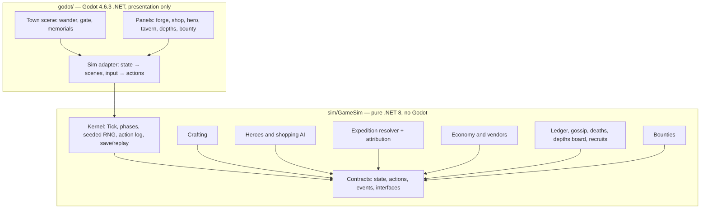

# Inverted MMO — Maker's Mark - Plan

## Goal Capsule

- **Objective:** Ship v1 of a single-player Godot desktop game where the player is a blacksmith NPC and autonomous AI heroes raid a 5-floor Mine — built sim-core-first so all game logic runs headless, deterministic, and CI-tested before the town visuals layer on.
- **Product authority:** This document's Product Contract (confirmed with Brian, 2026-07-13).
- **Open blockers:** None. Remaining open questions are deferred to implementation and marked as such.
- **Stop conditions:** Surface (don't guess) anything that would change product scope, break determinism, or add a runtime LLM/network dependency.

---

## Product Contract

### Summary

An inverted MMO: the AI plays the heroes, you play the NPC. As the town blacksmith you craft, price, and stock gear for six autonomous AI adventurers who shop, party up, and push into a 5-floor Mine on their own. An attribution engine proves — mechanically, not narratively — that your specific craft changed their outcomes.

### Problem Frame

Classic MMOs make the player the hero and NPCs the furniture. Flipping that is the fantasy: watch heroes live their lives and matter to them through your work. The pitfall of the genre-adjacent games (shop sims, idle crafters) is that heroes degrade into RNG timers — you never see *your* sword matter. The core design bet is that visible, provable cause-and-effect between the player's craft and a hero's success is the grin moment everything else supports.

### Key Decisions

- **Sim-core-first build order.** The entire game simulation is built as a headless, deterministic, seeded system playable through debug/text panels before any town art exists. The Godot town scene is a presentation skin layered on afterward, within v1. Chosen for testability, parallel Claude-agent development, and because Brian judged the sim the most important piece.
- **No runtime LLM.** Heroes run on classic game AI (utility AI / behavior trees). Deterministic, free, testable.
- **Depth over breadth.** One profession (blacksmith), one venue (the Mine), six heroes. The other eight professions are represented only by a rival AI vendor selling flat-quality generic goods.
- **Attribution engine is the spine.** Every crafted item carries a maker's mark; the expedition resolver logs item-attributable beats (killing blows, lethal-hit saves, breakpoint crossings). "My gear made the difference" is the primary fun pillar; crafting mastery, living-world drama, and economy tycoon are supporting pillars in v1.
- **Influence, never orders.** Heroes are fully autonomous; the player shapes outcomes via gear quality, pricing, and a bounty board heroes weigh but may decline.
- **Deterministic seeded expeditions.** Each expedition resolves as a pure function of (party, gear, floor, seed) computed at departure, revealed on return. Same seed + same player actions = identical world.
- **Permadeath with a recruit trickle.** Heroes die for real; death reports name the gear they wore. A gated recruit inflow prevents a dead-end save.
- **Godot 4.x desktop, personal GitHub.** Brian's choice of engine and home. CI must run the full sim test suite headless on every push; work is not reportable as done until tests pass.

### Actors

- A1. **Player (the Blacksmith)** — crafts, prices, stocks, posts bounties, reads the Evening Ledger. Never fights, never commands.
- A2. **Heroes (6 at start)** — autonomous AI adventurers across 3 combat roles. Shop with budgets, form parties, push Mine floors as deep as gear allows, remember item performance, die permanently.
- A3. **Rival vendor** — AI shopkeeper selling flat-quality generic gear for every slot; the price/quality baseline the player must beat.

### Requirements

**Core loop**

- R1. The game day runs in three phases: Morning (heroes shop and party up), Expedition (heroes away; player crafting window), Evening (returns, Ledger, gossip).
- R2. Expedition outcomes are computed at departure as a seeded pure function and revealed on return.
- R3. The full game state advances as a deterministic simulation step that runs headless with no rendering dependency.

**Crafting (blacksmith)**

- R4. ~15 recipes across 3 tiers (weapons, shields, armor) with quality grades Poor→Masterwork driven by material grade plus an 8-node talent mini-tree.
- R5. Every crafted item is stamped with a maker's mark and accumulates a per-item history (kills, saves, current bearer).
- R6. Ore/material supply comes from returning heroes: deeper floors drop rarer ore the player can buy — the gear→depth→ore→gear flywheel.

**Heroes and the Mine**

- R7. Six persistent named heroes with roles, budgets, gear-score-driven shopping, and permadeath.
- R8. Hero shopping decisions are legible: when a hero passes on an item, the reason is visible ("too heavy for a rogue").
- R9. The Mine has 5 floors of rising difficulty; Floor 5 is tuned so heroes equipped only with rival-vendor gear wipe — player craft is structurally required to clear it.
- R10. A recruit trickle replaces dead heroes at a gated rate that prevents both dead-end saves and death-spiral immunity.

**Attribution and drama**

- R11. The expedition resolver logs item-attributable beats: killing blows, hits survived that would have been lethal without the equipped item, and stat-breakpoint floor clears.
- R12. The Evening Ledger presents per-hero return cards highlighting the player's items and running maker's-mark tallies per sold item.
- R13. Death reports name the gear the hero died wearing; a memorial stone per dead hero accumulates in the town scene.
- R14. Tavern gossip lines are generated from real attribution events and hero memory — never from a disconnected flavor-text pool.
- R15. A public Depths Progress board tracks deepest-floor records per hero, giving each save a visible season arc.

**Economy**

- R16. The player stocks shelves and sets prices; heroes comparison-shop against the rival vendor on quality and price.
- R17. Hero budgets grow with loot income, so player pricing decisions feed back into hero progression speed.

**Influence**

- R18. The player can post bounties (subsidized objectives); hero AI weighs them against its own goals and may decline.

**Presentation**

- R19. v1 ships with a living 2D town scene: heroes visibly wander, depart through the town gate, and return (or fewer return) before the Evening Ledger opens — the Return Ritual.
- R20. Clicking heroes or buildings opens management panels (forge, shop, hero detail, tavern, Depths board); the sim is fully playable through these panels.
- R21. Before the town scene exists, the sim is playable end-to-end through debug/text panels.

**Engineering workflow**

- R22. All sim logic is engine-decoupled and covered by automated tests that run headless in CI on every push; no work is reported done without green tests.
- R23. A 100-day headless balance simulation runs in CI asserting hero progression stays in band, the player economy stays solvent, and identical seeds produce identical outcomes.
- R24. The repo is structured so multiple Claude Code agents can work parallel modules without merge interference.

### Key Flows

- F1. **Day loop**
  - **Trigger:** Day starts.
  - **Steps:** Morning — heroes browse both shops, buy by budget/gear-score, form parties. Expedition — parties depart through the gate; outcome computed at departure; player crafts. Evening — survivors return through the gate (Return Ritual), Ledger posts return cards, gossip generates, day advances.
  - **Covers:** R1, R2, R16, R19.
- F2. **Craft and stock**
  - **Trigger:** Player crafts during any phase.
  - **Steps:** Choose recipe + materials → quality roll (material grade + talents) → item stamped with maker's mark → shelve with price.
  - **Covers:** R4, R5, R16.
- F3. **Attribution beat**
  - **Trigger:** Expedition resolver processes a combat event involving a player-crafted item.
  - **Steps:** Resolver detects killing blow / lethal save / breakpoint clear attributable to the item → beat logged with item ID → surfaces in Ledger card, item tally, and gossip pool.
  - **Covers:** R11, R12, R14.
- F4. **Hero death**
  - **Trigger:** Hero HP reaches zero on any floor.
  - **Steps:** Death report names floor, cause, and worn gear → memorial stone added to town → recruit trickle timer advances → gossip references the death.
  - **Covers:** R7, R10, R13, R14.
- F5. **Bounty**
  - **Trigger:** Player posts a subsidized objective ("clear Floor 3 — 50g bonus").
  - **Steps:** Hero AI scores bounty against own goals → accepts or visibly declines with reason → completion pays out and logs attribution.
  - **Covers:** R18.

### Acceptance Examples

- AE1. **Covers R11, R12.** Given Torvald equips the player's Fine Iron Blade, when the resolver credits it a killing blow on Floor 2, then the Evening Ledger card highlights the blade and its lifetime tally increments.
- AE2. **Covers R11.** Given a hero wearing the player's armor takes a hit that would reduce HP below zero without that armor's stats, then the Ledger shows a "your armor saved their life" beat.
- AE3. **Covers R9.** Given a party equipped only with rival-vendor gear, when they attempt Floor 5, then they wipe (retreat or deaths) — every run, not probabilistically.
- AE4. **Covers R8.** Given the player shelves a two-handed sword, when a rogue-role hero evaluates it, then the pass reason is visible to the player.
- AE5. **Covers R2, R3, R23.** Given two runs with identical seed and identical player actions, then world state is byte-identical after 100 simulated days.
- AE6. **Covers R10, R13.** Given a hero dies, then the death report names their equipped gear, a memorial stone appears, and a recruit arrives within the gated window.
- AE7. **Covers R18.** Given a posted bounty conflicting with a hero's goals, then the hero declines and the decline reason is visible.

### Success Criteria

- A 30-minute session reliably produces at least one attribution grin moment (AE1/AE2-class beat involving player craft).
- The 100-day CI balance sim passes: no hero stuck below Floor 3 by day 40 under baseline play, player economy solvent, determinism holds.
- First-session content lasts beyond an hour before Floor 5 clears under tuned play (Depths board arc mitigates exhaustion).
- CI is green on main at all times; any Claude agent can pick up a module and run the full test suite locally and in CI without touching another agent's module.

### Scope Boundaries

**Deferred for later**

- The other 8 professions and their talent trees; profession pick-1-2-per-save selection UI (v1 is blacksmith-only; the save structure should not preclude it).
- World map and venues beyond the Mine.
- Dynamic economy (price drift, supply/demand, multiple vendors).
- Authored hero arcs, rivalries, and relationship systems beyond attribution-fed gossip.
- Consumables, durability/repair loops, cross-profession item interactions.
- Active crafting minigame; meta-progression across saves.
- Godot 4.7.1 upgrade (pin 4.6.3 now; bump when 4.7.1-stable ships — never 4.7.0).
- True GitHub merge queue (unavailable on personal-account repos; unlocks if the repo moves to an organization).
- Co-op multiplayer (the pure-.NET deterministic sim core is the enabling foundation; nothing else is built for it in v1).

**Outside this product's identity**

- Direct hero control or mission assignment — influence only.
- Player combat of any kind.
- Multiplayer or shared-world features in v1.
- Runtime LLM dependence for any game system.

### Dependencies / Assumptions

- Repo lives on Brian's personal GitHub; GitHub Actions provides CI.
- Godot 4.6.3-stable (.NET edition) with the .NET 10 SDK (net10.0 LTS; pinned via `global.json`); headless mode runs engine-side tests on CI runners. U1 verifies the 4.6.3 editor tolerates a net10.0 TFM (guarding the known auto-downgrade-to-net8 editor quirk via `Directory.Build.props`); if the editor fights it, `godot/` stays net8.0 with the EOL exposure documented beside the 4.7.1 deferred bump.
- Solo hobbyist cadence: v1 scope must stay shippable by one person orchestrating parallel Claude Code agents.
- Fornida-Dev org repos gave no usable convention signal (2 stale public repos only); conventions below are self-defined from current multi-agent best practice.

### Outstanding Questions

**Deferred to implementation**

- Day-phase pacing values (real-minutes per phase, fast-forward speeds) — tune in U11/U12 playtesting.
- Recruit-trickle tuning parameters — tune against the U10 balance sim.
- Exact combat formula constants (damage, breakpoints per floor) — tune against the U10 balance sim; AE3's wipe guarantee is the fixed constraint.

---

## Planning Contract

**Product Contract preservation:** unchanged from the requirements-only version, except two additions Brian approved in dialogue: the Godot version pin/upgrade path and the co-op foundation note in Scope Boundaries.

### Key Technical Decisions

- KTD1. **Godot 4.6.3-stable (.NET edition), pinned and enforced.** 4.7.0 shipped with ~70 regressions now being fixed in 4.7.1 RCs; 4.6.3 is the mature line. Upgrade to 4.7.1-stable is a deferred follow-up task. Enforcement: a committed `.godot-version` file is the single source of truth (the CI workflow reads it), `project.godot` sets `config/features` to 4.6, and `CLAUDE.md` carries a hard rule that no agent or human opens or re-saves `godot/` with any editor version other than the pinned one — a newer editor silently rewrites scenes and import metadata into formats the CI-pinned engine rejects.
- KTD2. **Two-project split: pure sim core + thin Godot adapter.** `sim/GameSim/` is a plain .NET class library targeting net10.0 (current LTS — .NET 8 reaches end-of-support 2026-11-10, inside this project's lifetime) with zero Godot references — all game rules, state, AI, and resolution live here. `godot/` holds the Godot project whose C# scripts only adapt sim state to scenes/UI and forward player input as sim actions. This gives the dotnet-test fast path in CI (no engine download), keeps parallel agents in engine-free code most of the time, and is the future co-op server foundation (server = plain .NET app running GameSim).
- KTD3. **Test stack: xUnit for the sim core; gdUnit4Net for engine-side tests.** Sim tests run via `dotnet test` in seconds with no Godot binary. Engine-side adapter tests use gdUnit4Net (`gdUnit4.api` + test adapter) with `[RequireGodotRuntime]`, running through the same `dotnet test` entry point against a headless Godot process. Never rely on `SceneTree.Quit()` for CI exit codes — the VSTest adapter owns pass/fail.
- KTD4. **Determinism contract.** All randomness flows through an injected seeded RNG (single stream owned by the sim kernel); no wall-clock reads inside the sim; state advances only via `Tick(actions)`. User saves are serialized state snapshots plus the campaign seed (the action log may ride along for diagnostics) — snapshot saves survive balance patches, where pure replay would rewrite history under changed constants. Seed+action-log replay remains the determinism *test harness*: a golden-replay test asserts byte-identical serialized state (AE5). Any unseeded RNG or iteration-order dependence is a build-failing defect.
- KTD5. **Expedition resolution is a pure function.** `(party, gear, floor, seed) → ExpeditionResult` computed at departure. The result carries the full event log including attribution beats; presentation reveals it on return. Pure-function shape makes AE1–AE3 directly unit-testable.
- KTD6. **Attribution by counterfactual re-evaluation over recorded rolls.** The resolver's event log records the resolved random rolls per combat event. A lethal-save beat is detected by recomputing the hit over those recorded rolls with the item's stats removed; a breakpoint beat by recomputing the floor-clear check without the item. Counterfactuals never draw from any RNG stream — fresh draws would advance the shared stream or roll different dice than the real hit, logging saves that never happened. This keeps "your item mattered" a computed fact rather than a damage-share heuristic.
- KTD7. **CI: two-lane GitHub Actions on ubuntu-latest.** Lane 1 (every PR, fast): `dotnet test sim/GameSim.Tests/GameSim.Tests.csproj` — project-scoped so engine tests never enter the Godot-less lane. Lane 2: engine tests — `chickensoft-games/setup-godot@v2` (pinned 4.6.3, `use-dotnet: true`), cache `.godot/` keyed on `hashFiles('godot/project.godot', 'godot/**/*.tscn', 'godot/**/*.cs')`, import step `godot --headless --import --quit-after 100` with `continue-on-error: true`, export `GODOT_BIN` to the setup-godot-resolved executable path, then the gdUnit4Net suite strictly (a committed `.runsettings` carries the same variable for local runs). The 100-day balance sim runs as a separate required step in lane 1 (`dotnet test sim/GameSim.Tests/GameSim.Tests.csproj --filter Category=Balance`).
- KTD8. **Repo protections: strict up-to-date ruleset + auto-merge.** GitHub merge queues are unavailable on personal-account repos (org-owned only; private additionally requires Enterprise Cloud), so the plan does not use one. Instead the `main` ruleset requires: PR before merge, the exact named status checks, block force-push/delete, and **require branches to be up to date before merging** — combined with PR auto-merge, every agent branch must rebase onto latest main and re-run all checks before landing, which serializes merges at 2–3-agent scale. Set up via `gh api` during U2. Note: ruleset enforcement on a private personal repo may require GitHub Pro. A true merge queue is deferred until/unless the repo moves to an organization.
- KTD9. **Multi-agent working model: contracts-first, directory ownership.** U3 lands the shared contracts (state types, action types, event types, module interfaces) before parallel work begins. Each subsequent sim module (U4–U9) is a directory one agent owns exclusively. Deny-list no agent edits unassigned: `Game.sln`, `godot/project.godot`, `.github/`, `sim/GameSim/Contracts/`, `CLAUDE.md`. Contract amendment rule (contracts will prove imperfect once consumers exist): changes to `sim/GameSim/Contracts/` land as dedicated micro-PRs authored by the orchestrating session (the contracts owner), merged ahead of dependent module PRs, with affected in-flight agents rebasing before continuing — recorded in `CLAUDE.md`. Task claiming happens in `.claude/tasks/` claim files; each unit = one branch = one small auto-merged PR through the protected ruleset.
- KTD10. **Debug panels are the real UI skeleton.** R21's debug panels are plain Godot Control scenes bound to sim state — not throwaway console output. U12's management panels restyle and extend them rather than replacing them.

### High-Level Technical Design

Component topology — the arrow direction is the dependency rule (Godot depends on sim; sim depends on nothing):



Day-loop sequence (the sim step every test and the UI both drive):

```mermaid
sequenceDiagram
  participant P as Player (actions)
  participant K as Kernel
  participant H as Heroes
  participant X as Expedition resolver
  participant D as Drama systems
  P->>K: craft / price / stock / bounty actions
  K->>H: Morning phase — shop both vendors, form parties
  K->>X: Expedition phase — resolve(party, gear, floor, seed) at departure
  Note over X: pure function; event log + attribution beats
  K->>P: crafting window
  K->>D: Evening phase — reveal results
  D->>P: Ledger cards, gossip, deaths, depths board
  K->>K: advance day, append actions to log
```

### Output Structure

```text
Game.sln                       # pre-created; contains all csprojs (see U1 editor reconciliation)
global.json                    # pins the .NET SDK
.godot-version                 # single source of truth for the engine pin; CI reads it
.runsettings                   # GODOT_BIN wiring for local engine-test runs
CLAUDE.md                      # agent operating rules, deny-list, contract-amendment rule, test commands
README.md
.gitignore                     # includes .claude/worktrees/, .godot/
.claude/tasks/                 # per-feature parallel-plan / claim files
.github/workflows/ci.yml       # lanes: sim tests, balance sim, engine tests
sim/
  GameSim/
    GameSim.csproj             # net10.0, no Godot refs
    Contracts/                 # state, actions, events, interfaces (deny-list; amended via micro-PRs)
    Kernel/
    Crafting/
    Heroes/
    Expedition/
    Economy/
    Drama/
    Bounties/
  GameSim.Cli/                 # console runner — first playable surface (U13)
  GameSim.Tests/
    GameSim.Tests.csproj       # xUnit; Balance category for 100-day sim
godot/
  project.godot                # Godot 4.6.3 .NET project (deny-list)
  GodotClient.csproj           # references sim/GameSim
  scenes/                      # town, panels
  scripts/                     # C# adapters only — no game rules
  tests/                       # gdUnit4Net engine-side tests
```

### Risks

- **Attribution math can lie.** Naive damage-share credit feels arbitrary. Mitigated by KTD6's counterfactual method; U6's test scenarios pin the exact beat semantics before any UI shows them.
- **Balance mistuning stalls or trivializes progression.** Mitigated by landing the 100-day balance sim (U10) immediately after the sim systems, before presentation work.
- **Hero shopping AI is quietly a second AI system.** Scope-creep magnet. v1 keeps it to budget + gear-score + role fit with legible pass reasons (R8) and nothing else.
- **Solo review bottleneck.** Research consensus: cap 2–3 parallel implementation agents; review capacity, not agent count, is the ceiling.
- **Windows headless Godot is the less-exercised CI path.** CI runs ubuntu-latest; Windows is a local-dev concern only.

---

## Implementation Units

Unit index — dependency order; one unit = one branch = one PR:

| U-ID | Title | Key paths | Depends on |
|---|---|---|---|
| U1 | Repo + solution scaffold | `Game.sln`, `sim/`, `godot/`, `CLAUDE.md` | — |
| U2 | CI pipeline + repo protections | `.github/workflows/ci.yml` | U1 |
| U3 | Sim kernel, contracts, determinism | `sim/GameSim/Kernel/`, `sim/GameSim/Contracts/` | U1 |
| U4 | Crafting + maker's mark | `sim/GameSim/Crafting/` | U3 |
| U5 | Heroes + shopping AI | `sim/GameSim/Heroes/` | U3 |
| U6 | Mine, expedition resolver, attribution | `sim/GameSim/Expedition/` | U3, U4, U5 |
| U13 | Console runner — first playable surface | `sim/GameSim.Cli/` | U6 |
| U7 | Economy: shop, rival vendor, ore flywheel | `sim/GameSim/Economy/` | U3, U5, U6 |
| U8 | Drama: ledger, gossip, deaths, depths, recruits | `sim/GameSim/Drama/` | U6 |
| U9 | Bounty board | `sim/GameSim/Bounties/` | U5, U6, U7 |
| U10 | 100-day balance sim gate | `sim/GameSim.Tests/` (Balance) | U4–U9 |
| U11 | Debug panels — playable game | `godot/scenes/`, `godot/scripts/` | U3–U9 |
| U12 | Living town scene + Return Ritual | `godot/scenes/` | U11 |
| U14 | Chronicle export + analytics report | `sim/GameSim.Cli/`, `tools/analytics/` | U8, U13 |
| U15 | Themed asset pipeline (SVG + Gemini) | `tools/assetgen/`, `godot/assets/` | U12 |

Parallelization: after U3 merges, U4 and U5 run as parallel agents (disjoint directories); U2 can run parallel to U3. U6 follows U4+U5. After U6 merges, U7, U8, and U13 run in parallel; U9 follows U7. U7 and U9 consume U6's `ExpeditionResult` (ore scales with floor reached; bounty payout reads expedition results), so neither belongs in the first wave.

### U1. Repo + solution scaffold

- **Goal:** A cloneable repo where `dotnet test` and the Godot editor both work from a fresh checkout.
- **Requirements:** R22, R24.
- **Files:** `Game.sln`, `sim/GameSim/GameSim.csproj`, `sim/GameSim.Tests/GameSim.Tests.csproj`, `godot/project.godot`, `godot/GodotClient.csproj`, `godot/tests/`, `CLAUDE.md`, `README.md`, `.gitignore`, `.claude/tasks/README.md`
- **Approach:** Initialize git repo and private GitHub repo on Brian's personal account (name: `makers-mark`; description + topics set per resource standards). Pre-create `Game.sln` containing all csprojs and set `dotnet/project/solution_directory` in `project.godot` so the Godot editor resolves the root solution instead of generating a stray one beside `project.godot`. Target net10.0; commit `global.json` (SDK pin), `.godot-version` (engine pin, KTD1), and `Directory.Build.props` guarding the editor's auto-downgrade-to-net8 quirk. Godot 4.6.3 .NET project shell in `godot/` referencing `GameSim`. `CLAUDE.md` carries: test commands, branch/PR conventions, the agent deny-list and contract-amendment rule (KTD9), directory ownership rule, the editor-version rule (KTD1), and the tests-green-before-done rule. `.gitignore` covers `.godot/`, `.claude/worktrees/`, build output.
- **Test scenarios:** Test expectation: none — scaffolding; verified by U2's CI running on it.
- **Verification:** Fresh clone: `dotnet build Game.sln` succeeds; Godot 4.6.3 opens `godot/` without errors AND its Build button succeeds against the root solution; `GodotClient.csproj` retains its net10.0 TFM after an editor open-and-save cycle (fallback: godot/ on net8.0 with EOL exposure documented); a trivial placeholder xUnit test passes via `dotnet test`.

### U2. CI pipeline + repo protections

- **Goal:** No code merges to `main` without green tests; merges are serialized.
- **Requirements:** R22, R24.
- **Dependencies:** U1.
- **Files:** `.github/workflows/ci.yml`
- **Approach:** Per KTD7: fast lane (project-scoped `dotnet test` sim suite + `--filter Category=Balance` step), engine lane (setup-godot@v2 reading `.godot-version`, `.godot/` cache, import step `continue-on-error: true`, `GODOT_BIN` export, gdUnit4Net strict). Then per KTD8: ruleset on `main` via `gh api` — require PR, exact check names, block force-push/delete, require branches up to date before merging — plus repo-level PR auto-merge. Validate the pipeline with a deliberately failing test PR before trusting it (research pain point: silent exit-0 passes).
- **Execution note:** Prove the pipeline red before green — land a failing test, watch CI block the merge, then fix it.
- **Test scenarios:**
  - Happy path: PR with passing tests → both lanes green → auto-merge lands it.
  - Error path: PR with one failing xUnit test → fast lane fails → merge blocked.
  - Error path: PR with one failing gdUnit4Net test → engine lane fails → merge blocked (proves exit-code wiring).
  - Serialization path: PR green but behind main → merge blocked until rebased and re-run (proves the up-to-date requirement).
- **Verification:** Ruleset visible on GitHub; a test PR demonstrates block-on-red, pass-on-green, and block-when-stale.

### U3. Sim kernel, contracts, determinism

- **Goal:** The deterministic heartbeat every other module plugs into.
- **Requirements:** R1, R2 (scheduling half), R3, R22. Covers AE5's foundation.
- **Dependencies:** U1.
- **Files:** `sim/GameSim/Kernel/`, `sim/GameSim/Contracts/`, `sim/GameSim.Tests/Kernel/`
- **Approach:** Per KTD4: `GameState` (immutable or copy-on-write), `Tick(state, actions) → state`, three-phase day machine (Morning/Expedition/Evening), seeded RNG service injected everywhere, ordered action log, snapshot save/load (state + seed) with seed+log replay as the test harness, JSON serialization for golden comparisons. Contracts directory defines the types and interfaces U4–U9 implement against (hero/item/event shapes, module interfaces) — this is the contracts-first gate for parallel agents (KTD9).
- **Execution note:** Test-first on determinism — the golden-replay test exists before any module logic lands.
- **Test scenarios:**
  - Covers AE5. Same seed + same action log × 2 runs → serialized state byte-identical after 200 ticks.
  - Different seed → states diverge (guards against accidentally unseeded constants).
  - Save at day N, load, continue to day M ≡ uninterrupted run to day M.
  - Phase machine: Morning→Expedition→Evening→next-day Morning; actions submitted in a wrong phase are rejected with a typed error.
  - Empty day (no actions, no heroes) ticks without error.
- **Verification:** `dotnet test` green; golden-replay test in the default suite; contracts reviewed before U4–U9 dispatch.

### U4. Crafting + maker's mark

- **Goal:** Recipes → quality-rolled, stamped items with per-item history.
- **Requirements:** R4, R5.
- **Dependencies:** U3.
- **Files:** `sim/GameSim/Crafting/`, `sim/GameSim.Tests/Crafting/`
- **Approach:** Data-driven recipe table (~15 recipes, 3 tiers). Quality roll = material grade + talent modifiers through the kernel RNG. 8-node talent mini-tree as data with prerequisite edges. Item identity is stable (maker's mark = item ID + crafter); history (kills, saves, bearer) appended by other modules through a contract interface.
- **Test scenarios:**
  - Happy path: craft each tier with each material grade → quality distribution matches spec table.
  - Talent nodes shift quality odds as specified; locked nodes have no effect; prerequisites enforced.
  - Crafted item carries maker's mark and empty history; history append is ordered and immutable.
  - Edge: crafting with insufficient materials rejected with typed error.
  - Determinism: same state + same craft action → identical item (ID, quality).
- **Verification:** `dotnet test` green; quality distribution test documents the spec table it asserts.

### U5. Heroes + shopping AI

- **Goal:** Six autonomous heroes who shop legibly and party up.
- **Requirements:** R7, R8, R17 (budget half).
- **Dependencies:** U3.
- **Files:** `sim/GameSim/Heroes/`, `sim/GameSim.Tests/Heroes/`
- **Approach:** Hero state: role (3 combat roles), stats, gear slots, budget, per-item memory, alive/dead. Shopping AI = utility scoring over candidate items: gear-score improvement × role fit × affordability; every rejection emits a typed, human-readable reason (R8). Party formation groups available heroes by simple role-composition rules. Keep it this small (Risks: second-AI-system creep).
- **Test scenarios:**
  - Covers AE4. Rogue evaluates two-handed sword → pass, reason names role/weight mismatch.
  - Hero buys the better of two affordable items by gear-score; ties break deterministically.
  - Hero over budget passes with an affordability reason.
  - Party formation: 6 alive heroes → parties satisfy role rules; 1 alive hero → solo party or stay-home per spec.
  - Dead heroes never shop, party, or appear in rosters.
  - Budget increments from loot income (interface with U7).
- **Verification:** `dotnet test` green; every rejection path proven to carry a reason string.

### U6. Mine, expedition resolver, attribution

- **Goal:** The spine: pure-function expeditions with provable item attribution.
- **Requirements:** R2 (resolution half), R9, R11.
- **Dependencies:** U3, U4, U5.
- **Files:** `sim/GameSim/Expedition/`, `sim/GameSim.Tests/Expedition/`
- **Approach:** Per KTD5/KTD6: `Resolve(party, gear, floorTarget, seed) → ExpeditionResult` — full event log (per-floor combats, hits with their resolved rolls, retreats, deaths, loot) plus attribution beats. Killing blow: attributed directly. Lethal save: recompute the hit over its recorded rolls without the armor's stats — if the hero would have died, log the beat. Breakpoint clear: recompute the floor gate without the item. Counterfactuals never draw RNG (KTD6). Floor difficulty table tuned so rival-vendor-only gear-score cannot pass Floor 5's gate (AE3 is a structural threshold, not a probability).
- **Execution note:** Test-first on the three attribution beat types — they define the product's core promise.
- **Test scenarios:**
  - Covers AE1. Scripted party where player blade lands the killing blow → beat logged with item ID.
  - Covers AE2. Hit that is lethal without player armor, survivable with it → lethal-save beat; same hit survivable either way → no beat (no false credit).
  - Covers AE3. Property-style test: all-rival-gear parties across 100 seeds never clear Floor 5; adequately player-geared parties can.
  - Counterfactual purity: counterfactual evaluation consumes zero RNG stream state — resolver state before and after counterfactuals is identical, and counterfactual verdicts are reproducible from the recorded rolls alone.
  - Deeper floors drop rarer ore per the loot table (feeds R6).
  - Purity: same inputs → identical `ExpeditionResult`; resolver touches no global state.
  - Edge: party wipes on Floor 1; hero flees at HP threshold; empty party rejected.
- **Verification:** `dotnet test` green; attribution semantics documented next to the beat tests.

### U13. Console runner — first playable surface

- **Goal:** A human plays the craft→expedition→attribution loop in text, before drama systems and tuning harden the semantics.
- **Requirements:** R21.
- **Dependencies:** U6.
- **Files:** `sim/GameSim.Cli/`
- **Approach:** Plain .NET console app driving `Tick(actions)` through the day loop: read player actions (craft, price, advance day), print return cards and attribution beats straight from `ExpeditionResult`. Half-day build; throwaway-cheap by design but kept as the literal R21 text surface and a permanent debugging harness. U11's panels bind the same action layer — nothing duplicated.
- **Test scenarios:** Test expectation: none — thin console shell over already-tested sim; verified by playing it.
- **Verification:** From a fresh checkout, `dotnet run --project sim/GameSim.Cli` plays 3 in-game days including at least one visible attribution beat.

### U7. Economy: shop, rival vendor, ore flywheel

- **Goal:** Player storefront vs rival baseline, and the ore-buyback loop.
- **Requirements:** R6, R16, R17.
- **Dependencies:** U3, U5, U6.
- **Files:** `sim/GameSim/Economy/`, `sim/GameSim.Tests/Economy/`
- **Approach:** Player shelves (item + price); rival vendor with static flat-quality catalog covering all slots. Morning-phase shopping pulls both catalogs through U5's shopping AI. Evening ore market: returning heroes offer floor-scaled ore for purchase; player gold constraints apply. Loot income credits hero budgets (R17 feedback loop).
- **Test scenarios:**
  - Hero buys player item over rival when quality/price wins; rival when it doesn't.
  - Overpriced player item → rival wins; price cut flips the decision next Morning.
  - Ore offer scales with deepest floor reached; player buys → inventory and gold move correctly; can't overspend.
  - Sold-item revenue and hero loot income both bookkeep exactly (no gold created or destroyed — conservation test).
- **Verification:** `dotnet test` green; gold-conservation property test in the default suite.

### U8. Drama: ledger, gossip, deaths, depths board, recruits

- **Goal:** The sim's story surface — everything the Evening reveal shows.
- **Requirements:** R10, R12, R13, R14, R15.
- **Dependencies:** U6.
- **Files:** `sim/GameSim/Drama/`, `sim/GameSim.Tests/Drama/`
- **Approach:** Evening pipeline consumes `ExpeditionResult`s: per-hero return cards (player items highlighted, beats surfaced), maker's-mark tallies, death reports naming worn gear, memorial-stone registry, Depths Progress board (per-hero deepest floor), templated gossip lines each carrying the attribution-event ID that spawned it (R14's no-disconnected-flavor rule is a type constraint: gossip constructor requires an event reference). Recruit trickle: gated timer per KTD/R10, tuning deferred to U10.
- **Test scenarios:**
  - Covers AE1 surface half: killing-blow beat → ledger card highlights item and tally increments.
  - Covers AE6. Death → report names equipped gear; memorial registry grows; recruit arrives within the gated window; roster never exceeds cap or hits zero permanently.
  - Depths board updates only on new personal records.
  - Every gossip line references a real event ID (property test over 100 simulated days).
  - Edge: full-party wipe day produces coherent ledger (all deaths, no survivor cards).
- **Verification:** `dotnet test` green.

### U9. Bounty board

- **Goal:** The player's influence lever — weighed, never obeyed.
- **Requirements:** R18.
- **Dependencies:** U5, U6, U7.
- **Files:** `sim/GameSim/Bounties/`, `sim/GameSim.Tests/Bounties/`
- **Approach:** Bounty = objective + subsidy, posted as a player action. Hero AI scores bounty utility against its own goals (level safety, gold need); accept/decline emits a legible reason (mirrors R8 pattern). Completion detection reads expedition results; payout via U7 bookkeeping.
- **Test scenarios:**
  - Covers AE7. Bounty conflicting with hero safety → decline with reason.
  - Attractive bounty → accepted, shapes floor choice, pays out on completion.
  - Expired/unmet bounty refunds or lapses per spec; no double-payout.
- **Verification:** `dotnet test` green.

### U10. 100-day balance sim gate

- **Goal:** CI proves the game stays fun-shaped: progression in band, economy solvent, determinism holds.
- **Requirements:** R23. Success Criteria bands.
- **Dependencies:** U4–U9.
- **Files:** `sim/GameSim.Tests/Balance/`
- **Approach:** Scripted baseline player policy (craft best available, price at spec margin, buy offered ore) runs 100 days headless. Assertions: at least one hero reaches Floor 3 by day 40; player gold never insolvent; roster stays within bounds; attribution beats involving player-crafted items occur at a minimum rate once the shop is stocked (band constant tuned here, e.g., ≥1 per simulated day); baseline play does not clear Floor 5 before a minimum day threshold (the trivialization ceiling); AE5 byte-identical re-run. Marked `Category=Balance`, run as its own required CI step. Tuning constants (combat, recruit trickle, grin-rate and ceiling bands) get adjusted here until bands pass — this unit owns closing the deferred tuning questions.
- **Test scenarios:**
  - The 100-day run itself with the band assertions above, including the grin-rate floor and Floor-5 trivialization ceiling (this unit's tests are the scenarios).
  - Covers AE5 end-to-end: full 100-day determinism replay.
  - Pathological seed sweep (10 seeds) — bands hold across all.
- **Verification:** `dotnet test --filter Category=Balance` green locally and as a required CI check.

### U11. Debug panels — playable game

- **Goal:** The sim fully playable through real Godot UI panels; the town skin's skeleton.
- **Requirements:** R12 (display), R15 (display), R20 (panel half).
- **Dependencies:** U3–U9.
- **Files:** `godot/scenes/panels/`, `godot/scripts/`, `godot/tests/`
- **Approach:** Per KTD10: plain Control-node panels — forge (craft), shop (shelve/price), hero roster + detail, tavern (gossip feed), Depths board, bounty board, Evening Ledger, day-phase control. Shell model: a persistent panel-switcher (tab bar) in a single UI scene; the Evening Ledger appears as a modal overlay at phase end; U12's town clicks select the matching tab. Phases auto-advance on a real-time timer — the day-phase control exposes play/pause and a fast-forward multiplier, not a manual next-phase button (the town moves on its own). Legibility surfaces: the shop panel shows live pass-reasons per shelved item; the bounty board shows the decline reason inline on the bounty card (R8/AE4, R18/AE7's visible half). All panels bind through one sim adapter (`godot/scripts/`): render state, submit actions. No game rules in Godot code — adapter-only (KTD2 boundary).
- **Execution note:** Smoke-first — a human can play a full day loop before styling anything.
- **Test scenarios (gdUnit4Net, `[RequireGodotRuntime]`):**
  - Panel opens, binds a mid-game sim state, renders hero/item lists without error.
  - Craft action from forge panel round-trips: sim state changes, panel refreshes.
  - Day-advance from UI runs a full phase cycle; Ledger modal shows the produced cards.
  - Covers AE4/AE7 render half: pass-reason string renders in the shop panel and decline reason renders on the bounty card — asserted on the rendered control, not just the sim value.
  - Integration: scripted 3-day session through UI actions only ≡ same actions applied directly to the sim (adapter fidelity test).
- **Verification:** Engine-lane CI green; manual smoke — play 3 in-game days through panels from a fresh checkout.

### U12. Living town scene + Return Ritual

- **Goal:** The town breathes: heroes wander, depart, return; clicking opens panels.
- **Requirements:** R13 (memorial visual), R19, R20.
- **Dependencies:** U11.
- **Files:** `godot/scenes/town/`, `godot/scripts/`
- **Approach:** 2D town scene (placeholder art acceptable in v1): hero sprites wander during Morning/Evening, party visibly exits the gate at Expedition start, survivors walk back in before the Ledger opens. The Return Ritual gate is time-based: the Ledger modal opens a fixed interval after Expedition-end regardless of how many sprites return (zero on a full wipe) — the walk-in is decoration, never a blocking event, so a wipe day cannot hang the reveal. Memorial stones accumulate from the U8 registry. Clicking a hero/building selects the matching U11 tab. Day/night tint per phase — no further ambience in v1.
- **Test scenarios (gdUnit4Net):**
  - Scene loads with a mid-game state: correct hero count wandering, memorials match registry.
  - Expedition phase: departed heroes absent from town; Ledger opens on the timer after Expedition-end (order asserted).
  - Death day: fewer sprites return; new memorial appears.
  - Zero-survivor day: no sprites return; Ledger still opens on the timer with a coherent all-deaths card set.
  - Click hero → hero detail panel opens with that hero bound.
- **Verification:** Engine-lane CI green; manual smoke — watch a full day including a death day.

### U14. Chronicle export + analytics report

- **Goal:** Historical NPC/AI pattern data flows back into tuning — the human-AI feedback loop.
- **Requirements:** Extends R12/R14's event-sourced design; no new product behavior in the sim.
- **Dependencies:** U8, U13.
- **Files:** `sim/GameSim.Cli/` (export command), `tools/analytics/`
- **Approach:** CLI `export <path>` dumps campaign seed + full event log + day as JSON into a gitignored `runs/` dir. `tools/analytics` script aggregates one-or-many run files: death rates per floor/role, gear-adoption and pass-reason histograms, attribution-beat frequency, gold curves — emitted as a compact markdown report for tuning review. CI uploads the balance sim's stats as a per-run artifact for commit-over-commit trends. Sim core untouched (pure read-model + IO at the edges).
- **Test scenarios:** Export round-trips (JSON reloads to identical event list); analytics totals match a hand-computed fixture run; empty runs dir handled.
- **Verification:** Play N days in CLI, `export`, run analytics, read the report.

### U15. Themed asset pipeline (SVG + Gemini)

- **Goal:** Replace placeholder visuals with the game's style: fantasy-witchy with a sci-fi tinge (dark purple/teal palette, runes with faint circuitry, candle-glow rim light).
- **Requirements:** Presentation-only; keeps the no-runtime-LLM boundary — generation is dev-time.
- **Dependencies:** U12.
- **Files:** `tools/assetgen/`, `godot/assets/`, `docs/style-bible.md`
- **Approach:** Committed style bible (palette hexes + master prompt prefix + reference image). UI icons and item art authored as SVG in the bible's style (Godot imports SVG). Hero portraits, monsters, and town backdrops generated via Gemini/Imagen API script in `tools/assetgen/` reading `GEMINI_API_KEY` from the environment (never committed); outputs reviewed then committed as PNGs. Consistency via the shared prompt prefix + image conditioning on the reference.
- **Test scenarios:** Test expectation: none — art pipeline; verified visually and by Godot import succeeding in CI.
- **Verification:** Town scene and panels render with themed assets; CI engine lane still green.

---

## Verification Contract

| Gate | Command | When | Proves |
|---|---|---|---|
| Sim suite | `dotnet test sim/GameSim.Tests/GameSim.Tests.csproj --filter Category!=Balance` | Every PR (fast lane) | U3–U9 scenarios, AE1–AE7 sim-side, determinism golden replay |
| Balance sim | `dotnet test sim/GameSim.Tests/GameSim.Tests.csproj --filter Category=Balance` | Every PR (required step) | R23 bands, AE5 100-day, seed sweep |
| Engine suite | gdUnit4Net via `dotnet test` against headless Godot (CI: setup-godot@v2 + import step) | Every PR (engine lane) | U11/U12 adapter fidelity and scene behavior |
| Merge gate | GitHub ruleset: PR + required checks + branches up-to-date + auto-merge | Every merge to `main` | R22/R24 — nothing lands red; merges serialized via forced rebase-and-rerun |
| Console smoke | `dotnet run --project sim/GameSim.Cli` — play 3 in-game days in text | U13 completion | R21 for real humans, pre-UI |
| Playable smoke | Manual: fresh clone → play 3 in-game days via panels | U11, U12 completion | R20 for real humans |

Check names are pinned in the ruleset. A failing test that exits 0 is a CI defect (KTD3) — U2's red-pipeline proof guards it.

---

## Definition of Done

- All fifteen units merged to `main` through the protected ruleset with green required checks (U14/U15 added 2026-07-14 at Brian's request: telemetry feedback loop + themed asset pipeline).
- AE1–AE7 each enforced by at least one named passing test.
- 100-day balance sim passes its bands as a required CI check.
- A fresh clone plays end-to-end: 3 in-game days through the UI, including one attribution beat visible in the Ledger.
- `CLAUDE.md` and `README.md` current: setup, test commands, agent rules match reality.
- No orphans: no dead code from abandoned approaches, no unused dependencies, no stray temp files; repo description/topics set.
- Deferred items (4.7.1 bump, other professions, co-op) recorded here in Scope Boundaries — nothing else left implicit.

---

## Appendix — Sources

- Godot versions & headless: [godotengine.org/download/archive](https://godotengine.org/download/archive/), [4.7.1 RC1 notes](https://godotengine.org/article/release-candidate-godot-4-7-1-rc-1/), [command-line docs](https://docs.godotengine.org/en/stable/tutorials/editor/command_line_tutorial.html)
- Testing: [gdUnit4](https://github.com/godot-gdunit-labs/gdUnit4), [gdUnit4Net](https://github.com/godot-gdunit-labs/gdUnit4Net), [gdUnit4-action](https://github.com/godot-gdunit-labs/gdUnit4-action), [GUT](https://github.com/bitwes/Gut), [chickensoft setup-godot](https://github.com/chickensoft-games/setup-godot)
- CI pain points: Godot issues #83449 (import exit codes), #94755 (Windows headless), SceneTree.Quit exit-code caveat
- Multi-agent repo patterns: Claude Code worktrees docs (code.claude.com/docs/en/worktrees), GitHub rulesets + merge queue docs
