# Catalog Adaptation Policies - Plan

## Goal Capsule

- **Objective:** Establish three standing policies governing how the 11-pillar master systems catalog (`docs/design/master-systems-catalog.md`) enters the codebase — and land their concrete foundations: the transposition mapping doc, the integer-curve helper kernel with pin tests, and the flavor-layer content-pack engine wired into the gossip and evening-ledger surfaces.
- **Product authority:** This document, plus the division ruling in `docs/design/master-systems-catalog-division.md` and the standing constraints in `CLAUDE.md` (determinism, sim purity).
- **Stop conditions:** Any change that would let flavor text alter sim state, draw kernel RNG, or misstate a sim fact is out of bounds — surface it instead of coding around it. Runtime LLM work is out of scope for this plan entirely.
- **Open blockers:** None.

---

## Product Contract

### Summary

Three policies that every future pillar build and add-on dispatch must follow: (1) a flavor-text layer that ships deterministic LLM-authored content packs first and adds an optional zero-install runtime LLM later, with sim facts guaranteed intact; (2) catalog math formulas treated as curve intent and rebuilt as pinned integer rules; (3) a standing transposition mapping that converts the catalog's Godot 4.3/GDScript/GOAP/Ollama prompts into this repo's C# pure-sim architecture.

### Problem Frame

The master systems catalog is written for a different stack (Godot 4.3 GDScript, GOAP agents, runtime Ollama, float math). The repo's non-negotiables — byte-identical determinism across OSes, sim purity, provable attribution text — conflict with a literal reading. Without standing policies, every pillar build and every add-on Claude would re-litigate the same three conversions, drift would creep in, and a hallucinating text layer could silently break the game's core promise that attribution lines state true facts.

### Key Decisions

- **Build-time content packs first, runtime LLM second.** The flavor layer ships as large LLM-authored template packs committed as data, with seed-derived voice variety. An optional runtime rewording layer comes later, only after the pack layer is proven in play. Rationale: protects the attribution-truth promise, works on every device, costs nothing at runtime.
- **Embedded in-process inference over external Ollama for the runtime layer.** LLamaSharp (MIT, llama.cpp bindings) with a bundled-or-downloaded GGUF model — zero player install, CPU fallback genuine, GBNF grammar enforcement available in-process. Shipped-game precedent: Verbal Verdict via LLMUnity. Ollama-external remains a power-user bonus path, not primary delivery.
- **License floor for all LLM components: free commercial redistribution.** MIT/Apache-2.0 only (LLamaSharp, Qwen3/Qwen3.5, Phi-4-mini, Gemma 4). Gemma 3 terms and Llama community license obligations are excluded.
- **No fixed-point library.** Research verdict: Q-format libraries earn their keep for continuous math (positions, physics, trig); this sim's balance curves are monotone, turn-granular, and better served by bespoke per-mille integer rules with explicit rounding. The most-cited C# library (FixedMath.Net) is archived. Revisit only if genuine continuous 2D math enters the sim.
- **GOAP transposes to data-driven utility scoring.** Research is one-directional: shipped autonomous-agent sims (The Sims, RimWorld, Dwarf Fortress, CK3, XCOM turn scoring) use trait-weighted utility, not planners; single-step per-phase decisions are the literature's "don't use a planner" case; utility natively produces the legible pass-reasons this game surfaces as UI.

### Requirements

**Flavor layer**

- R1. The sim emits structured, typed events only; no LLM output ever enters sim state, sim decisions, balance runs, or CI.
- R2. Flavor text renders from committed content packs: template variants keyed by event type and voice, authored by an LLM at development time.
- R3. Each campaign derives per-hero voice profiles deterministically from the campaign seed, so identical events read differently across seeds and replays stay byte-identical.
- R4. Generated or template text must preserve sim facts exactly: fact slots are substituted from the structured event and validated post-render; any validation failure falls back to a static template line.
- R5. The runtime LLM layer is optional at every level: the game is fully playable without it, the model is an optional download (not in the base install), and all components carry MIT/Apache-2.0 licenses.
- R6. Runtime generation is asynchronous and pre-emptive — lines generate ahead of display during play, with template fallback whenever a line is not ready (CPU-only generation runs 2-6 s/line; synchronous rendering is not viable).

**Integer math**

- R7. Catalog formulas are curve intent, not code: each adopted formula is redesigned as an integer rule at per-mille (or coarser) granularity during its system's core build.
- R8. Shared kernel helpers exist only for recurring curve shapes — geometric decay via per-tick rational multiply or EWMA shift, integer log10 via digit count with optional intra-decade interpolation, piecewise-linear LUTs — with rational constants computed at design time, never at runtime.
- R9. Every multiply-then-divide uses 64-bit or `Math.BigMul` intermediates; division order and rounding (truncate-toward-zero vs floor on negatives) are explicit per formula and treated as part of its contract.
- R10. Every adapted formula ships golden-value pins at boundary points plus a curve-shape test (monotonicity, decade steps, half-life landmarks), running on the existing 3-OS CI.

**Transposition**

- R11. A standing mapping doc (`docs/design/catalog-prompt-transposition.md`) defines the catalog-to-repo conversion: GDScript files → sim module + thin panel; GOAP → utility scoring in phase systems with trait weights as per-mille multipliers and recorded pass-reasons; signals → typed GameEvents; singletons → GameState fields + registries; per-frame loops → day-phase ticks; Ollama references → the R1-R6 flavor contract; float math → the R7-R10 rule; the catalog's six-phase pipeline → brainstorm/plan/work with user checkpoints preserved at the same two gates.
- R12. Catalog prompts keep their design content (mechanics, scenarios, math intent) verbatim; only the technical skeleton swaps. Dispatching a pillar or add-on means filling the mapping template, not re-deriving the conversion.
- R13. Personality/trait modifiers (the catalog's β_class pattern) are expressed as data: per-mille multiplicative weights (with zero as hard veto) or trait-shifted thresholds, per the CK3/RimWorld patterns.

### Scope Boundaries

- LLM in sim decisions, hero AI, balance, or CI — permanently out; determinism gate is absolute.
- Fixed-point library adoption — out unless continuous 2D math (positions, physics) enters the sim.
- Catalog numeric constants (β values, decay rates, tax coefficients) are starting points for balance tuning, not commitments.
- An actual GOAP planner — out; revisit only if heroes ever need multi-day chained intentions, and then as a light goal layer over utility scoring, not STRIPS.

### Deferred to Follow-Up Work

- Runtime LLM layer (LLamaSharp embedded, optional model download flow, GBNF grammar enforcement, async pre-generation queue) — own plan after the pack layer is proven in play. Model candidates preserved in Sources.
- External/moddable pack files (JSON or similar) — packs ship as committed C# data first.
- Chronicle-summary and hero-bark surfaces — pack format supports them; wiring comes with the P5 drama core.
- CLI/panel display of ledger flavor beyond the fate line.

### Sources

- Game-AI research: F.E.A.R./GOAP lineage and planner anti-cases (Jacopin, Game AI Pro 2 ch. 13; Aversa), utility precedents (The Sims motives, RimWorld ThinkTree/mood UI, CK3 `ai_value_modifier` trait weights, XCOM turn scoring GDC 2013, Dave Mark IAUS/GW2).
- Deterministic-math research: Photon Quantum Q48.16 + LUTs, Factorio golden-CRC testing (FFF-47/60/188), Riot determinism series (first-divergence logging), .NET 10 `Math.Sin` cross-platform caveat still active (dotnet/runtime #9001 open), FixedMath.Net archived, FixedMathSharp active, Bit Twiddling Hacks integer log10.
- Local-LLM research: LLamaSharp v0.28 (MIT, `Backend.Cpu` ~35 MB, Vulkan single-package GPU, GBNF exposed), Ollama structured outputs (JSON schema, no raw GBNF), model license matrix (Qwen Apache / Phi MIT / Gemma 4 Apache / Gemma 3 restrictive / Llama attribution-bound), CPU latency ~8-15 tok/s at 3-4B Q4, shipped precedent Verbal Verdict (LLMUnity) and inZOI Smart Zoi.
- Repo groundings: `sim/GameSim/Drama/GossipGenerator.cs` (the hardcoded switch the pack engine replaces), `sim/GameSim/Economy/LedgerQuery.cs` (ReturnCard surface), pin-test pattern in `sim/GameSim.Tests/Crafting/QualityRollerTests.cs`, `.NET` string hash randomization (must not be used for variant picking).

---

## Planning Contract

**Product Contract preservation:** unchanged, except Outstanding Questions resolved in place (surfaces = gossip + ledger fate lines; packs = committed C# data; regex slot-validation mandatory now, GBNF deferred with the runtime layer; helper API shape settled in U2).

### Key Technical Decisions

- KTD1. **Flavor engine lives in `sim/GameSim/Flavor/` as a deterministic module.** Gossip lines are sim state (`GossipEmitted.Line` sits in the event log and serializes into saves/chronicles), so the renderer must be pure and deterministic — it is sim code, not presentation code. It draws NO kernel RNG.
- KTD2. **Variant picking uses a project-owned stable hash (FNV-1a over integers), never `string.GetHashCode` (process-randomized) and never the kernel RNG stream (gossip draws none today; starting to draw would shift every seed's world).** Hash inputs: campaign identity, source event id, hero voice id. Same save, same line, forever.
- KTD3. **Voice profiles are a pure function, not state.** `(campaign identity, hero id) → voice id` via an integer mix; no contract or save-format change. Recruits get voices automatically. **Campaign identity = `state.Rng.Inc`** — the raw seed is unrecoverable from state (`RngState.FromSeed` is a one-way mix) and `GameState` carries no seed field, but the Pcg32 increment is seed-derived, campaign-constant, and already serialized in every save. Identity-for-flavor only; never feeds sim rules.
- KTD4. **Packs are C# static data keyed by (event kind, beat type where applicable, voice).** Mirrors `RecipeTable`; no file IO in sim; conformance-style tests validate pack structure. Add-on packs follow the addon-guide registration pattern later.
- KTD5. **Fact-slot guarantee = substitution + post-render validation + fallback.** Templates carry `{hero}`/`{item}`/`{floor}`-style slots; the engine substitutes from the structured event, then verifies every slot was consumed and every substituted value appears verbatim in the output; any failure falls back to the deterministic default line (the current hardcoded strings survive as fallback pack entries).
- KTD6. **Curve helpers are static pure functions in `sim/GameSim/Kernel/`; rational constants are design-time inputs.** Round-to-nearest on decay multiplies (`(v*num + den/2)/den`); explicit `FloorDiv` where floor semantics are required; `Math.BigMul`/`long` intermediates throughout; negative inputs either forbidden by contract or covered by explicit tests.

### High-Level Technical Design

```mermaid
flowchart TB
  E[Stamped GameEvent<br/>facts: hero, item, floor] --> V[VoiceProfile<br/>campaignId + heroId → voice]
  E --> H[Stable hash pick<br/>campaignId + eventId + voice]
  V --> S[Pack lookup<br/>eventKind + beat + voice → variants]
  H --> S
  S --> T[Slot substitution<br/>&#123;hero&#125; &#123;item&#125; &#123;floor&#125;]
  T --> C{All slots consumed +<br/>values verbatim?}
  C -->|yes| L[Line into GossipEmitted / ReturnCard]
  C -->|no| F[Fallback: default line] --> L
```

Assumptions: ordinal string comparisons only; pack iteration order sorted (ordinal) like every registry; no wall clock, no floats anywhere in the module.

---

## Implementation Units

### U1. Transposition mapping doc

**Goal:** The standing catalog-to-repo conversion contract add-on Claudes and pillar dispatches fill per task.
**Requirements:** R11, R12, R13.
**Dependencies:** None.
**Files:** `docs/design/catalog-prompt-transposition.md` (new); one-line pointer added to `docs/design/master-systems-catalog-division.md` and `docs/addon-guide.md`. (The pack-authoring note in the Definition of Done is owned by U5, not this pointer.)
**Approach:** Mapping table (GDScript→sim module+panel, GOAP→utility scoring w/ per-mille trait weights + pass reasons, signals→GameEvents, singletons→GameState+registries, frame loops→day-phase ticks, Ollama→flavor contract, floats→integer rule) plus a worked example: transpose ONE catalog prompt (Pillar 8 abilities is the best fit — clean utility-scoring shape) into a ready-to-dispatch task brief demonstrating the template.
**Test scenarios:** Test expectation: none — documentation unit.
**Verification:** Doc exists; worked example present; addon-guide and division doc link to it.

### U2. Integer curve helper kernel

**Goal:** The shared deterministic math helpers every future catalog formula adaptation builds on.
**Requirements:** R7, R8, R9, R10.
**Dependencies:** None.
**Files:** `sim/GameSim/Kernel/IntegerCurves.cs` (new); `sim/GameSim.Tests/Kernel/IntegerCurvesTests.cs` (new).
**Approach:** Static pure functions: per-tick rational decay with round-to-nearest; EWMA shift decay (`v -= v >> k`) with documented negative-value semantics; integer log10 via digit count plus optional intra-decade linear interpolation (per-mille); piecewise-linear LUT evaluation over integer breakpoints; `FloorDiv`/`MulDiv` guards using `Math.BigMul`. Doc comments name the standard technique (geometric decay, EWMA, Bit-Twiddling ilog10, PWL LUT) so pin tests cite them.
**Patterns to follow:** `sim/GameSim/Kernel/Pcg32.cs` (pure static kernel code, integer-only); pin-test style of `sim/GameSim.Tests/Crafting/QualityRollerTests.cs` (exact golden counts).
**Test scenarios:**
- Golden pins at boundaries per helper: 0, 1, `den-1`, large values near overflow, negatives (or explicit rejection of negatives).
- Curve-shape tables: decay monotonic non-increasing with half-life landmarks (e.g., ×15/16 per tick reaches ~half by tick 11); log10 steps exactly at each power of 10; LUT interpolation exact at breakpoints and monotone between.
- `MulDiv` near `long` overflow: `BigMul` path returns exact result where naive multiply would overflow.
- Worked catalog examples pinned end-to-end through the helpers (validates the API against real consumers before pillar builds): tax bracket via digit-count log10 (`50 + 25*digits(gold)` per mille), lore decay via ×15/16 per tick (half-life ≈ 11 landmarks), den growth via linear percent scaling.
- Determinism: identical outputs across two full-suite runs (piggybacks existing determinism gate).
**Verification:** Fast lane green; new tests pass; no float or transcendental usage anywhere in the file.

### U3. Flavor pack engine

**Goal:** Deterministic template engine: pack data model, stable variant pick, slot substitution, validation, fallback.
**Requirements:** R1, R2, R4.
**Dependencies:** None (parallel-safe with U2).
**Files:** `sim/GameSim/Flavor/FlavorPack.cs`, `sim/GameSim/Flavor/FlavorEngine.cs`, `sim/GameSim/Flavor/StableHash.cs` (new); `sim/GameSim.Tests/Flavor/FlavorEngineTests.cs` (new).
**Approach:** KTD2 hash, KTD4 data model, KTD5 substitution/validation/fallback. Engine input: slot values (already-resolved strings/ints from the event) + pack + voice + (seed, eventId) for the pick. Output: line string. No RNG parameter — the API shape makes drawing kernel RNG impossible.
**Test scenarios:**
- Same (seed, eventId, voice) → same variant across repeated calls and runs (stable-hash pin: exact expected indices for a golden input table).
- Different eventIds spread across variants (distribution sanity: all variants reachable over a sweep).
- Slot substitution: every `{slot}` replaced with exact value; value with braces/special chars survives verbatim.
- Validation failure paths: template missing a required slot → fallback; substituted value absent from output (malformed template) → fallback; unknown (voice, event) key → fallback.
- Fallback line itself passes validation (guards against recursive failure).
**Verification:** Fast lane green; engine draws no `IDeterministicRng`; no `string.GetHashCode` usage (grep-checkable).

### U4. Voice profiles + gossip on packs

**Goal:** Seed-derived hero voices; `GossipGenerator` renders through the pack engine with the reference pack replacing the hardcoded switch; new P2 beats join the tavern.
**Requirements:** R2, R3, R4; preserves the v1 stamped-source rule (every gossip line cites a real, already-stamped `EventId` via `GossipEmitted.Source`; unstamped events are refused — see `sim/GameSim/Drama/GossipGenerator.cs` doc comment).
**Dependencies:** U3.
**Files:** `sim/GameSim/Flavor/VoiceProfile.cs`, `sim/GameSim/Flavor/Packs/TavernPack.cs` (new); `sim/GameSim/Drama/GossipGenerator.cs`, `sim/GameSim/Drama/GossipSystem.cs` (modify — `GossipSystem.Process` passes `state.Rng.Inc` as campaign identity per KTD3); `sim/GameSim.Tests/Drama/GossipTests.cs` (update), `sim/GameSim.Tests/Flavor/TavernPackTests.cs` (new).
**Approach:** VoiceProfile per KTD3 (3-4 launch voices: e.g. gruff, dramatic, wry). TavernPack: 4-6 authored variants per (event kind/beat, voice) for HeroDied, KillingBlow, LethalSave, BreakpointClear, FloorRecordSet, RecruitArrived, PLUS Provisioned and PotionLifesave (P2 beats, currently untold). Current hardcoded lines become each key's fallback entry. `GossipEmitted.Source` stamping rule unchanged. Pack-structure conformance test mirrors `ProfessionConformanceTests` (every entry's slots resolvable from its event kind; fallback present per key).
**Execution note:** Update existing gossip tests to assert structure (source ids, caps, event selection) rather than exact prose where prose is now pack-driven; pin exact prose only through the stable-hash golden table in `TavernPackTests`.
**Test scenarios:**
- Same seed → identical gossip lines across two fresh runs (byte-identical, covers R3 determinism).
- Two different seeds, same engineered event → different voice/variant for at least one hero (variety proof, non-flaky via chosen seeds).
- Provisioned and PotionLifesave beats emit tavern lines citing real stamped events.
- Hero/item names and floor numbers appear verbatim in every emitted line (R4 over the whole pack, swept).
- Existing invariants hold: day-1 silence, `MaxLinesPerDay` cap, unstamped events refused.
- Save/load round-trip with pack-rendered gossip in the log stays byte-identical.
**Verification:** Full sim suite (incl. Balance — gossip draws no RNG, bands must be untouched) green; live CLI `gossip` shows varied lines.

### U5. Ledger fate lines through the engine

**Goal:** Evening ledger ReturnCard fate text renders through the pack engine — the second surface proving the engine generalizes.
**Requirements:** R2, R3, R4.
**Dependencies:** U3, U4 (voices).
**Files:** `sim/GameSim/Flavor/Packs/LedgerPack.cs` (new); `sim/GameSim/Drama/LedgerQuery.cs` (modify — ReturnCard gains a flavored fate line built via the engine; fate prose currently composed inline in CLI/panel moves onto the card); `sim/GameSim.Cli/Program.cs`, `godot/scripts/panels/` ledger display (swap to the flavored line); `sim/GameSim.Tests/Drama/LedgerQueryTests.cs` (update). U5 and U4 both touch `Drama/` — sequenced by the U4 dependency; same agent owns both when dispatched together.
**Approach:** Two keys (survived, died) × voices, few variants each; slots: hero, floor, gold. Variant-pick id: death cards hash on the hero's stamped `HeroDied` event id; survivor cards hash on an integer mix of (day, hero id) — deterministic, per-hero distinct, no event lookup needed. CLI/panel display the card's line instead of composing text inline. Chronicle/analytics untouched (they read events, not cards).
**Test scenarios:**
- Survivor and death cards carry pack lines with exact hero/floor/gold values verbatim.
- Same seed reproduces identical card lines; deterministic across runs.
- Panel/CLI render the card line (engine-lane test: ledger text contains hero name + "floor" still passes — keep assertions structural).
**Verification:** Full sim suite + engine lane green; `docs/addon-guide.md` pack-authoring note added (how an add-on ships pack entries).

---

## Verification Contract

| Gate | Command | Applies to |
|---|---|---|
| Fast lane | `dotnet test sim/GameSim.Tests/GameSim.Tests.csproj --filter Category!=Balance` | U2-U5 |
| Balance gate | `dotnet test sim/GameSim.Tests/GameSim.Tests.csproj --filter Category=Balance` | U4, U5 (bands must be byte-identical — flavor draws no RNG) |
| Engine lane | `dotnet test godot/tests --settings .runsettings` | U5 |
| Build | `dotnet build Game.sln` | all |
| Determinism | existing golden-replay + save round-trip suites, run twice | U3-U5 |

All three CI lanes green on the PR before merge; auto-merge per repo convention.

## Definition of Done

- U1-U5 complete; every gate above green locally and in CI.
- Grep-clean: no `string.GetHashCode`, no `Math.` transcendentals, no `float`/`double`, no `DateTime` in `sim/GameSim/Flavor/` or `IntegerCurves.cs`.
- `docs/addon-guide.md` gains the pack-authoring note (how an add-on ships pack entries for its content).
- No abandoned experiments left in the diff; docs current (`CLAUDE.md` untouched — no new commands).
- Deferred items above remain deferred — no runtime-LLM code in this PR.
