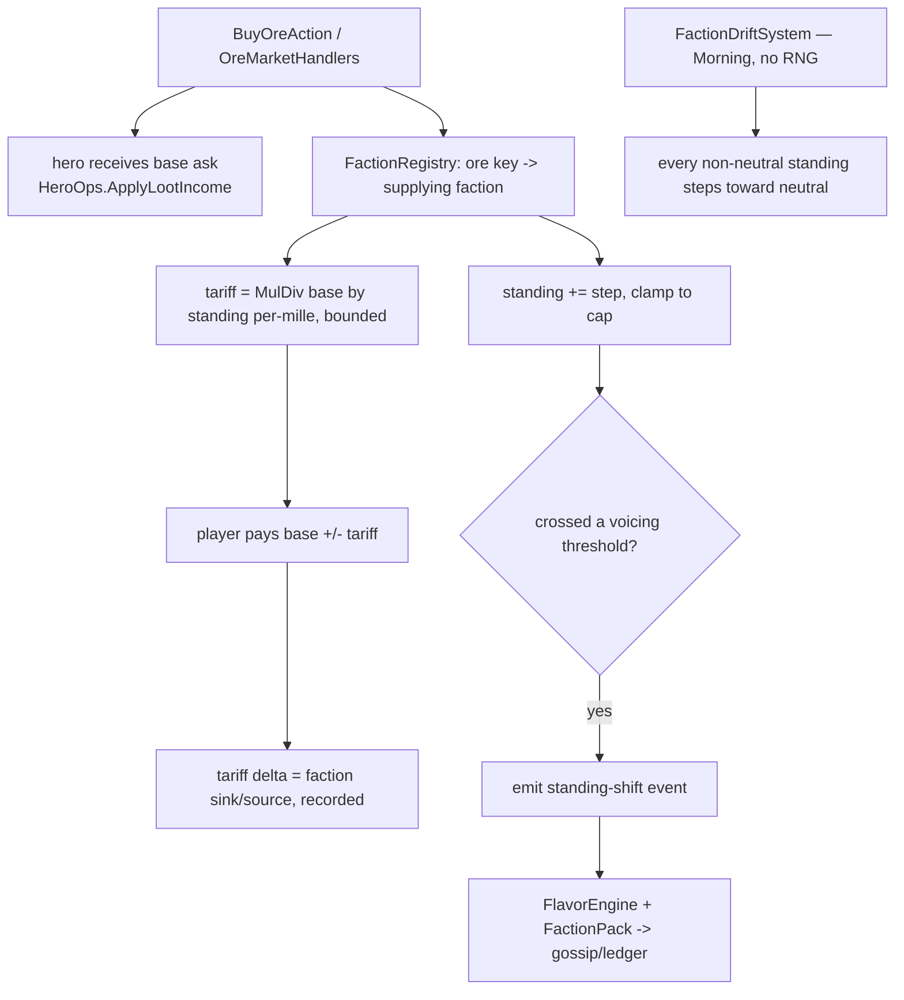

# Town Faction Core - Plan

## Goal Capsule

- **Objective:** The foundational slice of the P5 drama layer — a town-faction registry + per-faction standing that scales an ore-price tariff, voiced by the existing flavor packs. First net-new, band-moving core (P1–P4 were byte-identical relocations).
- **Product authority:** This document, the roadmap `docs/plans/2026-07-15-001-roadmap-beyond-v1.md` (Phase 5 / Pillar 2), the transposition contract `docs/design/catalog-prompt-transposition.md`, and `CLAUDE.md` (determinism, integer-only sim, no runtime LLM in decisions).
- **Stop conditions:** LLM in any decision path, a float/transcendental/wall-clock/`string.GetHashCode` in the sim, or an unbounded tariff are out of bounds — surface, don't code around. Hero-side drama (traits/relationships/arcs) and the other two factions are out of this core.
- **Open blockers:** None. Scope, lever, driver, gold-conservation handling, and the three brainstorm call-outs confirmed with the maintainer 2026-07-16.

**Product Contract preservation:** unchanged from the brainstorm; planning added the Planning Contract, Implementation Units, Verification Contract, and Definition of Done, and resolved the gold-conservation question (sink/source — see KTD3).

---

## Product Contract

### Summary

A town-faction core: a `FactionRegistry` of `FactionDefinition` data plus per-faction standing on the player, with one reference faction (an ore-supply miners' guild) whose standing scales a per-mille tariff on the ore price the player pays through the existing ore market. Standing rises passively as the player buys that faction's ore and drifts back on neglect. The existing flavor packs voice standing shifts in gossip and the evening ledger. Faction effects are the catalog's Pillar 2 (Neutral NPCs & Town Factions), transposed to a deterministic integer nudge.

### Problem Frame

The five shipped cores made professions, loadout, classes, and venues data-driven, but nothing in the world pushes *back* on the player's shop — the economy is a one-way flywheel (craft, sell, profit). The catalog's factions are the intended counter-weight, and P5 is where the world gains agency toward the player. Starting drama with factions (over hero psychology) puts that pressure on the shop first. With one reference faction supplying all ore, the consequence the player feels this core is *how much* they trade (sustained buying earns a discount), not yet *who* they trade with — partner choice arrives with the add-on faction pack. It is deliberately light — a reversible, discount-only nudge, not a gate or a punitive tax — because the maintainer wants the world influencing play "not to a drastic degree yet."

### Key Decisions

- **Factions are the drama foundation, not hero personality.** Drama enters as economic pressure on the player's shop; hero-side drama (traits, relationships, arcs) becomes later cores that can build on this substrate.
- **The lever is a reversible ore tariff, not a content gate or a gold tax.** Standing scales the ore price per-mille; lightest-touch, rides the ore market that already exists, and re-tunes cleanly.
- **Standing is driven passively by trade volume, not an explicit command.** Buying a faction's ore raises its standing; neglect drifts it back toward neutral. No new player action.
- **This core moves the Balance bands on purpose.** A tariff changes ore cost → gold flow → hero purchasing. The `Category=Balance` bands are re-tuned deliberately — the first non-byte-identical core.
- **Standing is felt, not shown, in this core.** Perceived through shifting prices and flavor lines; a numeric factions UI panel is deferred.
- **Deterministic + integer only.** Standing is an integer; the tariff is a per-mille multiply; no floats, no RNG in the standing/tariff path, no runtime LLM.

### Requirements

**Faction registry (the modular substrate)**

- R1. A `FactionDefinition` is pure data (id, display name, flavor/voice hooks, and the parameters its effect reads) registered in a `FactionRegistry`, mirroring the profession/class/venue registries — an add-on faction is one definition + one orchestrator-applied registration line.
- R2. The core ships exactly one reference faction: an ore-supply miners' guild (working id `deepvein`; renamable). The catalog's Crownsguard / Shadow Syndicate / Conservatory are an add-on faction pack, not built here.
- R3. A conformance harness validates every registered faction structurally, and a test-only second faction proves extensibility without going live — matching the P3/P4 pattern.

**Standing state + driver**

- R4. The player carries per-faction standing as an integer, bounded to a fixed range, defaulting to neutral. Standing serializes with player state; a save without it loads as neutral (trailing-optional).
- R5. Buying a faction's ore raises that faction's standing by a bounded, deterministic step; standing drifts back toward neutral over time when the player does not trade with the faction. Integer, no RNG.
- R6. Which ore(s) a faction supplies is faction data, so an add-on faction associates its own materials without touching the standing mechanism.

**Tariff effect**

- R7. When the player pays for ore, the price is adjusted by the supplying faction's standing: higher standing lowers it, lower standing raises it, per-mille with integer rounding. Neutral standing = no change.
- R8. The tariff is bounded (standing at the cap moves price by at most a fixed percentage), so it stays a nudge.

**Voicing (reuse, not new mechanism)**

- R9. Standing shifts crossing a threshold emit a structured event the existing flavor pack engine renders into gossip and/or the evening ledger. The flavor layer voices the drama; it does not drive it.

### Scope Boundaries

**Deferred for later (this product, not now):**
- The other two catalog factions and any faction beyond the one reference → add-on faction pack.
- Additional faction effect levers (gated materials/recipes, inspections, fines) → follow-on effects on the same registry.
- A numeric factions UI panel → cheap follow-on once the loop is proven.
- Hero-side drama: personality/traits, hero-hero relationships, story arcs → separate P5 cores.

**Outside this core's identity:**
- Runtime-LLM voicing of faction dialogue — parked until the content-pack layer proves out in play.
- Faction standing driving hero *behavior* (heroes preferring/avoiding factions) — hero-side drama, not this economic-pressure core.

### Deferred to Follow-Up Work

- Factions accumulating/spending the tariff gold (a faction treasury) — this core treats the tariff delta as a pure sink/source, not a stored balance.
- A standing-LOWERING driver (e.g. buying a rival faction's ore) — until one exists, standing never goes negative, so the surcharge/sink branch (built, per KTD8) is dormant and the tariff is discount-only. The lowering driver arrives with the add-on faction pack and makes the symmetric design reachable by gameplay.

---

## Planning Contract

### Key Technical Decisions

- KTD1. **`FactionRegistry` mirrors the shipped registries** (`ProfessionRegistry`/`ClassRegistry`/`VenueRegistry`): static, `ImmutableSortedDictionary<string, FactionDefinition>` ordinal-keyed, `TryGet`/`IsRegistered`/`Require`, a conformance harness, and a test-only second faction proving extensibility. `FactionDefinition` carries the ore keys it supplies (R6) and the standing→tariff parameters.
- KTD2. **Standing lives on `PlayerState` as `ImmutableSortedDictionary<string,int>` (factionId → standing), a trailing param defaulting to `null`.** A collection is not a compile-time constant, so it cannot default to `.Empty` in a positional record (mirrors `GearSet.Trinket`, which defaults `null`, not an empty collection); the helper `StandingFor(factionId)` coalesces null/absent → 0 (neutral). A pre-core save without the member loads `null` → neutral everywhere → no behavior change until the player trades; `DefaultIgnoreCondition.Never` means fresh saves write `"Standing":{}` (behavior-neutral, no golden save fixtures per `SaveCodec`). The U2 save test asserts *load* behavior (absent → neutral), not byte-identical re-save.
- KTD3. **Gold conservation = faction sink/source with a MANDATORY recorded delta; the hero always receives the base ask.** `OreMarketHandlers` emits no events today and `GoldConservationTests` asserts an *aggregate* invariant deriving the one known leak (rival sales) from `ItemSold`. A tariff that changes the player's cost while the hero receives base moves total gold with nothing to reconcile — so a recorded delta is **required**, not optional: U3 emits a `TariffApplied` `GameEvent` (or a running sink/source counter) carrying the signed delta. The extended aggregate invariant is exact: `TotalGold(after) == TotalGold(before) − rivalSales − Σ tariffDelta` (delta = `playerCost − heroBase`; positive = sink/burn, negative = source/mint). Add a per-purchase assertion too (`playerOut == heroBaseIn + tariffDelta`). No stored faction treasury (deferred).
- KTD4. **Tariff applies to the AGGREGATE line cost, not per unit — per-mille, bounded, via `IntegerCurves.MulDiv`.** `playerCost = MulDiv(qty * offer.UnitPrice, 1000 - adjPerMille, 1000)`. Per-unit rounding was the trap: `MulDiv(3, 900, 1000) == 3` leaves copper/iron (the early-game staples at 3g/5g) unmoved by a 10% nudge, so the tariff would need a ~17% cap just to shave 1g — the opposite of light-touch. Aggregating first (10 copper → `MulDiv(30,900,1000)=27`) gives clean 1g granularity and monotonicity. `adjPerMille` derived from standing, clamped to the R8 cap. Neutral → adj 0 → `MulDiv(x,1000,1000)==x` (exact no-op). The U3 rounding test pins the *aggregate* case.
- KTD5. **Standing drift is a new `IPhaseSystem` registered FIRST in the Morning group, drawing no RNG.** Each Morning, every non-neutral standing steps one increment toward neutral (never past). Verified: no current Morning system reads standing (RivalRestock/Recruit predate it; HeroShopping reads shelves/gold/gear; Gossip reads yesterday's log), so drift's slot is behaviorally inert today — but pinning it *first* makes standing the settled value for the whole day and is load-bearing the moment a future Morning system reads standing (deferred hero-side drama). Draws no RNG → kernel stream untouched (the daily-state change is why the Balance bands move, deliberately). **Registering it in `GameComposition.BuildKernel` is orchestrator-owned** — the worker adds the system class and flags the one-line registration at the head of the Morning systems; the orchestrator lands it (deny-list rule).
- KTD6. **Standing rises inside `OreMarketHandlers` on a successful purchase — priced BEFORE the rise.** Compute the tariff from standing-at-start-of-purchase, then apply the bounded rise step (clamped to cap). The first buy at neutral pays exactly base; the earned standing discounts *subsequent* purchases only (no self-referential discount on the purchase that earned it). Look up the supplying faction by ore key via `FactionRegistry`. No new player action, no RNG.
- KTD8. **This core is discount-only (a bounded gold source); the surcharge/sink half is built but dormant.** The only standing driver here is ore-buying (raises) + drift (toward neutral, never below), so standing never goes negative and R7's "lower standing raises price" surcharge branch is unreachable by gameplay. Honest consequence: in a single-faction world the tariff is always a discount = a one-directional gold source (mild money-supply inflation), never a sink. The symmetric `[−cap, +cap]` design and the surcharge branch stay in the code (ready for a lowering driver — e.g. buying a rival faction's ore, which arrives with the add-on faction pack), but their tests are white-box injection and marked as exercising the dormant half. U5 must bound the money-supply inflation (an upper-bound assertion), since discount-minting makes the player richer and no existing band caps gold on the upside.
- KTD7. **Voicing reuses the flavor engine.** A standing-shift that crosses a threshold emits a structured event (like the existing gossip/ledger sources); a new `FactionPack` supplies the templated lines; `GossipGenerator`/ledger render it through `FlavorEngine`. No new text mechanism; fact slots (faction name, direction) validated + fallback per the engine contract.

### High-Level Technical Design

Assumptions: integer/ordinal throughout; no wall clock; the drift system and the standing-rise are the only writers of standing; conservation is provable per-transaction (player out = hero base-in + tariff delta).

### Sources

- Catalog Pillar 2 + its transposition row in `docs/design/catalog-prompt-transposition.md`.
- Ore-purchase path: `sim/GameSim/Economy/OreMarketHandlers.cs` (cost = `qty * offer.UnitPrice`; the tariff + standing-rise hook), `sim/GameSim/Drama/OrePricing.cs` (base asks), `sim/GameSim/Heroes/HeroOps.cs` (`ApplyLootIncome`), the gold-conservation property test.
- `sim/GameSim/Kernel/IntegerCurves.cs` (`MulDiv`) for the per-mille tariff.
- `sim/GameSim/Flavor/` engine + `GossipGenerator`/`LedgerQuery` for R9 voicing.
- Registry precedents with conformance + test-only reference: `ProfessionRegistry`, `ClassRegistry`, `VenueRegistry`.
- `sim/GameSim/GameComposition.cs` (system registration order = determinism contract) for the drift-system registration.

---

## Implementation Units

### U1. Faction registry + reference faction

**Goal:** The modular faction substrate — `FactionDefinition` + `FactionRegistry` + one reference faction, mirroring the shipped registries.
**Requirements:** R1, R2, R3, R6.
**Dependencies:** None.
**Files:** `sim/GameSim/Factions/FactionDefinition.cs`, `sim/GameSim/Factions/FactionRegistry.cs` (new); `sim/GameSim.Tests/Factions/FactionConformanceTests.cs` (new).
**Approach:** `FactionDefinition` (Id, DisplayName, `ImmutableArray<string> SuppliesOreKeys`, standing→tariff params: max per-mille adjustment at cap, standing cap, per-purchase rise step, per-day drift step). `FactionRegistry.All` ordinal-sorted; `Deepvein` supplies the Mine ore keys (copper…adamant); `Require`/`TryGet`/`IsRegistered`; a `ByOreKey(oreKey)` lookup for the handler. Pure data, no RNG, no Godot.
**Patterns to follow:** `sim/GameSim/Venues/VenueRegistry.cs`, `sim/GameSim/Classes/ClassRegistry.cs`, and their conformance tests.
**Test scenarios:**
- Conformance (parameterized over `All`): id == key, non-blank DisplayName, cap/step/adjustment positive and in sane bounds, `SuppliesOreKeys` all known ore keys, no two factions supply the same ore key (single supplier per ore in this core).
- `ByOreKey` returns the supplying faction for each Mine ore key and none for an unknown key.
- Extensibility: a test-only second faction registered in-test flows through `ByOreKey` + params without being referenced elsewhere.
**Verification:** Fast lane green; conformance passes; no Godot/RNG/float in the new files.

### U2. Standing state, purchase driver, and drift system

**Goal:** Per-faction standing on the player, raised on ore purchase and drifting to neutral each Morning.
**Requirements:** R4, R5.
**Dependencies:** U1.
**Files:** `sim/GameSim/Contracts/Player.cs` (add `Standing` trailing-optional); `sim/GameSim/Economy/OreMarketHandlers.cs` (raise standing on purchase); `sim/GameSim/Factions/FactionDriftSystem.cs` (new, Morning `IPhaseSystem`); `sim/GameSim.Tests/Factions/StandingTests.cs`, `sim/GameSim.Tests/Kernel/SaveLoadTests.cs` (pre-core-save loads neutral). **Orchestrator-owned:** `sim/GameSim/GameComposition.cs` registration of `FactionDriftSystem` — worker flags it, does not edit.
**Approach:** `PlayerState.Standing` (`ImmutableSortedDictionary<string,int>? Standing = null` — collection can't default `.Empty`; `StandingFor(factionId)` coalesces null/absent → 0). On a successful `BuyOreAction`, look up the supplying faction and increment its standing by the rise step, clamped to +cap (standing only rises here; see KTD8). `FactionDriftSystem` registered FIRST in the Morning group (no RNG): every non-neutral standing steps one drift increment toward 0 (never past). Drift draws no RNG — assert the kernel stream is untouched.
**Execution note:** Add the standing-rise as a focused test first (buy ore → standing up by step), then wire the handler; the drift system likewise test-first (non-neutral → steps toward neutral, neutral → unchanged).
**Test scenarios:**
- Buy ore from a faction's supplier → that faction's standing rises by exactly the step; a second buy rises again; rise clamps at +cap.
- Buying an ore no faction supplies → no standing change.
- Drift: positive standing steps down toward 0 each Morning, negative steps up, neutral unchanged, never overshoots 0.
- Drift draws no RNG (kernel `Rng` unchanged across a Morning tick with drift active).
- A save serialized WITHOUT `Standing` loads with neutral standing everywhere (assert load behavior, per KTD2 — not byte-identical re-save, since fresh saves now write `"Standing":{}`); a save with populated standing round-trips its values.
**Verification:** Fast lane green; drift registered FIRST in the Morning group (orchestrator); determinism suite green.

### U3. Ore tariff with faction sink/source

**Goal:** Standing scales the ore price the player pays; the tariff delta is a recorded faction sink/source; the hero receives the base ask.
**Requirements:** R7, R8.
**Dependencies:** U1, U2.
**Files:** `sim/GameSim/Economy/OreMarketHandlers.cs` (tariff the aggregate cost, emit the delta event); `sim/GameSim/Contracts/Events.cs` (new `TariffApplied` event — orchestrator-owned Contracts, worker proposes the record; **mandatory** per KTD3, not conditional); the gold-conservation property test (extend); `sim/GameSim.Tests/Factions/TariffTests.cs` (new).
**Approach:** In the purchase, `playerCost = MulDiv(qty * offer.UnitPrice, 1000 - adjPerMille(standing, faction), 1000)` (AGGREGATE, per KTD4), `adjPerMille` clamped to the faction's max at cap; hero receives `qty * offer.UnitPrice` (base) via `ApplyLootIncome`; emit `TariffApplied` with signed delta `playerCost - heroBase` (negative = source/mint here, since discount-only per KTD8). Price off standing-at-start, apply the rise after (KTD6). Neutral → adj 0 → `playerCost == base` → exact current behavior.
**Technical design (directional):** aggregate invariant `TotalGold(after) == TotalGold(before) − rivalSales − Σ tariffDelta`; the test sums the recorded `TariffApplied` deltas into the ledger check, plus a per-purchase `playerOut == heroBaseIn + tariffDelta` assertion.
**Test scenarios:**
- Neutral standing → player pays exactly base on a FRESH state (not the existing gold-test script, which buys iron day 1 and would be non-neutral by day 2 — use a clean fixture); hero receives base; no `TariffApplied` delta (or delta 0).
- High standing → player pays less than base (aggregate, so cheap ore actually moves — pin 10 copper at a 10% cap = 27g); hero still receives base; `TariffApplied` delta negative (source) and recorded.
- Tariff bounded: standing at +cap moves the aggregate cost by at most the faction's max percentage (assert exact clamped value).
- Surcharge branch (dormant, KTD8): white-box-inject negative standing → player pays more, delta positive (sink) — proves the branch works even though gameplay can't reach it here.
- Gold conservation: over a multi-purchase sequence, `TotalGold(after) == TotalGold(before) − rivalSales − Σ tariffDelta` holds exactly (extend the existing aggregate property test); the `BaselinePlayer` affordability pre-check is base-priced (safe under discount-only: actual ≤ estimate).
- Rounding: aggregate `MulDiv` round-to-nearest pinned at a fractional case.
**Verification:** Fast lane green; extended gold-conservation test green.

### U4. Flavor voicing of standing shifts

**Goal:** Standing shifts crossing a threshold are voiced in gossip/ledger through the existing flavor engine.
**Requirements:** R9.
**Dependencies:** U2.
**Files:** `sim/GameSim/Flavor/Packs/FactionPack.cs` (new); a standing-shift `GameEvent` (orchestrator-owned `Contracts/Events.cs` — worker proposes the record; carries faction id, **display name as a slot value**, and direction); `sim/GameSim/Factions/FactionDriftSystem.cs` + `OreMarketHandlers.cs` (emit on threshold cross); `sim/GameSim/Drama/GossipGenerator.cs` (pack dispatch + hero-less voice for the new event kind); `sim/GameSim.Tests/Flavor/FactionPackTests.cs`, gossip test updates.
**Approach:** When a standing change crosses a named threshold, emit a stamped event carrying faction id + display name + direction. Three things the current `GossipGenerator` can't do and this unit must add (it renders ONLY `TavernPack` today and picks voice via `VoiceProfile.VoiceFor(campaignId, heroValue)` — a hero): (1) **pack dispatch** — select `FactionPack` for faction events (or fold faction keys+fallbacks into a shared pack), since a faction event has no hero-keyed line; (2) a **hero-less deterministic voice** — a campaign narrator voice or `VoiceFor(campaignId, factionIdHash)`, since there's no protagonist; (3) the **faction name reaches the renderer via the event's slot value** (not a `FactionRegistry` lookup inside `Generate`, which receives only heroes+items). Slots: faction name, direction. **Hysteresis** on thresholds (separate up/down values, or a per-direction debounce) so a Morning drift and same-day Evening buy hovering at a boundary don't emit contradictory lines in one gossip batch. Fallbacks per the engine contract. Zero RNG.
**Test scenarios:**
- Crossing a threshold emits exactly one stamped event citing the real faction + direction; not crossing emits none.
- Hysteresis: standing oscillating across a single boundary (drift down + buy up in one day-cycle) emits at most one line per direction per window — no contradictory same-batch pair.
- The gossip line names the faction verbatim (fact-slot preservation, name from the event slot) across a sweep; fallback present + valid.
- Hero-less voice is deterministic: same seed → identical faction gossip across two runs; save round-trip byte-identical.
- Pack conformance (mirrors TavernPack/LedgerPack): every key's slots resolvable, fallback per base key, ≥ the standard variant count.
- Faction lines compete with hero gossip for the `MaxLinesPerDay=3` slots by log order (deterministic; acknowledged, not a defect).
**Verification:** Fast lane green; flavor + gossip suites green.

### U5. Balance re-baseline + faction scenario

**Goal:** Re-tune the `Category=Balance` bands with the tariff active and add a faction-loop scenario proving the intended effect.
**Requirements:** advances the "band-moving core" decision; validates R5/R7 end-to-end.
**Dependencies:** U1, U2, U3, U4.
**Files:** `sim/GameSim.Tests/Balance/` (re-baselined bands + new `FactionTariffBalanceTests.cs`); tune values in `FactionRegistry`'s `Deepvein` params (cap, rise step, drift step, max adjustment).
**Approach:** Run the 100-day balance sim with factions active and re-tune the `Deepvein` params against a NUMERIC criterion, not "looks like a nudge": maxed-standing total ore cost stays within a stated N% of the neutral baseline over 100 days (pick N ≤ ~10%). Note `BaselinePlayer` buys every affordable offer every evening, so standing SATURATES at +cap — the band sim runs at max discount permanently and never exercises drift-back; drift-back is proven only by the dedicated scenario below. Re-baseline the existing bands to the new deterministic values (mechanical), keeping the tariff acceptance criteria (below) independent so the re-baseline isn't circular. Distinguish in the test file which bands are mechanical re-baselines vs independent acceptance asserts.
**Execution note:** This unit deliberately changes the Balance bands — the one place the byte-identical rule is intentionally broken. Re-baseline to the observed deterministic values, don't fight them.
**Test scenarios:**
- 100-day sim with factions active is deterministic (run twice, identical) and the re-baselined bands hold.
- Directional: favored-Deepvein run has strictly lower summed ore cost than a neutral run over the same seed; a dedicated buy-then-stop run drifts back toward base within the drift horizon (the band sim can't show this — standing saturates).
- Cap: aggregate ore cost under maxed standing stays within N% of neutral over the campaign (no runaway discount).
- **Money-supply upper bound (KTD8):** total gold at campaign end under maxed standing stays within a stated bound of the neutral run — discount-minting (a one-directional source here) cannot inflate reserves unobserved. No existing band caps gold on the upside, so this assert is new.
**Verification:** `Category=Balance` green with the new bands; full suite + engine lane green; run twice for determinism.

---

## Verification Contract

| Gate | Command | Applies to |
|---|---|---|
| Fast lane | `dotnet test sim/GameSim.Tests/GameSim.Tests.csproj --filter Category!=Balance` | U1–U4 |
| Balance gate (re-baselined) | `dotnet test sim/GameSim.Tests/GameSim.Tests.csproj --filter Category=Balance` | U5 (bands deliberately move) |
| Engine lane | `dotnet test godot/tests --settings .runsettings` | regression only (no godot change expected) |
| Build | `dotnet build Game.sln` | all |
| Determinism | existing golden-replay + save round-trip, run twice | U2–U4 |

All three CI lanes green on the PR; auto-merge per repo convention.

## Definition of Done

- U1–U5 complete; every gate green locally and in CI.
- `GameComposition` registers `FactionDriftSystem` (orchestrator-applied); system order documented.
- Gold conservation holds under the tariff — aggregate `TotalGold(after) == TotalGold(before) − rivalSales − Σ tariffDelta` and per-purchase `playerOut == heroBaseIn + tariffDelta`, pinned by the extended property test with the mandatory `TariffApplied` delta recorded.
- Money-supply upper bound asserted (KTD8): discount-minting cannot inflate end-of-campaign reserves beyond the stated bound vs neutral.
- Grep-clean: no float/transcendental/wall-clock/`string.GetHashCode`/RNG in `sim/GameSim/Factions/` or the tariff path.
- `docs/addon-guide.md` gains an "Adding a faction" section (registry + `SuppliesOreKeys` + params + conformance), mirroring the profession/class sections.
- Balance bands re-baselined deliberately; the change is called out in the PR as the first intentional band move.
- No abandoned experiments in the diff; deferred items (faction pack, other levers, UI panel, hero-side drama) remain deferred.
