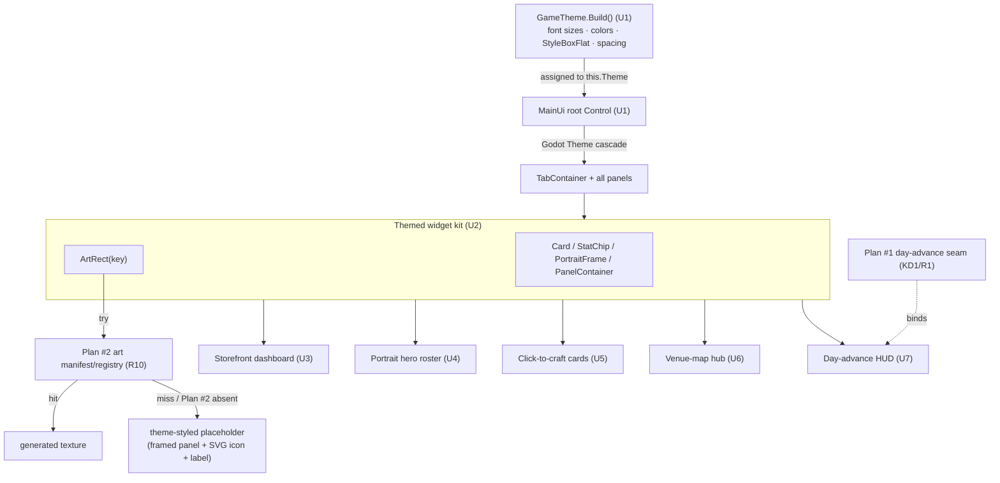

# Full UI Rethink — Plan

> **Plan #3 of 4.** Product contract: `docs/plans/2026-07-18-004-feat-next-phase-scope-plan.md`
> (the origin doc). This plan owns **R11, R12, R15** and realizes **KD4** (a full ground-up UI,
> not a re-skin). Worked **THIRD**, after Plan #1 (Playable Core) and Plan #2 (Art Pipeline &
> Wiring). Everything here is `godot/` — **adapter-only, zero sim changes.**

---

## Goal Capsule

**Objective.** Replace the placeholder programmatic panels ("placeholder look by design", per
`godot/scripts/panels/SimPanel.cs`) with a real game UI: one shared Godot Theme, a storefront
dashboard, a portrait-driven hero roster, a strong click-to-craft surface, a venue-map hub, and a
real HUD home for the hybrid day clock — with the generated art woven into every screen. This is
where "the great graphics" finally appear in gameplay.

**Product authority.** The origin doc. This plan enriches it into implementation units; it does not
redefine scope. Substantive scope changes loop back to the origin first.

**Dependencies (hard).** This plan is worked THIRD and **depends on two other plans**:

- **Plan #1 (Playable Core)** — supplies the player-gated day-advance seam (Advance action + auto
  toggle, KD1/R1) and the rejection-UX contract (R6). **U7** binds that seam. Until Plan #1 lands,
  U7 degrades to wrapping today's `PhaseClock.TogglePlay`/`CycleSpeed`.
- **Plan #2 (Art Pipeline & Wiring)** — supplies the art manifest/registry the Godot layer consumes
  (R10) and the generated pixels (R9). **U2** builds the theme-styled art-loader bridge on top of
  it; **U3–U6** weave that art in. Until Plan #2 lands, the loader falls back to today's null-
  tolerant `IconRegistry.Art`/`Lit` path and every screen renders a theme-styled placeholder.

**Open blockers.** One design fork, resolved in this plan: **OQ4** (drag-to-craft vs click-to-
craft). Resolved to **strong click-to-craft recipe cards** — see KTD5. No open blockers remain.

---

## Summary

Today the Godot client is a tab bar over six panels built from bare `Label`/`Button`/`SpinBox`
controls with scattered per-node color/size overrides and no shared theme; the only place art reads
as a game is `TownScene` + `LitTownOverlay` (a SubViewport with `PointLight2D`s and graceful art
degrade). This plan introduces **one programmatic `GameTheme`** applied at the `MainUi` root (so it
cascades to every descendant without touching the deny-listed `project.godot`), a **reusable themed
widget kit** (card / stat-chip / portrait-frame / art-with-fallback), and then rebuilds the core
screens on that foundation: a **storefront dashboard**, a **portrait hero roster**, **click-to-craft
recipe cards**, a **venue-map hub**, and a **day-advance HUD**. A final unit hardens gdUnit coverage
so themed panels provably render and screens build without layout collapse (R15). Every unit is
`godot/` adapter-only; no sim rule, `GameState`, save, or chronicle is touched, so determinism and
golden-replay are untouched by construction.

---

## Problem Frame

The origin doc's R11/R12 findings, confirmed against the code:

- **No theme exists.** There is no `.tres` theme and no `gui/theme/custom` in `project.godot`.
  Styling is ad-hoc: `SimPanel.AddHeader` hardcodes `Color(0.6f, 0.8f, 1f)`, `MainUi` hardcodes a
  red rejection color, `TownScene` sprinkles `AddThemeFontSizeOverride("font_size", 10..12)`. Text
  is the engine default size — small and low-contrast at target resolution.
- **Panels are placeholder by design.** `SimPanel` documents "plain Controls, placeholder look by
  design." `ShopPanel`, `HeroesPanel`, `ForgePanel`, `DepthsPanel` render flat `VBoxContainer`
  lists of `Label` rows with a tiny slot icon — legible to a test, not a storefront/roster/forge.
- **Art is invisible off the Town tab.** `IconRegistry.Art`/`Lit` can load generated PNGs, but only
  `TownScene`/`LitTownOverlay` consume them. The six management panels show none of the portraits,
  venue backdrops, or item art.
- **The clock has no real HUD home.** `MainUi` builds a one-line `HBoxContainer` status bar with
  Play/Pause/Speed/Ledger buttons and a red persistent rejection label — the timing model Plan #1
  replaces, with no proper controls surface.
- **Tests never assert layout.** `MainUiTests` pins tab count/titles and asserts *rendered text*;
  nothing asserts the theme is applied or that a screen builds without collapsing (R15 gap).

---

## Requirements

This plan satisfies the origin's **UI-rethink** requirements plus its test cross-cut:

| R# | Requirement (origin) | Owned by units |
|----|----------------------|----------------|
| **R11** | One shared Godot Theme governs fonts, sizes, contrast, spacing, panel styleboxes; all text legible at target resolution. | U1 (defines), U2–U7 (consume) |
| **R12** | Core screens rebuilt as real game UI — storefront dashboard, portrait hero roster, craft interaction, venue-map hub — with generated art woven in. | U3 (storefront), U4 (roster), U5 (craft), U6 (venue map), U7 (HUD) |
| **R15** | Fast sim lane stays green; new Godot behavior gains gdUnit4Net coverage (themed panels render, screens build without layout collapse). | Every unit's Test scenarios; U8 (cross-screen harness + pinned-test reconciliation) |

Cross-cutting invariants carried from the origin (must hold in every unit):

- **R14 / KTD2 / determinism.** Zero Godot refs enter `sim/GameSim`; presentation never writes
  `GameState`, saves, or chronicles. This plan touches **only `godot/`** — no sim file is edited, so
  golden-replay and gold-conservation are untouched by construction.

Referenced origin decisions: **KD4** (full rethink, sequenced after playability), **KD1** (hybrid
day clock — the seam U7 binds).

---

## Key Technical Decisions

- **KTD1 — Build the Theme programmatically in C#, applied at the `MainUi` root (R11).** A
  `GameTheme.Build()` returns a fully-populated `Godot.Theme` (default font size, per-type
  `StyleBoxFlat`s, colors, spacing constants); `MainUi._Ready` assigns it to `this.Theme`, which
  Godot cascades to every descendant Control. *Chosen over* a hand-authored `.tres` theme and over
  `project.godot`'s `gui/theme/custom`. Rationale: (1) `project.godot` is **deny-listed** — setting
  a global theme there needs an orchestrator micro-PR; the root-`Theme` property achieves the same
  cascade with zero deny-list contact. (2) A `.tres` theme is complex to hand-edit and CLAUDE.md
  rule 2 forbids opening `godot/` with any non-pinned editor to author it. (3) Programmatic
  construction matches the codebase's established "everything code-built" pattern (`MainUi`,
  `CampPanel`, `LitTownOverlay` are all code-built, no scene surgery) and is directly unit-testable
  in gdUnit (assert `theme.DefaultFontSize`, stylebox presence).

- **KTD2 — A themed widget kit layered on `SimPanel`, not a rewrite of it (R11/R12).** Add reusable
  builders (`Card`, `StatChip`, `PortraitFrame`, `ArtRect`-with-fallback, section-`PanelContainer`)
  as new static/protected helpers alongside `SimPanel`'s existing `AddLabel`/`AddButton`/`AddRow`.
  Each screen is rebuilt to compose these instead of bare rows. Rationale: the `Bind`/`Refresh`/
  `Clear` lifecycle and the `HeroName`/`ItemName` lookups already work and are test-load-bearing;
  reuse them and change only the visual composition.

- **KTD3 — Art loads through a single fallback-safe bridge that consumes Plan #2's manifest (R10,
  R12).** `U2` adds an `ArtRect` helper: given an art key it asks Plan #2's manifest/registry for
  the texture and, on miss (asset not generated, or Plan #2 not yet landed), renders a theme-styled
  placeholder (framed panel + slot/glyph SVG icon + label) — never a blank hole, never a crash. This
  mirrors the graceful-degrade contract already proven in `LitTownOverlay.TryAddBuilding`
  (null `IconRegistry.Lit` → no sprite, no orphan light). Until Plan #2 formalizes the manifest, the
  bridge wraps today's null-tolerant `IconRegistry.Art`/`Lit`.

- **KTD4 — Keep the tab-shell topology; restyle and re-content each tab (R12).** The rethink lands
  screen-by-screen inside the existing `TabContainer`, not as a new navigation model, to keep each
  unit a small independent PR and keep `MainUi`'s bind wiring stable. The venue-map hub (U6) and
  HUD (U7) may add/rename tabs; when they do, the pinned `MainUiTests` tab assertions are updated in
  the same unit and reconciled in U8. *Chosen over* a from-scratch scene graph, which would be one
  large untestable PR and risk the golden Town/Ledger/Camp modal wiring.

- **KTD5 — Resolve OQ4 to strong click-to-craft recipe cards, not true drag-and-drop (R12).**
  *Chosen over* Godot `_GetDragData`/`_CanDropData`/`_DropData` drag-and-drop. Rationale: (1) real
  drag is driven by engine mouse-motion events that gdUnit's signal-emit test harness
  (`UiTestSupport.Press` emits `Pressed`; `Click` emits `GuiInput`) cannot reproduce
  deterministically, so drag-to-craft would ship largely untested — the exact R15 gap this phase
  exists to close. (2) A recipe *card* with a big art icon, affordability-lit material chips, and a
  prominent Craft button "feels good" and reuses the proven `Pressed`-signal path (`ForgePanel`'s
  `OnCraftPressed`). True drag-and-drop is deferred (see Scope Boundaries) as a polish follow-up once
  the card surface exists.

---

## High-Level Technical Design

The theme cascade and the art-fallback bridge are the two structural spines; the rest is
screen composition. One diagram carries the cascade + fallback shape that prose won't:



All boxes are `godot/` presentation. Nothing in this diagram reads or writes `sim/GameSim`; screens
render `Adapter.CurrentState` and queue actions through `SimAdapter.Queue`, exactly as today.

---

## Implementation Units

Dependency order: **U1 → U2 → {U3, U4, U5, U6, U7} → U8.** U3–U7 are mutually independent once U2
lands (parallelizable across sessions; each is its own tab/screen). U8 closes after all screens land.

Every unit below is **`godot/` adapter-only**: it touches no `sim/GameSim` file, writes no
`GameState`/save/chronicle, and therefore cannot affect determinism, golden-replay, or gold-
conservation. This is stated once here and reaffirmed per unit under **Determinism**.

---

### U1. Shared GameTheme resource

**Goal.** One programmatic Godot `Theme` — font sizes, contrast colors, spacing constants, and per-
control-type `StyleBoxFlat`s — applied at the `MainUi` root so it cascades to every screen. This is
the foundation every other unit consumes.

**Requirements.** R11 (defines it); R15 (its own render test).

**Dependencies.** None within this plan. No external plan dependency.

**Files.**
- Create `godot/scripts/ui/GameTheme.cs` — `public static class GameTheme` with `Theme Build()` and
  named palette/size/spacing constants (e.g. `HeaderColor`, `BodyFontSize`, `AccentColor`,
  `RejectionColor`, `PanelStyle()`), plus semantic helpers other units read.
- Modify `godot/scripts/MainUi.cs` — assign `Theme = GameTheme.Build();` in `_Ready` before
  `BuildUi()`; retire the hardcoded `Rejections` red override in favor of `GameTheme.RejectionColor`.
- Test `godot/tests/GameThemeTests.cs` (new).

**Approach.** `GameTheme.Build()` constructs a `Theme`, sets `DefaultFontSize` to a legible target-
resolution size, and registers type styles: `PanelContainer`/`Panel` → a `StyleBoxFlat` (dark
surface, subtle border, content margins, corner radius); `Button` → normal/hover/pressed
`StyleBoxFlat`s; `Label` default + named color variants via `Theme.SetColor`. Expose the same values
as public constants so code that still builds nodes manually (`SimPanel.AddHeader`) can read
`GameTheme.HeaderColor` instead of a literal. Font: rely on the engine default font at bumped sizes
(no committed `.ttf` required); if Plan #2 or art later ships a display `.ttf`, `Build()` can adopt
it in a follow-up — do not add a binary font asset in this unit.

**Patterns to follow.** Mirror the code-built, editor-free style of `godot/scripts/town/
LitTownOverlay.cs` (builds `Gradient`/`GradientTexture2D`/`CanvasModulate` entirely in C#). Keep the
static-factory shape of `godot/scripts/IconRegistry.cs`.

**Determinism.** `godot/` adapter-only; touches no sim, no `GameState`, no save/chronicle.

**Test scenarios.**
- *Happy:* `GameTheme.Build()` returns a non-null `Theme` whose `DefaultFontSize` ≥ the legibility
  target and whose `PanelContainer` `StyleBox` is a `StyleBoxFlat` (not null).
- *Integration:* mount `MainUi` via `UiTestSupport.MountMainUi()`; assert `ui.Theme` is non-null and
  a descendant `Label` (e.g. `StatusLabel`) resolves a font size ≥ target through the cascade
  (`GetThemeDefaultFontSize` / effective size), proving the theme reaches children.
- *Edge:* `Build()` called twice returns independent, equivalent themes (no shared-mutable-stylebox
  aliasing bug).

**Verification.** `dotnet test godot/tests --settings .runsettings` green including
`GameThemeTests`; `MainUi` mounts with the theme assigned and all existing `MainUiTests` still pass.

---

### U2. Themed widget kit + art-loader bridge

**Goal.** Reusable themed building blocks — `Card`, `StatChip`, `PortraitFrame`, section
`PanelContainer`, and a fallback-safe `ArtRect` — that every screen composes, with `ArtRect`
consuming Plan #2's art manifest and degrading to a theme-styled placeholder on any miss.

**Requirements.** R11, R12 (foundation for the screens); R15.

**Dependencies.** U1. **External: Plan #2** (art manifest/registry, R10) — consumed if present;
falls back to `IconRegistry.Art`/`Lit` and then to a placeholder if absent.

**Files.**
- Create `godot/scripts/ui/UiKit.cs` — static builders returning themed controls: `Card(...)`,
  `StatChip(label, value, tone)`, `PortraitFrame(artKey, size)`, `Section(title)` (titled
  `PanelContainer` + body `VBox`), and `ArtRect(artKey, size, fallbackIcon)`.
- Modify `godot/scripts/panels/SimPanel.cs` — expose the kit to panels (e.g. `protected` passthroughs
  or `using` the static kit), keeping existing `AddLabel`/`AddHeader`/`AddButton`/`AddRow`/`AddIcon`
  intact so no current panel breaks.
- Modify `godot/scripts/IconRegistry.cs` — if Plan #2 introduces a manifest type, add a single
  `TryArt(key, out Texture2D)` entry point the kit calls; otherwise keep wrapping the existing
  null-tolerant `Art`/`Lit`.
- Test `godot/tests/UiKitTests.cs` (new).

**Approach.** `ArtRect(key)` asks the manifest (Plan #2) → on hit, a `TextureRect` with
`KeepAspectCentered`; on miss, a `PanelContainer` styled by the theme containing the relevant SVG
slot/glyph icon (via `IconRegistry.Slot`/`Glyph`) plus a caption `Label` — so a screen with zero
generated art still reads as intentional, framed placeholders. `PortraitFrame` is `ArtRect` in a
bordered card sized for hero portraits. `StatChip` is a small themed pill (icon + value) for
gold/atk/def/price. All builders read `GameTheme` constants (U1) — no local color/size literals.

**Execution note.** Land this as a thin, independently-testable library PR **before** any screen
unit, so U3–U7 can be built and reviewed in parallel against a stable kit surface. Verify the
fallback path explicitly (fake key → placeholder), because in CI most generated PNGs may be absent —
the placeholder path is the *common* path until Plan #2 fully lands, not the rare one.

**Patterns to follow.** Graceful degrade: `godot/scripts/town/LitTownOverlay.cs` `TryAddBuilding`/
`TryAddHero` (null texture → skip cleanly). Static art lookup: `godot/scripts/IconRegistry.cs`
`Art`/`Lit`. Builder shape: `SimPanel.AddIcon` (already null-tolerant: null texture → blank spacer).

**Determinism.** `godot/` adapter-only; no sim/`GameState`/save/chronicle contact.

**Test scenarios.**
- *Happy:* `UiKit.Card(...)` / `Section("X")` return themed containers whose stylebox comes from the
  cascade (non-null `PanelContainer` stylebox).
- *Edge (fallback):* `ArtRect("no-such-key")` returns a non-null control containing the fallback SVG
  icon + caption, never null and never throwing — the core graceful-degrade guarantee.
- *Happy (hit):* with a known-present art key (or an injected fake manifest hit), `ArtRect` returns a
  `TextureRect` carrying that texture.
- *Integration:* a `StatChip("Gold", "42", ...)` renders both the label and value text discoverable
  via `UiTestSupport.RenderedText`.

**Verification.** `dotnet test godot/tests --settings .runsettings` green including `UiKitTests`;
fallback path asserted with no generated asset present.

---

### U3. Storefront dashboard (Shop)

**Goal.** Rebuild the Shop tab as a live storefront: shelved stock as art cards with price and the
day's hero-demand/pass reasons, unshelved crafts as stockable cards, and the rival shelf as a read-
only column — replacing today's flat label list.

**Requirements.** R12 (storefront dashboard); R11 (themed); R15.

**Dependencies.** U1, U2. **External: Plan #2** for item/gear art (falls back to slot-icon
placeholders via `ArtRect`).

**Files.**
- Modify `godot/scripts/panels/ShopPanel.cs` — recompose `Refresh()` around `UiKit.Section`/`Card`/
  `StatChip`/`ArtRect`; keep the exact sim reads (`state.Player.Shelf`, `UnshelvedPlayerCrafts`,
  `state.RivalShelf`, `HeroPassedOnItem` grouping) and the exact action queues (`SetPriceAction`,
  `UnstockAction`, `StockAction`) unchanged.
- Modify `godot/tests/MainUiTests.cs` — if any asserted control name/text changes, update; add
  storefront-specific assertions here or in U8.
- Test `godot/tests/ShopPanelTests.cs` (new) — or extend `MainUiTests`.

**Approach.** Three themed `Section`s: **Your Shelf** (one card per shelved item: `ArtRect` for the
item, name + quality, a `StatChip` price, the existing `Price` `SpinBox` + `Reprice`/`Unstock`
buttons, and pass-reason lines tinted with `GameTheme` demand color), **Unshelved Crafts** (card +
stat chips + `StockPrice` spin + `Stock` button), **Rival Shelf** (read-only cards). Preserve every
button `Name` (`Reprice_{id}`, `Unstock_{id}`, `Stock_{id}`) and the feedback label so existing/new
tests keep driving through signals. All queues still go through `Adapter.Queue` — the sim's
`StockAction` validation remains the source of truth (the panel only mirrors it visually).

**Patterns to follow.** Current `godot/scripts/panels/ShopPanel.cs` (the sim reads and action
queues to preserve verbatim); `ForgePanel` `EnsureBuilt`/`Refresh` split.

**Determinism.** `godot/` adapter-only; renders `CurrentState`, queues actions; writes no sim state.

**Test scenarios.**
- *Happy:* after crafting+stocking an item (drive via existing forge/stock flow), the Shop renders a
  card whose text contains the item name, quality, and price; the `Reprice_{id}` button exists.
- *Edge:* empty shelf renders the themed "empty — craft at the forge, then stock it here" section,
  not a blank panel; no layout collapse (panel min-size/children present).
- *Integration:* pressing `Stock_{id}` queues a `StockAction` (assert `Adapter.PendingActions`
  contains it), unchanged from today.
- *Error/fallback:* with item art absent, the card shows the slot-icon placeholder (`ArtRect`
  fallback), still rendering name/price.

**Verification.** `dotnet test godot/tests --settings .runsettings` green; storefront renders cards
with art-or-placeholder and all existing Shop action paths intact.

---

### U4. Portrait-driven hero roster

**Goal.** Rebuild the Heroes tab as a portrait roster: each hero a portrait card (class-tinted
frame, level/gold/deepest chips, alive/dead state) with a detail pane showing worn gear as art rows
and lifetime maker's-mark tallies — replacing today's `ItemList` text roster.

**Requirements.** R12 (portrait roster); R11; R15.

**Dependencies.** U1, U2. **External: Plan #2** for hero portraits (`hero-{classId}` art, per
`IconRegistry.Art`/`Lit` naming); falls back to the hand-authored `hero_{classId}.svg` sprite or a
placeholder frame.

**Files.**
- Modify `godot/scripts/panels/HeroesPanel.cs` — replace the `ItemList` roster with a scrollable grid
  of `PortraitFrame` cards; keep `SelectHero(int)` (town-click routing R20) and the detail render;
  restyle gear rows with `ArtRect` + `StatChip`. Preserve the `_selectedHeroId` selection behavior
  and `LedgerQuery.MarkTally` reads.
- Modify `godot/tests/MainUiTests.cs` — the hero-roster assertion currently reads `ItemList` text via
  `RenderedText`; update to the new card structure (roster still exposes each hero's name as
  discoverable text).
- Test `godot/tests/HeroRosterTests.cs` (new) — or extend `MainUiTests`.

**Approach.** Roster = `GridContainer`/`FlowContainer` of `PortraitFrame` cards; clicking a card
runs the same `RenderDetail` path the `ItemList.ItemSelected` handler runs today. Class tint reuses
`HeroSprite.RoleColor(hero.ClassId)` (already used for the gear marker chip). Portrait art key
`"hero-" + classId` (matching `LitTownOverlay.HeroSpec.LitId` convention); `ArtRect` fallback → the
class SVG sprite (`IconRegistry.Sprite(classId)`) → placeholder. Detail pane keeps gear + mark tally
+ item memories, restyled as art rows.

**Patterns to follow.** Current `godot/scripts/panels/HeroesPanel.cs` (`SelectHero`, `RenderDetail`,
`MarkTally`); class-tint via `godot/scripts/town/HeroSprite.cs` `RoleColor`; portrait naming via
`LitTownOverlay.DefaultHeroes`.

**Determinism.** `godot/` adapter-only; read-only over heroes (A2), queues nothing.

**Test scenarios.**
- *Happy:* mounted mid-game, the roster renders a card per hero and each hero name is discoverable via
  `RenderedText`; selecting a hero renders its gear + mark tally in the detail pane.
- *Edge:* a dead hero renders its `DIED day N` state on the card without collapsing the grid.
- *Integration:* `SelectHero(heroValue)` from a simulated town click renders that hero's detail
  (R20 routing preserved).
- *Fallback:* with portrait PNG absent, the card shows the SVG-sprite or placeholder frame, still
  showing the hero name/level.

**Verification.** `dotnet test godot/tests --settings .runsettings` green; roster renders portrait
cards with graceful fallback; town→hero routing intact.

---

### U5. Click-to-craft recipe cards (Forge)

**Goal.** Rebuild the Forge tab as strong click-to-craft recipe cards: each recipe an art card with
affordability-lit material chips, output stats, and a prominent Craft button; talents as themed
unlock cards — resolving OQ4 to click-to-craft (KTD5).

**Requirements.** R12 (craft interaction); R11; R15. Resolves **OQ4**.

**Dependencies.** U1, U2. **External: Plan #2** for item/recipe art (falls back to slot-icon).

**Files.**
- Modify `godot/scripts/panels/ForgePanel.cs` — recompose recipe rows as `Card`s (recipe `ArtRect`,
  name/tier/slot, material-requirement `StatChip`s that light green when affordable / dim when not,
  output atk/def/wt chips, `Craft_{recipeId}` button); talents as unlock cards. Keep the
  `MaterialSelect` `OptionButton`, `SelectedMaterialOr`, `OnCraftPressed`/`OnUnlockPressed`, and the
  `CanUnlock` enablement — all sim-owned validation stays the source of truth.
- Test `godot/tests/ForgeCraftTests.cs` (new) — or extend `MainUiTests` (there is already a
  `ForgePanel_RendersThemedIcons_AfterBinding` case to keep green/adapt).

**Approach.** For each selected profession's recipes (via `ProfessionRegistry`, unchanged), render a
card; compute `have = state.Player.Materials[...]` (read-only mirror) to tint the material chip —
affordability lighting is a *visual* mirror; the kernel's `CraftAction` remains the real gate (R6
alignment: prefer visually disabling the Craft button when unaffordable, but a queued craft the
kernel rejects is still handled by the rejection UX Plan #1 owns). Craft button keeps its exact
`Pressed`-signal path so `UiTestSupport.Press` drives it.

**Execution note.** Because OQ4 is resolved *away* from drag-and-drop, add an explicit test that the
Craft affordance is reachable through the `Pressed` signal (the deterministic path) — this is the
evidence that closes the "no test drives the craft loop" gap for the Forge.

**Patterns to follow.** Current `godot/scripts/panels/ForgePanel.cs` (recipe iteration, material
selection, craft/unlock queue paths, `CanUnlock` enablement) — preserve verbatim, restyle only.

**Determinism.** `godot/` adapter-only; queues `CraftAction`/`UnlockTalentAction` through the
adapter exactly as today; writes no sim state.

**Test scenarios.**
- *Happy:* with starter materials present (Plan #1 seeds them — or inject a state that has them), a
  recipe card renders with an enabled `Craft_{recipeId}` button and affordability-lit chip; pressing
  it queues a `CraftAction` (assert `PendingActions`).
- *Edge:* with zero materials, the material chip renders "dim/insufficient" and the Craft button is
  disabled (or, if kept enabled, the queued action is the kernel's to reject) — no layout collapse.
- *Integration:* changing `MaterialSelect` re-renders cards with the chosen material key (existing
  `ItemSelected → Refresh` behavior preserved).
- *Talent:* an unlockable talent card enables `Unlock_{nodeId}` only when `CanUnlock` is true.

**Verification.** `dotnet test godot/tests --settings .runsettings` green; craft reachable via the
`Pressed` signal; material affordability visually reflected; sim validation untouched.

---

### U6. Venue-map hub

**Goal.** Reframe the venue/depths surface as an interactive map hub: each venue a backdrop tile
showing its state (depth records / hero standings), replacing the flat `DepthsPanel` text board — the
place Plan #2's venue backdrops (Gloomwood, Sunken Crypt, Mine, …) finally appear in gameplay.

**Requirements.** R12 (venue-map hub); R11; R15.

**Dependencies.** U1, U2. **External: Plan #2** for venue backdrop art (falls back to a themed tile
placeholder).

**Files.**
- Modify `godot/scripts/panels/DepthsPanel.cs` — recompose `Refresh()` into a map hub: a
  `GridContainer`/`FlowContainer` of venue tiles (each an `ArtRect` backdrop + venue name + the
  deepest-floor standings that belong to it), reading `state.Drama.DepthsBoard` (and any venue keys
  the sim exposes) exactly as today. If the sim's venue enumeration is not directly on `DramaState`,
  keep the single-board hub and tile per venue-of-record; do not add sim reads that don't exist.
- Optionally rename the `Depths` tab to `Venues` — if so, update the pinned tab-title assertion in
  `MainUiTests` in this unit (reconciled in U8).
- Test `godot/tests/VenueHubTests.cs` (new) — or extend `MainUiTests`/`DepthsPanelTests`.

**Approach.** Tiles are `ArtRect(venueBackdropKey)` cards; on missing art, the theme-styled
placeholder (framed tile + `depths` glyph + venue name) keeps the map legible. Standings render as
`StatChip`/labels inside the relevant tile. Clicking a tile is optional for this unit (no new sim
navigation is in scope this phase — routing/venue-graph M6 is deferred); default to a non-interactive
informational hub unless a click maps to an existing tab.

**Execution note.** Confirm exactly which venue/floor data the sim already exposes (`DramaState.
DepthsBoard` is confirmed; broader venue state is *not* assumed) before adding tiles — do **not**
invent sim reads. If only the single depths board exists, ship a one-tile-per-known-venue hub driven
by that board; richer per-venue data is a follow-up when the sim exposes it.

**Patterns to follow.** Current `godot/scripts/panels/DepthsPanel.cs` (`DepthsBoard` ordering/read);
`ArtRect` fallback (U2); `LitTownOverlay` building-tile layout as a visual reference.

**Determinism.** `godot/` adapter-only; read-only over drama/venue state; queues nothing.

**Test scenarios.**
- *Happy:* mounted mid-game with standings, the hub renders a venue tile whose text contains the
  expected `floor N — HeroName` standings (preserving today's `DepthsPanel` assertion content).
- *Edge:* empty board renders the themed "no records yet — the Mine awaits" tile, not a blank panel.
- *Fallback:* with venue backdrop art absent, tiles show the themed placeholder, still legible.
- *Integration (if tab renamed):* `MainUiTests` tab-title assertion updated and green.

**Verification.** `dotnet test godot/tests --settings .runsettings` green; venue hub renders tiles
with backdrop-or-placeholder; standings content preserved.

---

### U7. Day-advance HUD + status header

**Goal.** Give the hybrid day clock a real HUD home: a restyled status header (day/phase/gold/heroes
with icons) plus a prominent **Advance** control and an **auto** toggle bound to Plan #1's player-
gated day-advance seam — replacing today's one-line Play/Pause/Speed bar and the raw persistent
rejection label.

**Requirements.** R12 (controls surface); R11 (themed HUD); R15. Realizes the presentation half of
**KD1**.

**Dependencies.** U1, U2. **External: Plan #1** (hard) — the day-advance seam (Advance action + auto
toggle, R1) and the player-phrased rejection UX (R6). If Plan #1 has not landed, degrade to wrapping
today's `PhaseClock.TogglePlay`/`CycleSpeed`/`Ledger` controls, themed.

**Files.**
- Modify `godot/scripts/MainUi.cs` — rebuild `BuildUi()`'s status bar into a themed HUD header:
  icon+value status chips (`GameTheme`/`UiKit`), a primary **Advance** button and **auto** toggle
  wired to Plan #1's advance seam (or `PhaseClock` fallback), and move rejection messages into a
  transient themed toast/banner (per R6) instead of the persistent red `_rejections` label.
- Modify `godot/scripts/PhaseClock.cs` — only if Plan #1 requires the auto toggle to route through
  the gated advance (KD1: "auto rides on top"); otherwise leave the clock to Plan #1's unit and bind
  to its API.
- Modify `godot/tests/MainUiTests.cs` — update status-bar assertions (`StatusLabel` text is asserted
  today) to the new HUD structure; keep day/phase/gold discoverable text.
- Test `godot/tests/DayAdvanceHudTests.cs` (new) — or extend `MainUiTests`.

**Approach.** Header = a themed `PanelContainer` row of `StatChip`s (gold glyph already exists via
`IconRegistry.Glyph("gold")`; add phase/day/heroes chips) + a right-aligned controls cluster:
**Advance** (primary styled) triggers Plan #1's gated advance; **auto** toggle starts/stops the timer
that fires the *same* advance (KD1 — one code path). Rejections become a transient banner that reads
a player-phrased message (Plan #1 R6) and auto-dismisses, not a permanent red string. Preserve the
`Ledger` reopen affordance.

**Execution note.** This unit has the tightest cross-plan seam. Build it against Plan #1's advance
API **by name once Plan #1 lands**; until then, implement behind a thin internal `IAdvanceControl`
seam so the HUD is testable against the fallback (`PhaseClock`) and re-points to the gated advance
with a one-line binding change. State the fallback behavior in the PR description.

**Patterns to follow.** Current `godot/scripts/MainUi.cs` `BuildUi` (status bar construction,
Play/Pause/Speed/Ledger wiring, `RefreshStatus`) — preserve the bind/refresh lifecycle, restyle the
surface. Icon-in-status pattern already present (`GoldIcon` `TextureRect`).

**Determinism.** `godot/` adapter-only; the Advance control calls `SimAdapter.AdvancePhase` (or Plan
#1's gated equivalent) exactly as the auto path does — no new sim rule, no state write outside the
kernel tick the adapter already performs.

**Test scenarios.**
- *Happy:* pressing **Advance** advances exactly one phase (assert `CurrentState.Phase` progressed by
  one tick) — the gated source-of-truth path.
- *Happy (auto):* enabling **auto** fires the same advance on the timer (assert it routes through the
  same advance call, e.g. day progresses without a manual press); disabling stops it.
- *Edge (rejection UX):* a rejected action surfaces as a transient themed banner with a player-phrased
  message, not a persistent raw kernel string (R6); it clears on the next clean tick.
- *Integration:* status chips reflect live `Day`/`Phase`/`Gold`/alive-heroes after a tick.

**Verification.** `dotnet test godot/tests --settings .runsettings` green; Advance + auto both drive
the single gated advance; rejection banner is transient and player-phrased.

---

### U8. Cross-screen render harness + pinned-test reconciliation

**Goal.** Close the R15 gap at the seams the per-screen units leave: a cross-screen "themed + no
layout collapse" smoke harness over every tab, and reconciliation of the pinned `MainUiTests`
assertions (tab count/titles, status text) with whatever U3–U7 changed.

**Requirements.** R15 (the cross-screen guarantee); R11/R12 (verifies them).

**Dependencies.** U1–U7 (runs after all screens land).

**Files.**
- Modify `godot/tests/MainUiTests.cs` — reconcile the tab-count/title assertions (currently pinned to
  `7` tabs and `"Town,Forge,Shop,Heroes,Tavern,Depths,Bounties"`) and the `StatusLabel` assertions to
  the final UI; keep the golden Town/Ledger/Camp modal cases green.
- Create `godot/tests/UiRenderSmokeTests.cs` — for each tab: mount `MainUi`, `Refresh`, assert the
  panel has a non-null theme in its cascade, has ≥1 child control, and reports a non-degenerate
  layout size (no zero-height collapse) with and without generated art present.
- Modify `godot/tests/UiTestSupport.cs` — if a helper is needed to assert "theme reaches control" or
  "control laid out non-degenerately," add it here (mirrors existing `RenderedText`/`Find` helpers).

**Approach.** A data-driven test over the tab set: for each panel, after `MountMainUi()` +
`AdvanceDay`, assert (1) theme cascade non-null, (2) child count > 0, (3) `Size`/`GetCombined
MinimumSize` non-degenerate (guards the "one-character-per-line collapse" *class* the origin flags).
Run the same assertions with art assets absent (the CI-common case) to prove the U2 fallback keeps
every screen laid out. Reconcile pinned assertions last so the suite reflects the shipped UI.

**Execution note.** This is the R15 backstop the origin explicitly demands ("no test drives the UI
loop or asserts label layout"). Prefer asserting *layout non-degeneracy* over pixel exactness —
pixel snapshots are brittle across the pinned engine and out of scope.

**Patterns to follow.** `godot/tests/MainUiTests.cs` (`[TestSuite][RequireGodotRuntime]`, mount/
drive/assert-rendered-text, `finally { Unmount }`); `godot/tests/UiTestSupport.cs` helpers.

**Determinism.** Test-only, `godot/tests`; touches no sim, no `GameState`, no save/chronicle.

**Test scenarios.**
- *Happy:* every tab passes the render-smoke assertions (theme cascade, child count, non-degenerate
  layout) after a full simulated day.
- *Edge (no art):* the same suite passes with all generated PNGs absent (U2 fallback holds every
  screen together).
- *Reconciliation:* updated tab-count/title and status assertions are green; golden Town/Ledger/Camp
  modal tests remain green.

**Verification.** `dotnet test godot/tests --settings .runsettings` fully green, including the new
smoke suite in both art-present and art-absent configurations.

---

## Verification Contract

**Gate commands (must be green before any unit is reportable):**

```bash
# Sim fast lane — must stay green (this plan changes no sim code, so it must never regress)
dotnet test sim/GameSim.Tests/GameSim.Tests.csproj --filter Category!=Balance

# Engine/UI tests — the primary gate for this plan (needs Godot; GODOT_BIN via .runsettings)
dotnet test godot/tests --settings .runsettings

# Whole-solution build
dotnet build Game.sln
```

**Determinism guardrail (assert unchanged, do not re-run as a gate this plan can move):** the sim
golden-replay and gold-conservation tests live in the fast lane above; because this plan edits **no**
`sim/GameSim` file, they must remain green untouched. Any diff of a `sim/GameSim/**` file in a PR from
this plan is a defect.

**Definition of Done.**
- U1–U8 landed as separate `feat/uN-slug` branches/PRs (CLAUDE.md multi-agent rules), each green in
  CI with the branch up to date.
- One `GameTheme` is applied at the `MainUi` root and demonstrably cascades to every screen (U1, U8).
- Shop, Heroes, Forge, and the venue surface are rebuilt as themed game screens (storefront cards,
  portrait roster, click-to-craft cards, venue-map tiles) with generated art woven in and a
  theme-styled placeholder on every art miss (U3–U6).
- The day clock has a themed HUD with an Advance control + auto toggle bound to Plan #1's gated
  advance (or its documented fallback), and rejections surface as transient player-phrased banners
  (U7).
- gdUnit coverage proves themed panels render and every screen builds without layout collapse, in
  both art-present and art-absent runs; pinned `MainUiTests` assertions reconciled to the shipped UI
  (U8).
- No `sim/GameSim/**` file changed; fast lane green; no deny-listed file (`project.godot`, `Game.sln`,
  `Directory.Build.props`, etc.) edited by this plan.

---

## Scope Boundaries

**In scope (this plan):** the shared programmatic Godot Theme (R11); the themed widget kit + art-
fallback bridge; the storefront dashboard, portrait hero roster, click-to-craft recipe cards, and
venue-map hub (R12); the day-advance HUD home + transient rejection UX presentation; and the gdUnit
render/layout coverage (R15). All `godot/` adapter-only.

**Deferred to Follow-Up Work:**

- **True drag-and-drop craft** (`_GetDragData`/`_CanDropData`/`_DropData`). OQ4 is resolved to click-
  to-craft cards (KTD5); real drag is a polish follow-up once the card surface exists and a
  deterministic drag-test approach is chosen.
- **Venue-graph / routing navigation (M6)** and any *new* per-venue sim data. U6 is an informational
  hub over data the sim already exposes; interactive venue routing is an explicit origin non-goal
  this phase.
- **A committed display `.ttf` / custom font asset.** U1 uses the engine font at legible sizes; a
  branded font is a later, isolated addition (binary asset + `.import`).
- **Scene-graph migration of the town to a full SubViewport (V4b) / project-wide `.tscn` re-author.**
  KTD4 keeps the tab topology; deeper scene surgery is out of scope and engine-version-gated.
- **`project.godot` global-theme setting.** Deferred by design — the root-`Theme` cascade avoids the
  deny-listed file; wiring `gui/theme/custom` (if ever wanted) is an orchestrator micro-PR, not this
  plan's.
- **Pixel-snapshot / visual-regression testing.** U8 asserts layout non-degeneracy, not pixels;
  screenshot diffing is a separate tooling effort.
- **Restyling the remaining secondary panels** (Tavern, Bounties) and the Ledger/Camp modals beyond
  inheriting the U1 theme cascade — they gain the theme for free; bespoke redesigns are follow-ups if
  wanted. (Ledger/Camp *layout-collapse* fixes are Plan #1's R7, not this plan.)

---
