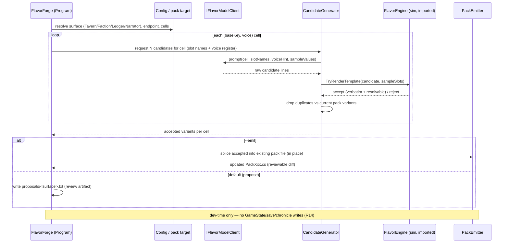

# Dev-Time Flavor LLM (FlavorForge) — Plan

> **Plan #4 of the next-phase scope.** Independent of Plans 1–3; can land any time.
> Product authority is the origin doc; this plan enriches it into implementation units and
> does not redefine scope.

---

## Goal Capsule

**Objective.** Build a **dev-time-only** console tool, `tools/FlavorForge`, that uses a local
model (Ollama / LM Studio on localhost) to *author* candidate flavor-pack variant lines, runs
**every** candidate through the existing `FlavorEngine` template contract, rejects anything that
fails, and emits the accepted lines back into the **existing** committed pack files. The tool
ships **zero runtime weight and zero new runtime dependency**: the sim never calls a model at
run time; the committed output is plain pack DATA that the existing conformance + golden tests
already guard.

**Product authority.** `docs/plans/2026-07-18-004-feat-next-phase-scope-plan.md` (this plan owns
**R13** and the cross-cutting **R14** as it applies to dev tooling). The local-endpoint ruling is
`docs/plans/2026-07-16-002-feat-catalog-adaptation-policies-plan.md` (**KD5**: build-time content
packs first; runtime LLamaSharp reword stays parked).

**Open blockers.** None. One flagged coordination item: adding `tools/FlavorForge` to `Game.sln`
touches a deny-list file, so the `.sln` edit lands as a dedicated **orchestrator micro-PR** (see
U1 Execution note) — not authored inside this plan's feature branch.

---

## Summary

`FlavorForge` mirrors the shape of `tools/Analytics`: a top-level-statements console `Exe` with a
`ProjectReference` to `sim/GameSim` and **no** `TargetFramework` of its own (it inherits `net10.0`
from `Directory.Build.props`). It reads the slot contract already published by each pack
(`TavernPack.SlotNames`, and the equivalents for the Faction / Ledger / Narrator surfaces), asks a
local model for candidate lines per `(baseKey, voice)` cell, and gates every candidate through
`FlavorEngine.TryRenderTemplate` with that cell's declared slots. Only candidates that (a) parse
cleanly, (b) resolve every `{slot}`, and (c) reproduce every provided slot value verbatim are
accepted; the rest are dropped. Accepted lines are de-duplicated against the pack's current
variants and spliced **into the existing pack file** for that surface (never a new same-surface
pack), preserving the exact cross-voice key set the conformance test pins. The dev then re-pins
the affected prose goldens and runs the fast lane. The model client is abstracted behind a seam so
CI (and every unit test) runs against a **deterministic stub**, never a live endpoint.

---

## Problem Frame

The launch flavor packs are large, hand-authored C# (`TavernPack.cs` alone is ~600 lines / 54 KB;
every `(baseKey, voice)` cell carries 12+ variants in a frozen voice register). Growing pack
breadth by hand is slow and error-prone, and the owner wants a self-serve generator. But three
hard constraints shape the tool:

1. **The template contract is unforgiving and load-bearing.** `FlavorEngine.TryRenderTemplate`
   (sim/GameSim/Flavor/FlavorEngine.cs, ~L93/129–136) requires every provided slot **value** to
   appear verbatim in the rendered line. A model that paraphrases a fact ("the blade" instead of
   the literal `{item}` value) produces a line that *fails validation at runtime and falls back*.
   Every candidate must be gated through the real engine before it can be committed.

2. **The pack key surface is pinned exactly.** `Pack_VariantKeys_AreExactlyBaseKeysCrossVoices`
   asserts `Variants.Keys` is exactly `{baseKey}/{voice}` for every base key × every
   `VoiceProfile.Voices` entry — no more, no fewer. The tool must **extend variant lists inside
   existing keys**, never add new same-surface packs or new keys.

3. **Determinism must stay untouched (R14).** The model lives only in `tools/`. Nothing the tool
   does writes into `GameState`, saves, or chronicles. Adding variants to a key changes that key's
   variant count, which *shifts* the stable variant pick — a **deliberate, reviewed** prose change
   that requires re-pinning the affected goldens; it must never be an accidental golden break.

---

## Requirements

This plan satisfies:

- **R13** — a dev-time tool generates flavor-pack content variants using a local model, validates
  every candidate through the existing flavor template contract, and emits committed pack data;
  ships zero runtime weight and zero new runtime dependency. **Owned in full.**
- **R14** (as applied to dev tooling) — sim-purity/determinism invariants hold unchanged: the model
  dependency lives only in `tools/`, never in `sim/GameSim` or `godot/`; the tool never writes
  `GameState`/saves/chronicles; the golden-replay and pack-conformance tests stay green because the
  committed output is data already behind those tests. **Owned for the dev-tool slice.**

Referenced key decisions: **KD5** (dev-time packs first, runtime LLM parked).

---

## Key Technical Decisions

- **KTD-A — New console project `tools/FlavorForge`, mirroring `tools/Analytics`.** Same csproj
  shape (`OutputType=Exe`, `RootNamespace`, single `ProjectReference` to `GameSim`, **no** TFM
  element — inherited from `Directory.Build.props`). Rationale: reuses an approved, in-repo pattern
  for "console tool that references the sim"; keeps the model strictly in `tools/`; keeps the
  net10.0-only guard intact (KD5, R13, R14).
- **KTD-B — Model access behind an `IFlavorModelClient` seam; live HTTP impl for localhost, stub
  for tests/CI.** The live client talks to a dev-time local endpoint (Ollama `POST
  /api/generate` on `:11434`, or an LM Studio OpenAI-compatible `POST /v1/chat/completions` on
  `:1234`) using the framework's built-in `System.Net.Http` + `System.Text.Json` — **no new NuGet
  dependency**. CI and every unit test inject a deterministic stub. Rationale: the local endpoint
  is explicitly allowed dev-time authoring per the `2026-07-16-002` ruling; a seam keeps the loop
  testable without a live model and keeps the "zero new dependency" promise (R13, KD5).
- **KTD-C — The engine is the acceptance gate; the tool imports and calls
  `FlavorEngine.TryRenderTemplate`.** Candidates are validated through the *actual* sim code (not a
  reimplementation), with the *actual* declared slot set for the cell, so a candidate is accepted
  iff it would render cleanly in play. Rationale: single source of truth for the verbatim-slot
  contract; no drift between tool and engine (R13).
- **KTD-D — Extend existing pack files in place; never add a same-surface pack; never change the
  key set.** The emitter appends accepted variants into the target key's existing
  `ImmutableList.Create(...)` block, keyed off the section-header comments already in the pack
  files, and re-emits the file. It reads the authoritative slot names and voices from the pack's
  own published tables (`TavernPack.SlotNames`, `VoiceProfile.Voices`). Rationale: respects
  `Pack_VariantKeys_AreExactlyBaseKeysCrossVoices` and the additive-same-surface constraint by
  construction (R13, R14).
- **KTD-E — Golden re-pin is an explicit, reviewed step, not a side effect.** Emitting variants
  shifts stable picks; the plan requires re-running the fast lane, re-pinning the handful of
  exact-prose golden assertions (e.g. `Generate_FixedCampaignAndEvents_PinsExactProse`), and
  committing that prose change deliberately. Rationale: keeps determinism honest — a golden move is
  always a decision on record, never an accident (R14, KTD5-style discipline).
- **KTD-F — Safe-by-default output: `propose` mode writes a review artifact; `emit` mode splices
  in place.** Default run emits accepted candidates to a proposal file under the tool's own
  directory (dev-only, git-ignored or clearly non-sim); an explicit `--emit` splices into the pack
  file to produce a normal reviewable diff. Rationale: no surprise writes into sim source; the diff
  + conformance tests are the real gate.

---

## High-Level Technical Design

The tool is a straight pipeline; the only branch is the model-client seam (live vs stub) and the
output mode (propose vs emit). A mermaid sequence makes the acceptance gate and the "engine is the
judge" relationship explicit.



Everything left of `PackEmitter` is `tools/`-only, dev-only code. The single arrow into
`sim/GameSim` is a read-only *call* to `FlavorEngine` (already public); no sim source changes, so
sim purity and golden-replay are untouched.

---

## Implementation Units

Dependency order: U1 → U2 → U3 → U4 → U5 → U6. U2 and U3 are the testable core; U4 is codegen; U5
wires the CLI; U6 is the test + re-verification gate.

### U1. FlavorForge project scaffold + solution wiring

**Goal.** Create the `tools/FlavorForge` console project so the rest of the tool has a home that
builds under the existing net10.0 guard, and flag the `Game.sln` edit as an orchestrator micro-PR.

**Requirements.** R13 (zero new runtime dependency; the tool is `tools/`-only), R14 (dependency
lives only in `tools/`).

**Dependencies.** None.

**Touches.** `tools/` — **dev-only**. No `sim/GameSim` or `godot/` changes. Determinism untouched.

**Files.**
- Create `tools/FlavorForge/FlavorForge.csproj` — `OutputType=Exe`, `RootNamespace=FlavorForge`,
  single `ProjectReference` to `..\..\sim\GameSim\GameSim.csproj`, **no** `<TargetFramework>`
  (inherited), a non-blank `<Description>` and traceable naming (org resource-hygiene rule).
- Create `tools/FlavorForge/Program.cs` — top-level-statements entry stub (usage + arg parse
  skeleton only; real orchestration lands in U5).
- Modify (orchestrator micro-PR, NOT this branch) `Game.sln` — add the project under the existing
  `tools` solution folder (`{07C2787E-EAC7-C090-1BA3-A61EC2A24D84}`), next to `Analytics`.

**Approach.** Copy `tools/Analytics/Analytics.csproj` verbatim, change `RootNamespace` and the
descriptive comment, keep the "TargetFramework comes from Directory.Build.props" note. `Program.cs`
prints a usage banner and returns non-zero on no args, matching Analytics' entry contract.

**Execution note.** `Game.sln` is on the multi-agent deny-list. Do **not** edit it on the feature
branch; open a one-line CONTRACT-REQUEST to the orchestrator to add the project reference as a
dedicated micro-PR merged before/independently of this branch. The project builds via
`dotnet build tools/FlavorForge/FlavorForge.csproj` without the sln entry; the sln edit only wires
it into `dotnet build Game.sln`.

**Patterns to follow.** `tools/Analytics/Analytics.csproj` (csproj shape, no-TFM), `tools/Analytics/Program.cs` (top-level entry, usage/return convention).

**Test scenarios.** Test expectation: none — pure scaffold (csproj + entry stub); build success is
the check, exercised by U6's build step. No behavior to assert yet.

**Verification.** `dotnet build tools/FlavorForge/FlavorForge.csproj` succeeds on net10.0; the
build log shows no `net8.0`; `Directory.Build.props` is unmodified.

---

### U2. Local-model client seam (`IFlavorModelClient` + HTTP impl + deterministic stub)

**Goal.** Abstract the local model behind an interface with a live localhost HTTP implementation
(Ollama / LM Studio) and a deterministic in-memory stub, so the generation loop is fully testable
without a live endpoint and no new dependency is added.

**Requirements.** R13 (local model, zero new runtime dependency), R14 (dependency confined to
`tools/`), KD5 (dev-time local endpoint allowed).

**Dependencies.** U1.

**Touches.** `tools/` — **dev-only**. No sim/godot changes. Determinism untouched.

**Files.**
- Create `tools/FlavorForge/Model/IFlavorModelClient.cs` — the seam: a single method that takes a
  prompt (or structured request) and returns raw candidate strings.
- Create `tools/FlavorForge/Model/LocalHttpModelClient.cs` — `System.Net.Http.HttpClient` +
  `System.Text.Json` implementation targeting a configurable localhost base URL and model name;
  supports the Ollama `/api/generate` and the OpenAI-compatible `/v1/chat/completions` shapes.
- Create `tools/FlavorForge/Model/StubModelClient.cs` — deterministic canned-response client for
  tests (returns a fixed, seeded list per cell; includes deliberately invalid candidates so the
  rejection path is exercised).
- Test: covered in U6 (`tools/FlavorForge.Tests/StubModelClientTests.cs`).

**Approach.** Keep the interface tiny and synchronous-friendly (async `Task` return is fine; the
tool is a CLI). The HTTP client only assembles the request JSON, POSTs, and extracts the text
field — no retry/streaming sophistication needed for a dev tool. Endpoint base URL + model id come
from config (U5). The stub takes an injected dictionary `cell → candidate lines` so tests fully
control inputs.

**Execution note.** Use only framework-provided `System.Net.Http` / `System.Text.Json` — do NOT
add a NuGet package (the "zero new dependency" promise, R13). If a local endpoint is unreachable at
run time, fail with a clear operator message; never hang.

**Patterns to follow.** `tools/Analytics/Program.cs` (framework-only IO, clear stderr operator
messages, non-zero returns on failure).

**Test scenarios.**
- Happy: `StubModelClient` returns exactly the injected lines for a known cell (deterministic,
  order-stable across calls).
- Edge: empty injected list → returns empty, no throw.
- Error: `LocalHttpModelClient` against an unreachable port surfaces a caught, operator-phrased
  failure (asserted via a short connection-refused/timeout path; no live model in CI).

**Verification.** `StubModelClient` is deterministic across repeated calls; the HTTP client
compiles and its request-assembly is unit-covered with a fake `HttpMessageHandler` (no live
endpoint).

---

### U3. Prompt builder + candidate validation / acceptance loop (core)

**Goal.** The heart of the tool: for a given surface, build per-cell prompts from the pack's own
published slot contract and voice register, ask the client for candidates, and **accept only**
candidates that pass `FlavorEngine.TryRenderTemplate` with the cell's declared slots — rejecting
the rest and de-duplicating against current variants.

**Requirements.** R13 (validate every candidate through the existing template contract), R14 (the
gate uses the real engine; nothing sim-facing is written).

**Dependencies.** U1, U2.

**Touches.** `tools/` — **dev-only**; it *imports and calls* `sim/GameSim` (`FlavorEngine`,
`TavernPack.SlotNames`, `VoiceProfile.Voices`) read-only. No sim source changes. Determinism
untouched.

**Files.**
- Create `tools/FlavorForge/Generation/PromptBuilder.cs` — turns `(baseKey, voice, slotNames,
  sampleValues, voiceRegisterHint)` into a model prompt that instructs the model to (a) use each
  `{slot}` placeholder literally, (b) stay in the named voice register, (c) return one line per
  candidate.
- Create `tools/FlavorForge/Generation/CandidateGenerator.cs` — the loop: request → validate via
  `FlavorEngine.TryRenderTemplate(candidate, sampleSlots)` → keep accepted, drop rejected, drop
  duplicates (ordinal) against the current pack's variant list for that key → return accepted set +
  a per-cell accept/reject tally.
- Create `tools/FlavorForge/Generation/SurfaceContract.cs` — small adapter exposing, per surface,
  its slot-name table and base keys (Tavern via `TavernPack.SlotNames`; Faction/Ledger/Narrator via
  their equivalents), plus representative sample slot values for validation (mirroring the test
  `SampleValues` idea).
- Test: covered in U6 (`tools/FlavorForge.Tests/CandidateGeneratorTests.cs`).

**Approach.** Build the same ordinal-keyed slot dictionary the engine expects (reuse
`FlavorEngine.Slots(...)`). Validation is delegated wholly to the engine — the tool never
reimplements the verbatim-slot rule. A candidate that paraphrases a fact fails `TryRenderTemplate`
(the value is not verbatim in the output) and is dropped. Dedup is ordinal string equality against
`pack.Variants[key]`. The generator returns structured results so U5 can report tallies and U4 can
emit.

**Execution note.** The acceptance predicate MUST be `FlavorEngine.TryRenderTemplate` from the sim,
not a local copy — proving no drift is the point. Use `VoiceProfile.Voices` and the surface's
`SlotNames` as the source of truth for the cell set, so the generated key surface is exactly the
pinned one by construction.

**Patterns to follow.** `sim/GameSim.Tests/Flavor/TavernPackTests.cs` — its `SampleValues`,
`SlotsFor(baseKey)`, and the `Pack_EveryVariant_RendersItsEventKindsSlotsCleanly` sweep are the
exact validation shape to mirror. `sim/GameSim/Drama/GossipGenerator.cs` for how slots are built
per base key.

**Test scenarios.**
- Happy: stubbed client returns 3 valid lines for a cell → all 3 accepted, tally = 3 accepted / 0
  rejected.
- Edge: a candidate that is valid but **already present** in the current pack variants → dropped as
  duplicate; not double-counted as accepted.
- Error (the key rejection case): a candidate that paraphrases a fact (drops the literal `{item}`
  value, e.g. "the blade did the deed") → `TryRenderTemplate` returns false → rejected; tally
  records it; it is absent from the accepted set.
- Error: a candidate with an unknown placeholder (`{weapon}` where slot is `{item}`) → rejected
  (placeholder no slot provides).
- Edge: a candidate with an unclosed `{` → rejected (malformed template).
- Integration: over all cells of a surface, the accepted key surface equals exactly
  `{baseKey}/{voice}` for the surface's base keys × `VoiceProfile.Voices` (no new keys introduced).

**Verification.** With a stub returning a known valid/invalid mix, accepted output contains only
the valid, non-duplicate lines; every rejection reason is one the engine actually produced (proven
by round-tripping accepted lines back through `TryRenderTemplate`).

---

### U4. Pack emitter — in-place extension of existing pack files

**Goal.** Splice accepted variants into the **existing** pack file for the target surface, inside
the correct `(baseKey, voice)` block, without changing the key set, and produce a normal reviewable
diff. Provide a safe `propose` artifact as the default.

**Requirements.** R13 (emit committed pack data; extend existing files, no new same-surface pack),
R14 (no sim rule change; key surface stays exactly pinned).

**Dependencies.** U3.

**Touches.** `tools/` — **dev-only** tool code; its *output* is a text edit to
`sim/GameSim/Flavor/Packs/*.cs` (pack DATA only — no engine/rule change). Determinism: the pack
data change shifts stable picks, which is handled by the golden re-pin in U6; sim purity and
golden-replay stay green after re-pin.

**Files.**
- Create `tools/FlavorForge/Emit/PackEmitter.cs` — given accepted variants per key and a target
  pack file path, insert each key's new C#-escaped string literals into that key's existing
  `ImmutableList.Create(...)` block (anchored on the section-header comments already present, e.g.
  `// ---- killingBlow`), and write the file back.
- Create `tools/FlavorForge/Emit/ProposalWriter.cs` — default mode: write accepted candidates to
  `tools/FlavorForge/proposals/<surface>.txt` (a dev review artifact, not sim source).
- Modify (as *output*, only under `--emit`): `sim/GameSim/Flavor/Packs/TavernPack.cs` and/or the
  Faction/Ledger/Narrator pack files — variant lists extended in place.
- Test: covered in U6 (`tools/FlavorForge.Tests/PackEmitterTests.cs`, operating on a temp fixture
  file, not the real pack).

**Approach.** C# string-literal escaping for accepted lines is limited to `\` and `"` (candidates
are validated prose). Insert new literals as additional comma-separated arguments at the end of the
target key's `ImmutableList.Create(...)` call, preserving formatting/indentation to keep diffs
clean. The emitter must NOT touch fallbacks, must NOT add/remove keys, and must fail loudly if the
anchor for a key is missing (surfaces a pack-shape mismatch rather than corrupting the file).
Default runs write only the proposal artifact; `--emit` performs the splice.

**Execution note.** Never let the emitter invent a new key or a new pack file — the
`Pack_VariantKeys_AreExactlyBaseKeysCrossVoices` invariant is the guardrail; assert the key set is
unchanged before writing. After any `--emit`, U6's re-pin + fast-lane step is mandatory.

**Patterns to follow.** `sim/GameSim/Flavor/Packs/TavernPack.cs` — the section-header comment
layout and the `ImmutableList.Create(...)` per-key block are the exact insertion targets.

**Test scenarios.**
- Happy: emit 2 accepted lines into a fixture key with 3 existing variants → fixture now has 5
  variants for that key, formatting intact, other keys byte-unchanged.
- Edge: emit 0 accepted lines → fixture file byte-unchanged.
- Error: target key's anchor comment absent in the fixture → emitter throws/exits non-zero, writes
  nothing (no partial corruption).
- Integration: proposal mode writes `proposals/<surface>.txt` with exactly the accepted lines and
  makes **no** edit to any pack file.
- Edge: an accepted line containing a `"` is escaped correctly and the re-read fixture still
  compiles (round-trip through Roslyn or a compile step in U6).

**Verification.** After emit into a fixture, the fixture compiles and its parsed variant set equals
old-variants ∪ accepted; the key set is identical to before; fallbacks untouched.

---

### U5. CLI orchestration + endpoint config + operator docs

**Goal.** Wire U2–U4 into `Program.cs`: parse args (surface, endpoint, model id, candidate count,
`--emit` vs propose, `--stub`), run the pipeline, print per-cell accept/reject tallies, and
document how a Fornida engineer runs the tool.

**Requirements.** R13 (usable dev tool), R14 (dev-only; no sim writes beyond reviewed pack data).

**Dependencies.** U2, U3, U4.

**Touches.** `tools/` — **dev-only**. Determinism untouched (any pack write goes through U4's
reviewed path + U6 re-pin).

**Files.**
- Modify `tools/FlavorForge/Program.cs` — arg parsing + pipeline wiring + stderr tallies + non-zero
  returns on failure (mirror Analytics' return/usage discipline).
- Create `tools/FlavorForge/README.md` — how to start a local endpoint (Ollama / LM Studio), the
  config knobs, the `propose` → review → `--emit` → re-pin workflow, and the "never runs at game
  runtime" boundary (org docs-currency rule; keeps the tool usable without tribal knowledge).
- Create `tools/FlavorForge/config.sample.json` — endpoint base URL, model id, default candidate
  count (sample only; no secrets — the tool needs none).

**Approach.** Default mode = `propose` with `--stub` allowed for a no-model dry run; `--emit`
guarded behind an explicit flag. Log a per-cell tally (`cell: N accepted / M rejected / K dupes`)
to stderr so the operator sees yield. Config resolves endpoint + model; env var or
`config.sample.json`-style file, never a secret.

**Execution note.** Follow the org rule: no secrets in config files — the local endpoint needs
none; if a future endpoint needs auth, set it via env var programmatically, never checked in.
Provide adequate logging (per the org "adequate logging" rule): tallies + accepted/rejected counts.

**Patterns to follow.** `tools/Analytics/Program.cs` (arg loop, `Console.Error` operator messages,
`return 0/1` contract).

**Test scenarios.**
- Happy: `--stub --surface tavern` (propose) runs end-to-end, writes `proposals/tavern.txt`, exits
  0, prints tallies.
- Edge: no args → usage banner, non-zero exit (matches Analytics).
- Error: unknown surface → clear error, non-zero exit, no file written.
- Integration: `--stub --surface tavern --emit` on a temp/pointed pack fixture path runs the full
  propose→emit path (covered jointly with U4/U6).

**Verification.** A `--stub` propose run produces a proposal file and a readable tally with zero
network access; `--emit` path is exercised against a fixture in U6, not the live pack, unless a
deliberate authored run is being committed.

---

### U6. Test suite + conformance / golden re-verification gate

**Goal.** Lock the tool's behavior with a `FlavorForge.Tests` project (stubbed client only, no live
model in CI), and codify the mandatory post-emit step: run the pack conformance + golden tests and
re-pin any shifted prose golden as a reviewed change.

**Requirements.** R13 (validated output), R14 (golden-replay + conformance stay green), R15-adjacent
(new behavior gains test coverage).

**Dependencies.** U2, U3, U4, U5.

**Touches.** `tools/` — **dev-only** test project. The re-pin step edits existing
`sim/GameSim.Tests` golden assertions (test data), a deliberate reviewed change; no sim rule change.

**Files.**
- Create `tools/FlavorForge.Tests/FlavorForge.Tests.csproj` — xUnit, `ProjectReference` to
  `FlavorForge` and `GameSim`, no TFM (inherited).
- Create `tools/FlavorForge.Tests/StubModelClientTests.cs` — U2 scenarios.
- Create `tools/FlavorForge.Tests/CandidateGeneratorTests.cs` — U3 scenarios (accept/reject/dedup;
  the paraphrase-rejection case is the centerpiece).
- Create `tools/FlavorForge.Tests/PackEmitterTests.cs` — U4 scenarios against a temp fixture pack
  (splice, no-op, missing-anchor error, escaping round-trip, key-set-unchanged).
- Create `tools/FlavorForge.Tests/GeneratedPackConformanceTests.cs` — feed a stub's accepted output
  through the SAME assertions the sim pack tests use (`FlavorEngine.TryRenderTemplate` over every
  accepted variant with the cell's slots) so "generated packs pass the existing conformance
  contract" is proven in the tool's own suite.
- Modify (only when an authored generation run is actually committed) `sim/GameSim.Tests/Flavor/
  TavernPackTests.cs` (and sibling pack tests) — re-pin the exact-prose goldens whose picks shifted.
- Modify `Game.sln` — add `FlavorForge.Tests` (orchestrator micro-PR, same deny-list flag as U1).

**Approach.** All tool tests inject `StubModelClient`; **no test performs network IO**. The
conformance test in the tool suite mirrors `Pack_EveryVariant_RendersItsEventKindsSlotsCleanly` and
`Pack_VariantKeys_AreExactlyBaseKeysCrossVoices` against generated output, giving fast local proof
before anything touches a real pack. The re-pin procedure is documented and only invoked for an
actual committed authoring run.

**Execution note.** Golden re-pin is expected and byte-deterministic (the existing
`Generate_FixedCampaignAndEvents_PinsExactProse` comment already documents pick-shift on variant
count change). When a real generation run is committed: run the fast lane, read the new pinned prose
from the failure, confirm it is a *sensible* line, and commit the re-pin as a deliberate prose
change — never blanket-update goldens without reading them.

**Patterns to follow.** `sim/GameSim.Tests/Flavor/TavernPackTests.cs` (conformance + golden
assertion style), `sim/GameSim.Tests/GameSim.Tests.csproj` (xUnit csproj + ProjectReference shape,
no TFM).

**Test scenarios.**
- Integration: full `--stub` pipeline (generate → validate → emit into a temp fixture) yields a
  fixture that passes the tool-side conformance assertions (verbatim render + unchanged key set).
- Happy/edge/error: the U2/U3/U4 scenarios above, all with the stub.
- Regression guard: a stub that emits only invalid candidates yields zero accepted and an
  unchanged fixture.

**Verification.** `dotnet test tools/FlavorForge.Tests/FlavorForge.Tests.csproj` is green with no
network access; after any committed authoring run, `dotnet test sim/GameSim.Tests/GameSim.Tests.csproj
--filter Category!=Balance` is green (goldens re-pinned) and `--filter Category=Balance` /
golden-replay unaffected.

---

## Verification Contract

Gate commands (must pass before this work is reportable):

```bash
# Tool's own suite — stub client only, zero network
dotnet test tools/FlavorForge.Tests/FlavorForge.Tests.csproj

# Sim fast lane — proves conformance + goldens green (goldens re-pinned if an authored run committed)
dotnet test sim/GameSim.Tests/GameSim.Tests.csproj --filter Category!=Balance

# Engine tests (needs Godot; unaffected by this tool but part of the standing gate)
dotnet test godot/tests --settings .runsettings

# Whole-solution build (after the orchestrator micro-PR wires the sln entries)
dotnet build Game.sln
```

CI runs the sim fast lane and the tool suite; both must be green on the PR. Engine tests need Godot
(`GODOT_BIN`) and are the standing engine gate, not exercised by this tool.

---

## Definition of Done

- `tools/FlavorForge` builds on net10.0 with **no** new NuGet dependency and no `<TargetFramework>`
  of its own (inherited from `Directory.Build.props`).
- The model is reachable only through `IFlavorModelClient`; CI and every test run against
  `StubModelClient` with zero network IO.
- Every candidate is gated through the sim's real `FlavorEngine.TryRenderTemplate` with the cell's
  declared slots; paraphrase/unknown-placeholder/malformed candidates are rejected (proven by
  tests).
- Emit extends **existing** pack files in place, never adds a same-surface pack or a new key;
  `Pack_VariantKeys_AreExactlyBaseKeysCrossVoices` and the fallback tests stay green.
- Any committed authoring run re-pins the affected prose goldens as a deliberate, read-and-confirmed
  change; fast lane green; golden-replay and gold-conservation unaffected (no sim rule touched).
- `tools/FlavorForge/README.md` documents the endpoint setup and the propose→review→emit→re-pin
  workflow; every new project/file has a non-blank description and traceable naming.
- The `Game.sln` additions for `FlavorForge` and `FlavorForge.Tests` are handled as an orchestrator
  micro-PR (deny-list), flagged in the PR description.

---

## Scope Boundaries

**In scope.** The dev-time generator tool, its model seam (Ollama / LM Studio localhost), the
engine-gated validation/rejection loop, in-place extension of existing pack files, proposal +
emit modes, the tool's own test suite, and the documented golden re-pin discipline. Applies to the
existing pack surfaces (`TavernPack` primary; `FactionPack` / `LedgerPack` / `NarratorPack` via the
same slot-contract mechanism).

### Deferred to Follow-Up Work

- **Runtime in-game LLM (the parked LLamaSharp reword layer).** Explicitly parked by KD5 / the
  origin's Scope Boundaries; this plan builds only the dev-time generator. Any runtime reword lives
  only in the Godot adapter, never the sim, and only when un-parked.
- **New pack surfaces or new keys.** The tool extends existing keys; authoring brand-new event
  kinds / base keys is a sim-content decision (new `SlotNames` entries, new fallbacks, new golden
  pins) that belongs to whichever plan adds the emitting event — not here.
- **Automated golden re-pin.** Re-pinning stays a human-reviewed step by design (KTD-E); no tool
  that blindly rewrites golden assertions.
- **Model-quality tuning / prompt-library growth.** Prompt engineering beyond the per-cell builder
  (few-shot exemplar curation, per-voice tuning corpora) is iterative authoring work, not core tool
  plumbing.
- **Non-flavor generation** (art prompts, balance data, etc.) — out of scope; FlavorForge is
  flavor-pack-only.
