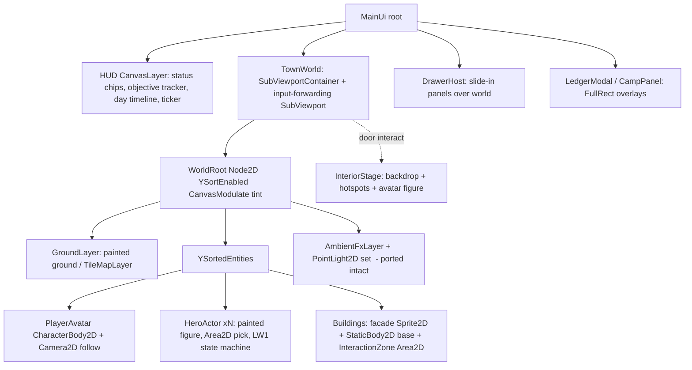
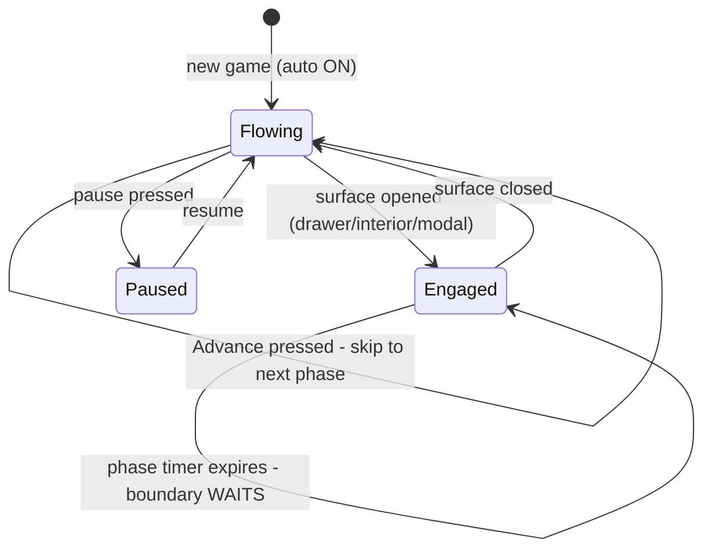
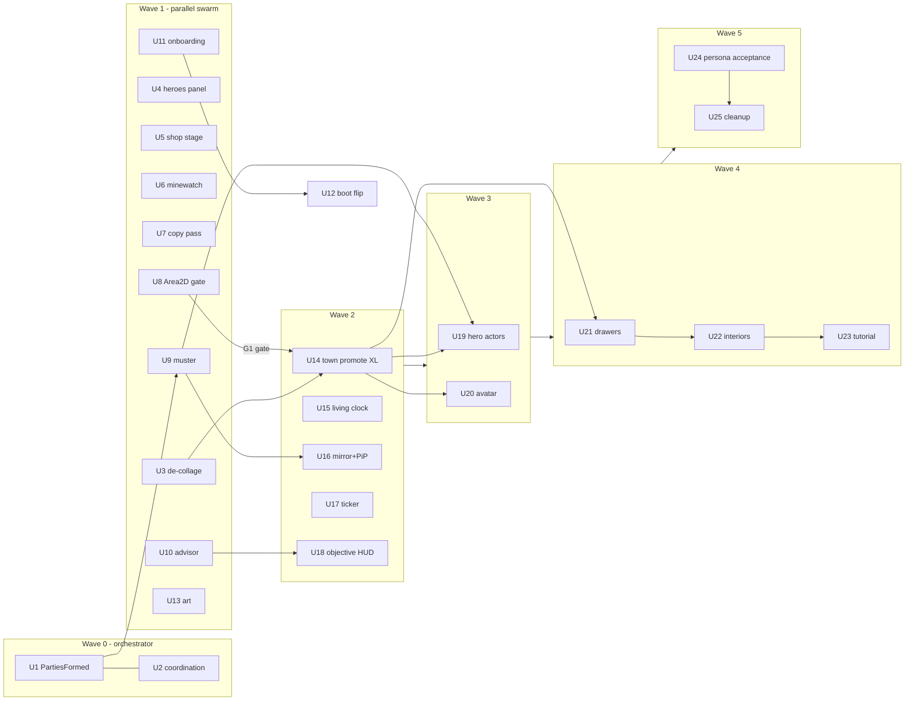

# World Rework — Promote and Explain - Plan

## Goal Capsule

- **Objective:** Turn the current tab-and-collage client into one living, Y-sorted painted town with an embodied player avatar, a real-time day that never pressures work, staged-enterable venues, a primary-profession onboarding loop that makes the game self-explanatory in 10 minutes, and live hero-journey spectating driven by the sim's existing combat record.
- **Authority:** This plan > `CLAUDE.md` multi-agent rules > worker judgment. Product decisions here came from Brian's 2026-07-19 playtest + brainstorm; do not re-litigate them mid-implementation. `docs/plans/2026-07-18-007-feat-ui-rethink-plan.md` is superseded by this plan for panel/HUD ownership.
- **Ground truth:** All code evidence below verified against `origin/main` at d0841e2. The shared checkout may be stale — workers branch from `origin/main`, never from the local HEAD, and treat the shared root as read-only.
- **Stop conditions:** Any change to `sim/GameSim/Contracts/`, `godot/project.godot`, `.github/`, or other deny-listed files outside U1/U12 stops and escalates to the orchestrator. Golden-replay or balance-band failure on a sim unit stops the unit until the seed-sweep diff is reviewed. G1 gate (U8) failing stops U14 from merging.
- **Execution profile:** Multi-agent lane model (`docs/design/lane-operating-model.md`): one unit = one branch = one PR, claim stubs in `.claude/tasks/`, worktrees, auto-merge on green. Waves sequence merges; work within a wave runs parallel where files are disjoint.

---

## Product Contract

### Summary

Promote the painted Node2D town that already ships inside `LitTownOverlay` to be THE town — Y-sorted, input-bearing, feet-anchored — and delete the SVG scaffold above it. Put the player in it as a walkable avatar, let the day flow on its own clock without ever pressuring focused work, open every venue as a staged interior, key the tutorial and objective HUD to a primary profession chosen at boot, and play hero expeditions back live through the world, a ticker, and a scrying mirror. Acceptance is behavioral: re-run the LLM persona playtest and require comprehension of professions, heroes, and progression inside ~10 in-game minutes.

### Problem Frame

The 2026-07-19 playtest (screenshots in `play/playTest_Images/`, findings in `docs/design/playtest-findings-2026-07-19.md`) found the current build incomprehensible and visually broken even with the full living-world wave (#119–#127) merged. Root causes, all verified:

- Two complete towns render stacked by design: the painted world (`godot/scripts/town/LitTownOverlay.cs`, `MouseFilter.Ignore`, non-input SubViewport) sits behind the original SVG wireframe town in `godot/scripts/town/TownScene.cs`, which owns all input and every test pin. The real migration (plan 2026-07-17-003 V4b) was deferred on a Godot 4.7.1 gate that is now moot — 4.6.3 supports Y-sort, `CharacterBody2D`, `Area2D`, `TileMapLayer` in full.
- Live hero sprites never use painted art: `HeroSprite` hardcodes 30x42 SVG figurines; the three large painted heroes are non-interactive hard-coded decorations covering only 3 of 6 classes.
- Panel defects are mechanical: Heroes cards parent FullRect content under a `Button` (not a Container — nothing sizes or clips), ShopStage and MineWatch render a fixed 1024px design space on a ~1900px window, MineWatch's 2-tile wrap leaves a scrolling gray gap, `town-market.png` shipped with background removal failed (the pink rect).
- The game explains nothing: total explanation surface is one tooltip mechanism, ~5 toast phrases, 3 hint strings (one stale). The merged profession-select screen (#85) is dead code because `godot/project.godot` `run/main_scene` was never flipped. Hero `Level` is a dead stat. Personas concluded core loops were unimplemented.
- The sim already records everything spectating needs — per-round `CombatEvent` streams with rolls, damage, monster kinds, killing items, and counterfactual `AttributionBeat`s — and nothing renders it.

### Requirements

**World & interaction**

- R1. One unified painted town: Y-sorted depth (characters walk in front of and behind buildings), feet-anchored sprites, single tint authority, no duplicate building/hero representation, no floating placeholder labels.
- R2. Everything visible is real and selectable: live heroes render their painted class figures bound to sim state and are clickable; buildings, gate, notice board, and memorials are interactive world objects with hover/prompt affordances.
- R3. The player is an embodied blacksmith avatar: WASD + click-to-move, collides with building bases, camera follows with smoothing and reverts to idle drift when still.
- R4. Every venue (Forge, Shop, Tavern, Mine Gate) is enterable from day one as a staged interior: camera moves into a painted interior scene, avatar visible in it, every content item a labeled clickable hotspot with a hover description.
- R5. Walk-first navigation: no venue hotkeys/map-jump at start; quick-access shortcuts unlock through play as a convenience upgrade.

**Time model**

- R6. The day auto-flows by default: phases tick on the clock (existing `PhaseClock` cadence as baseline) and the world acts each phase out live.
- R7. Focused work is never time-pressured: while any profession surface (venue interior, drawer, modal) is open, the clock keeps flowing for ambience and live feeds but a phase boundary never crosses — it waits for the player to disengage. No queued or phase-legal action is ever lost to time (AE1).
- R8. The player can pause the clock and can skip ahead (Advance becomes "skip to next phase"). Auto-flow default ON replaces the current default-OFF.

**Loop clarity & onboarding**

- R9. New game starts with a primary-profession choice (existing 4 sim professions) that sets the starter kit, tutorial thread, and objective framing.
- R10. A second profession is earnable later at a visible milestone (adapter-gated affordance; sim already permits two).
- R11. A persistent objective HUD always shows a current suggested action derived from real sim state, with the reason ("Craft a buckler — Torvik shops in the Evening").
- R12. The 5-phase day (Morning → Expedition → Camp → Deep → Evening) is visible and explained in-game: a day timeline widget plus per-phase "what happens now" copy.
- R13. First-run tutorial guides: buy material → craft → shelve → post bounty → watch the party go, keyed to the chosen profession, dismissible, never re-shown after completion.
- R14. Every disabled control keeps a "why not" explanation (existing mechanism), and queued-action feedback names when it resolves.

**Live hero journeys**

- R15. Spectating is layered: ambient in-world signals (gate departures, mine-strip, bubbles) always on; adventure ticker + dockable PiP live feed during expeditions; full scrying-mirror view on expand.
- R16. Journey feeds replay the sim's real recorded combat stream — floor progress, per-round beats, consumable quaffs, and player-item attribution ("Your Iron Shield turned a lethal hit") — time-stretched across the phase, never invented.
- R17. Deaths never surface before the Evening reveal (KTD5): the feed visibly "clouds" ("lost from sight below Floor 3…") instead of showing the outcome (AE2).
- R18. Town departures and returns are roster-true: only the mustered party rallies and files out the gate; stragglers keep wandering; returns match survivors.

**Acceptance**

- R19. A brand-new player understands how to operate professions, how heroes/NPCs work, and how to progress within ~10 in-game minutes without outside help — verified by re-running the SP-1 LLM persona playtest harness against the rebuilt client-equivalent surface (AE3).

### Actors

- A1. Player — the blacksmith; embodied avatar; the only human.
- A2. AI heroes — autonomous sim agents; visible townsfolk and expedition parties; never player-controlled.
- A3. New player — cold-start player (proxied by SP-1 personas) whose 10-minute comprehension is the acceptance bar.

### Key Flows

- F1. First ten minutes
  - **Trigger:** New game.
  - **Steps:** Pick primary profession → primer card (day phases, Advance/pause) → spawn as avatar in town → tutorial objective chain (vendor → forge → shelf → notice board) → first party files out the gate → ticker + PiP light up.
  - **Outcome:** R9, R11–R13, R19 exercised without any external help.
- F2. Living day
  - **Trigger:** Clock running (default).
  - **Steps:** Phases tick and the town acts them out; player walks, enters venues, works with the clock flowing but boundaries waiting (R7); Advance skips when idle.
  - **Outcome:** R6–R8; no action lost to time.
- F3. Expedition spectating
  - **Trigger:** Party departs at the Expedition tick.
  - **Steps:** Roster-true gate departure → ticker lines + PiP feed stream the recorded combat beats → player expands to the scrying mirror or ignores it and works → deaths cloud until Evening → Evening ledger reveal ritual unchanged.
  - **Outcome:** R15–R18.
- F4. Entering a venue
  - **Trigger:** Avatar walks to a door and interacts (E / click).
  - **Steps:** Camera stages into the interior scene; contents render as labeled hotspots; profession actions run without time pressure; exit returns to the street.
  - **Outcome:** R4, R7.

### Acceptance Examples

- AE1. **Given** the Morning phase is live and the player has the Forge interior open mid-purchase, **when** the phase timer would expire, **then** the phase boundary waits until the player leaves the surface, and the vendor purchase remains legal — no queued action is rejected for timing.
- AE2. **Given** a hero dies on Floor 3 during the Deep tick, **when** the player watches the mirror live, **then** the feed shows a "lost from sight" cloud (never the death), and the death surfaces first in the Evening reveal.
- AE3. **Given** the rebuilt game at a fresh seed, **when** the SP-1 persona harness plays 25 days cold, **then** persona journals demonstrate correct mental models of professions, hero behavior, and progression within the first ~10 in-game minutes, with zero "feature seems unimplemented" conclusions of the kind in `docs/design/playtest-findings-2026-07-19.md`.
- AE4. **Given** the avatar stands at the Tavern door, **when** the player presses E, **then** a staged tavern interior opens with every item (gossip board, hero tables, keeper) labeled and clickable, and Esc/exit returns to the street at the door.

### Success Criteria

- Two-gate acceptance: (a) CLI persona probe (AE3, via U26+U24) gates sim-side comprehension — professions, phase model, advisor guidance; (b) Brian's rubric-scored playtest of the Godot surface is the named acceptance authority for the visual/embodiment pillars (world, avatar, interiors, spectating), with the finding-by-finding diff against the 2026-07-19 findings assigned to gate (b).
- Zero duplicate-representation artifacts in any screenshot (no wireframe icons over painted art, no placeholder rects, no orphan labels).
- All existing quality gates stay green throughout: fast lane, engine tests, `Category=Balance`, golden replay.

### Scope Boundaries

**Deferred for later**

- Walkable interiors (avatar movement inside venues) — deliberately TBD until the staged version is played; staged data (hotspots, camera, interior scenes) is built to carry forward.
- Walk-cycle/directional animation — the art pipeline has no frame concept (`art/GameArt/AssetSpec.cs`); figures glide/bob v1; revisit on playtest feedback.
- Hero progression depth — dead `Level` stat, free-talent economy, day-10+ flatline (playtest findings #10/#11) — owned by the Erenshor/balance track queued after this program.
- Erenshor waves A–D and FlavorForge Faction/Ledger/Tavern surfaces — queued behind this program per `docs/design/2026-07-19-flavorforge-erenshor-recommendations.md`.

**Outside this product's identity**

- Direct player control of heroes (inverted-MMO premise: heroes are autonomous).
- Multiplayer of any kind.

---

## Planning Contract

### Key Technical Decisions

- KTD1. **Promote, don't rebuild.** `LitTownOverlay`'s SubViewport world becomes THE town (input forwarding on, `YSortEnabled`, real camera); the SVG scaffold is first blinded (invisible hit-rects, U3) then deleted (U14). Rationale: the painted world, fx recipes, tint tables, and choreography already exist and are portable; the discard pile is only born-temporary scaffolding. This executes plan 2026-07-17-003's deferred V4b on 4.6.3 — the 4.7.1 gate was a gdUnit4Net concern the shipped code-built-Node2D pattern already routes around.
- KTD2. **All rework is adapter-side; sim stays pure.** Time flow, avatar, spectating, tutorial state, and staged interiors live in `godot/`. The only sim additions are two pure, RNG-free pieces: the `PartiesFormed` event + `MusterSystem` (U1/U9) and the advisor/legality query module (U10, outside `Contracts/`). Wall-clock reads stay in the adapter (existing `PhaseClock` precedent). `SimAdapter` remains pure delegation — the avatar's position is presentation only and never gates sim legality.
- KTD3. **Flows-but-waits clock.** Default becomes auto-advance ON; a phase boundary defers while any modal/drawer/interior surface is open (an "engaged" latch in the clock, not per-action timers). Advance becomes skip-ahead; pause is explicit. No sim change: the kernel already ticks only when the adapter calls it.
- KTD4. **Runtime input map.** WASD/interact actions registered via `InputMap.AddAction` in `_Ready` — zero `project.godot` contact (GameTheme KTD1 precedent). The only `project.godot` edit in the program is the boot-scene flip (U12, orchestrator micro-PR).
- KTD5 (carried). **Deaths reveal at Evening.** The recorded outcome sits readable in `GameState.PendingExpeditions` from the Expedition tick; every spectate surface self-censors deaths until the Evening reveal, test-pinned (R17).
- KTD6. **Feet-anchoring is code-side.** `AssetSpec` has no pivot field and the committed PNGs are content-tight trimmed cutouts, so bottom-of-content ≈ baseline; a per-asset anchor-offset table in `AssetCatalog` handles overhang exceptions. No art regeneration for anchoring.
- KTD7. **Keep the `MainUiTests` class name.** CI's silent-skip guard (`.github/workflows/ci.yml`, `FullyQualifiedName~MainUiTests` + `TreatNoTestsAsError`) hard-fails if the class disappears; the drawer rework (U21) rewrites assertions in place, avoiding any `.github/` micro-PR.
- KTD8. **`PartiesFormed` is the one contracts change.** Roster/target-floor knowledge at Morning could come from (a) duplicating the rule in the adapter (drift hazard), (b) the adapter calling a shared pure helper as a projection (KTD9 pattern — no contracts change), or (c) a sim-emitted event. Chosen: (c) — the event feeds AdventureTicker lines, is save-visible history, and keeps one source of truth for every consumer. The shared helper is a pure `MusterPlan.Compute(heroes, bounties)`: it predicts bounty acceptance via the RNG-free `BountyRules.Judge` first-accept loop (BountyJudgingSystem runs at the Expedition tick, two ticks later — prediction is required, not optional), then `PartyFormation.FormParties`, then the target-floor override. Consumed by `MusterSystem` (prediction at Morning) and by `BountyJudgingSystem`/`ExpeditionSystem` (authoritative). Zero RNG draws, golden replay unaffected, save-compat pin test added.
- KTD9. **Advisor lives outside `Contracts/`.** `sim/GameSim/Advisor/` (LegalityQuery consolidating scattered `CanHandle` predicates + ObjectiveAdvisor reusing `DestitutionRecoverySystem`'s cheapest-path and `MaterialVendorHandlers.QuoteCost`) is a pure projection over `GameState` — no kernel registration, no deny-list contact, order-neutral by construction.
- KTD10. **Staged interiors are data + one framework.** One `InteriorStage` component (painted backdrop, avatar figure, hotspot list with labels/descriptions/actions, camera transition) instantiated per venue from a declarative table. Hotspot definitions are the carry-forward asset if walkable interiors happen later.
- KTD12. **Building clicks are walk-then-open.** Once the avatar exists (U20+), clicking a building issues click-to-move to its door and the panel opens on arrival — no instant teleport-open. Preserves the click affordance without breaking walk-first (R5). Until U20, U14 keeps instant-open parity (no avatar to walk).
- KTD13. **HUD layout spec (binding for U16/U17/U18 workers):** top bar keeps the existing header (status chips left, day-timeline widget center, Advance/pause/Auto cluster right); objective tracker chip docks top-right below the bar; adventure ticker is a single bottom-edge line; PiP docks bottom-right above the ticker (expedition phases only). One region per element, no overlaps; any deviation goes through the U2 BOARD seam broadcast.
- KTD11. **Spectate feeds read, never re-simulate.** Mirror/PiP/ticker time-stretch the totally ordered recorded stream (`ExpeditionResult.Floors`: floor asc → hero order → round index) from `InFlight`/`PendingExpeditions`, using accumulated frame delta (no engine RNG, no Tween — repo convention). Adapter caches die on save/load: the mirror "clouds" on reload, documented behavior.

### High-Level Technical Design

Target scene architecture (U14/U20/U21/U22 end state):

Clock behavior (KTD3):

Wave dependency graph (merge order; parallel within a wave):

### Assumptions

- Brian's brainstorm decisions are final for this program: living clock (flows-but-waits), staged interiors for all venues with walkable TBD, layered spectating, primary+earn-2nd profession, walk-first navigation, KTD5 kept, persona acceptance gate.
- The persona harness (SP-1, stdin re-pipe over the CLI) gates sim-side comprehension only; it cannot observe Godot-side surfaces. U26 makes the CLI instrument valid (parser-trap fixes, profession command, advisor text); Brian's rubric playtest owns the visual/embodiment pillars. SP-4 UI-text bridge stays a follow-up.
- `PhaseClock` cadence (45/30/45s) is the starting auto-flow pacing; tuning is expected during playtest and is not a plan change.

### Sequencing & Lanes

- Wave 0 lands before anything else (orchestrator-authored deny-list touches + coordination). Wave 1 is maximally parallel — all ten units are file-disjoint (matrix in unit Files fields). Playtest checkpoint A after Wave 1.
- Wave 2's U14 is single-owner and serialized on `godot/scripts/town/`; U15–U18 are file-disjoint from it and from each other except a shared MainUi insertion point (U17/U18 serialize their merges). Playtest checkpoint B after Wave 2.
- Waves 3–4 depend on U14's published world-scale doc. U21 freezes `MainUi.cs` under one owner. Wave 5 closes the program.
- Lanes: VISUALS owns all `godot/` units; sim units (U1, U9, U10) ride the sim lane; U8 is ENGINE-DEPLOY; U13 is the art lane; U12 is orchestrator-only.

---

## Implementation Units

| U-ID | Title | Key files | Depends on |
|---|---|---|---|
| U1 | PartiesFormed contracts micro-PR | `sim/GameSim/Contracts/Events.cs` | — |
| U2 | Coordination: BOARD broadcast + supersession | `.claude/tasks/BOARD.md` | — |
| U3 | Town de-collage triage | `godot/scripts/town/TownScene.cs`, `godot/scripts/town/LitTownOverlay.cs` | — |
| U4 | Heroes panel card rebuild | `godot/scripts/panels/HeroesPanel.cs`, `godot/scripts/ui/UiKit.cs` | — |
| U5 | Shop stage banner fix | `godot/scripts/panels/ShopStage.cs`, `ShopPanel.cs` | — |
| U6 | MineWatch backdrop fix | `godot/scripts/panels/MineWatch.cs` | — |
| U7 | Copy & phase-legibility pass | `godot/scripts/panels/ForgePanel.cs`, `godot/scripts/MainUi.cs` | — |
| U8 | Area2D test-harness spike (gate G1) | `godot/tests/UiTestSupport.cs` | — |
| U9 | MusterSystem: Morning roster emission | `sim/GameSim/Heroes/MusterSystem.cs`, `Expedition/ExpeditionSystem.cs` | U1 |
| U10 | Advisor: legality + next-step | `sim/GameSim/Advisor/` | — |
| U11 | Profession onboarding screen | `godot/scripts/NewGameSelect.cs`, `SimAdapter.cs` | — |
| U12 | Boot flip micro-PR | `godot/project.godot` | U11 |
| U13 | Art wave: cutout fix, ground, avatar, interiors | `art/specs/town/`, `godot/assets/art/` | — |
| U14 | TownWorld promotion (Y-sort unification) | `godot/scripts/town/TownScene.cs`, `godot/scripts/town/LitTownOverlay.cs`, `godot/tests/TownSceneTests.cs` | U3, U8 |
| U15 | Living clock: flows-but-waits | `godot/scripts/PhaseClock.cs`, `MainUi.cs` | U7 |
| U16 | Scrying mirror + PiP journey feed | `godot/scripts/panels/MineWatch.cs`, new `ScryingMirror.cs` | U6, U9 |
| U17 | Adventure ticker | new `godot/scripts/ui/AdventureTicker.cs` | — |
| U18 | Objective HUD + day timeline | new `godot/scripts/ui/ObjectiveTracker.cs`, `MainUi.cs` | U10, U15 |
| U19 | HeroActor: painted, sim-bound, roster-true | new `godot/scripts/town/HeroActor.cs` | U9, U14 |
| U20 | Player avatar + interaction zones | new `godot/scripts/town/PlayerAvatar.cs`, `InteractionZone.cs` | U14 |
| U21 | DrawerHost: panels over the world | `godot/scripts/MainUi.cs`, new `ui/DrawerHost.cs` | U14 |
| U22 | Staged interiors (all venues) | new `godot/scripts/town/InteriorStage.cs` | U20, U21, U13 |
| U23 | First-run tutorial + earn-2nd affordance | new `godot/scripts/ui/TutorialFlow.cs` | U18, U22 |
| U24 | Persona acceptance run | `docs/design/` findings doc | U26, all prior |
| U25 | Cleanup & docs reconcile | orphans, docs | U24 |
| U26 | CLI probe validity: parser traps + profession + advisor text | `sim/GameSim.Cli/Program.cs` | U10 |

### U1. PartiesFormed contracts micro-PR

- **Goal:** Give the adapter roster/target knowledge at Morning without duplicating sim rules (KTD8).
- **Requirements:** R18 (and feeds R15/R16 timing).
- **Dependencies:** none — lands first; orchestrator-authored (deny-list).
- **Files:** `sim/GameSim/Contracts/Events.cs`; pin test in `sim/GameSim.Tests/Kernel/SaveLoadTests.cs`.
- **Approach:** Add `PartiesFormed(ImmutableArray<PartyPlan>)` : GameEvent with `PartyPlan(roster HeroIds, provisional TargetFloor, VenueId)`. Contracts only — emission is U9. Trailing-optional pattern per existing `PreXSave` pins.
- **Patterns to follow:** existing event records in `Contracts/Events.cs`; `SaveLoadTests` pre-save pin tests.
- **Test scenarios:** pre-muster save loads with empty/no `PartiesFormed` history (compat pin); event serializes round-trip byte-identically.
- **Verification:** fast lane + full balance suite green; golden replay untouched (no emission yet).

### U2. Coordination: BOARD broadcast + plan supersession

- **Goal:** Freeze seams before the swarm launches; supersede plan 007's overlapping ownership.
- **Requirements:** program hygiene (lane model §13).
- **Dependencies:** none; orchestrator session.
- **Files:** `.claude/tasks/BOARD.md`, claim-stub template.
- **Approach:** Seam broadcast: `TownScene.cs`/`LitTownOverlay.cs` single-owner freeze windows for U14; `MainUi.cs` freeze for U21; branch-from-origin/main rule stamped into every claim stub; plan 2026-07-18-007 marked superseded by this plan.
- **Test expectation:** none — coordination artifact.
- **Verification:** BOARD entry visible on main before Wave 1 PRs open.

### U3. Town de-collage triage

- **Goal:** Kill the two-towns collage this week without migration risk.
- **Requirements:** R1 (interim step; final in U14).
- **Dependencies:** none. Same-file handoff note: U14 takes these files next.
- **Files:** `godot/scripts/town/TownScene.cs`, `godot/scripts/town/LitTownOverlay.cs`; tests `godot/tests/TownSceneTests.cs`.
- **Approach:** Make `Building_*` wireframe Controls invisible click targets (drop TextureRect+Label children, keep hit-rect geometry and `GuiInput`→`BuildingClicked` untouched so `UiTestSupport.Click` assertions survive); gate wireframe/`MEMORIALS` label rendering on content (label only when memorials exist); kill double-tint (root `Modulate` pinned white; `LitTownOverlay`'s `CanvasModulate`/`AtmosphereTintFor` becomes sole authority; LW1 crossfade re-pointed); re-space/rescale `DefaultBuildings` so 220px facades stop overlapping (centers currently 140px apart); bind or remove the 3 hard-coded decor heroes (prefer: remove — U19 brings real ones).
- **Test scenarios:** click assertions on all four buildings unchanged; per-phase tint snapshot (Morning/Evening/Night) applies exactly one tint multiplication; no visible wireframe TextureRects when art present; MEMORIALS label absent at zero memorials, present after a death.
- **Verification:** `TownSceneTests` green with click assertions unmodified; before/after per-phase screenshots attached to the PR.

### U4. Heroes panel card rebuild

- **Goal:** Fix the clipped/overlapping Heroes tab.
- **Requirements:** R14 (legibility); playtest defect #171612.
- **Dependencies:** none.
- **Files:** `godot/scripts/panels/HeroesPanel.cs`, `godot/scripts/ui/UiKit.cs` (compact StatChip variant — do not touch `GameTheme` margins globally); tests in the heroes-panel suite.
- **Approach:** Replace Button+FullRect-VBox cards (Button is not a Container; children never size/clip it) with `PanelContainer` cards sized by content plus a transparent Button overlay for click; chip row fits card width; ellipsize captions; `TintPortraitIcon` tints frame/underlay only — painted portraits render untinted.
- **Test scenarios:** card min-size ≥ content bounds at 140px and 190px widths; no child overflows card rect (bounds assertion); detail pane never occludes grid at 800px and 1900px window widths; portrait texture modulate is white.
- **Verification:** panel suite green; screenshot at both window widths attached.

### U5. Shop stage banner fix

- **Goal:** Kill the truncated shelf strip + gray void + full-width price bars.
- **Requirements:** R14; playtest defect #172441.
- **Dependencies:** none.
- **Files:** `godot/scripts/panels/ShopStage.cs`, `godot/scripts/panels/ShopPanel.cs`; `ShopStageTests`.
- **Approach:** `SubViewport.TransparentBg = true` (MineWatch precedent); center the 1024x220 design space in wider containers with themed edge fades; move the stage strip out of the scroll body so it does not scroll away; `StatChips` in the info column get shrink-center sizing.
- **Test scenarios:** no opaque clear-color region at 1900px width; stage strip remains visible after scrolling the shelf list; price chip width ≤ content width.
- **Verification:** `ShopStageTests` green; wide-window screenshot.

### U6. MineWatch backdrop fix

- **Goal:** Kill the mirror seam and the scrolling right-edge gap.
- **Requirements:** R14; playtest defect #172451.
- **Dependencies:** none. Same-file handoff: U16 takes this file next.
- **Files:** `godot/scripts/panels/MineWatch.cs`; its test coverage.
- **Approach:** N-tile coverage `ceil(width/1024)+1` replacing the hard 2-tile wrap; `FlipH` alternate tiles or an edge-fog overlay to break the seam read; wrap math generalized to container width.
- **Test scenarios:** backdrop covers full width at 1024/1900/2560px throughout a full scroll cycle (no gap at any offset); tile count matches formula.
- **Verification:** suite green.

### U7. Copy & phase-legibility pass

- **Goal:** The game explains its own day.
- **Requirements:** R12, R14.
- **Dependencies:** none. Sole Wave-1 toucher of `MainUi.cs`.
- **Files:** `godot/scripts/panels/ForgePanel.cs`, `godot/scripts/MainUi.cs`; `MainUiTests` (class name kept — KTD7).
- **Approach:** Delete the stale "buy ore from returning heroes (Evening ledger)" hint (vendor exists); queued-action feedback becomes phase-aware ("Queued — resolves when Morning ticks. Press Advance or wait."); PhaseChip gains a 5-phase legend flyout (one line per phase: what happens, what you can do); audit every `whyNot` tooltip for accuracy against current handlers.
- **Test scenarios:** legend lists all 5 phases in kernel order; stale hint string absent; queue feedback names the resolving phase for a Morning-legal and an Evening-legal action.
- **Verification:** `MainUiTests` green, class name untouched.

### U8. Area2D test-harness spike (hard gate G1)

- **Goal:** Prove gdUnit4Net on 4.6.3 can drive Area2D world picking — the exact reason plan 003 rejected Area2D.
- **Requirements:** enables R2/R3 testing.
- **Dependencies:** none; ENGINE-DEPLOY lane; result posted to BOARD as G1.
- **Files:** `godot/tests/UiTestSupport.cs` (+ scratch test scene).
- **Approach:** Add `ClickWorld(viewport, worldPos)` pushing a world-transformed `InputEventMouseButton` through the SubViewport; fallback if physics picking proves flaky under headless CI: expose interaction handlers as public seams and invoke directly, keeping a thin manual smoke for the picking layer.
- **Test scenarios:** scratch scene: Area2D at known world pos receives click through `ClickWorld`; camera-offset case (drifted camera) still hits; miss case (click 5px outside) does not fire.
- **Verification:** G1 verdict (pass or documented fallback) on BOARD; U14 may not merge before this resolves.

### U9. MusterSystem: Morning roster emission

- **Goal:** Sim emits tomorrow's parties at Morning; single source of truth for the target-floor rule.
- **Requirements:** R18; feeds R15/R16.
- **Dependencies:** U1.
- **Files:** new `sim/GameSim/Heroes/MusterSystem.cs`; `sim/GameSim/Expedition/ExpeditionSystem.cs` (rule extraction only); `sim/GameSim/GameComposition.cs` (registration); tests in `sim/GameSim.Tests/`.
- **Approach:** Morning-phase system, zero RNG draws (GossipSystem/FactionDrift no-RNG precedent): implement `MusterPlan.Compute` per KTD8 (bounty-acceptance prediction via `BountyRules.Judge` + `FormParties` + target-floor override); emit `PartiesFormed`. Registration position is load-bearing: MusterSystem registers LAST in GameComposition's Morning block — after `RecruitSystem` (adds heroes same tick) and `HeroShoppingSystem` (mutates fields `Judge` reads) — or the byte-match test fails. Morning-batch-posted bounties ARE visible (kernel applies actions before phase systems). `GameComposition.cs` is orchestrator-owned per its header: the orchestrating session co-signs the registration hunk before merge.
- **Execution note:** run the full seed-sweep diff vs main before merge (lane rule). Expect same-seed gossip/ledger flavor-text churn in the diff — `PartiesFormed` shifts stamped event ids that `GossipGenerator`/`LedgerQuery` key flavor off; that is expected noise, not a regression. Balance bands must be unchanged.
- **Test scenarios:** emitted rosters byte-match what `ExpeditionSystem` forms at its tick (property test over 100 seeded days); bounty-override day: emitted target floor matches the later-judged bounty (prediction correct); same-morning recruit appears in the emitted roster (registration-order pin); zero-hero morning emits an empty-parties event (pinned shape, recorded in U1 pin test); golden replay byte-identical; balance bands unchanged.
- **Verification:** fast lane + `Category=Balance` + golden replay green; seed-sweep diff attached to PR.

### U10. Advisor: legality + next-step

- **Goal:** Sim-side "what can I do / what should I do" powering the objective HUD and tutorial.
- **Requirements:** R11, R13, R14.
- **Dependencies:** none (parallel from day 1).
- **Files:** new `sim/GameSim/Advisor/ActionLegality.cs`, new `sim/GameSim/Advisor/ObjectiveAdvisor.cs`; tests `sim/GameSim.Tests/Advisor/`.
- **Approach:** `ActionLegality.LegalActions(GameState, DayPhase)` — NOTE: `CanHandle` checks only action type + phase; the real legality lives in each handler's `Apply`-level `RejectedAction` guards, and `IActionHandler` is deny-listed so no shared Validate seam is available. LegalActions therefore deliberately REPLICATES the Apply-level guards Advisor-side: gold sufficiency via `MaterialVendorHandlers.QuoteCost`, escrow affordability, quantity > 0, vendor-catalog membership, bounty floor within `MonsterTable.FloorCount`, recipe/material availability. The 100-day kernel-parity property test is the standing drift tripwire any future handler change must keep green. `ObjectiveAdvisor.Suggest(GameState)` returns a small ranked list of (action, reason) reusing `DestitutionRecoverySystem`'s cheapest-productive-path logic. Pure projection — no kernel registration, no RNG, no `Contracts/` contact (KTD9).
- **Test scenarios:** kernel-parity property test — every action LegalActions reports legal, replayed through the kernel, yields zero `RejectedAction` across a 100-day seeded run; every phase-illegal action it reports illegal is rejected by the kernel; Suggest on a fresh game returns the tutorial-shaped chain (buy material first when shelf empty and gold ≥ cheapest quote); Suggest never proposes an illegal action; destitute state reproduces `DestitutionRecoverySystem`'s path.
- **Verification:** fast lane green; golden replay untouched by construction (projection only).

### U11. Profession onboarding screen

- **Goal:** Revive the dead select screen as the real front door.
- **Requirements:** R9; feeds R13.
- **Dependencies:** none (screen exists; U12 flips boot after this merges).
- **Files:** `godot/scripts/NewGameSelect.cs`, `godot/scenes/new_game_select.tscn` (code-built additions), `godot/scripts/SimAdapter.cs` (ctor overload); `godot/tests/NewGameSelectTests.cs`.
- **Approach:** "Choose your primary profession" framing over the existing 4 (`ProfessionRegistry`); per-profession blurb + starter-kit note; "your first day" primer card (5 phases, clock behavior, Advance/pause); seed display; hand off via `GameComposition.NewCampaign(seed, professionId)` → `MainUi.AdapterOverride`.
- **Test scenarios:** each of 4 professions boots a campaign whose `PlayerState.SelectedProfessions` matches; primer card lists 5 phases; back-out returns to select without leaking a campaign; default seed path deterministic under test (fixed seed injection).
- **Verification:** `NewGameSelectTests` extended and green; manual boot-through.

### U12. Boot flip micro-PR

- **Goal:** Game starts at profession select.
- **Requirements:** R9.
- **Dependencies:** U11 merged and green — never boot into an unpolished screen.
- **Files:** `godot/project.godot` (`run/main_scene` → `res://scenes/new_game_select.tscn`). Orchestrator-authored (deny-list).
- **Test expectation:** none — one-line config; smoke = launcher boots to select screen.
- **Verification:** fresh clone + `play.bat` lands on profession select; engine suite green.

### U13. Art wave: cutout fix, ground, avatar, interiors

- **Goal:** Assets the world rework consumes.
- **Requirements:** R1 (pink rect), R3 (avatar), R4 (interiors), R16 (seamless mine strip).
- **Dependencies:** none (art lane, parallel throughout); consumed by U14/U20/U22.
- **Files:** `godot/assets/art/town-market.png` (regenerate via `cutout.py` — corner alpha=255 RGB(136,84,177) is the pink rect), new `art/specs/town/` AssetSpecs: town ground plate/tiles (none exist — current ground is an SVG tile), player-smith figure (512x768, hero-spec conventions, neutral base), forge/tavern/gate interior backdrops (shop-interior exists), seamless-tileable mine strip; manifest + LFS.
- **Approach:** Existing GameArt pipeline unchanged (no AssetSpec schema change — anchoring is code-side per KTD6). Walk cycles explicitly declined in specs (deferred scope).
- **Test scenarios:** corner-alpha probe = 0 on regenerated market PNG; manifest entries resolve through `IconRegistry.Lit`/`AssetCatalog`; `ArtWiringCoverageTests` extended for new ids.
- **Verification:** art tests + wiring coverage green; visual contact sheet in PR.

### U14. TownWorld promotion (Y-sort unification) — XL, single owner

- **Goal:** One town. The painted world becomes the input-bearing, Y-sorted, camera-driven scene; SVG scaffold deleted.
- **Requirements:** R1, R2 (buildings); enables R3.
- **Dependencies:** U3 (same files), U8 (G1 gate); U13 ground art (placeholder acceptable to start).
- **Files:** `godot/scripts/town/TownScene.cs`, `godot/scripts/town/LitTownOverlay.cs` (absorbed), `godot/scenes/town/town_viewport_shell.tscn` shape as reference; rewrite `godot/tests/TownSceneTests.cs` (34 cases) on plan-003 §V4b's bridge table; publish `docs/design/world-scale.md`.
- **Approach:** Flip the SubViewport to input-forwarding (currently deliberately non-input); `YSortEnabled` on the world root; `Sprite2D.Centered=false` with feet-anchored offsets via a per-asset anchor table in `AssetCatalog` (KTD6); unified world-scale constants published as `docs/design/world-scale.md` BEFORE Wave 3 opens (heroes ≈96px, buildings ≈280–320px, prop table); re-spaced layout ending the 140px-pitch overlap; ground layer from U13 art (tiled SVG fallback until then); Area2D click zones routing the existing `BuildingClicked`; camera in world coords with LW6 drift/parallax as idle behavior; `StaticBody2D` colliders on facade bases; delete the SVG building/gate/label code paths (blinded since U3); single `CanvasModulate` tint authority.
- **Execution note:** land behind a short-lived flag only if the diff must split; the unit is one PR with the test rewrite included — never merge a state where both towns render.
- **Test scenarios:** Y-order — an actor below a facade base line draws in front, above draws behind (two-position assertion); building click via `ClickWorld` routes to the same tab/panel ids as before (R20 routing parity); feet anchor — facade base y == configured ground line ±1px for all four buildings; one tint multiplication per phase (regression from U3); camera drift bounded (±4px idle amplitude preserved); no `Building_*` Control nodes remain in the tree.
- **Verification:** rewritten `TownSceneTests` green; `UiRenderSmokeTests` green; per-phase before/after captures attached; `world-scale.md` published.

### U15. Living clock: flows-but-waits

- **Goal:** Day runs by default; work never pressured (KTD3).
- **Requirements:** R6, R7, R8; AE1.
- **Dependencies:** U7 (MainUi window); independent of U14.
- **Files:** `godot/scripts/PhaseClock.cs`, `godot/scripts/MainUi.cs`; `PhaseClockTests`, `MainUiTests`.
- **Approach:** `AutoAdvance` default ON for new games; add a public `Engaged` latch on PhaseClock — while any drawer/modal/interior surface reports open, an expired phase timer defers the tick until disengage (timer holds at boundary, ambience keeps animating); explicit Pause toggle; Advance relabeled "skip" semantics unchanged (`AdvanceNow`); settings escape hatch to restore manual mode, persisted adapter-side at `user://` (new small settings store — no such store exists yet; JSON file, adapter-only, never in the sim save). TAB-ERA INTERIM RULE (until U21 retires tabs): any active tab other than Town, plus any open modal, sets `Engaged`; the Town tab is the only flowing surface — pinned by an interim test that U21 deletes when it swaps the predicate to drawer/interior state.
- **Test scenarios:** Covers AE1 — timer expiry while engaged does not tick; disengage ticks within one frame; queued Morning action submitted while engaged lands in the Morning batch; pause holds indefinitely; skip during engaged state ticks immediately (player intent wins); default ON for new campaign, persisted setting respected on load; INTERIM: Forge tab active + timer expiry = no tick, Town tab active + expiry = tick.
- **Verification:** `PhaseClockTests` + `MainUiTests` green.

### U16. Scrying mirror + PiP journey feed

- **Goal:** Watch real journeys live (mirror = full view; PiP = dockable corner feed).
- **Requirements:** R15, R16, R17 (AE2).
- **Dependencies:** U6 (same file), U9 (roster/target at Morning).
- **Files:** `godot/scripts/panels/MineWatch.cs` (evolves into the in-panel feed), new `godot/scripts/panels/ScryingMirror.cs`, new `godot/scripts/ui/PipDock.cs`, `godot/scripts/MainUi.cs` (PipDock HUD mount only — Wave-2 MainUi merge serialization extends to U16/U17/U18); tests alongside existing panel suites.
- **Approach:** Adapter caches `InFlight` + `PendingExpeditions` per phase tick and time-stretches the totally ordered per-round `CombatEvent` stream (KTD11). PHASE→STREAM TABLE (combat data materializes at the tick that ENDS a phase — design the feed on this, not the fiction): Expedition phase = departure choreography + `PartiesFormed` roster/target only, labeled "rumored" (no combat beats exist yet); Camp phase = stage-1 beats time-stretched from `InFlight.Floors` (unstaged parties: full result from `PendingExpeditions`, death rounds clouded); Deep phase = held "below the checkpoint" state, no new beats; Evening phase = stage-2 beats from `PendingExpeditions`, death rounds clouded until the Evening-tick ledger reveal. Displayed targets rebind from `InFlight` at the Expedition tick. Feed content: floor-progress meter, real `MonsterKind` names (from `Floors` — no contract change), damage/quaff beats, `AttributionBeat` callouts, multi-party support via PARTY TABS across the mirror top (PiP shows the active party; click-cycle arrow). Narration through `ExpeditionNarrator`/`NarratorPack` (zero new plumbing). Death self-censor: death round renders the cloud state and that hero's feed freezes until Evening. Stream endpoints: on exhaustion (engaged-stretched phase) the feed holds a censored "they press deeper" idle loop until the tick; on skip, remaining beats collapse to the clouded/summary end state. PiP: visible only during expedition phases (slide out/in on phase transition — hidden Morning/Evening), click to expand to mirror; feed pauses with the clock (paused ≠ engaged: engaged keeps flowing per KTD3).
- **Test scenarios:** Covers AE2 — death round renders cloud, no death text before Evening tick, ledger reveal unchanged (test-pinned KTD5); beat order matches recorded order (floor asc → hero → round) under 3 seeded expeditions; monster names match `CombatEvent.MonsterKind`; attribution callout appears only for player-crafted items; multi-party switch shows the second party's floors; save/load mid-expedition → mirror shows documented clouded-on-reload state, no crash; stream exhaustion under long engagement holds the idle loop (no repeat, no leak); skip mid-stream collapses to summary state; PiP absent during Morning/Evening phases.
- **Verification:** panel suites green; KTD5 pin test present; scripted-seed visual capture attached.

### U17. Adventure ticker

- **Goal:** One-line ambient story stream on the HUD.
- **Requirements:** R15.
- **Dependencies:** none (shares MainUi insertion point with U18 — serialize merges, not work).
- **Files:** new `godot/scripts/ui/AdventureTicker.cs`; test file alongside.
- **Approach:** Marquee of day-stamped lines from `LastEvents`/EventLog + `GossipEmitted` + narrator lines; accumulated-delta scroll (no Tween — repo convention); KTD5-safe by construction (`HeroDied` only ever emits at Evening; ticker never reads `PendingExpeditions`).
- **Test scenarios:** renders lines for ItemSold/PartyDeparted/FloorRecordSet events from a scripted day; never renders a death line before Evening; dedupes same-day repeats; empty day renders nothing (no placeholder noise).
- **Verification:** suite green.

### U18. Objective HUD + day timeline

- **Goal:** "WHAT DO I DO NOW" is always answered on screen.
- **Requirements:** R11, R12.
- **Dependencies:** U10 (advisor); U15 (reads PhaseClock's public `Engaged` property — the named interface, coded against before either merges); U7 merged (MainUi window); serialize merge with U16/U17.
- **Files:** new `godot/scripts/ui/ObjectiveTracker.cs`, `godot/scripts/MainUi.cs` (HUD region); `MainUiTests` additions.
- **Approach:** Tracker chip shows top `ObjectiveAdvisor.Suggest` entry with reason; expandable to the ranked list; day-timeline widget renders the 5 phases with the live one highlighted and the engaged-wait state visible (pairs with U15). Refresh on phase tick, not per frame.
- **Test scenarios:** fresh campaign shows the buy-material suggestion; suggestion updates after the suggested action completes; timeline highlights current phase across a full scripted day; engaged state shows the waiting indicator.
- **Verification:** `MainUiTests` green (class name kept).

### U19. HeroActor: painted, sim-bound, roster-true

- **Goal:** Heroes are real: painted class figures, clickable, party-accurate choreography.
- **Requirements:** R2, R18.
- **Dependencies:** U14 (world + scale doc), U9 (`PartiesFormed`).
- **Files:** new `godot/scripts/town/HeroActor.cs` (replaces `HeroSprite.cs`), `godot/scripts/town/SpeechBubble.cs` re-anchor; bridge `HeroSpriteTests` → `HeroActorTests`.
- **Approach:** Node2D + Area2D picking, feet-origin, world-scale from `world-scale.md`; port `HeroSprite`'s deterministic accumulated-delta state machine VERBATIM (Wandering/Rallying/WalkingOut/Away/WalkingIn, StepToward, bobs, arrival squash — the LW1 value); visuals switch to painted `hero-<classId>` via `AssetCatalog.HeroPortrait(classId)` (resolves `IconRegistry.Lit("hero-<classId>")`, the same ids LitTownOverlay's figures already use) with SVG fallback for addon classes; name labels on hover/selected only; Morning departures driven by `PartiesFormed` rosters (mustered heroes rally and file out; stragglers wander); Evening returns keyed to `PartyReturned` survivors; retire the 3 decor heroes if U3 left them.
- **Test scenarios:** Covers R18 — 6-hero town with a 3-hero muster: exactly those 3 exit at Morning completion, 3 keep wandering; return day: survivors re-enter, dead hero's actor does not (and no death visual before Evening); painted texture bound per class for all 6, SVG fallback for unknown class id; click on actor routes hero-inspect; bubble anchors track the new node type; state machine determinism — two runs same seed produce identical positions at frame N (accumulated-delta pin).
- **Verification:** `HeroActorTests` green covering the bridge table; suite-wide green.

### U20. Player avatar + interaction zones

- **Goal:** The player physically exists (pillar 1 core).
- **Requirements:** R2 (interaction zones make buildings/board/memorials selectable), R3, R5; enables R4.
- **Dependencies:** U14; U13 avatar art (tinted placeholder figure acceptable until it lands).
- **Files:** new `godot/scripts/town/PlayerAvatar.cs`, `godot/scripts/town/WorldInput.cs`, `godot/scripts/town/InteractionZone.cs`; new test files alongside.
- **Approach:** `CharacterBody2D` + `MoveAndSlide`, WASD/arrows + click-to-move; INPUT ARBITRATION: direct input always wins — any WASD/arrow press cancels an in-progress click-to-move path; a new click mid-WASD replaces it with a fresh path. Runtime `InputMap.AddAction` in `_Ready` (KTD4 — zero `project.godot`); Camera2D follows with smoothing and limits, reverting to LW6 idle drift when stationary; `InteractionZone` Area2Ds at forge/shop/tavern/gate/noticeboard/memorials — proximity lights a prompt ("E — Forge") and highlight pulse (existing PointLight2D vocabulary), interact opens the venue (drawer until U22, interior after). CLICK-VS-WALK RESOLUTION (KTD12): a direct click on a building no longer opens its panel instantly — it issues click-to-move to the building's door and opens on arrival (proximity-gated); the legacy instant-open routing (kept as parity through U14, when no avatar exists yet) dies in this unit's PR, which re-pins building clicks as walk-then-open. Avatar is presentation-only — no sim field, `SimAdapterTests` byte-identity is the tripwire (KTD2); walk-first: no venue hotkeys registered v1, quick-travel affordance stubbed behind the U23 unlock.
- **Test scenarios:** WASD moves avatar; WASD press cancels active click-path (arbitration pin); building click walks avatar to door then opens panel on arrival — no instant open (KTD12 pin); collider blocks walking through a facade base but allows walking behind the roofline (Y-sort + collision agree); entering a zone shows the prompt, leaving hides it; interact inside forge zone opens the forge surface; interact with no zone does nothing; camera stays within world limits at map edges; `SimAdapterTests` unchanged and green (purity tripwire).
- **Verification:** new suites green via G1 harness (or fallback seams); manual play smoke.

### U21. DrawerHost: panels over the world — single owner freeze

- **Goal:** Tabs die; the world is always visible; panels slide in.
- **Requirements:** R1 (world permanence), R4 support, R14.
- **Dependencies:** U14; U15–U18 merged (MainUi churn done).
- **Files:** `godot/scripts/MainUi.cs`, new `godot/scripts/ui/DrawerHost.cs`; `MainUiTests` rewritten in place (KTD7), `UiRenderSmokeTests` re-pointed.
- **Approach:** TownWorld becomes the permanent base child; TabContainer replaced by a right-anchored ~600px drawer host (accumulated-delta slide; dim-under per LedgerModal precedent; Esc/click-out closes — the closing click CONSUMES the input event so click-to-move never receives it; `OpenPanel(id)` while another drawer is open REPLACES it, close-then-open); all panels rehosted via existing `Bind`/`Refresh` (parent-agnostic already) with a drawer-relayout audit (HeroesPanel split → stacked at drawer width; full-width section bars constrained); `OpenPanel(id)` API preserves the R20 town-click routing and the tab-index shims used by U20; `TabFade` becomes the drawer transition veil; `RefreshAll` becomes visibility-gated (world + open drawer + HUD only — load-bearing perf change now the world always renders).
- **Test scenarios:** every former tab opens as a drawer via `OpenPanel(id)` and renders (smoke over all 7 surfaces); Esc closes and returns focus to world input; click-out closes AND avatar does not move on that click (consume pin); `OpenPanel` while open replaces the drawer (no stack); hidden panels do not refresh on tick (spy/counter assertion); Ledger/Camp modals still overlay above drawers; `MainUiTests` class name unchanged with rewritten assertions green.
- **Verification:** full engine suite green; ci.yml untouched.

### U22. Staged interiors (all venues)

- **Goal:** Every location enterable day one (R4) via one reusable stage framework (KTD10).
- **Requirements:** R4, R7; AE4.
- **Dependencies:** U20 (zones open them), U21 (drawer fallback + host), U13 (backdrops).
- **Files:** new `godot/scripts/town/InteriorStage.cs` + declarative venue table (forge/shop/tavern/gate), integration with `ShopStage` choreography; new test file.
- **Approach:** Camera stages into a painted interior scene (backdrop + avatar figure + hotspot list: label, hover description, action route); hotspots route to the same panel actions (craft, stock, gossip, bounty) — content parity with drawers, presentation upgrade; ShopStage's shelf-slot + customer choreography ports into the shop interior (retiring the banner strip); exit hotspot + Esc return to street at the door; entering an interior sets the Engaged latch (R7).
- **Test scenarios:** Covers AE4 — tavern entry shows all declared hotspots labeled, each clickable routing to its action, exit returns avatar to door position; all four venues load their stage from the table (data-driven test); hover shows description; interior open sets Engaged (clock boundary waits — pairs with U15 test); shop interior shows shelf stock matching sim state and customer figures during Evening.
- **Verification:** new suite green; per-venue capture strip attached.

### U23. First-run tutorial + earn-2nd-profession affordance

- **Goal:** Guided first day; visible growth milestones (2nd profession, quick-travel).
- **Requirements:** R5 (shortcut unlock), R10, R13.
- **Dependencies:** U18 (objective HUD is the tutorial's spine), U22 (steps reference world interactions).
- **Files:** new `godot/scripts/ui/TutorialFlow.cs`; persistence at `user://` (never in the sim save — KTD2); test file alongside.
- **Approach:** Tutorial = scripted objective chain overriding the advisor's top slot for the first day (buy copper → craft at forge → shelve → post bounty → watch departure), each step keyed to the chosen profession's starter recipe, advancing on the matching sim event; dismissible; completion flag at `user://`, never re-shown. Earn-2nd: adapter-gated affordance — when a visible milestone hits (first bounty paid out or gold threshold; pick during implementation from balance data), surface "take a second profession" routing to `SetProfessionsAction` (sim already permits 2; no sim change). Quick-travel unlock (R5): tutorial-chain completion enables venue hotkeys + clickable venue map-jump — the U20 stub goes live here.
- **Test scenarios:** each tutorial step advances on its event (scripted day drive-through); dismiss mid-chain never re-prompts after restart (user:// flag); completed chain hands the HUD back to the live advisor; second-profession affordance absent before milestone, present after, and submitting it yields two `SelectedProfessions` in state; quick-travel absent before tutorial completion, functional after (hotkey opens venue).
- **Verification:** suite green; fresh-boot manual run through the chain.

### U24. Persona acceptance run

- **Goal:** Prove R19 the same way the failure was proven.
- **Requirements:** R19 (AE3).
- **Dependencies:** U26 (instrument validity); all gameplay waves merged for the exit run.
- **Files:** findings doc `docs/design/playtest-findings-<date>-rework.md`; harness reuse from SP-1 (no build).
- **Approach:** Gate (a) of the split acceptance: re-run the SP-1 persona protocol (3 personas × fresh seed × 25 days) over the U26-validated CLI; personas receive no external help; score sim-side comprehension (professions, phase model, advisor guidance) from decision journals at the 10-minute mark and full-run. Run an EARLY probe right after Wave 1 (U26+U10+U11 merged) to de-risk the exit gate. Gate (b) — Brian's rubric-scored Godot playtest — owns the visual/embodiment pillars and the finding-by-finding diff against `docs/design/playtest-findings-2026-07-19.md`.
- **Test scenarios:** acceptance rubric — zero P0-class comprehension failures; every 2026-07-19 P0/P1 finding either fixed or explicitly waived by Brian; 10-minute journals name the profession loop, hero autonomy, and at least one progression lever unprompted.
- **Verification:** findings doc committed; Brian sign-off recorded; failures spawn fix units before U25.

### U25. Cleanup & docs reconcile

- **Goal:** No orphans, docs current (org rule: no tribal knowledge).
- **Requirements:** program hygiene.
- **Dependencies:** U24 passed.
- **Files:** delete `godot/scenes/town/lit_tavern_pilot.tscn` + `godot/scripts/town/LitTavernPilot.cs` (plan-003 V4b cleanup that never ran), delete local `feat/2p5d-pilot` branch (patch-equivalent merged as #32), remove U3 shims and hero SVG-primary paths (fallback-only), retire `TabFade` if unused post-U21; update `docs/design/graphics-2.5d-direction.md` (wow pass executed), close plan 003 V4b, confirm plan 007 supersession note, refresh `HANDOFF`/BOARD; flag `play/playTest_Images/` and `.timelog/` untracked dirs to Brian for keep/commit/delete.
- **Test expectation:** none — deletions covered by existing suites staying green.
- **Verification:** full suite + CI green after deletions; grep confirms zero references to deleted types.

### U26. CLI probe validity: parser traps + profession + advisor text

- **Goal:** Make the persona instrument able to observe what the program builds (gate (a) of split acceptance).
- **Requirements:** R19 (AE3); exercises R9, R11.
- **Dependencies:** U10 (advisor module); runs in Wave 1.
- **Files:** `sim/GameSim.Cli/Program.cs`; CLI tests in `sim/GameSim.Tests/`.
- **Approach:** Fix the three 2026-07-19 P0 parser traps (accept `H#`/`I#` prefixed ids everywhere, distinct usage-error classes, correct `buyore` timing guidance — some landed in #118, verify and close the rest); add a profession-select command mapped to `SetProfessionsAction` (CLI currently hardcodes blacksmith at Program.cs:141,284); print `ObjectiveAdvisor.Suggest` + `ActionLegality` output in the status display so personas see the same guidance HUD players get.
- **Patterns to follow:** existing CLI verb table in `Program.cs`; #118's id-parse fixes.
- **Test scenarios:** `H3`/`3` both resolve a hero id; profession command on day 1 yields matching `SelectedProfessions`; status output contains a suggestion line for a fresh campaign; illegal-phase command yields the phase-named error.
- **Verification:** fast lane green; one scripted persona-style session transcript attached to PR.

---

## Verification Contract

| Gate | Command | Applies to |
|---|---|---|
| Fast lane (pre-report, every PR) | `dotnet test sim/GameSim.Tests/GameSim.Tests.csproj --filter Category!=Balance` | all units |
| Balance gate | `dotnet test sim/GameSim.Tests/GameSim.Tests.csproj --filter Category=Balance` | U1, U9, U10 (any sim touch) |
| Golden replay (inside fast lane) | byte-identical replay test must stay green | U1, U9, U10 |
| Seed-sweep diff vs main | `dotnet run --project sim/GameSim.Cli -- batch --seeds 20 --days 100` + analytics diff | U9 (attach to PR) |
| Engine tests | `dotnet test godot/tests --settings .runsettings` | all `godot/` units |
| MainUiTests guard | class name `MainUiTests` must keep matching CI filter | U7, U15, U18, U21 |
| Visual evidence | before/after screenshots per phase attached to PR | U3, U4, U5, U14, U16, U22 |
| Persona acceptance | SP-1 harness re-run, rubric in U24 | program exit |

Minimum supported window: 1280×720 — UI units test at or below it plus at ~1900px wide; behavior below the floor is out of scope. TFM reminder for every `godot/` PR: never commit a `net8.0` value (Godot injects it on import/adapter rebuilds — CLAUDE.md rule 3).

Per-unit test scenarios above are the coverage floor; workers add finer-grained cases freely. CI green + branch up to date required by ruleset; auto-merge on.

---

## Definition of Done

- All units U1–U25 merged to main with CI green; no unit's deny-list touch landed outside U1/U12.
- R1–R18 each demonstrably satisfied (unit verifications) and R19 passed via U24's rubric with Brian's sign-off.
- No dual representation, placeholder art, or orphan scaffolding anywhere (U25 sweep clean); abandoned experiments and dead code from the program removed, not left in-tree.
- Docs current: `world-scale.md`, 2.5D direction addendum, plan 003/007 states reconciled, BOARD/HANDOFF refreshed, memory + repo docs point new sessions at this plan.
- Deferred items (walkable interiors, walk cycles, hero progression depth) recorded on the follow-up queue — visible, not lost.

---

## Risks & Mitigations

- **G1 harness failure (Area2D under headless CI).** Mitigation: U8 is a day-1 hard gate with a documented fallback (public handler seams + direct invocation); U14 blocked on the verdict, not on hope.
- **U14 is XL and single-owner.** Mitigation: U3 removes the visual risk early so U14 is architecture-only; bridge-table test rewrite is in the same PR; seam freeze broadcast in U2; world-scale doc published before Wave 3 opens to stop parallel workers re-inventing scales.
- **KTD5 spoiler leak in live feeds.** Mitigation: cloud behavior is test-pinned in U16/U17; ticker structurally cannot leak (reads EventLog only).
- **MusterSystem drifts from ExpeditionSystem.** Mitigation: shared pure helper (single source), byte-match property test, seed-sweep diff on the PR.
- **Auto-flow default frustrates instead of delights.** Mitigation: pause + skip always visible (R8); manual mode preserved as a setting; pacing constants isolated in `PhaseClock` for cheap tuning; checkpoint B playtest before Waves 3–4 build on it.
- **Refresh cost with the world always visible.** Mitigation: U21 makes refresh visibility-gated in the same PR that makes the world permanent.
- **Art lane lags code lane.** Mitigation: every consumer unit ships with a graceful degrade (SVG ground, tinted placeholder avatar, drawer fallback for missing interior backdrops) — merged work never blocks on art.

---

## Open Questions

- Walkable-interior upgrade (deferred, non-blocking): decide after playing the staged version; hotspot/camera data built in U22 carries forward either way.
- Earn-2nd-profession milestone metric (deferred to U23 implementation): first bounty payout vs gold threshold — pick from balance telemetry at build time.
- PiP default dock position/size (implementation detail, U16).

---

## Sources & Research

- Playtest evidence: `play/playTest_Images/` (6 screenshots + Brian's 2.5D spec + refactor prompt), `docs/design/playtest-findings-2026-07-19.md`.
- Code forensics: 10-agent analysis (6 readers, 3 architect proposals, comparative judge) + independent 8-claim verifier, all against `origin/main` d0841e2 — key anchors: `godot/scripts/town/TownScene.cs` (dual-town build order), `godot/scripts/town/LitTownOverlay.cs` (non-input painted world), `godot/scripts/town/HeroSprite.cs` (SVG-only figurines), `godot/scripts/PhaseClock.cs` (Auto default OFF, 45/30/45s), `sim/GameSim/Contracts/Expedition.cs` (per-round CombatEvent + AttributionBeat), `sim/GameSim/Contracts/World.cs:49` (KTD5), `sim/GameSim/Professions/` + `godot/scripts/NewGameSelect.cs` (dead select screen), `.github/workflows/ci.yml` (MainUiTests guard), `art/GameArt/AssetSpec.cs` (no pivot/frame fields).
- Prior art carried forward: `docs/plans/2026-07-17-003-feat-town-2p5d-migration-plan.md` (V4b structure sketch, bridge table, gotchas), `docs/design/graphics-2.5d-direction.md`, `docs/design/lane-operating-model.md`.
- Product decisions: Brian brainstorm 2026-07-19 (living clock, staged-interior ramp, layered spectating, primary+earn-2nd, walk-first, 10-minute bar) — Product Contract above is the record; unchanged from dialogue (Product Contract preservation: sourced from conversation, no file diff exists).
