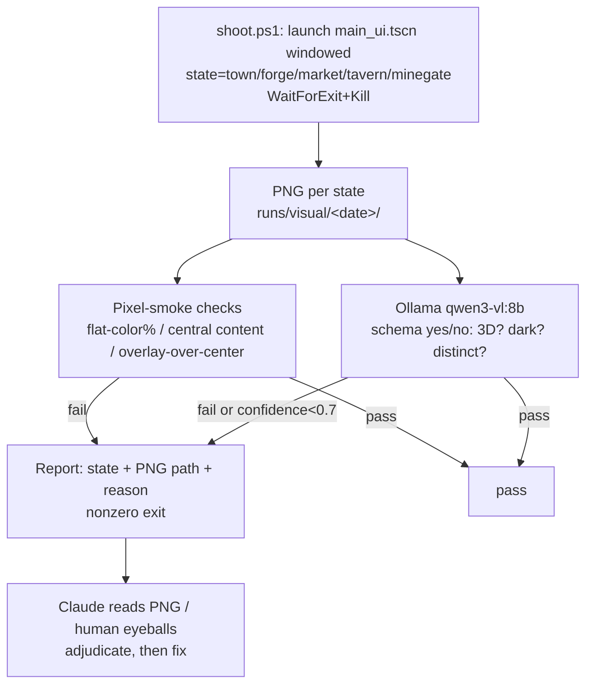

# feat: Automated visual playtest loop + interior render fixes

## Summary

Two coupled tracks, born from one failure: headless property-only tests reported the 3D interiors "working" while the running game showed a flat 2D screen. The tests never asserted a single rendered pixel.

- **Track A — a real visual playtest loop.** Capture actual GPU-rendered screenshots of any game state, then assert on them two ways: cheap deterministic pixel smoke-checks (would have caught this bug) + a local vision model (Qwen3-VL via the already-installed Ollama) for semantic yes/no checks ("is this a 3D room or a flat backdrop?"), with Claude reading the PNG directly as the high-accuracy escalation tier. This removes the human-eyeballs-every-step bottleneck.
- **Track B — fix the visual bugs the loop (and a diagnosis pass) exposed.** The market draws a 2D shop plank over its 3D room; all interiors are framed near-top-down so they read as a flat tan floor; the HUD and interior title overlap; town buildings render dark and props are scattered.

Track A is sequenced first (at least capture + pixel-smoke) so every Track B fix is *proven* by a before/after screenshot + assertion, not by eye.

**Key empirical grounding:** research agents rendered the game on the RTX 5080 (real Vulkan) from this environment and captured PNGs of the town and all four interiors — so the capture method, the root causes, and the fixes below are verified against actual rendered frames, not inferred.

---

## Problem Frame

The 2D-vs-3D interior failure is a specific instance of a general gap: **nothing in the pipeline ever looks at what the game renders.** `godot/tests/InteriorRoom3DTests.cs` is property-only by design (the 3D-render-hang rule bans pumping frames while a SubViewport renders under gdUnit), so it asserts `InteriorRoom != null`, `IsPushedIn == true`, `SeeThrough == true` — all true in the broken-looking game — and zero pixels. A frame that is 70% bare floor with a 2D plank over it passes identically to a good one.

Consequence: visual regressions ship silently and the human is the only detector, which "significantly slows the ability to develop" (user). We need an automated eye.

Two enabling facts made this plan possible (both verified this session):
1. **Godot renders fine from this agent context** — the "TOWN_SHOT needs an interactive desktop" claim was false; it was only the `--headless` dummy driver. A normal windowed/minimized launch renders on the GPU (agents run in desktop session 1), even at the lock screen. Real non-black PNGs were captured.
2. **Ollama is already installed and running** (v0.32.1, `localhost:11434`); a capable vision model is one `ollama pull qwen3-vl:8b` away (~6 GB, ~7-8 GB VRAM at runtime, fits the 16 GB card).

---

## Requirements

- **R1** — Capture a real GPU-rendered screenshot of an arbitrary game state (town; each of forge/market/tavern/mine-gate interiors) to a PNG file, on demand, from an agent/script context on this machine, without editing game code per-capture.
- **R2** — Deterministic pixel smoke-assertions on a captured PNG that would fail the exact bug class seen here: no single flat color dominating >50% of the frame; the venue's prop meshes present within the frame's central region; no full-viewport 2D overlay covering the viewport center.
- **R3** — Semantic visual assertions via a local VLM: schema-constrained yes/no questions per state (e.g. "is this a real 3D room with perspective depth, not a flat 2D image?", "is the scene too dark to read?", "are the forge and tavern visually distinct?"), returning machine-parseable results; low-confidence or failing checks are surfaced for Claude-read/human adjudication, never silently passed.
- **R4** — A single dev-box command runs capture → pixel-smoke → VLM asserts across all states and reports pass/fail with the offending PNG paths. Explicitly a local lane (GPU required), not hosted CI.
- **R5** — The market interior must render its 3D room (the 2D ShopStage strip must not cover it while a 3D interior is staged).
- **R6** — Interiors must read as 3D rooms (perspective depth visible), not near-top-down floor plans, and be visually distinguishable per venue.
- **R7** — The HUD header and the interior title/hotspot panel must not overlap; the build-stamp label must not draw over the Day/Phase header.
- **R8** — Town buildings must be legible (not dark muddy blobs) and props must be placed sensibly (no player spawning on top of the well); this is a tuning pass, judged by screenshot.
- **R9** — The visual checks must respect the machine's hard GPU/RAM safety limits and must not stack the VLM on the GPU during a TRELLIS/ComfyUI generation job.

**Traceability:** Track A = R1-R4, R9. Track B = R5-R8 (each fix verified against R2/R3 assertions).

---

## Key Technical Decisions

- **KTD1 — Capture via non-headless windowed launch, not `--headless`.** `--headless` uses Godot's dummy rendering driver: `GetViewport().GetTexture().GetImage()` returns null and the current TOWN_SHOT tool hangs forever. Launch the console exe windowed/minimized on the GPU instead; the viewport texture renders regardless of window visibility. Proven: real 1152×648 PNGs captured, `Vulkan 1.4.341 ... RTX 5080`, clean exit <30 s. (Source: research agent 1, evidence PNGs.)
- **KTD2 — Reusable capture harness driven by env vars, launching `main_ui.tscn` directly.** Bypasses the New-Game-Select screen (`MainUi._Ready` self-seeds a deterministic SimAdapter, seed 2026). A checked-in harness renders one state per invocation (empty = town; a venue key enters that interior via the production `OnTownBuildingClicked` path), waits N frames for the camera dolly to settle, saves `get_viewport().get_texture().get_image().save_png()`, then quits. Always wrap the launch in `WaitForExit(timeout)` + `Kill()` — the failure mode is an infinite hang.
- **KTD3 — Two assertion tiers, not one.** (a) **Pixel-smoke** (deterministic, fast, offline) is the primary regression gate and the one that catches this bug class — flat-color-dominance, central-region content, overlay-over-center. (b) **Local VLM (Qwen3-VL via Ollama)** for semantic judgments prose-checks can't make, with **Claude-reads-the-PNG** as the escalation/adjudication tier (highest accuracy, in-session only). Golden-image SSIM diffing stays **deferred** per the existing Q4 research decision (`docs/design/2026-07-21-3d-playtest-open-questions-research.md`) — it thrashes while art is still changing; the semantic + smoke layers are churn-resistant and cover the gap now.
- **KTD4 — VLM via Ollama HTTP with schema-constrained output.** POST to `localhost:11434/api/chat` with `format` = a JSON schema forcing `{answer: yes|no, confidence, reason}` — no prose parsing. Reuses installed infra; do **not** add a ComfyUI VLM node (nothing suitable installed, HTTP is simpler). Set `keep_alive: 0` and pre-check `nvidia-smi` so the VLM never co-resides with a TRELLIS job (R9, and the standing GPU-safety rule).
- **KTD5 — Local lane, not hosted CI.** GitHub-hosted runners have no GPU; the render step only works on this machine. The visual check is a dev-box gate (a script the agent or user runs), wired into the existing Gate-B TOWN_SHOT pack flow — not a `dotnet test` category that hosted CI would try and fail to run. This aligns with the render-hang rule that already keeps 3D rendering out of CI.
- **KTD6 — Market bug: gate the 2D strip on `!seeThrough`.** Root cause is `InteriorStage.cs:260-261` unconditionally showing `_shopStage`/`_shelfRow` for the market. Smallest correct fix: `_shopStage.Visible = venueKey == "market" && !seeThrough`. (Source: agent 3, verified against `mm_diag_market.png`.)
- **KTD7 — Interior framing: per-open camera pitch override, not a global change.** `CameraRig` uses a fixed −42° pitch tuned for the town; reused for interiors it yields a near-top-down floor plan. Add an optional target-pitch to `PushIn` (eased like `_targetDistance`; `Release` restores −42°), and open interiors at ~−15° pitch / distance ~6 / focus at eye height (~y 1.2) so walls and depth read. Town behavior untouched.

---

## High-Level Technical Design

The loop that closes the gap — capture is shared; two assertion tiers gate; Claude/human adjudicate escalations:



Track B fixes are validated by re-running this loop on the affected states and diffing before/after.

---

## Output Structure

New tooling (exact layout may adjust during implementation; per-unit Files are authoritative):

```
godot/tools/
  shot_harness.gd            # SceneTree harness: render one state -> PNG (KTD2)
tools/
  shoot.ps1                  # wrapper: launch+timeout+kill, one state -> PNG
  visual-playtest.ps1        # capture all states -> pixel-smoke + VLM -> report (R4)
  visualcheck/
    pixel_smoke.py           # deterministic PNG assertions (R2)
    vlm_assert.py            # POST PNG to Ollama, schema yes/no (R3, KTD4)
    assertions.json          # state -> [{question, expect, severity}] + smoke thresholds
docs/design/
  2026-07-24-visual-playtest-loop.md   # how to run it, safety notes, extending
runs/visual/<date>/          # captured PNGs + report.json (gitignored except a sample)
```

---

## Implementation Units

### U1. Screenshot capture harness + wrapper

**Goal:** On-demand real screenshot of any game state to PNG (R1, KTD1, KTD2).
**Requirements:** R1.
**Dependencies:** none.
**Files:** `godot/tools/shot_harness.gd` (new), `tools/shoot.ps1` (new).
**Approach:** Port the proven research harness into a checked-in `SceneTree` script: instantiate `res://scenes/panels/main_ui.tscn`, read env `SHOT_OUT` (path) + `SHOT_STATE` (empty = town, else venue key `Forge|Shop|Tavern|Gate`), await ~60 frames, if a venue is set call the MainUi entry the town uses on arrival (`OnTownBuildingClicked` — reachable via `call()` through the C# source-gen bridge), await ~240 more frames for the dolly, save `root.get_texture().get_image().save_png(SHOT_OUT)`, `quit()`. `shoot.ps1` launches the console exe windowed/minimized with `--path` + the harness via `-s`, passing env; wraps in `WaitForExit(60000)` + `Kill()`; runs `tools/play.ps1 -NoLaunch` first so the build/import/gate is current.
**Patterns to follow:** existing TOWN_SHOT env-gate in `godot/scripts/MainUi.cs`; `tools/play.ps1` launch + gate structure.
**Execution note:** Verify by producing one real non-black PNG of the town before wiring anything downstream — this unit's whole value is that the capture works here.
**Test scenarios:**
- Town capture: `SHOT_STATE=""` produces a PNG that exists, is >50 KB, and has pixel stdev >10 (non-black, has content).
- Interior capture: `SHOT_STATE=Tavern` produces a PNG showing the tavern interior (verified by Claude-read during bring-up).
- Safety: a hung launch is killed by the timeout and the wrapper exits nonzero, never hangs.

### U2. Fix TOWN_SHOT headless hang (fail-fast)

**Goal:** The existing TOWN_SHOT path must fail fast with a clear message under `--headless` instead of hanging forever (robustness; prevents future automation hangs).
**Requirements:** R1 (supporting).
**Dependencies:** none.
**Files:** `godot/scripts/MainUi.cs`.
**Approach:** In the TOWN_SHOT branch, detect the null/dummy rendering driver (or a null viewport texture) and print a clear error + quit non-zero rather than awaiting a texture that never arrives. Keep the happy path (real driver) unchanged.
**Patterns to follow:** existing env-gate + `GD.Print`/`GetTree().Quit()` usage in MainUi.
**Test scenarios:**
- `--headless` + `TOWN_SHOT` set: process exits non-zero within a few seconds with a message naming the headless-driver limitation (not an infinite hang).
- Non-headless windowed + `TOWN_SHOT`: still saves a PNG (unchanged behavior).

### U3. Deterministic pixel-smoke assertions

**Goal:** The cheap, offline, deterministic check that would have caught this bug (R2).
**Requirements:** R2.
**Dependencies:** U1 (needs PNGs).
**Files:** `tools/visualcheck/pixel_smoke.py` (new), `tools/visualcheck/assertions.json` (new).
**Approach:** Pure-Python (Pillow only, or stdlib + numpy) checks on a PNG: (a) **flat-color dominance** — quantize to a small palette, fail if any single bucket >50% of pixels (catches "70% bare floor" and "2D plank covers screen"); (b) **central-region content** — the central ~50% box must contain meaningful mesh detail (edge/variance density above a floor); (c) **overlay-over-center** — detect a large solid rectangular region covering the viewport center (catches the 2D ShopStage plank). Thresholds live in `assertions.json` per state. Exit nonzero + print offending metric + PNG path on failure.
**Patterns to follow:** repo has no Python test infra; keep this self-contained and dependency-light (document the one `pip install pillow`). Mirrors the analytics tool's report-style output (`tools/Analytics`).
**Execution note:** Calibrate thresholds against the KNOWN-BAD PNGs already captured this session (`mm_diag_market.png`, the top-down interiors) plus a known-good town shot — the bug is the fixture.
**Test scenarios:**
- Known-bad market PNG (2D plank) → FAILS overlay-over-center.
- Known-bad top-down interior (70% floor) → FAILS flat-color-dominance.
- Known-good town PNG → PASSES all three.
- Missing/zero-byte PNG → FAILS with a clear "no capture" message, not a crash.

### U4. Local VLM semantic assertion runner

**Goal:** Semantic yes/no visual checks via local Qwen3-VL (R3, KTD4, R9).
**Requirements:** R3, R9.
**Dependencies:** U1.
**Files:** `tools/visualcheck/vlm_assert.py` (new), `tools/visualcheck/assertions.json` (extend).
**Approach:** For each (PNG, question) in `assertions.json`, base64 the image and POST to `http://localhost:11434/api/chat` with `model: qwen3-vl:8b`, `stream:false`, `keep_alive:0`, and `format` = JSON schema `{answer: enum[yes,no], confidence: number, reason: string}`. Compare `answer` to the expected value; treat `confidence < 0.7` or mismatch as a flag (not silent pass). Pre-flight: GET `/api/tags`; if the model is absent, print `run: ollama pull qwen3-vl:8b` and exit clearly. GPU-safety: before running, check `nvidia-smi`; if a TRELLIS/ComfyUI job is active or VRAM is tight, skip with a clear "GPU busy — rerun later" rather than stacking (R9).
**Patterns to follow:** the schema-constrained Ollama call from research agent 2; GPU-safety limits in `docs/design/2026-07-21-3d-gen-pipeline-PROVEN.md`.
**Test scenarios:**
- Model present: town PNG + "is this a game scene, not a solid color?" → `yes`, high confidence.
- Known-bad top-down interior + "is this a 3D room with visible perspective depth, not a flat floor plan?" → `no` (this is the semantic catch for the framing bug).
- Model absent: prints the `ollama pull` instruction and exits nonzero, no crash.
- GPU busy (TRELLIS running): skips with a clear message, does not launch the model.

### U5. One-command visual playtest + docs

**Goal:** Single command captures all states → runs both assertion tiers → reports; documented (R4).
**Requirements:** R4, R9.
**Dependencies:** U1, U3, U4.
**Files:** `tools/visual-playtest.ps1` (new), `docs/design/2026-07-24-visual-playtest-loop.md` (new), `.gitignore` (add `runs/visual/` except a committed sample).
**Approach:** Loop states {town, forge, market, tavern, minegate}: `shoot.ps1` each → `pixel_smoke.py` → `vlm_assert.py`; collect into `runs/visual/<date>/report.json` + per-state PNGs; print a table (state · smoke pass/fail · VLM pass/fail · PNG path) and exit nonzero if any hard check failed. First line health-checks Ollama + Godot bin. Doc explains: how to run, the two tiers, the Claude-read escalation, GPU-safety, and how to add an assertion (one JSON entry, no new code). Wire a mention into the Gate-B playtest sheet so packs auto-triage.
**Patterns to follow:** `tools/play.ps1` structure; `tools/Analytics` report style; the Gate-B sheet flow.
**Test scenarios:**
- Full run on current `main`: produces 5 PNGs + report.json; **market + interiors FAIL** (pre-Track-B) — proving the loop catches the real bugs.
- After Track B units land: same command → all states PASS (this is the acceptance gate for Track B).
- Ollama down: reports the gap clearly, still produces PNGs + pixel-smoke results.

### U6. Fix market 2D-over-3D (the worst screen)

**Goal:** The market interior shows its 3D room, not a 2D plank (R5, KTD6).
**Requirements:** R5.
**Dependencies:** U1 (to verify), ideally U3.
**Files:** `godot/scripts/town/InteriorStage.cs`.
**Approach:** Gate the 2D shop surfaces on see-through mode: `_shopStage.Visible = venueKey == "market" && !seeThrough;` and the same for `_shelfRow` (or keep only a small icon row that doesn't cover the viewport). Confirm the classic (non-see-through) 2D market path is unchanged for any caller still using it.
**Patterns to follow:** the existing `seeThrough` gating at `InteriorStage.cs:253-255`.
**Test scenarios:**
- Property: `Open("market", seeThrough:true)` leaves `_shopStage.Visible == false`; `seeThrough:false` leaves it visible (preserves classic path).
- Visual (U3/U4): market capture no longer fails overlay-over-center; VLM answers "is this a 3D room?" → yes.
- Covers the market's tutorial-step-1 first impression.

### U7. Interior camera framing (read as 3D, not top-down)

**Goal:** Interiors look into the room at eye level so depth reads (R6, KTD7).
**Requirements:** R6.
**Dependencies:** U1, U6.
**Files:** `godot/scripts/town3d/CameraRig.cs`, `godot/scripts/MainUi.cs`, `godot/scripts/town3d/InteriorRoom3D.cs`.
**Approach:** Add an optional target-pitch parameter to `CameraRig.PushIn` (store `_targetPitch`, ease it exactly like `_targetDistance`; `Release()` restores the town default −42°). In `MainUi`'s interior open (~line 1121), push in at ~−15° pitch, distance ~6, targeting the room's `Focus` raised to ~y 1.2. Tune against captured screenshots.
**Patterns to follow:** existing `_targetDistance` easing in `CameraRig`; the station push-in call site in MainUi.
**Execution note:** Iterate pitch/distance/focus against `shoot.ps1` captures — this is a look-tuning unit; the screenshot is the test.
**Test scenarios:**
- Property: `PushIn(..., pitch:-15)` sets the eased target; `Release()` restores −42°; town push-in (stations) unchanged when no pitch passed.
- Visual (U3/U4): interior captures no longer fail flat-color-dominance; VLM "3D room with perspective depth?" → yes for all four venues.

### U8. Per-venue interior readability

**Goal:** Forge/tavern/market/mine-gate interiors are visually distinct, not identical tan boxes (R6).
**Requirements:** R6.
**Dependencies:** U7.
**Files:** `godot/scripts/town3d/InteriorRoom3D.cs`.
**Approach:** Via the existing `Rooms` + wall-tint tables: pull key props off the back wall toward the camera sight line so they read at the new pitch; differentiate floor material/tint per venue and vary prop density; ensure each venue's identity prop (forge→anvil+brazier, tavern→cauldron+table, market→stall+crates, gate→ore-cart) sits prominently in frame.
**Patterns to follow:** the `Rooms`/wall-tint dictionaries at `InteriorRoom3D.cs:56-96`; `Town3D.MeshHeight` scaling.
**Execution note:** Look-tuning; verify via `shoot.ps1` + the VLM "are the forge and tavern visually distinct?" check.
**Test scenarios:**
- Property: each venue's `Rooms` entry still lists its identity props (data intact).
- Visual: VLM given forge vs tavern captures answers "distinct?" → yes; no venue capture fails central-region content.

### U9. HUD / interior-title overlap + build-stamp position

**Goal:** No overlapping text — interior title/hotspots sit clear of the HUD; the build stamp doesn't cover the Day/Phase header (R7).
**Requirements:** R7.
**Dependencies:** none (can land early).
**Files:** `godot/scripts/town/InteriorStage.cs`, `godot/scripts/BuildStamp.cs` (and/or the HUD header layout in `godot/scripts/MainUi.cs`).
**Approach:** Offset the interior title + hotspot panel below the HUD bar (anchor/margin) so they don't collide in see-through mode. Reposition the build-stamp label to a corner that doesn't overlap the Day/Phase header (e.g. bottom-left, or right-align top).
**Patterns to follow:** existing anchor/margin usage in `InteriorStage` and the HUD header row.
**Test scenarios:**
- Property: interior title/hotspot panel top margin is below the HUD header height; build-stamp rect does not intersect the header rect.
- Visual: town + interior captures show no overlapping text (Claude-read confirm during bring-up).

### U10. Town building legibility + prop placement

**Goal:** Buildings read clearly (not dark blobs); props placed sensibly; player doesn't spawn on the well (R8).
**Requirements:** R8.
**Dependencies:** U1 (to verify).
**Files:** `godot/scripts/town3d/BuildingKit.cs`, `godot/scripts/town3d/Town3D.cs`, `godot/scripts/town3d/TownAssets.cs`.
**Approach:** Investigate the dark gen-building rendering (material/roughness/emission or scale making the tavern read as a dark mass) — adjust material handling or per-building scale/orientation for legibility; retune the worst prop positions surfaced by the town capture; move the player spawn off the central well/fountain. Judged by screenshot; keep changes conservative and reversible.
**Patterns to follow:** `BuildingKit` gen-first assembly; `Town3D.AddGenProp` placement; the lighting values from the recent lighting fix (do not undo them).
**Execution note:** Tuning unit — iterate against `shoot.ps1` town captures + VLM "is the scene too dark / are buildings legible?" checks.
**Test scenarios:**
- Visual: town capture passes "too dark?" → no and buildings-legible → yes; player start position is not inside the well collider.
- Property: player spawn coordinate differs from the well prop position.

---

## Scope Boundaries

**In scope:** the capture harness, pixel-smoke + local-VLM assertion tiers, the one-command runner + docs (Track A); and the market/framing/readability/HUD/building-legibility fixes (Track B), each verified by the new loop.

### Deferred to Follow-Up Work
- **Golden-image SSIM regression tests** — deferred per the existing Q4 decision until the art look stabilizes; the smoke + semantic tiers cover the gap now. Add later via `Codeuctivity.ImageSharpCompare` or Python `imagehash`.
- **Hosted-CI visual gating** — impossible without a GPU runner; revisit only if a self-hosted GPU runner appears.
- **Walkable 3D interiors / full interior art** — the current camera-push-in diorama is the target shape; walkable movement + bespoke interior wall art are a separate later wave.
- **A full 3D mine scene** — monsters remain in the spectate view; unchanged here.

### Out of scope
- Any sim/gameplay logic change — this plan is Godot-adapter + tooling only. No `sim/` edits.
- Re-tuning the recently-shipped lighting values beyond the building-legibility pass in U10.

---

## System-Wide Impact

- **Determinism/sim:** none — no `sim/` changes; golden-replay and balance untouched.
- **CI:** the visual loop is a **local** lane; it must not be wired as a hosted-CI `dotnet test` category (would fail on GPU-less runners). Existing engine/sim CI unchanged.
- **GPU/machine safety:** the VLM shares the GPU with ComfyUI/TRELLIS — U4/U5 must honor the hard limits and never co-run with a generation job (R9).
- **New dependency:** one local model (`ollama pull qwen3-vl:8b`) + one Python lib (Pillow). Both local, no cloud, no secrets — SOC2/CMMC-clean. Flagged per Fornida "new platform dependency" rule: Ollama is already installed; this only pulls a model.

---

## Risks & Dependencies

- **R-A: capture depends on a desktop session (session 1).** Works today; a true service/session-0 context or disconnected console would render black. Mitigation: `shoot.ps1` checks the PNG is non-black and fails loud with a session hint; fallback documented (no good stock-Godot headless-GPU path).
- **R-B: 8B VLM accuracy is ~90% on coarse judgments, weaker on subtle ones.** Mitigation: narrow enum yes/no questions, calibrate against the known-bad fixtures, treat low confidence as "flag for Claude/human," never silent pass. Pixel-smoke (deterministic) is the primary gate; the VLM is corroboration.
- **R-C: nondeterministic HUD text (countdown timer) breaks pixel-exact diffs.** Mitigation: smoke checks are structural (variance/region/overlay), not pixel-exact; goldens deferred anyway.
- **R-D: camera-pitch change could regress the town/station push-in.** Mitigation: pitch is an optional param defaulting to town behavior; property test pins that town push-in is unchanged when no pitch passed.
- **Dependency:** ComfyUI/Ollama share the GPU; U4/U5 gate on `nvidia-smi` (R9).

---

## Sources & Research

- Research agent 1 (screenshot capture feasibility) — proved windowed non-headless GPU capture works from this context; evidence PNGs (`%TEMP%\claude\mm-shots\t3_windowed.png`, `t4_interior_tavern.png`); confirmed `--headless` = dummy driver + TOWN_SHOT infinite-hang.
- Research agent 2 (visual assertion stack) — Ollama installed+running; `qwen3-vl:8b` recommended; schema-constrained HTTP pattern; Claude-read as escalation; golden-diff deferral rationale.
- Research agent 3 (interior 2D root cause) — empirically rendered all four interiors; found the market `!seeThrough` gap (`InteriorStage.cs:260-261`) and the −42° framing problem; named the exact visual assertion the bug needs.
- `docs/design/2026-07-21-3d-playtest-open-questions-research.md` (Q4) — prior golden-image deferral decision, still in force.
- `docs/design/2026-07-21-3d-gen-pipeline-PROVEN.md` — GPU/RAM hard safety limits the VLM must honor.
- Live screenshots read this session — town + tavern interior on `main @ 972866d`, confirming the town/interior render state and the HUD-overlap cosmetic issue.

---

## Definition of Done

- `tools/visual-playtest.ps1` runs on the dev box: captures town + 4 interiors, runs pixel-smoke + VLM, emits `report.json` + a pass/fail table.
- On pre-fix `main` the loop **fails** market + interiors (proving it catches the real bug); after U6-U10 it **passes** all five states.
- Market renders its 3D room; all four interiors read as distinct 3D rooms (not top-down floor plans); no overlapping HUD/title text; town buildings legible; player doesn't spawn on the well.
- No `sim/` changes; engine + sim CI stay green; GPU-safety honored (VLM never co-runs with TRELLIS).
- Docs explain how to run and extend the loop; the Gate-B sheet references it.

## Verification Contract

- **Gate 1 (loop exists + catches the bug):** on current `main`, `visual-playtest.ps1` produces PNGs and FAILS market (overlay-over-center) + interiors (flat-color-dominance). This is the proof the tests finally see pixels.
- **Gate 2 (fixes verified by the loop):** after Track B, the same command PASSES all five states; Claude reads the final PNGs to confirm.
- **Gate 3 (no regressions):** `dotnet test godot/tests` (property suite) + fast lane + balance stay green; town/station camera behavior unchanged (U7 property test).
