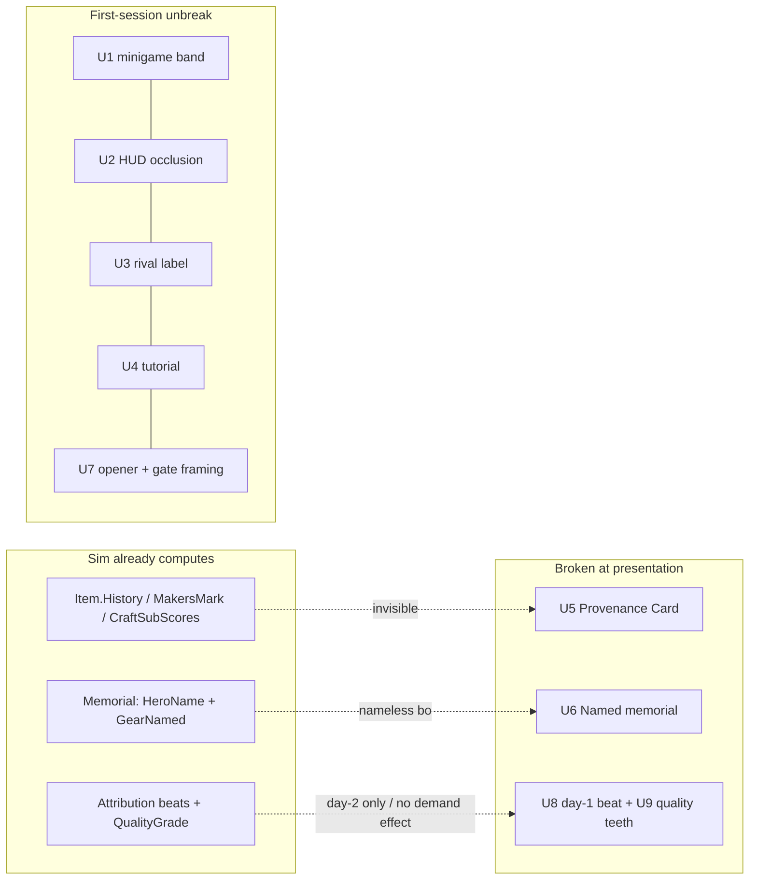

# feat: First-play unbreak + Legends-Visible (gameplay/UX wave)

## Summary

Two Fable research passes + live screenshot verification converged on one thesis: **Maker's Mark hides its own best moments.** The sim already computes a rich emotional game — item life-stories (`Item.History`), named memorials, attribution ("your marked blade felled X"), gossip, rivalry — and the player sees almost none of it. Worse, the first session actively buries what exists behind an **invisible-target minigame** (verified by screenshot: "SMELT — stop it in the sweet zone" over a blank bar), a **HUD that covers its own tutorial buttons and pushes controls off-screen**, **rival sales that look like the player's**, and a spine payoff ("your craft writes legends") that **cannot structurally arrive until day 2**.

This plan ships in two waves:
- **Wave 1 — unbreak + reveal the first session (U1-U7):** all surface-existing-depth or presentation fixes, no sim re-baseline. Makes the first ~10 minutes work and makes the legend-fantasy touchable (Provenance Card, named memorials).
- **Wave 2 — make the hook land + mastery matter (U8-U10):** compress the first attribution beat into day 1, give crafted quality demand-side teeth, and surface the scarcity systems. Wave 2 contains the one real sim change.

Every visual unit is verified with the `tools/shoot.ps1` screenshot harness (render → Read the PNG), the loop built earlier this session — so "it looks right" is checked, not assumed.

**Target repo:** the game repo (this doc's home). All paths repo-relative.

---

## Problem Frame

The core loop is `craft → sell → watch → (feel nothing durable) → repeat`. The *input* side is now decent (forge rhythm, alchemy puzzle, action-slot scarcity forces triage). The *return* side is broken: the day's payoff arrives as text about heroes the player has no relationship with, wielding items whose story is invisible, judged by a market that ignores craftsmanship. Three feedback arcs the sim already computes are severed at the presentation layer (item biography, death meaning, skill reward), and the first session hides even what's wired.

Grounding (from the audits, cite-checked):
- `sim/GameSim/Contracts/Items.cs` — `Item.History` (`ItemHistoryEntry(Day, Kind, Detail)`, appended by `sim/GameSim/Drama/ExpeditionRevealSystem.cs`) is surfaced by **no** Godot panel and **no** CLI command. The literal spine is invisible data.
- `sim/GameSim/Contracts/World.cs` — `Memorial` carries `HeroName` + `GearNamed`, but `godot/scripts/town3d/Town3D.cs` `BuildMemorialStone` renders a nameless box.
- `godot/scripts/minigames/ForgeMinigame.cs` `RepaintUi` renders only the raw bar value; the sweet-zone center/width exist in `godot/scripts/minigames/SmeltBeat.cs` but are never drawn.
- `godot/scripts/MainUi.cs` — the objective chip (`ObjectiveDockHeight`) floats over every panel and covers the tutorial's own target buttons; the header overflows 1152px once stat chips mount, pushing Skip/Auto/Ledger off-screen (recurring "F1 menus off-screen").
- `godot/scripts/AdventureTicker.cs` renders rival and player sales identically (ignores the player-shop flag the CLI's `EventNarration` already uses).
- `godot/scripts/ui/TutorialFlow.cs` — steps state *what* but never *where*/*how to move*, and demand Morning-only actions during other phases with no "wait" hint.
- `sim/GameSim/Counter/WillingnessModel.cs` + `sim/GameSim/Heroes/ShoppingAi.cs` — zero references to `QualityGrade`; mastering the minigame produces a Masterwork the market values identically to junk.
- `sim/GameSim/Heroes/RaidForecast.cs` — the pre-sleep telegraph is CLI-only; the Godot player never gets the triage moment.

---

## Requirements

Wave 1:
- **R1** — The craft minigame gauge visibly shows the target sweet zone (band center + width) so the core skill verb is playable by sight.
- **R2** — The objective chip never covers the panel/modal buttons it refers to; core HUD controls (Skip/Auto/Pause/Ledger) stay within the viewport at the default window size; a test asserts in-viewport bounds.
- **R3** — Rival sales are visually distinguished from the player's own sales in the adventure ticker.
- **R4** — Tutorial steps tell the player *where* to go and *how* (walk/click), and give a "wait until the right phase" affordance when the current phase forbids the step.
- **R5** — Any player-crafted item can be inspected to show its life story (history entries + maker's mark + craft sub-scores) — the spine made touchable, with no sim change.
- **R6** — Memorial stones show the dead hero's name, day, and the player gear they died wearing.
- **R7** — The opening/first-day states the fantasy in one line and frames the mine gate on-camera so the player sees the game's destination.

Wave 2 (sequenced after Wave 1):
- **R8** — The first "★ your marked gear did that" attribution beat is reachable and given ceremony within the first play session (day 1).
- **R9** — Crafted `QualityGrade` measurably affects hero demand (price tolerance and/or willingness), and veterans visibly refuse poor gear — so minigame mastery matters. (Sim change; determinism + balance gates must stay green.)
- **R10** — Rent cadence, remaining action slots, and the raid forecast are visible in the Godot HUD (not CLI-only).

---

## Key Technical Decisions

- **KTD1 — Verify every visual unit by screenshot, not by property assert.** This wave exists *because* property-only tests passed a blank minigame and a self-occluding HUD. Each visual unit's Verification renders the relevant state via `tools/shoot.ps1` and the implementer (or Claude) Reads the PNG. Property tests still cover logic (band math, in-viewport bounds, history formatting).
- **KTD2 — Wave 1 is presentation/surface-existing only; no sim re-baseline.** U1-U7 read data the sim already computes and change Godot adapter/UI. Golden-replay and balance are untouched by Wave 1. The single sim change (U9) is isolated in Wave 2 and gated.
- **KTD3 — Provenance Card is a read-only view over `Item.History`.** No new sim state; it renders existing `ItemHistoryEntry` + `MakersMark` + `CraftSubScores`. This is deliberately the cheap forward-scout for the roadmap's Legend Engine (which later composes the same data into epithets) — same surface, richer backend later.
- **KTD4 — HUD occlusion fix is layout, not redesign.** Shrink/auto-collapse the objective chip (its fixed height is mostly empty), hide it while a modal/panel is open, and clamp the header so controls never leave the viewport. Add the in-viewport assertion the F1 postmortem asked for. Do not restyle the HUD.
- **KTD5 — Quality-gets-teeth (U9) is the only determinism-sensitive change and must not silently move balance bands.** Adding a `QualityGrade`→demand effect changes the 100-day economy. Follow the precedent from the alchemist/scarcity waves: run golden-replay + the balance gate; if bands legitimately shift, re-baseline deliberately with a documented reason; never hack around a golden failure. Prefer an additive, bounded effect (e.g. a price-tolerance multiplier by grade) tunable from one place.
- **KTD6 — Day-1 attribution (U8) is pacing/selection, not scripted content.** The attribution engine + PresentationScheduler tiers already exist; U8 guarantees the sim's own first ★ beat gets a PullFocus spotlight and is name-dropped back at the tavern — by ensuring a shelved item is bought and raided within day 1's window (telescoped pacing or a guaranteed first-buyer), not by faking a beat.

---

## High-Level Technical Design

The wave closes three severed feedback arcs; each arc is data the sim already produces, surfaced at a Godot seam:

Wave 1 = FIRST + PC + MS (all reads/layout). Wave 2 = HK (pacing + the one sim change) + U10 scarcity surfacing.

---

## Implementation Units

### U1. Draw the craft minigame sweet-zone band

**Goal:** The forge/alchemy gauge visibly shows the target zone so the core verb is skill, not guessing (R1). Highest single quick win.
**Requirements:** R1.
**Dependencies:** none.
**Files:** `godot/scripts/minigames/ForgeMinigame.cs`, `godot/scripts/minigames/SmeltBeat.cs` (read band center/width; no logic change), `godot/tests/ForgeCraftTests.cs`.
**Approach:** In `RepaintUi`, overlay the sweet-zone band on the gauge — the band center (e.g. 620‰) and half-width already exist per-beat in the beat classes; render them as a highlighted region on the ProgressBar (a colored rect / styled range, or a second overlay control). Applies to all beats (smelt/forge/quench) and the alchemist puzzle gauge if it shares the widget. No change to scoring math.
**Patterns to follow:** the existing per-beat band fields in `SmeltBeat.cs`; the result-ceremony rendering in `godot/scripts/panels/ForgePanel.cs` (already draws grade/stars/pips).
**Execution note:** Verify by screenshot — `shoot.ps1` can't open the minigame directly, so adapt the harness (temp) to open a craft, or verify via a focused render; the band must be visibly on the bar at the beat's center.
**Test scenarios:**
- Band region maps to the beat's center±halfwidth (property: given a beat with center 620/width W, the drawn band's normalized range == [ (620-W)/1000 , (620+W)/1000 ]).
- Band updates when the active beat changes (smelt→forge→quench) to each beat's own center/width.
- Screenshot: the smelt gauge shows a visible highlighted zone (was blank).
**Verification:** minigame screenshot shows a target zone on the gauge; scoring unchanged (existing ForgeCraft tests green).

### U2. Fix HUD self-occlusion + in-viewport guard

**Goal:** Objective chip stops covering the buttons it points at; core controls stay on-screen; a test asserts it (R2, KTD4).
**Requirements:** R2.
**Dependencies:** none.
**Files:** `godot/scripts/MainUi.cs`, `godot/scripts/ui/ObjectiveTracker.cs` (or wherever the chip mounts), `godot/tests/LayoutTests.cs` (or a new `HudBoundsTests.cs`).
**Approach:** (a) Auto-collapse/shrink the objective chip to its content height and hide it while any drawer/interior/modal is open. (b) Clamp/reflow the HUD header so Skip/Auto/Pause/1x/Ledger remain within the viewport once Gold/Heroes stat chips mount (give the phase timeline shrink flags or move controls to a stable anchor). (c) Add the in-viewport assertion the F1 postmortem called for.
**Patterns to follow:** existing anchor/margin usage in `MainUi` HUD header; `LayoutTests` MenuSizing pattern.
**Test scenarios:**
- After stat chips mount (post-first-tick state), the Skip/Auto/Ledger control rects are fully within the 1152×648 viewport bounds (the assertion F1 lacked).
- With a drawer/modal open, the objective chip is hidden (or does not overlap the drawer's action buttons).
- Objective chip height tracks its content (no giant empty panel).
- Screenshot: forge drawer with the "Buy copper" tutorial step — the chip does not cover the copper Buy button.
**Verification:** screenshots of town-day1, forge-drawer, and evening-ledger show no control off-screen and no chip-over-button overlap; bounds test green.

### U3. Distinguish rival vs player sales in the ticker

**Goal:** Rival sales read as the rival's, not the player's (R3).
**Requirements:** R3.
**Dependencies:** none.
**Files:** `godot/scripts/AdventureTicker.cs`, `godot/tests/AdventureTickerTests.cs`.
**Approach:** Read the player-shop flag on the sale event (the same distinction `sim/GameSim/.../EventNarration.cs` already makes for the CLI) and prefix/word rival sales distinctly ("Rival's Soldier's Longsword sold…" vs "Your Iron Blade sold to Torvald…"). Presentation only.
**Patterns to follow:** the CLI `EventNarration` player-vs-rival wording; existing ticker line formatting.
**Test scenarios:**
- A rival sale event renders with the rival prefix/wording; a player-shop sale renders as the player's.
- Covers the day-1 confusion: with no player sales yet, no ticker line implies the player sold anything.
**Verification:** ticker screenshot during Expedition shows rival sales labeled as rival.

### U4. Location- and phase-aware tutorial steps

**Goal:** Tutorial tells the player where to go, how to move, and when a step must wait (R4, fixes F6).
**Requirements:** R4.
**Dependencies:** U2 (chip must not occlude while this guides).
**Files:** `godot/scripts/ui/TutorialFlow.cs`, `godot/tests/` (a tutorial-flow test if one exists; else add focused coverage).
**Approach:** Enrich each step's copy with a target building + action ("Walk to the **Forge** and click it — buy 2 copper at the vendor") and a movement hint on step 1 (WASD / click-to-move). When the current phase forbids the step's action (e.g. Morning-only vendor during Expedition), show a "comes back next Morning" variant instead of an impossible instruction.
**Patterns to follow:** the existing advisor/objective text plumbing in `TutorialFlow`; phase gating already known to the sim.
**Test scenarios:**
- Step 1 copy names the Forge and includes a movement hint.
- During a phase that forbids the step's action, the step shows the "wait" variant, not the raw instruction.
- Step advances correctly once the gated action becomes available.
**Verification:** capture the town-day1 and a non-Morning phase; the objective chip reads location-aware and shows the wait variant when appropriate.

### U5. Provenance Card — the item's life story

**Goal:** Tap any player-crafted item → a card of its history, maker's mark, and craft sub-scores. The spine made touchable (R5, KTD3).
**Requirements:** R5.
**Dependencies:** U2 (card must not fight the chip).
**Files:** new `godot/scripts/panels/ProvenanceCard.cs` (+ `.uid`), wiring in the surfaces that show items — `godot/scripts/panels/ForgePanel.cs` (shelf), the counter, `godot/scripts/panels/HeroesPanel.cs` (hero gear), `godot/scripts/JourneyStream.cs` (★ line); `godot/tests/` new `ProvenanceCardTests.cs`.
**Approach:** A small read-only card that, given an `ItemId`, renders `Item.History` entries as prose lines ("Forged day 3, quenched brittle · Sold to Torvald · Slew the Deep Ghoul, floor 3 · Saved Astrid"), plus the maker's mark and the smelt/forge/quench sub-scores. Zero sim change — pure projection of existing `Contracts/Items.cs` data. Opened by clicking a crafted item wherever items are listed.
**Patterns to follow:** existing drawer/panel construction in `ForgePanel`/`HeroesPanel`; the item-memory rendering already in `HeroesPanel` ("mark of X: N kills, N saves").
**Test scenarios:**
- An item with a multi-entry history renders each entry as a line in order (Day-ascending).
- An item with no history yet (just forged) renders a sensible minimal card, not an error.
- Maker's mark + the three craft sub-scores display.
- Opening the card from each surface (shelf, hero gear, ★ line) resolves the right item.
**Verification:** screenshot of the card for a raided item shows a legible life story; property tests cover formatting/ordering/empty.

### U6. Named memorials with gear epitaphs

**Goal:** Memorial stones say who died and in what player gear (R6).
**Requirements:** R6.
**Dependencies:** none.
**Files:** `godot/scripts/town3d/Town3D.cs` (`BuildMemorialStone`), `godot/tests/Town3DSceneTests.cs`.
**Approach:** Render the `Memorial`'s `HeroName` + day as a `Label3D` on/above the stone, and a walk-up/interact reading of "died wearing {GearNamed}". The record already carries both fields; the stone just needs to show them.
**Patterns to follow:** `Label3D` building-name labels already added to the 3D buildings; the memorial-plot placement already in `Town3D`.
**Test scenarios:**
- A memorial for a named hero produces a stone whose label text contains the hero name + day.
- The gear epitaph text includes the `GearNamed` value.
- Multiple memorials render distinct labels (no leakage).
**Verification:** capture the memorial plot; stones show names + epitaphs (were nameless boxes).

### U7. Opener fantasy line + frame the mine gate

**Goal:** The first-day view states the fantasy and shows the destination (R7).
**Requirements:** R7.
**Dependencies:** none.
**Files:** `godot/scripts/NewGameSelect.cs` (primer text), `godot/scripts/town3d/Town3D.cs` / `godot/scripts/town3d/CameraRig.cs` (initial framing), tests as applicable.
**Approach:** (a) Add one fantasy sentence to the first-day primer ("Heroes will buy this gear and carry it into the Mine — what it does down there is written on your name"). (b) On day-1 start, frame the camera so the mine gate (currently off-screen top at z≈-16) is visible, or nudge the gate/initial camera target so the game's destination is on-screen. Keep it minimal — not the full title-screen styling wave (deferred).
**Patterns to follow:** the existing primer text block in `NewGameSelect`; `CameraRig` initial target.
**Test scenarios:**
- Primer contains the fantasy sentence.
- Day-1 initial camera framing includes the mine-gate position within the view frustum (property on the camera target/position vs gate coords) — or the town capture shows the gate.
**Verification:** town-day1 capture shows the mine gate; primer capture shows the fantasy line.

### U8. Compress the first attribution beat into day 1

**Goal:** A "★ your marked gear felled X" beat is reachable + given ceremony inside session 1 (R8, KTD6).
**Requirements:** R8.
**Dependencies:** U1, U5 (the payoff lands harder when the minigame is playable and the item is inspectable); Wave 1 broadly.
**Files:** `godot/scripts/MainUi.cs` / presentation wiring, `sim/GameSim/Presentation/PresentationScheduler.cs` (selection/tier only — no new content), `godot/scripts/ui/TutorialFlow.cs` (guide the first-mark arc), tests in `sim/GameSim.Tests/Presentation/`.
**Approach:** Guarantee the day-1 loop can close: a shelved craft is bought and raided within day 1's window and its first attribution beat is surfaced as a PullFocus beat + name-dropped at the tavern next morning. Achieve via pacing (telescope day-1 phases for the first day) and/or a guaranteed first-buyer for the player's first shelved item — using the existing attribution engine and scheduler tiers, not fabricated beats. Determinism-safe: presentation-time pacing + a first-day setup that flows through the normal action log.
**Patterns to follow:** `PresentationScheduler` PullFocus tiers; the attribution ★ path in `JourneyStream`; the tavern gossip name-drop.
**Execution note:** If the guaranteed-first-buyer approach touches sim state, keep it deterministic and gated by day==1 setup only; prefer a pure pacing/selection solution first.
**Test scenarios:**
- Given a first-day shelved player item that a hero buys and raids with, a PullFocus attribution beat referencing that item is scheduled on day 1.
- The beat names the item's maker's mark (ties to U5).
- No change to the deterministic action-log semantics (golden-replay green).
**Verification:** a day-1 playthrough capture (or scheduler test) shows the ★ beat occurring on day 1; golden-replay green.

### U9. Quality gets teeth + picky veterans (the sim change)

**Goal:** Crafted `QualityGrade` measurably affects demand; veterans refuse poor gear (R9, KTD5). Makes minigame mastery matter and answers "professions don't feel different."
**Requirements:** R9.
**Dependencies:** U1 (mastery must be achievable first).
**Files:** `sim/GameSim/Counter/WillingnessModel.cs`, `sim/GameSim/Heroes/ShoppingAi.cs`, contracts only if a new field is unavoidable (orchestrator micro-PR — prefer none), `sim/GameSim.Tests/**` (willingness/shopping tests + a balance check), and a Godot surface for the visible refusal reason.
**Approach:** Add a bounded, additive `QualityGrade`→demand effect: higher grade raises price tolerance / willingness; deep-floor "veteran" heroes refuse below a grade threshold with a visible pass reason + mock line. Integer/deterministic, no RNG, tunable from one constant block. This is the determinism-sensitive unit.
**Execution note:** Characterize current willingness/shopping behavior first (capture the baseline), then add the effect; run golden-replay + the 100-day balance gate. If bands shift legitimately, re-baseline deliberately with a documented reason (precedent: alchemist/scarcity waves). Never hack a golden failure.
**Patterns to follow:** the alchemist active-craft wave's determinism handling; the faction-tariff balance-band discipline.
**Test scenarios:**
- Higher `QualityGrade` yields strictly higher willingness/price tolerance, all else equal (unit).
- A veteran hero refuses a Poor item with the expected pass reason; accepts Fine+.
- Determinism: golden-replay byte-identical (or a documented, justified re-baseline).
- Balance: the 100-day gate passes (or a deliberate, reasoned band update).
- Godot: the refusal reason is visible to the player (screenshot).
**Verification:** willingness/shopping unit tests green; golden-replay + balance green (or documented re-baseline); refusal reason visible in a capture.

### U10. Surface scarcity in the Godot HUD

**Goal:** Rent cadence, remaining action slots, and the raid forecast are visible in-game (R10).
**Requirements:** R10.
**Dependencies:** U2 (HUD must have room).
**Files:** `godot/scripts/MainUi.cs` (HUD chips), a new forecast panel in `godot/scripts/panels/`, reads from `sim/GameSim/Contracts/World.cs` (rent/slots state) and `sim/GameSim/Heroes/RaidForecast.cs`; tests as applicable.
**Approach:** Add an action-slot pip row, a rent-cadence/countdown chip, and a pre-sleep raid-forecast board (port the CLI `RaidForecast` output — parties, target floor, threats, gear gaps — into a Godot panel shown at day end). Read-only surfacing of existing sim state.
**Patterns to follow:** existing HUD stat-chip construction in `MainUi`; the CLI `forecast` command output shape.
**Test scenarios:**
- Action-slot pips reflect remaining slots; decrement as slots are spent.
- Rent chip shows the next rent day/amount.
- Forecast board lists each mustering party with target floor + threats + gear gaps (matches `RaidForecast.ForTomorrow`).
**Verification:** captures show the slot pips, rent chip, and forecast board; forecast content matches the sim query.

---

## Scope Boundaries

**In scope:** U1-U7 (Wave 1 first-session unbreak + legends-visible) and U8-U10 (Wave 2 hook + quality teeth + scarcity surfacing), sequenced Wave 1 → Wave 2.

### Deferred to Follow-Up Work
- **Full title → New Game → profession styling wave** (F5) — U7 does the cheap fantasy-line + gate-framing; the themed opener is a separate styling pass.
- **Legend Engine Phase A** (provenance ledger + sifter + epithets + heirloom inheritance) — the roadmap's deep moat work; U5 is its cheap forward-scout, same surface.
- **Traits + needs (Phase B)**, **death causality (M4)**, **rivalry (M5)**, **ending/prestige (Phase D)** — roadmap-sequenced, after this wave.
- **Departure/return ceremony** (`docs/plans/2026-07-21-005`) — gear visibly walks out; valuable but its own unit.
- **Minigame beat "bodies"** (visual VFX per beat beyond the band) — U1 fixes legibility; richer presentation is later.

### Out of scope
- New professions, factions, venues, or 3D interior art — the front end is ahead of the emotional plumbing; do not widen content.
- The automated visual-assertion runner (pixel-smoke + local VLM) — that's the separate plan `2026-07-24-001`; this wave uses the capture harness + Claude-read verification.

---

## System-Wide Impact

- **Determinism/sim:** Wave 1 is presentation/read-only — golden-replay + balance untouched. **U9 is the only sim change** and is gated (KTD5): golden-replay + 100-day balance must stay green or be deliberately re-baselined with a reason. U8's pacing must not alter action-log semantics.
- **Players:** first-session comprehension + emotional payoff is the whole point; this is the wave that answers "still no true game."
- **CI:** property/logic tests run in CI as usual; visual verification is the local screenshot lane (not hosted CI).
- **No new platform dependency.**

---

## Risks & Dependencies

- **R-A: U9 shifts balance bands.** Mitigation: characterize-first, bounded additive effect, single tuning block, golden+balance gates, deliberate documented re-baseline only. Highest-risk unit; sequence last.
- **R-B: U8 day-1 compression tempts a fake/scripted beat.** Mitigation: pacing/selection + guaranteed-buyer through the real action log only; determinism test that the beat rides real attribution data.
- **R-C: Provenance Card (U5) surfaces across many item lists — scope creep into each panel.** Mitigation: one shared card component; wire the highest-value surfaces first (shelf, hero gear, ★ line), others follow the same call.
- **R-D: HUD reflow (U2) regresses existing layout tests.** Mitigation: extend `LayoutTests`; screenshot before/after; keep it layout-only.
- **Dependency:** verification leans on `tools/shoot.ps1` (this session) rendering on the GPU desktop session.

---

## Sources & Research

- Fable first-play audit (this session) — 14 captured screenshots + minute-by-minute walkthrough; confirmed the blank minigame gauge, HUD off-screen controls, rival-sales confusion, day-2-only payoff. Screenshots under a temp audit dir; the blank-gauge and town-day1 frames were Read directly.
- Fable depth/retention design (this session) — the "sim computes payload the player never sees" thesis; ranked first-play (Provenance Card, named memorials, day-1 arc) and retention (quality-teeth, Legend Engine) recommendations with file:line grounding.
- `docs/plans/2026-07-21-003-phased-roadmap.md`, `docs/design/2026-07-21-game-feel-plan.md`, `docs/design/2026-07-19-flavorforge-erenshor-recommendations.md` — roadmap + game-feel + Erenshor borrow-list (M2/M3 = quality/opinion, the U9 wave).
- `docs/design/playtest-findings-2026-07-21-gate-b-3d.md` — F1 (menus off-screen), F2 (professions don't land), F6 (first day confusing).
- Cite-checked code: `Contracts/Items.cs`, `Contracts/World.cs`, `ExpeditionRevealSystem.cs`, `ForgeMinigame.cs`/`SmeltBeat.cs`, `MainUi.cs`, `AdventureTicker.cs`, `TutorialFlow.cs`, `WillingnessModel.cs`, `ShoppingAi.cs`, `RaidForecast.cs`, `Town3D.cs`, `JourneyStream.cs`.

---

## Definition of Done

- **Wave 1 shipped + screenshot-verified:** minigame shows its target band; HUD controls on-screen + chip never covers its target buttons (bounds test green); rival sales labeled; tutorial location/phase-aware; Provenance Card renders an item's life story; memorials named with epitaphs; opener states the fantasy + shows the mine gate.
- **Wave 2 shipped:** a ★ attribution beat lands on day 1; `QualityGrade` affects demand + veterans refuse poor gear (golden-replay + balance green or deliberately re-baselined); rent/slots/forecast visible in the HUD.
- Engine property tests + fast lane + balance green; no undocumented sim re-baseline.
- Each visual unit has a before/after capture.

## Verification Contract

- **Gate 1 (Wave 1 first-session):** capture town-day1, forge-drawer, forge-minigame, evening-ledger, memorial plot, and a Provenance Card → each shows the fix (band visible, no occlusion/off-screen, rival labeled, card legible, memorial named). Property: HUD in-viewport bounds; band math; history formatting.
- **Gate 2 (Wave 2 sim change):** `dotnet test sim/GameSim.Tests --filter Category!=Balance` (incl. golden-replay) and `--filter Category=Balance` both green (or a documented, reasoned re-baseline for U9); willingness/shopping unit tests prove quality affects demand.
- **Gate 3 (no regressions):** full engine property suite + fast lane green; town/station camera + existing interiors unchanged.
