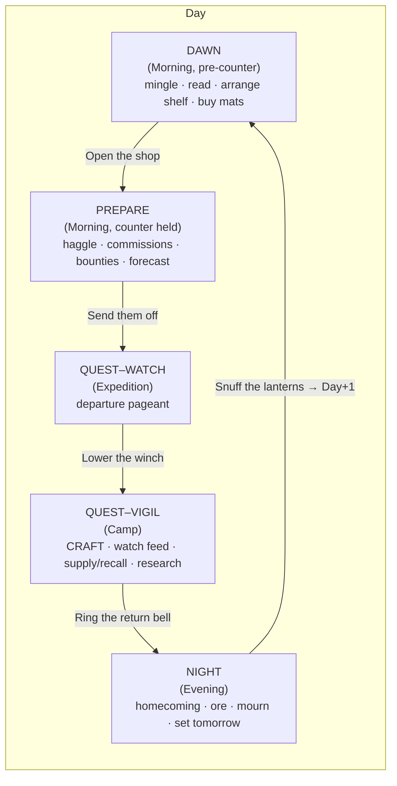
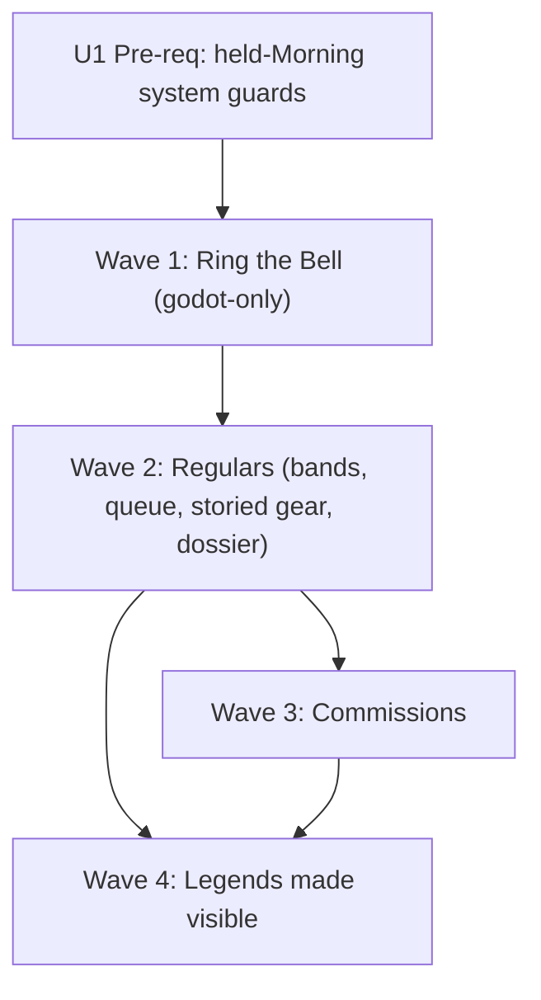

# feat: Player-decided phases + hero interactivity arc

**Summary.** Replace the timed auto-advancing "living clock" with **player-decided phase advancement** ("Ring the Bell"), then deepen the game from a menu into a set of legible, rewarding daily beats: heroes become people you *read and serve* (relationship bands, storied gear, commissions), the Quest window becomes a craft-while-you-watch beat, and permadeath becomes the game's emotional core (farewell rites, named artifacts, heirlooms). Delivered as a pre-req fix + four independently shippable waves, each behind the existing green gates (fast lane, balance, engine, golden-replay).

**Core enabling fact:** the sim never had a clock. `godot/scripts/PhaseClock.cs` is 100% adapter-side (its own doc: "the sim never reads a wall clock"), and `GameKernel.Tick` already *is* "end this phase" — `PhaseClock.AdvanceNow()` already exists and is the same code path auto-advance uses. So player-decided phases is mostly a **deletion** (stop ticking on a timer; tick on a button). Wave 1 touches only `godot/`, with zero sim diff and zero golden-replay risk.

**Product Contract preservation:** N/A — solo plan (`ce-plan-bootstrap`), no upstream requirements doc. Source material: three in-conversation Fable brainstorm lanes (phase-loop redesign, hero depth/views/choices, comparable-games research), each grounded in the cited files below.

---

## Problem Frame

Today the day auto-advances on a wall-clock timer through five kernel phases (`Morning → Expedition → Camp → ExpeditionDeep → Evening`). The user's verdict: the timed clock "isn't working out," and the moment-to-moment gameplay is "pretty lacking" — each phase needs a clear purpose, player agency, and a reward. The user's target loop:

- **Dawn** — heroes mingle; the player does what they want.
- **Prepare** — heroes interact with the player and prep for their quest.
- **Quest** — heroes depart; the player watches their travels *and* does the bulk of activity (gather/craft/research).
- **Night** — heroes return and mingle; the player decides their actions.

Alongside the loop, the user wants heroes to have deeper logic, more views, and more meaningful player choices — drawing on already-approved Erenshor mechanics and comparable games (Recettear/Moonlighter shopkeeping, Majesty incentive-not-command, Loop Hero split-attention, Spiritfarer farewell, Dwarf Fortress named artifacts, Wildermyth heirlooms).

**Non-negotiable spine:** "your craft writes the legends." Every system below must terminate in that story.

---

## Requirements

- **R1 — Player-decided pacing.** The day advances only when the player rings the phase's end-bell; no wall-clock auto-advance by default. The old timed flow survives as an opt-in ("Innkeeper's Clock").
- **R2 — Purposeful phases.** The player's four-phase loop (Dawn / Prepare / Quest / Night) is presented over the existing five kernel phases without touching the save-frozen `DayPhase` enum or `GameKernel.Advance` order.
- **R3 — Each phase rewards.** Every phase gives the player a verb and a legible payoff (gold, mood, forecast knowledge, craft output, legend beats).
- **R4 — Heroes as people.** Heroes carry visible depth (relationship to the player, storied gear, quirks, goals) surfaced in improved views — without a per-hero needs/schedule simulation.
- **R5 — Meaningful hero-facing choices.** The player makes consequential choices about heroes (serve order, commissions, gifts, mourning) whose outcomes feed the spine.
- **R6 — Legend lifecycle.** Crafted gear accrues deeds, and hero death produces durable legend artifacts (memorial rites, named works, heirlooms).
- **R7 — Determinism preserved.** All sim changes keep golden-replay and the balance gate green; deliberate re-baselines are documented; RNG/event order changes are batched and gated.
- **R8 — Correctness under held mornings.** Once-per-Morning economy systems fire exactly once per calendar Morning even when a counter session holds the day at Morning across many ticks.

---

## Key Technical Decisions

- **KTD1 — Player pacing = presentation deletion, not a sim feature.** Flip `PhaseClock.AutoAdvance` default to `false`; keep `AdvanceNow()` as the one advance path. The sim is unchanged. Rationale: `GameKernel.Tick` is already the phase-end primitive; the timer is the only thing being removed.
- **KTD2 — Four player phases map onto five kernel phases as pure banners.** Dawn = Morning (pre-counter), Prepare = Morning (counter held), Quest–Watch = Expedition, Quest–Vigil = Camp (the long forge/watch/decide beat), Night = Evening. **Never touch the `DayPhase` enum or the `Advance` switch** (save-frozen, `GameKernel.cs`; Camp=3/ExpeditionDeep=4 appended for compat). The `Expedition→Camp` seam is reused as the natural Watch→Vigil split — the Camp window (staged-resolution) is the best drama in the game and is kept as its own beat.
- **KTD3 — "Watching a quest" is a retelling of only what already exists at that tick.** Staged resolution means a party's OWN combat is resolved in stages: a clean stage-1 parks the party into `InFlight` with a `PartyCampReport` that carries **only HP/heals-left** (no combat/attribution — see `Contracts/Events.cs` `PartyCampReport` doc); the camping party's stage-2 combat, `AttributionBeat`s, and deaths are produced at the **ExpeditionDeep** tick (which runs *after* Camp/Vigil) and surfaced at the **Evening** reveal (`ExpeditionRevealSystem`). Therefore the **Quest–Vigil (Camp)** feed may pace out ONLY: (a) the camping party's HP/heals-left, and (b) *other* already-fully-resolved parties in `GameState.PendingExpeditions` — unstaged or stage-1-bad-ending runs from **this same day's** Expedition tick only (`ExpeditionRevealSystem` clears `PendingExpeditions` to empty every Evening, so there is never a multi-day backlog). **Attribution popups ("your blade turns the killing blow") belong to the Night/Evening beat, where those beats actually exist — not the Vigil.** Death/gold application stays at the Evening tick. This keeps the KTD5 reveal philosophy intact without inventing data a tick early.
- **KTD4 — All hero depth terminates in commerce, prose, or price — never orders (PKD7).** *PKD7 (project kernel decision): heroes are **influenced, never commanded** — the player is a blacksmith, not a guildmaster; established in `sim/GameSim/Contracts/Heroes.cs` (the `MoodPermille` doc) and pinned by the muster byte-match property test.* `Hero.MoodPermille` and any new depth signal must not touch party formation, floor choice, or expedition resolution (`Contracts/Heroes.cs`, pinned by the muster byte-match property test). Legal expression: shopping verdicts, counter-queue order, willingness/price per-mille, gossip prose, bounties, supplies, recall.
- **KTD5 — Derived-and-gated, not a second AI system.** Depth = derived projections (band from mood+purchases, goals from records), small verdict gates (sentimental gear), and seed-derived quirks (the `VoiceProfile` hash trick) — never a per-hero needs/schedule tick. "Second-AI-system creep" is a named risk in `ShoppingAi.cs`; any proposal requiring a per-hero decision loop is cut.
- **KTD6 — Contracts changes are append-only micro-PRs; new state is trailing-optional.** New actions/events touch deny-listed `Contracts/Actions.cs`/`Events.cs` (JsonDerivedType registries) — orchestrator-authored, merged before dependents. New `GameState` fields are trailing `init` members defaulting to empty/null, per the `InFlight`/`Venues`/`Counter` save-compat precedent (`Contracts/World.cs`).
- **KTD7 — Batch economy-moving changes into single balance re-tune waves.** Every willingness/verdict/price change moves the 100-day economy; land each wave's demand-side changes together, run the balance gate once, re-tune constants deliberately. Do not drip.

---

## High-Level Technical Design

**Player loop over the kernel (KTD2):**

**Wave dependency:**

Each wave ships behind green gates and is independently playable. Wave 1 is the user's core ask and the safest; Waves 2–4 layer depth. Wave 4's "truthful Night" reveal-timing change is explicitly deferred to the roadmap's Phase-C hardening window (a deliberate golden re-baseline).

The wave arrows are **shipping-order preferences, not hard code-blocks.** Per the units' own `Dependencies`: Wave 2's first unit (U7) needs only the pre-req U1 (not any Wave 1 unit), and Wave 4's U16 needs only U4 — Wave 1 is godot-only and Wave 2 is sim-only, so no code conflict forces strict serialization. **Playtest checkpoint (gates Wave 2):** Wave 2 work does not start until Wave 1 has been played and the user confirms the player-decided pacing actually addresses the "pretty lacking" feel. The freshness gate proves the build is current — it is NOT authorization to commit the speculative Wave 2–4 depth systems (three balance re-tunes, five panels, new contracts) before the core pacing hypothesis is validated by play.

---

## Scope Boundaries

**In scope:** the pre-req correctness fix (U1); Wave 1 player-decided pacing + phase presentation; Wave 2 relationship bands + Regulars queue + storied-gear gate + hero dossier; Wave 3 commissions; Wave 4 watch-layer popups + retreat interrupt + farewell rite + named artifacts + heirloom reforge + Legends Wall.

### Deferred to Follow-Up Work
- **Truthful Night** (moving death reveal from the Evening tick to a Deep-phase system so the fallen are sim-dead at Night start) — an RNG/event-order change requiring a documented golden re-baseline; belongs to the roadmap Phase-C hardening batch (`docs/plans/2026-07-21-003-phased-roadmap.md` §2C).
- **Rivalry / friendship between heroes** (Erenshor M5) — highest drama ceiling, crosses the most systems (relationship-state contract, two-hero flavor slots, PartyFormation friction → determinism + balance ripple). Its own plan; Waves 2–4 give it something to be about.
- **A "gather resources" verb** — a genuinely new sim system with its own slot cost; the Quest–Vigil is already full with craft + camp decisions. Research = talent study, already legal, needs no new verb.
- **Gift / discount gear to a hero** (R5's "gifts" choice) — a small player-sacrifice → goodwill verb. The core R5 hero-choices are covered by serve order (U8), commissions (U12–U15), and mourning (U18), so gifting is **deferred, not cut**; revisit after Wave 2's relationship bands land, since a gift is most meaningful as a band-accelerator.

**Out of scope (non-goals):** commanding heroes directly (violates PKD7); per-hero needs/mood/schedule simulation (KTD5); any change to the `DayPhase` enum or kernel phase order.

---

## Implementation Units

### Pre-req

#### U1. Guard once-per-Morning systems against held counter ticks
**Goal:** Economy/drama systems that must fire once per calendar Morning fire exactly once even when a counter session holds the day at Morning across many ticks (R8). Player-decided pacing makes long held mornings the norm, so this must land before Wave 1.
**Requirements:** R8, R7.
**Dependencies:** none.
**Files:** `sim/GameSim/Economy/RentSystem.cs`, `sim/GameSim/Drama/RecruitSystem.cs`, `sim/GameSim/Drama/GossipSystem.cs` (or wherever gossip's Morning emission lives), `sim/GameSim/Factions/FactionDriftSystem.cs`, `sim/GameSim/Economy/RivalRestockSystem.cs`, `sim/GameSim/GameComposition.cs` (Morning-group ordering — a shared composition root; coordinate the edit, though only `sim/GameSim/Contracts/` is on the formal deny-list); tests `sim/GameSim.Tests/Economy/RentHeldMorningTests.cs` (+ per-system as needed).
**Approach:** Confirmed live: `GameKernel.Tick` step 2 runs every Morning-phase system on every Morning tick, and an open counter (`Counter is { Closed: false }`) holds the day at Morning (`GameKernel.Advance`), so these systems re-run per counter step. `HeroShoppingSystem` already guards with an early return `if (state.Counter is { Closed: false }) return state;`. Add the identical guard to each once-per-Morning system (RentSystem confirmed unguarded — decrements `DaysUntilDue` every tick).

**Ordering hazard (must solve, not just copy the guard):** the guard is only correct if `Counter.Closed` is already `true` by the time the guarded system runs on the closing tick. That holds for an explicit `CloseCounterAction` (applied in step 1, before systems). It does NOT hold for the **natural queue-exhaustion** close: the session closes from *inside* `CounterQueueSystem.Process` (step 2), and per `GameComposition.cs` the Morning group currently runs `RentSystem`/`RivalRestockSystem`/`RecruitSystem`/`GossipSystem` BEFORE `CounterQueueSystem` — so on the exhaustion tick they see stale `Closed: false`, skip, and then `Advance` leaves Morning with no later Morning tick to catch up → those systems silently skip the whole day (a worse bug than the one being fixed). **Fix:** reorder `CounterQueueSystem` to run **immediately after `FactionDriftSystem` (second in the Morning group)** — NOT first. `FactionDriftSystem` carries a documented pinned-first contract, and `CounterQueueSystem` reads no faction `Standing` (verified), so second is both correct and safe; it still runs before Rent/DestitutionRecovery/RivalRestock/Recruit/Gossip, so both close paths set `Closed: true` before the guarded systems run. Verify golden-safety: `CounterQueueSystem` is a no-op when `Counter` is null and BaselinePlayer never opens a counter, so the reorder does not change the RNG draw order of any gated trace — confirm no RNG is drawn by `CounterQueueSystem` on the null-counter path before relying on this. Update `GameComposition`'s ordering comment to match.
**Execution note:** Start from TWO failing tests — (1) a multi-step held-counter Morning that currently burns multiple rent-days, and (2) a counter that closes by natural queue exhaustion where rent/recruit/gossip/restock currently skip the day entirely — then fix until each fires exactly once.
**Patterns to follow:** the `HeroShoppingSystem.cs` guard (`state.Counter is { Closed: false }`); the RNG-draw-order contract in `GameKernel.cs` step 2.
**Test scenarios:**
- Held counter Morning (N present-item/haggle steps, closed via `CloseCounterAction`): rent `DaysUntilDue` decrements by exactly 1 (not N).
- **Counter closed via natural queue exhaustion** (last customer gets a non-Buy verdict, no explicit close): rent/recruit/gossip/rival-restock each fire **exactly once** that day (regression that the current ordering would fail).
- Counter-free Morning: each system's effect is byte-identical to today.
- Recruit/gossip/faction-drift/rival-restock: each fires once across a held Morning (assert event count == 1 per system per Morning).
- **Golden-replay unchanged:** BaselinePlayer never opens the counter and `CounterQueueSystem` is a no-op without one, so `AtomicEquivalenceTests` + the golden trace are byte-identical — assert no SHA change even after the reorder.
**Verification:** Both held-Morning tests (explicit + exhaustion close) pass; fast lane + balance + golden all green with no re-baseline.

---

### Wave 1 — "Ring the Bell" (player-decided phases; `godot/` only)

#### U2. Default to player-decided advancement; keep timed mode opt-in
**Goal:** New campaigns never auto-advance on a timer; the old flow is an opt-in "Innkeeper's Clock" (R1).
**Requirements:** R1.
**Dependencies:** U1.
**Files:** `godot/scripts/PhaseClock.cs`, `godot/scripts/MainUi.cs`; tests `godot/tests/PhaseClockTests.cs` (or extend existing) — plain C#, no engine dep.
**Approach:** Flip `PhaseClock.AutoAdvance` default `true → false`. The persisted `ClockSettings` (`user://`) preference becomes opt-*in* auto ("Innkeeper's Clock") rather than opt-out manual; `MainUi._Ready`'s `SetAutoAdvance(...)` call inverts accordingly. `AdvanceNow()` (already always-available) is the sole advance path. The `Engaged` latch + speed controls stay for opt-in-auto users. **Also flip `MainUi.ClockSettings.Data.AutoAdvance`'s back-compat default `true → false`** so a settings blob missing the field (schema evolution) can never silently resurrect timed mode against R1 — the whole point of U2 is manual-by-default everywhere. (Caveat: a save that already persisted `AutoAdvance: true` under the old universal-timed default will still restore auto after this ships — acceptable one-time carry-over, toggled off in one click; only genuinely-new/field-missing loads get the manual default.)
**Patterns to follow:** existing `ClockSettings` persistence in `MainUi` (`SetAutoAdvance` before first frame); `PhaseClock.AdvanceNow`.
**Test scenarios:**
- Fresh campaign (no settings file): `AutoAdvance == false`; `Elapsed` accrual never triggers an advance.
- Opt-in auto persisted: `AutoAdvance == true` restored on load; timed advance still works.
- `AdvanceNow()` advances one phase regardless of `AutoAdvance` (both modes).
**Verification:** Captures/engine tests show a fresh game holds indefinitely until the bell; opt-in auto restores timed flow.

#### U3. The end-phase bell — contextual label + open-items readout
**Goal:** One universal end-phase verb, themed per phase, with a readout of what's still open instead of a countdown (R1, R3).
**Requirements:** R1, R3.
**Dependencies:** U2.
**Files:** `godot/scripts/MainUi.cs`; tests `godot/tests/RingBellHudTests.cs`.
**Approach:** Keep the existing advance button's **node name `"AdvancePhase"`** (gdUnit tests press it by name) but set its label per phase: Dawn "Open the shop", Prepare "Send them off", Watch "Lower the winch", Vigil "Ring the return bell", Night "Snuff the lanterns". Replace the countdown label (currently phase-timer text) with the phase name + an "open items" badge. The badge shows **one small icon per open-item TYPE** (slots / unread camp slate / queued customers) — not a single opaque count — each with a tooltip, so the player can tell *what* is still open at a glance. Idle glow after inactivity (nudge, not nag).
**Patterns to follow:** the existing HUD controls row + two-row header (`MainUi` `HudControls`); the slot-pip/rent chip build pattern.
**Test scenarios:**
- Bell label matches each phase (property-only, by node name).
- Open-items badge reflects `ActionSlotsRemaining` and an unread `PartyCampReport`.
- Badge with MULTIPLE signals active (slots + camp slate + queue) shows a distinct per-type icon for each, not a merged count.
- Pressing "AdvancePhase" still advances (existing tests stay green).
**Verification:** Screenshot per phase shows the right bell label + readout; existing HUD tests pass unchanged.

#### U4. Present the four player phases over the five kernel phases
**Goal:** The player sees Dawn / Prepare / Quest–Watch / Quest–Vigil / Night, not raw kernel phase names, and each banner carries a small payoff so no phase is a dead transition (R2, R3).
**Requirements:** R2, R3.
**Dependencies:** U3.
**Files:** `godot/scripts/MainUi.cs`, `godot/scripts/ui/DayTimeline.cs` (phase labels), possibly a small `godot/scripts/ui/PhasePresentation.cs` mapping helper; tests `godot/tests/PhasePresentationTests.cs`.
**Approach:** Pure presentation map from `DayPhase` → player-phase banner/label (Morning→Dawn or Prepare depending on counter-open sub-beat; Expedition→Quest–Watch; Camp→Quest–Vigil; ExpeditionDeep folds into Vigil's tail; Evening→Night). **Do not touch the enum or kernel.** The Prepare sub-beat is signalled by an open counter session (the existing counter-hold), not a new phase. **Quest–Watch payoff (R3):** the departure pageant is not reward-free — surface a one-line **departure omen** drawn from the already-computed muster/forecast prediction (`MusterPlan.Compute` / `RaidForecast`), e.g. "Sera marches for floor 3 carrying your blade." This is the Watch beat's legible payoff (forecast knowledge), presentation-only over data the sim already produced.
**Patterns to follow:** `DayTimeline.Refresh(phase, waiting)`; the phase-chip in the two-row header.
**Test scenarios:**
- Each `DayPhase` maps to the correct player-phase label; Morning maps to Dawn when no counter is open and Prepare when a counter session is open.
- Timeline highlights the active player phase.
**Verification:** Captures across a full day show the four-phase banners; no `DayPhase`/kernel change (diff is `godot/` only).

#### U5. Confirm-gates only on pending consequence
**Goal:** Ringing the bell never silently discards a live decision; it prompts only when something is genuinely mid-flight (R1, R3).
**Requirements:** R1, R3.
**Dependencies:** U3.
**Files:** `godot/scripts/MainUi.cs`; tests `godot/tests/RingBellHudTests.cs`.
**Approach:** One-click acknowledge (never a modal maze) when a genuine consequence is pending. Gate conditions:
1. A customer is mid-haggle (`CounterState.Round > 0`).
2. **An open counter session with an unserved queue** (`Counter` not null, `Closed == false`, `Round == 0`) — THE case that actually blocks the kernel: `GameKernel.Advance` holds the day at Morning whenever `Counter is { Closed: false }`, so ringing "Send them off" here would silently fail to advance. On confirm, issue `CloseCounterAction` *before* `AdvanceNow()` so the day always moves.
3. An unread `PartyCampReport` exists.
When more than one condition is true at once, present a **single combined** acknowledge (never sequential dialogs — that's the modal maze U5 forbids). Unspent action slots get a subtle badge on the bell, not a dialog.
**Patterns to follow:** existing toast/acknowledge affordances in `MainUi`; `CloseCounterAction` handling.
**Test scenarios:**
- Mid-haggle (`Round > 0`): ringing the bell first raises a one-click confirm; confirming advances.
- **Open counter, unserved queue, `Round == 0`:** ringing the bell raises the confirm, and confirming issues `CloseCounterAction` then advances (the day must not silently stay at Morning).
- Unread camp slate: confirm-gate fires once; acknowledging clears it.
- **Two conditions true simultaneously** (mid-haggle AND unread camp slate): exactly ONE combined acknowledge is shown, not two sequential ones.
- Nothing pending: bell advances immediately, no gate.
**Verification:** Engine tests cover each gate condition, the combined case, and the no-gate path; the day always advances after acknowledge.

#### U6. (Optional) Retune the daily action-slot budget for player pacing
**Goal:** Longer player-paced days don't feel slot-starved (R3).
**Requirements:** R3.
**Dependencies:** U2.
**Files:** `sim/GameSim/Contracts/ActionBudget.cs`.
**Approach:** `SlotsPerDay` (currently 5) is day-count-keyed, so pacing can't be gamed; a longer day may want more slots. One-constant change → rerun the balance gate; keep only if it doesn't destabilize the 100-day economy.
**Execution note:** Ship only if playtest shows slot starvation; treat as a balance-gate rerun, not design.
**Test scenarios:** `Test expectation: none — constant tuning; covered by the existing balance gate.`
**Verification:** Balance gate green at the chosen value; documented in the PR.

---

### Wave 2 — "Regulars" (hero depth; sim + 1 balance re-tune + 1 contracts micro-PR)

#### U7. Relationship bands (Stranger / Regular / Patron / Sworn)
**Goal:** Each hero has a visible standing with the player, derived from existing state (R4).
**Requirements:** R4, R7.
**Dependencies:** U1.
**Files:** `sim/GameSim/Contracts/Heroes.cs` (a derived accessor or cached `LifetimePurchases int` trailing-init field), `sim/GameSim/Drama/` (a `RelationshipShifted`-style threshold-crossing event — contracts micro-PR), `sim/GameSim.Tests/Heroes/RelationshipBandTests.cs`.
**Approach:** Band = function of `Hero.MoodPermille` + count of `ItemSold { FromPlayerShop: true }` for that buyer (EventLog scan, or a cached int if the 100-day batch slows). Use the faction-Standing hysteresis + threshold-crossing-event pattern so bands don't flicker. **Bands must not feed muster or expedition** (KTD4) — derived-only for v1.
**Patterns to follow:** faction `Standing`/`FactionStandingShifted` hysteresis; trailing-optional init fields (`World.cs` `InFlight`/`Venues`).
**Test scenarios:**
- Purchase count + mood crossing a threshold raises the band once (hysteresis: small dips don't demote).
- A band shift emits exactly one crossing event.
- Bands are pure of muster: same seed, same parties/floors with and without band state (byte-match).
- Golden: if derived-only with no new persisted field, assert no golden change; if a cached field is added, document the re-baseline.
**Verification:** Band tests pass; muster byte-match holds; balance green.

#### U8. Regulars are served first at the counter
**Goal:** Higher-band heroes reach the counter head first — a legible reward for loyalty (R3, R5).
**Requirements:** R3, R5, R7.
**Dependencies:** U7.
**Files:** `sim/GameSim/Counter/CounterHandlers.cs` (`ApplyOpen` — the actual queue *construction* site: it builds `state.Heroes.Values.Where(Alive).OrderBy(Id)` and calls `CounterQueueSystem.PromoteActive`), `sim/GameSim.Tests/Counter/CounterQueueOrderTests.cs`.
**Approach:** In `CounterHandlers.ApplyOpen`, order the initial queue by band descending, tie-break by the existing deterministic `HeroId` order (`CounterQueueSystem` only pops/promotes the head — it never constructs the queue, so only `ApplyOpen`'s ordering changes). **Verify the queue is NOT a muster input** (PKD7): `MusterSystem` has no read of `Counter` — confirm this holds so counter-session state never flows back into party formation.
**Execution note:** Confirm no muster read of the queue before changing order.
**Test scenarios:**
- Two heroes, higher band served first; equal band falls back to `HeroId` order (deterministic).
- Queue order does not alter which parties muster or which floors they target (byte-match).
- Golden: BaselinePlayer never opens the counter → no golden change (assert).
**Verification:** Order tests pass; muster/golden unchanged.

#### U9. Storied-gear sentimental gate
**Goal:** A hero won't lightly part with gear that has saved their life — the player's old work gains gravity (R4, R6).
**Requirements:** R4, R6, R7.
**Dependencies:** U1.
**Files:** `sim/GameSim/Heroes/ShoppingAi.cs` (new module-side `PassReasonKind.Sentimental`), `sim/GameSim.Tests/Heroes/ShoppingAiTests.cs`.
**Approach:** In `EvaluateItem`, if the currently-worn item in the candidate's slot has `ItemMemory.Kills + Saves >= N`, require a larger gear-score gain to displace it, with a named prose reason ("won't part with Emberfang — it's saved her twice"). `PassReasonKind` is module-side (not deny-listed) — same trick U9's veteran gate used. Tunable threshold N.
**Patterns to follow:** the existing veteran quality gate + `PassReasonKind` additions in `ShoppingAi.cs`.
**Test scenarios:**
- Worn item with `Kills+Saves >= N`: a marginal upgrade PASSES with `Sentimental` reason; a large upgrade still BUYS.
- Worn item below the threshold: normal gear-score rules (regression).
- Reason string names the item and the deed count.
- Balance: batch with U7/U8's demand-side changes; one balance re-tune; document any golden shift.
**Verification:** Sentimental tests pass; balance green.

#### U10. Hero dossier upgrade
**Goal:** The `HeroesPanel` detail pane makes a hero read like a person (R4).
**Requirements:** R4.
**Dependencies:** U7, U9.
**Files:** `godot/scripts/panels/HeroesPanel.cs`; tests `godot/tests/HeroesPanelTests.cs` (extend).
**Approach:** Add to the existing detail pane: relationship band + a mood dial (render `MoodPermille` as a face/flame, not a raw number), a quirk line, a goal line (derived — see below), a storied-gear callout, and the last few EventLog entries filtered to this hero. Quirks/goals are seed-derived projections (KTD5) — v1 can show band + mood + storied gear; quirk/goal lines land as derivations become available.
**Patterns to follow:** the existing `HeroesPanel` gear + `MarkTally` + memories layout; `ProvenanceCard` render idiom.
**Test scenarios:**
- Dossier shows the hero's band and a mood indicator bound to `MoodPermille`.
- Storied-gear callout appears for a hero wearing a high-deed item.
- Hero-filtered event history shows only that hero's events.
- **Fresh-recruit / no-history state:** a Stranger-band hero with no storied gear and no events renders cleanly — band shown, mood dial neutral, no storied-gear callout, an empty-history placeholder — not a broken/blank pane.
**Verification:** Capture of a dossier (populated AND fresh-recruit) shows band/mood/storied-gear correctly; panel tests green.

#### U11. Band-crossing gossip line
**Goal:** Reaching a new band is spoken about in the tavern (R3, R6).
**Requirements:** R3, R6, R7.
**Dependencies:** U7.
**Files:** the FlavorForge pool + gossip emission (per `docs/design/2026-07-19-flavorforge-erenshor-recommendations.md` ceremony); Tavern golden pins.
**Approach:** One new base gossip key for a band promotion ("the smith always keeps the good steel for Sera"), authored via the FlavorForge new-key ceremony; re-pin the Tavern goldens. Keep pools ≥ the authored floor to avoid repetition.
**Test scenarios:**
- A band promotion emits a gossip line drawn from the new key.
- Tavern golden re-pinned deliberately (documented).
**Verification:** Gossip test + Tavern goldens green.

---

### Wave 3 — "Commissions" (the best new verb; sim + contracts micro-PR + balance)

#### U12. Commission contract types (micro-PR)
**Goal:** The data shape for heroes requesting gear (R5).
**Requirements:** R5, R6.
**Dependencies:** U7.
**Files:** `sim/GameSim/Contracts/World.cs` (trailing `ImmutableList<Commission> Commissions` init field), `sim/GameSim/Contracts/Events.cs` (`CommissionPosted`, `CommissionFulfilled`, `CommissionExpired`), `sim/GameSim/Contracts/Actions.cs` (`AcceptCommissionAction`, `DeclineCommissionAction`).
**Approach:** Orchestrator-authored append-only micro-PR, merged before U13–U15. `Commission(HeroId, ItemSlot, MinQuality, DeadlineDay, PremiumGold)`. New `GameState` field is trailing-optional (empty default) per save-compat precedent. Register new JsonDerivedTypes append-only.
**Test scenarios:**
- Save round-trip: a pre-commission save loads with `Commissions` empty (byte-compat).
- New events/actions serialize/deserialize via the derived-type registry.
**Verification:** Contract tests + save-compat green; merged before dependents.

#### U13. Commission-posting Morning system
**Goal:** Banded heroes with a gear gap ask the player to forge for them (R5).
**Requirements:** R5, R7.
**Dependencies:** U12.
**Files:** `sim/GameSim/Heroes/CommissionSystem.cs` (new Morning `IPhaseSystem`), registered in `GameComposition`; `sim/GameSim.Tests/Heroes/CommissionSystemTests.cs`.
**Approach (widened — 2026-07-24 walkthrough choice):** ANY hero with an empty/sub-par gear slot may post a commission (NOT gated on relationship band), and they post more frequently than the original banded-only design. Emit `CommissionPosted(Hero, Slot, MinQuality, DeadlineDay, PremiumGold)`; MinQuality/premium still scale by band + tomorrow's target floor (`MusterPlan.Compute`). Must carry the held-Morning guard from U1 (fire once per Morning). **Balance impact is LARGER** than the banded-only design (more guaranteed-premium sales) — expect a heavier balance re-tune; cap concurrent open commissions so the board and the economy don't flood. **Gear-gap source:** `RaidForecast.MissingSlots` is `private` and returns party-level *display strings* (`ForecastParty.GearGaps`), not the per-hero/per-slot `ItemSlot` data this needs — so first expose a shared public query (e.g. `RaidForecast.MissingItemSlots(GearSet) → IReadOnlyList<ItemSlot>`) and have both `ForTomorrow` and `CommissionSystem` call it. That refactor is part of this unit, not an assumed-existing hook.
**Patterns to follow:** the bounty posted→judged→paid shape, in reverse (heroes post, player accepts); `RaidForecast.MissingSlots`.
**Test scenarios:**
- A banded hero with an empty weapon slot marching to floor 3 gets a `CommissionPosted` with a sane MinQuality/deadline/premium.
- A Stranger, or a fully-kitted hero, gets none.
- Held Morning: emitted once, not per counter step.
- Determinism: same seed → same commissions (byte-match).
**Verification:** Commission-system tests + golden (documented if changed) green.

#### U14. Accept / decline + fulfillment resolution
**Goal:** The player accepts a commission and fulfilling it by deadline pays off; missing it stings (R5, R6).
**Requirements:** R5, R6, R7.
**Dependencies:** U12, U13.
**Files:** `sim/GameSim/Heroes/CommissionHandlers.cs` (accept/decline handlers) + fulfillment check in the sale/shopping path; `sim/GameSim.Tests/Heroes/CommissionFulfillmentTests.cs`.
**Approach:** Accept locks the request; a matching craft on the shelf by the deadline = guaranteed sale at list + premium, a mood bonus, and a `CommissionFulfilled` attribution beat. Miss = `CommissionExpired`, mood hit, and a gossip line. Premium gold is a new income channel → **balance re-tune expected** (KTD7).
**Test scenarios:**
- Accept + deliver matching slot/quality by deadline → guaranteed sale at list+premium, mood up, fulfillment beat.
- Accept + miss deadline → expiry event, mood down, gossip.
- Decline → no obligation; hero shops normally.
- Balance gate rerun with premium income; document any golden shift.
**Verification:** Fulfillment tests + balance green.

#### U15. Commission board view
**Goal:** The player sees and acts on open commissions (R5).
**Requirements:** R5.
**Dependencies:** U14.
**Files:** `godot/scripts/panels/CommissionBoard.cs` (new, `RaidForecastBoard` idiom), wired from `MainUi` (a Prepare-phase surface) + the muster/forecast board; `godot/tests/CommissionBoardTests.cs`.
**Approach:** Code-built modal (ProvenanceCard/RaidForecastBoard idiom, headless-safe): per open request — portrait, wanted slot + min quality, deadline, premium, accept/decline buttons; a fulfilled/missed history strip. Optionally surface commission badges on the forecast board ("your Fine shield rides with this party").
**Patterns to follow:** `RaidForecastBoard`/`BestiaryPanel` code-built modal pattern; MainUi modal latch (pause/resume).
**Test scenarios:**
- Board lists open commissions matching sim state; accept/decline buttons fire the actions.
- **Empty state:** with no open commissions, the board renders explanatory copy ("No one's asking for anything right now"), not a blank list.
- Fulfilled/missed history renders.
- Modal engages the clock latch like the Ledger/Forecast.
**Verification:** Capture shows the board; tests green.

---

### Wave 4 — "Legends made visible" (mixed; some deferred to Phase-C)

**Sequencing within Wave 4 (2026-07-24 walkthrough priority):** build in this order — (1) **Named artifacts** (U19), (2) **Watch layer + retreat interrupt** (U16/U17), (3) **Legends Wall + heirlooms + kin recruit** (U21/U20/U22); **farewell rite (U18) last**. (The units keep their U-IDs; only the build order is prioritized.)

#### U16. Split-attention Quest–Vigil watch layer
**Goal:** During the Vigil the player crafts while a live-status feed retells what is actually known at that tick; the gear-spotlight/attribution payoff lands at Night when the beats exist (R3, R6, KTD3).
**Requirements:** R3, R6.
**Dependencies:** Wave 1 (U4). Attribution popups depend on the Night homecoming surface (see below), not the Vigil.
**Files:** `godot/scripts/panels/ScryingMirror.cs` (extend the journey feed) or a new Vigil view; the Night homecoming surface for attribution popups; `godot/tests/` coverage.
**Approach (corrected per KTD3):** The Vigil (Camp) feed paces out ONLY data that exists at the Camp tick: the camping party's HP/heals-left (`PartyCampReport`) and *other* already-resolved parties in `PendingExpeditions`. **Do NOT** attempt to show the camping party's own kills/attribution during the Vigil — that data isn't generated until the ExpeditionDeep tick (after Camp) and isn't surfaced until Evening. Move the attribution popups ("*your* blade turns the killing blow" — from `AttributionEngine` via `AttributionBeatEvent`) and the watched-hero's player-crafted-item spotlight (click → `ProvenanceCard`) to the **Night homecoming beat**, where the beats actually exist. **Surface (decide during impl):** extend `godot/scripts/panels/MineWatch.cs` (already renders `AttributionBeatEvent`) or `godot/scripts/ui/AdventureTicker.cs` (already handles the Evening-tick `HeroDied` reveal) rather than inventing a new panel — pick whichever already owns the homecoming render. Presentation-only; no sim change.
**Execution note:** Verify against `ExpeditionDeepSystem`/`ExpeditionRevealSystem` that no camping-party attribution exists at Camp before building the feed; build the HP-pacing feed first, the Night attribution spotlight second.
**Test scenarios:**
- Vigil feed renders the camping party's HP/heals-left and any already-resolved parties — and does NOT reference the camping party's kills/deaths (which don't exist yet).
- Night homecoming popups cite the correct item/hero from `AttributionBeatEvent`; clicking a watched item opens its provenance.
- No sim/RNG effect (presentation-only; byte-match).
**Verification:** Capture of the Vigil status feed + the Night attribution spotlight; tests green.

#### U17. The "signal retreat" interrupt
**Goal:** One scarce, meaningful interrupt during the Vigil (R5).
**Requirements:** R5, R7.
**Dependencies:** U16; reuses the existing Camp `RecallPartyAction`/`SendSupplyAction`.
**Files:** `godot/scripts/` (the interrupt affordance) wired to the existing Camp-only recall/supply handlers; tests as applicable.
**Approach:** Surface the existing Camp verbs (`RecallPartyAction`/`SendSupplyAction`) as a dramatic "ring the anvil / lower the winch" interrupt when a party hits a flee-threshold in the feed. No new sim rule — it's a UI framing of legal Camp actions.
**Test scenarios:**
- Interrupt triggers the existing recall/supply action; illegal outside Camp.
- Confirm the action routes through the existing handler unchanged.
**Verification:** Engine test drives the interrupt → recall; sim path unchanged.

#### U18. The farewell rite
**Goal:** A hero's death produces an earned goodbye, not just an economy event (R6).
**Requirements:** R6, R7.
**Dependencies:** Wave 2 (bands make the loss land).
**Files:** `sim/GameSim/Drama/` (a Night-legal reforge of a fallen hero's `WornGear` into a grave-marker that closes their legend/memorial entry — `HeroDied.WornGear` already rides the event, currently unused), a new action if needed (contracts micro-PR), `godot/scripts/` memorial surface; tests.
**Approach:** At Night, offer to reforge a shard of the fallen's worn gear into a marker that pins their `DramaState.Memorials` legend entry closed. Phase-A can be a small gold-sink ritual + prose with no contracts change (a `ToastMemorial`-style Evening action); the reforge-into-item variant is a contracts micro-PR.
**Test scenarios:**
- A memorial exists after a `HeroDied`; the rite marks it honored once (idempotent).
- Rite is Evening-legal only; deterministic.
**Verification:** Tests + (if reforge) balance/golden documented.

#### U19. Named artifacts ("Signed Works")
**Goal:** Rare crafts become named items whose inscription accrues deeds — the spine, literal (R6).
**Requirements:** R6, R7.
**Dependencies:** U12-era contracts patterns; `AttributionEngine`.
**Files:** `sim/GameSim/` crafting + a `Signed`/name field on `Item` (trailing-optional, contracts micro-PR), attribution append path; tests.
**Approach:** On a rare deterministic proc (e.g., a Masterwork streak / spent insight), a craft becomes a Signed Work with a seed-derived name; every attribution beat it participates in appends to its inscription (via the existing `AttributionEngine` records). Deterministic; new state trailing-optional.
**Test scenarios:**
- The proc is deterministic (same seed/inputs → same signing).
- A signed item's inscription grows on each attribution beat.
- Save-compat: pre-feature items load unsigned.
**Verification:** Tests + golden re-baseline documented (new craft-side state).

#### U20. Heirloom reforge
**Goal:** The dead persist as inheritance — reforging a fallen hero's gear carries their legend forward (R6).
**Requirements:** R6, R7.
**Dependencies:** U18, U19.
**Files:** `sim/GameSim/` crafting/reforge path (heirloom stock from `HeroDied.WornGear`); tests.
**Approach:** A dead hero's worn gear can return to the forge as heirloom stock; reforging transfers a legend-line to the new item ("forged from the blade of Sera Deepfall"). *(The "kin-of-the-dead" rookie-opinion idea this unit once bundled is split out as U22 — it touches hero recruitment/generation and needs its own files + tests, so it is no longer part of the heirloom-reforge unit.)*
**Test scenarios:**
- Reforging heirloom stock carries the legend-line onto the new item.
- Deterministic; save-compat.
**Verification:** Tests + balance/golden documented.

#### U21. Legends Wall view
**Goal:** A single monument to the spine — memorials, records, storied items (R6).
**Requirements:** R6.
**Dependencies:** U18-U20 (content to show); works with existing `DramaState`.
**Files:** `godot/scripts/panels/LegendsWall.cs` (new, code-built modal), wired from town/tavern; `godot/tests/LegendsWallTests.cs`.
**Approach:** Render `DramaState.Memorials` (name, day, gear named), the depths records, and per-item legend entries (items with N+ attribution beats), each row opening `ProvenanceCard`. Panel-first; a 3D town-square mount can follow. **Empty/first-play state (required):** a new campaign has zero memorials/records for many days, so define an invitational placeholder (e.g. "No legends yet — the Mine hasn't claimed anyone; your work is about to change that") rather than a blank wall.
**Test scenarios:**
- Wall lists memorials + records + storied items from sim state.
- A row opens the item's provenance.
- **Empty state:** with no memorials/records/storied items, the wall renders the invitational placeholder, not a blank panel.
**Verification:** Capture of the wall; tests green.

#### U22. Kin-of-the-dead recruit opinion
**Goal:** New heroes can arrive already caring about the smith — pre-seeded with an opinion when they're kin/admirers of a famous fallen hero, closing the legend lifecycle back to the start (R4, R6).
**Requirements:** R4, R6, R7.
**Dependencies:** U7 (relationship bands / `MoodPermille` seeding), U18/U19 (a "famous dead" to admire).
**Files:** `sim/GameSim/Drama/RecruitSystem.cs` (hero generation — seed the recruit's starting `MoodPermille`/band from a dead hero's fame/legend record); `sim/GameSim.Tests/Drama/RecruitOpinionSeedTests.cs`.
**Approach:** When a recruit is generated and a qualifying famous-dead legend exists (e.g. a memorial with N+ attribution beats, or a high-fame `Signed Work` bearer), deterministically seed the recruit's starting opinion above neutral with a prose hook ("came to town because they heard what your steel did for Sera"). Pure derivation from existing legend/memorial records — no per-hero tick (KTD5), no order-of-heroes influence on muster (PKD7).
**Test scenarios:**
- A recruit generated with a qualifying famous-dead record starts above neutral opinion; one without starts neutral.
- Deterministic (same seed/records → same starting opinion) and save-compatible (pre-feature saves seed neutral).
- Seeding does not alter party formation or floor choice (PKD7 byte-match).
**Verification:** Recruit-opinion tests + golden/balance documented.

---

### Wave 5 — "Tactile forge" (pulled in from deferred, 2026-07-24 walkthrough)

#### U23. Tactile process-crafting (the smith's chart)
**Goal:** Forging becomes a hands-on navigation of a "smith's chart" (heat/hammer/fold/quench steer toward property zones) instead of a timing-bar minigame — the Potion-Craft craft-feel bet, and the activity that fills the Quest–Vigil (R3, craft-feel).
**Requirements:** R3.
**Dependencies:** **Sequence AFTER Wave 4's watch layer (U16)** — its own risk note: prototype only once the split-attention Vigil concept is proven, since this is the LARGEST new interaction surface in the arc. Also depends on the existing forge minigame it replaces (`godot/scripts/minigames/ForgeMinigame.cs`).
**Files:** `godot/scripts/minigames/` (new chart-based forge surface; likely retire/replace the current `ForgeMinigame`), the sim craft-quality path (`sim/GameSim/Crafting/`) if the quality derivation changes; tests both sides.
**Approach:** Each smith action (heat, hammer, fold, quench) is a **discrete recorded input** (sim-legal, no wall-clock, no RNG outside the kernel) that moves a position across a hidden property chart toward zones (edge / balance / ward); final quality = a pure function of the path, not a roll. This preserves determinism (same inputs → same quality) and sim purity. Keep the existing quality *grades* (Poor…Masterwork) as the output so downstream systems (veteran gate, willingness, commissions) are unaffected. **This is a large unit — likely warrants its own ce-plan/brainstorm pass before implementation** (flag for a scoping split when it comes up).
**Execution note:** Prototype the interaction in Godot first (feel), then wire the deterministic quality-from-path function into the sim; determinism/golden gates apply to the sim side.
**Test scenarios:**
- Same input path → same quality grade (deterministic; byte-match).
- Distinct paths → distinct property emphasis; extreme/degenerate paths still produce a valid grade (no crash, no out-of-range).
- Quality grades still map to the existing enum so veteran-gate/willingness/commission consumers are unchanged.
**Verification:** Craft-quality determinism tests + golden/balance re-baseline documented (quality distribution will shift); Godot feel verified by capture/playtest.

---

## Risks & Dependencies

- **PKD7 boundary pressure (highest).** Loyalty/commission systems tempt designs where a favored hero "fights harder" or picks floors — that breaks the influence-only rule and the muster byte-match test. Mitigation: every depth signal terminates in price/queue/verdict/prose; U8 counter-queue reorder is safe only because the queue is counter-session state, not muster input (verify in U8).
- **Balance-gate ripple.** U7/U8/U9 (bands, queue, sentimental) and U14 (commission premiums) move the 100-day economy. Mitigation (KTD7): batch each wave's demand-side changes, one balance re-tune per wave, deliberate documented re-baselines.
- **Golden-replay.** Wave 1 + U1 are golden-safe (godot-only / counter-path only, which BaselinePlayer never exercises). Wave 2+ that adds persisted fields or new RNG needs a documented re-baseline. Truthful-Night is deferred precisely because it's an RNG/event-order change.
- **Contracts ceremony.** U7's event, U12's commission types, U18/U19's item fields hit deny-listed `Actions.cs`/`Events.cs`/`World.cs` — orchestrator micro-PRs, append-only, trailing-optional, merged before dependents.
- **Gossip goldens.** New base keys (U11, U14, U18) each need the FlavorForge new-key ceremony + Tavern golden re-pins; budget per wave; thin pools risk repetition.
- **EventLog-derived stats** (U7 purchase count, U10 goals): O(log) scans per Morning are fine at hobby scale; cache as a plain int only if the 100-day batch farm slows (then cached-vs-derived divergence becomes a new invariant to test).
- **Scope-creep sentinel:** any proposal needing a per-hero decision tick (needs/schedules/wandering) is the second AI system — cut it (KTD5).

---

## Open Questions (deferred to implementation)

- Exact band thresholds (mood + purchase counts) and hysteresis margins — tune during U7 against real traces.
- Sentimental threshold N and the displacement-gain multiplier (U9) — tune with the balance re-tune.
- Commission premium curve + deadline window (U13/U14) — tune with the balance gate.
- Named-artifact proc condition (U19) — pick a deterministic, rare trigger during implementation.
- Whether U7 stays purely derived or adds a cached `LifetimePurchases` field — decide from the 100-day batch-farm timing (derived preferred; cache only if hot).
- The "craft-during-Vigil can reroll fate" nuance (crafting draws from the kernel RNG stream before stage-2 rolls): accept + flavor it ("the Mine hears your hammer") for now; a positionless craft-quality draw is a later contracts micro-PR if it matters.

---

## Sources & Research

- **In-conversation Fable brainstorm lanes (2026-07-24):** phase-loop redesign, hero depth/views/choices, comparable-games research — all grounded in the files cited below.
- **Grounding files (verified during planning):** `sim/GameSim/Kernel/GameKernel.cs` (held-Morning behavior + `Advance`), `sim/GameSim/Economy/RentSystem.cs` (confirmed unguarded), `sim/GameSim/Heroes/HeroShoppingSystem.cs` (the guard pattern), `godot/scripts/PhaseClock.cs` (`AutoAdvance=true` default, `AdvanceNow`, `ClockSettings`), `sim/GameSim/Counter/CounterQueueSystem.cs` (queue head/pop), `sim/GameSim/Contracts/Heroes.cs` (`Hero`, `MoodPermille`, `ItemMemory`), `sim/GameSim/Contracts/World.cs` (trailing-optional init precedent).
- **Design references:** `docs/design/2026-07-19-flavorforge-erenshor-recommendations.md` (M1–M5 borrow list + FlavorForge new-key ceremony), `docs/plans/2026-07-21-003-phased-roadmap.md` (Phase-C hardening window for the truthful-Night re-baseline).
- **Comparable games (adaptation mapped in the arc):** Moonlighter/Recettear (price-reaction shopkeeping, Wave 2–3), Majesty (incentivize-don't-command bounties, PKD7-aligned), Loop Hero (split-attention watch, U16), Spiritfarer (farewell rite, U18), Dwarf Fortress (named artifacts, U19), Wildermyth (heirlooms, U20), Potionomics (relationship-unlocks, informs bands). Sources: the respective Wikipedia/Steam pages gathered during research.

---

## Definition of Done

- **Pre-req (U1):** held-Morning systems fire once per calendar Morning; golden/balance byte-identical.
- **Wave 1:** a fresh campaign is fully player-paced (no timer), presents the four player phases, rings a contextual bell with confirm-gates, and the timed flow survives as opt-in. `godot/`-only diff; all gates green.
- **Wave 2:** heroes carry visible bands, Regulars are served first, storied gear resists sale, and the dossier shows band/mood/storied-gear. Balance re-tuned once; determinism preserved.
- **Wave 3:** heroes post commissions; the player accepts/declines and fulfilling pays a premium with an attribution beat; a commission board surfaces them. Balance re-tuned; determinism preserved.
- **Wave 4:** the Vigil is a craft-while-watching beat with attribution popups + a retreat interrupt; death produces a farewell rite; rare crafts become named works that accrue deeds; heirlooms carry legends forward; a Legends Wall shows it all. (Truthful-Night deferred to Phase-C.)
- Every wave: fast lane, balance, engine, and golden-replay gates green (deliberate re-baselines documented); features verified by screenshot capture where visual.

## Verification Contract

- **Fast lane:** `dotnet test sim/GameSim.Tests/GameSim.Tests.csproj --filter Category!=Balance`
- **Balance gate:** `dotnet test sim/GameSim.Tests/GameSim.Tests.csproj --filter Category=Balance`
- **Engine tests:** `dotnet test godot/tests --settings .runsettings`
- **Golden-replay:** the `AtomicEquivalenceTests` SHA + golden trace — assert unchanged unless a documented re-baseline is intended.
- **Visual:** `tools/shoot.ps1 -State <...>` captures read by a human/Claude for each visual unit.
- **Playtest:** `play.ps1` (freshness gate) after each wave lands on `main`.
