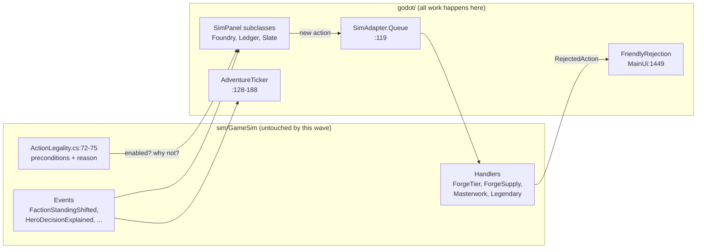
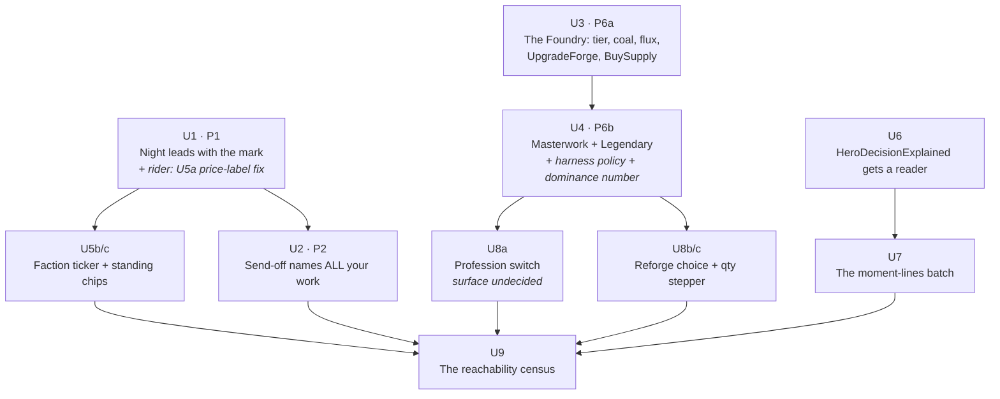

# The reachability wave

This is the subordinate execution document for the reachability wave — §11's **P1**, **P2**, and
**P6** (P6 now OPEN: the owner's instruction of 2026-08-07 *is* R2's ruling, "build") plus the
§10-qualified legibility riders — written against `docs/design/MAKERS-MARK.md` §11 per drift-defense
rule 4, **which §8 of this plan amends explicitly to name it, rather than assuming P7's carve-out
covers it.** It re-orders nothing, adds no sim system, moves no golden replay, touches no Contracts,
and every §11 status change it causes lands as a diff to §11 in the same PR as the work.

**One thing is not adapter-side, and it is named rather than smuggled:** U4's dominance measurement
needs a scripted harness policy that buys a sink, because none exists. See KTD1.

**What this document is not allowed to do.** Re-order P1–P9. Promote anything off the §11.5 cut
list. Touch `sim/GameSim/Contracts/` or anything requiring a golden re-baseline. Carry a competing
status ledger for P-items — its own unit checkboxes are fine, P-item status lives in §11. Displace
**P4**, the owner's evening: §11.4's amendment says no further document lap may displace it, so
**P4's calendar date stands independent of this wave. If the evening arrives mid-wave, it
proceeds.**

**Prerequisite.** MAKERS-MARK.md exists only on unmerged PR #394. A document "written against §11"
that also diffs §11 must land after it. **#394 merges first**, or this framing is fiction.

---

## 1. The ask, and what it turned out to be

> *"get all current recommendations from the docs and items that CLI, but somehow not in the
> actually game into the playable game"*

Four independent read-only code sweeps ran against `c7d2be3` to answer it. The finding that shapes
this plan: **the second clause of that sentence is the definition of the first, not a second list.**
The owner is naming one phenomenon — finished work he cannot touch — not ordering two programs.

The evidence for reading it that way:

- **His own words are about delivery, not ambition.** "Somehow not in the actually game" is
  bafflement about reach. His coda — *"don't overcomplicate the file structure as I think that's
  what fucked things up"* — is a complexity-aversion signal, not a scope-expansion one.
- **The maximal reading self-destructs.** "All recommendations in the docs" read literally orders
  the §11.5 **cut list** built — the cut list *is* recommendations from the docs. He cannot want
  both the drift defense and a backlog dump.
- **The doc pile is not a valid order source right now.** The harvest's meta-finding: the five most
  recent plan docs show **0 of 41 units checked off in their own text** while `git log` shows the
  large majority merged (PRs #345–#392). Every recent plan doc disagrees with the branch's own
  commit history. §8's standing warning already says to trust the code buckets over any older
  document.

So: **things that already exist and cannot be reached from the game.**

### 1.1 What "already exists but can't be reached" turned out to mean

| Class | Count | Detail |
|---|---|---|
| Actions with no Godot control at all | **4** | The Phase-D gold sinks. `ActionLegality.cs:72-75` already mirrors all four. |
| CLI verbs with no Godot equivalent | **1 more** | `export` (chronicle JSON) — `Program.cs:161`. Cut in §7; it fails the filter. |
| CLI verbs the game can only do partially | **3** | profession switch, `buymat` quantity, `reforge-heirloom` choice |
| Sim state with zero Godot *rendering* readers | **2** | `PlayerState.Standing` (4 factions) — read only by the invisible price mirror at `LedgerModal.cs:425`, never shown; `GameState.RivalMarketSharePermille` — no reader at all |
| Events emitted with zero renderers | **3** | `FactionStandingShifted`, `TariffApplied`, `HeroDecisionExplained` |
| Events whose *moment* is never spoken | **4** | `RentPaid`/`RentMissed`, `GuildAssessment*`, `HeroRankUp`, `BountyPaid` |
| Recommendations one screen from real | **2 + riders** | P1 Night-leads-with-the-mark, P2 send-off names your work |
| **A live defect nobody had listed** | **1** | §3 — the Night ledger quotes one price and the kernel charges another |

### 1.2 Two corrections to our own documents

- **§8 (line 875) and Appendix A (line 1761) say "3 of 4 sinks have bell-tray strings waiting."
  It is 2 of 4.** `PendingVerbVocab.cs:31-33` holds three entries, but the third is
  `SetProfessionsAction` — not a sink, and in active use. `BuyForgeSupplyAction` and
  `MasterworkAttemptAction` resolve *immediately* (`ActionTiming.cs:80,83`), so they never needed
  a bell-tray entry at all — **meaning there was no missing-string signal by which anyone could have
  noticed them.** That absence is the whole reason U9 exists.
- **`BeatType.ToolAssist` is not a rendering gap.** It has no emitter anywhere — a deliberate
  contract reservation. Do not "fix" it.

---

## 2. The boundary — a test a future session can apply mechanically

A candidate enters this wave **iff all three gates pass**, then survives §10.

- **G1 — it exists.** The mechanism is at HEAD: §8 says BUILT or BUILT-CLI-ONLY, or the
  state/event is computed by a registered system.
- **G2 — it is unreachable or invisible, and not a *pinned* exclusion.** No Godot control constructs
  the action, or no surface renders the state/event/moment — **and** it is not already a deliberate
  exclusion pinned with a reason in `godot/tests/UnsilencedEventTests.cs:150-178` or
  `AdventureTickerTests.cs:268-299`. Overturning a pin needs a positive argument in the PR, exactly
  as the `RecruitArrived` reversal was argued at `AdventureTickerTests.cs:270-274`.
- **G3 — it is presentation-priced.** Godot-side or copy only: no Contracts diff, no re-baseline, no
  new sim system.
- **Then §10 applies per unit** — test 2 (name the ledger line that changes), or test 1's legibility
  clause naming the ledger line it *explains*.

**The sharpened edge.** Items that pass G1–G3 but are *enrichment of already-visible moments* rather
than *unsilencing* — H5 stakes slate, H6 morning aims, H7 survivor's handshake — stay in §11's own
queue as P8. Without this line the boundary eats P8 and the wave becomes "everything," which is how
plans die.

**Not built ≠ unreachable.** That distinction is the whole plan.

---

## 3. The one thing found that nobody had been told

**The Evening ledger has been quoting one price and charging another since factions shipped.**

`LedgerModal.cs:211` prints the hero's base ask:

```
offers {ore.Quantity}x {ore.MaterialKey} at {ore.UnitPrice}g each
```

The kernel charges the standing-tariffed cost (`OreMarketHandlers.cs:91`). The tariffed number
exists client-side in exactly one place — the *disabled-button affordability gate* at
`LedgerModal.cs:397`, via the display mirror `TariffedCost` at `:414-428`. It is never shown.
Whenever standing ≠ 0, the number on screen and the number charged differ, and nothing explains why.

It is benign today only because standing is positive-only (KTD8, `FactionDriftSystem.cs:9-11`), so
the surprise is always a discount. It is still **a lying number on the flagship Night surface** —
§10.5's "a reveal that lies," the interrupt class — sitting on the exact screen P1 is about to
rebuild.

And the deeper consequence: **the game's only faction lever has been live and unplayable.** Buying a
faction's ore is the only thing that raises standing (`FactionDriftSystem.cs:9`), standing is the
only thing that moves the price, and the player can see neither the cause nor the effect.

**This is why U5 is in this wave and not deferred.** It is a fix, not a feature.

---

## 4. Key technical decisions

**KTD1 — Zero re-baseline, zero Contracts; adapter-side with one named exception.** The handlers,
the legality mirror, the events, and the manifest lines all already exist. Nothing here touches
`sim/GameSim/Contracts/` or moves the golden replay. **The one exception, named rather than
smuggled:** U4's dominance measurement needs a scripted harness policy that *buys* a sink, which is
`sim/GameSim/Harness/` + `sim/GameSim.Tests/Balance/` work. It is pure, draw-free, and does not
re-baseline — but it is not adapter-side, and pretending otherwise is how a plan detonates
mid-implementation. Any *other* unit that starts wanting a sim change has left the wave — book it
and stop.

**KTD2 — Buttons match legality's verdict; reason strings are client mirrors.** `ActionLegality.cs:72-75`
mirrors all four sinks with full preconditions (`UpgradeForgeLegal:748`, `BuyForgeSupplyLegal:781`,
`MasterworkAttemptLegal:808`, `CommissionLegendaryWorkLegal:875`) — **but every one of those returns a
bare `bool`. There is no `whyNot` / `out string` anywhere in that file.** So the contract is:
*enabled-state parity with legality, reason strings written client-side*, following the established
precedent at `ForgePanel.cs:375-382` (phase → gold → slots precedence, hand-written strings) and
`LedgerModal.cs:378-401`. Do **not** duplicate cost arithmetic; where a number must be shown, mirror
it the way `TariffedCost` (`LedgerModal.cs:414-428`) does — a display mirror that owns no rule.
Adding a reason-bearing legality API would be a sim change and is out of scope for this wave.

**KTD3 — Pull, not push.** No sink gets an advisor nag, a morning prompt, or a tutorial step. See
§6's Morning-overload ruling for why this constraint is load-bearing.

**KTD4 — Labels and Buttons, never `_Draw`.** `ScreenObservation.cs:35-50` stops at `SubViewport`
boundaries and only reads Label/Button/RichTextLabel/ItemList. A hand-painted control is invisible
to the machine playtest harness — a surface the harness cannot witness is a surface that can rot
silently. Build from `UiKit` (`Card:150`, `Section:164`, `StatChip:185`, `ListRow:474`, `IconChip`).

**KTD5 — Every new ticker line, and every decision to stay silent, gets pinned.** That is
`UnsilencedEventTests.cs`'s own doctrine and this wave's test spine.

### The seam every unit rides



---

## 5. Implementation units

Nine units, all godot-side, all zero-re-baseline. Order is load-bearing — the reason is on each row.



**Hard file dependencies:** `U1 → U5` (both own `LedgerModal`) and `U3 → U4` / `U4 → U8` (all own
`ForgePanel`). Everything else is soft. **Three lanes can run in parallel by different sessions:**
`U1 → U2 → U5`, `U3 → U4 → U8`, and `U6 → U7`. U6 has **no** dependency on U5 — it touches
`ShopPanel`/`HeroPanel`, not `LedgerModal`. U9 closes the wave and needs everything else landed.

### Sizing, honestly

| Unit | Size | Note |
|---|---|---|
| U1 | session | + the U5a rider |
| U2 | small session | mostly test-and-restage; the naive version already passes |
| U3 | session | |
| U4 | **session + harness work** | the sink-buying policy is not adapter-side (KTD1's named exception) |
| U5b/c | **1.5–2 sessions** | three surfaces, the pins, and an end-to-end shown-equals-charged assertion |
| U6 | small session | |
| U7 | small session | four ticker cases + pins |
| U8a | **own session** | surface is a design decision, not wiring |
| U8b/c | half session | |
| U9 | half session | the reflection idiom exists three times already |

Roughly **8–10 sessions**, not 9 equal ones. Any session that finds its unit is twice this should
stop and say so rather than absorbing it.

---

### U1. Night leads with the mark (§11 P1)

**Goal:** The Evening reveal opens with the attribution beat, not with hero #1. Sale-and-deed grouped
by item.

**Requirements:** §11 P1. §10 test 1 clause 2 (make an existing cause visible where the player is
standing). Ledger line: P1's own row — *the ledger line **is** the item*; the beat becomes the
opening card.

**Dependencies:** none. Topmost OPEN item per §11.6 rule 1.

**Why first:** every later unit's payoff — masterwork beats, the send-off's antecedent, the tariff
line — lands through this surface.

**Files:**
- `godot/scripts/panels/LedgerModal.cs` (modify — `RenderCards:93-125`, `BuildReturnCard:147-223`)
- `godot/tests/LedgerModalTests.cs` (create or extend)

**Approach:** `RenderCards:119-122` iterates `LedgerQuery.ReturnCards` in HeroId-ascending order
(`sim/GameSim/Drama/LedgerQuery.cs:81-85`), beats buried inside each card's THE TELLING section
(`:193-201`), a separate THE RETELLING appended last (`:298-346`), and a tutorial tip rendered before
everything (`:104-109`). Reorder **client-side only** — sort or hoist in `RenderCards`; do not touch
`LedgerQuery`. Demote the tutorial tip below the lead beat.

**Patterns to follow:** the existing `Section`/`Card` composition already in this file; `IconChip`
for the gold chip at `:190`.

**Test scenarios:**
- A day with one beat-bearing hero and two beat-less heroes ranked lower by HeroId → the beat-bearing
  card renders first. Assert via `RenderedText` ordering.
- A day with **zero** beats → falls back to HeroId order, no crash, no empty lead card.
- A day with zero returns → the existing empty state still renders (`AddEmptyState:130`), unchanged.
- Multiple beats across multiple heroes → deterministic order, same seed twice gives the same order.
- The tutorial tip still renders when set, now below the lead.

**Verification:** on a scripted seed, the first text block in the Ledger names an item the player
crafted and the hero it acted for. Full engine suite green via `tools/engine-test.ps1`.

---

### U2. The send-off names your work (§11 P2)

**Goal:** The departure slate captions which marchers carry your items.

**Requirements:** §11 P2. §10 test 1 clause 2. Ledger line: the antecedent the Night reveal points
back to.

**Dependencies:** U1 (reads better after; not a hard file dependency — §11's own tiebreak).

**Files:**
- `godot/scripts/JourneyStream.cs` (read — `BuildManifest:163-187`)
- `godot/scripts/panels/MineWatch.cs` (modify — `RumoredLines:599-611`) *or* a new slate control
- `godot/tests/SendOffSlateTests.cs` (create)

**RE-SCOPED — read this before estimating.** The naive version of this unit is **already shipped**,
and the plan's first draft got it wrong. `MineWatch.RumoredLines:601-611` already renders manifest
lines at departure, and `JourneyStream.DepartureLine:189-195` already *prefers* the first
"carries your X" line for `PipDock`'s corner dock. "At departure the slate names that hero and that
item" **passes at HEAD with zero code changes.** So does §11 P2's one-line description, and
MAKERS-MARK §8:880's "Send-off slate (H4) — DESIGNED" is stale in exactly the way "3 of 4" was.

**The real deltas — this is what U2 actually builds:**
1. **The cap.** `MineWatch.cs:192` allows `FeedVisibleLines - 1` = **2** manifest lines. A party of
   three each carrying your work shows two of them and silently drops the third.
2. **Burial, not ceremony.** The lines render into a scrolling strip feed alongside roll-call text,
   competing with combat beats — not as a departure moment the player reads.
3. **No honest empty state.** `DepartureLine` falls back to a bare placeholder; the strip has no
   equivalent of `LedgerModal.AddEmptyState:130`.

**Approach:** stage the existing `BuildManifest:163-187` data as a departure moment that shows
*every* carried item, not the first two. The richer `Item.Mark` (CrafterName, CraftedOnDay) is
rendered only by `ProvenanceCard.cs:80-84` today and is available if the slate wants the forged-on
day. Do not duplicate the manifest builder — it is already the one source both surfaces share.

**Execution note:** start from a failing test that asserts the **third** carried item is on screen at
departure. The naive assertion already passes, so a test written the obvious way proves nothing —
this is the unit where a green test would most easily lie.

**Patterns to follow:** `UiKit.Card`/`Section`; **KTD4** — Labels and Buttons only.

**Test scenarios:**
- A party of three, each carrying a player-crafted item → **all three** named at departure. *(The
  failing-first test; today this shows two.)*
- A party where **no** hero carries player-crafted gear → an honest empty state, not a bare
  placeholder (mirror `LedgerModal.cs:127-135`).
- A hero carrying two player-crafted items → both named, no duplication.
- Rival-bought gear on a hero → **not** named (asserts the `PlayerCrafted` filter is honored).
- `PipDock`'s single-line dock still works and still prefers a carries-line (no regression).
- `AgentPlaytest` digest sees the slate's text (guards KTD4).

**Verification:** a party carrying three of the player's items names all three at departure. Full
engine suite green.

---

### U3. The Foundry — forge tier, supplies, and the two Morning sinks (§11 P6a)

**Goal:** The forge's own progression axis becomes visible, and its two Morning-only purchases become
clickable.

**Requirements:** §11 P6 / R2. §10 test 7 (the deployment clause — this unit *is* the standing
monument being dismantled); test 1 clause 1 (tier is a lock-and-key lever on what the player can
make).

**Dependencies:** none.

**Files:**
- `godot/scripts/panels/ForgePanel.cs` (modify — new Section beside the Morning vendor at `:1117`;
  vendor row idiom at `:363,383,1029`)
- `godot/tests/FoundrySectionTests.cs` (create)

**Approach:** **`ForgeTier` / `CurrentTierIndex` matches nothing in `godot/scripts` today** — the
entire progression axis the sinks live on is invisible. So this unit surfaces state *before* verbs:
a forge-tier chip, coal and flux stock chips, then an `UpgradeForgeAction` row (bell-rider; vocab
already waiting at `PendingVerbVocab.cs:31,41`) and `BuyForgeSupplyAction` rows for coal (4g) and
flux (40g). Both handlers are Morning-only (`ForgeTierHandlers.cs:61-62`,
`ForgeSupplyHandlers.cs:44-45`) — outside Morning the rows disable and show legality's reason.
Without the tier chip, Masterwork's Tier-II gate in U4 rejects citing a number the player has never
seen.

**Honest §10 test 2 note, stated rather than papered over:** UpgradeForge and BuySupply name **no
ledger line on their own**. They are the key to U4, which does. This is one purchase chain split
across two PRs for size only — U3 and U4 are a pair, and U3 must not ship alone for more than one
merge cycle.

**Patterns to follow:** `ForgePanel`'s existing vendor `ListRow` (`:383`) and `StatChip` rows; **KTD2**
for enable/disable.

**Test scenarios:**
- Fresh save → tier chip reads Forge I; Upgrade row disabled, and its **enabled-state matches
  `UpgradeForgeLegal`** (KTD2 — assert parity with legality, and assert the client reason string
  names the missing copper).
- Player holds 25 copper + 400g in Morning → Upgrade row enabled; pressing it queues a **bell-rider**
  and the bell tray shows `PendingVerbVocab.DisplayName` ("Upgrade the forge").
- Same state during **Evening** → row disabled, client reason names the phase.
- Buy 10 coal → gold drops 40, coal stock chip increments, `MaterialPurchased` fires.
- Buy with insufficient gold → `FriendlyRejection` toast, no state change.
- At Forge V → Upgrade row disabled with "already at Tier V — the maximum."
- `PressEnabled` proves each enabled button actually responds to a real click.

**Verification:** a player at a keyboard can raise the forge from Tier I to Tier II and see the chip
change. Full engine suite green.

---

### U4. Masterwork and the Legendary Commission (§11 P6b)

**Goal:** The two guaranteed-quality gold sinks become clickable, and their output is visibly the
player's own work.

**Requirements:** §11 P6 / R2. §10 test 1 clause 1. Ledger line: P6's own row — *the attempt's cost
and the resulting item's beats*.

**Dependencies:** U3 (tier chip and flux/coal stocks must be visible first).

**Files:**
- `godot/scripts/panels/ForgePanel.cs` (modify — Foundry section from U3)
- `godot/tests/FoundrySectionTests.cs` (extend)
- `sim/GameSim/Harness/` (add — a scripted policy that *buys* a sink; see the measurement note)
- `sim/GameSim.Tests/Balance/` (add ONE measurement — no re-baseline, no rule change)

**Approach:** `MasterworkAttemptAction` is all-phase and instant (`MasterworkAttemptHandlers.cs:47`);
`CommissionLegendaryWorkAction` is all-phase and a bell-rider with vocab already waiting
(`PendingVerbVocab.cs:33,43`), hard-capped at 4 per campaign
(`LegendaryCommissionHandlers.cs:31`) — surface "N of 4 remaining" from that counter.

**The fact that must be written into the copy and the plan both:** both actions mint through
`ItemForge.Forge`, which always stamps `MakersMark("You", day)` (`ItemForge.cs:49`), and
`Item.PlayerCrafted => Mark is not null` (`Contracts/Items.cs:106`). **The sinks feed the proof chain
— they do not bypass it.** A purchased masterwork still earns attribution beats and still shows up in
U1's lead card.

**Copy risks, both real:**
- Masterwork draws **zero RNG** — the copy must say *guaranteed*, never "chance" (§10 test 4).
- The bell promise "At the bell: the Guild takes your commission" reads oddly against an item that
  bears *your* mark. One sentence of fiction resolves it: the Guild furnishes what your forge needs;
  the work is yours.
- Do **not** advertise Masterwork as a vigil verb even though it is all-phase — camp sends
  consumables only, and whether any consumable recipe is masterwork-eligible is **unverified**.
  Check before writing that copy.

**Execution note:** book the dominance measurement (below) **before** the buttons ship. §10 test 8
demands the passive-vs-hand comparison at design time, and #392 is this project's own record of what
building presentation on an unmeasured signal costs.

**Test scenarios:**
- Below Forge Tier II → Masterwork row disabled, reason names the tier gate *and the tier chip from
  U3 shows the current tier*.
- At Tier II with 3 coal, 1 flux, materials, and gold → attempt succeeds, mints Superior or
  Masterwork per `materialStep`, consumes exactly 3 coal + 1 flux + the surcharge.
  **The surcharge is `GoldSurchargePerTier × (tierIndex + 1)`** (`MasterworkAttemptHandlers.cs:42-45`)
  — so at Forge Tier II (`tierIndex` 1) it is **200g**, not 100g. Read the index, not the display
  tier, or the assertion is off by one step.
- The minted item is `PlayerCrafted` and produces an attribution beat when a hero carries it —
  assert end to end, not just at the mint.
- Missing flux → typed rejection surfaces through `FriendlyRejection`, no partial consumption.
- Legendary at 4-of-4 used → disabled with the "already spoken for" reason; counter reads 0 remaining.
- Legendary queues as a bell-rider and appears in the tray with its vocab string.
- **Balance measurement (new, `Category=Balance`) — and the trap in it.** **No existing scripted
  policy in `sim/GameSim/Harness/` constructs any of the four sink actions.** Measuring "what
  fraction of crafted value flows through purchased attempts under the scripted policies" against
  today's harness returns **zero, forever**, and would read as "no dominance risk" when in fact
  nothing was measured. So U4 must first *write* a sink-buying policy (pure, draw-free, no
  re-baseline — see KTD1's named exception), then measure hand-craft value vs purchased-attempt value
  at Tier II+ with late-game gold. Record the number in the PR. If purchased dominates, the knob is
  price and it is a post-P4 tuning line — but **the number must exist, and be non-vacuous, before the
  buttons ship.**

**Verification:** a player can buy a guaranteed Masterwork, send it out, and read its beat in U1's
lead card. The dominance number is recorded in the PR **and is provably non-zero-by-construction**
(the policy actually exercises the verb). Full engine suite green.

---

### U5. Faction standing made legible — and the price fixed

**Goal:** Stop the ledger quoting a price the kernel will not charge; make the game's only faction
lever discoverable.

**Requirements:** §3 of this plan. §10 test 4 (honesty — this is a *fix*, not a feature) and test 1
clause 2. Ledger line: the tariffed ore purchase is itself an Evening ledger row.

**Dependencies:** **U1** — same file (`LedgerModal`). Serialize; do not run in parallel.

**Ordering correction — the fix does not wait for the feature.** This plan calls the price mismatch
interrupt-class, and §10.5 (`MAKERS-MARK.md:1167-1172`) says a reveal that lies is fixed **now,
before features**. Shipping U1 first and leaving the lie in place for a merge cycle would violate the
rule this plan cites. So **U5(a) — the label fix alone — rides U1's PR as a rider.** It is a few
lines using the mirror that already exists at `LedgerModal.cs:414-428`. U5(b) the ticker line and
U5(c) the standing chips remain a separate unit here. This is the plan obeying its own filter.

**Files:**
- `godot/scripts/panels/LedgerModal.cs` (modify — `:211` the ore row, `:414-428` the existing mirror)
- `godot/scripts/ui/AdventureTicker.cs` (modify — new case)
- `godot/scripts/MainUi.cs` (modify — stat-chip row idiom at `:1190-1224`)
- `godot/tests/UnsilencedEventTests.cs` (extend — pin the new line)
- `godot/tests/LedgerModalTests.cs` (extend)

**Approach:** three parts.
- **(a) The fix — rides U1's PR.** The ore row shows the price *you will pay* whenever it differs
  from the ask, with the faction named — "Ironbound favor −12%". `TariffedCost:414-428` already
  computes it for the affordability gate; it just never reaches a Label.
  **The trap: the tariff is applied to the aggregate line, never per-unit** (`OreMarketHandlers.cs:81-92`,
  and its own comment says so). So the corrected row must show the **line total**. "Corrected per-unit
  price × quantity" re-introduces a rounding lie — a different wrong number in place of the current
  one. Show what the player pays for the offer, because the Buy button
  (`LedgerModal.cs:213-217`) queues the **whole offer quantity** with no partial-buy option: the
  per-unit "each" price corresponds to nothing the player can actually pay.
- **(b) The cause.** `FactionStandingShifted` threshold crossings → a ticker line. **Edge-triggered
  only** (`FactionDriftSystem.cs:54-62`) — a daily gauge movement fails the ticker's own admission
  test at `AdventureTicker.cs:156` ("would a townsperson hear about it?").
  **Also rule on `TariffApplied`** (`Contracts/Events.cs:128`): it is one of the three zero-renderer
  events in §1.1 and no unit currently gives it either a reader or a silence. Per KTD5, U5 must do
  one or the other — most likely pin it silent on the grounds that the corrected ore row already
  voices the same fact.
- **(c) The state.** Small standing chips for non-zero factions only, on the existing stat-chip row.

**Copy scope must match mechanism scope.** Standing is *one positive-only lever* (buy that faction's
ore) with *one effect* (that faction's ore discount) that decays every Morning. A grand "faction
reputation" UI would stage a politics system the sim does not run — that would create the exact §10
test 4 problem this unit exists to fix. "The Ironbound remember your custom" is the right register.

**Test scenarios:**
- Standing 0 → the ore row shows one line total, and it equals what the kernel charges.
- Standing > 0 → the row shows the discounted **line total**, names the faction, and the charge on
  apply matches the shown number **exactly, to the gold**. **This is the regression test for the
  defect in §3**, and it must assert equality against the kernel's charge, not against a
  re-computation of the mirror (a mirror asserted against itself proves nothing).
- A quantity that makes per-unit rounding differ from line rounding → the shown total still equals
  the charge (guards the aggregate-vs-per-unit trap).
- Buying a faction's ore raises that faction's standing → the next Evening's price reflects it.
- Standing decays across Mornings → the chip drops and disappears at 0.
- A crossing fires exactly one ticker line; a sub-threshold daily drift fires none.
- A faction with no live ore source produces no chip and no line.

**Verification:** the number shown and the number charged are equal in every case, asserted directly.
Full engine suite green.

---

### U6. `HeroDecisionExplained` gets a reader

**Goal:** The Phase-B legibility event that has never had a renderer gets one.

**Requirements:** §10 test 1 clause 2 — it explains the `ItemSold` line that already renders. Ledger
line: the sale it annotates.

**Dependencies:** **none.** (An earlier draft claimed U5 "to keep LedgerModal edits serial" — that was
wrong: U6 touches `ShopPanel`/`HeroPanel`, not `LedgerModal`. U6 may run in parallel with U5.)

**Files:**
- `godot/scripts/panels/ShopPanel.cs` or `panels/HeroPanel.cs` (modify — detail row)
- `godot/tests/HeroDecisionTests.cs` (create)

**Approach:** the event is emitted at `HeroShoppingSystem.cs:219` (chosen vs runner-up, with the gap)
and `MusterSystem.cs:144` (a bounty overriding the target floor). The CLI already narrates it
(`EventNarration.cs:88`) — reuse that copy rather than inventing new phrasing.

**Volume, corrected:** it does **not** fire once per shopping hero unconditionally —
`HeroShoppingSystem.cs:213-216` returns early unless the player's shelf was on one side or the other
of the decision. So the real-world line count is lower than the worst case, and staging a
six-explanation test requires deliberately putting the player's stock against all six heroes.

**Placement warning — do not put this in the marquee.** It fires once per shopping hero per morning.
In a finite ticker it would crowd out the news above it, which is the exact reason
`MarketShareShifted` is a pinned exclusion. Prefer a "why?" detail row on the sale line or the hero
card.

**Test scenarios:**
- A hero buys A over B → the explanation names both and the gap.
- A hero with no runner-up → renders honestly, no dangling "over ".
- A bounty overriding the floor → that variant renders on the muster surface.
- Six heroes shopping in one morning **with the player's stock staged against each of them** → six
  explanations, none in the marquee (assert ticker line count unchanged).
- A hero whose decision never touched the player's shelf → **no** explanation emitted at all
  (pins the `HeroShoppingSystem.cs:213-216` early-return, so the surface can't invent one).

**Verification:** the reason a hero passed on your item is readable in-game. Full engine suite green.

---

### U7. The moment-lines batch

**Goal:** Four economic moments that move gold get spoken once.

**Requirements:** §10 test 1 clause 2. The gold movements they narrate are already ledger facts.

**Dependencies:** U6 (batching only).

**Files:**
- `godot/scripts/ui/AdventureTicker.cs` (modify — `:128-188` switch)
- `godot/tests/UnsilencedEventTests.cs` (extend — pin each new line)

**Approach:** `RentPaid`/`RentMissed` (cadence-periodic, not daily — `RentSystem.cs:57-71`),
`GuildAssessmentPassed`/`Missed`, `HeroRankUp`, `BountyPaid`. **Note the scope correction:** the
*state* for rent, assessment, and confidence is already fully surfaced as chips at
`MainUi.cs:1190-1224`. This unit adds the day-of moment lines only — it is not a missing layer.

`BountyPaid` qualifies where `BountyPosted` does not: the town paying you is news; you posting is
your own action reported back at you (`AdventureTickerTests.cs:276-299`).

**Test scenarios:**
- Rent falls due and is paid → exactly one line naming the amount and the next due date.
- Rent missed → one line, escalated tone; the existing chip tooltip unchanged.
- A day with none of these events → zero new lines.
- `HeroRankUp` on rank crossing only, not on every XP gain.
- `BountyPaid` renders; `BountyPosted` still renders **nothing** (the existing pin must still pass).

**Verification:** every new line pinned in `UnsilencedEventTests`; every deliberate silence still
pinned. Full engine suite green.

---

### U8. The CLI-parity verbs

**Goal:** Close the three places where the console can do something the game cannot.

**Requirements:** (a) and (b) pass §10 test 1 clause 1. **(c) fails test 2 honestly** — see below.

**Dependencies:** U4 (shares `ForgePanel`).

**Files:**
- `godot/scripts/MainUi.cs` (modify — profession picker, today tutorial-only at `:2826`)
- `godot/scripts/panels/LegendsWall.cs` (modify — `:151-154`)
- `godot/scripts/panels/ForgePanel.cs` (modify — `:1029`)
- `godot/tests/ProfessionSwitchTests.cs`, `godot/tests/ReforgeChoiceTests.cs` (create)

**Size warning:** this is **2–3 sessions dressed as one.** Split U8a into its own branch and PR; U8b
and U8c can share one.

**Approach:**
- **(a) A general profession-switch surface — and its unresolved design question.** Today Godot can
  only *add* a second profession, and only through the tutorial-scoped picker
  (`TutorialFlow.cs:411-421` → `MainUi.cs:2818-2827`). `SetProfessionsAction` is a bell-rider with
  vocab already in place. Recipe families are outcome levers — test 1 clause 1.
  **Deferred to implementation, deliberately:** *where does a general profession-switch surface
  live?* There is no host panel and no pattern for it — the only existing picker is tutorial-owned
  and add-only. That is real design work, not wiring, and it is the reason U8a splits out. The
  implementer picks the host surface; the plan does not pretend to have chosen one.
- **(b) Reforge choice on LegendsWall.** Today it is a fixed one-click default; the CLI lets you pick
  recipe and material. Ledger line: the reforged heirloom by name.
- **(c) `buymat` quantity stepper.** The vendor row buys qty=1 per click. **This names no ledger
  line. It is pure friction QoL.** Booked as *overhead* riding the panel U3/U4 already touch, per
  §11.5's capped-not-cut class — counted honestly, never displacing a path item.

**Why last:** the weakest filter lines in the wave.

**Test scenarios:**
- Switch from one profession pair to another → recipes available change accordingly; queues as a
  bell-rider with its tray chip.
- Attempt to select 3 professions → typed rejection, no state change.
- Reforge with a chosen recipe + material → the minted heirloom carries that recipe, and the lineage
  is preserved.
- Reforge with an illegal material → rejection surfaces, nothing consumed.
- Buy 10 copper in one action → one action slot spent, not ten. *(Guards the real hazard: the slot
  budget.)*

**Verification:** each CLI verb's Godot equivalent reaches the same state the CLI reaches. Full
engine suite green.

---

### U9. The reachability census

**Goal:** Make "shipped to the CLI but not to the game" a build failure instead of a discovery.

**Requirements:** §10 test 1 clause 3 — protect the substrate. **This wave's own defect class is the
invariant.**

**Dependencies:** U2, U7, U8 (it censuses what they land).

**Files:**
- `godot/tests/ActionReachabilityCensusTests.cs` (create)

**Approach:** mirror the idiom this codebase already invented twice —
`PendingVerbVocab`'s reflection conformance for bell-riders (`PendingVerbVocab.cs:14-19`) and
`UnsilencedEventTests` for silent events. Reflection-enumerate every concrete `PlayerAction` type and
assert each has **either** a named Godot surface entry **or** a pinned exclusion carrying a reason.

**The honest framing, which must be in the test's own doc comment:** this is a *decision census*, not
a reachability proof. It proves someone made and recorded a decision for every action; it does not
prove a button is clickable. `PressEnabled` spot tests per surface carry that proof.

**Why this matters more than any single button:** the four sinks, the fifth verb, and our own
"3 of 4 strings" miscount all happened because **no test forced a named per-action surfacing
decision.** The guard existed; it was never pointed at action reachability. U9 is the difference
between fixing the instance and fixing the phenomenon.

**Test scenarios:**
- All 24 current actions resolve to a surface entry or a reasoned exclusion → green.
- A synthetic action type with neither → the test fails **by name**.
- An exclusion with a blank reason → fails (a reason is required, not optional).

**Verification:** adding a 25th `PlayerAction` without a surfacing decision fails CI. Full engine
suite green.

---

### Riders

Small correctness work that rides the first session touching its area; never displaces a unit.

- **The quench-trough lie.** `godot/scripts/town2d/WorkshopVocab.cs:97-99` still tells the player
  "the anvil handles the real quenching" — false since quench shipped as its own act. Player-visible
  copy, so a stronger case than §11.4's already-booked comment sweep. Rides U3 or U4.
- **"New" badge on the Legends Wall button** — trigger on memorial/legend count increase. Rides U8b.
- **Bounty-board floor minimums (M-4)** — one row of reference numbers. `BountyJudged` reasons
  already render (`BountyPanel.cs:88,191`), so this is a row, not a rework. Rides any BountyPanel
  session.

---

## 6. Risks, and the two that needed real argument

### 6.1 Does adding four verbs to Morning make Morning worse?

Morning already holds ~20 of 24 verbs, and the loop plan's whole diagnosis was overload. **Ruling:
the sinks go in the Foundry section on ForgePanel, and this does not make Morning worse.** Three
reasons, then the caveat:

1. **The diagnosis was never a verbs-per-phase budget.** The loop plan's actual finding
   (`docs/plans/2026-08-03-001-feat-loop-structure-plan.md:16-28`) was about *shape*: decisions in
   one phase, consequences computed invisibly, paid back as a Night flood, with the player
   hand-cranking a dead middle. Its remedies were structural and have shipped (#388, #392).
   MAKERS-MARK's own phase table already counts sinks in Morning's verb column and names the residual
   risk precisely — "Morning holds so much that the rest of the day can feel like an epilogue" —
   whose remedy is enriching *the rest of the day* (P1, P2, P8), not rationing Morning's catalog.
2. **The sinks add catalog, not cadence.** Overload is about what demands attention *every* morning.
   UpgradeForge fires at most 4× per campaign; Legendary is hard-capped at 4
   (`LegendaryCommissionHandlers.cs:31`); supplies are maintenance shopping exactly like the existing
   vendor row. Hence **KTD3, pull not push**: no nag, no prompt, no tutorial step.
3. **Placement is mostly the kernel's decision anyway.** UpgradeForge and BuyForgeSupply are
   Morning-only in their handlers; moving them is a sim diff and a re-baseline — out by G3. And the
   other two are **all-phase** (`MasterworkAttemptHandlers.cs:47`,
   `LegendaryCommissionHandlers.cs:40`), so half the endgame is not a Morning feature at all: the
   same panel keeps them live through the whole day.

### 6.2 The dominance risk — the wave's one real design risk

`MasterworkAttemptAction` is a **purchased guarantee standing next to a skill minigame.** Late game —
exactly when gold is abundant, exactly when the sinks activate — buying Superior/Masterwork for
3 coal + 1 flux + a tier-scaled surcharge (200g at Forge II) may dominate hand-crafting. §10 test 8 demands the passive-vs-hand
measurement *at design time*, and nobody has run it on the verb-displacement axis; the Phase-D
balance integration measured the economy, not verb displacement.

**Mitigation is booked inside U4**: one `Category=Balance` measurement, sim-test-side, no re-baseline
— **preceded by writing the scripted policy that buys a sink, because none exists today.** Without
that policy the measurement returns zero and quietly certifies a risk it never looked at. If
dominance shows, the knob is price and it is a post-P4 tuning line — but the number must exist, and
mean something, before the buttons ship.

### 6.3 Does surfacing faction standing create an honesty problem?

No — **the current state is the violation** (§3); surfacing is the fix. No verb is involved, so test 8
is N/A. The real trap is over-promising, and U5's copy-scope constraint is the mitigation.

### 6.4 Mechanical traps

- **U1 and U5 share `LedgerModal`; U3, U4, U8 share `ForgePanel`.** Serialize within each lane.
- **Check `.claude/tasks/BOARD.md` and the in-flight branches before claiming files** — PR #393
  (`feat/tavern-clean`) and `feat/two-bell-day` are live.
- **`_Draw`-painted controls are invisible to the playtest harness** (KTD4).
- **Never run engine tests in two worktrees at once**, and always the *full* suite — a filtered run
  cannot see other suites vanish.
- **Every unit is one branch, one small PR**, and each PR description names its plan item per §11.6
  rule 3.

---

## 7. Scope boundaries

### Cut — with the reason

- **Every G1 failure, by name:** five-pillars demand-hazard engine and demand-gated profession debuts
  (**that is P7, which has its own reserved subordinate doc — this plan may not pre-empt it**),
  bond/relationship system, advisor plan-redesign, Erenshor M1–M5, the master-systems-catalog's 11
  pillars, monster variants, fan letters, the alchemy/tanning two-act (`CutPermille`/`DipPermille`
  **do not exist in the sim**), Mine Gate two-act (M4). *Not built ≠ unreachable.*
- **`export` to Godot.** Real CLI-only verb; fails §10 test 2 outright — no hero, no ledger line, no
  invariant. Parity with the CLI is not a value; the filter is. `ChronicleScroll` already renders the
  ending in-game. Book as overhead if ever.
- **`ItemSigned`, `MaterialPurchased`, `BountyPosted` ticker lines.** Pinned own-action exclusions
  (`AdventureTickerTests.cs:276-299`). These *were* on the raw sweep list as "moments never spoken" —
  they were **ruled** silent, with tests. G2 rejects them.
- **A `RivalMarketSharePermille` gauge.** The underlying rule is a binary idle-day tax
  (`MarketShareSystem.cs:35-39`: idle +150‰, any work −100‰). A permille dial would advertise a rich
  competitive economy the sim does not run — a §10 test 4 problem *created by surfacing*. And
  `MarketShareShifted` is a pinned marquee exclusion besides. The consequence is already voiced via
  `RivalExpansionTriggered` and rival restock discounts.
- **Emberfall flip** — R3 default parks it; art-blocked with no pipeline.
- **V-3 vigil hero-chips.** Presentation-only, and it *would* pass G1–G3 — but §11.3 is explicit:
  *until R1 lands, no further vigil work ships.* The gate beats the boundary.
- **H5 / H6 / H7 (P8).** Enrichment of visible moments, not unsilencing. They stay in §11's queue,
  and H5 additionally waits behind P5/R1 per §11's own ordering pin.
- **Counter economics, forge beginner assist.** Recorded defaults awaiting P4; sim-side; G3 rejects
  them here regardless.
- **Craft-quality result VFX, camera comfort settings.** Polish; grade is already text-visible. Gated
  on P4 or booked as overhead.

### Deferred to follow-up work

- The **plan-doc status reconciliation** the harvest exposed — five plan docs showing 0/41 units
  checked while git shows most merged, and two newer plan docs stranded on unmerged branch
  `docs/playtest-wave-0804-plan`. Real, worth doing, **not this wave** (it is documentation, and §11's
  P4 amendment forbids further document laps displacing the evening). Book it on the board.
- The stale-doc corrections the harvest confirmed: `docs/registry/SYSTEMS.md:13` (ActiveCraft is true
  on all four professions), `2026-07-29-state-of-the-game.md:53-54` (save/load shipped #284; three
  classes + Sunken Crypt shipped #328).

---

## 8. The §11 diff this wave requires

Per §11.6 rule 4, these land as a **visible diff to `docs/design/MAKERS-MARK.md` in the same PR** as
the work — never as a status ledger in this file.

**First, the honest problem with the framing.** §11.6 rule 4's carve-out names **P7** specifically
(`MAKERS-MARK.md:1455-1458`). Item 2 below legitimizes this doc as **P6's** subordinate wave doc — but
U1/U2 (P1/P2) and U5–U9 are not P6, and without an amendment they are exactly the "fresh planning
doc" rule 4 forbids. So the diff must *amend the rule*, not quietly lean on it:

0. **Amend §11.6 rule 4** to name this document as the subordinate wave doc for the enumerated
   reachability items (P1, P2, P6a/b, and the U5–U9 legibility rows added below) — the same carve-out
   P7 already has, granted explicitly rather than assumed. Without this line the whole framing is a
   fig leaf for two-thirds of the wave.
1. **R2 is ruled.** Record the owner's 2026-08-07 instruction as R2's answer: **build the screens in
   v1.** P6's status flips `BLOCKED (R2)` → `OPEN`.
2. **P6 splits into P6a/P6b** (U3/U4) with this doc named as its subordinate wave document.
3. **§8 and Appendix A correct "3 of 4" → "2 of 4"** bell-tray strings, with the reason the other two
   never had one.
4. **§8:880's "Send-off slate (H4) — DESIGNED" is stale** and must be corrected: the manifest lines
   already render at departure (`MineWatch.cs:601-611`, `JourneyStream.cs:189-195`). What is owed is
   the line cap, the staging, and the empty state — U2's re-scope.
5. **A new §8 defect row:** the Evening ledger's shown-vs-charged ore price (§3 here), marked
   interrupt-class under §10.5 and assigned to the U5a rider on U1's PR.
6. **P1 and P2 flip OPEN → done** as U1 and U2 land.
7. **New path rows or rider entries** for U5, U6, U7, **U8**, and U9 — the legibility and parity items
   that were not on §11's list because nobody had swept for them. **U8 needs its own row**, or its PR
   cannot name a plan item and §11.6 rule 3 (the receipt rule) fails.
8. **The three riders** — quench-trough copy, Legends Wall "New" badge, bounty floor minimums — added
   to §11.4's rider list.

### A note on P3, so its absence is a decision and not a silence

**P3 (protect the finale) is OPEN, unblocked, and not in this wave.** It is deliberately excluded: it
is tests-only, it shares no files with anything here, and §11.4's own tie note says it runs parallel
on a different track with different skills. It is not cut and not deferred — **it proceeds
independently, and a session may take it at any time without touching this plan.** Named here so no
future reader mistakes omission for a ruling.

---

## 9. Verification contract

- **Fast lane, every unit:** `dotnet test sim/GameSim.Tests/GameSim.Tests.csproj --filter Category!=Balance`
- **Engine suite, every unit, always full, never two worktrees at once:** `tools/engine-test.ps1`
- **Balance, U4 only:** `--filter Category=Balance`, plus the new dominance measurement recorded in
  the PR body.
- **Determinism:** the golden replay must be untouched. **Any unit that moves it has left the wave** —
  KTD1 says every change is adapter-side.
- **Machine playtest:** `AgentPlaytest` must see every new surface (KTD4). A surface the harness
  cannot witness does not count as landed.

## 10. Definition of done

1. Every `PlayerAction` type carries **either** a named Godot surface **or** a pinned exclusion with a
   reason — enforced mechanically by U9's census. *(Note the exact claim: the census proves a
   surfacing decision was made and recorded for all 24, not that every button is clickable. The
   clickability proof is `PressEnabled` spot tests inside U3/U4/U8.)*
2. The Evening ledger's shown price equals the charged price in every case, asserted by test.
3. The Night reveal opens with an attribution beat, and the send-off names the marchers carrying the
   player's work.
4. The forge's progression axis — tier, coal, flux — is visible on screen.
5. The dominance number for purchased-vs-hand crafting exists and is recorded.
6. `docs/design/MAKERS-MARK.md` §11 carries every status change this wave caused.
7. **P4's calendar date was not moved by any of it.**
