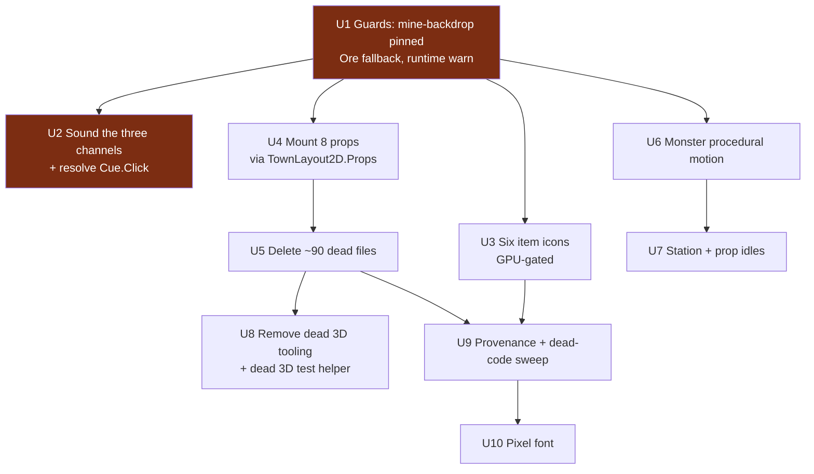

# feat: Asset completion wave — close the ten holes the inventory found

## Summary

`docs/design/ASSETS.md` catalogued every image, animation, sound and voice line in the game and found
ten engineering holes. This plan closes all ten.

**U1 is the only unit that removes live risk** — a missing art id currently hides a whole panel
silently, and a missing ore icon sprays native loader errors. U2 rides in the same PR because it is
small and touches adjacent audio plumbing, not because it is safety-critical. Every other unit is its
own PR. Only U10 is deliberately last; the rest are ordered by dependency, not by cost.

**This is a wave, not a sitting.** No two units may run the Godot engine suite concurrently.

Three scope decisions were taken by the owner before writing: **all ten items** rather than a subset,
**mount the town props and delete the rest** of the orphans, and — after a review found my first
framing of it was wrong — **procedural motion for monsters rather than a new authoring subsystem**
(see KTD1).

---

## Problem Frame

The asset layer is not short of assets — it is short of *wiring, guards and provenance*. Two
mechanisms produced this: null-tolerant loaders that degrade silently, and a wiring guard
(`AssetResolutionCensusTests`) that runs only in the engine suite, never the fast lane.

Scale, stated precisely because the source document's headline was not: **U5 deletes ~90 files,
~64MB.** `ASSETS.md` §5's "61 files, ~20.4MB" counts only the first seven rows of its own table; the
`art/gen-candidates/2026-07-21/*` row (25 files, 45MB measured on disk) and the review contact sheets
are listed in that table and are in U5's scope but excluded from its headline. Do not quote the 61
figure. `ASSETS.md` is corrected alongside this plan.

The through-line for every unit: **a missing or unwired asset must become loud, not invisible.**

---

## Requirements

| ID | Requirement | Source |
|---|---|---|
| R1 | A missing `mine-backdrop` must not silently hide the MineWatch panel — at CI *and* at runtime | ASSETS.md §6 |
| R2 | `IconRegistry.Ore` must degrade to a placeholder, not emit native loader errors | ASSETS.md §6 |
| R3 | All four honest channels (shelf, counter, commission, vigil runner) make a sound | ASSETS.md §6 |
| R4 | Every live recipe has an item icon | ASSETS.md §6 |
| R5 | Finished art is either drawn by the game or deleted from the repo | ASSETS.md §5 |
| R6 | Monsters animate | ASSETS.md §6 |
| R7 | Stations and props are not inert | ASSETS.md §6 |
| R8 | Dead tooling, dead code and their output do not ship | ASSETS.md §6 |
| R9 | Every live asset can be regenerated, or is explicitly recorded as unreproducible | ASSETS.md §6 |
| R10 | The intended pixel font is the font the game renders in | ASSETS.md §8 |

---

## Key Technical Decisions

**KTD1 — Monsters get procedural motion on their existing frames. No new authoring subsystem.**
Owner decision, taken on corrected information. My first draft claimed hand-authored gait frames would
"match how hero bodies are already authored"; **that was false.** Verified: `gen_town_sprites.py` is a
fixed 40x64 canvas with head/torso/legs row bands and an alternating-leg bipedal gait, and it never
references any monster. The five committed minis are five different canvases — cave-rat 60x41,
tunnel-spider 56x41, deep-ghoul 58x96, ore-golem 84x99, forgeworm 64x110 — authored ad hoc outside
that script. Adding gait there is not an extension; it is a new variable-canvas non-humanoid
subsystem. Procedural motion on the frames that exist buys most of the life for a fraction of the
cost, works for all five today, and needs no GPU.

**KTD2 — Props mount through `TownLayout2D.Props`, NOT the MineWatch table.**
My first draft named `MineWatch.cs:165-178` as the template. That code is an
`ImmutableDictionary<string,string[]>` keyed by *sim venue id*, resolved against two literal
screen-space `Vector2` slots inside a SubViewport — it has no concept of a tile. The town's real
mechanism is `TownLayout2D.Props` (`SpriteId`, `Tile`, `YSorted`) consumed by `Town2D.BuildProps()`,
which feet-anchors and Y-sorts. MineWatch remains useful only as *precedent* for the class of bug
("ids resolved but nothing drew them"), never as an implementation template.

**KTD3 — Deletion is scoped by "is it drawn, or can it be regenerated?"**
Mountable finished art gets mounted (U4). Superseded or dead-pipeline output gets deleted (U5, U8).
Drawn-but-unreproducible gets provenance (U9). Nothing is deleted on size alone. U8 stays separate
from U5 because its verification is different — a build-and-grep, not an asset-by-asset engine walk —
and because the risky asset deletion should not be complicated by unrelated tooling removal.

**KTD4 — Guards land before art.** U1 is first so every later unit that adds or moves an asset is
protected by a census that can actually fail.

**KTD5 — Sound the press, not the settlement, and never double-play.**
`MarketLife2D.cs:527-533` **already** plays `Coin` on `CounterSaleClosed`, and its own comment says
that path covers a stepped counter sale as well as a shelf sale. The counter's real gap is that
`CounterPanel.cs` has zero `Cue.Play` calls of any kind — no feedback on Present, Accept, Hold Firm or
Counter. U2 fills that and must **not** add a second `Coin` keyed off `CounterSaleClosed`.

---

## High-Level Technical Design

U5 now feeds U9: the `town-*` disposition is U9's to own if U5 defers it (see U9).

---

## Implementation Units

### U1. Make the two silent-failure paths loud

**Goal** A missing art id can no longer delete a whole panel or spray native errors — and it says so
at runtime, not only in CI.

**Requirements** R1, R2

**Dependencies** none, on purpose (KTD4)

**Files**
- `godot/scripts/IconRegistry.cs` — modify (`Ore` gains the existence guard + placeholder tier that `Art()` already has)
- `godot/scripts/panels/MineWatch.cs` — modify (**mandatory**, not optional: `HasContent = false` must emit through `EngineDistress.Warn`)
- `godot/tests/AssetResolutionCensusTests.cs` — modify (pin `mine-backdrop` explicitly)

**Approach** The census pin is a *pre-merge* gate; it cannot see a runtime resolution failure from a
partial checkout, corruption, or a rename that is not the exact literal it pins. R1 says "must not
silently hide," so the runtime warn is half the requirement, not a nice-to-have. `EngineDistress`
messages are what `EngineLogAnomalies.Scan` turns into anomalies.

**Patterns to follow** `IconRegistry.Art()`'s `ResourceLoader.Exists` guard; `TownAssets2D.Placeholder`
for an announce-itself fallback; `AudioDirector.LoadComposed` for warn-on-degrade.

**Test scenarios**
- A `PricedPool` material with its `ore_*.svg` absent resolves to a placeholder and emits no native loader error.
- The census fails when `mine-backdrop` is absent (verify by temporary rename, then restore) and passes when present.
- `HasContent = false` records an `EngineDistress` message.
- A resolvable backdrop still reports `HasContent = true` — the healthy path must not change.

**Verification** Census fails on a missing backdrop; a missing ore icon yields a placeholder; the
runtime warn is recorded.

---

### U2. Sound the three silent channels, and resolve `Cue.Click`

**Goal** All four honest channels make a sound; no cue is dead weight.

**Requirements** R3

**Dependencies** U1

**Files**
- `godot/scripts/panels/CounterPanel.cs` — modify (Present / Accept / Hold Firm / Counter press feedback only)
- `godot/scripts/panels/CommissionBoard.cs` — modify (accept, decline)
- `godot/scripts/panels/CampPanel.cs` — modify (`OnSend`)
- `godot/scripts/audio/SfxLibrary.cs` — modify only if no existing cue fits
- `godot/tests/AudioTests.cs`, `godot/tests/panels/CounterPanelTests.cs`, and the commission/camp panel tests — modify

**Approach** Per KTD5: the counter's gap is press feedback, **not** the sale landing — `MarketLife2D`
already covers that and a second `Coin` would double-play on every counter sale. Accept and decline
need distinguishable cues; a refusal must not sound like a success. `Cue.Click` has zero call sites:
wire it as the ordinary button press its doc comment describes, or delete it.

**Execution note** Assert on `AudioDirector.RecentCues` after pressing the real control, following
`ImmediateActionsDoNotReplayThePhaseTests`. The cue-census test is a source-text scan (there is
precedent in `AgentPlaytestBridgeTests`) and must scan all of `godot/scripts/`, not just `panels/`.

**Patterns to follow** `LegendsWall.cs:149`; `BountyPanel.cs:219`.

**Test scenarios**
- Pressing Present, Accept, Hold Firm and Counter each play a cue.
- **A completed counter sale plays `Coin` exactly once** — the regression pin for the double-play risk.
- Accepting and declining a commission produce different cues.
- `CampPanel.OnSend` plays a cue on a real send, none on a refusal.
- Every `Cue` value has at least one production call site (census test).
- `EveryCue_IsActuallyAudible_NotSilence` and `EveryCue_SoundsDifferentFromEveryOther` still pass.

**Verification** All four channels emit on their success path; `Coin` fires once per sale; no cue is unreferenced.

---

### U3. Generate the six missing item icons

**Goal** No live recipe renders as a generic slot glyph.

**Requirements** R4

**Dependencies** U1

**Files**
- `art/specs/items/ItemSpecs.cs` — modify (six specs)
- `godot/assets/art/item-{gloomsteel-blade,wardenweave-mail,moonresin-draught,cinderforge-blade,ashguild-plate,emberglass-draught}.png` — create
- `art/build/item-*.build.json` — create (six)
- `art/pipeline/seeds.generated.md` — modify
- `godot/tests/AssetResolutionCensusTests.cs` — modify (assert every `RecipeTable` id resolves)

**Approach** Full SDXL chain: spec, ComfyUI render, `cutout.py --trim`, `normalmap.py` if siblings
carry normals, provenance written. Match the existing 39 item icons' style.

**Execution note** GPU-gated: >=14GB VRAM free, abort above 83C or 14GB used, one job, never in CI.
If the GPU is not free, stop and report — do not generate at reduced settings to finish.

**Test scenarios**
- Every `RecipeTable.All` id resolves to a committed icon (currently would fail for six).
- Each new icon has a `build.json` with seed, model, sha256.
- The generic slot-glyph fallback remains reachable for an unknown id.

**Verification** Census asserts full recipe-icon coverage and passes; six `build.json` exist.

---

### U4. Mount the eight warm-hub town props

**Goal** 11.87MB of finished art is drawn in the world.

**Requirements** R5

**Dependencies** U1

**Files**
- `godot/scripts/town2d/TownLayout2D.cs` — modify (**eight new `Props` entries**: `SpriteId`, `Tile`, `YSorted`)
- `godot/tests/` — the nearest town-mount test — modify or create

**Approach** Per KTD2, add entries to `TownLayout2D.Props`, which `Town2D.BuildProps()` already
feet-anchors and Y-sorts. The tree prop is the convention to follow. Do **not** copy MineWatch's
screen-space slot table.

**Two placement problems to settle before placing anything:**
- **`props-noticeboard` collides with a real building.** `TownLayout2D.cs:148` already registers
  `noticeboard` as one of the four plaza buildings — it *is* the Bounties building. Decide what
  distinct object the orphan prop represents (a market flyer board?) or do not mount it.
- **`props-market-crates`** overlaps in name with the mounted interior station `town2d-station-market-crates`
  (`InteriorLayout2D.cs:190`). Probably fine — interior stock vs exterior yard — but confirm at the
  render pass.

Keep props clear of the walkable lanes into buildings: approach-lane collisions are a known live
problem in this town, so treat lane clearance as a requirement of this unit rather than a nicety.

**Execution note** Render and *look* at the result. Props placed by coordinate arithmetic alone have
shipped wrong here before.

**Test scenarios**
- Each mounted prop id resolves and appears in the town's node tree.
- Repeated town mount/teardown leaves no orphan nodes.
- No prop's collision or interact zone overlaps a building approach lane.
- `props-noticeboard` (if mounted) sits at a tile distinct from the noticeboard building's.

**Verification** Mounted props appear in a rendered screenshot; orphan-node count returns to baseline.

---

### U5. Delete the orphans that are genuinely dead

**Goal** Superseded and dead-pipeline assets stop shipping. **Real scope: ~90 files, ~64MB.**

**Requirements** R5

**Dependencies** U4 (mount first)

**Files — delete** (paths verified on disk; the PNGs live under `godot/assets/art/`, **not** bare `art/`)
- `godot/assets/sprites/2d/*.svg` (21)
- `godot/assets/sprites/{forge,ground_tile,memorial_stone,mine_gate,shop,tavern}.svg` (6)
- `godot/assets/art/faction-{crownsguard,deepvein}-emblem.png` (2)
- `godot/assets/art/town-{forge,market,tavern,mine-gate}.png(+_n)` (8) — see the risk note below
- `godot/assets/art/shop-interior.png(+_n)` (2)
- `godot/assets/art/town2d-{board,forge,market,tavern,mine-gate,mine-backdrop}.png` (6)
- `art/gen-candidates/2026-07-21/*` (25, ~45MB) — genuinely top-level `art/`
- review contact sheets and `godot/assets/candidates/heroes-r3/` (3 PNGs + import sidecars)

**Also modify** — every file that hardcodes a deleted id: `godot/tests/ArtManifestTests.cs`,
`ArtWiringCoverageTests.cs`, `IconRegistryTests.cs`, **`ArtRenderFreshCheckoutTests.cs`** (its
`CommittedIds` array asserts all four `town-*` resolve non-null) and **`AssetCatalogTests.cs`**
(`CommittedIds_ResolveNonNull` / `Has_ReflectsManifestExactly`). Also remove the stale
`ArtWiringCoverageTests` comment citing the deleted `TownSceneTests.LitOverlay_*`.

**The `town-*` risk note, corrected.** My first draft justified caution by citing
`AssetCatalog.cs:118` (`FeetAnchorOffsets["town-mine-gate"]`). **That citation is itself dead code** —
`FeetAnchorOffset()` at line 123 is its only reader and has **zero call sites** anywhere in `godot/`.
So it is not evidence of liveness; it is another remnant of the same deleted LitOverlay scene. The
real verification is: grep for `FeetAnchorOffset(` call sites. If it stays at zero, the `town-*` set
is deletable here and `FeetAnchorOffsets`/`FeetAnchorOffset` should be swept as dead code in U9. If
U5 still chooses to defer the set, **U9 owns the disposition** — it is in U9's Files list, not left to
nobody.

**Approach** Delete in id groups, running the engine suite between groups so a wrong deletion is
attributable. `IconRegistry.Building()` becomes unreachable once its SVGs go — delete the method too.

**Test scenarios**
- Engine suite passes after each deletion group with no resolution failures.
- No remaining test or script references a deleted path.
- A rendered town screenshot before and after is visually identical.

**Verification** Engine suite green; `git diff --stat` reclaims ~64MB; town renders unchanged.

---

### U6. Give monsters procedural motion

**Goal** The things the heroes fight move.

**Requirements** R6

**Dependencies** U1

**Files**
- `godot/scripts/panels/DelveStage.cs` — modify (**new** local motion plumbing, see below)
- `godot/tests/DelveStageTests.cs` — modify

**Approach** Per KTD1: animate the single committed frame — an idle breathe, a wind-up before a
strike, a settle after — in code. No new art, no generator change, no GPU. Accumulated delta only; no
`Tween`, no RNG, matching every other animator in this codebase.

**Correction to my first draft:** `DelveStage` does **not** already drive hero frames. It borrows
already-rendered `Sprite2D` references via `SyncHeroSprites()` and layers combat motion on top; the
`WalkFrames` / `ResolveWalkFrameTexture` machinery lives in `MineWatch.cs`. Whatever motion state U6
adds is new to `DelveStage`, modelled on MineWatch cross-file — not an existing local mechanism being
reused. Scope accordingly.

**Test scenarios**
- A monster's transform changes over accumulated delta and returns to rest.
- Motion is deterministic for a fixed delta sequence (no RNG).
- The pause contract holds — a paused clock freezes monster motion.
- A death/clouded monster does not resume breathing.
- Repeated beat-render and reset cycles leave no orphan nodes.

**Verification** A rendered delve shows a monster mid-motion; two frames differ; determinism test passes.

---

### U7. Give stations and props an idle

**Goal** The workshop stops looking switched off.

**Requirements** R7

**Dependencies** U6 (reuse whatever motion idiom it settles)

**Files**
- `godot/scripts/town2d/AmbientLife2D.cs` — modify, or a new sibling animator beside `SwayingTreeSprite2D`
- `godot/scripts/town2d/InteriorLayout2D.cs` — modify if stations need an animator at mount
- the nearest ambient-life test — modify or create

**Approach** Smallest thing that reads as alive: a furnace glow pulse, an anvil spark on the forge's
own strike cue, a lantern flicker. Accumulated delta only.

**Test scenarios**
- The furnace's modulate changes over accumulated delta, deterministically for a fixed sequence.
- Animators respect the same pause contract as the existing ones.
- Repeated interior mount/teardown leaves no orphan nodes.

**Verification** A rendered forge interior differs between two frames; orphan-node count flat.

---

### U8. Remove the dead 3D tooling and its output

**Goal** A pipeline nothing consumes stops shipping bytes and confusing readers.

**Requirements** R8

**Dependencies** U5

**Files — delete** `tools/3dgen/`, `tools/blender/`, any remaining `art/gen-candidates/2026-07-21/glb/`.
**Modify** `godot/tests/UiTestSupport.cs` — delete the unused `WalkUntilArrived3D(Node, Node3D, Vector3, …)`
helper at line 439 (zero callers), plus any doc referencing the removed tooling.

**Approach** Straight removal. `normalize_glb.py` has never executed; `gpu_guard.sh` guards a path
that no longer runs. **Corrected claim:** it is not true that no `Node3D` exists anywhere — that one
dead test helper is typed against it. Nothing *renders* 3D, which is the point that matters.

**Test scenarios**
- `dotnet build Game.sln` and the fast lane pass unchanged.
- No remaining file references `3dgen`, `normalize_glb`, `gpu_guard`, or `WalkUntilArrived3D`.

**Verification** Build and suites green; grep returns only git history.

---

### U9. Provenance backfill and dead-code sweep

**Goal** Every live asset is regenerable or explicitly recorded as not, and dead registry entries go.

**Requirements** R9, R5 (the deferred `town-*` disposition), R8 (dead code)

**Dependencies** U3 (reuse its provenance-writing path), U5

**Files**
- `art/build/{market,tavern,mine-gate,town-tavern}.build.json` — create, or record as `unreproducible-legacy`
- **`art/build/town2d-monster-*.build.json`** — the five monster minis are live (in `art-manifest.json`, drawn by `DelveStage`) with **no generator and no provenance**; record them
- **The deferred `town-{forge,market,tavern,mine-gate}` set** — if U5 deferred it, resolve it here: delete after confirming `FeetAnchorOffset` has no callers, or record it
- `art/specs/town/TownSpecsExtra.cs` — modify (**delete the seven dead specs — they are all here**)
- `art/specs/town/TownSpecs.cs` — modify **only** for the provenance-backfill action; it contains the four *live* building specs and no dead ones. Do not delete from it.
- `godot/scripts/AssetCatalog.cs` — modify (remove `player-avatar`/`PlayerAvatarId`; sweep `FeetAnchorOffsets`/`FeetAnchorOffset` if confirmed callerless)
- `godot/assets/art/README.md` — modify (record that `panel_banner_*` / `player_smith*` sit outside the AssetSpec id grammar deliberately)

**Test scenarios**
- `AssetConformanceTests` passes with the seven specs removed.
- Every manifest id has either a `build.json` or membership in the documented unreproducible set.
- No code references `PlayerAvatarId` or `FeetAnchorOffset` after removal.

**Verification** Conformance green; no live asset lacks provenance or an explicit unreproducible record.

---

### U10. Ship the pixel font

**Goal** The game renders in its intended typeface.

**Requirements** R10

**Dependencies** U9

**Files**
- `godot/assets/fonts/<face>.ttf` + its licence file — create
- `godot/scripts/ui/GameTheme.cs` — modify (resolve the `TODO(font)` at line 120)
- the nearest theme/bounds test — modify

**Approach** Blocked on sourcing a licence-clear pixel face. Record the licence the way the VCTK
narrator voice's CC BY 4.0 obligation is recorded.

**Execution note** This changes every screen. Render and look at several panels — a font swap that
breaks a label's fit is a clipping bug of exactly the class this repo keeps finding.

**Test scenarios**
- The theme resolves the committed font, not the engine default.
- No panel's text overflows its container at 1152x648 (extend the existing bounds tests).
- The licence file is present.

**Verification** Rendered Forge, Shop, Ledger and tutorial card show the new face with no clipping.

---

## Scope Boundaries

**In scope** — the ten units above.

**Out of scope — three open questions for the owner** (distinct from the three scope decisions in the
Summary, which are already closed)
- `hero-vanguard.png` renders the knight and greatsword as two disconnected floating subjects. Reroll or accept?
- The flat-colour placeholders (ground tiles, `ui-frame-wood`, several props — 130-770 bytes each, disclosed in the art README). When do they stop being acceptable?
- Six heroes standing in formation reads as staged. Design feel.

### Deferred to Follow-Up Work
- Boss and venue creature animation — U6 covers the five Mine monsters only.
- Hand-authored monster gait frames, if procedural motion proves insufficient. KTD1's reasoning and true cost are recorded so the decision can be revisited without re-deriving it.
- Shader effects. Zero `.gdshader` files and no plumbing.
- Wiring `AssetResolutionCensusTests` into the fast lane, or any `.github/` change. Owner-only, deny-listed.

---

## Risks & Dependencies

| Risk | Mitigation |
|---|---|
| U5 deletes something still drawn | U4 mounts first; the `town-*` set has a named verification (`FeetAnchorOffset` call sites) and, if deferred, a named owner in U9 |
| U5's real scope (~90 files, ~64MB) is quoted as the source doc's 61/20.4MB | Stated correctly in Problem Frame and U5; `ASSETS.md` corrected alongside |
| Engine tests serialize globally | Sequence, never parallelise |
| U3 is GPU-gated and may stall | Independent of every other unit; blocks only U9's provenance path |
| U10 changes every screen | Bounds tests plus a rendered review before landing |
| A unit adds art the census cannot see | U1 lands first (KTD4) |

---

## Verification Contract

- Fast lane: `dotnet test sim/GameSim.Tests/GameSim.Tests.csproj --filter Category!=Balance`
- Engine suite: `dotnet test godot/tests --settings .runsettings` — quote the runner's own
  `Failed: N, Passed: N`, never a wrapper's verdict. The baseline moves as fixes land; re-derive it
  from `main` rather than trusting a number written here. A materially lower count means the suite
  silently lost tests, itself a defect.
- `dotnet build Game.sln`; `dotnet test art/GameArt.Tests`; generator `--check` for any regenerated asset.
- For every unit that changes what is on screen (U4, U6, U7, U10): **render it and look at it.**
  Property assertions have repeatedly passed over visibly broken output in this repo.

## Definition of Done

All ten units merged to `main`, each its own PR except U1+U2. Engine suite green at or above the
baseline derived from `main`. `docs/design/ASSETS.md` updated so its orphan count, missing-icon list
and silent-channel table reflect reality — or those rows deleted if this wave made them obsolete. The
three open owner questions in Scope Boundaries are recorded as answered or explicitly still open.

## Sources & Research

- `docs/design/ASSETS.md` — the inventory this plan acts on
- `TownLayout2D.Props` / `Town2D.BuildProps()` — the real prop-mounting mechanism (KTD2)
- `MarketLife2D.cs:527-533` — the existing `Coin` on `CounterSaleClosed` that KTD5 avoids double-playing
- `tools/art/gen_town_sprites.py` — the fixed humanoid canvas that made KTD1's first framing wrong

**Review note.** Four reviewers (coherence, feasibility, scope-guardian, adversarial) audited the
first draft. Sixteen findings applied. Three reviewers independently caught that U5's delete paths
were written as bare `art/` when the files live under `godot/assets/art/`; two each caught the
`TownSpecs.cs` miscite, the orphaned `town-*` deferral, the 61-vs-90 file count, and the false
"no `Node3D` anywhere" claim. One found the KTD1 premise was false, which sent that decision back to
the owner.
