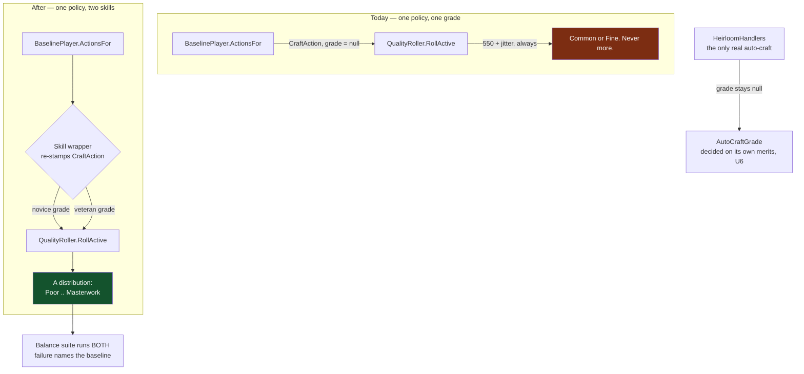

# The balance baseline measures a real smith - Plan

**Product Contract preservation:** unchanged. Planning added the Planning Contract, Implementation
Units, Verification Contract and Definition of Done below; every R/AE ID and all product scope is
carried verbatim from the brainstorm.

## Goal Capsule

**Objective.** Every balance number this project has ever produced describes a smith who cannot
craft above **Fine**, because the measurement harness never plays the forge minigame. Replace the
single crippled baseline with **two** — a novice and a veteran — so the balance suite answers
"is this tuned for the people who actually play it?" instead of "is this consistent with an
artifact of the harness?"

**Product authority.** Owner, 2026-08-13: intent is **honest balance numbers** (a measurement
defect, not a player-facing one), calibrated against **two baselines, novice and veteran** —
balance must hold for both.

**Open blockers.** None. No GPU, no owner ear, no external dependency. The 53 existing balance
assertions will move; that re-baseline is the work, not a surprise.

---

## Problem Frame

**A human blacksmith is not capped.** A real craft carries a scored grade — the forge scorer, or a
puzzle scorer for alchemy/tanning/engineering — and reaches Superior or Masterwork on skill.
`QualityRoller.AutoCraftGrade = 550` fires **only** when every scorer returned null.

That covers exactly three things: the `BaselinePlayer` harness, heirloom crafts
(`HeirloomHandlers` calls `RollActive` with no grade at all), and any craft that somehow skips the
minigame.

**Four professions share this mechanism, not one.** Blacksmith, tanning, alchemy and engineering all
set `ActiveCraft: true` (`ProfessionRegistry.cs:51`, `Tanning/TanningProfession.cs:100`,
`Alchemy/AlchemyProfession.cs:119`, `Engineering/EngineeringProfession.cs:116`) — that flag is
exactly what routes each profession's puzzle scorer into `RollActive`. The harness gap is invisible
for the other three only because **`GameComposition.NewCampaign(seed)` — which every balance test
calls — selects blacksmith alone**, so `BaselinePlayer` never crafts their recipes. That is the real
reason, and it is a property of the fixture, not of the professions. *(An earlier draft said
blacksmith was the only `ActiveCraft` profession; that came from a grep scoped to one file and was
wrong. The plan's conclusions survive, but for this reason rather than the stated one.)*

**550 sits exactly on the Common/Fine seam** (`< 550 → Common`, `< 780 → Fine`), and the jitter
half-width is 25. So every auto-craft in the game's history resolved inside **[525, 575]** —
Common or Fine on a coin flip, and nothing else, ever. The `isAutoCraft` hard-cap at Superior a few
lines below is vacuous: the value it caps cannot be approached.

**Therefore the measurement, not the game, is what was broken.** The 2026-08-09 finding — *of 176
items equipped by living heroes at day 100 across 11 seeds: Common 140, Fine 36, Superior 0,
Masterwork 0* — measured the harness. It was read at the time as "the player's own work was never
better than shop stock," and that reading is wrong for a human player.

**The balance suite is green, and that is the problem.** 53 of 53 pass on `6177103` (measured
2026-08-13, 4m22s). They pass *against* a baseline that cannot exceed Fine, so they certify
consistency with a broken reference — not balance. **Superior and Masterwork gear has never been
exercised by a balance gate through the crafting path at all.**

**Already fixed, do not re-fix.** The ~90% craft refusal (PT26) is gone: `BaselinePlayer` now asks
`ActionLegality.IsLegal` rather than hand-rolling the material check. The code comment records it in
past tense.

**What green will and will not prove.** AE1's census makes Superior and Masterwork blacksmith gear
statistically reachable — and **four of the top-tier recipes it will exercise still render as a
generic slot glyph**: `item-gloomsteel-blade` (T8), `item-wardenweave-mail` (T9),
`item-cinderforge-blade` (T12) and `item-ashguild-plate` (T13) are exactly the six missing icons
`docs/design/ASSETS.md` lists as its one remaining open item (GPU-blocked, not decision-blocked). So a
hero can equip a Masterwork blade this smith forged and the player sees an anonymous gray square.
**Do not read AE1 green as "link 1 is delivered"** — this plan makes the number honest; the icons
make the item legible, and they are tracked separately.

**Why this may run ahead of the still-open P4 human feel-test:** the same precedent that licensed the
2026-08-09/08-10 harness-honesty waves — a lying measurement instrument is a substrate defect, and
substrate defects do not wait behind content gates. Stated so the queue decision is on the record
rather than assumed.

---

## Product Contract

### Actors

| ID | Actor | Stake |
|---|---|---|
| A1 | The balance suite (`Category=Balance`) | Consumes the baselines; every gate it asserts is only as meaningful as they are |
| A2 | Whoever tunes the game next | Reads balance output to decide whether a lever moved the right thing |
| A3 | The player, indirectly | Never sees this change; is the person the numbers are supposed to be about |

### Requirements

| ID | Requirement |
|---|---|
| R1 | Two named baselines exist — **novice** and **veteran** — distinguished by the craft quality they achieve, and both drive the balance suite |
| R2 | The veteran reaches **Superior and Masterwork**; the novice stays mostly **Common/Fine**. Neither is a fixed grade: both produce a distribution across a campaign |
| R3 | A balance gate that holds for one baseline and fails for the other is a **finding, and must be visible as one** — not silently averaged away or resolved by loosening the gate |
| R4 | Both baselines are **deterministic**: same seed plus same baseline yields identical state (hard rule 5). Quality variation comes from the kernel's injected RNG stream, never from wall-clock, ambient state, or a second draw |
| R5 | The existing 53 assertions are **re-baselined against the new references**, and each moved number is recorded with its before/after — a moved gate is evidence, not noise |
| R6 | Auto-craft's grade stops being the harness's de-facto skill model. Whatever value survives for the genuine auto path (heirlooms) is chosen **on its own merits**, and the vacuous Superior hard-cap is either made reachable or removed |
| R7 | `docs/design/MAKERS-MARK.md`'s record of the 2026-08-09 ruling is corrected: the measurement described the harness, and a human player was never subject to the cap |
| R8 | Sim purity holds — no Godot reference, no wall-clock, no transcendental `Math.*` in sim code (hard rule 4) |

### Acceptance Examples

| ID | Given | When | Then |
|---|---|---|---|
| AE1 | A 100-day campaign on the **veteran** baseline | Equipped-gear quality is censused at day 100 | Superior and Masterwork both appear; the distribution is not confined to two adjacent bands |
| AE2 | A 100-day campaign on the **novice** baseline | Same census | Mostly Common/Fine, with the shape a struggling player would produce — and it is a distribution, not a single band |
| AE3 | The same seed, the same baseline, run twice | States compared | Byte-identical (golden-replay contract) |
| AE4 | A balance gate that passes for the veteran and fails for the novice | The suite runs | The failure is attributed to a named baseline in the output, so the reader knows which player the game fails |
| AE5 | An heirloom forged from a fallen hero's gear | Quality is rolled | Resolves on a deliberate rule for the auto path, not on a constant that exists to model a player who is not there |

### Scope Boundaries

**In scope** — the harness, the balance assertions, the auto-craft constant's justification, and
the docs that record the superseded finding.

**Out of scope, and each for a stated reason:**

- **The player-facing power curve.** Gear stats, level scaling and venue difficulty stay untouched. The finale gates currently pass; changing the curve *and* the ruler in one move would make both unreadable.
- **The forge minigame's own difficulty.** PT13 ("winnable but punishing") is a real, separate complaint about how the puzzle feels to play.
- **Making a human player's *actively crafted* items better.** They were never capped.
  **One deliberate exception, and it is player-visible:** U6 re-decides the heirloom constant, so the
  quality of an item a player receives from reforging a fallen hero's gear may change. That is an
  effect this plan owns and discloses, not an accident. Everything else here is invisible to a player.
- **`RivalCatalog`'s flat-Common shop stock.** Whether the rival should sell better goods is a design question this measurement fix does not settle.

#### Deferred to Follow-Up Work

- Skilled variants of the **non-craft** verbs (shop pricing, camp sends). See OQ2 — this wave scopes skill to crafting only.
- Retiring or re-pointing `MasterworkSeekingPlayer` if the veteran baseline makes it redundant. Assess after U4, do not pre-empt.

### Assumptions

| ID | Assumption | If wrong |
|---|---|---|
| AS1 | A synthetic performance grade can represent minigame skill faithfully enough to calibrate balance — without simulating the minigame. **Considered and rejected:** `QualityRoller.SimulateActiveForge`/`HeatBandForge` already turns a scripted strike policy into a per-mille grade through the real scorer, which is arguably more faithful — but it draws RNG per strike, which KTD2 forbids for the re-baseline's readability | The harness needs that real scorer driven by a scripted input trace, and the re-baseline absorbs a shifted draw sequence — materially more work |
| AS2 | The 53 assertions can be re-baselined without their *intent* changing — only their numbers | Some gate was encoding the broken baseline as a design target and needs re-deciding, not re-numbering |
| AS3 | Two baselines are affordable in balance-suite runtime (currently 4m22s) | Reduce seed count per baseline, or run the veteran on the full sweep and the novice on a subset |

### Open Questions

| ID | Question | Owner |
|---|---|---|
| OQ1 | Should the novice be *bad* at the minigame or *inconsistent* at it? Different distributions, different failure modes the suite would catch | Implementation, informed by PT13's finding that the puzzle punishes |
| OQ2 | Does the veteran also play the shop and camp verbs better, or is skill scoped to crafting only? Scoping to crafting keeps this wave narrow — that is the current assumption | Planning; deferred to follow-up work |
| OQ3 | What is the right auto-craft grade for heirlooms once it stops modelling the harness — *loss becomes legend*, or *a working tribute*? | Owner, at U6 |

### Success Signals

- A tuning question can be answered with "it holds for the veteran but breaks the novice at day N" — a sentence that is impossible to say today.
- The gear-quality census over a campaign spans more than two adjacent bands.
- No balance number in the repo any longer traces back to a smith who cannot exceed Fine.

---

## Planning Contract

### Key Technical Decisions

**KTD1 — Compose, never fork — and this pattern is new here, not precedented.** `BaselinePlayer` is
a `static class` with a single `ActionsFor(GameState)` entry, and its own doc says "one policy,
shared by the balance gate and the CLI batch farm, **never forked**." That constraint stands. The two
baselines are **wrappers that delegate to `BaselinePlayer` and re-stamp its `CraftAction`s with a
`PerformanceGrade`** — not copies of its policy logic. If a wrapper ever needs to re-derive *which*
recipe to craft, that is the signal it has drifted into a fork; stop.

**Correction, and it matters for how much confidence to place here.** An earlier draft claimed the
repo already sanctions this via `MasterworkSeekingPlayer` ("additive, `BaselinePlayer` + …") and the
`AddRange` idiom in `ActionLegalityTests`. Verified: **neither is a wrap-and-restamp.**
`MasterworkSeekingPlayer` never calls `BaselinePlayer.ActionsFor` at all — it names `BaselinePlayer`
only in comments ("`BaselinePlayer` is UNTOUCHED", "mirrors BaselinePlayer's own guard", "Same recipe
ordering BaselinePlayer's Expedition branch uses") and independently reimplements the same
tier-descending loop. The `AddRange` idiom concatenates two *disjoint* policies' outputs; it never
transforms one policy's emitted records.

So "call `BaselinePlayer.ActionsFor`, then map over its returned `CraftAction`s" is
**first-of-its-kind in this codebase**. Worth noting *why*: the one policy that needed slightly more
than a field stamp (choosing `MasterworkAttemptAction` over `CraftAction`) chose full
reimplementation rather than wrapping. U2's delegation tests therefore carry the real burden of
proof — they are not confirming an established pattern, they are establishing one.

**KTD2 — The grade is derived from state, not from a new RNG draw.** `CraftAction.PerformanceGrade`
already exists (`Contracts/Actions.cs`), and `RollActive` consumes **exactly one** `Roll100()`
whether the grade is null or supplied. Deriving the grade from campaign state (day, craft ordinal,
recipe tier) with pure integer arithmetic therefore:
- preserves determinism for free (R4) with no new RNG plumbing,
- keeps `BaselinePlayer`'s "no RNG of its own, no IO, no wall clock" purity claim true of the wrappers,
- and **does not perturb the draw sequence**.

Taking a second draw instead would shift every downstream roll in every seed, and the re-baseline
would be uninterpretable noise. Do not do it.

**But the draw count is not the only thing that moves, and an earlier draft wrongly said it was.**
`RollActive` computes `isAutoCraft = performanceGrade is null` and hard-caps the band at Superior
only when that flag is true; `CraftingHandlers` computes an independent same-named flag gating the
`BatchEcho` mechanic. The instant a wrapper stamps **any** non-null grade — including a deliberately
low novice one — both flags flip to false, **lifting the Superior cap for both profiles as a side
effect of U2, not as U6's considered decision**. So a Superior or Masterwork appearing in *novice*
output during U4/U5 is not necessarily noise: it may be this. Name it before re-baselining, and see
the Risks table.

**KTD3 — Two profiles, one mechanism.** Novice and veteran differ only in the parameters of the
same derivation — centre and spread — so their distributions are comparable by construction and a
third profile is a data change, not new code. Targets: **veteran** centred high enough that Superior
is the common outcome and Masterwork is reachable (above the 930 seam on a good roll); **novice**
centred low, straddling Common/Fine with occasional Poor. Exact constants are tuned in U5 against
measured output, not guessed here.

**KTD4 — The balance suite runs both, and says which one failed.** A gate that passes for one and
fails for the other is the finding this whole plan exists to surface (R3/AE4), so the baseline name
must appear in the failure message. xUnit `[Theory]` with the profile as the data point gives that
attribution for free and keeps each assertion single-sourced.

**KTD5 — The auto-craft constant is decided on heirloom merits, separately and last.** Once the
harness stops depending on it, `AutoCraftGrade` governs only genuine auto-crafts — heirlooms. Its
value becomes a small product question (AE5), and the vacuous `isAutoCraft` Superior cap either
starts meaning something or comes out. Sequencing it after the harness work keeps the re-baseline
attributable to one cause at a time.

### High-Level Technical Design

The wrapper is the only new concept. Everything downstream of `RollActive` is untouched, which is
what makes the re-baseline readable.

---

## Implementation Units

### U1. A deterministic smith-skill grade

**Goal** A pure function from campaign state to a per-craft performance grade, parameterised by a
named skill profile.

**Requirements** R1, R2, R4, R8

**Dependencies** none

**Files**
- `sim/GameSim/Harness/SmithSkill.cs` — create (profile record + the derivation)
- `sim/GameSim.Tests/Harness/SmithSkillTests.cs` — create

**Approach** A `SmithSkill` profile carries a centre and a spread in per-mille. The derivation mixes
stable campaign facts into a value inside `[centre - spread, centre + spread]` using integer
arithmetic only. No `Math.*` transcendental (hard rule 4), no RNG, no clock.

The spread must produce a *distribution across a campaign*, not one value repeated (R2) — vary with
something that changes per craft, not only per campaign.

**Beware day/tier collinearity — this is the trap that would recreate the defect in a new place.**
`BaselinePlayer` always tries the highest-tier legal recipe first (`OrderByDescending(r => r.Tier)`),
and `RecipeTable`'s high tiers are gated behind talent unlocks and ladder graduation that only occur
late in a campaign. So **day and recipe tier are near-collinear**, not independent entropy. Mixing
both into one derivation risks a grade that is effectively a fixed per-tier offset — every tier-12+
craft landing in the same band — which is a harness artifact masquerading as skill, exactly what this
plan exists to remove, just relocated from a flat constant to a tier-keyed function. U1's
band-placement tests would happily pass on such a pattern.

**Deferred to implementation:** which state field supplies the per-craft ordinal. `GameState` exposes
no craft counter; `NextItemId` is the obvious candidate but also increments for heirlooms and other
non-blacksmith items, whose timing correlates with hero deaths — a second, unverified correlation
with day. Pick the source that survives the anti-collinearity tests below.

**Patterns to follow** `QualityRoller`'s own jitter derivation (`roll * 51 / 100 - 25`) is the house
idiom for mapping a value into a symmetric integer band. `BaselinePlayer`'s class doc is the purity
contract to preserve verbatim.

**Test scenarios**
- Covers AE3. The same state and profile yield the same grade, every call.
- A campaign's worth of successive crafts under the veteran profile produces grades spanning more than one quality band — the value is not constant.
- Novice and veteran profiles produce different grades for identical state.
- Every produced grade is inside `[0, 1000]`, so `RollActive`'s clamp is never the thing saving it.
- Grades sit where the profile claims: the veteran's centre lands in Superior after banding, the novice's in Common/Fine.
- No RNG is consulted — the function takes no `IDeterministicRng` and the type does not reference one.
- **Anti-collinearity, holding tier fixed:** the same recipe tier crafted across many different days and ordinals produces varied grades — variance is not tier-determined.
- **Anti-collinearity, holding day fixed:** different tiers at the same day and ordinal do not differ by a fixed per-tier offset.

**Verification** Determinism and band-placement tests pass; the file references neither RNG, clock, nor `Math.*`.

---

### U2. Two composed baselines that stamp the grade

**Goal** Novice and veteran policies that delegate to `BaselinePlayer` and re-stamp its craft
actions, without duplicating any policy logic.

**Requirements** R1, R2, R4

**Dependencies** U1

**Files**
- `sim/GameSim/Harness/SkilledSmithPlayer.cs` — create
- `sim/GameSim.Tests/Harness/SkilledSmithPlayerTests.cs` — create

**Approach** Per KTD1: call `BaselinePlayer.ActionsFor(state)`, map each `CraftAction` to the same
action with `PerformanceGrade` set from `SmithSkill`, pass every other action through untouched.
`CraftAction` is a record, so this is a `with` expression — no re-derivation of recipe choice, no
copied policy.

**Execution note** Prove the delegation before the grade: a test that the wrapper's non-craft
actions are identical to `BaselinePlayer`'s catches a fork the moment someone starts one.

**Patterns to follow** `MasterworkSeekingPlayer` (additive on `BaselinePlayer`, per its own doc) and
the `AddRange` composition in `sim/GameSim.Tests/Advisor/ActionLegalityTests.cs`.

**Test scenarios**
- Every non-craft action the wrapper emits is exactly what `BaselinePlayer` emitted for the same state — same order, same values.
- **The novice's realistic output does not depend on the `isAutoCraft` Superior cap having applied** — stamping a grade lifts that cap (KTD2), so the profile must be honest without it.
- Every `CraftAction` the wrapper emits carries a non-null `PerformanceGrade`; the bare `BaselinePlayer` still emits null.
- The recipe chosen by the wrapper is the recipe `BaselinePlayer` chose — the wrapper never re-picks.
- Covers AE3. Same seed and profile, two runs, identical action sequences.
- A phase where `BaselinePlayer` emits no craft (Camp, ExpeditionDeep) passes through unchanged.

**Verification** Delegation tests pass; a diff of the wrapper shows no recipe-selection logic.

---

### U3. Both baselines reachable from the batch farm

**Goal** The telemetry sweep can run either profile, so chronicles and analytics see both.

**Requirements** R1 — **partially.** R1's text ties the two baselines to the *balance suite*; the
batch farm is a deliberate extension beyond it, because telemetry and `tools/Analytics` read the
same chronicles and would otherwise still be describing the Fine-capped smith. Small, and the seam
already exists. If it has to be cut for time, cut it here rather than anywhere else — nothing else
depends on it.

**Dependencies** U2

**Files**
- `sim/GameSim.Cli/BatchRunner.cs` — modify (`Policy` enum, `PolicyFn`, `PolicyFileTag`)

**Approach** The seam exists: a `Policy` enum with `--policy`, already switching `baseline` and
`counter`. Add the two profiles as cases. `PolicyFileTag` must give each its own tag so runs do not
overwrite each other in `runs/`.

**Test scenarios**
- Covers R1. Each policy value maps to its own file tag; no two tags collide.
- Omitting `--policy` still selects the unchanged `BaselinePlayer` — existing callers do not move.
- An unknown `--policy` value fails loudly rather than silently falling back to baseline.

**Verification** `dotnet run --project sim/GameSim.Cli -- batch --policy veteran` writes chronicles under a distinct tag.

---

### U4. The balance suite runs both, and names the one that failed

**Goal** Every balance gate is asserted against both baselines, and a failure says which player the
game failed.

**Requirements** R1, R3

**Dependencies** U2

**Files**
- `sim/GameSim.Tests/Balance/BalanceSimTests.cs` — modify
- `sim/GameSim.Tests/Balance/ArcBalanceTests.cs` — modify
- `sim/GameSim.Tests/Balance/CampProvisioningBalanceTests.cs` — modify
- `sim/GameSim.Tests/Balance/ConsumableTraitMortalityBalanceTests.cs` — modify
- `sim/GameSim.Tests/Balance/FactionTariffBalanceTests.cs` — modify
- `sim/GameSim.Tests/Balance/GuildAssessmentBalanceTests.cs` — modify
- `sim/GameSim.Tests/Balance/PhaseDSinksBalanceTests.cs` — modify
- `sim/GameSim.Tests/Balance/SalveProvisioningBalanceTests.cs` — modify
- `sim/GameSim.Tests/Balance/VerbConsequenceFloorTests.cs` — modify
- `sim/GameSim.Tests/Balance/MasterworkDominanceBalanceTests.cs` — **read first, likely unchanged**: it drives `MasterworkSeekingPlayer` on purpose and may be orthogonal

**Approach** Convert each gate to a `[Theory]` over the two profiles (KTD4). Where a gate is
genuinely single-baseline — a claim about a struggling player specifically — say so in the test's
own doc rather than running it twice for symmetry.

**Execution note** Do this **before** touching any threshold. This unit converts the harness and is
expected to go red; U5 owns the numbers. Landing them together makes it impossible to tell a genuine
balance break from an expected re-baseline.

**Test scenarios**
- Covers AE4. A gate failing for exactly one profile names that profile in the failure message.
- Each gate runs once per profile — no gate silently loses its second case.
- Covers AE1/AE2. A census assertion exists proving the veteran's equipped gear reaches Superior and Masterwork, and the novice's does not.

**Verification** The suite runs both profiles; failure output identifies the baseline. Red at this
point is expected and is U5's input.

---

### U5. Re-baseline, with every moved number recorded

**Goal** The suite is green against honest baselines, and each moved threshold is evidence rather
than a silent edit.

**Requirements** R5, R2

**Dependencies** U4

**Files**
- the balance test files from U4 — modify (thresholds only)
- `docs/design/MAKERS-MARK.md` — modify (record the re-baseline)

**Approach — two ordered passes, and they do not interleave.** Changing a profile's centre/spread
moves all 53×2 assertions at once, so tuning both together is an unbounded loop with no convergence
signal. Therefore:

1. **Freeze the profiles.** Tune `SmithSkill`'s constants against AE1/AE2's census-shape targets
   *only* — the quality distribution — not against any balance threshold. Then stop touching them.
2. **Re-baseline against frozen profiles.** Move each threshold to what the frozen baselines produce,
   recording before/after per gate. Do not adjust a profile constant in this pass.

If pass 2 reveals a profile genuinely needs to move, that is a **new change to U1**, not a same-unit
iteration — it re-runs pass 1 and re-opens pass 2 deliberately, which keeps the loop visible instead
of silent.

**A moved threshold is a claim.** For each, state which baseline moved it and why the new number is
right — not merely what the run produced. A gate that has to move *a long way* for the veteran is
worth pausing on: it may be AS2 coming true (the gate encoded the broken baseline as a design
target), which is a finding for the owner, not a number to overwrite.

**Test scenarios**
- Covers R5. Both profiles pass every gate.
- Covers AE3. Two runs of the same seed and profile produce identical results; the golden-replay test still passes.
- No threshold was moved without a recorded before/after.

**Verification** `--filter Category=Balance` green for both profiles; the record lists every moved number.

---

### U6. Auto-craft's grade decided on its own merits

**Goal** `AutoCraftGrade` stops being a de-facto skill model and becomes a deliberate rule for the
one path that still uses it.

**Requirements** R6

**Dependencies** U5

**Files**
- `sim/GameSim/Crafting/QualityRoller.cs` — modify (the constant, its doc, and the `isAutoCraft` cap)
- `sim/GameSim.Tests/Crafting/QualityRollerTests.cs` — modify
- `sim/GameSim.Tests/Crafting/HeirloomHandlersTests.cs` — modify

**Approach** With the harness no longer depending on it, the only live consumer is
`HeirloomHandlers`. Decide what an heirloom should be worth, set the constant on that basis, and
resolve the vacuous Superior cap — either the new value can approach it, or the cap is dead code and
comes out.

**This is not a leftover constant, and the decision needs a design anchor.** `docs/design/THE-GAME.md`
frames heirlooms as the emotional payoff of permadeath: a dead hero's gear returns to your anvil
"carrying their lineage forward into the next hand that holds it," in a register it calls cozy and
"load-bearing." Because 550 sits on the Common/Fine seam, **every heirloom ever reforged in this
game has come out middling** — no fallen hero's legacy item has ever been Superior. Pick deliberately
between: *loss becomes legend* (an heirloom reads at least as good as an equivalent veteran craft),
or *a working tribute* (deliberately modest, because the memory is the point, not the stats). Record
which, and why, in the constant's own doc comment.

**A prior candidate exists — treat it as input, not as an answer.** Commit `e269be1` on the orphaned
`origin/fix/power-growth-reaches-the-finale` branch already raised this constant 550 → 800 and
re-pinned four goldens, on the same seam analysis this plan reaches independently. Its *conclusion*
about players was wrong (see Problem Frame), but 800 was a measured choice. State explicitly whether
800 survives on heirloom merits or is superseded — do not silently re-derive a number without saying
where it came from.

**Test scenarios**
- Covers AE5. An heirloom's quality distribution matches the documented intent.
- The `isAutoCraft` cap is either exercised by a test that would fail if removed, or it is gone.
- The band table is unchanged — this unit moves one constant, not the seams.
- Covers AE3. Determinism holds; the single-draw contract (`Roll100` called exactly once) is unchanged.

**Verification** Heirloom quality matches the recorded decision; no test asserts a cap that cannot be reached.

---

### U7. Correct the record

**Goal** The docs stop asserting a conclusion the code contradicts.

**Requirements** R7

**Dependencies** **U1-U6 — every other unit.** This unit deletes the plan doc, so it must be the last
PR to merge regardless of what its own content depends on. An earlier draft listed only U1, which
would have let a session land U7 right after U2 and delete the plan out from under the units still
being built.

**Files**
- `docs/design/MAKERS-MARK.md` — modify (**add** a record; see below — there is nothing there to correct)
- `docs/plans/2026-08-13-002-fix-the-balance-baseline-measures-a-real-smith-plan.md` — delete (rule 7)

**Approach — and the earlier framing of this unit was wrong.** A draft of this plan said
`MAKERS-MARK.md` records the 2026-08-09 ruling as *"the player's own work was never better than shop
stock"* and told the implementer to correct that sentence. **That sentence is not in the file.** It is
the commit subject of `e269be1` on `origin/fix/power-growth-reaches-the-finale` — a branch with no
open or merged PR — and that commit never touched `MAKERS-MARK.md`. An implementer following the old
instruction would have searched for text that does not exist.

What the unit actually does:
1. **Add** a short record to `MAKERS-MARK.md` stating what was measured, what it measured (the
   harness), and that a human player was never subject to the cap — so the correct reading is written
   down somewhere durable, since today it exists only in this plan.
2. **Delete the orphan branch** `origin/fix/power-growth-reaches-the-finale` once U6 has extracted
   whatever value its `550 → 800` candidate still has. Per CLAUDE.md rule 9 a branch with no open PR
   is deleted; it has survived only because it holds the last copy of this evidence.
3. Close the stale PT26 tracker entry. **It lives in the session task tracker, not in the repo** — a
   repo-only implementer cannot find "task #77" and should not try. If it is already closed, skip it.

**Test scenarios** `Test expectation: none -- documentation only, no behavioural change.`

**Verification** No doc claims a human player's crafts were capped; the stale task is closed.

---

## Risks & Dependencies

| Risk | Mitigation |
|---|---|
| The re-baseline hides a real regression in the same commit | U4 (convert) and U5 (re-number) are separate units and separate commits, so an unexpected failure is attributable |
| A wrapper drifts into a fork of `BaselinePlayer` | U2's delegation tests assert the non-craft actions are identical; a fork breaks them |
| Consuming a second RNG draw perturbs every seed | KTD2 forbids it; the single-draw contract is asserted in U6 |
| **Stamping any non-null grade silently lifts the `isAutoCraft` Superior cap for both profiles** — so an unexpected Superior/Masterwork in *novice* output is not automatically noise | Named in KTD2; U2 adds a test confirming the novice profile's output does not depend on that cap having applied |
| The grade derivation correlates with recipe tier, producing per-tier plateaus that pass the band tests while still being a harness artifact | U1's two anti-collinearity tests (tier fixed / day fixed) must pass before U5 tunes anything |
| A gate moves a long way and gets overwritten rather than examined | U5 requires a per-gate rationale, and names AS2 as the thing to watch for |
| Balance runtime doubles (currently 4m22s) | AS3's fallbacks: fewer seeds per profile, or novice on a subset |
| `MasterworkDominanceBalanceTests` overlaps the veteran baseline | U4 reads it before touching it; retiring it is deferred, not assumed |

---

## Verification Contract

- Fast lane: `dotnet test sim/GameSim.Tests/GameSim.Tests.csproj --filter Category!=Balance`
- Balance gate: `dotnet test sim/GameSim.Tests/GameSim.Tests.csproj --filter Category=Balance` — **both profiles**, quoting the runner's own `Failed: N, Passed: N`. Baseline for comparison: **`Failed: 0, Passed: 53`** on `6177103`, 2026-08-13. A *materially lower* count means gates were lost rather than re-baselined, which is itself a defect.
- Determinism: the golden-replay test must stay green throughout — it is the hard-rule-5 tripwire (CLAUDE.md rule 5).
- Sim purity: no Godot reference, no wall-clock, no transcendental `Math.*` anywhere in `sim/GameSim/` (rule 4).
- Engine suite is **not** required — no `godot/` file changes in any unit. If a unit grows one, that is a scope error.

## Definition of Done

All seven units merged to `main`, each its own PR except U4+U5, which land together only if the
re-baseline is trivial — otherwise separately, so the conversion and the numbers stay attributable.
The balance suite is green for **both** baselines with every moved threshold recorded before/after.
`docs/design/MAKERS-MARK.md` no longer claims a human player's crafts were capped. Task #77 is
closed. This plan doc is deleted by the last unit's PR (rule 7).

## Sources & Research

- `sim/GameSim/Crafting/QualityRoller.cs` — `AutoCraftGrade`, the band table, the single-draw contract, the vacuous auto-craft cap
- `sim/GameSim/Crafting/CraftingHandlers.cs` — where a real grade comes from (forge scorer, puzzle scorers) and when it is null
- `sim/GameSim/Crafting/HeirloomHandlers.cs` — the one genuine auto-craft path left in the played game
- `sim/GameSim/Harness/BaselinePlayer.cs` — the "never forked" contract, the purity claim, and the PT26 fix in past tense
- `sim/GameSim.Tests/Balance/` — the 10 files holding the 53 assertions
- `sim/GameSim.Tests/Balance/MasterworkDominanceBalanceTests.cs` — the additive-policy precedent (`MasterworkSeekingPlayer`) that KTD1 follows
- `sim/GameSim.Tests/Advisor/ActionLegalityTests.cs` — the `AddRange` policy-composition idiom
- `sim/GameSim.Cli/BatchRunner.cs` — the existing `Policy` enum / `--policy` seam U3 extends
- `origin/fix/power-growth-reaches-the-finale` — the unmerged 2026-08-09 branch; its measurement is the evidence, its conclusion is what this corrects
