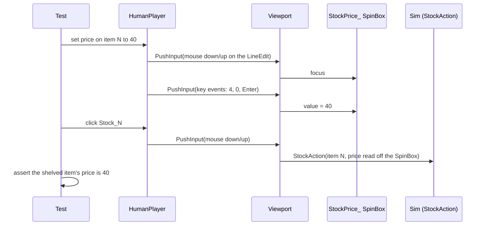

# Fix the Honesty Riders and the Untestable Price Decision - Plan

## Goal Capsule

**Objective.** Close four defects that are verified live in code today, not inherited from a stale
document. Three are §11.4 riders the plan of record already blessed; the fourth is the one core
player decision with no honest-input coverage.

**Product authority.** `docs/design/MAKERS-MARK.md` §11.4 (riders) and §8 "Known defects and drift".
Every claim below was re-verified against the current tree on `73d65c5` — the doc dates from
2026-08-07 and rule 8 says git outranks it, so nothing here is trusted on the doc's word alone.

**Open blockers.** None. No unit needs an owner ruling.

**Execution order — this plan runs BEFORE `docs/plans/2026-08-13-002-fix-the-balance-baseline-measures-a-real-smith-plan.md`.**
That plan's R5 re-baselines the 53 balance assertions on purpose; this plan's R5 treats any movement
in that count as a stop-and-report. Both are correct in their own order and contradictory in the
wrong one. If 2026-08-13-002 lands first, do not run this plan's balance gate against 53 — re-derive
the expected count from `main` first, and treat the re-derived number as the pin.

---

## Problem Frame

Four independent defects, each small, each verified:

1. **A worn trinket can be sold twice.** `sim/GameSim/Economy/ShopHandlers.cs` rejects shelving gear
   a hero wears, but checks only Weapon/Shield/Armor. `GearSet` carries a fourth slot
   (`sim/GameSim/Contracts/Heroes.cs`), four trinket recipes exist across alchemy and engineering,
   and the shop's own sibling `HeirloomHandlers.WoreItem` already checks all four. So a
   player-crafted trinket a hero is wearing can be re-shelved and sold to a **second** hero while
   the first still wears it. Two heroes, one physical marked item — a link-2 honesty break that
   corrupts attribution downstream.

2. **`ActionBudget.ConsumesSlot` is fiction.** The predicate names four action types. **Nine**
   handlers decrement `ActionSlotsRemaining` (counted, not trusted:
   `BountyHandlers`, `CraftingHandlers`, `HeirloomHandlers`, `ForgeSupplyHandlers`,
   `ForgeTierHandlers`, `LegendaryCommissionHandlers`, `MasterworkAttemptHandlers`,
   `MaterialVendorHandlers`, `OreMarketHandlers`). The five missing types are
   `ReforgeHeirloomAction`, `BuyForgeSupplyAction`, `UpgradeForgeAction`,
   `MasterworkAttemptAction`, `CommissionLegendaryWorkAction`. Nothing calls the predicate at
   runtime today — it is a trap armed for the next surface built on it, and its test pins the lie.

3. **Four comments that lie to the next reader.** Verified present:
   `ProfessionHandlers.cs:16-18` says the handler "is NOT yet wired" (it is —
   `GameComposition.cs:84`); `CraftingHandlers.cs:8-9` and `ShopHandlers.cs:10-11` say "ALL THREE
   phases" (the day has five); `Actions.cs:149` calls HonorMemorial "Evening/Night-legal" (no Night
   phase exists). Rule 8's own reasoning: a stale comment is an instruction the next session obeys.

4. **The price decision has no honest-input coverage.** "Price for the sale or the relationship" is
   one of the six decisions the game is made of. **Ten** call sites reach it — nine in
   `godot/tests/ShopPanelTests.cs`, one in `godot/tests/MainUiTests.cs` — and every one does
   `Find<SpinBox>(...).Value = X`, setting a property directly. No test has ever proved a **player**
   can set a price, because `HumanPlayer` (the real-input harness, `PushInput` only) has no way to
   drive a `SpinBox`. Task #50 established that seams are not proof; this decision never got the
   treatment.

**Why these four together.** Each is small, independent, and touches a different file cluster. They
share one property worth batching: all four are places where the repo's *stated* truth and its
*actual* truth diverged, and nothing failed.

---

## Requirements

| ID | Requirement |
|----|-------------|
| R1 | A player-crafted trinket worn by any hero, alive or dead, cannot be shelved. |
| R2 | `ConsumesSlot` returns true for exactly the action types that actually decrement the counter, and its test proves the correspondence rather than restating a hand-written list. |
| R3 | The four false comments state what the code does. |
| R4 | At least one test sets a stock price the way a player does — real input events only — and proves the sim received that number. |
| R5 | No balance threshold moves. Any unit that would move one stops and reports instead. |

---

## Key Technical Decisions

**KTD1 — the trinket fix copies its own sibling, it does not invent a rule, and there are THREE
call sites, not two.** `HeirloomHandlers.WoreItem` (`sim/GameSim/Crafting/HeirloomHandlers.cs:156-157`)
already answers "does this gear set contain this item" across all four slots. `ShopHandlers` should
ask the same question rather than growing a fourth `||`.

The review found a third hand-rolled instance the first draft missed:
`sim/GameSim/Harness/BaselinePlayer.cs:40-41` builds its own equipped-set from
`{ Weapon, Shield, Armor }` — the same omission, in the harness. It is dormant today because
`BaselinePlayer` only crafts `RecipeTable` (blacksmith, no trinket), so it can never see one. U1
fixes all three anyway: "one definition of worn" is the point, and leaving a known third instance
behind means the next gear slot reopens this defect somewhere no test is looking.

Where the shared helper lives is an implementation call, with one constraint: if it becomes a
`GearSet` member it lands in `sim/GameSim/Contracts/`, which triggers the same dedicated-PR rule U2
carries (see KTD5). Duplicating it module-locally avoids that and is an acceptable answer.

**KTD2 — `ConsumesSlot`'s test proves coverage by REFLECTION, not by driving nine handlers.**
The first draft asked the test to drive each of the nine action types through its real handler and
assert the counter moved iff the predicate agreed. The review priced that honestly and it is a bad
trade: `MasterworkAttemptHandlers` alone rejects on eight preconditions before it ever decrements
(recipe, profession, forge tier, talent gate, material, coal, flux, gold), `ForgeTierHandlers` needs
its own ore/gold/ceiling setup, and no shared cross-module fixture builder exists. That test would
relocate the hand-maintained list into nine scattered fixtures inside a Kernel-directory test file
that now needs current knowledge of nine other modules' legality rules — worse coupling than the
two-line list it replaces, and just as capable of drifting.

Use the repo's own answer instead: the **reflective parity test**, the same shape that already
guards the advisor's legality mirror. Enumerate every concrete `PlayerAction` subtype in the
assembly by reflection and require each to be explicitly classified — either `ConsumesSlot` returns
true, or it appears in a named free-list. A tenth action type then fails the suite until someone
decides which it is, which is exactly the drift the current test cannot catch. No handler fixtures,
no cross-module knowledge, and the failure message can name the unclassified type.

**KTD5 — Contracts changes are dedicated PRs, not commits.** U2 (`ActionBudget.cs`) and U3's
`Actions.cs` edit both sit in `sim/GameSim/Contracts/`, where CLAUDE.md requires "dedicated
micro-PRs authored by the orchestrating session only, merged before dependent module PRs." The
first draft said "its own commit," which is a downgrade of a hard rule, not a paraphrase of it.
Both Contracts edits land together in ONE micro-PR that merges before U1's and U4's PRs.

**KTD3 — the price test is additive; the six seam tests stay.**
`ShopPanelTests` and friends set `.Value` directly and that is fine for unit coverage of pricing
math. R4 asks for one honest-input test proving the decision is *reachable*, not a rewrite of
existing coverage. Rewriting them is scope creep and loses fast, focused tests.

**KTD4 — `HumanPlayer` gains a SpinBox capability, the product does not change.**
A `SpinBox` is player-drivable today: click its `LineEdit`, type digits, press Enter. If that path
works, this is a test-harness addition with zero production diff. If it turns out the control is
genuinely unreachable by real input, that is a **product** finding — a control a player cannot
operate — and the unit stops and reports rather than adding a seam to paper over it.

---

## High-Level Technical Design

U4 is the only unit with a multi-step shape worth drawing — the point is that every arrow is a real
input event, with no test seam anywhere in the chain.

The assertion that matters is the last line: the number the sim received is the number that was
typed. A test that only asserts the SpinBox displays 40 proves the widget, not the decision.

---

## Implementation Units

### U1. A worn trinket cannot be shelved

**Goal.** Close the double-sell: no player-crafted item on any hero's body, in any of the four
slots, can be re-shelved.

**Requirements.** R1, R5.

**Dependencies.** None.

**Files.**
- Modify: `sim/GameSim/Economy/ShopHandlers.cs` (the worn-gear guard, ~line 59-66)
- Modify: `sim/GameSim/Harness/BaselinePlayer.cs` (the equipped-set at ~line 40-41 — the third
  instance, see KTD1)
- Modify or create: wherever the shared "is this item worn" helper lands (see KTD1); today the
  reference implementation is `sim/GameSim/Crafting/HeirloomHandlers.cs:156-157`
- Test: **extend** `sim/GameSim.Tests/Economy/ShopHandlersTests.cs` — it EXISTS (13 test
  attributes) and already contains `Stock_ItemEquippedByAHero_Rejected` at line 129 covering the
  Weapon slot, plus an established `TestSink`/`PlayerItem`/`BaseState`/`Apply` helper set. Do not
  create a new file; the parity scenario below is mostly this existing test, adapted.

**Approach.** Make the shop's worn check ask the same question `HeirloomHandlers.WoreItem` asks.
Preserve the existing rejection message shape (`"{Name} ({id}) is equipped by {hero} — it cannot be
shelved."`) so surfaces that map rejection reasons to copy keep working. The check already iterates
every hero alive or dead (R13); do not narrow that.

**Execution note.** Start from the failing proof: a test that shelves a trinket a hero is wearing
and currently succeeds. Watch it pass before the fix, then fail, then pass for the right reason.

**Patterns to follow.** `HeirloomHandlers.WoreItem` for the predicate;
`ShopHandlers`'s existing numbered-step comment structure for where the guard sits in the sequence.

**Test scenarios.**
- Happy path: a trinket in the player's possession, worn by nobody, shelves successfully.
- The defect: a player-crafted trinket equipped by a living hero is rejected, with the equipped-by
  message naming that hero.
- Dead hero: the same trinket on a dead hero's body is also rejected (R13 — the dead keep their
  gear).
- Parity: the same scenario for Weapon, Shield and Armor still rejects, byte-identical reason — the
  fix must not alter the three slots that already worked. `Stock_ItemEquippedByAHero_Rejected`
  (line 129) already covers Weapon; extend rather than duplicate it.
- Regression shape: the item is never mutated and no gold moves on a rejection.
- Third instance: `BaselinePlayer`'s equipped-set includes Trinket after the fix. Assert it directly
  on a hand-built state with a trinket-wearing hero — the harness cannot reach one in a real
  campaign, so only a direct test can prove this line was actually corrected.

**Verification.** The fast lane is green, and the new trinket case fails when the fix is reverted.

---

### U2. `ConsumesSlot` tells the truth, and its test can catch the next drift

**Goal.** The predicate matches the handlers that actually spend a slot, proven by correspondence
rather than by a second hand-written list.

**Requirements.** R2, R5.

**Dependencies.** None.

**Files.**
- Modify: `sim/GameSim/Contracts/ActionBudget.cs` (the predicate and its doc comment)
- Modify: `sim/GameSim.Tests/Kernel/ActionBudgetTests.cs` (rewrite
  `ConsumesSlot_ExactlyTheFourRealWorkActionTypes`, keep every other test in the file)

**Approach.** Add the five missing action types. Rewrite the doc comment, which currently describes
the four-type world as intentional design ("Shelf-arranging, profession/talent picks, counter-session
moves, and Camp verbs stay free") — that sentence is still true about what stays free, but the
"real work" list it opens with is wrong. Then replace the pinning test per KTD2 with the reflective
parity shape: every concrete `PlayerAction` subtype must be explicitly classified as
slot-consuming or free, so an unclassified tenth type fails the suite by name.

**Execution note.** This is a Contracts-directory file, so per KTD5 it lands in a **dedicated
micro-PR that merges before U1's and U4's PRs**. U3's `Actions.cs` edit is the only other Contracts
change in this plan and rides in this same micro-PR — the two are the whole Contracts surface here.

**Risk to check, not assume.** Nothing calls `ConsumesSlot` at runtime today (verified: the only
references outside its own file and tests are `<see cref>` doc comments in `World.cs`,
`CraftingHandlers.cs` and `MarketShareSystem.cs`). So this should be behaviour-free. If the fast
lane disagrees, something reads it that this search missed — stop and report rather than adjusting
a threshold.

**Test scenarios.**
- Classification, positive: `ConsumesSlot` returns true for all nine — `CraftAction`,
  `BuyOreAction`, `BuyMaterialAction`, `PostBountyAction`, `ReforgeHeirloomAction`,
  `BuyForgeSupplyAction`, `UpgradeForgeAction`, `MasterworkAttemptAction`,
  `CommissionLegendaryWorkAction`.
- Classification, negative: false for the free actions the doc comment names (`StockAction`,
  `SetPriceAction`, `UnstockAction`, `UnlockTalentAction`, `SendSupplyAction`, `RecallPartyAction`).
- Exhaustiveness (the tripwire that matters): reflect over every concrete `PlayerAction` subtype in
  the assembly and assert each appears in exactly one of the two sets. A new action type fails with
  its own name in the message until it is classified.
- Fixture-assumption guard: the reflected subtype count is greater than the two sets' combined
  size only when something is unclassified — assert the sets are non-empty so a broken reflection
  query cannot make this pass vacuously.
- The existing gate/consume/reset tests in the file continue to pass untouched.

**Verification.** Fast lane green; the rewritten test fails when any single one of the five new types
is removed from the predicate.

---

### U3. Four comments stop lying

**Goal.** Each of the four comments states what the code does.

**Requirements.** R3.

**Dependencies.** None. Ordered last among the sim units only to keep its diff readable.

**Files.**
- Modify: `sim/GameSim/Professions/ProfessionHandlers.cs` (~line 16-18)
- Modify: `sim/GameSim/Crafting/CraftingHandlers.cs` (~line 8-9)
- Modify: `sim/GameSim/Economy/ShopHandlers.cs` (~line 10-11)
- Modify: `sim/GameSim/Contracts/Actions.cs` (~line 149)

**Approach.** Re-read each site and correct it against current behaviour rather than deleting the
comment — each one carries real information alongside the false clause. Confirm the phase count and
the HonorMemorial legality against `DayPhase` and the action's own handler at edit time; the line
numbers above are from this plan's research pass and may drift.

**Note on unit boundaries.** `Actions.cs` sits in `sim/GameSim/Contracts/`, so per KTD5 that one
edit rides in U2's dedicated Contracts micro-PR. The other three comment fixes are ordinary module
files and ship with U1's PR or their own — they are not Contracts work.

**Test expectation: none — comment-only, no behavioural change.**

**Verification.** Fast lane green (compilation is the only real gate), and a reader can grep each
claim against the code it describes.

---

### U4. A player can set a price, and a test proves it

**Goal.** One honest-input test drives the stock price the way a player does and proves the sim
received the typed number.

**Requirements.** R4.

**Dependencies.** None (Godot-side; independent of U1-U3).

**Files.**
- Modify: `godot/tests/HumanPlayer.cs` (add the SpinBox capability alongside the existing
  `PushMouse`/`PushKey` primitives)
- Test: `godot/tests/ShopPanelTests.cs` or a new honest-input test file alongside it — the
  implementer picks based on where the existing shelving flow is exercised

**Approach.** Add a `HumanPlayer` capability that sets a numeric control by real input only: locate
the `SpinBox` by name, click into its editable child to focus it, send the digits as key events,
commit with Enter. Then write the test the diagram above describes — price an item, shelve it, and
assert on the shelved item's price in sim state, not on the widget's displayed value.

**Execution note.** Verify the input path manually before building the assertion around it: if
clicking and typing does not move the SpinBox's value, that is the finding (KTD4) and the unit
reports rather than reaching for `.Value`.

**Patterns to follow.** `HumanPlayer`'s existing `PushKey`, which sets both `Keycode` and
`PhysicalKeycode` plus modifier flags because handlers in this codebase match on any of them —
digits must be pushed the same way. `godot/tests/minigames/MinigameKeyboardWorksTests.cs` is the
nearest existing example of proving a keyboard path works through real events.

**Test scenarios.**
- Happy path: type 40 into the price control for an unshelved craft, press Enter, click Stock, and
  assert the shelved item's price in sim state is 40.
- Not-the-default: the typed value must differ from `SuggestedPrice.For`'s pre-filled default, or
  the test passes without the typing having done anything — pick a number the auto-pricing would
  never produce for that item.
- Reachability: the price control is visible and enabled at the moment the test types into it
  (guard against a test that types into a control the player could not have reached).
- Failure path: a typed value below the SpinBox floor of 1 does not produce a below-floor price in
  sim state.

**Verification.** Full engine suite green, and the new test fails if the typing step is removed —
proving it is the typed number that reached the sim, not the pre-filled default.

---

## Verification Contract

| Gate | Command | Expected |
|---|---|---|
| Fast lane | `dotnet test sim/GameSim.Tests/GameSim.Tests.csproj --filter Category!=Balance` | `Failed: 0`, count ≥ 1594 |
| Balance | `dotnet test sim/GameSim.Tests/GameSim.Tests.csproj --filter Category=Balance` | `Failed: 0, Passed: 53` — **unchanged**; any movement is a stop-and-report (R5) |
| Engine | `dotnet test godot/tests --settings .runsettings` | `Failed: 0`, count ≥ 1125 |

Quote the runner's own `Failed: N, Passed: N` line, never a wrapper's verdict (hard rule 10).

**The balance gate is the one that matters here.** U1 changes what is legal to shelve, and also
touches `BaselinePlayer` itself, so draw-neutrality is a claim that must be checked rather than
assumed.

The first draft justified it with "blacksmith is the only profession `GameComposition.NewCampaign`
selects." **That is false** — `GameComposition.cs:106` carries a second overload taking a starting
profession, and `NewCampaignSeedingTests` pins it for tanning, alchemy and engineering, two of which
own the trinket recipes this plan cites. The conclusion survives, but for a different and narrower
reason: every `Category=Balance` test calls the single-argument overload (blacksmith default), and
`BaselinePlayer.ActionsFor` iterates `RecipeTable.All` — hardcoded blacksmith-only — regardless of
which profession the state carries. So no trinket is ever minted in a balance run, and the equipped
set U1 corrects there can never encounter one.

Run the gate to confirm that reasoning. If a threshold moves, the premise was wrong and the unit
stops rather than re-baselining — and note the ordering caveat in the Goal Capsule before reading
the number.

---

## Definition of Done

- All four defects closed. U1, U2 and U4 each ship the automated test that would have caught them;
  U3 is comment-only and is verified by re-reading each claim against the code it describes, not by
  a test.
- Every unit's own red proof observed — the new assertion fails with the fix reverted.
- All three gates green, with raw runner lines quoted in the PR body.
- The §8 "Known defects" entries for items 1-3 corrected in `docs/design/MAKERS-MARK.md`, since
  leaving them listed as open would be a rule-8 lie in the opposite direction.
- Each commit carries its `Serves:` line — U1 and U4 `Serves: link2`, U2 and U3 `Serves: substrate`.

---

## Scope Boundaries

**In scope.** The four defects above, their tests, and the §8 doc correction.

### Deferred to Follow-Up Work

- **Balance plan U3-U7** (the fifth brainstorm suggestion) already has an implementation-ready plan
  at `docs/plans/2026-08-13-002-fix-the-balance-baseline-measures-a-real-smith-plan.md`. It is not
  re-planned here: duplicating its units across two docs is exactly what CLAUDE.md rule 6 forbids.
  Execute it from its own doc. U6 of that plan still needs the owner's heirloom ruling.
- **Rewriting the six existing `.Value`-seam price tests** to honest input (KTD3).
- **A general honest-input audit** of other controls reached by test seams. U4 fixes the one that
  guards a named core decision; a sweep is its own wave.

### Not in scope

- `ActionBudget.SlotsPerDay` or any budget tuning — U2 corrects a description, never a number.
- Adding a runtime caller for `ConsumesSlot`. It has none today; giving it one is a feature.
- The remaining §8 vestigial items (`Bounty.Paid` never set, `BeatType.ToolAssist` has no emitter,
  talent points cost nothing) — all three are deliberate contract-ahead-of-content, not defects.

---

## Assumptions

Recorded rather than confirmed, because the owner was unavailable when this plan was written.

- **A1.** Batching four unrelated small fixes into one plan is wanted. **PR shape is no longer
  free**, though: KTD5 forces at least two PRs, because the Contracts edits (U2 plus U3's
  `Actions.cs` line) must land as a dedicated micro-PR that merges first. The remaining work can be
  one PR or three; the plan does not depend on that choice.
- **A2.** The §11.4 rider framing still holds — these ride with a session rather than displacing a
  critical-path item. Nothing here touches P4-P9.
- **A3.** U4's honest-input capability is worth adding to `HumanPlayer` rather than accepting the
  price decision as seam-only-tested. If the owner would rather leave it, U4 drops and U1-U3 stand
  alone.

---

## Risks & Dependencies

| Risk | Likelihood | Mitigation |
|---|---|---|
| The balance count is read against the wrong baseline because `2026-08-13-002` landed first | **Medium — this is the most likely way this plan goes wrong** | The Goal Capsule states the required order; re-derive the expected count from `main` before running the gate rather than trusting the literal 53 |
| U1 moves a balance number | Low — balance runs use the single-arg `NewCampaign` and `BaselinePlayer` iterates blacksmith-only `RecipeTable.All`, so no trinket is minted | Balance gate is a required check, not optional; stop and report rather than re-baseline (R5) |
| The reflective parity test passes vacuously (reflection query returns nothing) | Medium — this exact shape has failed that way before in this repo | The fixture-assumption guard in U2's scenarios asserts both sets non-empty; treat a suspiciously fast green as a failure to investigate |
| U4 finds the SpinBox genuinely undrivable by real input | Low-Medium | That is a product finding (a control a player cannot operate), not a test problem. Report it; do not add a seam |
| The four comment sites have drifted since research | Medium — line numbers are from one pass | U3's approach says to re-read each site at edit time rather than trusting the cited lines |

---

## Sources & Research

- `docs/design/MAKERS-MARK.md` §8 "Known defects and drift", §11.4 riders — the origin of items 1-3.
- Verified live on `73d65c5`: `ShopHandlers.cs` worn-gear guard omits Trinket; `GearSet` carries
  Trinket; nine handlers match `ActionSlotsRemaining - 1` against a four-type predicate;
  `ConsumesSlot` has no runtime caller; ten call sites set `StockPrice_` via `.Value`;
  `HumanPlayer` has no SpinBox capability; `RecipeTable` has no trinket recipe.
- **The other half of the reachability chain**, added after review: heroes really do end up wearing
  trinkets. `ShoppingAi.EvaluateItem` applies no slot exclusion for Trinket (only Shield is
  role-gated, on `AllowsShield`), and `sim/GameSim/Heroes/HeroShoppingSystem.cs:338` equips any
  purchase generically via `hero.Gear.WithSlot(bought.Item.Slot, bought.Item.Id)`. Without this, the
  plan asserted a craft-side fact and called the defect reachable — half an argument.
- Task #114 (PT30) and task #50 (the harness must exercise real input) — the origin of item 4.

**Review record (2026-08-14).** Three reviewers — coherence, feasibility, adversarial. Every code
citation in the first draft verified true and line-accurate; six findings landed against the
*reasoning* around them, all applied above: the balance-53 pin conflicting with the sibling plan,
Contracts changes downgraded from micro-PR to commit, KTD2's nine-fixture test design, a false
"blacksmith is the only profession `NewCampaign` selects" claim, a third unfixed worn-check in
`BaselinePlayer`, and a U1 file list that told the implementer to create a test file that already
exists. The cross-model peer pass was deliberately skipped — it shells out to paid third-party CLIs
and the owner's no-spend rule stands.
